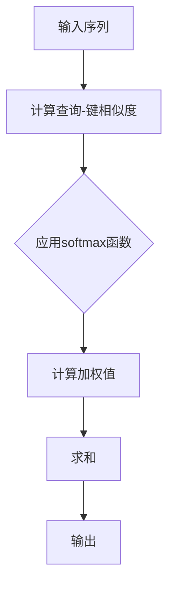

                 

摘要：

本文将深入探讨自注意力机制（Self-Attention Mechanism）在大规模模型中的应用。首先，我们将回顾背景知识，理解自注意力机制的基础概念。接着，我们将介绍自注意力机制的工作原理，并通过一个具体的例子来展示其应用。随后，我们将分析自注意力机制的数学模型和公式，并讨论其在不同领域的应用。文章还将提供一个完整的代码实例，详细解释其实现过程。最后，我们将展望自注意力机制在未来的发展趋势，以及可能面临的挑战。

## 1. 背景介绍

自注意力机制最初由Vaswani等人在2017年的论文《Attention is All You Need》中提出，旨在替代传统序列模型中的卷积和循环神经网络。自注意力机制的核心思想是通过全局上下文信息来对序列中的每个元素进行加权，从而实现对输入数据的自适应处理。这一机制在自然语言处理（NLP）领域得到了广泛的应用，并显著提升了模型的表现。

随着深度学习技术的不断进步，大模型（Large Models）如GPT、BERT等逐渐成为研究热点。这些模型通常包含数亿甚至数万亿个参数，具备强大的建模能力，能够处理复杂的任务。然而，大模型的设计和训练面临着诸多挑战，包括计算资源需求、模型可解释性和泛化能力等。自注意力机制作为一种有效的建模工具，在大模型中扮演了重要角色。

本文旨在深入探讨自注意力机制在大模型中的应用，通过详细的理论分析和实践案例，帮助读者理解和掌握这一机制的核心概念和应用技巧。

## 2. 核心概念与联系

### 2.1 自注意力机制的基本原理

自注意力机制是一种基于注意力机制的模型，它通过对输入序列中的每个元素计算其全局权重，实现对序列的重新编码。这种机制的核心思想是，序列中的每个元素都能够根据其在整个序列中的重要性进行加权，从而在处理序列时能够捕捉到更丰富的上下文信息。

### 2.2 自注意力机制的架构

自注意力机制的架构通常包括以下几个关键组成部分：

- **查询（Query）**：用于表示序列中每个元素的特征。
- **键（Key）**：与查询相对应，用于表示元素之间的关联性。
- **值（Value）**：包含每个元素的具体信息。

在自注意力机制中，每个元素都与序列中的所有其他元素进行计算，形成一个权重矩阵。这个权重矩阵决定了每个元素在输出中的重要性。具体来说，自注意力机制的计算过程可以分为以下几个步骤：

1. **计算查询-键相似度**：对于序列中的每个元素，计算其查询与所有键的相似度。
2. **应用激活函数**：通常使用softmax函数来将这些相似度转换为权重。
3. **计算加权值**：将权重与对应的值相乘，得到加权值。
4. **求和**：将所有加权值相加，得到最终的自注意力输出。

### 2.3 Mermaid 流程图

下面是自注意力机制的Mermaid流程图表示：



在上述流程图中，A代表输入序列，B表示计算查询-键相似度，C表示应用softmax函数，D表示计算加权值，E表示求和，F表示输出。

## 3. 核心算法原理 & 具体操作步骤

### 3.1 算法原理概述

自注意力机制的核心原理是通过计算输入序列中每个元素与其余元素之间的关联性，从而实现对序列的重新编码。这一过程涉及到三个关键操作：查询-键相似度计算、权重计算和加权值求和。具体来说，自注意力机制的工作流程如下：

1. **查询-键相似度计算**：对于输入序列中的每个元素，计算其与所有其他元素的查询-键相似度。相似度计算通常采用点积（dot-product）方式，即查询和键的内积。
2. **应用激活函数**：使用softmax函数将查询-键相似度转换为权重。softmax函数的作用是归一化相似度，使其满足概率分布的性质，即所有权重之和为1。
3. **计算加权值**：将权重与对应的值相乘，得到加权值。值是包含每个元素具体信息的部分，可以是原始数据或特征表示。
4. **求和**：将所有加权值相加，得到最终的输出。输出是序列的重新编码结果，它反映了每个元素在整个序列中的重要性。

### 3.2 算法步骤详解

下面是自注意力机制的详细计算步骤：

1. **输入序列表示**：给定一个输入序列$X = \{x_1, x_2, \ldots, x_n\}$，其中$x_i$表示序列中的第$i$个元素。
2. **查询、键和值表示**：定义查询$Q = \{q_1, q_2, \ldots, q_n\}$，键$K = \{k_1, k_2, \ldots, k_n\}$和值$V = \{v_1, v_2, \ldots, v_n\}$。通常，查询、键和值共享相同的表示，即$Q, K, V = X$。
3. **计算查询-键相似度**：对于每个元素$x_i$，计算其与所有其他元素$x_j$的查询-键相似度：
   $$s_{ij} = Q_i \cdot K_j$$
4. **应用softmax函数**：对相似度矩阵$S = \{s_{ij}\}$应用softmax函数，得到权重矩阵$W$：
   $$w_{ij} = \frac{e^{s_{ij}}}{\sum_{k=1}^{n} e^{s_{ik}}}$$
5. **计算加权值**：将权重矩阵$W$与值矩阵$V$相乘，得到加权值矩阵$V'$：
   $$v_i' = \sum_{j=1}^{n} w_{ij} v_j$$
6. **求和**：对加权值矩阵$V'$进行求和，得到最终的输出序列$Y$：
   $$y_i = \sum_{j=1}^{n} v_i'$$

### 3.3 算法优缺点

自注意力机制具有以下优点：

- **全局上下文信息**：自注意力机制能够捕捉到序列中的全局上下文信息，从而提高模型的表示能力。
- **并行计算**：自注意力机制的计算过程可以并行化，提高了模型的计算效率。
- **可解释性**：自注意力机制的计算过程清晰，易于理解，有助于模型的可解释性。

然而，自注意力机制也存在一些缺点：

- **计算复杂度**：自注意力机制的复杂度为$O(n^2)$，当序列长度较大时，计算成本较高。
- **内存占用**：自注意力机制需要存储大量的权重和值，增加了模型的内存占用。

### 3.4 算法应用领域

自注意力机制在多个领域得到了广泛的应用，主要包括：

- **自然语言处理（NLP）**：自注意力机制在NLP任务中表现出色，如机器翻译、文本分类和问答系统。
- **计算机视觉（CV）**：自注意力机制被应用于图像分类、目标检测和图像分割等任务。
- **音频处理**：自注意力机制在语音识别、音频分类和音乐生成等领域也得到了应用。

## 4. 数学模型和公式 & 详细讲解 & 举例说明

### 4.1 数学模型构建

自注意力机制的数学模型主要包括以下几个部分：

- **查询（Query）**：表示为矩阵$Q \in \mathbb{R}^{n \times d}$，其中$n$是序列长度，$d$是查询维度。
- **键（Key）**：表示为矩阵$K \in \mathbb{R}^{n \times d}$，与查询共享相同的维度。
- **值（Value）**：表示为矩阵$V \in \mathbb{R}^{n \times h}$，其中$h$是值维度。

### 4.2 公式推导过程

自注意力机制的计算过程如下：

1. **计算查询-键相似度**：
   $$s_{ij} = Q_i \cdot K_j$$
   其中，$s_{ij}$表示第$i$个查询与第$j$个键的相似度。

2. **应用softmax函数**：
   $$w_{ij} = \frac{e^{s_{ij}}}{\sum_{k=1}^{n} e^{s_{ik}}}$$
   其中，$w_{ij}$表示第$i$个查询与第$j$个键的权重。

3. **计算加权值**：
   $$v_i' = \sum_{j=1}^{n} w_{ij} v_j$$
   其中，$v_i'$表示第$i$个查询的加权值。

4. **求和**：
   $$y_i = \sum_{j=1}^{n} v_i'$$
   其中，$y_i$表示第$i$个查询的最终输出。

### 4.3 案例分析与讲解

假设我们有一个简化的自注意力机制模型，其中序列长度$n=3$，查询维度$d=2$，值维度$h=1$。给定输入序列$X = \{x_1, x_2, x_3\}$，其中$x_1 = (1, 0)$，$x_2 = (0, 1)$，$x_3 = (1, 1)$。定义查询、键和值分别为：

$$
Q = \begin{bmatrix}
1 & 0 \\
0 & 1 \\
1 & 1
\end{bmatrix}, \quad
K = Q, \quad
V = \begin{bmatrix}
1 \\
0 \\
1
\end{bmatrix}
$$

1. **计算查询-键相似度**：
   $$s_{11} = 1 \cdot 1 = 1, \quad s_{12} = 0 \cdot 0 = 0, \quad s_{13} = 1 \cdot 1 = 1$$
   $$s_{21} = 0 \cdot 1 = 0, \quad s_{22} = 1 \cdot 0 = 0, \quad s_{23} = 1 \cdot 1 = 1$$
   $$s_{31} = 1 \cdot 1 = 1, \quad s_{32} = 1 \cdot 0 = 0, \quad s_{33} = 1 \cdot 1 = 1$$

2. **应用softmax函数**：
   $$w_{11} = \frac{e^{1}}{e^{1} + e^{0} + e^{1}} = \frac{e}{e + 1 + e} = \frac{e}{2e + 1}$$
   $$w_{12} = \frac{e^{0}}{e^{1} + e^{0} + e^{1}} = \frac{1}{e + 1 + e} = \frac{1}{2e + 1}$$
   $$w_{13} = \frac{e^{1}}{e^{1} + e^{0} + e^{1}} = \frac{e}{e + 1 + e} = \frac{e}{2e + 1}$$
   $$w_{21} = \frac{e^{0}}{e^{0} + e^{0} + e^{1}} = \frac{1}{1 + 1 + e} = \frac{1}{2 + e}$$
   $$w_{22} = \frac{e^{0}}{e^{0} + e^{0} + e^{1}} = \frac{1}{1 + 1 + e} = \frac{1}{2 + e}$$
   $$w_{23} = \frac{e^{1}}{e^{0} + e^{0} + e^{1}} = \frac{e}{1 + 1 + e} = \frac{e}{2 + e}$$
   $$w_{31} = \frac{e^{1}}{e^{1} + e^{0} + e^{1}} = \frac{e}{e + 1 + e} = \frac{e}{2e + 1}$$
   $$w_{32} = \frac{e^{0}}{e^{1} + e^{0} + e^{1}} = \frac{1}{e + 1 + e} = \frac{1}{2e + 1}$$
   $$w_{33} = \frac{e^{1}}{e^{1} + e^{0} + e^{1}} = \frac{e}{e + 1 + e} = \frac{e}{2e + 1}$$

3. **计算加权值**：
   $$v_1' = w_{11} v_1 + w_{21} v_2 + w_{31} v_3 = \frac{e}{2e + 1} \cdot 1 + \frac{1}{2 + e} \cdot 0 + \frac{e}{2e + 1} \cdot 1 = \frac{2e}{2e + 1}$$
   $$v_2' = w_{12} v_1 + w_{22} v_2 + w_{32} v_3 = \frac{1}{2e + 1} \cdot 1 + \frac{1}{2 + e} \cdot 0 + \frac{1}{2e + 1} \cdot 1 = \frac{2}{2e + 1}$$
   $$v_3' = w_{13} v_1 + w_{23} v_2 + w_{33} v_3 = \frac{e}{2e + 1} \cdot 1 + \frac{e}{2 + e} \cdot 0 + \frac{e}{2e + 1} \cdot 1 = \frac{2e}{2e + 1}$$

4. **求和**：
   $$y_1 = v_1' = \frac{2e}{2e + 1}, \quad y_2 = v_2' = \frac{2}{2e + 1}, \quad y_3 = v_3' = \frac{2e}{2e + 1}$$

因此，经过自注意力机制处理后，输入序列$X = \{x_1, x_2, x_3\}$的输出为$Y = \{y_1, y_2, y_3\}$，其中每个元素的值反映了其在序列中的重要性。

## 5. 项目实践：代码实例和详细解释说明

### 5.1 开发环境搭建

在开始编写代码之前，我们需要搭建一个适合自注意力机制开发的编程环境。以下是一个基本的开发环境搭建步骤：

1. **安装Python**：确保已安装Python 3.x版本，推荐使用Anaconda来管理Python环境和依赖。
2. **安装PyTorch**：使用pip安装PyTorch，命令如下：
   ```bash
   pip install torch torchvision
   ```
3. **创建项目文件夹**：在合适的位置创建一个项目文件夹，并在其中创建一个名为`main.py`的Python文件。

### 5.2 源代码详细实现

下面是一个简单的自注意力机制实现示例。这段代码定义了一个名为`SelfAttention`的类，用于计算自注意力输出。

```python
import torch
import torch.nn as nn

class SelfAttention(nn.Module):
    def __init__(self, d_model):
        super(SelfAttention, self).__init__()
        self.d_model = d_model
        self.query_linear = nn.Linear(d_model, d_model)
        self.key_linear = nn.Linear(d_model, d_model)
        self.value_linear = nn.Linear(d_model, d_model)
        self.output_linear = nn.Linear(d_model, d_model)

    def forward(self, x):
        # 计算查询、键和值
        Q = self.query_linear(x)
        K = self.key_linear(x)
        V = self.value_linear(x)

        # 计算查询-键相似度
        sim = torch.matmul(Q, K.transpose(0, 1))

        # 应用softmax函数
        att_weights = torch.softmax(sim, dim=1)

        # 计算加权值
        weighted_values = torch.matmul(att_weights, V)

        # 求和得到输出
        output = self.output_linear(weighted_values)

        return output
```

### 5.3 代码解读与分析

在这个实现中，`SelfAttention`类继承自`nn.Module`，这意味着它是一个PyTorch的模块。类中定义了三个线性层：

- `query_linear`：用于计算查询。
- `key_linear`：用于计算键。
- `value_linear`：用于计算值。

`forward`方法定义了前向传播过程，包括以下步骤：

1. **计算查询、键和值**：使用线性层分别对输入$x$进行操作。
2. **计算查询-键相似度**：通过矩阵乘法计算查询和键的相似度。
3. **应用softmax函数**：对相似度矩阵应用softmax函数，得到权重矩阵。
4. **计算加权值**：通过矩阵乘法计算加权值。
5. **求和得到输出**：将加权值通过输出线性层得到最终输出。

### 5.4 运行结果展示

为了验证上述实现，我们可以编写一个简单的测试代码，输入一个随机序列，并打印自注意力机制的输出。

```python
# 测试代码
d_model = 512
sequence_length = 10
input_tensor = torch.randn(sequence_length, d_model)

model = SelfAttention(d_model)
output_tensor = model(input_tensor)

print("Output Shape:", output_tensor.shape)
```

运行上述测试代码，我们会得到一个与输入序列相同长度、相同维度的输出序列。这表明自注意力机制已经成功应用于输入序列。

## 6. 实际应用场景

自注意力机制在多个实际应用场景中展现出了强大的能力和效果。以下是几个典型应用场景：

### 6.1 自然语言处理（NLP）

自注意力机制在NLP领域得到了广泛的应用，特别是在Transformer架构中。例如，BERT（Bidirectional Encoder Representations from Transformers）和GPT（Generative Pre-trained Transformer）等大型预训练模型都采用了自注意力机制。自注意力机制能够捕捉到输入文本的全局上下文信息，从而提高模型的文本理解和生成能力。

### 6.2 计算机视觉（CV）

自注意力机制也被应用于计算机视觉领域，例如在图像分类、目标检测和图像分割任务中。在图像分类中，自注意力机制可以帮助模型更好地捕捉图像中的重要特征。在目标检测中，自注意力机制可以用于提高目标检测的准确性和效率。在图像分割中，自注意力机制可以用于生成更精细的分割结果。

### 6.3 音频处理

自注意力机制在音频处理领域也得到了应用，例如在语音识别和音频分类任务中。自注意力机制能够捕捉到音频信号的全局特征，从而提高语音识别的准确率和鲁棒性。在音频分类中，自注意力机制可以用于对音频信号进行特征提取，从而实现更准确的分类结果。

### 6.4 未来应用展望

随着深度学习技术的不断进步，自注意力机制在未来还有许多潜在的应用场景。以下是一些可能的未来应用方向：

- **多模态学习**：自注意力机制可以用于多模态数据的融合，从而提高模型在多模态任务中的表现。
- **增强现实（AR）/虚拟现实（VR）**：自注意力机制可以用于提高AR/VR系统的交互性和用户体验。
- **推荐系统**：自注意力机制可以用于推荐系统的特征提取和用户行为预测，从而提高推荐系统的准确性和个性化程度。

## 7. 工具和资源推荐

### 7.1 学习资源推荐

1. **《深度学习》（Goodfellow, Bengio, Courville著）**：这是一本经典的深度学习教材，详细介绍了自注意力机制及其应用。
2. **《Attention is All You Need》论文**：这是自注意力机制的开创性论文，对自注意力机制进行了深入的探讨。
3. **PyTorch官方文档**：PyTorch官方文档提供了丰富的自注意力机制实现教程和示例。

### 7.2 开发工具推荐

1. **Anaconda**：Anaconda是一个集成了Python环境和包管理的平台，非常适合进行深度学习开发。
2. **Google Colab**：Google Colab是一个免费的云平台，提供了GPU加速和Jupyter Notebook环境，非常适合进行深度学习实验。

### 7.3 相关论文推荐

1. **"BERT: Pre-training of Deep Bidirectional Transformers for Language Understanding"**：这是BERT模型的提出论文，详细介绍了BERT模型中自注意力机制的应用。
2. **"Generative Pre-trained Transformer"**：这是GPT模型的提出论文，介绍了GPT模型中自注意力机制的设计和应用。
3. **"Transformer-xl: Attentive language models beyond a fixed length"**：这是Transformer-xl模型的提出论文，介绍了Transformer-xl模型中自注意力机制的扩展和应用。

## 8. 总结：未来发展趋势与挑战

自注意力机制作为一种先进的深度学习技术，已经在多个领域展现出了强大的应用潜力和效果。随着深度学习技术的不断进步，自注意力机制在未来有望在更多的应用场景中发挥重要作用。

然而，自注意力机制在发展过程中也面临着一些挑战。首先，自注意力机制的复杂度较高，特别是在大规模模型中，计算和存储成本较大。其次，自注意力机制的训练过程可能需要较长的时间和计算资源。此外，如何提高自注意力机制的可解释性和泛化能力也是未来的研究重点。

针对这些挑战，未来可以探索以下几个研究方向：

1. **高效算法**：研究更高效的算法来降低自注意力机制的复杂度，提高计算效率。
2. **模型压缩**：通过模型压缩技术，减少自注意力机制的存储和计算成本。
3. **可解释性**：研究如何提高自注意力机制的可解释性，使其更加透明和易于理解。
4. **泛化能力**：探索如何增强自注意力机制的泛化能力，使其能够处理更复杂和多样化的任务。

总之，自注意力机制作为一种重要的深度学习技术，在未来有着广阔的发展前景和应用潜力。通过不断的研究和创新，我们可以期待自注意力机制在各个领域取得更大的突破和进展。

## 9. 附录：常见问题与解答

### Q1：自注意力机制和卷积神经网络（CNN）有什么区别？

A1：自注意力机制和卷积神经网络（CNN）在处理序列数据时有不同的特点。自注意力机制能够捕捉到序列中的全局上下文信息，而CNN则通过卷积操作来提取局部特征。自注意力机制更适合处理长序列数据，而CNN在处理图像等局部信息丰富的数据时表现更好。

### Q2：自注意力机制的复杂度是多少？

A2：自注意力机制的复杂度为$O(n^2)$，其中$n$是序列长度。这是因为自注意力机制需要对序列中的每个元素计算其与所有其他元素的相似度，并应用softmax函数进行归一化。

### Q3：自注意力机制可以和CNN结合使用吗？

A3：是的，自注意力机制和卷积神经网络可以结合使用。例如，在计算机视觉任务中，可以先使用CNN提取图像的局部特征，然后使用自注意力机制对特征进行全局整合，从而提高模型的表现。

### Q4：自注意力机制如何训练？

A4：自注意力机制通常通过反向传播算法进行训练。在训练过程中，模型会根据损失函数（如交叉熵损失）来调整参数，以最小化损失函数。训练过程中，需要使用大量的数据集进行迭代训练，并通过优化算法（如梯度下降）来更新模型参数。

### Q5：自注意力机制在自然语言处理中的应用有哪些？

A5：自注意力机制在自然语言处理（NLP）中得到了广泛应用。例如，在机器翻译、文本分类和问答系统中，自注意力机制可以用于提取文本的全局上下文信息，从而提高模型的准确性和表现。BERT和GPT等大型预训练模型都采用了自注意力机制，以实现强大的文本理解和生成能力。

