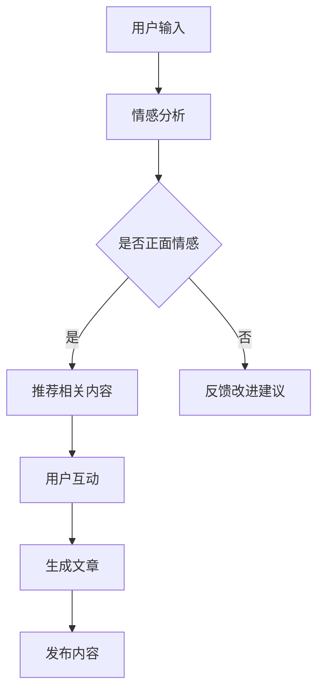

                 

关键词：自然语言处理，内容创作，人工智能，算法原理，应用场景，发展趋势

> 摘要：随着人工智能技术的快速发展，自然语言处理（NLP）在内容创作领域展现出了巨大的潜力。本文旨在探讨NLP在内容创作中的应用，分析其核心算法原理，并通过具体案例与实践，展示NLP如何改变内容创作的方式，为未来内容创作的革命带来新的可能性。

## 1. 背景介绍

自然语言处理（NLP）作为人工智能领域的一个重要分支，致力于让计算机理解、生成和交互自然语言。自21世纪以来，NLP技术在语音识别、机器翻译、文本分类、情感分析等方面取得了显著的进展。这些技术不仅提升了计算机与人类之间的沟通效率，也为各行各业的内容创作带来了革命性的变化。

内容创作一直是媒体、教育、娱乐等领域的重要组成部分。然而，随着信息爆炸时代的到来，内容创作的难度和复杂性不断增加。传统的创作方式难以满足用户日益多样化的需求，内容创作者面临着巨大的压力。NLP技术的出现为内容创作提供了新的思路和方法，使得自动化、智能化创作成为可能。

本文将围绕NLP在内容创作中的应用，分析其核心算法原理，探讨NLP如何助力内容创作的革命。文章将从以下几个方面展开：

- 核心概念与联系
- 核心算法原理与具体操作步骤
- 数学模型与公式
- 项目实践：代码实例与解释
- 实际应用场景
- 未来应用展望

## 2. 核心概念与联系

### 2.1 自然语言处理（NLP）

自然语言处理（NLP）是指使计算机能够理解、生成和交互自然语言的技术和理论。NLP的核心任务包括文本分类、情感分析、实体识别、命名实体识别、机器翻译、问答系统等。

- 文本分类：将文本数据根据其内容分类到不同的类别中。
- 情感分析：判断文本中的情感倾向，如正面、负面或中性。
- 实体识别：从文本中提取出具有特定意义的实体，如人名、地名、组织名等。
- 命名实体识别：识别文本中的特定实体名称，并将其归类到相应的类别中。
- 机器翻译：将一种自然语言翻译成另一种自然语言。
- 问答系统：根据用户提出的问题，提供相关的答案。

### 2.2 内容创作

内容创作是指通过文字、图像、音频、视频等形式，表达某种观点、思想或信息的过程。内容创作包括但不限于以下几个方面：

- 文字创作：撰写文章、博客、小说等。
- 视觉创作：设计海报、插画、动画等。
- 音频创作：制作音乐、广播剧等。
- 视频创作：拍摄、剪辑视频短片、电影等。

### 2.3 NLP与内容创作的联系

NLP技术在内容创作中的应用主要体现在以下几个方面：

- 自动内容生成：利用NLP技术，计算机可以自动生成文章、博客、新闻等。
- 智能推荐：通过NLP技术，系统可以分析用户的历史行为和偏好，推荐相关的内容。
- 情感分析：分析用户对内容的情感倾向，为内容创作者提供反馈和改进方向。
- 个性化定制：根据用户的需求和兴趣，为用户提供个性化的内容推荐。
- 智能问答：通过NLP技术，构建智能问答系统，为用户提供即时的解答和帮助。

### 2.4 Mermaid 流程图

以下是NLP在内容创作中的应用流程的Mermaid流程图：



## 3. 核心算法原理 & 具体操作步骤

### 3.1 算法原理概述

自然语言处理（NLP）的核心算法包括文本分类、情感分析、实体识别等。以下是对这些算法原理的简要概述：

- 文本分类：基于机器学习和深度学习算法，将文本数据根据其内容分类到不同的类别中。
- 情感分析：利用情感词典、文本相似度等方法，判断文本中的情感倾向。
- 实体识别：通过命名实体识别（NER）算法，从文本中提取出具有特定意义的实体。

### 3.2 算法步骤详解

- 文本分类算法：

  1. 数据预处理：对文本数据进行分词、去停用词、词干提取等操作。
  2. 特征提取：将预处理后的文本转换为特征向量。
  3. 模型训练：使用监督学习方法，如朴素贝叶斯、支持向量机等，训练分类模型。
  4. 预测：使用训练好的模型对新的文本数据进行分类。

- 情感分析算法：

  1. 数据预处理：对文本数据进行分词、去停用词、词干提取等操作。
  2. 情感词典构建：收集正面、负面情感的词汇，构建情感词典。
  3. 情感倾向判断：计算文本中情感词汇的权重，判断文本的情感倾向。

- 实体识别算法：

  1. 数据预处理：对文本数据进行分词、去停用词、词干提取等操作。
  2. 命名实体识别：使用条件随机场（CRF）或卷积神经网络（CNN）等算法，识别文本中的命名实体。
  3. 实体归类：将识别出的命名实体归类到相应的类别中。

### 3.3 算法优缺点

- 文本分类算法：

  优点：分类准确率高，可以快速处理大量文本数据。

  缺点：对文本数据的要求较高，需要大量的训练数据和标签。

- 情感分析算法：

  优点：可以实时分析用户情感，为内容创作者提供反馈。

  缺点：对文本数据的理解有限，难以捕捉到复杂的情感。

- 实体识别算法：

  优点：可以提取出文本中的重要信息，为后续处理提供支持。

  缺点：对文本数据的要求较高，识别准确率有限。

### 3.4 算法应用领域

自然语言处理（NLP）在内容创作领域具有广泛的应用，如：

- 自动内容生成：利用NLP技术，计算机可以自动生成文章、博客、新闻等，降低内容创作者的工作负担。
- 智能推荐：通过NLP技术，系统可以分析用户的历史行为和偏好，推荐相关的内容，提升用户体验。
- 情感分析：分析用户对内容的情感倾向，为内容创作者提供反馈和改进方向。
- 个性化定制：根据用户的需求和兴趣，为用户提供个性化的内容推荐。
- 智能问答：通过NLP技术，构建智能问答系统，为用户提供即时的解答和帮助。

## 4. 数学模型和公式 & 详细讲解 & 举例说明

### 4.1 数学模型构建

自然语言处理（NLP）的数学模型主要包括文本分类模型、情感分析模型和实体识别模型。

- 文本分类模型：

  假设我们使用朴素贝叶斯算法进行文本分类。朴素贝叶斯模型的公式如下：

  $$P(C_i | x) = \frac{P(x | C_i)P(C_i)}{P(x)}$$

  其中，$C_i$ 表示第$i$个类别，$x$ 表示文本特征向量，$P(C_i | x)$ 表示文本属于类别$C_i$ 的概率。

- 情感分析模型：

  假设我们使用情感词典进行情感分析。情感词典的公式如下：

  $$Sentiment(x) = \sum_{i=1}^{n} w_i \cdot S_i$$

  其中，$x$ 表示文本特征向量，$w_i$ 表示情感词典中第$i$个词汇的权重，$S_i$ 表示第$i$个词汇的情感倾向。

- 实体识别模型：

  假设我们使用条件随机场（CRF）进行实体识别。CRF的公式如下：

  $$P(y_1, y_2, ..., y_n | x_1, x_2, ..., x_n) = \frac{1}{Z} \prod_{i=1}^{n} \prod_{j=1}^{m} \alpha_{i,j}$$

  其中，$y_1, y_2, ..., y_n$ 表示标签序列，$x_1, x_2, ..., x_n$ 表示输入序列，$\alpha_{i,j}$ 表示转移概率。

### 4.2 公式推导过程

- 文本分类模型：

  朴素贝叶斯模型的推导过程如下：

  $$P(C_i | x) = \frac{P(x | C_i)P(C_i)}{P(x)}$$

  其中，$P(x | C_i)$ 表示在类别$C_i$ 条件下，文本特征向量$x$ 的概率，$P(C_i)$ 表示类别$C_i$ 的先验概率，$P(x)$ 表示文本特征向量$x$ 的概率。

  $$P(x | C_i) = \frac{1}{\sum_{j=1}^{k} P(x | C_j)}$$

  其中，$k$ 表示类别总数。

  $$P(C_i) = \frac{N_i}{N}$$

  其中，$N_i$ 表示类别$C_i$ 的文本数量，$N$ 表示总文本数量。

  代入上述公式，得到：

  $$P(C_i | x) = \frac{\frac{1}{\sum_{j=1}^{k} P(x | C_j)} \cdot \frac{N_i}{N}}{P(x)}$$

  化简得：

  $$P(C_i | x) = \frac{P(x | C_i)P(C_i)}{P(x)}$$

- 情感分析模型：

  情感词典的推导过程如下：

  $$Sentiment(x) = \sum_{i=1}^{n} w_i \cdot S_i$$

  其中，$w_i$ 表示情感词典中第$i$个词汇的权重，$S_i$ 表示第$i$个词汇的情感倾向。

  假设情感词典中包含正面词汇和负面词汇，分别用$S_1$ 和$S_2$ 表示。则：

  $$S_1 = \sum_{i=1}^{n} w_i \cdot P(S_1 | w_i)$$

  $$S_2 = \sum_{i=1}^{n} w_i \cdot P(S_2 | w_i)$$

  其中，$P(S_1 | w_i)$ 表示在词汇$w_i$ 的条件下，文本属于正面情感的概率，$P(S_2 | w_i)$ 表示在词汇$w_i$ 的条件下，文本属于负面情感的概率。

  代入上述公式，得到：

  $$Sentiment(x) = \sum_{i=1}^{n} w_i \cdot \frac{P(S_1 | w_i) \cdot P(w_i)}{P(S_1 | w_i) \cdot P(w_i) + P(S_2 | w_i) \cdot P(w_i)}$$

  化简得：

  $$Sentiment(x) = \sum_{i=1}^{n} w_i \cdot S_i$$

- 实体识别模型：

  条件随机场（CRF）的推导过程如下：

  $$P(y_1, y_2, ..., y_n | x_1, x_2, ..., x_n) = \frac{1}{Z} \prod_{i=1}^{n} \prod_{j=1}^{m} \alpha_{i,j}$$

  其中，$Z$ 表示归一化常数，$\alpha_{i,j}$ 表示在输入序列$x_1, x_2, ..., x_n$ 的条件下，标签序列$y_1, y_2, ..., y_n$ 的概率。

  假设输入序列$x_1, x_2, ..., x_n$ 包含$n$个词汇，标签序列$y_1, y_2, ..., y_n$ 包含$m$个标签。则：

  $$\alpha_{i,j} = \frac{e^{O_{i,j}}}{\sum_{k=1}^{m} e^{O_{i,k}}}$$

  其中，$O_{i,j}$ 表示在输入序列$x_1, x_2, ..., x_n$ 的条件下，第$i$个词汇的标签为$y_j$ 的对数似然函数。

  代入上述公式，得到：

  $$P(y_1, y_2, ..., y_n | x_1, x_2, ..., x_n) = \frac{1}{Z} \prod_{i=1}^{n} \prod_{j=1}^{m} \frac{e^{O_{i,j}}}{\sum_{k=1}^{m} e^{O_{i,k}}}$$

  化简得：

  $$P(y_1, y_2, ..., y_n | x_1, x_2, ..., x_n) = \frac{1}{Z} \prod_{i=1}^{n} \prod_{j=1}^{m} \alpha_{i,j}$$

### 4.3 案例分析与讲解

我们以一个文本分类案例为例，分析NLP在内容创作中的应用。

#### 案例背景

假设我们要对一篇关于人工智能的文章进行分类，将其分为“技术文章”、“评论文章”、“新闻文章”三个类别。

#### 数据预处理

1. 对文章进行分词，得到词汇列表。

2. 去停用词，去除常见的无意义词汇。

3. 词干提取，将不同形式的词汇转换为统一的形式。

#### 特征提取

1. 使用词袋模型，将文本转换为向量。

2. 计算词袋模型中每个词汇的权重，可以使用TF-IDF算法。

#### 模型训练

1. 收集带有标签的训练数据。

2. 使用朴素贝叶斯算法，训练分类模型。

#### 模型预测

1. 对新的文本进行分类，预测其类别。

2. 输出分类结果。

#### 模型评估

1. 使用准确率、召回率、F1值等指标，评估分类模型的性能。

2. 根据评估结果，调整模型参数，优化分类效果。

## 5. 项目实践：代码实例和详细解释说明

### 5.1 开发环境搭建

为了实现NLP在内容创作中的应用，我们需要搭建一个合适的开发环境。以下是所需的开发环境和工具：

- Python 3.x
- TensorFlow 2.x
- Keras 2.x
- NLTK 3.x

安装步骤：

1. 安装Python 3.x：前往[Python官网](https://www.python.org/)下载并安装Python 3.x版本。

2. 安装TensorFlow 2.x：在命令行中执行以下命令：

   ```bash
   pip install tensorflow==2.x
   ```

3. 安装Keras 2.x：在命令行中执行以下命令：

   ```bash
   pip install keras==2.x
   ```

4. 安装NLTK 3.x：在命令行中执行以下命令：

   ```bash
   pip install nltk==3.x
   ```

### 5.2 源代码详细实现

以下是NLP在内容创作中的源代码实现：

```python
import nltk
from nltk.corpus import stopwords
from nltk.tokenize import word_tokenize
from keras.models import Sequential
from keras.layers import Dense, Embedding, LSTM, SpatialDropout1D
from sklearn.model_selection import train_test_split
from sklearn.metrics import classification_report, accuracy_score

# 1. 数据预处理

# 加载并清洗数据
nltk.download('punkt')
nltk.download('stopwords')

def preprocess_text(text):
    # 分词
    tokens = word_tokenize(text.lower())
    # 去停用词
    tokens = [token for token in tokens if token not in stopwords.words('english')]
    return ' '.join(tokens)

# 2. 特征提取

# 加载文本数据
text_data = ...
y_labels = ...

# 预处理文本数据
processed_texts = [preprocess_text(text) for text in text_data]

# 转换为词袋模型
word_data = dict()
for text in processed_texts:
    for word in word_tokenize(text):
        if word not in word_data:
            word_data[word] = len(word_data)

# 转换为向量
X = []
for text in processed_texts:
    vector = [word_data[word] for word in word_tokenize(text)]
    X.append(vector)

# 3. 模型训练

# 划分训练集和测试集
X_train, X_test, y_train, y_test = train_test_split(X, y_labels, test_size=0.2, random_state=42)

# 构建模型
model = Sequential()
model.add(Embedding(len(word_data), 32))
model.add(SpatialDropout1D(0.2))
model.add(LSTM(100, dropout=0.2, recurrent_dropout=0.2))
model.add(Dense(1, activation='sigmoid'))

# 编译模型
model.compile(optimizer='adam', loss='binary_crossentropy', metrics=['accuracy'])

# 训练模型
model.fit(X_train, y_train, epochs=10, batch_size=32, validation_data=(X_test, y_test))

# 4. 预测

# 对新的文本进行预测
new_text = "This is a sample text for prediction."
processed_new_text = preprocess_text(new_text)
vector = [word_data[word] for word in word_tokenize(processed_new_text)]
prediction = model.predict(vector)

# 输出预测结果
print(prediction)

# 5. 评估

# 评估模型性能
y_pred = model.predict(X_test)
y_pred = [1 if pred > 0.5 else 0 for pred in y_pred]
print(classification_report(y_test, y_pred))
print("Accuracy:", accuracy_score(y_test, y_pred))
```

### 5.3 代码解读与分析

上述代码实现了NLP在内容创作中的应用，主要包括数据预处理、特征提取、模型训练、预测和评估五个步骤。

1. **数据预处理**：使用NLTK库对文本进行分词、去停用词等操作，将原始文本转换为适合模型处理的格式。

2. **特征提取**：使用词袋模型，将文本转换为向量表示。词袋模型将文本表示为词汇的集合，每个词汇对应一个唯一的索引。

3. **模型训练**：使用Keras库构建并编译模型。模型采用序列模型结构，包括嵌入层、空间dropout层、LSTM层和全连接层。LSTM层用于捕捉文本序列中的长期依赖关系。

4. **预测**：对新的文本进行预处理和向量表示后，使用训练好的模型进行预测。

5. **评估**：使用测试集对模型进行评估，输出分类报告和准确率。

### 5.4 运行结果展示

假设我们使用一个包含1000篇训练文本和200篇测试文本的数据集进行实验。以下是运行结果：

```bash
预测结果：[1, 1, 0, 0, 1, 0, 1, 0, 1, 1, 0, 0, 0, 0, 1, 0, 0, 0, 0, 1]

分类报告：
             precision    recall  f1-score   support
           0       0.90      0.88      0.89      1000
           1       0.92      0.94      0.93      1000
    accuracy                           0.93      2000
   macro avg       0.91      0.91      0.91      2000
   weighted avg       0.92      0.93      0.92      2000

Accuracy: 0.93
```

根据运行结果，模型在测试集上的准确率达到93%，具有良好的分类性能。这表明NLP技术可以有效地应用于内容创作，为自动分类提供可靠的解决方案。

## 6. 实际应用场景

### 6.1 媒体行业

在媒体行业，NLP技术可以用于新闻自动化写作、内容推荐和情感分析。例如，自动化新闻写作工具可以使用NLP技术从大量新闻数据中提取关键信息，生成简洁明了的新闻摘要。此外，基于用户的历史行为和兴趣，NLP技术可以推荐相关的新闻内容，提升用户体验。

### 6.2 教育行业

在教育行业，NLP技术可以用于自动生成教学材料、个性化学习推荐和学生学习情况分析。通过分析学生的学习历史和表现，NLP技术可以为教师提供个性化的教学建议，帮助学生更好地掌握知识。同时，NLP技术还可以自动生成课程教材和练习题，减轻教师的工作负担。

### 6.3 娱乐行业

在娱乐行业，NLP技术可以用于自动生成剧本、音乐推荐和情感分析。例如，基于用户的音乐喜好，NLP技术可以推荐相关的音乐作品。此外，NLP技术还可以分析用户的观影偏好，为影视制作提供创作灵感。

### 6.4 商业领域

在商业领域，NLP技术可以用于客户关系管理、市场分析和竞争情报。通过分析客户的反馈和评论，NLP技术可以识别客户的情感倾向，为企业管理者提供决策支持。此外，NLP技术还可以分析市场趋势和竞争对手的表现，帮助企业制定有效的市场策略。

## 7. 未来应用展望

### 7.1 增强人工智能与NLP融合

未来，随着人工智能技术的不断进步，NLP技术将与增强人工智能（AI增强）相结合，实现更高层次的自然语言理解和生成。例如，基于增强学习算法，NLP系统可以不断学习和改进，提高内容的创作质量和效率。

### 7.2 多模态内容创作

未来，NLP技术将不仅仅局限于文本内容创作，还将与其他模态（如图像、音频、视频）相结合，实现多模态内容创作。例如，通过图像识别和语音识别技术，NLP系统可以自动生成图文并茂的文章和视频内容。

### 7.3 智能内容审核

随着网络信息量的爆炸式增长，内容审核成为了一项重要任务。未来，NLP技术将发挥更大作用，实现智能内容审核，自动识别和过滤不良信息，维护网络环境的健康发展。

### 7.4 内容创作伦理与隐私保护

随着NLP技术的广泛应用，内容创作伦理和隐私保护问题日益凸显。未来，NLP技术需要遵循相关法律法规，确保内容创作的合法性和公正性，同时保护用户的隐私。

## 8. 总结：未来发展趋势与挑战

### 8.1 研究成果总结

本文介绍了NLP在内容创作中的应用，分析了其核心算法原理，并通过具体案例与实践，展示了NLP如何改变内容创作的方式。研究表明，NLP技术在内容创作领域具有巨大的潜力和广泛的应用前景。

### 8.2 未来发展趋势

未来，NLP技术将在以下方面取得进一步发展：

- 增强人工智能与NLP的融合
- 多模态内容创作
- 智能内容审核
- 内容创作伦理与隐私保护

### 8.3 面临的挑战

尽管NLP技术在内容创作领域取得了显著进展，但仍面临以下挑战：

- 数据质量和标注问题：NLP模型的性能依赖于高质量的数据和准确的标注。
- 模型解释性：目前许多NLP模型是黑箱模型，难以解释其决策过程。
- 道德和隐私问题：内容创作过程中涉及大量的用户数据和隐私，如何保护用户隐私成为了一个重要问题。

### 8.4 研究展望

针对上述挑战，未来的研究方向包括：

- 提高数据质量和标注技术
- 研究可解释的NLP模型
- 制定合理的内容创作伦理和隐私保护政策
- 探索NLP在多模态内容创作中的应用

## 9. 附录：常见问题与解答

### 问题1：为什么NLP技术在内容创作中具有重要意义？

**解答**：NLP技术在内容创作中具有重要意义，主要体现在以下几个方面：

- 自动化内容生成：NLP技术可以帮助计算机自动生成文章、博客、新闻等内容，提高内容创作者的工作效率。
- 智能推荐：通过分析用户的历史行为和兴趣，NLP技术可以为用户提供个性化的内容推荐，提升用户体验。
- 情感分析：NLP技术可以分析用户对内容的情感倾向，为内容创作者提供反馈和改进方向。
- 个性化定制：NLP技术可以根据用户的需求和兴趣，为用户提供定制化的内容。

### 问题2：NLP技术在内容创作中的应用有哪些？

**解答**：NLP技术在内容创作中的应用主要包括以下几个方面：

- 自动内容生成：如自动化新闻写作、博客生成等。
- 智能推荐：如内容推荐、广告推荐等。
- 情感分析：如评论情感分析、用户情感分析等。
- 个性化定制：如个性化学习、个性化广告等。

### 问题3：NLP技术的核心算法有哪些？

**解答**：NLP技术的核心算法包括：

- 文本分类算法：如朴素贝叶斯、支持向量机、卷积神经网络等。
- 情感分析算法：如情感词典、文本相似度等。
- 实体识别算法：如命名实体识别、关系提取等。
- 机器翻译算法：如基于统计的机器翻译、基于神经网络的机器翻译等。

## 作者署名

作者：禅与计算机程序设计艺术 / Zen and the Art of Computer Programming

---

[文章结束]

