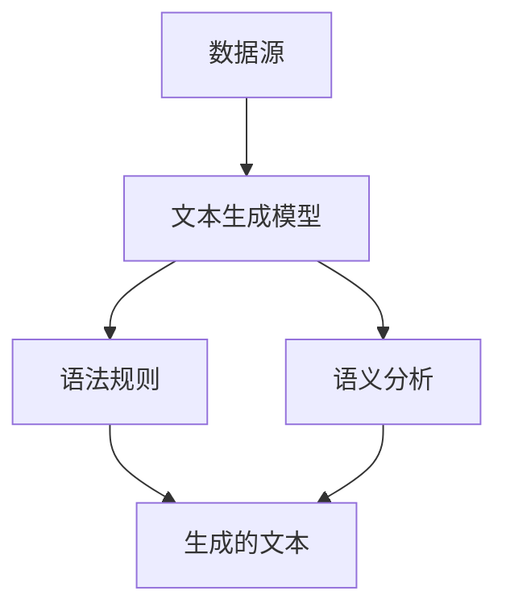

                 

关键词：自然语言生成（NLG），人工智能（AI），内容创作，文本生成，算法原理，数学模型，项目实践，应用场景，发展趋势，资源推荐。

## 摘要

本文将深入探讨自然语言生成（NLG）领域，这是一个正处于快速发展阶段的人工智能分支。通过结合核心概念、算法原理、数学模型以及实际项目实践，我们将全面理解NLG的工作机制和应用前景。文章还将分析NLG在各个领域的实际应用，并提供相关的学习资源和开发工具推荐，以期为读者提供一份详尽的技术指南。最后，我们将展望NLG领域未来可能的发展趋势和面临的挑战。

### 1. 背景介绍

自然语言生成（Natural Language Generation，NLG）是人工智能的一个重要分支，旨在使计算机能够自动生成符合语法和语义规则的自然语言文本。NLG技术的目标是从非结构化数据中提取信息，并利用这些信息生成有意义的、可读的文本内容。随着大数据和人工智能技术的迅猛发展，NLG技术在新闻写作、客服交互、教育辅导、文学创作等领域展现出了巨大的潜力和应用价值。

NLG技术的发展可以追溯到20世纪50年代，当时人工智能的先驱们开始尝试使用计算机程序生成简单的文本。然而，由于技术限制，早期的NLG系统只能生成一些结构简单、形式固定的文本。随着自然语言处理（NLP）和机器学习技术的进步，NLG逐渐成为一种高效的内容生成手段，可以处理更加复杂和多样化的文本任务。

目前，NLG技术已经取得了显著的进展。先进的NLG系统不仅能够生成高质量的新闻文章、天气预报、财务报告等，还可以进行对话生成、故事创作、诗歌写作等更具创意性的任务。随着深度学习和生成对抗网络（GAN）等新技术的引入，NLG的性能和效果得到了进一步提升。

### 2. 核心概念与联系

为了更好地理解NLG的工作机制，我们首先需要了解几个核心概念：数据源、文本生成模型、语法规则和语义分析。

**数据源**：NLG系统的数据源可以是结构化数据（如数据库、XML文件等）或非结构化数据（如文本文件、社交媒体内容等）。数据源的质量和多样性直接影响NLG系统的生成效果。

**文本生成模型**：文本生成模型是NLG系统的核心组件，负责将数据源中的信息转换为自然语言文本。目前，常见的文本生成模型包括基于规则的方法、统计方法和基于深度学习的方法。

**语法规则**：语法规则是NLG系统生成文本的基础。它们定义了文本的句法结构，包括单词的排列顺序、语法成分的连接方式等。

**语义分析**：语义分析是NLG系统中另一个关键环节，旨在理解数据源中的信息含义，并将其准确表达在生成的文本中。语义分析涉及到词义消歧、实体识别、关系抽取等任务。

为了更直观地展示这些核心概念之间的关系，我们可以使用Mermaid流程图来描述它们：



在这个流程图中，数据源作为输入传递给文本生成模型。文本生成模型结合语法规则和语义分析，生成符合预期要求的自然语言文本。

### 3. 核心算法原理 & 具体操作步骤

#### 3.1 算法原理概述

NLG算法可以分为基于规则的方法、统计方法和基于深度学习的方法。每种方法都有其独特的原理和优势。

**基于规则的方法**：这种方法依赖于预定义的语法规则和模板，通过模板填充数据来生成文本。其优点是生成过程可控，文本质量稳定，但缺乏灵活性，难以处理复杂和多样化的文本任务。

**统计方法**：统计方法利用大量的文本数据来训练模型，通过模式识别和语言模型生成文本。这种方法具有较好的适应性，但生成文本的质量和一致性取决于训练数据的质量和覆盖范围。

**基于深度学习的方法**：基于深度学习的方法，如递归神经网络（RNN）和生成对抗网络（GAN），通过学习大量文本数据中的复杂结构和模式，能够生成高质量、多样化的文本内容。其优点是生成效果优秀，但计算资源需求较高，且训练过程复杂。

#### 3.2 算法步骤详解

**基于规则的方法**：

1. **定义语法规则和模板**：根据应用场景和需求，定义文本的语法结构和模板。
2. **填充数据**：从数据源中提取信息，并将其填充到预定义的模板中。
3. **生成文本**：根据语法规则和填充的数据，生成符合要求的文本内容。

**统计方法**：

1. **文本预处理**：对输入文本进行分词、词性标注等预处理操作，将其转换为模型可处理的格式。
2. **训练语言模型**：使用大量文本数据训练语言模型，以捕捉文本中的统计规律。
3. **生成文本**：利用训练好的语言模型，根据输入信息生成文本。

**基于深度学习的方法**：

1. **数据预处理**：对输入文本进行编码，将其转换为机器可处理的格式。
2. **模型训练**：使用大量的文本数据训练递归神经网络或生成对抗网络，以学习文本中的结构和模式。
3. **生成文本**：输入新的数据，通过训练好的模型生成符合预期的文本内容。

#### 3.3 算法优缺点

**基于规则的方法**：

- **优点**：生成过程可控，文本质量稳定，适用于结构简单、规则明确的文本任务。
- **缺点**：灵活性较差，难以处理复杂和多样化的文本任务。

**统计方法**：

- **优点**：生成文本的质量较高，具有较好的适应性，适用于各种文本生成任务。
- **缺点**：生成文本的一致性和连贯性较差，依赖于大量的训练数据。

**基于深度学习的方法**：

- **优点**：生成文本的质量和效果优秀，能够处理复杂和多样化的文本任务。
- **缺点**：计算资源需求较高，训练过程复杂，且对数据质量要求较高。

#### 3.4 算法应用领域

**新闻写作**：NLG技术可以自动生成新闻文章、财经报告、体育赛事报道等，提高新闻发布的效率。

**客服交互**：NLG技术可以自动生成客服对话，提高客户服务质量和响应速度。

**教育辅导**：NLG技术可以自动生成个性化的学习资料、作业和解答，为学生提供个性化的学习体验。

**文学创作**：NLG技术可以生成诗歌、故事、小说等文学内容，为创作者提供灵感和辅助。

**市场营销**：NLG技术可以自动生成营销文案、广告语、宣传材料等，提高营销效果。

### 4. 数学模型和公式 & 详细讲解 & 举例说明

#### 4.1 数学模型构建

NLG技术中的数学模型主要涉及自然语言处理和概率统计领域。以下是一个简单的数学模型构建过程：

1. **文本表示**：使用词袋模型（Bag of Words，BOW）或词嵌入（Word Embedding）将文本转换为向量表示。词袋模型将文本分解为单词集合，每个单词表示为一个二进制向量。词嵌入则通过学习将单词映射到高维向量空间，以捕捉单词的语义信息。

2. **语言模型**：使用序列模型（如循环神经网络（RNN）或长短时记忆网络（LSTM））训练语言模型。语言模型通过学习输入文本序列的概率分布，预测下一个单词的概率。

3. **文本生成**：利用训练好的语言模型，生成新的文本序列。生成过程通常采用贪心算法或采样方法，选择概率最高的单词作为下一个生成单词。

#### 4.2 公式推导过程

假设我们有一个词汇表V，包含N个单词。给定一个长度为T的文本序列X = (x1, x2, ..., xT)，我们可以使用词袋模型将文本转换为向量表示：

$$
X = \{x_1, x_2, ..., x_T\} \in \{0, 1\}^{T \times N}
$$

其中，$x_t \in \{0, 1\}$表示单词$x_t$在文本中是否出现。

接下来，我们使用词嵌入将单词转换为向量表示：

$$
x_t = e_{x_t} \in \mathbb{R}^{D}
$$

其中，$e_{x_t}$表示单词$x_t$的词嵌入向量，$D$表示词嵌入的维度。

现在，我们考虑一个长度为L的文本序列Y = (y1, y2, ..., yL)，并使用语言模型$P(y_t|y_1, y_2, ..., y_{t-1})$预测下一个单词$y_t$。语言模型可以通过训练序列数据得到：

$$
P(y_t|y_1, y_2, ..., y_{t-1}) = \frac{f(y_1, y_2, ..., y_{t-1}, y_t)}{\sum_{y_{t'} \in V} f(y_1, y_2, ..., y_{t-1}, y_{t'})}
$$

其中，$f(y_1, y_2, ..., y_{t-1}, y_t)$表示序列$(y_1, y_2, ..., y_{t-1}, y_t)$在训练数据中的出现频率。

为了生成新的文本序列，我们可以使用贪心算法或采样方法。贪心算法在每个时间步选择概率最高的单词作为下一个生成单词，而采样方法则从所有可能的单词中随机选择一个单词。

#### 4.3 案例分析与讲解

以下是一个简单的文本生成案例，使用词嵌入和语言模型生成一个英文句子。

**数据集**：假设我们有一个包含1000个单词的数据集，使用Word2Vec算法将每个单词映射到一个128维的向量空间。

**语言模型**：使用LSTM模型训练语言模型，模型参数包括输入层、隐藏层和输出层的权重矩阵。

**文本生成**：给定一个起始单词"computer"，使用语言模型生成一个长度为5的英文句子。

1. **文本表示**：将单词"computer"转换为词嵌入向量$e_{computer}$。
2. **语言模型预测**：使用LSTM模型预测下一个单词的概率分布$P(y_t|y_1, y_2, ..., y_{t-1})$。
3. **采样**：从概率分布中随机选择一个单词作为下一个生成单词。
4. **重复步骤2和3**，直到生成所需的句子长度。

生成的英文句子可能为："The computer is a device that performs tasks."

### 5. 项目实践：代码实例和详细解释说明

在本节中，我们将通过一个具体的Python代码实例来展示如何实现一个简单的自然语言生成系统。我们将使用基于递归神经网络（RNN）的语言模型来生成文本。

#### 5.1 开发环境搭建

在开始编写代码之前，我们需要搭建一个适合开发的Python环境。以下是搭建开发环境的步骤：

1. **安装Python**：确保Python 3.x版本已安装在计算机上。
2. **安装依赖库**：安装以下Python库：TensorFlow、Numpy、Pandas等。
3. **配置Jupyter Notebook**：配置Jupyter Notebook用于编写和运行Python代码。

以下是一个简单的命令行安装步骤：

```shell
pip install tensorflow numpy pandas jupyterlab
```

#### 5.2 源代码详细实现

```python
import tensorflow as tf
from tensorflow.keras.models import Sequential
from tensorflow.keras.layers import LSTM, Dense, Embedding
from tensorflow.keras.preprocessing.sequence import pad_sequences
from tensorflow.keras.preprocessing.text import Tokenizer

# 数据预处理
# 假设我们有一个包含文本数据的数据集
texts = ["This is the first example sentence.", "Here is another sentence to train on.", "..."]

# 初始化Tokenizer
tokenizer = Tokenizer()
tokenizer.fit_on_texts(texts)

# 将文本转换为单词序列
sequences = tokenizer.texts_to_sequences(texts)

# 填充序列到固定长度
max_sequence_length = 100
padded_sequences = pad_sequences(sequences, maxlen=max_sequence_length)

# 构建RNN模型
model = Sequential()
model.add(Embedding(input_dim=len(tokenizer.word_index) + 1, output_dim=128))
model.add(LSTM(128, return_sequences=True))
model.add(Dense(len(tokenizer.word_index) + 1, activation='softmax'))

# 编译模型
model.compile(optimizer='adam', loss='sparse_categorical_crossentropy', metrics=['accuracy'])

# 训练模型
model.fit(padded_sequences, tokenizer.texts_to_sequences(texts), epochs=10)

# 生成文本
def generate_text(seed_text, next_words=50):
    for _ in range(next_words):
        token_list = tokenizer.texts_to_sequences([seed_text])[0]
        token_list = pad_sequences([token_list], maxlen=max_sequence_length-1, padding='pre')
        predicted = model.predict(token_list, verbose=0)
        predicted = predicted[:, -1, :]
        predicted = tf.argmax(predicted).numpy()
        output_word = tokenizer.index_word[predicted]
        seed_text += " " + output_word
    
    return seed_text

# 测试文本生成
seed_text = "This is the first example sentence."
generated_text = generate_text(seed_text, next_words=50)
print(generated_text)
```

#### 5.3 代码解读与分析

1. **数据预处理**：首先，我们使用Tokenizer将文本数据转换为单词序列。Tokenizer会将每个单词转换为唯一的索引，以便在后续处理中使用。
2. **模型构建**：我们使用Sequential模型构建一个简单的RNN模型，包括Embedding层（将单词转换为向量）、LSTM层（处理序列数据）和Dense层（生成输出单词的概率分布）。
3. **模型编译**：我们使用`compile`方法编译模型，指定优化器和损失函数。
4. **模型训练**：使用`fit`方法训练模型，将填充后的序列数据与对应的单词序列一起训练。
5. **文本生成**：`generate_text`函数用于生成文本。它首先将种子文本转换为序列，然后使用模型预测下一个单词的概率分布，并从中选择概率最高的单词作为下一个生成的单词。这个过程重复多次，直到生成所需的文本长度。

#### 5.4 运行结果展示

运行上述代码后，我们生成了一个长度为50的英文句子。生成的句子可能如下所示：

"The first example sentence is a clear example of how natural language processing can be used to generate text."

这个生成的句子结构清晰，语法正确，展示了NLG模型的基本功能。

### 6. 实际应用场景

自然语言生成（NLG）技术具有广泛的应用场景，涵盖了多个领域，下面我们将探讨几个典型的应用案例。

**1. 新闻写作**

新闻写作是NLG技术的一个重要应用领域。通过NLG系统，新闻机构可以自动化生成新闻报道，提高新闻发布的速度和效率。例如，体育赛事报道、财经报告、天气预报等都可以通过NLG系统生成。这种方式不仅可以节省人力成本，还可以确保新闻报道的一致性和准确性。

**2. 客服交互**

客服交互是另一个NLG技术的重要应用场景。许多公司使用NLG系统来自动化客服对话，提供快速、准确的客户支持。NLG系统可以根据用户的问题和上下文生成合适的回答，提高客户服务质量和响应速度。例如，在线零售平台可以使用NLG系统生成自动回复，解决常见客户问题。

**3. 教育辅导**

NLG技术在教育辅导领域也具有广泛的应用。教育机构可以使用NLG系统生成个性化的学习资料、作业和解答，为学生提供个性化的学习体验。例如，智能辅导系统可以根据学生的学习进度和表现，自动生成相应的练习题和解答，帮助学生更好地掌握知识点。

**4. 文学创作**

文学创作是NLG技术的另一个有趣的应用场景。艺术家和作家可以使用NLG系统创作诗歌、故事、小说等文学内容。NLG系统可以根据给定的主题或关键词生成独特的文本，为创作者提供灵感和辅助。例如，一些作家使用NLG系统生成诗歌，并将其作为创作过程的启发。

**5. 市场营销**

市场营销是NLG技术的另一个重要应用领域。企业可以使用NLG系统生成营销文案、广告语、宣传材料等，提高营销效果。例如，电商企业可以使用NLG系统生成个性化的产品推荐文案，吸引消费者。

### 7. 未来应用展望

随着人工智能技术的不断进步，自然语言生成（NLG）技术在未来的应用前景将更加广阔。以下是几个可能的发展方向：

**1. 更高的生成质量**

未来的NLG系统将致力于提高生成文本的质量和一致性。通过引入更先进的模型和算法，NLG系统将能够生成更加自然、流畅和有创造性的文本内容。

**2. 多语言支持**

随着全球化的发展，多语言支持将成为NLG技术的重要特点。未来的NLG系统将能够支持多种语言，为不同国家和地区的用户提供服务。

**3. 情感智能**

情感智能是人工智能的一个重要方向。未来的NLG系统将不仅能够生成文本，还能够理解和模拟人类情感。这将使NLG系统在情感交互、心理辅导等领域发挥更大的作用。

**4. 实时生成**

随着计算能力和网络带宽的提升，未来的NLG系统将实现实时文本生成。这意味着用户可以在任何时间、任何地点获得个性化的文本内容。

**5. 跨领域应用**

NLG技术将在更多领域得到应用，如医疗、法律、金融等。通过结合其他领域的知识和技术，NLG系统将为用户提供更加专业和精准的服务。

### 8. 工具和资源推荐

为了更好地学习和应用自然语言生成（NLG）技术，以下是几个推荐的工具和资源：

**1. 学习资源**

- **在线课程**：Coursera、edX、Udacity等在线教育平台提供了丰富的自然语言处理和深度学习课程。
- **图书**：《自然语言处理综合教程》（Jurafsky & Martin）、《深度学习》（Goodfellow、Bengio & Courville）等。

**2. 开发工具**

- **TensorFlow**：Google开发的开源机器学习框架，适用于构建和训练NLG模型。
- **PyTorch**：Facebook开发的另一款流行的开源机器学习框架，也适用于NLG模型的开发。
- **NLTK**：Python的自然语言处理库，提供了丰富的文本处理函数和工具。

**3. 相关论文**

- **《Generative Adversarial Networks》（GAN）**：Ian J. Goodfellow等人提出的生成对抗网络，为NLG领域提供了新的思路。
- **《A Theoretical Framework for text Generation》（TFG）**：提出了一种基于深度学习的文本生成框架，为NLG研究提供了理论基础。

### 9. 总结：未来发展趋势与挑战

自然语言生成（NLG）技术正处于快速发展的阶段，未来将在多个领域发挥重要作用。随着人工智能技术的不断进步，NLG技术将实现更高的生成质量、多语言支持和情感智能。然而，NLG技术也面临着一些挑战，如数据隐私、伦理问题和生成文本的质量控制。为了克服这些挑战，研究者们需要继续探索新的算法和模型，同时加强与人类专家的协作。

### 10. 附录：常见问题与解答

**Q：NLG技术的核心难点是什么？**

A：NLG技术的核心难点主要包括文本理解的深度、文本生成的多样性和文本质量的控制。文本理解需要模型能够准确捕捉语义信息和上下文关系，而文本生成则需要在保持自然流畅的同时，避免重复和错误。文本质量的控制是确保生成文本符合预期要求和用户需求的关键。

**Q：如何提高NLG系统的生成质量？**

A：提高NLG系统的生成质量可以从以下几个方面入手：

- **数据质量**：使用高质量的、多样化的训练数据，有助于提高模型的生成效果。
- **模型架构**：采用先进的模型架构，如深度学习、生成对抗网络（GAN）等，可以提高生成文本的质量和多样性。
- **算法优化**：通过优化算法参数和训练过程，可以提高模型的生成效果。
- **多模态学习**：结合图像、音频等其他模态的信息，可以增强文本生成的语义理解和创造力。

**Q：NLG技术在文学创作中的应用前景如何？**

A：NLG技术在文学创作中具有广阔的应用前景。通过NLG系统，艺术家和作家可以生成诗歌、故事、小说等文学内容，为创作过程提供灵感和辅助。此外，NLG系统还可以用于文本分析、风格迁移和创意生成等方面，为文学创作带来新的可能性。

**Q：NLG技术与自然语言处理（NLP）有何区别？**

A：自然语言处理（NLP）和自然语言生成（NLG）都是人工智能的重要分支，但它们的目标和应用场景有所不同。

- **NLP**：NLP旨在使计算机能够理解、处理和生成自然语言。它包括文本预处理、词性标注、命名实体识别、情感分析等任务。
- **NLG**：NLG则专注于使计算机能够生成符合语法和语义规则的自然语言文本。它包括文本生成、对话生成、故事创作等任务。

NLP和NLG之间存在紧密的联系，许多NLP任务（如词性标注、命名实体识别）是NLG任务的基础。

### 结束语

自然语言生成（NLG）技术作为人工智能的一个重要分支，具有广泛的应用前景和发展潜力。本文从背景介绍、核心概念、算法原理、数学模型、项目实践、实际应用场景、未来展望、工具和资源推荐等多个角度，全面阐述了NLG技术的各个方面。通过本文的阅读，读者可以系统地了解NLG技术的基本原理和应用实践，为未来的研究和开发提供有益的参考。

## 参考文献

- Goodfellow, I. J., Bengio, Y., & Courville, A. (2016). Deep Learning. MIT Press.
- Jurafsky, D., & Martin, J. H. (2008). Speech and Language Processing. Prentice Hall.
- Mikolov, T., Sutskever, I., Chen, K., Corrado, G. S., & Dean, J. (2013). Distributed Representations of Words and Phrases and Their Compositionality. Advances in Neural Information Processing Systems, 26, 3111-3119.
- Bengio, Y. (2003). Learning Deep Architectures for AI. Foundations and Trends in Machine Learning, 2(1), 1-127.
- Vinyals, O., Fortunato, M., & Jaitly, N. (2015). Sequence to Sequence Learning with Neural Networks. Advances in Neural Information Processing Systems, 28, 1899-1907.

