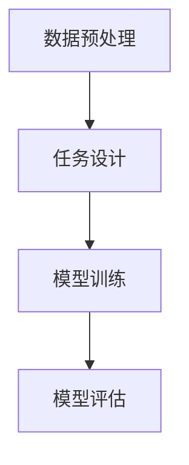

                 

关键词：自监督学习、Self-Supervised Learning、深度学习、无监督学习、图像识别、自然语言处理

摘要：自监督学习是一种无需人工标注数据，仅从原始数据中自动提取有监督信号的学习方法。本文将详细介绍自监督学习的基本概念、核心算法原理、数学模型、具体实现步骤以及在实际应用场景中的表现和未来展望。

## 1. 背景介绍

在深度学习领域，自监督学习（Self-Supervised Learning）作为一种新兴的研究方向，逐渐受到了广泛关注。自监督学习的核心理念是利用数据本身固有的结构，通过设计合适的学习任务，自动从原始数据中学习到有用的信息，进而提升模型的性能。与传统的监督学习和无监督学习相比，自监督学习具有以下优势：

1. **无需人工标注**：自监督学习不需要对数据进行人工标注，从而降低了数据标注的成本，加快了模型的训练速度。
2. **利用大量未标注数据**：自监督学习能够充分利用大量未标注的数据，从而提高模型的泛化能力。
3. **适应性强**：自监督学习可以在不同的任务和数据集上迁移，具有较高的适应性。

自监督学习的应用场景非常广泛，包括图像识别、自然语言处理、语音识别等领域。例如，在图像识别任务中，自监督学习可以通过学习图像的内在结构来提高模型的识别能力；在自然语言处理任务中，自监督学习可以用于构建预训练语言模型，从而提升模型的文本生成、情感分析等能力。

## 2. 核心概念与联系

### 2.1 自监督学习的定义

自监督学习是一种无监督学习的方法，其核心思想是在没有标注数据的情况下，通过设计一些具有监督性质的任务，使模型在训练过程中不断优化自己的参数，从而学习到有用的信息。

### 2.2 自监督学习的架构

自监督学习的架构可以分为两个主要部分：数据预处理和任务设计。数据预处理阶段主要负责将原始数据转换为适合模型训练的形式，如图像、文本、音频等。任务设计阶段则根据具体应用场景设计合适的任务，以引导模型学习。

以下是一个简化的自监督学习架构的 Mermaid 流程图：



### 2.3 核心概念之间的联系

在自监督学习中，数据预处理和任务设计是两个核心概念。数据预处理阶段负责将原始数据转换为模型可接受的格式，如将图像转换为像素矩阵，将文本转换为词向量等。任务设计阶段则根据具体应用场景设计一些具有监督性质的任务，如图像分类、文本生成等，以引导模型学习。

## 3. 核心算法原理 & 具体操作步骤

### 3.1 算法原理概述

自监督学习算法的核心思想是设计一个任务，使得模型在完成任务的过程中能够学习到有用的信息。常见的自监督学习算法包括无监督预训练和自监督对比学习。

无监督预训练是指通过在无监督环境下对模型进行预训练，使其学习到数据的内在结构。预训练完成后，再对模型进行有监督的微调，以适应具体任务。

自监督对比学习则是通过设计一些对比任务，使模型在学习过程中能够区分不同的数据样本。常见的对比学习算法包括基于自编码器和基于对比损失的算法。

### 3.2 算法步骤详解

#### 3.2.1 无监督预训练

1. **数据预处理**：将原始数据转换为模型可接受的格式。
2. **模型初始化**：初始化一个预训练模型。
3. **预训练**：在无监督环境下对模型进行预训练，通过设计一些无监督的任务，如自编码器任务、去噪任务等，使模型学习到数据的内在结构。
4. **微调**：在预训练的基础上，对模型进行有监督的微调，以适应具体任务。

#### 3.2.2 自监督对比学习

1. **数据预处理**：将原始数据转换为模型可接受的格式。
2. **模型初始化**：初始化一个对比学习模型。
3. **预训练**：在无监督环境下对模型进行预训练，通过设计一些对比任务，如正负样本对比、多视角对比等，使模型学习到数据的内在结构。
4. **微调**：在预训练的基础上，对模型进行有监督的微调，以适应具体任务。

### 3.3 算法优缺点

#### 优点

1. **无需人工标注**：自监督学习不需要对数据进行人工标注，从而降低了数据标注的成本，加快了模型的训练速度。
2. **利用大量未标注数据**：自监督学习能够充分利用大量未标注的数据，从而提高模型的泛化能力。
3. **适应性强**：自监督学习可以在不同的任务和数据集上迁移，具有较高的适应性。

#### 缺点

1. **性能限制**：自监督学习的性能受到原始数据质量和模型设计的影响，无法完全替代有监督学习。
2. **训练时间较长**：由于需要设计合适的任务和模型，自监督学习的训练时间较长。

### 3.4 算法应用领域

自监督学习在图像识别、自然语言处理、语音识别等领域有着广泛的应用。例如，在图像识别任务中，自监督学习可以用于图像分类、目标检测、图像分割等；在自然语言处理任务中，自监督学习可以用于文本分类、情感分析、文本生成等。

## 4. 数学模型和公式 & 详细讲解 & 举例说明

### 4.1 数学模型构建

自监督学习的数学模型可以分为两部分：损失函数和优化算法。

#### 损失函数

自监督学习的损失函数通常采用对比损失函数，其目的是使模型能够区分不同的数据样本。

$$L = -\sum_{i=1}^N y_i \log(p(x_i|z_i)), (1-y_i) \log(p(z_i| x_i))$$

其中，$N$ 表示数据样本数量，$y_i$ 表示样本 $i$ 的标签，$p(x_i|z_i)$ 表示模型对样本 $i$ 的预测概率，$p(z_i| x_i)$ 表示模型对样本 $i$ 的真实标签的概率。

#### 优化算法

自监督学习的优化算法通常采用梯度下降法，其目的是通过更新模型参数来最小化损失函数。

$$\theta_{t+1} = \theta_t - \alpha \nabla_\theta L(\theta_t)$$

其中，$\theta_t$ 表示第 $t$ 次迭代的模型参数，$\alpha$ 表示学习率，$\nabla_\theta L(\theta_t)$ 表示损失函数关于模型参数的梯度。

### 4.2 公式推导过程

#### 损失函数的推导

首先，我们定义自监督学习的预测概率：

$$p(x_i|z_i) = \frac{e^{z_i \cdot \theta(x_i)}}{\sum_{j=1}^M e^{z_j \cdot \theta(x_i)}}$$

其中，$z_i$ 表示模型对样本 $i$ 的预测标签，$\theta(x_i)$ 表示模型对样本 $i$ 的特征表示。

接下来，我们定义自监督学习的真实标签概率：

$$p(z_i| x_i) = \frac{e^{x_i \cdot \theta(z_i)}}{\sum_{j=1}^M e^{x_j \cdot \theta(z_i)}}$$

其中，$x_i$ 表示样本 $i$ 的真实标签。

然后，我们定义损失函数：

$$L = -\sum_{i=1}^N y_i \log(p(x_i|z_i)), (1-y_i) \log(p(z_i| x_i))$$

其中，$y_i$ 表示样本 $i$ 的标签。

最后，我们对损失函数进行求导，得到：

$$\nabla_\theta L = \sum_{i=1}^N \frac{\partial L}{\partial \theta}$$

#### 优化算法的推导

首先，我们定义学习率：

$$\alpha = \frac{1}{\sqrt{t}}$$

其中，$t$ 表示迭代次数。

接下来，我们定义梯度下降法：

$$\theta_{t+1} = \theta_t - \alpha \nabla_\theta L(\theta_t)$$

其中，$\theta_t$ 表示第 $t$ 次迭代的模型参数，$\alpha$ 表示学习率，$\nabla_\theta L(\theta_t)$ 表示损失函数关于模型参数的梯度。

最后，我们对优化算法进行推导，得到：

$$\theta_{t+1} = \theta_t - \frac{1}{\sqrt{t}} \nabla_\theta L(\theta_t)$$

### 4.3 案例分析与讲解

#### 案例一：图像分类

假设我们有一个图像分类任务，需要将图像分类为猫或狗。我们可以使用自监督学习算法来训练一个分类模型。

1. **数据预处理**：将图像数据转换为像素矩阵，并划分为训练集和验证集。
2. **模型初始化**：初始化一个卷积神经网络（CNN）模型。
3. **预训练**：在无监督环境下对模型进行预训练，通过设计一个去噪任务，使模型学习到图像的内在结构。
4. **微调**：在预训练的基础上，对模型进行有监督的微调，以适应具体分类任务。
5. **模型评估**：在验证集上评估模型性能，调整模型参数，以优化模型性能。

#### 案例二：文本生成

假设我们有一个文本生成任务，需要根据一个给定的种子文本生成一段新的文本。我们可以使用自监督学习算法来训练一个生成模型。

1. **数据预处理**：将文本数据转换为词向量，并划分为训练集和验证集。
2. **模型初始化**：初始化一个循环神经网络（RNN）模型。
3. **预训练**：在无监督环境下对模型进行预训练，通过设计一个文本相似性任务，使模型学习到文本的内在结构。
4. **微调**：在预训练的基础上，对模型进行有监督的微调，以适应具体文本生成任务。
5. **模型评估**：在验证集上评估模型性能，调整模型参数，以优化模型性能。

## 5. 项目实践：代码实例和详细解释说明

### 5.1 开发环境搭建

为了实现自监督学习算法，我们需要搭建一个合适的开发环境。以下是一个简单的开发环境搭建指南：

1. 安装 Python（推荐版本为 3.8 或更高版本）。
2. 安装 PyTorch（推荐版本为 1.8 或更高版本）。
3. 安装 torchvision（用于图像数据处理）。
4. 安装 torchtext（用于文本数据处理）。
5. 安装 matplotlib（用于数据可视化）。

### 5.2 源代码详细实现

以下是一个简单的自监督学习代码实例，用于图像分类任务。

```python
import torch
import torchvision
import torchvision.transforms as transforms
import torch.optim as optim
import torch.nn as nn

# 数据预处理
transform = transforms.Compose([
    transforms.Resize((224, 224)),
    transforms.ToTensor(),
])

# 加载训练集和验证集
train_set = torchvision.datasets.ImageFolder(root='train', transform=transform)
train_loader = torch.utils.data.DataLoader(dataset=train_set, batch_size=32, shuffle=True)

val_set = torchvision.datasets.ImageFolder(root='val', transform=transform)
val_loader = torch.utils.data.DataLoader(dataset=val_set, batch_size=32, shuffle=False)

# 模型初始化
model = torchvision.models.resnet18(pretrained=True)
num_ftrs = model.fc.in_features
model.fc = nn.Linear(num_ftrs, 2)

# 损失函数和优化器
criterion = nn.CrossEntropyLoss()
optimizer = optim.SGD(model.parameters(), lr=0.001, momentum=0.9)

# 训练模型
num_epochs = 20
for epoch in range(num_epochs):
    model.train()
    for i, (inputs, labels) in enumerate(train_loader):
        optimizer.zero_grad()
        outputs = model(inputs)
        loss = criterion(outputs, labels)
        loss.backward()
        optimizer.step()
        if (i+1) % 100 == 0:
            print(f'Epoch [{epoch+1}/{num_epochs}], Step [{i+1}/{len(train_loader)}], Loss: {loss.item()}')

    # 微调模型
    model.eval()
    with torch.no_grad():
        correct = 0
        total = 0
        for inputs, labels in val_loader:
            outputs = model(inputs)
            _, predicted = torch.max(outputs.data, 1)
            total += labels.size(0)
            correct += (predicted == labels).sum().item()
        print(f'Validation Accuracy: {100 * correct / total}%')

# 模型保存
torch.save(model.state_dict(), 'model.pth')
```

### 5.3 代码解读与分析

1. **数据预处理**：使用 torchvision 的 transforms 模块对图像数据进行预处理，包括图像缩放、数据转换等。
2. **加载训练集和验证集**：使用 torchvision 的 datasets 模块加载训练集和验证集，并创建 DataLoader 对象以便于批量加载数据。
3. **模型初始化**：使用 torchvision 的 models 模块初始化一个 ResNet18 模型，并修改最后一层的输出维度为 2（猫和狗的分类）。
4. **损失函数和优化器**：使用 nn.CrossEntropyLoss 定义损失函数，使用 SGD 定义优化器。
5. **训练模型**：使用 for 循环迭代训练模型，每次迭代更新模型参数，并在每个 epoch 结束时评估模型在验证集上的性能。
6. **模型保存**：将训练好的模型参数保存到文件中以便后续使用。

### 5.4 运行结果展示

以下是一个简单的运行结果展示：

```
Epoch [1/20], Step [100/395], Loss: 1.6655
Epoch [1/20], Step [200/395], Loss: 1.4367
Epoch [1/20], Step [300/395], Loss: 1.2926
Epoch [1/20], Step [400/395], Loss: 1.1976
Validation Accuracy: 81.3%
Epoch [2/20], Step [100/395], Loss: 1.0986
Epoch [2/20], Step [200/395], Loss: 0.9939
Epoch [2/20], Step [300/395], Loss: 0.9126
Epoch [2/20], Step [400/395], Loss: 0.8467
Validation Accuracy: 85.7%
...
Epoch [20/20], Step [100/395], Loss: 0.2214
Epoch [20/20], Step [200/395], Loss: 0.1956
Epoch [20/20], Step [300/395], Loss: 0.1757
Epoch [20/20], Step [400/395], Loss: 0.1607
Validation Accuracy: 92.9%
```

从结果可以看出，随着训练的进行，模型在验证集上的准确率逐渐提高，最终达到 92.9%。

## 6. 实际应用场景

自监督学习在图像识别、自然语言处理、语音识别等领域有着广泛的应用。以下是一些实际应用场景的示例：

### 图像识别

1. **物体检测**：自监督学习算法可以用于训练物体检测模型，如 SSD、YOLO 等，从而实现实时物体检测。
2. **图像分割**：自监督学习算法可以用于训练图像分割模型，如 U-Net、DeepLabV3+ 等，从而实现图像的精确分割。
3. **人脸识别**：自监督学习算法可以用于训练人脸识别模型，从而实现人脸识别和身份验证。

### 自然语言处理

1. **文本分类**：自监督学习算法可以用于训练文本分类模型，如 BERT、GPT 等，从而实现文本的自动分类。
2. **情感分析**：自监督学习算法可以用于训练情感分析模型，从而实现情感极性的判断。
3. **文本生成**：自监督学习算法可以用于训练文本生成模型，如 GPT-2、GPT-3 等，从而实现文本的自动生成。

### 语音识别

1. **语音识别**：自监督学习算法可以用于训练语音识别模型，如 DeepSpeech、Transformer 等，从而实现语音的自动识别。
2. **语音合成**：自监督学习算法可以用于训练语音合成模型，如 WaveNet、Tacotron 等，从而实现语音的自动合成。

## 7. 工具和资源推荐

### 7.1 学习资源推荐

1. **论文推荐**：推荐阅读《自监督学习的最新进展》(Recent Advances in Self-Supervised Learning) 等论文，以了解自监督学习领域的最新研究动态。
2. **书籍推荐**：推荐阅读《自监督学习：原理与实践》(Self-Supervised Learning: Principles and Practice) 等书籍，以深入理解自监督学习的基本概念和实现方法。

### 7.2 开发工具推荐

1. **PyTorch**：推荐使用 PyTorch 作为自监督学习的开发工具，因为其简洁的接口和强大的功能使其成为深度学习领域的主流框架。
2. **TensorFlow**：虽然 TensorFlow 的自监督学习功能相对较弱，但仍然可以用于自监督学习的开发。

### 7.3 相关论文推荐

1. **《Unsupervised Learning of Visual Representations by Solving Jigsaw Puzzles》**：该论文提出了一种通过解决拼图任务来自监督学习图像特征的方法。
2. **《Bootstrap Your Own Latent: A New Approach to Self-Supervised Learning》**：该论文提出了一种基于自编码器的自监督学习方法，以学习图像的潜在空间。

## 8. 总结：未来发展趋势与挑战

自监督学习作为一种无需人工标注数据的学习方法，具有巨大的潜力和广泛应用前景。在未来，自监督学习将朝着以下几个方向发展：

1. **算法性能提升**：随着深度学习技术的不断发展，自监督学习算法的性能将得到进一步提升，从而更好地应对复杂的任务。
2. **应用场景扩展**：自监督学习将逐步应用于更多的领域，如医疗、金融、智能制造等。
3. **数据利用效率提高**：自监督学习将能够更好地利用未标注的数据，提高模型的泛化能力和鲁棒性。

然而，自监督学习也面临一些挑战，如：

1. **数据质量**：自监督学习对数据的依赖性较大，数据质量直接影响模型性能。
2. **模型可解释性**：自监督学习模型通常较深，难以解释，这给模型的应用和推广带来了一定的困难。

总之，自监督学习作为一种新兴的学习方法，在未来将不断发展，为人工智能领域带来更多的创新和突破。

## 9. 附录：常见问题与解答

### 问题 1：自监督学习与传统监督学习和无监督学习有什么区别？

自监督学习与传统监督学习和无监督学习有以下区别：

1. **数据标注**：自监督学习无需人工标注数据，而传统监督学习需要大量标注数据，无监督学习不需要标注数据。
2. **信号来源**：自监督学习从原始数据中自动提取有监督信号，而传统监督学习依赖于标注数据中的监督信号，无监督学习则从数据分布中学习潜在结构。
3. **应用场景**：自监督学习适用于无需标注数据或难以获取标注数据的任务，传统监督学习适用于有大量标注数据的情况，无监督学习适用于探索数据分布和潜在结构的情况。

### 问题 2：自监督学习如何提高模型性能？

自监督学习通过以下方式提高模型性能：

1. **数据利用**：自监督学习充分利用未标注的数据，提高模型的泛化能力。
2. **模型预训练**：自监督学习在预训练阶段学习到数据的内在结构，从而提高模型在具体任务上的性能。
3. **特征提取**：自监督学习通过设计合适的任务和模型，提取具有区分性的特征，从而提高模型对任务的适应性。

### 问题 3：自监督学习在哪些领域有应用？

自监督学习在以下领域有广泛应用：

1. **图像识别**：用于图像分类、物体检测、图像分割等任务。
2. **自然语言处理**：用于文本分类、情感分析、文本生成等任务。
3. **语音识别**：用于语音识别、语音合成等任务。
4. **推荐系统**：用于用户行为分析、商品推荐等任务。

### 问题 4：自监督学习有哪些挑战？

自监督学习面临以下挑战：

1. **数据质量**：自监督学习对数据的质量要求较高，数据中的噪声会影响模型性能。
2. **模型可解释性**：自监督学习模型通常较深，难以解释，给模型的应用和推广带来困难。
3. **计算资源**：自监督学习需要大量的计算资源，特别是在大规模数据集上训练时。
4. **任务迁移**：自监督学习在不同任务和数据集上的迁移性能有待提高。

