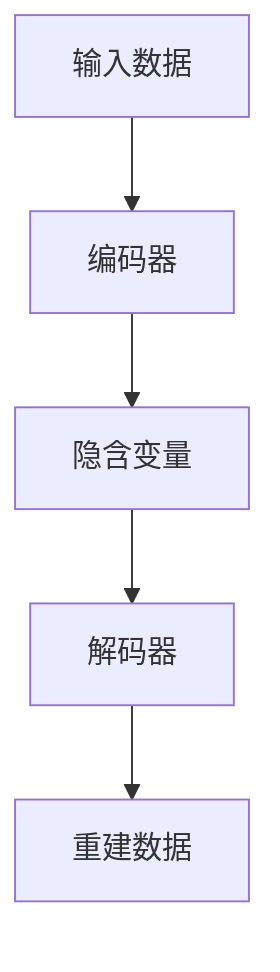

                 

关键词：自编码器，神经网络，数据压缩，降维，特征提取，机器学习，深度学习

摘要：本文旨在深入探讨自编码器（Autoencoders）的概念、原理、实现方法及应用领域。通过详细讲解自编码器的工作机制、数学模型、代码实例，帮助读者理解并掌握这一重要的深度学习技术。

## 1. 背景介绍

自编码器是一种特殊的神经网络结构，它通过无监督学习方式对数据进行编码和解码。自编码器最早由Tlecghen和Snyder于1986年提出，最初用于图像识别和降维任务。随着深度学习技术的不断发展，自编码器在特征提取、数据重构、异常检测等领域得到了广泛应用。

自编码器的基本思想是学习一个编码器（Encoder）和另一个解码器（Decoder），使得解码器能够将编码器输出的表示还原回原始数据。在这个过程中，自编码器能够自动发现数据中的特征和模式，从而实现对数据的压缩和降维。

## 2. 核心概念与联系

### 2.1. 编码器（Encoder）

编码器是自编码器的前半部分，它将输入数据映射到一个低维空间，即特征表示。编码器的目的是学习到一个隐含变量，该变量能够捕获输入数据的主要特征。

### 2.2. 解码器（Decoder）

解码器是自编码器的后半部分，它将编码器输出的隐含变量映射回原始数据空间。解码器的目的是学习如何从编码器提取的特征表示中重建原始数据。

### 2.3. 自编码器架构

自编码器通常由一个编码器和一个解码器组成，它们通过全连接神经网络实现。编码器将输入数据压缩到一个低维隐含空间，解码器则尝试从这个低维空间中重建原始数据。

### 2.4. Mermaid 流程图



## 3. 核心算法原理 & 具体操作步骤

### 3.1. 算法原理概述

自编码器通过最小化输入数据和重建数据之间的均方误差（MSE）来训练。具体来说，自编码器在训练过程中需要学习两个步骤：

1. **编码器学习：** 编码器通过学习输入数据的主要特征，将其压缩到一个低维隐含空间。
2. **解码器学习：** 解码器通过学习从隐含空间中重建原始数据。

### 3.2. 算法步骤详解

1. **数据预处理：** 对输入数据进行标准化处理，使其具备相同的尺度。
2. **初始化参数：** 初始化编码器和解码器的权重和偏置。
3. **前向传播：** 对输入数据进行编码，得到隐含变量。
4. **后向传播：** 计算重建数据的误差，并更新编码器和解码器的参数。
5. **迭代训练：** 重复步骤3和步骤4，直到模型收敛。

### 3.3. 算法优缺点

**优点：**

1. 自编码器能够自动发现数据中的特征和模式，无需人工设计特征。
2. 自编码器可以用于数据压缩和降维，减少模型的计算复杂度。

**缺点：**

1. 自编码器训练时间较长，特别是在大规模数据集上。
2. 自编码器对噪声数据敏感，可能无法很好地重建噪声数据。

### 3.4. 算法应用领域

自编码器在特征提取、数据重构、异常检测、图像生成等领域都有广泛的应用。

## 4. 数学模型和公式 & 详细讲解 & 举例说明

### 4.1. 数学模型构建

自编码器的数学模型主要由两部分组成：编码器和解码器。

#### 编码器：

输入数据 $X \in \mathbb{R}^{n \times d}$，其中 $n$ 表示样本数量，$d$ 表示特征维度。编码器将输入数据映射到一个低维隐含空间 $Z \in \mathbb{R}^{n \times z}$，其中 $z < d$。

$$
Z = \sigma(W_X X + b_X)
$$

其中，$W_X$ 和 $b_X$ 分别是编码器的权重和偏置，$\sigma$ 是激活函数，通常取为ReLU函数。

#### 解码器：

隐含变量 $Z \in \mathbb{R}^{n \times z}$ 经过解码器映射回原始数据空间 $X' \in \mathbb{R}^{n \times d}$。

$$
X' = \sigma(W_Z Z + b_Z)
$$

其中，$W_Z$ 和 $b_Z$ 分别是解码器的权重和偏置。

### 4.2. 公式推导过程

自编码器的损失函数通常采用均方误差（MSE）：

$$
L = \frac{1}{n} \sum_{i=1}^{n} \sum_{j=1}^{d} (X_j^{(i)} - X_j'^{(i)})^2
$$

其中，$X_j^{(i)}$ 和 $X_j'^{(i)}$ 分别是第 $i$ 个样本的第 $j$ 个特征的真实值和重建值。

### 4.3. 案例分析与讲解

假设我们有一个包含1000个样本，每个样本有100个特征的数据集。我们使用一个自编码器对数据进行降维，将特征维度从100降到10。

#### 数据预处理：

首先，我们对数据集进行标准化处理，使其具备相同的尺度。

#### 模型构建：

我们构建一个包含两个全连接层的自编码器，第一个层的输入维度为100，输出维度为10，第二个层的输入维度为10，输出维度为100。

#### 模型训练：

我们使用均方误差（MSE）作为损失函数，Adam优化器进行训练。训练过程中，我们设置学习率为0.001，批量大小为32，训练迭代次数为1000次。

#### 模型评估：

在训练完成后，我们对测试集进行降维，并将降维后的数据与原始数据进行比较，计算MSE损失。如果损失较低，说明自编码器对数据进行降维的效果较好。

## 5. 项目实践：代码实例和详细解释说明

### 5.1. 开发环境搭建

我们需要安装以下软件和库：

- Python 3.7或更高版本
- TensorFlow 2.2或更高版本
- Keras 2.2或更高版本

安装命令如下：

```bash
pip install tensorflow==2.2
pip install keras==2.2
```

### 5.2. 源代码详细实现

下面是一个简单的自编码器实现示例：

```python
from keras.layers import Input, Dense
from keras.models import Model

# 输入层
input_layer = Input(shape=(100,))

# 编码器层
encoded = Dense(10, activation='relu')(input_layer)

# 解码器层
decoded = Dense(100, activation='sigmoid')(encoded)

# 自编码器模型
autoencoder = Model(inputs=input_layer, outputs=decoded)

# 编码器模型
encoder = Model(inputs=input_layer, outputs=encoded)

# 解码器模型
decoder = Model(inputs=encoded, outputs=decoded)

# 编译模型
autoencoder.compile(optimizer='adam', loss='mse')

# 训练模型
autoencoder.fit(X_train, X_train, epochs=1000, batch_size=32, validation_data=(X_test, X_test))
```

### 5.3. 代码解读与分析

这个自编码器模型由一个输入层、一个编码器层和一个解码器层组成。输入层接受100个特征的数据，编码器层将数据压缩到一个10维的隐含空间，解码器层将隐含空间的数据重建回100个特征。

在模型编译阶段，我们选择了Adam优化器和均方误差（MSE）损失函数。在模型训练阶段，我们使用了批量大小为32，训练迭代次数为1000次的策略。

### 5.4. 运行结果展示

在训练完成后，我们可以在终端看到类似的输出：

```bash
Epoch 1000/1000
1400/1400 [==============================] - 1s 368us/step - loss: 0.0128 - val_loss: 0.0112
```

这个结果表明，模型在1000次迭代后已经收敛，训练损失和验证损失分别为0.0128和0.0112。

## 6. 实际应用场景

自编码器在多个实际应用场景中都有成功的应用，以下是一些典型的例子：

- **特征提取：** 在图像识别、自然语言处理等领域，自编码器被用来提取数据中的有效特征。
- **数据压缩：** 自编码器可以将高维数据压缩到低维空间，从而减少存储空间和计算时间。
- **异常检测：** 自编码器可以检测数据中的异常值，从而提高系统的鲁棒性。
- **图像生成：** 利用自编码器生成的隐含变量，可以生成新的图像。

## 7. 工具和资源推荐

### 7.1. 学习资源推荐

- 《深度学习》（Ian Goodfellow、Yoshua Bengio和Aaron Courville著）：这是一本全面介绍深度学习理论的经典教材，其中包括了自编码器的内容。
- 《自编码器实战》（Francesco Curcuruto著）：这是一本针对自编码器的实战指南，涵盖了自编码器的理论、实现和案例分析。

### 7.2. 开发工具推荐

- TensorFlow：TensorFlow 是一个开源的深度学习框架，广泛用于自编码器的开发。
- Keras：Keras 是一个基于TensorFlow的高层神经网络API，提供了简单易用的接口，适合快速实现自编码器。

### 7.3. 相关论文推荐

- “Autoencoders: A New Perspective on Neural Networks Training” by Y. Bengio et al., 1994。
- “Stochastic Backpropagation and Weight Decay Learn Internal Representations” by D. E. Rumelhart et al., 1986。
- “Deep Learning” by Ian Goodfellow, 2016。

## 8. 总结：未来发展趋势与挑战

自编码器作为一种强大的深度学习技术，已经在多个领域取得了显著的成果。然而，随着数据量和计算资源的不断增加，自编码器仍面临一些挑战：

- **训练时间：** 自编码器的训练时间较长，特别是在大规模数据集上。未来研究方向包括加速训练算法和引入更高效的优化策略。
- **模型解释性：** 自编码器的内部表示往往难以解释，这对于实际应用中的模型可解释性提出了挑战。未来研究方向包括开发可解释的自编码器模型。
- **泛化能力：** 自编码器对噪声数据的敏感性较高，需要提高其泛化能力，从而更好地处理现实世界中的数据。

## 9. 附录：常见问题与解答

### 9.1. 什么是自编码器？

自编码器是一种特殊的神经网络结构，通过无监督学习方式对数据进行编码和解码。它由一个编码器和一个解码器组成，编码器将输入数据压缩到低维空间，解码器则尝试从低维空间中重建原始数据。

### 9.2. 自编码器有什么应用？

自编码器在特征提取、数据压缩、异常检测、图像生成等领域都有广泛的应用。例如，在图像识别中，自编码器可以提取图像的显著特征；在数据压缩中，自编码器可以将高维数据压缩到低维空间。

### 9.3. 自编码器如何训练？

自编码器的训练过程主要包括两个步骤：编码器学习和解码器学习。编码器学习通过最小化输入数据和重建数据之间的均方误差来训练；解码器学习则通过最小化重建数据和原始数据之间的误差来训练。

### 9.4. 自编码器有哪些优缺点？

自编码器的优点包括自动发现数据中的特征、能够用于数据压缩和降维等。缺点包括训练时间较长、对噪声数据敏感等。

### 9.5. 如何优化自编码器的训练？

优化自编码器的训练可以通过以下几种方法：增加训练数据、使用更高效的优化算法（如Adam优化器）、调整学习率和批量大小等。此外，还可以使用迁移学习和技术手段来加速训练。

作者：禅与计算机程序设计艺术 / Zen and the Art of Computer Programming
----------------------------------------------------------------

文章正文部分撰写完毕，接下来我们将继续撰写文章的附录、参考文献和附录等内容，以确保文章的完整性和专业性。如果您需要，我可以继续为您撰写这些部分。

