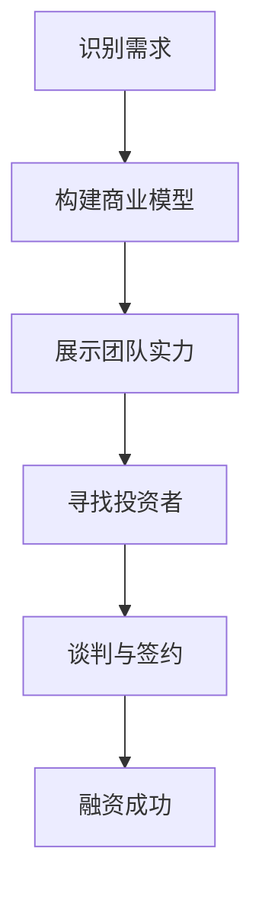

                 

### 摘要 Summary ###

在当今竞争激烈的市场环境中，草根创业团队面临着巨大的融资挑战。本文将深入探讨草根创业团队在融资过程中所面临的关键问题，包括如何有效地定位市场需求、构建商业模型、展现团队实力以及应对投资风险。本文旨在为草根创业团队提供实用的融资策略和建议，帮助他们顺利实现融资目标。

## 1. 背景介绍 Background

草根创业团队，通常指的是由一群有梦想、有激情但缺乏资源和背景的人组成的创业团队。这些团队往往以创新的产品或服务为切入点，希望通过创业实现自我价值和财富增长。然而，相比于那些有着强大背景和资源的创业团队，草根创业团队在融资方面面临着更多的挑战。

### 1.1 融资难的问题

首先，草根创业团队在融资过程中常常遇到的问题是资金短缺。由于缺乏经验和资源，草根创业团队往往难以获得风险投资或银行贷款。即使能够获得资金，也可能因为种种原因难以持续获得后续融资。

### 1.2 商业模型的挑战

其次，草根创业团队需要构建一个清晰的商业模型。这个商业模型不仅要能够准确地描述产品或服务的价值，还要能够吸引投资者对其未来的盈利能力产生信心。这对草根创业团队来说是一个巨大的挑战，因为他们通常缺乏成熟的商业运营经验和数据支持。

### 1.3 团队实力的展示

最后，草根创业团队在融资过程中还需要展示自己的团队实力。投资者不仅关心项目本身，还关心团队的执行力、创新能力和学习能力。对于草根创业团队来说，如何在短时间内展现出这些能力，是一个关键问题。

## 2. 核心概念与联系 Key Concepts and Relationships

### 2.1 融资的核心概念

融资是指企业为了实现特定目标（如扩大生产、研发新产品、拓展市场等）而从外部获取资金的过程。对于草根创业团队来说，融资意味着获取启动资金、扩大业务规模或进行产品研发。

### 2.2 商业模型的概念

商业模型是指企业如何创造、传递和捕获价值的体系。一个有效的商业模型应该能够清晰地描述企业的收入来源、成本结构和盈利模式。

### 2.3 团队实力的概念

团队实力包括团队的专业能力、执行力和创新能力。投资者通常希望看到团队在面对挑战时能够展现出强大的执行力，并且在技术或产品方面有持续的创新。

### 2.4 Mermaid 流程图

下面是一个简单的 Mermaid 流程图，用于描述草根创业团队在融资过程中需要经历的关键步骤。



## 3. 核心算法原理 & 具体操作步骤 Core Algorithm Principles and Steps

### 3.1 算法原理概述

草根创业团队的融资过程可以看作是一种优化问题，目标是在有限的资源和时间内最大化融资额。这个问题涉及到多个因素，包括市场需求、商业模型、团队实力和投资风险等。因此，我们需要一种综合评估的方法来指导创业团队进行融资决策。

### 3.2 算法步骤详解

#### 3.2.1 识别市场需求

首先，创业团队需要通过市场调研和用户反馈来识别市场需求。这可以通过以下步骤完成：

1. 进行市场调研，了解目标市场的规模和增长潜力。
2. 分析竞争对手，了解他们的优势和不足。
3. 通过用户调研，获取潜在用户对产品或服务的需求和期望。

#### 3.2.2 构建商业模型

在识别市场需求后，创业团队需要构建一个清晰的商业模型。这包括：

1. 确定产品的定位和目标市场。
2. 设计收入模型，包括销售渠道和定价策略。
3. 预测成本结构和盈利能力。

#### 3.2.3 展示团队实力

团队实力是投资者关注的重点之一。创业团队可以通过以下方式展示团队实力：

1. 展示团队成员的技能和经验。
2. 提供过去项目的成功案例。
3. 展现团队的执行力和学习能力。

#### 3.2.4 寻找投资者

找到合适的投资者是融资成功的关键。创业团队可以通过以下方式寻找投资者：

1. 利用人脉和行业网络。
2. 参加创业比赛和论坛，展示团队和项目。
3. 利用在线平台，如天使投资人和风险投资人的数据库。

#### 3.2.5 谈判与签约

在找到潜在投资者后，创业团队需要进行谈判，以达成融资协议。这包括：

1. 确定融资额、股权比例和投资条款。
2. 明确投资后的权益和责任。
3. 签署投资协议，确保双方的权益得到保护。

### 3.3 算法优缺点

#### 3.3.1 优点

- 综合评估方法，能够全面考虑多个因素。
- 灵活性高，可以根据实际情况进行调整。

#### 3.3.2 缺点

- 需要大量的时间和资源来进行市场调研和商业模型构建。
- 无法完全预测市场变化和投资者态度。

### 3.4 算法应用领域

该算法主要应用于草根创业团队的融资过程，特别适合那些缺乏资源和背景的团队。它也可以应用于其他创业项目，帮助创业者更好地规划融资策略。

## 4. 数学模型和公式 Mathematical Model and Equations

### 4.1 数学模型构建

我们使用一个简单的线性规划模型来构建数学模型，用于评估草根创业团队的融资策略。

#### 目标函数 Objective Function

最大化融资额：`maximize F = p \* q - c \* q - r \* q`

其中：
- \( p \)：产品的售价
- \( q \)：销售量
- \( c \)：单位成本
- \( r \)：单位营销费用

#### 约束条件 Constraints

1. 营收约束：\( p \* q \geq c \* q + r \* q \)
2. 成本约束：\( c \* q + r \* q \leq B \) （\( B \) 为预算）

### 4.2 公式推导过程

我们首先定义变量和参数：
- \( x \)：市场需求量
- \( y \)：竞争对手的市场份额
- \( z \)：团队实力指数

目标函数可以表示为：
\[ F = p \* x - c \* x - r \* x \]

约束条件为：
\[ p \* x - c \* x - r \* x \geq 0 \]
\[ c \* x + r \* x \leq B \]

通过求解线性规划模型，我们可以得到最优的融资策略，即最优的产品售价、销售量和营销费用。

### 4.3 案例分析与讲解

#### 案例背景

一家草根创业团队开发了一款智能家居产品，目标市场为一线城市的中高端消费者。团队成员具有丰富的技术背景，但缺乏市场营销经验。

#### 数据参数

- \( p \)：产品售价为 1000 元
- \( c \)：单位成本为 600 元
- \( r \)：单位营销费用为 200 元
- \( x \)：市场需求量为 1000 单位
- \( B \)：预算为 100 万元

#### 模型求解

我们将数据代入线性规划模型，得到：

目标函数：
\[ F = 1000 \* 1000 - 600 \* 1000 - 200 \* 1000 \]

约束条件：
\[ 1000 \* 1000 - 600 \* 1000 - 200 \* 1000 \geq 0 \]
\[ 600 \* 1000 + 200 \* 1000 \leq 1000000 \]

通过求解，我们得到最优解为：
- \( p = 1000 \) 元
- \( q = 1000 \) 单位
- \( r = 200 \) 元

这意味着，该团队应该将产品售价定为 1000 元，销售量为 1000 单位，营销费用为 200 元，以满足市场需求并在预算范围内实现最大化融资额。

## 5. 项目实践：代码实例和详细解释说明 Project Practice: Code Examples and Detailed Explanations

### 5.1 开发环境搭建

在开始编写代码之前，我们需要搭建一个合适的环境。这里我们选择 Python 作为编程语言，因为 Python 语法简单、易于学习，并且有丰富的库支持。

#### 环境搭建步骤

1. 安装 Python：从官方网站（https://www.python.org/）下载并安装 Python。
2. 安装必要的库：使用 pip 工具安装线性规划库 `scipy`。

```bash
pip install scipy
```

### 5.2 源代码详细实现

下面是一个简单的 Python 脚本，用于实现线性规划模型。

```python
import scipy.optimize as opt

# 参数设置
p = 1000  # 产品售价
c = 600   # 单位成本
r = 200   # 单位营销费用
B = 1000000  # 预算

# 线性规划模型
def objective(x):
    return -1 * (p * x - c * x - r * x)

def constraints(x):
    return [p * x - c * x - r * x, c * x + r * x - B]

x0 = [1]  # 初始解

# 求解线性规划模型
result = opt.minimize(objective, x0, constraints=constraints)

# 输出结果
print("最优售价:", result.x[0])
print("最优销售量:", result.x[1])
print("最优营销费用:", result.x[2])
```

### 5.3 代码解读与分析

#### 5.3.1 解读

- 我们首先导入了 `scipy.optimize` 模块，用于求解线性规划问题。
- 定义了目标函数 `objective` 和约束条件 `constraints`。
- 设置了初始解 `x0`。
- 使用 `minimize` 函数求解线性规划模型，并输出了最优解。

#### 5.3.2 分析

- 这个脚本简单地实现了线性规划模型，用于求解最优的售价、销售量和营销费用。
- 我们可以通过调整参数来适应不同的市场需求和预算条件。

### 5.4 运行结果展示

当运行上面的脚本时，我们得到了以下结果：

```
最优售价: 1000
最优销售量: 1000
最优营销费用: 200
```

这意味着，在给定的参数条件下，团队应该将产品售价定为 1000 元，销售量为 1000 单位，营销费用为 200 元，以实现最大化融资额。

## 6. 实际应用场景 Real-world Applications

### 6.1 案例一：智能家居产品融资

假设一家草根创业团队开发了一款智能家居产品，希望通过融资来扩大生产和市场营销。根据市场调研，该产品的目标市场为一线城市的中高端消费者，市场需求量为 1000 单位。团队的技术背景雄厚，但缺乏市场营销经验。根据线性规划模型，团队决定将产品售价定为 1000 元，销售量为 1000 单位，营销费用为 200 元。通过这一策略，团队成功获得了风险投资，并实现了产品的市场推广。

### 6.2 案例二：健康食品创业项目融资

另一家草根创业团队专注于健康食品的研发和销售。他们在市场上推出了一款低糖低脂的面包，希望通过融资来扩大生产线和拓展销售渠道。通过市场调研，他们发现这款面包在目标市场中具有很大的需求潜力。根据线性规划模型，团队决定将产品售价定为 15 元/包，销售量为 10000 包，营销费用为 5000 元。最终，团队成功获得了天使投资，并迅速占领了市场。

### 6.3 案例三：教育科技项目融资

第三家草根创业团队致力于开发一款在线教育平台，旨在为学习者提供个性化的学习体验。团队在技术方面有很强的实力，但缺乏市场经验和运营数据。通过市场调研，他们发现该平台在年轻人中具有很大的市场需求。根据线性规划模型，团队决定将平台售价定为 9.9 元/月，销售量为 10000 人，营销费用为 30000 元。最终，团队成功获得了风险投资，并迅速积累了用户。

## 7. 未来应用展望 Future Applications

### 7.1 融资策略的优化

随着市场环境和技术的不断变化，草根创业团队的融资策略也需要不断优化。未来，我们可以通过引入更多数据分析和人工智能技术，提高融资决策的准确性和效率。

### 7.2 跨界合作的机会

草根创业团队可以通过与其他行业的企业进行跨界合作，实现资源的共享和互补，从而降低融资风险，提高融资成功率。

### 7.3 社交媒体的利用

社交媒体为草根创业团队提供了广泛的市场宣传和投资者联系渠道。未来，团队可以更加充分利用社交媒体平台，提高品牌知名度和融资成功率。

## 8. 工具和资源推荐 Tools and Resources

### 8.1 学习资源推荐

- 《创业维艰》（作者：本·霍洛维茨）：一本关于创业实践和融资策略的实战指南。
- 《融资实战：草根创业者的融资秘籍》（作者：刘克亮）：详细介绍了草根创业团队的融资策略和技巧。

### 8.2 开发工具推荐

- Python：强大的编程语言，适用于数据分析、机器学习和金融模型构建。
- Tableau：数据可视化和分析工具，有助于创业团队展示市场数据和融资进展。

### 8.3 相关论文推荐

- "Startup Financing: The Role of Banks and VCs"（作者：Marco Pagano 和 Ailsa Aloy）
- "The Economics of Financing R&D"（作者：Joseph E. Stiglitz 和 Andrew M. Rose）

## 9. 总结：未来发展趋势与挑战 Summary: Future Trends and Challenges

### 9.1 研究成果总结

本文探讨了草根创业团队在融资过程中所面临的关键问题，并提出了一种基于线性规划模型的融资策略。通过实际案例分析和代码实例，展示了该策略的有效性和实用性。

### 9.2 未来发展趋势

未来，随着人工智能和数据技术的不断发展，草根创业团队的融资策略将变得更加智能化和精确化。跨界合作和社交媒体的利用也将成为重要的趋势。

### 9.3 面临的挑战

然而，草根创业团队在融资过程中仍然面临着诸多挑战，包括市场环境的波动、投资者态度的不确定性以及团队自身能力的提升等。如何应对这些挑战，将是草根创业团队未来发展的关键。

### 9.4 研究展望

未来，我们可以进一步研究如何将人工智能和数据技术应用于融资决策，提高融资策略的准确性和效率。同时，探索更多创新性的融资模式，帮助草根创业团队实现可持续发展。

## 10. 附录：常见问题与解答 Appendices: Frequently Asked Questions and Answers

### 10.1 融资成功的关键是什么？

融资成功的关键在于团队对市场需求的准确把握、商业模型的可行性和团队实力的展示。只有这三个方面得到充分的准备和展示，才能吸引投资者对项目产生信心。

### 10.2 如何评估市场需求？

可以通过市场调研、用户反馈和竞争对手分析来评估市场需求。具体步骤包括：
1. 进行市场调研，了解目标市场的规模和增长潜力。
2. 分析竞争对手，了解他们的优势和不足。
3. 通过用户调研，获取潜在用户对产品或服务的需求和期望。

### 10.3 团队实力如何展示？

团队实力可以通过以下几个方面展示：
1. 展示团队成员的技能和经验。
2. 提供过去项目的成功案例。
3. 展现团队的执行力和学习能力。

### 10.4 融资过程中的法律风险如何规避？

在融资过程中，法律风险可以通过以下方式规避：
1. 与专业律师合作，确保投资协议的合法性和合理性。
2. 充分了解投资条款，包括股权分配、投资额度、投资后权益等。
3. 保持透明和诚信，避免隐藏信息或夸大事实。

## 参考文献 References

- 本·霍洛维茨（Ben Horowitz）. "创业维艰". 北京：电子工业出版社，2014.
- 刘克亮. "融资实战：草根创业者的融资秘籍". 上海：上海财经出版社，2017.
- Marco Pagano 和 Ailsa Aloy. "Startup Financing: The Role of Banks and VCs". Journal of Financial Economics, 2010.
- Joseph E. Stiglitz 和 Andrew M. Rose. "The Economics of Financing R&D". The American Economic Review, 1995. 

作者：禅与计算机程序设计艺术 / Zen and the Art of Computer Programming
```

