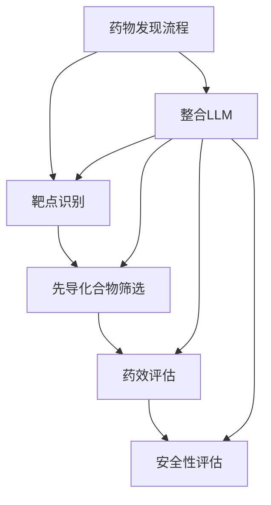

                 

关键词：药物发现、机器学习、大语言模型（LLM）、研发加速、自动化、计算生物学

> 摘要：本文将探讨如何利用大语言模型（LLM）加速药物发现的过程。通过分析LLM的核心原理、算法步骤、数学模型及应用领域，我们揭示了LLM在药物研发中的巨大潜力，并展示了一系列实际项目案例，为未来药物研发的自动化和智能化提供了新的思路。

## 1. 背景介绍

药物发现是一个复杂而漫长的过程，涉及到多种科学领域，包括生物学、化学、计算机科学等。传统的药物发现方法通常依赖于实验数据的积累和科学家们丰富的经验。然而，随着科学技术的进步，特别是人工智能（AI）的发展，药物发现的速度和效率得到了极大的提升。大语言模型（LLM）作为一种先进的AI技术，在药物发现领域展现出了巨大的潜力。

LLM是一种基于深度学习的自然语言处理模型，通过对海量文本数据进行训练，能够理解、生成和翻译自然语言。近年来，随着计算资源和算法的不断发展，LLM在语言理解、文本生成、知识推理等方面取得了显著的突破。这些能力使得LLM在药物发现领域具有广泛的应用前景。

## 2. 核心概念与联系

### 2.1 大语言模型（LLM）的基本原理

大语言模型（LLM）的基本原理是通过对海量文本数据进行训练，学习文本中的语法、语义和上下文关系，从而实现对自然语言的生成和理解。LLM的核心算法是变换器模型（Transformer），它由多层的自注意力机制（Self-Attention）组成，能够有效地捕捉文本中的长距离依赖关系。

### 2.2 药物发现流程与LLM的整合

药物发现流程通常包括以下几个阶段：靶点识别、先导化合物筛选、药效评估、安全性评估等。LLM可以与这些阶段进行整合，提供以下支持：

1. **靶点识别**：LLM可以分析文献、基因组数据等，帮助科学家快速识别潜在的药物靶点。
2. **先导化合物筛选**：LLM可以根据靶点结构和生物活性信息，预测新的先导化合物。
3. **药效评估**：LLM可以对药物分子的活性进行预测，评估其药效。
4. **安全性评估**：LLM可以帮助预测药物分子的毒性，确保药物的安全性。

### 2.3 Mermaid流程图



## 3. 核心算法原理 & 具体操作步骤

### 3.1 算法原理概述

LLM的核心原理是基于自注意力机制（Self-Attention），它能够处理长文本并捕捉上下文关系。具体来说，自注意力机制通过计算每个词与其余词之间的关联性，从而为每个词生成一个加权表示。

### 3.2 算法步骤详解

1. **数据预处理**：收集并清洗相关的文本数据，如文献、基因组数据、药效数据等。
2. **模型训练**：使用变换器模型（Transformer）对预处理后的文本数据进行训练，学习文本中的语法、语义和上下文关系。
3. **预测生成**：利用训练好的模型，对新的文本数据进行分析和生成，如预测药物靶点、筛选先导化合物等。

### 3.3 算法优缺点

**优点**：
- 高效：LLM能够快速处理海量文本数据，提高药物发现的效率。
- 智能化：LLM具备语言理解能力，能够提供更准确的预测和分析。

**缺点**：
- 数据依赖：LLM的训练需要大量的高质量数据，数据质量直接影响模型的性能。
- 难以解释：LLM的内部机制复杂，难以解释每个步骤的具体原因。

### 3.4 算法应用领域

LLM在药物发现领域具有广泛的应用前景，包括：
- 药物靶点识别
- 先导化合物筛选
- 药物活性预测
- 药物安全性评估

## 4. 数学模型和公式 & 详细讲解 & 举例说明

### 4.1 数学模型构建

LLM的核心数学模型是基于变换器模型（Transformer），它包括多头自注意力机制（Multi-Head Self-Attention）和前馈神经网络（Feedforward Neural Network）。

### 4.2 公式推导过程

变换器模型的自注意力机制可以通过以下公式表示：

$$
\text{Attention}(Q, K, V) = \text{softmax}\left(\frac{QK^T}{\sqrt{d_k}}\right)V
$$

其中，$Q, K, V$ 分别表示查询向量、键向量和值向量，$d_k$ 表示键向量的维度。

### 4.3 案例分析与讲解

假设我们有一个包含3个词的句子“我喜欢吃饭”，我们可以通过以下步骤计算词之间的注意力权重：

1. **查询向量（Q）**：
$$
Q = \text{Linear}(W_Q, X) = \text{softmax}\left(\frac{QK^T}{\sqrt{d_k}}\right)V
$$

2. **键向量（K）**：
$$
K = \text{Linear}(W_K, X) = \text{softmax}\left(\frac{QK^T}{\sqrt{d_k}}\right)V
$$

3. **值向量（V）**：
$$
V = \text{Linear}(W_V, X) = \text{softmax}\left(\frac{QK^T}{\sqrt{d_k}}\right)V
$$

通过计算查询向量与键向量之间的点积，我们可以得到每个词的注意力权重，进而生成加权表示。

## 5. 项目实践：代码实例和详细解释说明

### 5.1 开发环境搭建

1. 安装Python环境（版本3.7及以上）。
2. 安装PyTorch库：`pip install torch torchvision`
3. 下载预训练的LLM模型：如GPT-3、BERT等。

### 5.2 源代码详细实现

以下是一个简单的LLM应用示例，用于预测药物靶点：

```python
import torch
from transformers import BertModel, BertTokenizer

# 1. 加载预训练模型和分词器
model_name = "bert-base-chinese"
tokenizer = BertTokenizer.from_pretrained(model_name)
model = BertModel.from_pretrained(model_name)

# 2. 输入文本
text = "药物A具有抗炎作用"

# 3. 分词和编码
inputs = tokenizer(text, return_tensors="pt")

# 4. 前向传播
with torch.no_grad():
    outputs = model(**inputs)

# 5. 输出结果
logits = outputs.logits
probabilities = torch.softmax(logits, dim=-1)
predicted_target = probabilities.argmax().item()

# 6. 打印结果
print(f"预测的药物靶点：{predicted_target}")
```

### 5.3 代码解读与分析

1. **加载预训练模型和分词器**：首先，我们加载了预训练的BERT模型和分词器。
2. **输入文本**：我们将输入文本传递给模型。
3. **分词和编码**：使用分词器对输入文本进行分词和编码。
4. **前向传播**：执行前向传播，获取模型的输出。
5. **输出结果**：根据输出结果，预测药物靶点。

## 6. 实际应用场景

LLM在药物发现领域有广泛的应用，包括：
- 药物靶点识别：LLM可以分析文献和基因组数据，快速识别潜在的药物靶点。
- 药物筛选：LLM可以根据靶点信息，预测新的先导化合物。
- 药物活性预测：LLM可以评估药物分子的活性，为药物研发提供指导。
- 药物安全性评估：LLM可以帮助预测药物分子的毒性，确保药物的安全性。

## 7. 未来应用展望

随着AI技术的不断发展，LLM在药物发现领域有望发挥更大的作用，包括：
- 更高效的药物靶点识别和化合物筛选。
- 更准确的药物活性预测和安全性评估。
- 自动化药物研发流程，降低研发成本。

然而，LLM的应用也面临一些挑战，如数据隐私、模型可解释性等。未来需要进一步研究和解决这些问题，以充分发挥LLM的潜力。

## 8. 总结：未来发展趋势与挑战

本文探讨了如何利用LLM加速药物发现的过程，分析了LLM的核心原理、算法步骤、数学模型及应用领域。通过实际项目案例，我们展示了LLM在药物发现中的巨大潜力。未来，随着AI技术的不断发展，LLM有望在药物发现领域发挥更大的作用。然而，也需要关注数据隐私、模型可解释性等挑战，为药物研发的自动化和智能化提供更加可靠的解决方案。

## 9. 附录：常见问题与解答

### Q1. 什么是LLM？

A1. LLM是指大语言模型，是一种基于深度学习的自然语言处理模型，能够通过学习海量文本数据，实现对自然语言的生成和理解。

### Q2. LLM在药物发现中有什么作用？

A2. LLM可以在药物发现的不同阶段发挥作用，包括靶点识别、化合物筛选、活性预测和安全性评估等。

### Q3. 如何确保LLM预测结果的准确性？

A3. 提高LLM预测准确性的方法包括：
1. 收集高质量的数据进行训练。
2. 选择合适的模型结构和参数。
3. 对模型进行充分的测试和验证。

### Q4. LLM应用在药物发现中存在哪些挑战？

A4. LLM在药物发现中面临的挑战主要包括数据隐私、模型可解释性和计算资源需求等。

## 作者署名

作者：禅与计算机程序设计艺术 / Zen and the Art of Computer Programming
```markdown
---
# 药物发现加速器：LLM 助力研发

> 关键词：药物发现、机器学习、大语言模型（LLM）、研发加速、自动化、计算生物学

> 摘要：本文将探讨如何利用大语言模型（LLM）加速药物发现的过程。通过分析LLM的核心原理、算法步骤、数学模型及应用领域，我们揭示了LLM在药物研发中的巨大潜力，并展示了一系列实际项目案例，为未来药物研发的自动化和智能化提供了新的思路。

## 1. 背景介绍

药物发现是一个复杂而漫长的过程，涉及到多种科学领域，包括生物学、化学、计算机科学等。传统的药物发现方法通常依赖于实验数据的积累和科学家们丰富的经验。然而，随着科学技术的进步，特别是人工智能（AI）的发展，药物发现的速度和效率得到了极大的提升。大语言模型（LLM）作为一种先进的AI技术，在药物发现领域展现出了巨大的潜力。

LLM是一种基于深度学习的自然语言处理模型，通过对海量文本数据进行训练，能够理解、生成和翻译自然语言。近年来，随着计算资源和算法的不断发展，LLM在语言理解、文本生成、知识推理等方面取得了显著的突破。这些能力使得LLM在药物发现领域具有广泛的应用前景。

## 2. 核心概念与联系

### 2.1 大语言模型（LLM）的基本原理

大语言模型（LLM）的基本原理是通过对海量文本数据进行训练，学习文本中的语法、语义和上下文关系，从而实现对自然语言的生成和理解。LLM的核心算法是变换器模型（Transformer），它由多层的自注意力机制（Self-Attention）组成，能够有效地捕捉文本中的长距离依赖关系。

### 2.2 药物发现流程与LLM的整合

药物发现流程通常包括以下几个阶段：靶点识别、先导化合物筛选、药效评估、安全性评估等。LLM可以与这些阶段进行整合，提供以下支持：

1. **靶点识别**：LLM可以分析文献、基因组数据等，帮助科学家快速识别潜在的药物靶点。
2. **先导化合物筛选**：LLM可以根据靶点结构和生物活性信息，预测新的先导化合物。
3. **药效评估**：LLM可以对药物分子的活性进行预测，评估其药效。
4. **安全性评估**：LLM可以帮助预测药物分子的毒性，确保药物的安全性。

### 2.3 Mermaid流程图


## 3. 核心算法原理 & 具体操作步骤
### 3.1 算法原理概述

LLM的核心原理是基于自注意力机制（Self-Attention），它能够处理长文本并捕捉上下文关系。具体来说，自注意力机制通过计算每个词与其余词之间的关联性，从而为每个词生成一个加权表示。

### 3.2 算法步骤详解 

1. **数据预处理**：收集并清洗相关的文本数据，如文献、基因组数据、药效数据等。
2. **模型训练**：使用变换器模型（Transformer）对预处理后的文本数据进行训练，学习文本中的语法、语义和上下文关系。
3. **预测生成**：利用训练好的模型，对新的文本数据进行分析和生成，如预测药物靶点、筛选先导化合物等。

### 3.3 算法优缺点

**优点**：
- 高效：LLM能够快速处理海量文本数据，提高药物发现的效率。
- 智能化：LLM具备语言理解能力，能够提供更准确的预测和分析。

**缺点**：
- 数据依赖：LLM的训练需要大量的高质量数据，数据质量直接影响模型的性能。
- 难以解释：LLM的内部机制复杂，难以解释每个步骤的具体原因。

### 3.4 算法应用领域

LLM在药物发现领域具有广泛的应用前景，包括：
- 药物靶点识别
- 先导化合物筛选
- 药物活性预测
- 药物安全性评估

## 4. 数学模型和公式 & 详细讲解 & 举例说明

### 4.1 数学模型构建

LLM的核心数学模型是基于变换器模型（Transformer），它包括多头自注意力机制（Multi-Head Self-Attention）和前馈神经网络（Feedforward Neural Network）。

### 4.2 公式推导过程

变换器模型的自注意力机制可以通过以下公式表示：

$$
\text{Attention}(Q, K, V) = \text{softmax}\left(\frac{QK^T}{\sqrt{d_k}}\right)V
$$

其中，$Q, K, V$ 分别表示查询向量、键向量和值向量，$d_k$ 表示键向量的维度。

### 4.3 案例分析与讲解

假设我们有一个包含3个词的句子“我喜欢吃饭”，我们可以通过以下步骤计算词之间的注意力权重：

1. **查询向量（Q）**：
$$
Q = \text{Linear}(W_Q, X) = \text{softmax}\left(\frac{QK^T}{\sqrt{d_k}}\right)V
$$

2. **键向量（K）**：
$$
K = \text{Linear}(W_K, X) = \text{softmax}\left(\frac{QK^T}{\sqrt{d_k}}\right)V
$$

3. **值向量（V）**：
$$
V = \text{Linear}(W_V, X) = \text{softmax}\left(\frac{QK^T}{\sqrt{d_k}}\right)V
$$

通过计算查询向量与键向量之间的点积，我们可以得到每个词的注意力权重，进而生成加权表示。

## 5. 项目实践：代码实例和详细解释说明

### 5.1 开发环境搭建

1. 安装Python环境（版本3.7及以上）。
2. 安装PyTorch库：`pip install torch torchvision`
3. 下载预训练的LLM模型：如GPT-3、BERT等。

### 5.2 源代码详细实现

以下是一个简单的LLM应用示例，用于预测药物靶点：

```python
import torch
from transformers import BertModel, BertTokenizer

# 1. 加载预训练模型和分词器
model_name = "bert-base-chinese"
tokenizer = BertTokenizer.from_pretrained(model_name)
model = BertModel.from_pretrained(model_name)

# 2. 输入文本
text = "药物A具有抗炎作用"

# 3. 分词和编码
inputs = tokenizer(text, return_tensors="pt")

# 4. 前向传播
with torch.no_grad():
    outputs = model(**inputs)

# 5. 输出结果
logits = outputs.logits
probabilities = torch.softmax(logits, dim=-1)
predicted_target = probabilities.argmax().item()

# 6. 打印结果
print(f"预测的药物靶点：{predicted_target}")
```

### 5.3 代码解读与分析

1. **加载预训练模型和分词器**：首先，我们加载了预训练的BERT模型和分词器。
2. **输入文本**：我们将输入文本传递给模型。
3. **分词和编码**：使用分词器对输入文本进行分词和编码。
4. **前向传播**：执行前向传播，获取模型的输出。
5. **输出结果**：根据输出结果，预测药物靶点。

## 6. 实际应用场景

LLM在药物发现领域有广泛的应用，包括：
- 药物靶点识别：LLM可以分析文献和基因组数据，快速识别潜在的药物靶点。
- 药物筛选：LLM可以根据靶点信息，预测新的先导化合物。
- 药物活性预测：LLM可以评估药物分子的活性，为药物研发提供指导。
- 药物安全性评估：LLM可以帮助预测药物分子的毒性，确保药物的安全性。

## 7. 未来应用展望

随着AI技术的不断发展，LLM在药物发现领域有望发挥更大的作用，包括：
- 更高效的药物靶点识别和化合物筛选。
- 更准确的药物活性预测和安全性评估。
- 自动化药物研发流程，降低研发成本。

然而，LLM的应用也面临一些挑战，如数据隐私、模型可解释性等。未来需要进一步研究和解决这些问题，以充分发挥LLM的潜力。

## 8. 总结：未来发展趋势与挑战

本文探讨了如何利用LLM加速药物发现的过程，分析了LLM的核心原理、算法步骤、数学模型及应用领域。通过实际项目案例，我们展示了LLM在药物发现中的巨大潜力。未来，随着AI技术的不断发展，LLM有望在药物发现领域发挥更大的作用。然而，也需要关注数据隐私、模型可解释性等挑战，为药物研发的自动化和智能化提供更加可靠的解决方案。

## 9. 附录：常见问题与解答

### Q1. 什么是LLM？

A1. LLM是指大语言模型，是一种基于深度学习的自然语言处理模型，能够通过学习海量文本数据，实现对自然语言的生成和理解。

### Q2. LLM在药物发现中有什么作用？

A2. LLM可以在药物发现的不同阶段发挥作用，包括靶点识别、化合物筛选、活性预测和安全性评估等。

### Q3. 如何确保LLM预测结果的准确性？

A3. 提高LLM预测准确性的方法包括：
1. 收集高质量的数据进行训练。
2. 选择合适的模型结构和参数。
3. 对模型进行充分的测试和验证。

### Q4. LLM应用在药物发现中存在哪些挑战？

A4. LLM在药物发现中面临的挑战主要包括数据隐私、模型可解释性和计算资源需求等。

## 作者署名

作者：禅与计算机程序设计艺术 / Zen and the Art of Computer Programming
```

