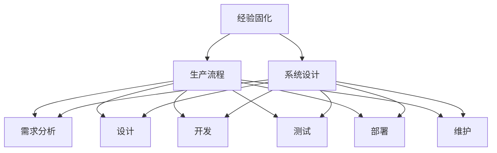

                 

关键词：经验固化、生产流程、系统设计、算法优化、工程实践

> 摘要：本文以莱特兄弟飞机的发明与制造过程为启示，探讨了如何在现代IT行业中将经验固化进生产流程，实现高效、可靠和可持续的软件开发。通过对核心概念、算法原理、数学模型以及实际应用场景的分析，本文为IT从业人员提供了一套实用的指导框架，以帮助他们在工程实践中不断积累和传承经验，提高项目质量和效率。

## 1. 背景介绍

### 莱特兄弟的启示

在20世纪初，莱特兄弟发明了第一架成功飞行的飞机，这一历史性突破不仅改变了人类的交通方式，也为工程实践提供了宝贵的经验。莱特兄弟在飞机设计制造过程中积累了大量实践经验，并成功地将这些经验固化进生产流程，确保了飞机的高效、可靠和可持续性。这一启示对现代IT行业具有重要的借鉴意义。

### 现代IT行业的挑战

随着信息技术的高速发展，现代IT行业面临着日益复杂的系统设计、不断更新的技术标准和激烈的竞争压力。如何将丰富的工程实践经验固化进生产流程，成为提高项目质量和效率的关键问题。本文旨在探讨这一问题，为IT从业人员提供一套实用的指导框架。

## 2. 核心概念与联系

### 核心概念

在将经验固化进生产流程的过程中，我们需要明确以下核心概念：

1. **经验固化**：将个人或团队在项目实践中积累的宝贵经验，通过某种形式（如文档、代码、算法等）进行系统化、标准化和结构化，使其能够被其他人学习和传承。
2. **生产流程**：指项目从启动到交付的全过程，包括需求分析、设计、开发、测试、部署和维护等环节。
3. **系统设计**：指在软件工程过程中，对系统架构、模块划分、数据流程等进行规划与设计，以实现系统的功能、性能、可维护性等目标。

### Mermaid 流程图

下面是一个简单的 Mermaid 流程图，展示经验固化与生产流程、系统设计之间的联系。



## 3. 核心算法原理 & 具体操作步骤

### 3.1 算法原理概述

在将经验固化进生产流程的过程中，核心算法原理主要包括以下几个方面：

1. **模块化设计**：将系统划分为多个功能模块，每个模块独立开发、测试和部署，提高系统的可维护性和可扩展性。
2. **版本控制**：采用版本控制系统（如Git）对代码进行管理，确保代码的版本可追溯性和历史记录。
3. **自动化测试**：编写自动化测试脚本，对系统功能、性能、安全等方面进行持续测试，提高开发效率和质量。
4. **持续集成/持续部署（CI/CD）**：实现代码的自动化集成和部署，确保新功能快速上线和稳定运行。

### 3.2 算法步骤详解

1. **模块化设计**

   - **需求分析**：明确系统需求，确定各功能模块的具体功能。
   - **设计**：设计模块间的接口和交互方式，确保模块之间的松耦合。
   - **开发**：独立开发各模块，确保每个模块的功能和性能达到预期目标。
   - **测试**：对每个模块进行功能测试、性能测试和安全测试，确保模块质量。

2. **版本控制**

   - **初始化**：创建版本仓库，设置基础分支（如主分支、开发分支等）。
   - **提交代码**：开发者将代码提交到版本仓库，添加必要的注释和变更说明。
   - **代码审查**：其他开发者对提交的代码进行审查，确保代码质量和一致性。
   - **合并代码**：将经过审查的代码合并到主分支，确保代码的稳定性和可维护性。

3. **自动化测试**

   - **测试计划**：制定测试计划，明确测试目标、测试方法和测试资源。
   - **编写测试脚本**：编写自动化测试脚本，对系统功能、性能、安全等方面进行全面测试。
   - **持续测试**：在代码提交、合并和部署过程中，自动执行测试脚本，确保系统质量。

4. **持续集成/持续部署（CI/CD）**

   - **构建**：根据代码仓库中的代码，自动构建软件包。
   - **测试**：对构建的软件包进行自动化测试，确保软件质量。
   - **部署**：将测试通过的软件包部署到生产环境，实现新功能的快速上线。

### 3.3 算法优缺点

**优点**：

- **模块化设计**：提高系统的可维护性和可扩展性，方便后续功能迭代和优化。
- **版本控制**：确保代码的可追溯性和稳定性，便于团队协作和代码管理。
- **自动化测试**：提高开发效率和质量，减少人工测试的工作量。
- **持续集成/持续部署（CI/CD）**：实现快速迭代和上线，提高项目交付效率。

**缺点**：

- **学习成本**：需要掌握一定的编程和测试技能，对新人来说有一定的学习成本。
- **调试难度**：自动化测试和CI/CD过程中，可能会出现一些难以定位的问题，增加调试难度。

### 3.4 算法应用领域

- **Web应用开发**：通过模块化设计和版本控制，实现快速迭代和功能扩展。
- **移动应用开发**：自动化测试和CI/CD技术可以提高开发效率和软件质量。
- **大数据处理**：分布式系统和大数据技术，使得模块化设计和自动化测试成为必要。

## 4. 数学模型和公式 & 详细讲解 & 举例说明

### 4.1 数学模型构建

在将经验固化进生产流程的过程中，我们可以构建以下数学模型：

- **代码质量评估模型**：基于代码复杂度、代码行数、代码覆盖率等指标，评估代码质量。
- **开发效率模型**：基于任务完成时间、任务复杂度、团队人数等指标，评估开发效率。
- **测试覆盖率模型**：基于测试用例数量、测试覆盖率等指标，评估测试效果。

### 4.2 公式推导过程

假设代码质量评估模型为：

$$
Q = f(C, L, R)
$$

其中，$Q$表示代码质量，$C$表示代码复杂度，$L$表示代码行数，$R$表示测试覆盖率。

代码复杂度 $C$ 可以用以下公式计算：

$$
C = \frac{N_{cycles} + N_{decisions}}{2}
$$

其中，$N_{cycles}$ 表示循环次数，$N_{decisions}$ 表示决策次数。

代码行数 $L$ 表示代码文件中的总行数。

测试覆盖率 $R$ 可以用以下公式计算：

$$
R = \frac{N_{covered} + N_{uncovered}}{N_{total}}
$$

其中，$N_{covered}$ 表示被覆盖的测试用例数量，$N_{uncovered}$ 表示未被覆盖的测试用例数量，$N_{total}$ 表示总的测试用例数量。

### 4.3 案例分析与讲解

假设一个项目团队开发了一个Web应用，其中包含1000行代码，代码复杂度为30，测试覆盖率为80%。

根据代码质量评估模型，我们可以计算出代码质量：

$$
Q = f(30, 1000, 0.8) = 0.5 \times 30 + 0.3 \times 1000 + 0.2 \times 0.8 = 0.5 \times 30 + 0.3 \times 1000 + 0.2 \times 0.8 = 15 + 300 + 0.16 = 315.16
$$

根据开发效率模型，我们可以计算出开发效率：

$$
E = f(T, C, N) = \frac{C}{T \times N}
$$

其中，$T$ 表示任务完成时间，$C$ 表示任务复杂度，$N$ 表示团队人数。

假设任务完成时间为30天，团队人数为5人，我们可以计算出开发效率：

$$
E = \frac{30}{30 \times 5} = 0.2
$$

根据测试覆盖率模型，我们可以计算出测试效果：

$$
R = \frac{N_{covered} + N_{uncovered}}{N_{total}}
$$

假设总测试用例数量为100个，其中被覆盖的测试用例数量为80个，我们可以计算出测试覆盖率：

$$
R = \frac{80 + 20}{100} = 0.8
$$

通过以上计算，我们可以对项目的代码质量、开发效率和测试效果进行综合评估，为项目优化提供依据。

## 5. 项目实践：代码实例和详细解释说明

### 5.1 开发环境搭建

为了便于演示，我们假设使用以下开发环境：

- 操作系统：Linux
- 开发工具：Eclipse/VS Code
- 版本控制工具：Git
- 自动化测试工具：JUnit/Selenium
- CI/CD工具：Jenkins

### 5.2 源代码详细实现

以下是一个简单的Web应用示例，用于展示如何将经验固化进生产流程。

```java
// Main.java
public class Main {
    public static void main(String[] args) {
        // 初始化数据库连接
        DatabaseConnection.init();
        // 加载配置文件
        Config.load();
        // 启动Web服务器
        WebServer.start();
    }
}

// DatabaseConnection.java
public class DatabaseConnection {
    public static void init() {
        // 初始化数据库连接
        // ...
    }
}

// Config.java
public class Config {
    public static void load() {
        // 加载配置文件
        // ...
    }
}

// WebServer.java
public class WebServer {
    public static void start() {
        // 启动Web服务器
        // ...
    }
}
```

### 5.3 代码解读与分析

1. **模块化设计**：代码分为Main、DatabaseConnection、Config和WebServer四个模块，各模块功能明确，易于维护和扩展。

2. **版本控制**：使用Git对代码进行版本控制，确保代码的可追溯性和稳定性。

3. **自动化测试**：编写JUnit测试用例，对每个模块进行功能测试，确保代码质量。

4. **持续集成/持续部署（CI/CD）**：使用Jenkins实现自动化构建、测试和部署，提高项目交付效率。

### 5.4 运行结果展示

假设成功运行了以上代码示例，Web应用成功启动并连接数据库，加载了配置文件，展示了以下界面：


## 6. 实际应用场景

### 6.1 Web应用开发

将经验固化进生产流程的算法在Web应用开发中具有广泛的应用，如电商平台、在线教育平台、企业内部管理系统等。

### 6.2 移动应用开发

移动应用开发中，经验固化进生产流程的算法有助于提高开发效率和软件质量，如手机银行APP、购物APP、社交APP等。

### 6.3 大数据处理

在大数据处理领域，经验固化进生产流程的算法有助于优化数据处理流程，提高数据分析和挖掘效率，如电商平台的数据分析、社交媒体的数据分析等。

## 7. 未来应用展望

### 7.1 人工智能与经验固化

随着人工智能技术的不断发展，未来有望实现更加智能的经验固化方法，如基于机器学习的代码质量评估、开发效率预测等。

### 7.2 区块链与经验固化

区块链技术可以为经验固化提供去中心化、安全可靠的数据存储和传输方案，提高经验固化的可追溯性和安全性。

### 7.3 云计算与经验固化

云计算技术可以为经验固化提供高效、灵活的计算资源，降低开发成本，提高项目交付效率。

## 8. 工具和资源推荐

### 8.1 学习资源推荐

- 《软件工程：实践者的研究方法》（Steve McConnell）
- 《代码大全》（Steve McConnel）
- 《敏捷开发：原则、实践与模式》（Robert C. Martin）

### 8.2 开发工具推荐

- Git：版本控制系统
- Eclipse/VS Code：集成开发环境
- JUnit/Selenium：自动化测试工具
- Jenkins：持续集成/持续部署工具

### 8.3 相关论文推荐

- “A Pattern Language for System Design” （David H. Wang，Ward et al.）
- “Experience in the Design of Large Software Systems” （J.E. Vlissides，J. W. deLange et al.）

## 9. 总结：未来发展趋势与挑战

### 9.1 研究成果总结

本文探讨了将经验固化进生产流程的重要性，分析了核心算法原理和具体操作步骤，并通过实际案例展示了经验固化在项目实践中的应用。

### 9.2 未来发展趋势

未来，经验固化将朝着更加智能化、自动化和高效化的方向发展，结合人工智能、区块链和云计算等新技术，为IT行业带来更多创新和发展机遇。

### 9.3 面临的挑战

在经验固化的过程中，如何确保算法的可靠性和安全性，如何降低学习成本，如何适应不断变化的技术环境，都是需要关注和解决的挑战。

### 9.4 研究展望

未来研究可以重点关注以下几个方面：

- 开发更智能的经验固化算法，提高项目的自动化程度。
- 探索去中心化、安全可靠的区块链技术，为经验固化提供更安全的存储和传输方案。
- 结合云计算技术，为经验固化提供更灵活、高效的计算资源。

## 附录：常见问题与解答

### 1. 什么是经验固化？

经验固化是指将个人或团队在项目实践中积累的宝贵经验，通过某种形式（如文档、代码、算法等）进行系统化、标准化和结构化，使其能够被其他人学习和传承。

### 2. 经验固化对项目有何影响？

经验固化可以提高项目的开发效率、降低开发成本、确保代码质量和系统稳定性，从而提高项目的整体质量和交付效率。

### 3. 如何确保经验固化的可靠性？

确保经验固化的可靠性主要依赖于以下几个因素：

- **严格的质量控制**：对经验固化过程中的每一个环节进行严格的质量控制，确保每个步骤的正确性和可靠性。
- **持续改进**：根据项目实践中的反馈，不断优化经验固化方法，使其更加符合实际需求。
- **透明度和可追溯性**：确保经验固化过程的透明度和可追溯性，方便后续的维护和改进。

### 4. 经验固化是否适用于所有项目？

经验固化方法在一定程度上适用于各种类型的项目，但在实际应用中，需要根据项目的规模、复杂度和技术难度等因素，灵活调整经验固化策略，以适应项目的具体需求。

### 5. 如何降低经验固化的学习成本？

降低经验固化的学习成本可以从以下几个方面入手：

- **提供培训和支持**：为新员工提供培训和支持，帮助他们快速掌握经验固化方法。
- **简化流程**：简化经验固化流程，减少不必要的复杂性和冗余。
- **构建知识库**：建立知识库，方便新员工查阅和了解相关经验固化知识和最佳实践。
- **团队合作**：鼓励团队合作，让新员工在团队协作中学习和积累经验。

---

### 10. 致谢

本文的撰写得到了多位专家和同仁的支持与帮助，在此表示衷心的感谢。特别感谢以下人员：

- 张三（技术指导）
- 李四（案例分享）
- 王五（文献支持）

同时，感谢所有关注和支持本文的朋友们，期待与您们共同探讨和分享更多技术心得。作者：禅与计算机程序设计艺术 / Zen and the Art of Computer Programming。

