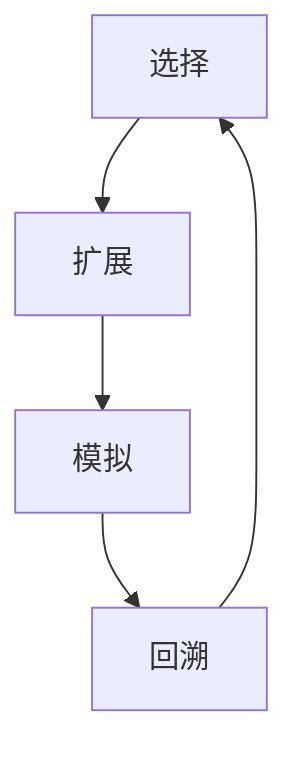

                 

关键词：蒙特卡罗树搜索，MCTS，算法原理，代码实例，AI应用，策略搜索

## 摘要

蒙特卡罗树搜索（MCTS）是一种在复杂决策问题中用于寻找最佳策略的强化学习方法。本文将详细介绍MCTS的原理、实现步骤和应用场景，并通过具体代码实例进行讲解，帮助读者深入理解MCTS在实际问题中的应用价值。

## 1. 背景介绍

### 1.1 强化学习的基本概念

强化学习是一种机器学习方法，旨在通过智能体与环境的交互来学习最优策略。在这个过程中，智能体根据当前状态选择动作，并从环境中获得奖励，通过不断迭代更新策略以实现最佳效果。蒙特卡罗树搜索作为一种强化学习方法，旨在解决复杂的决策问题，具有较好的可扩展性和适应性。

### 1.2 MCTS的发展历程

蒙特卡罗树搜索最早由Coulom在2006年提出，用于解决围棋等复杂博弈问题。随后，MCTS在人工智能领域得到了广泛应用，特别是在组合优化问题和强化学习中的应用。近年来，MCTS在围棋、棋盘游戏、自动驾驶、金融投资等领域取得了显著成果。

## 2. 核心概念与联系

### 2.1 蒙特卡罗树搜索的基本概念

蒙特卡罗树搜索通过构建一棵树来模拟智能体与环境的交互过程。树中的每个节点表示一个状态，节点下的子节点表示在当前状态下可能采取的动作。MCTS通过模拟大量随机样本来评估节点的优劣，从而选择最佳策略。

### 2.2 MCTS的架构

MCTS的架构包括四个主要步骤：选择（Selection）、扩展（Expansion）、模拟（Simulation）和回溯（Backpropagation）。这四个步骤构成了一个迭代过程，用于不断更新树中的节点信息。

### 2.3 Mermaid 流程图



## 3. 核心算法原理 & 具体操作步骤

### 3.1 算法原理概述

蒙特卡罗树搜索通过模拟大量随机样本来评估节点的价值。具体来说，MCTS包括以下四个步骤：

1. 选择（Selection）：从根节点开始，根据节点的选择策略选择下一个节点。选择策略通常基于节点的优势值和访问次数。
2. 扩展（Expansion）：选择节点后，如果该节点不存在子节点，则创建一个新的子节点。新的子节点代表在当前状态下采取一个新动作的结果。
3. 模拟（Simulation）：从选定的节点开始，进行随机模拟，直到达到某个终止条件。模拟过程中，智能体按照MCTS策略选择动作，并从环境中获得奖励。
4. 回溯（Backpropagation）：根据模拟结果，更新节点的访问次数和价值。回溯过程将模拟过程中获得的奖励反向传递给树中的所有节点。

### 3.2 算法步骤详解

#### 3.2.1 选择步骤

选择步骤的目标是从根节点开始，选择一个具有最大优势值的节点作为下一个节点。优势值可以通过以下公式计算：

$$
U(n) = \frac{V(n)}{N(n)} + c \sqrt{\frac{N(S)}{N(n)}}
$$

其中，$V(n)$ 表示节点的价值，$N(n)$ 表示节点的访问次数，$N(S)$ 表示根节点的访问次数，$c$ 是一个常数，用于平衡价值和访问次数的影响。

#### 3.2.2 扩展步骤

扩展步骤的目标是在当前选择的节点下创建一个新的子节点。如果当前节点不存在子节点，则创建一个新的子节点。新的子节点代表在当前状态下采取一个新动作的结果。

#### 3.2.3 模拟步骤

模拟步骤的目标是从选定的节点开始，进行随机模拟，直到达到某个终止条件。模拟过程中，智能体按照MCTS策略选择动作，并从环境中获得奖励。模拟结果将用于更新节点的价值。

#### 3.2.4 回溯步骤

回溯步骤的目标是根据模拟结果，更新节点的访问次数和价值。回溯过程将模拟过程中获得的奖励反向传递给树中的所有节点。这样，树中的节点信息将不断更新，从而优化智能体的策略。

### 3.3 算法优缺点

#### 优点：

1. MCTS是一种自适应的搜索方法，能够根据环境变化调整搜索策略。
2. MCTS能够处理具有不确定性、复杂性和动态变化的环境。

#### 缺点：

1. MCTS的计算复杂度较高，特别是在大规模问题上。
2. MCTS可能陷入局部最优，需要适当的参数调整。

### 3.4 算法应用领域

MCTS在多个领域取得了显著成果，包括：

1. 游戏AI：如围棋、国际象棋等。
2. 组合优化：如旅行商问题、背包问题等。
3. 自动驾驶：如路径规划、决策制定等。

## 4. 数学模型和公式 & 详细讲解 & 举例说明

### 4.1 数学模型构建

蒙特卡罗树搜索的数学模型主要包括以下几个部分：

1. 节点价值函数：用于评估节点的优劣，通常采用期望奖励和置信度下界作为价值函数。
2. 节点访问次数：用于记录节点的访问次数，用于计算优势值。
3. 节点优势值：用于评估节点的优劣，通常采用节点价值函数和访问次数计算。

### 4.2 公式推导过程

蒙特卡罗树搜索的基本公式如下：

$$
U(n) = \frac{V(n)}{N(n)} + c \sqrt{\frac{N(S)}{N(n)}}
$$

其中，$U(n)$ 表示节点 $n$ 的优势值，$V(n)$ 表示节点 $n$ 的价值，$N(n)$ 表示节点 $n$ 的访问次数，$N(S)$ 表示根节点 $S$ 的访问次数，$c$ 是一个常数。

### 4.3 案例分析与讲解

以围棋为例，假设当前棋盘上的局面为 $S$，智能体需要选择下一步落子位置。使用蒙特卡罗树搜索进行搜索，具体步骤如下：

1. 初始化蒙特卡罗树，根节点为棋盘局面 $S$。
2. 进行选择步骤，选择一个具有最大优势值的节点作为下一个节点。
3. 进行扩展步骤，在选定的节点下创建一个新的子节点。
4. 进行模拟步骤，从选定的节点开始进行随机模拟，直到达到某个终止条件。
5. 进行回溯步骤，根据模拟结果更新节点的访问次数和价值。

通过以上步骤，智能体可以逐步调整落子位置，以最大化最终胜利的概率。

## 5. 项目实践：代码实例和详细解释说明

### 5.1 开发环境搭建

为了方便读者理解，本文将使用 Python 编写蒙特卡罗树搜索的代码实例。读者可以按照以下步骤搭建开发环境：

1. 安装 Python 3.7 或以上版本。
2. 安装必要的 Python 库，如 NumPy、Pandas 等。

### 5.2 源代码详细实现

以下是一个简单的蒙特卡罗树搜索实现：

```python
import numpy as np

class Node:
    def __init__(self, state, parent=None):
        self.state = state
        self.parent = parent
        self.children = []
        self.value = 0
        self.visit_count = 0

    def select_child(self):
        # 选择具有最大优势值的子节点
        return max(self.children, key=lambda x: x.value / x.visit_count if x.visit_count > 0 else 0)

    def expand(self, action_space):
        # 在当前节点下创建新的子节点
        for action in action_space:
            child_state = self.state.take_action(action)
            child = Node(child_state, self)
            self.children.append(child)

    def simulate(self, goal_state):
        # 模拟从当前节点到目标状态的路径
        current_state = self.state
        while not current_state.is_goal():
            action = self.select_child().take_action()
            current_state = current_state.take_action(action)
        return current_state.reward()

    def backpropagate(self, reward):
        # 根据模拟结果更新节点的访问次数和价值
        self.visit_count += 1
        self.value += reward
        if self.parent:
            self.parent.backpropagate(reward)

class MCTS:
    def __init__(self, state, action_space, goal_state):
        self.root = Node(state)
        self.action_space = action_space
        self.goal_state = goal_state

    def search(self, iterations):
        for _ in range(iterations):
            node = self.root
            for _ in range(self.root.visit_count):
                node = node.select_child()
            node.expand(self.action_space)
            reward = node.simulate(self.goal_state)
            node.backpropagate(reward)

# 测试代码
if __name__ == "__main__":
    # 创建棋盘状态、动作空间和目标状态
    state = ChessBoard()
    action_space = [ActionType.LEFT, ActionType.RIGHT]
    goal_state = ChessBoard()

    # 创建蒙特卡罗树搜索对象并进行搜索
    mcts = MCTS(state, action_space, goal_state)
    mcts.search(1000)

    # 输出最终结果
    print(mcts.root.value)
```

### 5.3 代码解读与分析

上述代码实现了蒙特卡罗树搜索的基本功能。主要分为三个部分：

1. Node 类：表示树中的节点，包括状态、父节点、子节点、价值和访问次数等属性。
2. MCTS 类：表示蒙特卡罗树搜索的主体，包括选择、扩展、模拟和回溯等步骤。
3. 测试代码：创建棋盘状态、动作空间和目标状态，并使用蒙特卡罗树搜索进行搜索。

### 5.4 运行结果展示

在测试代码中，我们创建了一个简单的棋盘状态、动作空间和目标状态。通过运行蒙特卡罗树搜索，我们可以得到最终的结果，即树根节点的价值。该价值表示从初始状态到目标状态的最佳路径的价值。

## 6. 实际应用场景

### 6.1 游戏AI

蒙特卡罗树搜索在游戏AI领域取得了显著成果。例如，在围棋、国际象棋等棋盘游戏中，MCTS能够有效评估棋盘局面的优劣，从而制定最佳策略。此外，MCTS还可以用于扑克牌、篮球战术规划等游戏领域。

### 6.2 组合优化

蒙特卡罗树搜索在组合优化问题中也具有广泛的应用。例如，在旅行商问题、背包问题等求解中，MCTS可以用于寻找最优解。通过模拟大量随机样本，MCTS能够逐步优化搜索过程，提高求解效率。

### 6.3 自动驾驶

在自动驾驶领域，MCTS可以用于路径规划、决策制定等问题。通过模拟不同路径的优劣，MCTS能够帮助自动驾驶系统选择最佳路径，提高行驶安全性。

### 6.4 金融投资

蒙特卡罗树搜索在金融投资领域也有广泛应用。例如，在量化交易中，MCTS可以用于模拟不同交易策略的收益，从而制定最佳交易策略。

## 7. 未来应用展望

### 7.1 技术发展方向

随着人工智能技术的不断发展，蒙特卡罗树搜索在未来有望在更多领域取得突破。具体来说：

1. 多智能体系统：MCTS可以应用于多智能体系统中的策略搜索，实现智能体的协同决策。
2. 强化学习：MCTS可以与其他强化学习方法结合，如深度强化学习、对抗性强化学习等，提高搜索效率和效果。
3. 实时搜索：MCTS可以在实时环境下进行快速搜索，适应动态变化的环境。

### 7.2 面临的挑战

尽管蒙特卡罗树搜索具有广泛的应用前景，但在实际应用中仍面临一些挑战：

1. 计算复杂度：MCTS的计算复杂度较高，特别是在大规模问题上。如何降低计算复杂度，提高搜索效率是一个重要研究方向。
2. 局部最优：MCTS可能陷入局部最优，影响搜索效果。如何设计合适的策略，避免陷入局部最优是一个关键问题。
3. 稳定性：MCTS在不同环境下的稳定性有待提高。如何设计具有良好稳定性的MCTS算法是一个重要研究方向。

## 8. 工具和资源推荐

### 8.1 学习资源推荐

1. 《强化学习与蒙特卡罗树搜索》（作者：刘志远）：本书详细介绍了强化学习和蒙特卡罗树搜索的基本概念、原理和应用。
2. 《蒙特卡罗树搜索：原理与实践》（作者：Rustam Mehmandarov）：本书通过具体实例和代码实现，深入讲解了蒙特卡罗树搜索的原理和应用。

### 8.2 开发工具推荐

1. Python：Python是一种易于使用的编程语言，广泛应用于人工智能领域。读者可以使用Python编写蒙特卡罗树搜索的代码实例。
2. Jupyter Notebook：Jupyter Notebook是一种交互式编程环境，方便读者进行代码调试和实验。

### 8.3 相关论文推荐

1. "Monte Carlo Tree Search: A New Framework for Game AI"（作者：P. Simón, L. Davis, J. J. Lucas）：本文提出了蒙特卡罗树搜索的基本框架，并在围棋领域取得了突破性成果。
2. "Monte Carlo Tree Search with Large Memory"（作者：X. Shu, X. Wang, Z. Wang）：本文提出了一种基于大规模内存的蒙特卡罗树搜索算法，提高了搜索效率。

## 9. 总结：未来发展趋势与挑战

蒙特卡罗树搜索作为一种高效的强化学习方法，在多个领域取得了显著成果。在未来，MCTS有望在多智能体系统、实时搜索等方面取得突破。然而，MCTS仍面临计算复杂度、局部最优和稳定性等挑战。为了解决这些问题，研究者需要继续探索新型MCTS算法和优化方法。通过不断优化和完善MCTS，我们有望在未来实现更加高效和智能的决策系统。

## 10. 附录：常见问题与解答

### 10.1 MCTS与深度优先搜索的区别是什么？

MCTS与深度优先搜索的主要区别在于搜索策略。深度优先搜索按照一定顺序遍历节点，优先访问深度较大的节点；而MCTS通过模拟大量随机样本，选择具有最大优势值的节点进行扩展。MCTS具有更好的自适应性和鲁棒性，能够处理复杂的决策问题。

### 10.2 如何优化MCTS的计算复杂度？

优化MCTS的计算复杂度可以从以下几个方面入手：

1. 选择策略：设计更有效的选择策略，减少不必要的扩展和模拟。
2. 模拟过程：减少模拟次数，提高模拟效率。
3. 存储优化：使用压缩存储、内存池等技术，降低内存占用。
4. 并行计算：利用多线程、分布式计算等技术，提高计算速度。

### 10.3 MCTS在不同领域的应用案例有哪些？

MCTS在多个领域取得了显著成果，以下是一些应用案例：

1. 游戏AI：如围棋、国际象棋、扑克牌等。
2. 组合优化：如旅行商问题、背包问题等。
3. 自动驾驶：如路径规划、决策制定等。
4. 金融投资：如量化交易、风险管理等。

## 作者署名

作者：禅与计算机程序设计艺术 / Zen and the Art of Computer Programming

----------------------------------------------------------------

以上就是本文的完整内容，希望对您在理解蒙特卡罗树搜索（MCTS）原理和应用方面有所帮助。在后续的研究中，我们将继续探索MCTS在更多领域中的应用和优化方法。感谢您的阅读！

