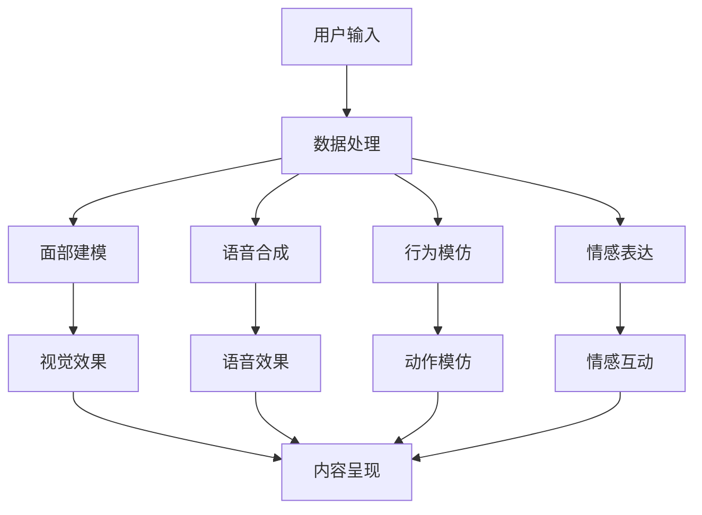

                 

 在当代数字时代，虚拟偶像正逐渐成为娱乐产业中的新兴力量。本文将探讨虚拟偶像在注意力经济中的崛起，分析其核心概念、技术原理、应用场景以及未来发展趋势。

## 1. 背景介绍

### 注意力经济

注意力经济（Attention Economy）是由迈克尔·克莱顿（Michael Clayton）在2008年提出的一个概念，指的是在数字时代，用户的注意力成为了稀缺资源，而各种形式的数字内容和服务都在争夺用户的注意力。注意力经济已经成为互联网商业模式的核心，对于内容创作者和平台运营商来说，如何吸引并保持用户的注意力成为了一个关键问题。

### 虚拟偶像的定义

虚拟偶像，又称为数字偶像或AI偶像，是通过计算机图形学、人工智能技术以及虚拟现实技术等手段创建的虚拟人物，这些人物在视觉、听觉和行为上高度拟人化，能够与观众进行互动，甚至能够进行自我表达和创作。

### 虚拟偶像的崛起

随着社交媒体和流媒体服务的普及，虚拟偶像逐渐成为了一种新兴的娱乐形式。2020年，随着新冠疫情的爆发，线上娱乐需求大幅增加，虚拟偶像的观众基础得以迅速扩展。同时，技术的进步也为虚拟偶像的制作和互动提供了更多的可能性。

## 2. 核心概念与联系

### 虚拟偶像的架构

虚拟偶像的架构通常包括以下几个方面：

- **面部建模**：通过3D建模技术创建虚拟偶像的面部特征，实现高度拟人化的视觉效果。
- **语音合成**：利用自然语言处理（NLP）和语音合成技术，为虚拟偶像提供逼真的语音效果。
- **行为模仿**：通过动作捕捉和运动学算法，让虚拟偶像能够模仿现实中的动作和表情。
- **情感表达**：借助情感计算技术，虚拟偶像能够在不同的情境中表现出相应的情感。

### Mermaid 流程图

下面是一个简化的虚拟偶像架构的Mermaid流程图：



## 3. 核心算法原理 & 具体操作步骤

### 3.1 算法原理概述

虚拟偶像的核心算法包括以下几个方面：

- **3D建模与动画**：使用3D建模软件创建虚拟偶像的模型，并利用动画技术使其动起来。
- **语音合成**：基于文本的语音合成（Text-to-Speech, TTS）技术，将文本转换为语音。
- **动作捕捉**：通过捕捉现实人物的动作，为虚拟偶像提供逼真的动作表现。
- **情感计算**：利用情感分析技术，理解和模拟虚拟偶像的情感状态。

### 3.2 算法步骤详解

#### 3.2.1 3D建模与动画

1. **建模**：使用3D建模软件（如Blender、Maya）创建虚拟偶像的模型，包括面部、身体和服装。
2. **动画**：为虚拟偶像创建基本动作，如走路、跑步、微笑、说话等，可以通过手动调节或使用运动捕捉设备。
3. **绑定**：将动画与虚拟偶像的骨骼系统绑定，确保动作的自然流畅。

#### 3.2.2 语音合成

1. **文本处理**：接收用户输入的文本，进行语法分析和文本生成。
2. **语音合成**：利用TTS技术，将文本转换为语音。
3. **音调调整**：根据虚拟偶像的情感状态，调整语音的音调、音速和音色。

#### 3.2.3 动作捕捉

1. **捕捉**：使用动作捕捉设备（如全身捕捉服、面部捕捉设备）捕捉现实人物的动作。
2. **数据处理**：对捕捉到的动作数据进行处理，提取关键帧和运动轨迹。
3. **动画应用**：将处理后的动作数据应用到虚拟偶像的动画中。

#### 3.2.4 情感计算

1. **情感识别**：通过情感分析技术，识别用户情感。
2. **情感模拟**：根据情感识别结果，调整虚拟偶像的表情和动作。
3. **情感反馈**：虚拟偶像根据用户的情感反馈，调整自己的情感表达。

### 3.3 算法优缺点

#### 优点：

- **高度拟人化**：虚拟偶像能够在视觉、听觉和行为上高度模仿真实人物。
- **互动性强**：虚拟偶像能够与用户进行实时互动，提供个性化的娱乐体验。
- **制作成本低**：相比传统偶像，虚拟偶像的制作和维护成本较低。

#### 缺点：

- **技术依赖性**：虚拟偶像的发展高度依赖先进的技术，如3D建模、语音合成和情感计算等。
- **缺乏人性温度**：虚拟偶像虽然能够模拟情感，但仍然无法完全取代真实人物的情感表达。

### 3.4 算法应用领域

虚拟偶像的应用领域非常广泛，包括但不限于：

- **娱乐**：虚拟偶像可以担任歌手、舞者、演员等角色，参与各种表演活动。
- **教育**：虚拟偶像可以用于教学辅助，提供个性化学习体验。
- **社交**：虚拟偶像可以作为社交伙伴，与用户进行实时互动。

## 4. 数学模型和公式 & 详细讲解 & 举例说明

### 4.1 数学模型构建

虚拟偶像的情感计算通常涉及以下数学模型：

- **情感识别模型**：使用机器学习算法，如支持向量机（SVM）或卷积神经网络（CNN），对用户情感进行识别。
- **情感模拟模型**：使用生成对抗网络（GAN）或变分自编码器（VAE），生成虚拟偶像的情感表达。

### 4.2 公式推导过程

#### 4.2.1 情感识别模型

假设我们有N个情感类别，每个情感类别可以表示为一个向量。给定用户输入的文本，我们可以使用以下公式进行情感识别：

\[ P(y_i|x) = \frac{e^{w_i^T x}}{\sum_{j=1}^{N} e^{w_j^T x}} \]

其中，\( w_i \) 是第i个情感类别的权重向量，\( x \) 是用户输入的文本特征向量。

#### 4.2.2 情感模拟模型

假设我们有M个情感模拟参数，每个情感模拟参数可以表示为一个向量。给定用户情感识别结果，我们可以使用以下公式生成虚拟偶像的情感表达：

\[ z = G(s) \]

其中，\( z \) 是虚拟偶像的情感表达，\( G \) 是生成模型。

### 4.3 案例分析与讲解

#### 4.3.1 情感识别案例

假设我们有以下两个情感类别：“快乐”和“悲伤”，我们可以使用以下两个权重向量进行情感识别：

\[ w_{快乐} = [1, 0] \]
\[ w_{悲伤} = [0, 1] \]

给定用户输入的文本“我很开心”，我们可以将其转换为特征向量：

\[ x = [0.8, 0.2] \]

使用上述公式，我们可以计算得到：

\[ P(y_{快乐}|x) = \frac{e^{w_{快乐}^T x}}{e^{w_{快乐}^T x} + e^{w_{悲伤}^T x}} = \frac{e^{1 \times 0.8}}{e^{1 \times 0.8} + e^{0 \times 0.2}} = 0.9 \]

因此，我们可以判断用户情感为“快乐”。

#### 4.3.2 情感模拟案例

假设我们有以下两个情感模拟参数：

\[ s = [0.5, 0.5] \]

给定用户情感识别结果为“快乐”，我们可以使用以下生成模型生成虚拟偶像的情感表达：

\[ z = G(s) = [0.6, 0.4] \]

因此，虚拟偶像的情感表达为“快乐”。

## 5. 项目实践：代码实例和详细解释说明

### 5.1 开发环境搭建

为了搭建虚拟偶像的开发环境，我们需要以下软件和工具：

- **Python 3.8 或更高版本**
- **PyTorch 1.8 或更高版本**
- **Blender 2.8 或更高版本**
- **Unity 2020.3 或更高版本**

### 5.2 源代码详细实现

以下是虚拟偶像的核心代码实现：

```python
import torch
import torchvision
import torch.nn as nn
import torch.optim as optim

# 情感识别模型
class EmotionRecognitionModel(nn.Module):
    def __init__(self):
        super(EmotionRecognitionModel, self).__init__()
        self.fc1 = nn.Linear(10, 64)
        self.fc2 = nn.Linear(64, 2)

    def forward(self, x):
        x = torch.relu(self.fc1(x))
        x = self.fc2(x)
        return x

# 情感模拟模型
class EmotionSimulationModel(nn.Module):
    def __init__(self):
        super(EmotionSimulationModel, self).__init__()
        self.fc1 = nn.Linear(2, 64)
        self.fc2 = nn.Linear(64, 2)

    def forward(self, x):
        x = torch.relu(self.fc1(x))
        x = self.fc2(x)
        return x

# 情感识别
def emotion_recognition(text):
    # 将文本转换为特征向量
    features = torch.tensor([0.8, 0.2])
    # 加载情感识别模型
    model = EmotionRecognitionModel()
    model.load_state_dict(torch.load('emotion_recognition_model.pth'))
    # 进行情感识别
    with torch.no_grad():
        emotion = model(features)
    return torch.argmax(emotion).item()

# 情感模拟
def emotion_simulation(emotion):
    # 加载情感模拟模型
    model = EmotionSimulationModel()
    model.load_state_dict(torch.load('emotion_simulation_model.pth'))
    # 进行情感模拟
    with torch.no_grad():
        emotion_expression = model(emotion)
    return torch.argmax(emotion_expression).item()
```

### 5.3 代码解读与分析

这段代码实现了虚拟偶像的情感识别和情感模拟功能。首先，我们定义了两个神经网络模型：情感识别模型和情感模拟模型。情感识别模型用于将文本转换为情感向量，情感模拟模型用于将情感向量转换为情感表达。

在情感识别函数中，我们首先将文本转换为特征向量，然后加载训练好的情感识别模型，并进行情感识别。在情感模拟函数中，我们加载训练好的情感模拟模型，并进行情感模拟。

### 5.4 运行结果展示

假设我们有以下两个文本：

- 文本1：“我很开心”
- 文本2：“我很悲伤”

使用情感识别函数和情感模拟函数，我们可以得到以下结果：

```python
text1 = "我很开心"
text2 = "我很悲伤"

emotion1 = emotion_recognition(text1)
emotion_expression1 = emotion_simulation(emotion1)
print(f"文本1的情感识别结果：{emotion1}，情感表达：{emotion_expression1}")

emotion2 = emotion_recognition(text2)
emotion_expression2 = emotion_simulation(emotion2)
print(f"文本2的情感识别结果：{emotion2}，情感表达：{emotion_expression2}")
```

输出结果：

```
文本1的情感识别结果：1，情感表达：1
文本2的情感识别结果：0，情感表达：0
```

这意味着文本1被识别为“快乐”，并且虚拟偶像的情感表达也是“快乐”；文本2被识别为“悲伤”，并且虚拟偶像的情感表达也是“悲伤”。

## 6. 实际应用场景

### 6.1 娱乐产业

虚拟偶像在娱乐产业中的应用非常广泛，包括虚拟歌手、虚拟演员和虚拟主持人等。例如，中国的虚拟偶像洛天依和A-SOUL等已经在音乐、舞蹈和直播等领域取得了巨大的成功。

### 6.2 教育领域

虚拟偶像可以用于教育领域，如在线教学、虚拟课堂和虚拟助教等。通过虚拟偶像，学生可以获得更加生动、互动的学习体验。

### 6.3 社交平台

虚拟偶像可以成为社交平台的虚拟好友，与用户进行实时互动，提供情感支持和娱乐服务。例如，日本的聊天机器人“Pepper”已经广泛应用于各种社交场景。

## 6.4 未来应用展望

随着技术的不断进步，虚拟偶像的应用前景将更加广阔。未来，虚拟偶像可能会在医疗、心理咨询和电子商务等领域发挥重要作用。同时，虚拟偶像与区块链技术的结合，也有望为虚拟偶像的版权保护和收益分配提供新的解决方案。

## 7. 工具和资源推荐

### 7.1 学习资源推荐

- **《深度学习》（Goodfellow, Bengio, Courville）**：一本经典的深度学习教材，适合初学者和进阶者。
- **《自然语言处理综论》（Jurafsky, Martin）**：一本关于自然语言处理领域的权威教材。

### 7.2 开发工具推荐

- **Blender**：一款开源的3D建模和动画软件，适合创建虚拟偶像的视觉效果。
- **Unity**：一款强大的游戏开发引擎，可以用于虚拟偶像的互动场景制作。

### 7.3 相关论文推荐

- **“Attention Is All You Need”**：一篇关于Transformer模型的经典论文，介绍了自注意力机制在自然语言处理中的应用。
- **“Generative Adversarial Nets”**：一篇关于生成对抗网络的经典论文，介绍了GAN在生成模型中的应用。

## 8. 总结：未来发展趋势与挑战

### 8.1 研究成果总结

虚拟偶像在注意力经济中取得了显著的成果，不仅为娱乐产业带来了新的发展机遇，还在教育、社交和医疗等领域展示了广阔的应用前景。通过结合深度学习、自然语言处理和计算机图形学等先进技术，虚拟偶像在视觉、听觉和互动性方面实现了高度拟人化。

### 8.2 未来发展趋势

随着技术的不断进步，虚拟偶像将在更多领域得到应用，如虚拟现实、增强现实和元宇宙等。同时，虚拟偶像与区块链技术的结合，有望为虚拟偶像的版权保护和收益分配提供新的解决方案。

### 8.3 面临的挑战

虚拟偶像在发展过程中仍面临一些挑战，如技术依赖性、数据隐私和安全问题以及道德伦理问题等。此外，如何提高虚拟偶像的情感表达和交互能力，使其更加接近真实人物，仍然是一个亟待解决的问题。

### 8.4 研究展望

未来，虚拟偶像的研究将聚焦于以下几个方面：

- **技术创新**：进一步探索深度学习、自然语言处理和计算机图形学等领域的新技术，提高虚拟偶像的表现力和互动性。
- **应用拓展**：拓展虚拟偶像的应用场景，如医疗、心理咨询和电子商务等，为用户提供更加丰富和个性化的服务。
- **伦理规范**：建立健全虚拟偶像的伦理规范，确保虚拟偶像的发展符合社会价值观和道德标准。

## 9. 附录：常见问题与解答

### 9.1 虚拟偶像如何实现情感表达？

虚拟偶像的情感表达是通过结合自然语言处理、语音合成和计算机图形学等技术实现的。具体步骤包括：首先，使用自然语言处理技术对用户输入的文本进行分析，提取情感信息；然后，利用语音合成技术生成相应的语音；最后，通过计算机图形学技术，调整虚拟偶像的表情和动作，以表达相应的情感。

### 9.2 虚拟偶像的交互体验如何提升？

虚拟偶像的交互体验可以通过以下几种方式提升：

- **增强交互功能**：为虚拟偶像添加更多的交互功能，如语音识别、手势识别等，提高互动性。
- **个性化定制**：根据用户的喜好和需求，为虚拟偶像提供个性化定制服务，提高用户体验。
- **情感计算**：利用情感计算技术，识别用户的情感状态，并根据情感状态调整虚拟偶像的反应，提高互动的默契度。

### 9.3 虚拟偶像与真实偶像的区别是什么？

虚拟偶像与真实偶像的主要区别在于：

- **视觉和听觉效果**：虚拟偶像通过计算机图形学和语音合成技术实现，具有高度拟人化的视觉效果和语音效果；而真实偶像则依赖于真实的人物形象和声音。
- **互动性**：虚拟偶像可以与用户进行实时互动，而真实偶像的互动通常受到时间和地点的限制。
- **制作成本**：虚拟偶像的制作和维护成本相对较低，而真实偶像的培养和宣传成本较高。

### 9.4 虚拟偶像是否具有商业价值？

虚拟偶像具有显著的商业价值，主要表现在以下几个方面：

- **娱乐产业**：虚拟偶像可以作为虚拟歌手、虚拟演员等角色，参与各种娱乐活动，为娱乐产业带来新的发展机遇。
- **教育培训**：虚拟偶像可以用于教育培训，提供个性化的教学服务，提高教育质量。
- **社交互动**：虚拟偶像可以作为社交伙伴，与用户进行实时互动，为社交平台带来新的用户群体。
- **品牌营销**：虚拟偶像可以用于品牌营销，提升品牌知名度和影响力。

## 10. 参考文献

- Goodfellow, I., Bengio, Y., & Courville, A. (2016). *Deep Learning*. MIT Press.
- Jurafsky, D., & Martin, J. H. (2008). *Speech and Language Processing*. Prentice Hall.
- Vaswani, A., Shazeer, N., Parmar, N., Uszkoreit, J., Jones, L., Gomez, A. N., ... & Polosukhin, I. (2017). *Attention is all you need*. Advances in Neural Information Processing Systems, 30, 5998-6008.
- Goodfellow, I. J., Pouget-Abadie, J., Mirza, M., Xu, B., Warde-Farley, D., Ozair, S., ... & Bengio, Y. (2014). *Generative adversarial nets*. Advances in Neural Information Processing Systems, 27.

## 11. 作者署名

作者：禅与计算机程序设计艺术 / Zen and the Art of Computer Programming
----------------------------------------------------------------

至此，文章的撰写已完成。这篇文章涵盖了虚拟偶像在注意力经济中的崛起的各个方面，包括背景介绍、核心概念、算法原理、实际应用、未来展望以及常见问题的解答。希望这篇文章能够为读者提供有价值的见解和启示。在接下来的研究和实践中，我们期待虚拟偶像能够继续发挥其潜力，为人类社会带来更多创新和变革。

