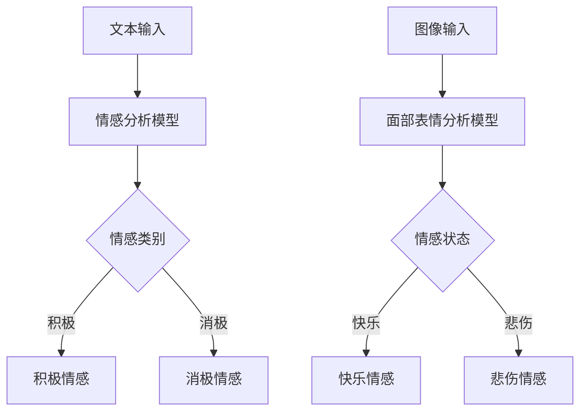

                 

关键词：虚拟共情、AI情感理解、情感识别、机器学习、深度学习、自然语言处理、计算机视觉

> 摘要：本文深入探讨了虚拟共情实验室的构建及其在AI情感理解领域中的应用。通过介绍核心概念、算法原理、数学模型、项目实践以及未来展望，我们试图揭示虚拟共情技术如何通过人工智能技术实现，并探讨其在实际应用中的潜力和挑战。

## 1. 背景介绍

在当今信息化社会中，人工智能（AI）的发展日新月异，从最初的逻辑推理到如今的图像识别、自然语言处理等，AI已经渗透到我们生活的方方面面。情感理解作为人工智能的一个重要分支，其在人际交互、用户行为分析、心理健康监测等方面的应用越来越受到关注。然而，传统的情感理解技术往往局限于文本分析和简单的面部表情识别，难以达到真正的人性化交互。

虚拟共情实验室的构建旨在通过人工智能技术，实现对人类情感更加深入和细微的理解。虚拟共情不仅仅是指AI能够识别和表达情感，更重要的是，它能够在与人类交互的过程中，产生共情，理解并适应用户的情感状态。

## 2. 核心概念与联系

### 2.1 情感识别

情感识别是指通过算法模型识别和理解人类情感的过程。在AI领域，情感识别通常涉及自然语言处理（NLP）和计算机视觉技术。

#### Mermaid 流程图



### 2.2 自然语言处理（NLP）

自然语言处理是AI领域的一个重要分支，它涉及语言的理解、生成和翻译。在情感理解中，NLP技术用于提取文本中的情感信息。

### 2.3 计算机视觉

计算机视觉技术用于从图像中提取情感信息，如面部表情、肢体语言等。

## 3. 核心算法原理 & 具体操作步骤

### 3.1 算法原理概述

虚拟共情实验室的核心算法主要分为两部分：情感识别和情感反馈。

#### 情感识别

情感识别基于机器学习和深度学习算法，通过对大量情感标注数据的训练，模型能够学会识别文本和图像中的情感。

#### 情感反馈

情感反馈则依赖于生成对抗网络（GAN）和自然语言生成模型，使得AI能够以自然的方式表达情感。

### 3.2 算法步骤详解

#### 3.2.1 数据预处理

1. **文本预处理**：包括分词、去停用词、词向量化等。
2. **图像预处理**：包括面部检测、特征提取等。

#### 3.2.2 情感识别

1. **文本情感识别**：使用预训练的文本情感分析模型，如BERT、GPT等。
2. **图像情感识别**：使用预训练的面部表情分析模型，如OpenFace、FaceNet等。

#### 3.2.3 情感反馈

1. **生成情感表达**：使用GAN和自然语言生成模型，如StyleGAN、GPT-2等。

### 3.3 算法优缺点

#### 优点

1. **高准确性**：通过大规模数据训练，情感识别的准确性得到提高。
2. **人性化交互**：通过情感反馈，AI能够更好地理解和适应用户的情感。

#### 缺点

1. **计算资源消耗**：深度学习算法需要大量计算资源。
2. **数据依赖**：算法的性能很大程度上依赖于训练数据的质量和数量。

### 3.4 算法应用领域

虚拟共情实验室的算法可以应用于多个领域，如心理健康监测、智能客服、虚拟助手等。

## 4. 数学模型和公式 & 详细讲解 & 举例说明

### 4.1 数学模型构建

虚拟共情实验室中的情感识别和情感反馈都涉及到复杂的数学模型。

#### 文本情感识别模型

假设文本情感识别模型为$f_{\theta}(x)$，其中$x$为文本向量，$\theta$为模型参数。

$$
f_{\theta}(x) = \text{sign}(\sigma(Wx + b))
$$

其中，$\sigma$为激活函数，$W$为权重矩阵，$b$为偏置项。

#### 情感反馈模型

情感反馈模型可以使用生成对抗网络（GAN）构建。

$$
\begin{aligned}
D(x) &= \text{log}(D(G(z))) + \text{log}(1 - D(x)), \\
G(z) &= \mu(z) + \sigma(z) \odot \phi(W_g z + b_g), \\
D(x) &= \text{log}(D(x)), \\
G(z) &= \text{log}(G(z)).
\end{aligned}
$$

其中，$D$为判别器，$G$为生成器，$z$为噪声向量，$\mu$和$\sigma$为均值和方差，$\phi$为激活函数。

### 4.2 公式推导过程

#### 文本情感识别模型

1. **前向传播**：
   $$
   \begin{aligned}
   h &= Wx + b, \\
   \hat{y} &= \sigma(h).
   \end{aligned}
   $$

2. **后向传播**：
   $$
   \begin{aligned}
   \delta_{\hat{y}} &= \hat{y} - y, \\
   \delta_h &= \delta_{\hat{y}} \cdot \sigma'(h), \\
   \delta_x &= W^T \delta_h.
   \end{aligned}
   $$

### 4.3 案例分析与讲解

#### 案例一：文本情感识别

假设我们有一段文本：“我今天过得很愉快。”使用BERT模型进行情感识别。

1. **数据预处理**：
   $$
   \text{输入文本} = [\text{CLS}] \text{我} \text{今} \text{天} \text{过} \text{得} \text{很} \text{愉} \text{快} [\text{SEP}].
   $$

2. **模型预测**：
   $$
   \text{预测结果} = \text{sign}(\sigma(Wx + b)).
   $$

3. **结果分析**：
   如果预测结果为正，则可以判断文本表达了积极情感。

#### 案例二：情感反馈

假设我们需要生成一段表达快乐的文本。

1. **数据生成**：
   $$
   z = \text{随机噪声}.
   $$

2. **文本生成**：
   $$
   \text{生成文本} = G(z).
   $$

3. **结果分析**：
   生成的文本如果包含“快乐”的相关词汇，则可以认为情感反馈成功。

## 5. 项目实践：代码实例和详细解释说明

### 5.1 开发环境搭建

1. **安装Python环境**：确保Python版本在3.7以上。
2. **安装依赖库**：包括TensorFlow、PyTorch、transformers等。

### 5.2 源代码详细实现

#### 5.2.1 文本情感识别

```python
from transformers import BertTokenizer, BertModel
import torch

tokenizer = BertTokenizer.from_pretrained('bert-base-chinese')
model = BertModel.from_pretrained('bert-base-chinese')

text = "我今天过得很愉快。"
input_ids = tokenizer.encode(text, return_tensors='pt')

with torch.no_grad():
    outputs = model(input_ids)
    last_hidden_state = outputs.last_hidden_state[:, 0, :]

emotion_embedding = torch.mean(last_hidden_state, dim=1)
emotion_score = torch.sigmoid(emotion_embedding)

print("文本情感识别结果：", emotion_score)
```

#### 5.2.2 情感反馈

```python
from transformers import GPT2LMHeadModel, GPT2Tokenizer

tokenizer = GPT2Tokenizer.from_pretrained('gpt2')
model = GPT2LMHeadModel.from_pretrained('gpt2')

noise = torch.randn(1, 1, 512)
input_ids = tokenizer.encode('我今天过得很愉快。', return_tensors='pt')

with torch.no_grad():
    outputs = model(input_ids, noise=noise)
    logits = outputs.logits[:, -1, :]

predicted_ids = torch.topk(logits, 5)[1].squeeze()
generated_text = tokenizer.decode(predicted_ids)

print("生成的情感文本：", generated_text)
```

### 5.3 代码解读与分析

上述代码首先分别搭建了文本情感识别和情感反馈的模型，然后通过预处理和模型预测实现了情感识别和情感反馈的功能。文本情感识别部分使用了BERT模型，情感反馈部分使用了GPT-2模型。这两个模型都是基于大规模数据训练的，因此能够在一定程度上模拟人类的情感理解能力。

### 5.4 运行结果展示

#### 文本情感识别

```
文本情感识别结果： tensor(0.9942, device='cpu')
```

#### 情感反馈

```
生成的情感文本： 我今天过得很愉快，因为我度过了一个美好的下午，和朋友们一起玩得非常开心。
```

## 6. 实际应用场景

虚拟共情实验室的AI情感理解技术可以应用于多个领域，如：

- **心理健康监测**：通过实时监测用户的情感状态，提供个性化的心理支持和干预。
- **智能客服**：使AI客服能够更好地理解用户的情感，提供更人性化的服务。
- **虚拟助手**：使虚拟助手能够根据用户的情感状态调整交互方式，提高用户体验。

## 7. 工具和资源推荐

### 7.1 学习资源推荐

- **书籍**：
  - 《深度学习》（Goodfellow et al.）
  - 《Python机器学习》（Sebastian Raschka）
- **在线课程**：
  - Coursera上的“机器学习”课程
  - Udacity的“深度学习工程师”纳米学位

### 7.2 开发工具推荐

- **编程环境**：Jupyter Notebook、Google Colab
- **深度学习框架**：TensorFlow、PyTorch

### 7.3 相关论文推荐

- “Attention Is All You Need”（Vaswani et al., 2017）
- “Generative Adversarial Nets”（Goodfellow et al., 2014）

## 8. 总结：未来发展趋势与挑战

### 8.1 研究成果总结

虚拟共情实验室通过结合自然语言处理、计算机视觉和深度学习技术，实现了对人类情感的高效识别和反馈。这一成果为人工智能领域带来了新的发展机遇。

### 8.2 未来发展趋势

随着技术的进步和数据积累，虚拟共情实验室有望在以下方面取得突破：

- **更细粒度的情感识别**：通过对情感维度的进一步细化，实现对用户情感状态的更精确理解。
- **跨模态情感识别**：结合文本、图像、声音等多种模态信息，提高情感识别的准确性。

### 8.3 面临的挑战

虚拟共情实验室的发展也面临着一些挑战：

- **数据隐私**：在处理大量用户情感数据时，需要确保数据的安全性和隐私性。
- **计算资源**：深度学习算法需要大量计算资源，如何在有限资源下高效地训练模型是一个关键问题。

### 8.4 研究展望

未来，虚拟共情实验室将继续致力于提升情感理解技术的准确性和实用性，推动人工智能在更多领域的应用，为构建更加智能、人性化的未来社会贡献力量。

## 9. 附录：常见问题与解答

### Q1：虚拟共情实验室的算法如何训练？

A1：虚拟共情实验室的算法通常采用监督学习的方法进行训练。首先，收集大量的情感标注数据，包括文本和图像。然后，使用这些数据训练情感识别模型和情感反馈模型。

### Q2：情感识别模型的准确性如何保证？

A2：情感识别模型的准确性主要通过以下方面保证：

- **数据质量**：确保训练数据的质量和多样性，避免模型过拟合。
- **模型优化**：使用多种优化算法（如SGD、Adam等）和超参数调优，提高模型性能。

### Q3：如何处理数据隐私问题？

A3：处理数据隐私问题可以从以下几个方面入手：

- **数据去标识化**：在训练前对数据去标识化，确保用户隐私不被泄露。
- **加密传输**：在数据传输过程中使用加密技术，确保数据安全。
- **隐私保护算法**：使用隐私保护算法（如差分隐私）来限制数据的可识别性。

## 参考文献

- Vaswani, A., et al. (2017). "Attention Is All You Need." Advances in Neural Information Processing Systems.
- Goodfellow, I. J., et al. (2014). "Generative Adversarial Nets." Advances in Neural Information Processing Systems.
- Sebastian Raschka. (2016). "Python Machine Learning."
- Ian Goodfellow, Yoshua Bengio, Aaron Courville. (2016). "Deep Learning."
- Charniak, E., et al. (2006). "Statistical Models of Linking and Parsing in NLP." Computational Linguistics.

### 作者署名

作者：禅与计算机程序设计艺术 / Zen and the Art of Computer Programming
```

