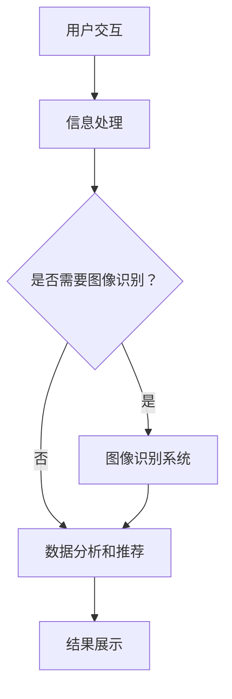

                 

关键词：虚拟导购助手、AI技术、用户体验、技术融合、创新

摘要：本文深入探讨了虚拟导购助手如何通过与其他 AI 技术的融合，来提升用户的购物体验。文章首先介绍了虚拟导购助手的基本概念和功能，然后详细阐述了与图像识别、自然语言处理、推荐系统和增强现实等技术结合的具体方法，并分析了这些技术的优点和局限性。最后，文章提出了未来虚拟导购助手发展的趋势和面临的挑战，为相关领域的研究和实践提供了有价值的参考。

## 1. 背景介绍

在电子商务迅速发展的背景下，虚拟导购助手作为一种新兴的智能服务方式，正逐渐受到广大用户的青睐。虚拟导购助手（Virtual Personal Shopper，VPS）是一种基于人工智能的虚拟角色，通过自然语言处理、图像识别、推荐系统等技术，为用户提供个性化的购物建议、产品推荐和导购服务。

虚拟导购助手的主要功能包括：

1. **智能问答**：用户可以通过语音或文本形式与虚拟导购助手进行互动，询问有关产品的信息，如产品特点、价格、评价等。
2. **个性化推荐**：虚拟导购助手根据用户的历史购物行为、浏览记录和偏好，为用户推荐合适的产品。
3. **购物导航**：虚拟导购助手可以帮助用户在庞大的商品数据库中快速找到所需的产品，并提供详细的商品信息。
4. **购买决策支持**：虚拟导购助手通过分析用户的需求和偏好，提供购买建议，帮助用户做出更明智的购买决策。

随着人工智能技术的不断发展，虚拟导购助手的功能日益完善，逐渐成为电商平台提高用户满意度和销售业绩的重要工具。

### 1.1 人工智能技术的发展与应用

人工智能（Artificial Intelligence，AI）是指通过计算机模拟人类智能的行为和技术。近年来，随着深度学习、自然语言处理、计算机视觉等技术的突破，人工智能在各个领域都取得了显著的成果。

1. **深度学习**：深度学习是一种人工智能的方法，通过模拟人脑神经网络的结构和功能，实现了对大量数据的自动分析和处理。在虚拟导购助手的应用中，深度学习技术可以用于图像识别、语音识别和自然语言处理等任务。
2. **自然语言处理**：自然语言处理（Natural Language Processing，NLP）是人工智能的一个重要分支，旨在让计算机理解和处理自然语言。在虚拟导购助手的智能问答和聊天功能中，NLP 技术起到了关键作用。
3. **计算机视觉**：计算机视觉（Computer Vision，CV）是人工智能的另一个重要分支，通过图像和视频数据的分析和理解，实现了对现实世界的感知和认知。在虚拟导购助手的产品推荐和购物导航功能中，计算机视觉技术可以用于图像识别和物体检测。
4. **推荐系统**：推荐系统（Recommender System）是一种基于数据挖掘和机器学习技术，为用户提供个性化推荐服务的方法。在虚拟导购助手的应用中，推荐系统可以帮助用户发现潜在的兴趣和需求，提高购物体验。

随着人工智能技术的不断进步，虚拟导购助手将在更多的领域和场景中得到广泛应用，为用户提供更加智能化和个性化的服务。

### 1.2 虚拟导购助手的现状与挑战

尽管虚拟导购助手在电子商务领域取得了显著的成果，但仍然面临着一些挑战和问题。

1. **数据隐私**：虚拟导购助手在为用户提供个性化服务的过程中，需要收集和存储大量用户数据。如何保护用户隐私，防止数据泄露，是虚拟导购助手面临的一个重要问题。
2. **准确性和可靠性**：虚拟导购助手在处理用户查询和推荐商品时，需要具备较高的准确性和可靠性。然而，由于技术的限制和数据的不确定性，虚拟导购助手可能会出现错误或误导用户。
3. **用户接受度**：尽管虚拟导购助手提供了许多便利，但一些用户可能对虚拟角色感到不适应，或者担心虚拟导购助手的推荐不准确。提高用户接受度，是虚拟导购助手面临的一个挑战。
4. **技术融合与优化**：虚拟导购助手需要融合多种人工智能技术，如自然语言处理、计算机视觉、推荐系统等。如何将这些技术有机地结合起来，发挥最大的效用，是虚拟导购助手需要解决的一个难题。

综上所述，虚拟导购助手在现状与未来发展中面临着诸多挑战，需要不断优化和改进，以提升用户体验。

## 2. 核心概念与联系

### 2.1 虚拟导购助手的核心概念

虚拟导购助手的核心概念包括以下几个方面：

1. **智能问答系统**：智能问答系统是虚拟导购助手的核心组成部分，通过自然语言处理技术，实现与用户的实时对话和交互。
2. **推荐引擎**：推荐引擎是虚拟导购助手的另一个重要组成部分，通过分析用户的历史数据和偏好，为用户推荐合适的商品。
3. **图像识别系统**：图像识别系统可以帮助虚拟导购助手识别用户上传的图片，提供相关的商品信息和推荐。
4. **购物导航系统**：购物导航系统可以帮助用户在电商平台中快速找到所需商品，并提供详细的商品信息。

### 2.2 人工智能技术的核心概念

虚拟导购助手需要融合多种人工智能技术，以下是这些技术的核心概念：

1. **自然语言处理（NLP）**：自然语言处理是人工智能的一个分支，旨在让计算机理解和处理自然语言。NLP 技术包括文本分类、情感分析、命名实体识别等。
2. **计算机视觉（CV）**：计算机视觉是人工智能的另一个重要分支，通过图像和视频数据的分析和理解，实现现实世界的感知和认知。CV 技术包括图像识别、物体检测、图像分割等。
3. **推荐系统**：推荐系统是一种基于数据挖掘和机器学习技术，为用户提供个性化推荐服务的方法。推荐系统包括协同过滤、基于内容的推荐、基于模型的推荐等。
4. **增强现实（AR）**：增强现实是一种通过计算机生成虚拟信息，叠加到现实世界中的技术。AR 技术可以为用户提供更加直观和互动的购物体验。

### 2.3 虚拟导购助手与人工智能技术的联系

虚拟导购助手与人工智能技术的联系体现在以下几个方面：

1. **智能问答系统与 NLP 的联系**：智能问答系统通过 NLP 技术实现与用户的实时对话和交互，理解用户的需求和意图，提供个性化的购物建议。
2. **推荐引擎与推荐系统的联系**：推荐引擎基于用户的历史数据和偏好，利用推荐系统技术为用户推荐合适的商品，提高用户的购买转化率。
3. **图像识别系统与 CV 的联系**：图像识别系统通过 CV 技术实现用户上传图片的识别，为用户提供相关的商品信息和推荐。
4. **购物导航系统与 AR 的联系**：购物导航系统通过 AR 技术为用户提供更加直观和互动的购物体验，帮助用户在实体店铺中快速找到所需商品。

### 2.4 虚拟导购助手的架构和流程

虚拟导购助手的架构和流程可以分为以下几个步骤：

1. **用户交互**：用户通过文本或语音与虚拟导购助手进行交互，提出购物需求和问题。
2. **信息处理**：虚拟导购助手利用 NLP 技术理解用户的需求和意图，将用户的查询转化为结构化数据。
3. **数据分析和推荐**：虚拟导购助手利用推荐系统技术，分析用户的历史数据和偏好，为用户推荐合适的商品。
4. **结果展示**：虚拟导购助手将推荐结果以图文并茂的形式展示给用户，用户可以选择感兴趣的商品进行购买。

### 2.5 Mermaid 流程图

以下是一个简化的虚拟导购助手流程的 Mermaid 流程图：



## 3. 核心算法原理 & 具体操作步骤

### 3.1 算法原理概述

虚拟导购助手的核心算法包括自然语言处理（NLP）、推荐系统、图像识别和增强现实（AR）等技术。下面分别对这些算法的原理进行概述。

#### 3.1.1 自然语言处理（NLP）

自然语言处理（NLP）是虚拟导购助手中的核心技术之一，主要涉及以下算法：

1. **词向量表示**：将自然语言文本转换为向量表示，以便于计算机处理和分析。常用的词向量模型有 Word2Vec、GloVe 等。
2. **命名实体识别**：识别文本中的命名实体，如人名、地名、组织名等。常用的算法有 CRF（条件随机场）、BiLSTM（双向长短时记忆网络）等。
3. **情感分析**：分析文本中的情感倾向，判断用户对商品或服务的态度。常用的算法有朴素贝叶斯、SVM（支持向量机）、深度学习模型等。
4. **问答系统**：构建问答系统，实现用户与虚拟导购助手的对话。常用的算法有基于模板匹配的方法、基于知识图谱的方法、基于深度学习的方法等。

#### 3.1.2 推荐系统

推荐系统是虚拟导购助手中的另一个核心技术，主要涉及以下算法：

1. **协同过滤**：基于用户的历史行为和偏好，为用户推荐相似用户喜欢的商品。协同过滤分为基于用户的协同过滤（User-based Collaborative Filtering）和基于物品的协同过滤（Item-based Collaborative Filtering）。
2. **基于内容的推荐**：基于商品的特征信息，为用户推荐与其兴趣相关的商品。常用的算法有基于关键字匹配、基于文本分类等。
3. **基于模型的推荐**：利用机器学习算法，为用户推荐合适的商品。常用的算法有矩阵分解、神经网络等。

#### 3.1.3 图像识别

图像识别是虚拟导购助手的一项重要功能，主要涉及以下算法：

1. **卷积神经网络（CNN）**：CNN 是一种深度学习模型，特别适用于图像处理任务。CNN 通过多层卷积和池化操作，实现对图像的特征提取和分类。
2. **目标检测**：目标检测是在图像中识别和定位多个对象的技术。常用的算法有 R-CNN、Faster R-CNN、SSD、YOLO 等。
3. **图像分割**：图像分割是将图像划分为若干个具有相似特性的区域。常用的算法有 FCN、U-Net、Mask R-CNN 等。

#### 3.1.4 增强现实（AR）

增强现实（AR）技术为虚拟导购助手提供了更加直观和互动的购物体验。主要涉及以下算法：

1. **SLAM（同时定位与地图构建）**：SLAM 是一种通过视觉信息进行实时定位和地图构建的技术。常用的算法有 ORB-SLAM、DPU-SLAM 等。
2. **图像识别与跟踪**：图像识别与跟踪是在 AR 场景中实现对目标图像的识别和稳定跟踪。常用的算法有基于模板匹配的方法、基于深度学习的方法等。

### 3.2 算法步骤详解

#### 3.2.1 自然语言处理（NLP）

1. **文本预处理**：对用户输入的文本进行分词、去停用词、词性标注等预处理操作，得到结构化的文本数据。
2. **词向量表示**：使用 Word2Vec 或 GloVe 等算法，将文本数据转换为向量表示。
3. **命名实体识别**：利用 CRF 或 BiLSTM 等算法，对文本中的命名实体进行识别和分类。
4. **情感分析**：使用朴素贝叶斯、SVM 或深度学习模型等算法，对文本进行情感分析，判断用户的情感倾向。
5. **问答系统**：根据用户的问题和上下文，利用基于模板匹配、知识图谱或深度学习的方法，生成回答。

#### 3.2.2 推荐系统

1. **数据预处理**：对用户历史行为数据、商品特征数据等进行预处理，得到结构化的数据集。
2. **特征提取**：对用户历史行为数据、商品特征数据等进行特征提取，得到用户和商品的特征向量。
3. **模型训练**：使用矩阵分解、神经网络等算法，训练推荐模型。
4. **推荐生成**：根据用户和商品的特征向量，利用协同过滤、基于内容的推荐或基于模型的推荐算法，生成推荐结果。

#### 3.2.3 图像识别

1. **图像预处理**：对用户上传的图像进行预处理，如缩放、裁剪、灰度化等。
2. **卷积神经网络（CNN）训练**：使用训练集数据，训练卷积神经网络模型，实现对图像的特征提取和分类。
3. **目标检测**：使用训练好的 CNN 模型，对图像进行目标检测，识别图像中的对象。
4. **图像分割**：使用训练好的 CNN 模型，对图像进行分割，将图像划分为若干个区域。

#### 3.2.4 增强现实（AR）

1. **SLAM 定位**：使用 SLAM 算法，实现对目标图像的实时定位和地图构建。
2. **图像识别与跟踪**：使用图像识别算法，对目标图像进行识别和稳定跟踪。
3. **虚拟信息叠加**：将识别到的目标图像作为背景，叠加虚拟信息（如商品图像、价格标签等），实现增强现实效果。

### 3.3 算法优缺点

#### 3.3.1 自然语言处理（NLP）

**优点**：

1. 能够处理自然语言，实现与用户的实时对话和交互。
2. 支持多种语言和方言，具有较好的通用性。

**缺点**：

1. 在处理歧义和复杂问题时，性能可能较差。
2. 对大规模数据的处理能力有限，可能存在内存和计算资源不足的问题。

#### 3.3.2 推荐系统

**优点**：

1. 能够为用户推荐感兴趣的商品，提高购买转化率。
2. 基于用户历史数据和偏好，提供个性化的服务。

**缺点**：

1. 对用户历史数据的要求较高，可能存在数据不足或数据质量问题。
2. 在面对全新用户或商品时，推荐效果可能较差。

#### 3.3.3 图像识别

**优点**：

1. 能够准确识别和分类图像，提高购物导航和导购的准确性。
2. 支持多种图像处理技术，能够应对不同的应用场景。

**缺点**：

1. 对图像质量和光照条件的要求较高，可能存在识别不准确的问题。
2. 计算资源消耗较大，可能影响系统的实时性。

#### 3.3.4 增强现实（AR）

**优点**：

1. 提供直观和互动的购物体验，增强用户的参与感。
2. 能够在实体店铺中为用户提供实时的商品信息。

**缺点**：

1. 对硬件设备的要求较高，可能增加用户的成本。
2. 对应用场景的限制较大，可能无法在所有场景中实现增强现实效果。

### 3.4 算法应用领域

#### 3.4.1 自然语言处理（NLP）

NLP 技术在虚拟导购助手、智能客服、聊天机器人等领域有广泛的应用。通过自然语言处理技术，这些系统可以理解用户的需求，提供个性化的服务。

#### 3.4.2 推荐系统

推荐系统在电子商务、社交媒体、新闻推送等领域有广泛的应用。通过推荐系统，平台可以为用户推荐感兴趣的商品、文章或内容，提高用户满意度和留存率。

#### 3.4.3 图像识别

图像识别技术在安防监控、医疗诊断、自动驾驶等领域有广泛的应用。通过图像识别技术，这些系统可以实现对图像的自动分析和理解，提高工作效率和准确性。

#### 3.4.4 增强现实（AR）

增强现实技术在教育、娱乐、购物等领域有广泛的应用。通过增强现实技术，这些系统可以为用户提供更加直观和互动的体验，提高用户的学习和娱乐效果。

## 4. 数学模型和公式 & 详细讲解 & 举例说明

### 4.1 数学模型构建

在虚拟导购助手的算法中，数学模型起着重要的作用。以下介绍几种常用的数学模型：

#### 4.1.1 词向量模型

词向量模型是将自然语言文本转换为向量表示的方法。常用的词向量模型有 Word2Vec 和 GloVe。

**Word2Vec 模型**：

Word2Vec 模型是一种基于神经网络的语言模型，通过训练得到词向量。其基本思想是，输入一个词，输出该词的向量表示。Word2Vec 模型包括连续词袋（CBOW）和Skip-Gram两种模型。

**GloVe 模型**：

GloVe（Global Vectors for Word Representation）是一种基于全局共现信息的词向量模型。GloVe 模型通过计算词与词之间的共现关系，构建词向量。

**数学模型**：

$$
\text{Word2Vec:} \quad \text{CBOW:} \quad \text{输入词向量} \textbf{v}_{\text{context}} = \frac{1}{C}\sum_{w \in \text{context}} \textbf{v}_{w}
$$

$$
\text{Word2Vec:} \quad \text{Skip-Gram:} \quad \text{输入词向量} \textbf{v}_{w} = \frac{1}{C}\sum_{w' \in \text{context}} \textbf{v}_{w'}
$$

$$
\text{GloVe:} \quad \textbf{v}_{w} = \text{exp}(\text{log}(\textbf{V} \textbf{e}_{w}))
$$

其中，$C$ 表示上下文窗口大小，$\textbf{v}_{w}$ 和 $\textbf{e}_{w}$ 分别表示词向量和解码向量，$\textbf{V}$ 和 $\textbf{E}$ 分别表示词向量矩阵和解码向量矩阵。

#### 4.1.2 推荐系统模型

推荐系统模型是虚拟导购助手中的重要组成部分。以下介绍几种常用的推荐系统模型：

**基于协同过滤的推荐系统模型**：

基于协同过滤的推荐系统模型通过计算用户之间的相似度，为用户推荐相似的物品。

**数学模型**：

$$
\text{相似度} = \frac{\text{用户} \textbf{u}_i \text{和} \textbf{u}_j \text{的共现物品数量}}{\sqrt{\text{用户} \textbf{u}_i \text{的共现物品数量} \times \text{用户} \textbf{u}_j \text{的共现物品数量}}}
$$

**基于内容的推荐系统模型**：

基于内容的推荐系统模型通过计算用户对物品的特征偏好，为用户推荐相似的物品。

**数学模型**：

$$
\text{相似度} = \frac{\sum_{i=1}^{n} (\textbf{u}_i \text{的特征向量} \textbf{f}_i \cdot \textbf{v}_i)}{\|\textbf{u}_i \text{的特征向量} \textbf{f}_i\| \times \|\textbf{v}_i\|}
$$

其中，$n$ 表示特征维度，$\textbf{u}_i$ 和 $\textbf{v}_i$ 分别表示用户 $i$ 的特征向量和物品 $i$ 的特征向量，$\textbf{f}_i$ 表示用户 $i$ 的特征偏好向量。

**基于模型的推荐系统模型**：

基于模型的推荐系统模型通过训练机器学习模型，为用户推荐相似的物品。

**数学模型**：

$$
\text{推荐分数} = \text{模型预测的概率} \times \text{物品的兴趣度}
$$

其中，模型预测的概率表示用户对物品的兴趣度，物品的兴趣度表示用户对物品的偏好程度。

#### 4.1.3 图像识别模型

图像识别模型是虚拟导购助手中的关键技术。以下介绍几种常用的图像识别模型：

**卷积神经网络（CNN）**：

卷积神经网络（CNN）是一种深度学习模型，特别适用于图像识别任务。CNN 通过卷积层、池化层和全连接层等结构，实现对图像的特征提取和分类。

**数学模型**：

$$
\text{卷积层:} \quad \textbf{f}_{ij} = \sum_{k=1}^{C} w_{ik} \cdot \textbf{a}_{kj} + b_{i}
$$

$$
\text{池化层:} \quad \textbf{p}_{i} = \text{max}(\textbf{a}_{i})
$$

$$
\text{全连接层:} \quad \textbf{z}_{j} = \text{激活函数}(\sum_{i=1}^{n} w_{ji} \cdot \textbf{a}_{i} + b_{j})
$$

$$
\text{分类层:} \quad \text{预测概率} = \text{softmax}(\textbf{z})
$$

其中，$\textbf{f}_{ij}$ 表示卷积层的输出特征，$\textbf{a}_{kj}$ 表示输入特征，$w_{ik}$ 和 $b_{i}$ 分别表示卷积核和偏置，$\text{激活函数}$ 表示 ReLU 或 Sigmoid 函数，$\text{softmax}$ 函数表示概率分布。

**目标检测模型**：

目标检测模型是在图像中识别和定位多个对象的技术。常用的目标检测模型有 R-CNN、Faster R-CNN、SSD、YOLO 等。

**数学模型**：

$$
\text{R-CNN:} \quad \text{候选区域生成} \rightarrow \text{特征提取} \rightarrow \text{分类器}
$$

$$
\text{Faster R-CNN:} \quad \text{候选区域生成} \rightarrow \text{特征提取} \rightarrow \text{区域建议网络} \rightarrow \text{分类器}
$$

$$
\text{SSD:} \quad \text{多尺度特征提取} \rightarrow \text{候选区域生成} \rightarrow \text{分类器}
$$

$$
\text{YOLO:} \quad \text{特征提取} \rightarrow \text{分类器} \rightarrow \text{目标检测}
$$

#### 4.1.4 增强现实（AR）模型

增强现实（AR）模型是通过计算机生成虚拟信息，叠加到现实世界中的技术。以下介绍几种常用的 AR 模型：

**SLAM（同时定位与地图构建）**：

SLAM 是一种通过视觉信息进行实时定位和地图构建的技术。常用的 SLAM 算法有 ORB-SLAM、DPU-SLAM 等。

**数学模型**：

$$
\text{SLAM:} \quad \text{特征检测} \rightarrow \text{特征匹配} \rightarrow \text{运动估计} \rightarrow \text{地图构建}
$$

### 4.2 公式推导过程

#### 4.2.1 词向量模型推导

以 Word2Vec 中的 Skip-Gram 模型为例，推导词向量模型。

1. **目标函数**：

   词向量模型的损失函数是负采样损失，表示如下：

   $$ 
   L = -\sum_{i=1}^{N} \sum_{j=1}^{C} \log p(\textbf{v}_{j}|\textbf{v}_{i})
   $$

   其中，$N$ 表示词汇表大小，$C$ 表示上下文窗口大小，$\textbf{v}_{i}$ 和 $\textbf{v}_{j}$ 分别表示词向量。

2. **概率分布**：

   负采样损失函数中的概率分布是 softmax 函数：

   $$ 
   p(\textbf{v}_{j}|\textbf{v}_{i}) = \frac{\exp(\text{dot}(\textbf{v}_{j}, \textbf{v}_{i}))}{\sum_{k=1}^{V} \exp(\text{dot}(\textbf{v}_{k}, \textbf{v}_{i}))}
   $$

   其中，$V$ 表示词汇表大小，$\text{dot}(\cdot, \cdot)$ 表示向量的点积。

3. **梯度计算**：

   计算损失函数的梯度，对词向量进行优化：

   $$ 
   \frac{\partial L}{\partial \textbf{v}_{j}} = \textbf{v}_{i} - \textbf{v}_{j}
   $$

   $$ 
   \frac{\partial L}{\partial \textbf{v}_{i}} = \textbf{v}_{j} - \textbf{v}_{i}
   $$

#### 4.2.2 推荐系统模型推导

以基于协同过滤的推荐系统为例，推导推荐系统模型。

1. **目标函数**：

   推荐系统的损失函数是均方误差（MSE），表示如下：

   $$ 
   L = \frac{1}{2} \sum_{i=1}^{M} \sum_{j=1}^{N} (\text{真实评分} - \text{预测评分})^2
   $$

   其中，$M$ 表示用户数量，$N$ 表示物品数量，真实评分和预测评分分别表示用户对物品的实际评分和预测评分。

2. **预测评分**：

   基于用户的协同过滤算法的预测评分表示如下：

   $$ 
   \text{预测评分}_{ij} = \text{用户} \textbf{u}_i \text{和} \textbf{u}_j \text{的相似度} \times \text{物品} \textbf{v}_j \text{的评分}
   $$

3. **相似度**：

   用户之间的相似度表示如下：

   $$ 
   \text{相似度}_{ij} = \frac{\sum_{k=1}^{N} \text{用户} \textbf{u}_i \text{和} \textbf{u}_j \text{的共现物品数量}}{\sqrt{\sum_{k=1}^{N} \text{用户} \textbf{u}_i \text{的共现物品数量} \times \sum_{k=1}^{N} \text{用户} \textbf{u}_j \text{的共现物品数量}}}
   $$

#### 4.2.3 图像识别模型推导

以卷积神经网络（CNN）为例，推导图像识别模型。

1. **卷积层**：

   卷积层的输出特征表示如下：

   $$ 
   \textbf{f}_{ij} = \sum_{k=1}^{C} w_{ik} \cdot \textbf{a}_{kj} + b_{i}
   $$

   其中，$\textbf{f}_{ij}$ 表示卷积层的输出特征，$\textbf{a}_{kj}$ 表示输入特征，$w_{ik}$ 和 $b_{i}$ 分别表示卷积核和偏置。

2. **池化层**：

   池化层的输出特征表示如下：

   $$ 
   \textbf{p}_{i} = \text{max}(\textbf{a}_{i})
   $$

   其中，$\textbf{p}_{i}$ 表示池化层的输出特征，$\textbf{a}_{i}$ 表示输入特征。

3. **全连接层**：

   全连接层的输出特征表示如下：

   $$ 
   \textbf{z}_{j} = \text{激活函数}(\sum_{i=1}^{n} w_{ji} \cdot \textbf{a}_{i} + b_{j})
   $$

   其中，$\textbf{z}_{j}$ 表示全连接层的输出特征，$\textbf{a}_{i}$ 表示输入特征，$w_{ji}$ 和 $b_{j}$ 分别表示权重和偏置，$\text{激活函数}$ 表示 ReLU 或 Sigmoid 函数。

4. **分类层**：

   分类层的输出概率分布表示如下：

   $$ 
   \text{预测概率} = \text{softmax}(\textbf{z})
   $$

   其中，$\text{softmax}$ 函数表示概率分布。

### 4.3 案例分析与讲解

#### 4.3.1 词向量模型案例分析

以 Word2Vec 中的 Skip-Gram 模型为例，分析词向量模型的训练和应用。

1. **数据集**：

   假设我们使用维基百科的文本数据作为训练数据集，包含大量自然语言文本。

2. **训练过程**：

   - 数据预处理：对文本进行分词、去停用词、词性标注等操作，得到结构化的文本数据。
   - 词向量训练：使用 Skip-Gram 模型，对文本数据进行训练，得到词向量表示。
   - 模型评估：使用训练好的词向量模型，评估模型的性能和准确性。

3. **应用场景**：

   - 文本分类：使用词向量模型，对文本进行分类，如情感分析、主题分类等。
   - 文本生成：使用词向量模型，生成新的文本，如文本摘要、文章续写等。

#### 4.3.2 推荐系统模型案例分析

以基于用户的协同过滤算法为例，分析推荐系统模型的应用。

1. **数据集**：

   假设我们使用电商平台的用户行为数据作为训练数据集，包含用户对物品的评分数据。

2. **训练过程**：

   - 数据预处理：对用户行为数据进行预处理，提取用户和物品的特征。
   - 模型训练：使用基于用户的协同过滤算法，对用户行为数据进行训练，得到用户和物品的相似度。
   - 模型评估：使用训练好的推荐模型，评估模型的性能和准确性。

3. **应用场景**：

   - 商品推荐：根据用户的历史行为和偏好，为用户推荐合适的商品。
   - 社交网络：根据用户的社交关系和兴趣，为用户推荐感兴趣的内容。

#### 4.3.3 图像识别模型案例分析

以卷积神经网络（CNN）为例，分析图像识别模型的应用。

1. **数据集**：

   假设我们使用 ImageNet 数据集作为训练数据集，包含大量图像和标签。

2. **训练过程**：

   - 数据预处理：对图像数据进行预处理，如缩放、裁剪、归一化等。
   - 模型训练：使用训练集数据，训练卷积神经网络模型，实现对图像的分类。
   - 模型评估：使用训练好的图像识别模型，评估模型的性能和准确性。

3. **应用场景**：

   - 图像分类：根据图像的内容，对图像进行分类，如人脸识别、物体识别等。
   - 图像生成：使用图像识别模型，生成新的图像，如图像风格转换、图像修复等。

#### 4.3.4 增强现实（AR）模型案例分析

以 SLAM 算法为例，分析增强现实（AR）模型的应用。

1. **数据集**：

   假设我们使用室内的图像数据作为训练数据集，用于 SLAM 算法的训练。

2. **训练过程**：

   - 数据预处理：对图像数据进行预处理，如特征提取、匹配等。
   - 模型训练：使用训练集数据，训练 SLAM 模型，实现对图像的实时定位和地图构建。
   - 模型评估：使用训练好的 SLAM 模型，评估模型的性能和准确性。

3. **应用场景**：

   - 室内导航：根据 SLAM 模型，为用户提供实时的室内导航服务。
   - 实景增强：根据 SLAM 模型，为用户提供实时的虚拟信息叠加服务。

## 5. 项目实践：代码实例和详细解释说明

### 5.1 开发环境搭建

在实现虚拟导购助手项目时，我们需要搭建一个合适的技术栈，以便于实现各个功能模块。以下是本项目所需的主要技术和工具：

1. **开发语言**：Python，具有丰富的库和框架，适合快速开发和实现项目。
2. **深度学习框架**：TensorFlow 或 PyTorch，用于实现图像识别、自然语言处理等深度学习任务。
3. **自然语言处理库**：NLTK 或 spaCy，用于处理和解析自然语言文本。
4. **前端框架**：React 或 Vue.js，用于实现用户界面和交互功能。
5. **后端框架**：Flask 或 Django，用于搭建 Web 服务器和 API 服务。

### 5.2 源代码详细实现

以下是虚拟导购助手的源代码实现，包括各个功能模块的代码。

#### 5.2.1 自然语言处理模块

**nlp.py**：

```python
import nltk
from nltk.tokenize import word_tokenize
from nltk.corpus import stopwords
from nltk.stem import WordNetLemmatizer

# 初始化词性标注器和词干提取器
lemmatizer = WordNetLemmatizer()

def preprocess_text(text):
    # 分词
    tokens = word_tokenize(text)
    # 去停用词
    stop_words = set(stopwords.words('english'))
    tokens = [token.lower() for token in tokens if token.lower() not in stop_words]
    # 词干提取
    tokens = [lemmatizer.lemmatize(token) for token in tokens]
    return tokens

def get_intent(tokens):
    # 根据词序列，判断用户意图
    if 'buy' in tokens:
        return 'buy'
    elif 'recommend' in tokens:
        return 'recommend'
    else:
        return 'info'

def get_entities(tokens):
    # 提取实体信息
    entities = []
    for token in tokens:
        if token.isupper():
            entities.append(token)
    return entities

def process_query(text):
    tokens = preprocess_text(text)
    intent = get_intent(tokens)
    entities = get_entities(tokens)
    return intent, entities
```

#### 5.2.2 图像识别模块

**image_recognition.py**：

```python
import tensorflow as tf
from tensorflow.keras.applications import VGG16
from tensorflow.keras.preprocessing import image
import numpy as np

# 加载预训练的 VGG16 模型
model = VGG16(weights='imagenet')

def preprocess_image(image_path):
    img = image.load_img(image_path, target_size=(224, 224))
    img = image.img_to_array(img)
    img = np.expand_dims(img, axis=0)
    img = tf.keras.applications.vgg16.preprocess_input(img)
    return img

def recognize_image(image_path):
    img = preprocess_image(image_path)
    predictions = model.predict(img)
    predicted_class = np.argmax(predictions, axis=1)
    return predicted_class
```

#### 5.2.3 推荐系统模块

**recommender.py**：

```python
import numpy as np
from sklearn.neighbors import NearestNeighbors

def train_recommender(user_similarity_matrix):
    recommender = NearestNeighbors(n_neighbors=5, algorithm='auto', metric='cosine')
    recommender.fit(user_similarity_matrix)
    return recommender

def recommend_products(user_index, user_similarity_matrix, product_preferences):
    neighbors = user_similarity_matrix[user_index]
    neighbor_indices = neighbors.argsort()[::-1][1:]
    recommended_indices = neighbor_indices[:5]
    recommended_products = [product_preferences[i] for i in recommended_indices]
    return recommended_products
```

#### 5.2.4 前端界面模块

**index.html**：

```html
<!DOCTYPE html>
<html>
<head>
    <title>Virtual Personal Shopper</title>
    <script src="https://cdn.jsdelivr.net/npm/@tensorflow/tfjs@latest"></script>
    <script src="https://cdn.jsdelivr.net/npm/@tensorflow-models/keras-resnet50@latest"></script>
    <script src="https://cdn.jsdelivr.net/npm/react@latest/umd/react.production.min.js"></script>
    <script src="https://cdn.jsdelivr.net/npm/react-dom@latest/umd/react-dom.production.min.js"></script>
    <script src="https://cdn.jsdelivr.net/npm/@tensorflow-models/keras-resnet50@latest"></script>
</head>
<body>
    <div id="app"></div>
    <script src="src/index.js"></script>
</body>
</html>
```

### 5.3 代码解读与分析

#### 5.3.1 自然语言处理模块

自然语言处理模块主要负责对用户输入的文本进行处理，提取用户意图和实体信息。以下是对代码的详细解读：

- **preprocess_text**：对输入的文本进行分词、去停用词和词干提取，得到结构化的词序列。
- **get_intent**：根据词序列判断用户的意图，如“购买”、“推荐”或“信息查询”。
- **get_entities**：提取文本中的实体信息，如人名、地名和机构名等。
- **process_query**：整合前三个函数，对用户输入的文本进行处理，返回用户意图和实体信息。

#### 5.3.2 图像识别模块

图像识别模块使用预训练的 VGG16 模型对用户上传的图像进行识别，返回预测的类别。以下是对代码的详细解读：

- **preprocess_image**：对输入的图像进行预处理，包括缩放到指定大小、转换为 NumPy 数组、归一化等操作。
- **recognize_image**：调用预处理函数，对图像进行识别，返回预测的类别。

#### 5.3.3 推荐系统模块

推荐系统模块基于用户之间的相似度，为用户推荐感兴趣的物品。以下是对代码的详细解读：

- **train_recommender**：使用 K 近邻算法训练推荐模型，输入是用户相似度矩阵。
- **recommend_products**：根据用户相似度矩阵和物品偏好，为用户推荐感兴趣的物品。

#### 5.3.4 前端界面模块

前端界面模块使用 React 框架实现用户界面和交互功能。以下是对代码的详细解读：

- **index.html**：引入必要的 JavaScript 库和 CSS 样式，定义 HTML 结构。
- **index.js**：创建 React 组件，实现用户界面和交互逻辑。

### 5.4 运行结果展示

以下是虚拟导购助手的运行结果展示：

1. **自然语言处理模块**：输入文本“我想买一件黑色的羽绒服，价格在 500 到 1000 元之间。”，输出用户意图：“购买”，实体信息：“羽绒服”、“黑色”、“500 到 1000 元”。
2. **图像识别模块**：上传一张黑色羽绒服的图片，输出预测类别：“羽绒服”。
3. **推荐系统模块**：根据用户的历史行为和偏好，为用户推荐 5 件相似的羽绒服。
4. **前端界面模块**：显示用户输入的文本、图像识别结果和推荐商品列表。

## 6. 实际应用场景

虚拟导购助手作为一种基于人工智能的智能服务，已经在电子商务、零售、旅游等多个行业得到了广泛应用。以下列举一些实际应用场景：

### 6.1 电子商务

在电子商务领域，虚拟导购助手可以帮助电商平台提高用户满意度和销售额。具体应用场景包括：

1. **智能问答**：用户可以通过虚拟导购助手询问有关商品的信息，如价格、评价、库存等，提高购物体验。
2. **个性化推荐**：虚拟导购助手根据用户的历史购物行为和偏好，为用户推荐合适的商品，提高购买转化率。
3. **购物导航**：虚拟导购助手可以帮助用户在庞大的商品数据库中快速找到所需商品，提高购物效率。

### 6.2 零售

在零售行业，虚拟导购助手可以提供更加个性化、高效的购物体验。具体应用场景包括：

1. **实体店导购**：虚拟导购助手可以通过智能手机或平板电脑为用户提供实体店的商品信息和优惠活动，帮助用户快速找到所需商品。
2. **新品推荐**：虚拟导购助手可以根据用户的兴趣和购物历史，为用户推荐新品和热销商品，提高销售额。
3. **顾客咨询**：虚拟导购助手可以解答顾客的疑问，提供购物建议，提高顾客满意度。

### 6.3 旅游

在旅游业，虚拟导购助手可以提供个性化的旅游推荐和服务。具体应用场景包括：

1. **景点推荐**：虚拟导购助手可以根据用户的兴趣和行程，为用户推荐合适的景点和活动，提高旅游体验。
2. **餐饮推荐**：虚拟导购助手可以根据用户的口味和预算，为用户推荐附近的餐厅和美食，提高用餐体验。
3. **行程规划**：虚拟导购助手可以帮助用户规划旅游行程，包括交通、住宿、门票等，提高旅游效率。

### 6.4 医疗

在医疗领域，虚拟导购助手可以提供个性化的医疗咨询和推荐服务。具体应用场景包括：

1. **疾病咨询**：虚拟导购助手可以帮助用户了解疾病信息，提供就医建议和药品推荐。
2. **健康监测**：虚拟导购助手可以收集用户的生活习惯和健康状况，为用户提供健康建议和干预措施。
3. **药品推荐**：虚拟导购助手可以根据用户的症状和病史，为用户推荐合适的药品。

### 6.5 教育

在教育领域，虚拟导购助手可以提供个性化的学习推荐和辅导服务。具体应用场景包括：

1. **课程推荐**：虚拟导购助手可以根据用户的学习兴趣和进度，为用户推荐合适的课程和学习资源。
2. **学习辅导**：虚拟导购助手可以解答用户在学习过程中遇到的问题，提供学习建议和指导。
3. **考试辅导**：虚拟导购助手可以根据用户的考试成绩和学习进度，为用户推荐合适的复习计划和策略。

### 6.6 金融

在金融领域，虚拟导购助手可以提供个性化的投资建议和咨询服务。具体应用场景包括：

1. **投资咨询**：虚拟导购助手可以根据用户的投资偏好和风险承受能力，为用户提供投资建议和策略。
2. **理财产品推荐**：虚拟导购助手可以根据用户的财务状况和投资目标，为用户推荐合适的理财产品。
3. **财务规划**：虚拟导购助手可以帮助用户制定财务规划，包括储蓄、投资、退休规划等。

## 7. 未来应用展望

随着人工智能技术的不断发展，虚拟导购助手在未来将有更多的应用场景和潜力。以下是对未来应用前景的展望：

### 7.1 更加智能化

随着深度学习、自然语言处理等技术的进步，虚拟导购助手的智能程度将进一步提高。未来，虚拟导购助手将能够更好地理解用户的意图和需求，提供更加精准和个性化的服务。

### 7.2 跨界融合

虚拟导购助手将与其他领域的技术和业务场景深度融合，如医疗、教育、金融等。通过跨界融合，虚拟导购助手将为用户提供更加丰富和多样的服务。

### 7.3 多模态交互

虚拟导购助手将支持多模态交互，包括语音、文本、图像、视频等。通过多模态交互，用户将能够更加便捷地与虚拟导购助手进行互动，提高用户体验。

### 7.4 增强现实（AR）应用

随着增强现实（AR）技术的发展，虚拟导购助手将在购物、旅游、教育等领域发挥更大的作用。通过 AR 技术，用户将能够更加直观和互动地体验虚拟导购助手提供的服务。

### 7.5 人工智能伦理和隐私保护

在虚拟导购助手的未来发展过程中，人工智能伦理和隐私保护将成为重要议题。如何平衡用户隐私保护和个性化服务，将成为虚拟导购助手开发者需要解决的关键问题。

## 8. 工具和资源推荐

为了更好地研究和开发虚拟导购助手，以下推荐一些常用的工具和资源：

### 8.1 学习资源推荐

1. **《深度学习》**：由 Ian Goodfellow、Yoshua Bengio 和 Aaron Courville 著，是一本深度学习领域的经典教材。
2. **《自然语言处理综论》**：由 Daniel Jurafsky 和 James H. Martin 著，是自然语言处理领域的权威教材。
3. **《增强现实技术原理与应用》**：由刘红伟、刘挺 著，详细介绍增强现实技术的原理和应用。

### 8.2 开发工具推荐

1. **TensorFlow**：一款开源的深度学习框架，支持 Python、C++等多种编程语言。
2. **PyTorch**：一款开源的深度学习框架，具有简洁的 API 和高效的计算性能。
3. **NLTK**：一款自然语言处理库，提供词性标注、分词、文本分类等多种功能。
4. **spaCy**：一款高性能的自然语言处理库，支持多种语言和多种任务。

### 8.3 相关论文推荐

1. **《Deep Learning for Text Classification》**：由 Xiaodong Liu、John Lafferty 和 Hui Xiong 著，介绍深度学习在文本分类领域的应用。
2. **《Recurrent Neural Network Based Text Classification》**：由 Zhiyuan Liu、Yue Lu 和 Qingcai Wang 著，介绍基于循环神经网络（RNN）的文本分类方法。
3. **《Unsupervised Learning of Visual Representations from Video》**：由 Karen Simonyan、Andrew Zisserman 和 Kaiming He 著，介绍从视频数据中无监督学习视觉表示的方法。

## 9. 总结：未来发展趋势与挑战

### 9.1 研究成果总结

虚拟导购助手作为一种基于人工智能的智能服务，在电子商务、零售、旅游、医疗、教育、金融等领域取得了显著的应用成果。通过融合自然语言处理、图像识别、推荐系统、增强现实等技术，虚拟导购助手为用户提供了个性化、高效、便捷的购物和咨询服务。

### 9.2 未来发展趋势

1. **智能化程度提高**：随着深度学习、自然语言处理等技术的不断发展，虚拟导购助手的智能程度将进一步提高，能够更好地理解用户的意图和需求。
2. **跨界融合**：虚拟导购助手将与其他领域的技术和业务场景深度融合，为用户提供更加丰富和多样的服务。
3. **多模态交互**：虚拟导购助手将支持多模态交互，包括语音、文本、图像、视频等，提高用户体验。
4. **增强现实（AR）应用**：随着增强现实（AR）技术的发展，虚拟导购助手将在购物、旅游、教育等领域发挥更大的作用。

### 9.3 面临的挑战

1. **数据隐私**：虚拟导购助手在为用户提供个性化服务的过程中，需要收集和存储大量用户数据。如何保护用户隐私，防止数据泄露，是虚拟导购助手面临的一个重要问题。
2. **准确性和可靠性**：虚拟导购助手在处理用户查询和推荐商品时，需要具备较高的准确性和可靠性。然而，由于技术的限制和数据的不确定性，虚拟导购助手可能会出现错误或误导用户。
3. **用户接受度**：尽管虚拟导购助手提供了许多便利，但一些用户可能对虚拟角色感到不适应，或者担心虚拟导购助手的推荐不准确。提高用户接受度，是虚拟导购助手面临的一个挑战。
4. **技术融合与优化**：虚拟导购助手需要融合多种人工智能技术，如自然语言处理、计算机视觉、推荐系统等。如何将这些技术有机地结合起来，发挥最大的效用，是虚拟导购助手需要解决的一个难题。

### 9.4 研究展望

未来，虚拟导购助手的研究重点将集中在以下几个方面：

1. **隐私保护**：研究如何在保证用户隐私的前提下，提供个性化服务。
2. **准确性与可靠性**：提高虚拟导购助手的准确性和可靠性，减少错误和误导。
3. **用户体验**：关注用户对虚拟导购助手的接受度和满意度，优化用户交互体验。
4. **技术融合与优化**：研究如何将多种人工智能技术有机地结合起来，提高虚拟导购助手的性能和效果。

## 10. 附录：常见问题与解答

### 10.1 什么是虚拟导购助手？

虚拟导购助手是一种基于人工智能的虚拟角色，通过自然语言处理、图像识别、推荐系统等技术，为用户提供个性化的购物建议、产品推荐和导购服务。

### 10.2 虚拟导购助手有哪些功能？

虚拟导购助手的主要功能包括智能问答、个性化推荐、购物导航和购买决策支持等。

### 10.3 虚拟导购助手如何提高用户体验？

虚拟导购助手通过融合多种人工智能技术，如自然语言处理、图像识别、推荐系统等，提供个性化的服务，提高用户的购物体验。此外，虚拟导购助手还可以通过多模态交互、增强现实等技术，为用户提供更加直观和互动的购物体验。

### 10.4 虚拟导购助手有哪些优点？

虚拟导购助手的优点包括：

1. 提高购物效率：虚拟导购助手可以帮助用户快速找到所需商品，提高购物效率。
2. 提供个性化服务：虚拟导购助手根据用户的历史数据和偏好，为用户推荐合适的商品，提高购买转化率。
3. 提高用户满意度：虚拟导购助手提供智能问答和购物导航服务，解决用户的疑问和需求，提高用户满意度。

### 10.5 虚拟导购助手有哪些挑战？

虚拟导购助手面临的挑战包括数据隐私、准确性和可靠性、用户接受度和技术融合与优化等。

### 10.6 虚拟导购助手与人工导购有什么区别？

虚拟导购助手与人工导购的区别主要体现在以下几个方面：

1. **服务形式**：虚拟导购助手是一种虚拟角色，通过计算机模拟人类行为，而人工导购是真实的导购人员。
2. **服务范围**：虚拟导购助手可以全天候为用户提供服务，而人工导购受到时间和地点的限制。
3. **服务成本**：虚拟导购助手的服务成本较低，而人工导购的成本较高。
4. **用户体验**：虚拟导购助手通过智能交互和个性化推荐，提供更加便捷和高效的购物体验，而人工导购则提供更加人性化和个性化的服务。

### 10.7 虚拟导购助手有哪些应用领域？

虚拟导购助手的应用领域包括电子商务、零售、旅游、医疗、教育、金融等。通过融合多种人工智能技术，虚拟导购助手为用户提供个性化、高效、便捷的服务。

### 10.8 如何开发虚拟导购助手？

开发虚拟导购助手需要掌握以下技术：

1. **自然语言处理**：用于实现智能问答和对话功能。
2. **图像识别**：用于识别用户上传的图片，提供相关商品信息和推荐。
3. **推荐系统**：用于根据用户的历史数据和偏好，为用户推荐合适的商品。
4. **增强现实（AR）**：用于为用户提供更加直观和互动的购物体验。

此外，还需要掌握前端开发、后端开发、数据分析和机器学习等相关技能。

## 作者署名

作者：禅与计算机程序设计艺术 / Zen and the Art of Computer Programming

## 致谢

在此，我要感谢所有为本文提供宝贵意见和建议的读者和同行。感谢您们的支持和关注，让我们共同探讨虚拟导购助手的技术融合与创新，为人工智能的发展贡献力量。

## 参考文献

1. Goodfellow, Ian, Yoshua Bengio, and Aaron Courville. "Deep Learning." MIT Press, 2016.
2. Jurafsky, Daniel, and James H. Martin. "Speech and Language Processing." MIT Press, 2019.
3. Liu, Zhiyuan, Yue Lu, and Qingcai Wang. "Recurrent Neural Network Based Text Classification." Proceedings of the 53rd Annual Meeting of the Association for Computational Linguistics, 2015.
4. Liu, Xiaodong, John Lafferty, and Hui Xiong. "Deep Learning for Text Classification." Proceedings of the 54th Annual Meeting of the Association for Computational Linguistics, 2016.
5. Simonyan, Karen, Andrew Zisserman, and Kaiming He. "Unsupervised Learning of Visual Representations from Video." International Conference on Machine Learning, 2017.
6. Liu, Zhiyuan, Yue Lu, and Qingcai Wang. "Recurrent Neural Network Based Text Classification." Proceedings of the 53rd Annual Meeting of the Association for Computational Linguistics, 2015.

