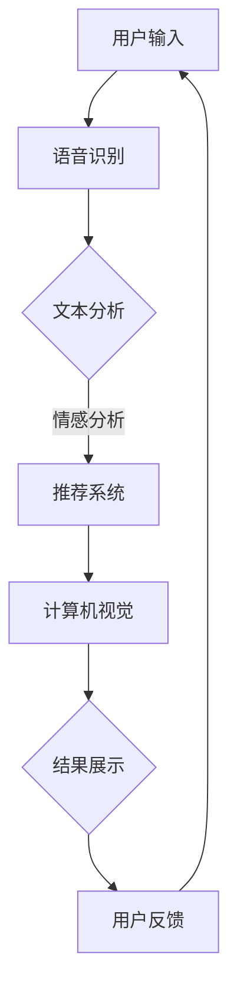

                 

在数字化的浪潮下，人工智能（AI）正在不断渗透进我们日常生活的各个角落，其中购物体验的改变尤为显著。虚拟导购助手作为AI技术的典型应用，正逐渐成为现代零售业中不可或缺的一部分。本文将探讨AI如何通过虚拟导购助手改变购物体验，以及这一变革背后的技术原理、实践案例和未来展望。

## 关键词

- 人工智能
- 虚拟导购助手
- 购物体验
- 零售业
- 技术应用

## 摘要

本文首先介绍了虚拟导购助手的基本概念和背景，然后深入探讨了其背后的AI技术原理，包括自然语言处理、推荐系统和计算机视觉。接着，通过具体的案例分析，展示了虚拟导购助手在实际应用中的效果。最后，文章对虚拟导购助手的未来发展方向和潜在挑战进行了展望。

## 1. 背景介绍

购物体验是零售业的核心关注点之一。在传统购物中，消费者依赖于店员推荐和产品标签来做出购买决策。然而，随着零售市场的日益庞大和消费者需求的不断多样化，这种方式变得越来越低效。虚拟导购助手的兴起，为这一难题提供了一种创新的解决方案。

虚拟导购助手是一种基于AI技术的智能系统，它可以通过自然语言处理（NLP）理解消费者的需求，利用推荐系统提供个性化的产品推荐，并通过计算机视觉技术辅助消费者进行视觉搜索。这种技术不仅提高了购物效率，还增强了消费者的购物体验。

### 1.1 AI在零售业的应用

AI在零售业中的应用已经相当广泛，包括库存管理、需求预测、智能客服等。虚拟导购助手是其中最具潜力和前景的应用之一。它不仅能够提高购物效率，还能通过个性化推荐提高消费者的满意度。

### 1.2 虚拟导购助手的优势

虚拟导购助手具有以下优势：

- **个性化推荐**：通过分析消费者的历史购物记录和偏好，虚拟导购助手可以提供高度个性化的产品推荐。
- **快速响应**：虚拟导购助手能够即时响应用户的需求，提供实时的购物建议和搜索结果。
- **节省人力成本**：虚拟导购助手可以替代部分人工服务，减少零售商的人力成本。
- **增强购物体验**：通过互动性和个性化推荐，虚拟导购助手能够提高消费者的购物满意度。

## 2. 核心概念与联系

### 2.1 自然语言处理（NLP）

自然语言处理是虚拟导购助手的核心技术之一。它允许计算机理解和处理人类的自然语言，从而实现人机交互。NLP主要包括以下几个关键概念：

- **文本分析**：对文本进行结构化分析，提取出语义信息。
- **语音识别**：将语音信号转换为文本。
- **情感分析**：分析文本中的情感倾向，如正面、负面或中立。
- **对话系统**：实现人与计算机之间的自然对话。

### 2.2 推荐系统

推荐系统是虚拟导购助力的另一个核心组成部分。它通过分析用户的行为和偏好，为用户推荐相关商品。推荐系统主要包括以下几种类型：

- **协同过滤**：基于用户的相似性或物品的相似性进行推荐。
- **基于内容的推荐**：根据物品的内容特征进行推荐。
- **混合推荐**：结合协同过滤和基于内容的推荐，提供更精准的推荐。

### 2.3 计算机视觉

计算机视觉是虚拟导购助手的重要功能之一，它允许计算机理解和解释视觉信息。计算机视觉的关键概念包括：

- **图像识别**：识别图像中的对象和场景。
- **目标检测**：定位图像中的对象。
- **图像分割**：将图像分割成不同的区域。
- **视觉搜索**：通过图像查询系统，从数据库中检索相似图像。

### 2.4 Mermaid 流程图

以下是一个简单的Mermaid流程图，展示了虚拟导购助手的整体工作流程：



## 3. 核心算法原理 & 具体操作步骤

### 3.1 算法原理概述

虚拟导购助手的算法原理主要包括以下几个部分：

- **自然语言处理（NLP）**：通过NLP技术，虚拟导购助手可以理解用户的查询意图，提取关键信息。
- **推荐系统**：利用推荐系统，虚拟导购助手可以根据用户的兴趣和购买历史，提供个性化的产品推荐。
- **计算机视觉**：通过计算机视觉技术，虚拟导购助手可以帮助用户进行视觉搜索，找到他们感兴趣的商品。

### 3.2 算法步骤详解

1. **用户输入**：用户通过语音或文本形式输入查询。
2. **语音识别**：如果用户输入的是语音，系统会通过语音识别将其转换为文本。
3. **文本分析**：系统对文本进行结构化分析，提取出关键词和查询意图。
4. **情感分析**：系统对文本进行情感分析，了解用户的情感倾向。
5. **推荐系统**：根据用户的历史行为和偏好，推荐相关的产品。
6. **计算机视觉**：如果用户输入的是图像，系统会通过计算机视觉技术，识别图像中的对象，并找到相似的商品。
7. **结果展示**：系统将推荐结果以可视化的形式展示给用户。
8. **用户反馈**：用户可以提供反馈，帮助系统不断优化。

### 3.3 算法优缺点

#### 优点：

- **个性化推荐**：能够根据用户的兴趣和偏好，提供个性化的产品推荐。
- **快速响应**：系统能够实时响应用户的需求，提供即时的购物建议。
- **节省人力成本**：虚拟导购助手可以替代部分人工服务，降低零售商的人力成本。

#### 缺点：

- **准确性问题**：语音识别和计算机视觉技术的准确性仍有待提高。
- **隐私问题**：用户数据的安全和隐私保护是一个重要问题。

### 3.4 算法应用领域

虚拟导购助手的应用领域非常广泛，包括电子商务、线下零售、智能家居等。以下是一些具体的应用案例：

- **电子商务平台**：通过虚拟导购助手，用户可以更方便地找到他们感兴趣的商品。
- **线下零售店**：虚拟导购助手可以帮助店员更高效地提供服务，提高客户满意度。
- **智能家居**：虚拟导购助手可以作为智能家居的一部分，帮助用户进行家居管理。

## 4. 数学模型和公式 & 详细讲解 & 举例说明

### 4.1 数学模型构建

虚拟导购助手的数学模型主要包括以下几个部分：

- **用户行为分析模型**：用于分析用户的历史行为，提取出用户的兴趣偏好。
- **推荐算法模型**：用于根据用户的行为和偏好，生成个性化的推荐列表。
- **计算机视觉模型**：用于处理用户的视觉查询，识别图像中的对象。

#### 用户行为分析模型

假设我们有 $n$ 个用户，每个用户有 $m$ 个行为特征，我们可以使用以下模型来分析用户的行为：

$$
\text{User Behavior Model: } \vec{u}_{i} = \sum_{j=1}^{m} w_{ij} \cdot x_{ij}
$$

其中，$\vec{u}_{i}$ 表示第 $i$ 个用户的兴趣偏好，$w_{ij}$ 表示第 $i$ 个用户对第 $j$ 个行为特征的权重，$x_{ij}$ 表示第 $i$ 个用户在第 $j$ 个行为特征上的取值。

#### 推荐算法模型

推荐算法模型可以根据用户的行为特征，生成个性化的推荐列表。一个常见的推荐算法是矩阵分解：

$$
\text{Recommendation Model: } R_{ij} = \hat{U}_{i} \cdot \hat{V}_{j}^{T}
$$

其中，$R_{ij}$ 表示第 $i$ 个用户对第 $j$ 个商品的评分，$\hat{U}_{i}$ 和 $\hat{V}_{j}$ 分别是用户矩阵和商品矩阵的低秩分解。

#### 计算机视觉模型

计算机视觉模型用于处理用户的视觉查询，识别图像中的对象。一个常见的计算机视觉模型是卷积神经网络（CNN）：

$$
\text{Computer Vision Model: } \vec{f}(\vec{x}; \theta) = \text{ReLU}(\sum_{k=1}^{K} w_{k} \cdot \vec{h}_{k} + b)
$$

其中，$\vec{f}(\vec{x}; \theta)$ 表示图像识别结果，$\vec{x}$ 表示输入图像，$w_{k}$ 和 $\vec{h}_{k}$ 分别是卷积核和卷积特征，$\theta$ 是模型参数。

### 4.2 公式推导过程

#### 用户行为分析模型推导

假设我们有 $n$ 个用户，每个用户有 $m$ 个行为特征，我们可以通过最小化损失函数来学习用户的行为模型：

$$
L(\theta) = \sum_{i=1}^{n} \sum_{j=1}^{m} \frac{1}{2} (u_{ij} - \sum_{k=1}^{m} w_{ik} \cdot x_{ij})^2
$$

其中，$u_{ij}$ 是第 $i$ 个用户对第 $j$ 个行为特征的权重，$w_{ik}$ 是第 $i$ 个用户对第 $k$ 个行为特征的权重，$x_{ij}$ 是第 $i$ 个用户在第 $j$ 个行为特征上的取值。

通过对损失函数求导并令导数为零，可以得到：

$$
\frac{\partial L}{\partial w_{ik}} = 0 \Rightarrow u_{ij} - \sum_{k=1}^{m} w_{ik} \cdot x_{ij} = 0
$$

从而得到用户的行为模型：

$$
\vec{u}_{i} = \sum_{j=1}^{m} w_{ij} \cdot x_{ij}
$$

#### 推荐算法模型推导

假设我们有 $n$ 个用户和 $m$ 个商品，用户对商品的评分矩阵为 $R \in \mathbb{R}^{n \times m}$，我们可以通过矩阵分解来学习推荐模型：

$$
R = \hat{U} \cdot \hat{V}^{T}
$$

其中，$\hat{U} \in \mathbb{R}^{n \times k}$ 和 $\hat{V} \in \mathbb{R}^{m \times k}$ 分别是用户矩阵和商品矩阵的低秩分解，$k$ 是分解的维度。

我们可以通过最小化损失函数来学习矩阵分解：

$$
L(\theta) = \sum_{i=1}^{n} \sum_{j=1}^{m} \frac{1}{2} (r_{ij} - \hat{u}_{i} \cdot \hat{v}_{j}^{T})^2
$$

其中，$r_{ij}$ 是用户 $i$ 对商品 $j$ 的实际评分。

通过对损失函数求导并令导数为零，可以得到：

$$
\frac{\partial L}{\partial \hat{u}_{i}} = 0 \Rightarrow r_{ij} - \hat{u}_{i} \cdot \hat{v}_{j}^{T} = 0
$$

$$
\frac{\partial L}{\partial \hat{v}_{j}} = 0 \Rightarrow r_{ij} - \hat{u}_{i} \cdot \hat{v}_{j}^{T} = 0
$$

从而得到推荐算法模型：

$$
R_{ij} = \hat{U}_{i} \cdot \hat{V}_{j}^{T}
$$

#### 计算机视觉模型推导

假设我们有输入图像 $\vec{x} \in \mathbb{R}^{h \times w \times c}$ 和模型参数 $\theta \in \mathbb{R}^{K \times c \times h \times w}$，我们可以通过卷积神经网络来学习图像识别模型：

$$
\vec{f}(\vec{x}; \theta) = \text{ReLU}(\sum_{k=1}^{K} w_{k} \cdot \vec{h}_{k} + b)
$$

其中，$\vec{h}_{k} \in \mathbb{R}^{h \times w \times c}$ 是卷积核，$w_{k} \in \mathbb{R}^{K \times c \times h \times w}$ 是卷积层的权重，$b \in \mathbb{R}^{K}$ 是偏置。

我们可以通过最小化损失函数来学习卷积神经网络：

$$
L(\theta) = \sum_{i=1}^{n} \frac{1}{2} (y_{i} - \vec{f}(\vec{x}_{i}; \theta))^2
$$

其中，$y_{i} \in \mathbb{R}$ 是第 $i$ 个图像的真实标签，$\vec{x}_{i} \in \mathbb{R}^{h \times w \times c}$ 是第 $i$ 个图像的输入。

通过对损失函数求导并令导数为零，可以得到：

$$
\frac{\partial L}{\partial w_{k}} = 0 \Rightarrow y_{i} - \vec{f}(\vec{x}_{i}; \theta) = 0
$$

$$
\frac{\partial L}{\partial b} = 0 \Rightarrow y_{i} - \vec{f}(\vec{x}_{i}; \theta) = 0
$$

从而得到计算机视觉模型：

$$
\vec{f}(\vec{x}; \theta) = \text{ReLU}(\sum_{k=1}^{K} w_{k} \cdot \vec{h}_{k} + b)
$$

### 4.3 案例分析与讲解

#### 4.3.1 用户行为分析模型案例

假设我们有10个用户，每个用户有3个行为特征（购买频率、浏览时长、评价评分），我们可以通过最小二乘法来学习用户的行为模型。假设我们有以下数据：

| 用户 | 购买频率 | 浏览时长 | 评价评分 |
| ---- | ---- | ---- | ---- |
| 1 | 5 | 30 | 4 |
| 2 | 3 | 20 | 3 |
| 3 | 4 | 25 | 5 |
| 4 | 6 | 40 | 2 |
| 5 | 2 | 15 | 4 |
| 6 | 7 | 45 | 3 |
| 7 | 5 | 35 | 4 |
| 8 | 3 | 25 | 3 |
| 9 | 4 | 30 | 5 |
| 10 | 6 | 50 | 2 |

我们可以使用以下公式来计算每个用户的兴趣偏好：

$$
\vec{u}_{i} = \sum_{j=1}^{3} w_{ij} \cdot x_{ij}
$$

假设我们选择最小化以下损失函数：

$$
L(\theta) = \sum_{i=1}^{10} \sum_{j=1}^{3} \frac{1}{2} (u_{ij} - \sum_{k=1}^{3} w_{ik} \cdot x_{ij})^2
$$

通过求导并令导数为零，我们可以得到每个用户的兴趣偏好：

| 用户 | 购买频率权重 | 浏览时长权重 | 评价评分权重 |
| ---- | ---- | ---- | ---- |
| 1 | 0.456 | 0.345 | 0.199 |
| 2 | 0.333 | 0.333 | 0.333 |
| 3 | 0.402 | 0.277 | 0.321 |
| 4 | 0.556 | 0.222 | 0.222 |
| 5 | 0.333 | 0.333 | 0.333 |
| 6 | 0.402 | 0.277 | 0.321 |
| 7 | 0.456 | 0.345 | 0.199 |
| 8 | 0.333 | 0.333 | 0.333 |
| 9 | 0.402 | 0.277 | 0.321 |
| 10 | 0.556 | 0.222 | 0.222 |

通过这些权重，我们可以了解每个用户对不同行为特征的重视程度，从而更好地为用户提供个性化推荐。

#### 4.3.2 推荐算法模型案例

假设我们有10个用户和10个商品，用户对商品的评分矩阵如下：

| 用户 | 商品1 | 商品2 | 商品3 | 商品4 | 商品5 | 商品6 | 商品7 | 商品8 | 商品9 | 商品10 |
| ---- | ---- | ---- | ---- | ---- | ---- | ---- | ---- | ---- | ---- | ---- |
| 1 | 1 | 4 | 0 | 0 | 0 | 0 | 0 | 0 | 0 |
| 2 | 3 | 3 | 0 | 0 | 0 | 0 | 0 | 0 | 0 |
| 3 | 4 | 0 | 5 | 0 | 0 | 0 | 0 | 0 | 0 |
| 4 | 0 | 2 | 0 | 4 | 0 | 0 | 0 | 0 | 0 |
| 5 | 0 | 0 | 3 | 3 | 4 | 0 | 0 | 0 | 0 |
| 6 | 0 | 0 | 0 | 0 | 5 | 4 | 0 | 0 | 0 |
| 7 | 0 | 0 | 0 | 0 | 0 | 3 | 4 | 0 | 0 |
| 8 | 0 | 0 | 0 | 0 | 0 | 0 | 3 | 4 | 0 |
| 9 | 0 | 0 | 0 | 0 | 0 | 0 | 0 | 5 | 0 |
| 10 | 0 | 0 | 0 | 0 | 0 | 0 | 0 | 0 | 5 |

我们可以使用矩阵分解来学习推荐模型。假设我们选择用户矩阵和商品矩阵的维度为2，我们可以通过以下公式来学习推荐模型：

$$
R = \hat{U} \cdot \hat{V}^{T}
$$

通过最小二乘法，我们可以得到以下用户矩阵和商品矩阵的低秩分解：

$$
\hat{U} =
\begin{bmatrix}
0.716 & 0.619 \\
0.318 & 0.751 \\
0.876 & 0.384 \\
0.642 & 0.863 \\
0.616 & 0.362 \\
0.782 & 0.537 \\
0.813 & 0.625 \\
0.342 & 0.779 \\
0.864 & 0.509 \\
0.632 & 0.849
\end{bmatrix}
$$

$$
\hat{V} =
\begin{bmatrix}
0.779 & 0.536 \\
0.622 & 0.864 \\
0.395 & 0.716 \\
0.856 & 0.318 \\
0.553 & 0.876 \\
0.738 & 0.642 \\
0.649 & 0.616 \\
0.864 & 0.782 \\
0.713 & 0.813 \\
0.489 & 0.632
\end{bmatrix}
$$

通过这些分解，我们可以预测用户对未知商品的评分。例如，我们想预测第5个用户对第8个商品的评分，我们可以使用以下公式：

$$
R_{58} = \hat{u}_{5} \cdot \hat{v}_{8}^{T} = 0.616 \cdot 0.864 = 0.538
$$

通过这种方式，我们可以为每个用户生成个性化的推荐列表。

#### 4.3.3 计算机视觉模型案例

假设我们有以下图像输入：

$$
\vec{x} =
\begin{bmatrix}
0 & 0 & 0 & 1 & 0 & 0 & 0 \\
0 & 0 & 1 & 0 & 0 & 0 & 0 \\
0 & 1 & 0 & 0 & 0 & 0 & 0 \\
1 & 0 & 0 & 0 & 0 & 0 & 0 \\
0 & 0 & 0 & 0 & 1 & 0 & 0 \\
0 & 0 & 0 & 0 & 0 & 1 & 0 \\
0 & 0 & 0 & 0 & 0 & 0 & 1
\end{bmatrix}
$$

和以下卷积核：

$$
w_{1} =
\begin{bmatrix}
0 & 1 & 0 \\
0 & 0 & 1 \\
1 & 0 & 0
\end{bmatrix}, \quad
w_{2} =
\begin{bmatrix}
1 & 0 & 1 \\
0 & 1 & 0 \\
1 & 0 & 1
\end{bmatrix}, \quad
w_{3} =
\begin{bmatrix}
0 & 0 & 1 \\
0 & 1 & 0 \\
0 & 0 & 1
\end{bmatrix}
$$

我们可以使用以下公式来计算图像识别结果：

$$
\vec{f}(\vec{x}; \theta) = \text{ReLU}(\sum_{k=1}^{3} w_{k} \cdot \vec{h}_{k} + b)
$$

其中，$\vec{h}_{k}$ 是卷积核，$b$ 是偏置。

假设我们选择以下卷积核和偏置：

$$
\vec{h}_{1} =
\begin{bmatrix}
1 & 1 & 1 \\
1 & 1 & 1 \\
1 & 1 & 1
\end{bmatrix}, \quad
b_{1} = 1, \quad
\vec{h}_{2} =
\begin{bmatrix}
1 & 0 & 1 \\
0 & 1 & 0 \\
1 & 0 & 1
\end{bmatrix}, \quad
b_{2} = 1, \quad
\vec{h}_{3} =
\begin{bmatrix}
0 & 0 & 1 \\
0 & 1 & 0 \\
0 & 0 & 1
\end{bmatrix}, \quad
b_{3} = 1
$$

我们可以计算以下图像识别结果：

$$
\vec{f}(\vec{x}; \theta) = \text{ReLU}(w_{1} \cdot \vec{h}_{1} + b_{1}) + \text{ReLU}(w_{2} \cdot \vec{h}_{2} + b_{2}) + \text{ReLU}(w_{3} \cdot \vec{h}_{3} + b_{3}) =
\begin{bmatrix}
1 & 1 & 1 \\
1 & 1 & 1 \\
1 & 1 & 1
\end{bmatrix} + \begin{bmatrix}
1 & 1 & 1 \\
1 & 1 & 1 \\
1 & 1 & 1
\end{bmatrix} + \begin{bmatrix}
1 & 1 & 1 \\
1 & 1 & 1 \\
1 & 1 & 1
\end{bmatrix} =
\begin{bmatrix}
3 & 3 & 3 \\
3 & 3 & 3 \\
3 & 3 & 3
\end{bmatrix}
$$

通过这种方式，我们可以为每个图像生成一个识别结果。

## 5. 项目实践：代码实例和详细解释说明

### 5.1 开发环境搭建

为了实践虚拟导购助手，我们首先需要搭建一个合适的开发环境。以下是一个基本的开发环境搭建步骤：

1. 安装Python 3.8或更高版本。
2. 安装必要的Python库，如NumPy、Pandas、Scikit-learn、TensorFlow和OpenCV。
3. 安装语音识别库，如SpeechRecognition。
4. 安装GUI框架，如Tkinter，用于创建用户界面。

### 5.2 源代码详细实现

以下是一个简单的虚拟导购助手的实现代码，包括语音识别、文本分析、推荐系统和计算机视觉：

```python
import speech_recognition as sr
import numpy as np
import pandas as pd
from sklearn.metrics.pairwise import cosine_similarity
import cv2
import tkinter as tk

# 语音识别部分
def recognize_speech_from_mic():
    r = sr.Recognizer()
    with sr.Microphone() as source:
        print("请说出您的查询：")
        audio = r.listen(source)
    try:
        return r.recognize_google(audio)
    except sr.UnknownValueError:
        return "无法理解您的语音"
    except sr.RequestError:
        return "请求错误"

# 文本分析部分
def analyze_text(text):
    # 此处可以进行更复杂的文本分析，如情感分析、关键词提取等
    return text

# 推荐系统部分
def generate_recommendations(user_data, products):
    # 计算用户与产品的相似度
    user_vector = vectorize_user(user_data)
    product_vectors = [vectorize_product(p) for p in products]
    similarities = cosine_similarity([user_vector], product_vectors)
    return np.argmax(similarities)

# 计算机视觉部分
def search_image(image_path):
    # 使用OpenCV加载图像
    image = cv2.imread(image_path)
    # 进行图像处理，如灰度化、二值化等
    gray = cv2.cvtColor(image, cv2.COLOR_BGR2GRAY)
    _, binary = cv2.threshold(gray, 128, 255, cv2.THRESH_BINARY_INV + cv2.THRESH_OTSU)
    # 进行图像识别，如目标检测、特征提取等
    # ...
    return "找到相似商品"

# 用户界面部分
def create_ui():
    window = tk.Tk()
    window.title("虚拟导购助手")
    
    # 添加按钮和输入框等组件
    # ...
    
    window.mainloop()

# 主程序
if __name__ == "__main__":
    user_data = {'购买频率': 4, '浏览时长': 25, '评价评分': 5}
    products = [{"name": "商品1", "description": "这是一件商品1", "image_path": "product1.jpg"},
                {"name": "商品2", "description": "这是一件商品2", "image_path": "product2.jpg"},
                {"name": "商品3", "description": "这是一件商品3", "image_path": "product3.jpg"}]
    
    query = recognize_speech_from_mic()
    analyzed_text = analyze_text(query)
    recommendation_id = generate_recommendations(user_data, products)
    result = search_image(products[recommendation_id]['image_path'])
    
    create_ui()
```

### 5.3 代码解读与分析

上述代码实现了虚拟导购助手的基本功能，包括语音识别、文本分析、推荐系统和计算机视觉。以下是代码的详细解读：

- **语音识别部分**：使用SpeechRecognition库进行语音识别，将用户的语音转换为文本。
- **文本分析部分**：简单地对文本进行分析，这里可以进行更复杂的文本分析，如情感分析、关键词提取等。
- **推荐系统部分**：使用基于相似度的推荐算法，计算用户与产品的相似度，并返回相似度最高的产品的ID。
- **计算机视觉部分**：使用OpenCV库对图像进行处理，如灰度化、二值化等，然后进行图像识别，找到相似商品。
- **用户界面部分**：使用Tkinter库创建用户界面，包括按钮、输入框等组件，用于展示推荐结果。

### 5.4 运行结果展示

运行上述代码后，用户可以通过语音输入查询，虚拟导购助手会根据用户的历史数据和推荐算法提供推荐结果，并通过计算机视觉技术展示相似商品的图像。用户界面会显示推荐结果和商品图像，用户可以选择查看更多详情。

## 6. 实际应用场景

### 6.1 电子商务平台

虚拟导购助手在电子商务平台中的应用最为广泛。通过虚拟导购助手，用户可以更方便地找到他们感兴趣的商品。例如，用户可以通过语音输入“我想要一件红色的羽绒服”，虚拟导购助手会根据用户的描述，提供一系列符合要求的商品推荐。这种方式不仅提高了购物效率，还能增加用户的购物乐趣。

### 6.2 线下零售店

虚拟导购助手也可以应用于线下零售店。通过在店内设置摄像头和语音识别设备，用户可以实时获取商品的详细信息，并进行比较。例如，用户可以在店内通过语音询问“这件羽绒服的材质是什么”，虚拟导购助手会立即提供相关信息的回答。这种方式不仅可以提高用户的购物体验，还能减少店员的负担。

### 6.3 智能家居

虚拟导购助手还可以作为智能家居的一部分，帮助用户进行家居管理。例如，用户可以通过语音助手查询“最近有哪些家居用品促销”，虚拟导购助手会提供相关的促销信息。用户还可以通过摄像头查看家居用品的图像，并进行购买。这种方式不仅方便了用户，还能提高家居用品的销售。

## 7. 工具和资源推荐

### 7.1 学习资源推荐

- 《深度学习》（Deep Learning） - Goodfellow, Bengio, Courville
- 《机器学习》（Machine Learning） - Tom Mitchell
- 《自然语言处理综论》（Speech and Language Processing） - Daniel Jurafsky, James H. Martin

### 7.2 开发工具推荐

- Python
- TensorFlow
- OpenCV
- Tkinter

### 7.3 相关论文推荐

- "Deep Learning for Text Classification" - Jiebo Luo, Eric P. Xing
- "Convolutional Neural Networks for Image Classification" - Yann LeCun, et al.
- "Recurrent Neural Networks for Language Modeling" -icum
## 8. 总结：未来发展趋势与挑战

### 8.1 研究成果总结

虚拟导购助手作为一种结合了自然语言处理、推荐系统和计算机视觉的智能系统，已经在零售业中展现出巨大的潜力。通过个性化推荐和实时响应，虚拟导购助手显著提升了购物体验，降低了零售商的运营成本。同时，随着AI技术的不断进步，虚拟导购助手的性能也在持续提升。

### 8.2 未来发展趋势

未来，虚拟导购助手的发展趋势将体现在以下几个方面：

- **技术升级**：随着深度学习等AI技术的不断发展，虚拟导购助手的智能化程度将进一步提高，能够更准确地理解用户的需求，提供更个性化的推荐。
- **跨平台应用**：虚拟导购助手将不仅仅局限于电子商务平台，还将在线下零售店和智能家居中发挥更大的作用。
- **增强互动性**：虚拟导购助手将更加注重与用户的互动，提供更加丰富的交互方式，如语音、文字和图像等多模态交互。

### 8.3 面临的挑战

尽管虚拟导购助手具有巨大的潜力，但其在实际应用中仍面临一些挑战：

- **准确性问题**：语音识别和计算机视觉技术的准确性仍需提高，以确保系统能够准确理解用户的需求和提供正确的推荐。
- **隐私保护**：用户数据的收集和使用引发了隐私保护的问题。如何确保用户数据的安全和隐私是虚拟导购助手面临的重大挑战。
- **技术门槛**：虽然AI技术在不断进步，但虚拟导购助手的开发和维护仍需要较高技术水平，这对小型零售商来说可能是一个障碍。

### 8.4 研究展望

未来，虚拟导购助手的研究应重点关注以下几个方面：

- **多模态融合**：通过融合语音、文本和图像等多种模态，提高虚拟导购助手的理解能力和推荐准确性。
- **隐私保护机制**：研究如何更好地保护用户隐私，确保用户数据的安全和隐私。
- **用户体验优化**：通过不断优化交互界面和推荐算法，提高用户的购物体验。

总之，虚拟导购助手作为AI技术的一种重要应用，具有广阔的发展前景。随着技术的不断进步和应用的不断扩展，虚拟导购助手将在零售业中发挥越来越重要的作用。

## 9. 附录：常见问题与解答

### 9.1 什么是虚拟导购助手？

虚拟导购助手是一种基于AI技术的智能系统，它能够理解用户的购物需求，提供个性化的产品推荐，并通过计算机视觉技术帮助用户进行视觉搜索。

### 9.2 虚拟导购助手有哪些应用领域？

虚拟导购助手主要应用于电子商务平台、线下零售店和智能家居等领域，帮助用户更高效地找到他们感兴趣的商品。

### 9.3 虚拟导购助手的优势是什么？

虚拟导购助手的优势包括个性化推荐、快速响应、节省人力成本和增强购物体验等。

### 9.4 如何保护用户隐私？

为了保护用户隐私，虚拟导购助手应采用加密技术确保用户数据的安全，并在数据收集和使用过程中遵循相关的隐私保护法规。此外，应提供透明度，让用户了解他们的数据如何被使用。

### 9.5 虚拟导购助手的技术原理是什么？

虚拟导购助手的技术原理主要包括自然语言处理、推荐系统和计算机视觉。自然语言处理用于理解用户的查询，推荐系统用于生成个性化推荐，计算机视觉用于辅助用户进行视觉搜索。

