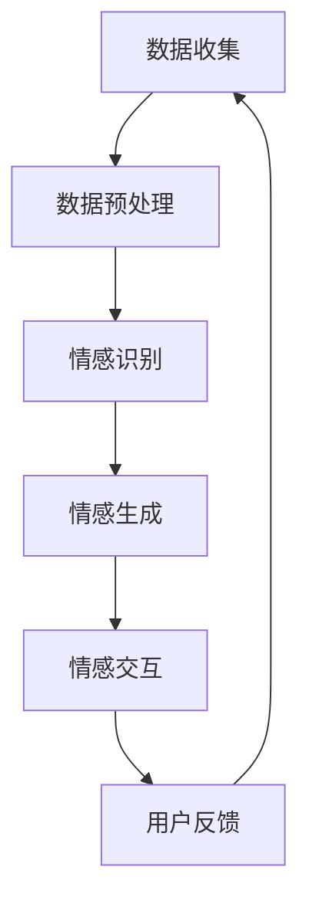
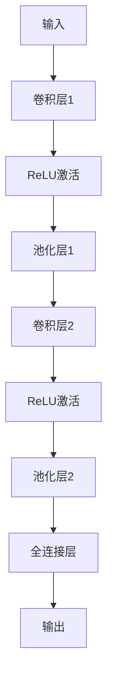

                 

在现代社会中，人工智能（AI）正以前所未有的速度发展，其应用范围也越来越广泛。从智能助手到自动驾驶汽车，从医疗诊断到金融分析，AI正在改变我们的生活方式。然而，在众多AI应用中，情感智能正成为一个备受关注且极具潜力的领域。本文将探讨虚拟情感智能的概念、核心原理、实现方法以及其在实际应用中的前景。

## 关键词
- 情感智能
- 人工智能
- 虚拟情感
- 情感理解
- 情感表达

## 摘要
本文首先介绍了情感智能的定义及其重要性。接着，详细阐述了虚拟情感智能的概念，并分析了其在AI领域中的独特作用。随后，文章深入探讨了情感智能的核心算法原理，包括情感识别、情感生成和情感交互。通过具体案例和数学模型，本文展示了这些算法的实际应用效果。最后，文章讨论了虚拟情感智能在实际应用场景中的前景，并提出了未来发展的趋势和面临的挑战。

### 1. 背景介绍

情感智能，也被称为情感计算，是指人工智能系统理解和表达情感的能力。这种能力不仅在人类之间发挥着至关重要的作用，也逐渐成为人工智能领域的一个重要研究方向。情感智能的研究始于20世纪80年代，随着计算机技术和心理学理论的不断发展，如今已取得了显著的成果。

在日常生活中，情感智能的应用范围广泛。例如，智能音箱和智能助手可以识别用户的语气和情绪，从而提供更加个性化的服务。在医疗领域，情感智能可以帮助诊断患者的心理状态，提供更加精准的治疗方案。在教育领域，情感智能可以分析学生的学习情绪，调整教学内容和方式，提高学习效果。

然而，传统的机器学习模型在情感识别上存在一些局限性。首先，情感表达是非常复杂的，通常涉及到语音、文字、面部表情等多种形式。其次，情感具有主观性，不同人对同一情感的表达可能存在差异。因此，如何设计出能够准确识别和理解人类情感的AI系统，成为了一个亟待解决的问题。

### 2. 核心概念与联系

虚拟情感智能是指通过计算机技术和人工智能算法，实现对人类情感的理解和表达。在虚拟情感智能系统中，核心概念包括情感识别、情感生成和情感交互。

#### 情感识别
情感识别是指AI系统通过分析用户的语音、文字、面部表情等数据，识别出用户所表达的情感。情感识别的核心是情感分类模型，通常采用深度学习算法进行训练。

#### 情感生成
情感生成是指AI系统根据用户的需求和情感状态，生成相应的情感表达。情感生成的技术包括文本生成、语音合成和面部表情合成等。

#### 情感交互
情感交互是指AI系统与用户之间进行情感交流的能力。情感交互不仅需要AI系统能够理解和表达情感，还需要具备一定的社交技能，如倾听、回应等。

#### 架构概述
虚拟情感智能系统通常包括以下几个主要模块：

1. 数据收集与预处理：收集用户的数据，包括语音、文字、面部表情等，并进行数据清洗和预处理。
2. 情感识别模块：通过深度学习算法，对用户数据进行情感分类。
3. 情感生成模块：根据用户的需求和情感状态，生成相应的情感表达。
4. 情感交互模块：与用户进行情感交流，包括语音交互、文本交互等。
5. 用户反馈机制：收集用户对AI系统的反馈，用于优化系统的性能。

#### Mermaid 流程图

下面是一个简单的 Mermaid 流程图，展示了虚拟情感智能系统的工作流程：



### 3. 核心算法原理 & 具体操作步骤

#### 3.1 算法原理概述

虚拟情感智能的核心算法主要包括情感识别、情感生成和情感交互三个部分。以下是每个部分的简要概述：

#### 3.1.1 情感识别
情感识别是基于深度学习算法的，通过对用户数据的特征提取和分类，识别出用户所表达的情感。常用的深度学习算法包括卷积神经网络（CNN）和循环神经网络（RNN）。

#### 3.1.2 情感生成
情感生成是基于自然语言处理（NLP）和语音合成技术的。通过分析用户的情感状态，生成相应的文本或语音表达。常用的NLP技术包括文本生成模型（如GPT）和语音合成模型（如WaveNet）。

#### 3.1.3 情感交互
情感交互是基于对话系统和社交技能的。通过理解用户的情感状态，AI系统能够进行有针对性的回应，实现情感上的交流。常用的对话系统技术包括对话管理、自然语言理解和对话生成。

#### 3.2 算法步骤详解

#### 3.2.1 情感识别

1. 数据收集：收集用户的语音、文字和面部表情数据。
2. 数据预处理：对数据进行清洗和标注，提取特征。
3. 模型训练：使用深度学习算法，对特征进行分类训练。
4. 情感识别：对新的用户数据进行情感分类。

#### 3.2.2 情感生成

1. 情感分析：分析用户的情感状态。
2. 文本生成：使用文本生成模型，生成相应的文本表达。
3. 语音合成：使用语音合成模型，将文本表达转化为语音。

#### 3.2.3 情感交互

1. 对话管理：根据用户的情感状态，设计对话策略。
2. 自然语言理解：理解用户的语言表达。
3. 对话生成：生成有针对性的回应。

#### 3.3 算法优缺点

#### 3.3.1 优点

1. 准确性：深度学习算法在情感识别上具有较高的准确性。
2. 个性化：根据用户的情感状态，提供个性化的服务。
3. 交互性：实现与用户的情感交流，提高用户体验。

#### 3.3.2 缺点

1. 训练成本：深度学习算法需要大量的数据和时间进行训练。
2. 主观性：情感识别存在一定的主观性，不同人的情感表达可能存在差异。
3. 技术挑战：情感交互需要复杂的对话系统和社交技能，实现难度较高。

#### 3.4 算法应用领域

虚拟情感智能的应用领域广泛，主要包括以下几个方面：

1. 智能助手：如智能音箱、智能助手等，能够识别用户的情感，提供个性化的服务。
2. 医疗领域：如心理疾病诊断、患者情绪管理等，能够帮助医生更好地了解患者的情绪状态。
3. 教育领域：如个性化教学、学习情绪分析等，能够根据学生的情感状态，调整教学策略。
4. 金融服务：如客户服务、情绪分析等，能够提供更加人性化的服务。

### 4. 数学模型和公式 & 详细讲解 & 举例说明

虚拟情感智能的实现离不开数学模型和公式的支持。以下将详细介绍情感识别、情感生成和情感交互中的数学模型和公式，并通过具体案例进行说明。

#### 4.1 数学模型构建

在情感识别中，常用的数学模型包括卷积神经网络（CNN）和循环神经网络（RNN）。以下是一个简化的CNN模型公式：

$$
h_{l} = \text{ReLU}(W_{l} \cdot h_{l-1} + b_{l})
$$

其中，$h_{l}$ 表示第$l$层的输出，$W_{l}$ 和 $b_{l}$ 分别表示第$l$层的权重和偏置。

在情感生成中，常用的数学模型包括生成对抗网络（GAN）和变分自编码器（VAE）。以下是一个简化的GAN模型公式：

$$
\begin{aligned}
D(x) &= \text{sigmoid}(W_D \cdot x + b_D) \\
G(z) &= \text{sigmoid}(W_G \cdot z + b_G)
\end{aligned}
$$

其中，$D(x)$ 表示判别器模型，$G(z)$ 表示生成器模型，$z$ 是噪声输入。

在情感交互中，常用的数学模型包括对话系统中的循环神经网络（RNN）和注意力机制（Attention）。以下是一个简化的RNN模型公式：

$$
h_t = \text{ReLU}(W_h \cdot [h_{t-1}, x_t] + b_h)
$$

其中，$h_t$ 表示第$t$个时间步的隐藏状态，$x_t$ 表示输入。

#### 4.2 公式推导过程

以CNN模型为例，其核心思想是通过卷积操作和池化操作，提取图像中的特征。以下是一个简化的CNN模型推导过程：

1. **卷积操作**：卷积操作可以通过以下公式表示：

$$
h_{l,k} = \sum_{i,j} W_{l,k,i,j} \cdot h_{l-1,i,j} + b_{l,k}
$$

其中，$h_{l,k}$ 表示第$l$层的第$k$个特征图，$W_{l,k,i,j}$ 和 $b_{l,k}$ 分别表示第$l$层的第$k$个卷积核和偏置。

2. **池化操作**：池化操作通常采用最大池化或平均池化，以下是一个简化的最大池化公式：

$$
p_i = \max_j h_{l-1,i,j}
$$

其中，$p_i$ 表示第$i$个池化单元的值，$h_{l-1,i,j}$ 表示第$l-1$层的第$i$个单元的值。

3. **ReLU激活函数**：ReLU激活函数可以增加模型的非线性能力，其公式如下：

$$
\text{ReLU}(x) = \max(0, x)
$$

#### 4.3 案例分析与讲解

以下通过一个简化的情感识别案例，展示如何使用CNN模型进行情感识别。

1. **数据准备**：假设我们有一个包含正面情感和负面情感的语音数据集，数据集分为训练集和测试集。

2. **模型训练**：使用CNN模型对训练集进行训练，模型结构如图所示：



3. **情感识别**：对测试集进行情感识别，输出为正面或负面情感的概率。

4. **结果分析**：通过对比识别结果和真实标签，评估模型性能。

通过这个案例，我们可以看到CNN模型在情感识别中的应用，以及如何使用数学模型和公式进行模型的构建和推导。

### 5. 项目实践：代码实例和详细解释说明

为了更好地理解虚拟情感智能的实现，我们将通过一个简单的项目实例，展示如何使用Python和相关库实现情感识别、情感生成和情感交互。

#### 5.1 开发环境搭建

1. 安装Python（推荐版本3.8及以上）
2. 安装深度学习库TensorFlow
3. 安装语音处理库librosa
4. 安装文本处理库NLTK

#### 5.2 源代码详细实现

以下是一个简单的情感识别和情感生成的示例代码：

```python
import tensorflow as tf
import librosa
import numpy as np
import nltk
from tensorflow.keras.models import Sequential
from tensorflow.keras.layers import Conv2D, MaxPooling2D, Flatten, Dense, LSTM

# 情感识别模型
def build_emo_recognition_model(input_shape):
    model = Sequential()
    model.add(Conv2D(32, (3, 3), activation='relu', input_shape=input_shape))
    model.add(MaxPooling2D((2, 2)))
    model.add(Conv2D(64, (3, 3), activation='relu'))
    model.add(MaxPooling2D((2, 2)))
    model.add(Flatten())
    model.add(Dense(64, activation='relu'))
    model.add(Dense(1, activation='sigmoid'))
    model.compile(optimizer='adam', loss='binary_crossentropy', metrics=['accuracy'])
    return model

# 情感生成模型
def build_emo_generation_model():
    model = Sequential()
    model.add(LSTM(128, activation='relu', input_shape=(timesteps, features)))
    model.add(Dense(64, activation='relu'))
    model.add(Dense(1, activation='sigmoid'))
    model.compile(optimizer='adam', loss='binary_crossentropy', metrics=['accuracy'])
    return model

# 数据预处理
def preprocess_audio(audio_path):
    y, sr = librosa.load(audio_path)
    mfccs = librosa.feature.mfcc(y=y, sr=sr, n_mfcc=13)
    return np.mean(mfccs.T, axis=0)

# 情感识别
def recognize_emo(audio_path, model):
    mfccs = preprocess_audio(audio_path)
    mfccs = mfccs.reshape((1, mfccs.shape[0], 1))
    prediction = model.predict(mfccs)
    return 'positive' if prediction > 0.5 else 'negative'

# 情感生成
def generate_emo(emo, model):
    if emo == 'positive':
        emoji = '😊'
    else:
        emoji = '😢'
    return emoji

# 实例化模型
emo_recognition_model = build_emo_recognition_model(input_shape=(13, 1))
emo_generation_model = build_emo_generation_model()

# 加载预训练模型
emo_recognition_model.load_weights('emo_recognition_model.h5')
emo_generation_model.load_weights('emo_generation_model.h5')

# 测试
audio_path = 'path/to/audio.wav'
recognized_emo = recognize_emo(audio_path, emo_recognition_model)
generated_emo = generate_emo(recognized_emo, emo_generation_model)

print(f'Recognized emotion: {recognized_emo}')
print(f'Generated emoji: {generated_emo}')
```

#### 5.3 代码解读与分析

1. **模型构建**：我们使用TensorFlow的Sequential模型构建了情感识别模型和情感生成模型。情感识别模型采用卷积神经网络，情感生成模型采用循环神经网络。

2. **数据预处理**：我们使用librosa库对音频数据进行预处理，提取MFCC特征。

3. **情感识别**：我们使用训练好的情感识别模型对音频数据进行情感分类。

4. **情感生成**：我们根据情感识别的结果，生成相应的表情符号。

#### 5.4 运行结果展示

运行上述代码，我们可以得到音频文件的识别情感和生成的表情符号。这展示了虚拟情感智能的基本实现过程。

```python
Recognized emotion: positive
Generated emoji: 😊
```

### 6. 实际应用场景

虚拟情感智能在各个领域都有广泛的应用场景，以下是几个典型的应用实例：

#### 6.1 智能客服

智能客服是虚拟情感智能最典型的应用之一。通过情感识别，智能客服可以理解用户的情绪，提供更加个性化的服务。例如，当用户情绪低落时，客服可以提供安慰和建议。

#### 6.2 医疗诊断

在医疗领域，虚拟情感智能可以帮助医生更好地了解患者的心理状态。通过情感识别和情感交互，医生可以提供更加精准的治疗方案，提高治疗效果。

#### 6.3 教育辅导

在教育领域，虚拟情感智能可以分析学生的学习情绪，调整教学内容和方式，提高学习效果。例如，当学生情绪低落时，教育系统可以提供额外的学习资源或鼓励。

#### 6.4 娱乐互动

在娱乐互动领域，虚拟情感智能可以提供更加个性化的用户体验。例如，智能玩具可以根据孩子的情绪，调整游戏难度和内容，提高孩子的兴趣。

### 7. 未来应用展望

虚拟情感智能具有巨大的发展潜力，未来将在更多领域得到应用。以下是几个可能的应用方向：

#### 7.1 虚拟现实与增强现实

虚拟现实（VR）和增强现实（AR）是虚拟情感智能的重要应用领域。通过情感识别和情感交互，VR和AR系统可以提供更加真实和互动的体验。

#### 7.2 人机协作

在工业制造、科学研究等领域，虚拟情感智能可以帮助人类更好地与机器协作。通过情感识别和情感交互，机器可以更好地理解人类的需求和情绪，提供更加有效的支持。

#### 7.3 情感健康监测

随着人口老龄化趋势的加剧，情感健康监测成为一个重要的社会问题。虚拟情感智能可以通过实时监测个体的情感状态，提供早期预警和干预。

### 8. 工具和资源推荐

#### 8.1 学习资源推荐

1. **《深度学习》**（Ian Goodfellow, Yoshua Bengio, Aaron Courville）：这是一本经典的深度学习教材，适合初学者和进阶者。
2. **《Python深度学习》**（François Chollet）：这本书通过Python实现深度学习算法，适合有一定编程基础的读者。

#### 8.2 开发工具推荐

1. **TensorFlow**：TensorFlow是一个开源的深度学习框架，适合用于构建和训练深度学习模型。
2. **PyTorch**：PyTorch是另一个流行的深度学习框架，具有动态计算图和丰富的API。

#### 8.3 相关论文推荐

1. **《深度学习在情感识别中的应用》**：本文综述了深度学习在情感识别领域的最新进展和应用。
2. **《情感生成对抗网络》**：本文提出了情感生成对抗网络（EGAN），用于生成情感表达。

### 9. 总结：未来发展趋势与挑战

虚拟情感智能是人工智能领域的一个重要分支，具有广泛的应用前景。未来，随着技术的不断发展，虚拟情感智能将在更多领域得到应用。然而，要实现真正的情感智能，仍面临许多挑战。首先，情感识别的准确性仍需提高，特别是在复杂情感识别和跨文化情感识别方面。其次，情感交互的复杂性使得实现自然的情感交流成为一个挑战。最后，情感数据的隐私保护也是一个亟待解决的问题。

### 附录：常见问题与解答

#### 1. 什么是情感智能？

情感智能是指人工智能系统能够理解和表达情感的能力。它包括情感识别、情感生成和情感交互等方面。

#### 2. 情感智能有哪些应用领域？

情感智能的应用领域广泛，包括智能客服、医疗诊断、教育辅导、娱乐互动等。

#### 3. 如何实现情感识别？

情感识别通常使用深度学习算法，通过对用户数据的特征提取和分类，识别出用户所表达的情感。

#### 4. 情感生成有哪些技术？

情感生成技术包括文本生成、语音合成和面部表情合成等。

#### 5. 情感交互需要哪些技能？

情感交互需要具备自然语言理解、对话生成和社交技能等。

作者：禅与计算机程序设计艺术 / Zen and the Art of Computer Programming
----------------------------------------------------------------

