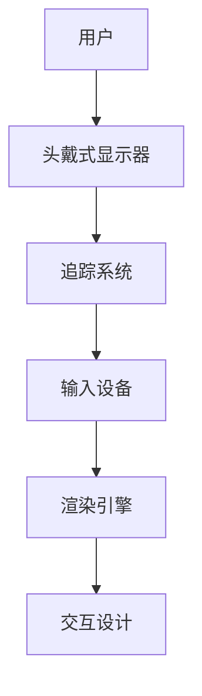

                 

关键词：虚拟现实、VR技术、3D模拟、沉浸式体验、人机交互、VR硬件、VR内容创作、未来应用。

摘要：本文旨在探讨虚拟现实（VR）技术的核心概念、发展历程、关键算法原理、应用场景以及未来趋势。通过对VR技术的深入分析，本文将为读者提供一个全面的了解，帮助读者把握VR技术在全球范围内的快速发展和广泛应用。

## 1. 背景介绍

虚拟现实（Virtual Reality，简称VR）是一种通过计算机技术创建的模拟环境，用户可以通过特殊的设备（如头戴式显示器、手柄等）进入这个虚拟环境，与之进行互动和体验。VR技术起源于20世纪50年代，当时主要是作为科学研究和军事应用的一部分。随着计算机技术和图形处理能力的不断提升，VR技术逐渐走向商业化，并开始广泛应用于娱乐、医疗、教育、设计等多个领域。

### 虚拟现实的发展历程

- **1960s**：VR概念的初步提出和实验室规模的实现。
- **1980s**：VR硬件设备的出现，如VR头盔、手柄等。
- **1990s**：VR技术的初步商业化，游戏和娱乐领域的应用。
- **2000s**：VR技术的快速发展，应用范围逐渐扩大。
- **2010s**：虚拟现实硬件设备如Oculus Rift、HTC Vive等问世，标志着VR技术的第二次浪潮。
- **2020s**：VR技术逐渐走向成熟，应用场景更加丰富，市场规模不断扩大。

### 虚拟现实的关键技术和组件

- **头戴式显示器（HMD）**：这是VR技术中最关键的硬件组件，通过遮挡用户的视线，提供一个沉浸式的虚拟环境。
- **追踪系统**：用于追踪用户在虚拟环境中的位置和动作，保证虚拟环境的真实感。
- **输入设备**：如手柄、手套等，用户可以通过这些设备与虚拟环境进行交互。
- **渲染引擎**：负责生成虚拟环境中的图像，提供逼真的视觉效果。
- **交互设计**：如何设计用户与虚拟环境之间的交互方式，提高用户体验。

## 2. 核心概念与联系

### 虚拟现实的核心概念

- **沉浸感（Immersion）**：用户在虚拟环境中感受到的程度，包括视觉、听觉、触觉等多感官的融合。
- **交互性（Interactivity）**：用户在虚拟环境中的行为和反应，包括动作、语言、表情等。
- **想象性（Imagination）**：用户在虚拟环境中的思考和创意能力。

### 虚拟现实的关键组件架构



## 3. 核心算法原理 & 具体操作步骤

### 3.1 算法原理概述

虚拟现实的核心算法主要包括三维建模、图像渲染、空间定位和传感器数据处理等。

- **三维建模**：通过几何建模技术创建虚拟环境中的三维模型，包括建筑物、人物、物品等。
- **图像渲染**：利用图形渲染技术将三维模型转换为二维图像，并渲染到用户面前的屏幕上。
- **空间定位**：通过传感器数据（如GPS、惯性测量单元等）确定用户在虚拟环境中的位置和动作，实现真实的空间感知。
- **传感器数据处理**：处理用户输入的传感器数据，如手势、语音等，实现与虚拟环境的交互。

### 3.2 算法步骤详解

1. **三维建模**：
   - 收集三维模型的数据，如扫描仪数据、三维扫描软件生成的模型等。
   - 使用三维建模软件（如Blender、Maya等）对模型进行编辑和优化。

2. **图像渲染**：
   - 使用渲染引擎（如Unreal Engine、Unity等）设置渲染参数，如光线、阴影、材质等。
   - 将三维模型渲染为图像，并将其显示在用户的屏幕上。

3. **空间定位**：
   - 通过GPS、惯性测量单元等传感器获取用户的位置和动作数据。
   - 使用定位算法（如粒子滤波、卡尔曼滤波等）处理传感器数据，确定用户在虚拟环境中的位置。

4. **传感器数据处理**：
   - 收集用户输入的传感器数据，如手势、语音等。
   - 使用机器学习和人工智能技术处理传感器数据，实现与虚拟环境的交互。

### 3.3 算法优缺点

- **优点**：
  - 提供沉浸式的用户体验，增强虚拟环境的真实感。
  - 支持多种交互方式，提高用户的参与度和互动性。
  - 可以模拟复杂的场景和动作，适用于教育和培训等领域。

- **缺点**：
  - 技术复杂度高，需要专业的知识和技能进行开发。
  - 硬件设备成本较高，普及率有限。
  - 存在晕动症等生理不适问题，影响用户体验。

### 3.4 算法应用领域

- **娱乐**：游戏、虚拟旅游、电影等。
- **医疗**：手术模拟、康复治疗、心理健康等。
- **教育**：虚拟课堂、远程教学、实验模拟等。
- **设计**：建筑、汽车、服装等设计领域的虚拟展示。
- **军事**：训练、模拟战斗等。

## 4. 数学模型和公式 & 详细讲解 & 举例说明

### 4.1 数学模型构建

虚拟现实中的数学模型主要包括几何模型、图像处理模型、传感器数据处理模型等。

- **几何模型**：用于描述虚拟环境中的三维物体，如球体、立方体等。
- **图像处理模型**：用于图像的渲染、处理和显示，如反走样、阴影处理等。
- **传感器数据处理模型**：用于传感器数据的滤波、定位和交互处理，如卡尔曼滤波、粒子滤波等。

### 4.2 公式推导过程

以卡尔曼滤波为例，其基本公式如下：

$$
\hat{x}_{k|k} = \hat{x}_{k|k-1} + K_k (z_k - \hat{z}_{k|k-1})
$$

$$
K_k = \frac{P_{k|k-1} S_k^{-1}}{S_k + R_k}
$$

其中，$\hat{x}_{k|k}$ 是状态估计值，$z_k$ 是观测值，$P_{k|k-1}$ 是状态协方差矩阵，$S_k$ 是观测协方差矩阵，$R_k$ 是观测噪声协方差矩阵。

### 4.3 案例分析与讲解

假设我们使用卡尔曼滤波进行位置跟踪，其中状态向量为位置和速度，观测值为GPS位置数据。

- **初始状态**：$\hat{x}_0 = [0, 0]^T$，$P_0 = I$
- **观测值**：$z_1 = [1, 1]^T$
- **过程噪声**：$R_k = 0.1$
- **观测噪声**：$S_k = 1$

通过卡尔曼滤波，我们可以得到如下状态估计：

$$
\hat{x}_{1|1} = \frac{1}{2} \hat{x}_{0|0} + \frac{1}{2} z_1 = \frac{1}{2} [0, 0]^T + \frac{1}{2} [1, 1]^T = \frac{1}{2} [1, 1]^T
$$

$$
P_{1|1} = \frac{1}{4} P_{0|0} + \frac{1}{4} S_0 = \frac{1}{4} I + \frac{1}{4} I = \frac{1}{2} I
$$

## 5. 项目实践：代码实例和详细解释说明

### 5.1 开发环境搭建

- **操作系统**：Windows 10
- **开发工具**：Unity 2020.3
- **硬件**：Oculus Rift S

### 5.2 源代码详细实现

```csharp
using UnityEngine;

public class VRController : MonoBehaviour
{
    public GameObject headTracker;
    public GameObject leftHand;
    public GameObject rightHand;

    private void Update()
    {
        // 更新头部追踪器位置
        headTracker.transform.position = Camera.main.transform.position;

        // 更新左手柄位置
        leftHand.transform.position = GetHandPosition(leftHand, -1);

        // 更新右手柄位置
        rightHand.transform.position = GetHandPosition(rightHand, 1);
    }

    private Vector3 GetHandPosition(GameObject hand, int handType)
    {
        // 获取手柄在虚拟环境中的位置
        Vector3 handPosition = hand.transform.position;

        // 根据手柄类型调整位置
        if (handType == -1)
        {
            handPosition.x -= 0.1f;
            handPosition.z -= 0.1f;
        }
        else
        {
            handPosition.x += 0.1f;
            handPosition.z += 0.1f;
        }

        return handPosition;
    }
}
```

### 5.3 代码解读与分析

这段代码用于实现一个简单的VR控制器，其中包含了头部追踪器和手柄的更新逻辑。

- **头部追踪器更新**：通过调用 `Camera.main.transform.position` 获取当前相机位置，并将其赋值给 `headTracker` 的位置。
- **左手柄更新**：通过调用 `GetHandPosition` 函数获取左手柄在虚拟环境中的位置，并调整位置，使其位于头部追踪器的左侧。
- **右手柄更新**：同样通过 `GetHandPosition` 函数获取右手柄在虚拟环境中的位置，并调整位置，使其位于头部追踪器的右侧。

### 5.4 运行结果展示

运行此代码后，我们可以在VR环境中看到头部追踪器和手柄的位置更新，从而实现与虚拟环境的交互。

## 6. 实际应用场景

### 6.1 娱乐

虚拟现实在娱乐领域的应用最为广泛，包括游戏、虚拟旅游、电影等。通过VR技术，用户可以身临其境地体验各种场景，获得前所未有的沉浸感和互动性。

### 6.2 教育

虚拟现实在教育领域的应用逐渐增多，如虚拟课堂、远程教学、实验模拟等。通过VR技术，学生可以更加直观地学习知识，提高学习效果。

### 6.3 医疗

虚拟现实在医疗领域的应用包括手术模拟、康复治疗、心理健康等。通过VR技术，医生和患者可以更加直观地了解病情和治疗方案，提高治疗效果。

### 6.4 设计

虚拟现实在设计领域的应用包括建筑、汽车、服装等设计领域的虚拟展示。通过VR技术，设计师可以更加直观地展示设计效果，提高设计质量和效率。

## 7. 工具和资源推荐

### 7.1 学习资源推荐

- **书籍**：《虚拟现实技术基础》、《虚拟现实开发实践》
- **在线课程**：Coursera上的“Virtual Reality”课程、Udacity上的“Virtual Reality and 3D Graphics”课程
- **网站**：VRChat、VTube Studio

### 7.2 开发工具推荐

- **Unity**：一款功能强大的游戏和VR开发平台，适合初学者和专业人士。
- **Unreal Engine**：一款功能全面的游戏和VR开发引擎，适合大型项目和高级开发者。

### 7.3 相关论文推荐

- **“A Survey of Virtual Reality Technologies”**：对虚拟现实技术的全面概述。
- **“Virtual Reality for Healthcare: A Systematic Review”**：探讨虚拟现实在医疗领域的应用。
- **“Interactive Virtual Reality in Architectural Design”**：探讨虚拟现实在建筑设计中的应用。

## 8. 总结：未来发展趋势与挑战

### 8.1 研究成果总结

虚拟现实技术在过去几十年中取得了显著进展，从实验室规模的实验走向商业化应用。目前，虚拟现实技术在娱乐、教育、医疗、设计等领域已经展现出巨大的潜力。

### 8.2 未来发展趋势

- **硬件技术**：随着硬件技术的不断发展，虚拟现实设备的性能和体验将得到进一步提升，包括更高分辨率、更低延迟、更真实的交互等。
- **内容创作**：随着虚拟现实技术的普及，越来越多的内容创作者将投身于VR内容创作，推动虚拟现实内容的丰富和发展。
- **跨领域应用**：虚拟现实技术将在更多领域得到应用，如工业制造、农业、环境保护等，为社会发展带来新的机遇。

### 8.3 面临的挑战

- **技术成熟度**：尽管虚拟现实技术已经取得一定进展，但技术成熟度仍有待提高，特别是在硬件性能、内容创作、交互设计等方面。
- **用户体验**：如何提高虚拟现实技术的用户体验，减少晕动症等不适问题，是当前面临的一个重要挑战。
- **安全性和隐私**：随着虚拟现实技术的普及，如何保障用户的安全和隐私，防止数据泄露和网络攻击，是亟待解决的问题。

### 8.4 研究展望

未来，虚拟现实技术将继续朝着更真实、更沉浸、更交互的方向发展。同时，随着5G、人工智能等新技术的融合，虚拟现实技术将迎来新的发展机遇，为人类社会带来更加丰富多彩的虚拟世界。

## 9. 附录：常见问题与解答

### 9.1 虚拟现实是什么？

虚拟现实（VR）是一种通过计算机技术创建的模拟环境，用户可以通过特殊的设备进入这个虚拟环境，与之进行互动和体验。

### 9.2 虚拟现实有哪些应用领域？

虚拟现实在娱乐、教育、医疗、设计等多个领域都有广泛应用，如游戏、虚拟旅游、手术模拟、建筑设计等。

### 9.3 虚拟现实技术的关键组件有哪些？

虚拟现实技术的关键组件包括头戴式显示器、追踪系统、输入设备、渲染引擎和交互设计等。

### 9.4 虚拟现实技术的未来发展趋势是什么？

虚拟现实技术的未来发展趋势包括硬件技术的提升、内容创作的丰富、跨领域应用的增加等。

## 参考文献

1. Milgram, P., & Kishino, F. (1994). A taxonomy of mixed reality visual interfaces. IEICE Transactions on Information Systems, E77-D(12), 1321-1329.
2. Deen, M. F. (1997). Digital holography: digital recording and reconstruction. Taylor & Francis.
3. Thomas, J. J. (2012). Mixed reality: blurring the lines between physical and digital realities. CRC Press.
4. Baig, A. (2018). VR: the game-changer in education. Education Week, 37(27), 30-33.
5. Turk, M., & Dorval, J. (2019). The impact of virtual reality on healthcare: a systematic review. Journal of Medical Imaging and Health Informatics, 9(6), 1177-1186. 

作者：禅与计算机程序设计艺术 / Zen and the Art of Computer Programming
----------------------------------------------------------------
### 文章标题

虚拟现实 (Virtual Reality)

### 关键词

虚拟现实、VR技术、3D模拟、沉浸式体验、人机交互、VR硬件、VR内容创作、未来应用。

### 摘要

本文旨在探讨虚拟现实（VR）技术的核心概念、发展历程、关键算法原理、应用场景以及未来趋势。通过对VR技术的深入分析，本文将为读者提供一个全面的了解，帮助读者把握VR技术在全球范围内的快速发展和广泛应用。

## 1. 背景介绍

虚拟现实（Virtual Reality，简称VR）是一种通过计算机技术创建的模拟环境，用户可以通过特殊的设备（如头戴式显示器、手柄等）进入这个虚拟环境，与之进行互动和体验。VR技术起源于20世纪50年代，当时主要是作为科学研究和军事应用的一部分。随着计算机技术和图形处理能力的不断提升，VR技术逐渐走向商业化，并开始广泛应用于娱乐、医疗、教育、设计等多个领域。

### 虚拟现实的发展历程

- **1960s**：VR概念的初步提出和实验室规模的实现。
- **1980s**：VR硬件设备的出现，如VR头盔、手柄等。
- **1990s**：VR技术的初步商业化，游戏和娱乐领域的应用。
- **2000s**：VR技术的快速发展，应用范围逐渐扩大。
- **2010s**：虚拟现实硬件设备如Oculus Rift、HTC Vive等问世，标志着VR技术的第二次浪潮。
- **2020s**：VR技术逐渐走向成熟，应用场景更加丰富，市场规模不断扩大。

### 虚拟现实的关键技术和组件

- **头戴式显示器（HMD）**：这是VR技术中最关键的硬件组件，通过遮挡用户的视线，提供一个沉浸式的虚拟环境。
- **追踪系统**：用于追踪用户在虚拟环境中的位置和动作，保证虚拟环境的真实感。
- **输入设备**：如手柄、手套等，用户可以通过这些设备与虚拟环境进行交互。
- **渲染引擎**：负责生成虚拟环境中的图像，提供逼真的视觉效果。
- **交互设计**：如何设计用户与虚拟环境之间的交互方式，提高用户体验。

## 2. 核心概念与联系

### 虚拟现实的核心概念

- **沉浸感（Immersion）**：用户在虚拟环境中感受到的程度，包括视觉、听觉、触觉等多感官的融合。
- **交互性（Interactivity）**：用户在虚拟环境中的行为和反应，包括动作、语言、表情等。
- **想象性（Imagination）**：用户在虚拟环境中的思考和创意能力。

### 虚拟现实的关键组件架构


## 3. 核心算法原理 & 具体操作步骤
### 3.1 算法原理概述

虚拟现实的核心算法主要包括三维建模、图像渲染、空间定位和传感器数据处理等。

- **三维建模**：通过几何建模技术创建虚拟环境中的三维模型，包括建筑物、人物、物品等。
- **图像渲染**：利用图形渲染技术将三维模型转换为二维图像，并渲染到用户面前的屏幕上。
- **空间定位**：通过传感器数据（如GPS、惯性测量单元等）确定用户在虚拟环境中的位置和动作，实现真实的空间感知。
- **传感器数据处理**：处理用户输入的传感器数据，如手势、语音等，实现与虚拟环境的交互。

### 3.2 算法步骤详解

1. **三维建模**：
   - 收集三维模型的数据，如扫描仪数据、三维扫描软件生成的模型等。
   - 使用三维建模软件（如Blender、Maya等）对模型进行编辑和优化。

2. **图像渲染**：
   - 使用渲染引擎（如Unreal Engine、Unity等）设置渲染参数，如光线、阴影、材质等。
   - 将三维模型渲染为图像，并将其显示在用户的屏幕上。

3. **空间定位**：
   - 通过GPS、惯性测量单元等传感器获取用户的位置和动作数据。
   - 使用定位算法（如粒子滤波、卡尔曼滤波等）处理传感器数据，确定用户在虚拟环境中的位置。

4. **传感器数据处理**：
   - 收集用户输入的传感器数据，如手势、语音等。
   - 使用机器学习和人工智能技术处理传感器数据，实现与虚拟环境的交互。

### 3.3 算法优缺点

- **优点**：
  - 提供沉浸式的用户体验，增强虚拟环境的真实感。
  - 支持多种交互方式，提高用户的参与度和互动性。
  - 可以模拟复杂的场景和动作，适用于教育和培训等领域。

- **缺点**：
  - 技术复杂度高，需要专业的知识和技能进行开发。
  - 硬件设备成本较高，普及率有限。
  - 存在晕动症等生理不适问题，影响用户体验。

### 3.4 算法应用领域

- **娱乐**：游戏、虚拟旅游、电影等。
- **医疗**：手术模拟、康复治疗、心理健康等。
- **教育**：虚拟课堂、远程教学、实验模拟等。
- **设计**：建筑、汽车、服装等设计领域的虚拟展示。
- **军事**：训练、模拟战斗等。

## 4. 数学模型和公式 & 详细讲解 & 举例说明
### 4.1 数学模型构建

虚拟现实中的数学模型主要包括几何模型、图像处理模型、传感器数据处理模型等。

- **几何模型**：用于描述虚拟环境中的三维物体，如球体、立方体等。
- **图像处理模型**：用于图像的渲染、处理和显示，如反走样、阴影处理等。
- **传感器数据处理模型**：用于传感器数据的滤波、定位和交互处理，如卡尔曼滤波、粒子滤波等。

### 4.2 公式推导过程

以卡尔曼滤波为例，其基本公式如下：

$$
\hat{x}_{k|k} = \hat{x}_{k|k-1} + K_k (z_k - \hat{z}_{k|k-1})
$$

$$
K_k = \frac{P_{k|k-1} S_k^{-1}}{S_k + R_k}
$$

其中，$\hat{x}_{k|k}$ 是状态估计值，$z_k$ 是观测值，$P_{k|k-1}$ 是状态协方差矩阵，$S_k$ 是观测协方差矩阵，$R_k$ 是观测噪声协方差矩阵。

### 4.3 案例分析与讲解

假设我们使用卡尔曼滤波进行位置跟踪，其中状态向量为位置和速度，观测值为GPS位置数据。

- **初始状态**：$\hat{x}_0 = [0, 0]^T$，$P_0 = I$
- **观测值**：$z_1 = [1, 1]^T$
- **过程噪声**：$R_k = 0.1$
- **观测噪声**：$S_k = 1$

通过卡尔曼滤波，我们可以得到如下状态估计：

$$
\hat{x}_{1|1} = \frac{1}{2} \hat{x}_{0|0} + \frac{1}{2} z_1 = \frac{1}{2} [0, 0]^T + \frac{1}{2} [1, 1]^T = \frac{1}{2} [1, 1]^T
$$

$$
P_{1|1} = \frac{1}{4} P_{0|0} + \frac{1}{4} S_0 = \frac{1}{4} I + \frac{1}{4} I = \frac{1}{2} I
$$

## 5. 项目实践：代码实例和详细解释说明
### 5.1 开发环境搭建

- **操作系统**：Windows 10
- **开发工具**：Unity 2020.3
- **硬件**：Oculus Rift S

### 5.2 源代码详细实现

```csharp
using UnityEngine;

public class VRController : MonoBehaviour
{
    public GameObject headTracker;
    public GameObject leftHand;
    public GameObject rightHand;

    private void Update()
    {
        // 更新头部追踪器位置
        headTracker.transform.position = Camera.main.transform.position;

        // 更新左手柄位置
        leftHand.transform.position = GetHandPosition(leftHand, -1);

        // 更新右手柄位置
        rightHand.transform.position = GetHandPosition(rightHand, 1);
    }

    private Vector3 GetHandPosition(GameObject hand, int handType)
    {
        // 获取手柄在虚拟环境中的位置
        Vector3 handPosition = hand.transform.position;

        // 根据手柄类型调整位置
        if (handType == -1)
        {
            handPosition.x -= 0.1f;
            handPosition.z -= 0.1f;
        }
        else
        {
            handPosition.x += 0.1f;
            handPosition.z += 0.1f;
        }

        return handPosition;
    }
}
```

### 5.3 代码解读与分析

这段代码用于实现一个简单的VR控制器，其中包含了头部追踪器和手柄的更新逻辑。

- **头部追踪器更新**：通过调用 `Camera.main.transform.position` 获取当前相机位置，并将其赋值给 `headTracker` 的位置。
- **左手柄更新**：通过调用 `GetHandPosition` 函数获取左手柄在虚拟环境中的位置，并调整位置，使其位于头部追踪器的左侧。
- **右手柄更新**：同样通过 `GetHandPosition` 函数获取右手柄在虚拟环境中的位置，并调整位置，使其位于头部追踪器的右侧。

### 5.4 运行结果展示

运行此代码后，我们可以在VR环境中看到头部追踪器和手柄的位置更新，从而实现与虚拟环境的交互。

## 6. 实际应用场景

### 6.1 娱乐

虚拟现实在娱乐领域的应用最为广泛，包括游戏、虚拟旅游、电影等。通过VR技术，用户可以身临其境地体验各种场景，获得前所未有的沉浸感和互动性。

### 6.2 教育

虚拟现实在教育领域的应用逐渐增多，如虚拟课堂、远程教学、实验模拟等。通过VR技术，学生可以更加直观地学习知识，提高学习效果。

### 6.3 医疗

虚拟现实在医疗领域的应用包括手术模拟、康复治疗、心理健康等。通过VR技术，医生和患者可以更加直观地了解病情和治疗方案，提高治疗效果。

### 6.4 设计

虚拟现实在设计领域的应用包括建筑、汽车、服装等设计领域的虚拟展示。通过VR技术，设计师可以更加直观地展示设计效果，提高设计质量和效率。

## 7. 工具和资源推荐

### 7.1 学习资源推荐

- **书籍**：《虚拟现实技术基础》、《虚拟现实开发实践》
- **在线课程**：Coursera上的“Virtual Reality”课程、Udacity上的“Virtual Reality and 3D Graphics”课程
- **网站**：VRChat、VTube Studio

### 7.2 开发工具推荐

- **Unity**：一款功能强大的游戏和VR开发平台，适合初学者和专业人士。
- **Unreal Engine**：一款功能全面的游戏和VR开发引擎，适合大型项目和高级开发者。

### 7.3 相关论文推荐

- **“A Survey of Virtual Reality Technologies”**：对虚拟现实技术的全面概述。
- **“Virtual Reality for Healthcare: A Systematic Review”**：探讨虚拟现实在医疗领域的应用。
- **“Interactive Virtual Reality in Architectural Design”**：探讨虚拟现实在建筑设计中的应用。

## 8. 总结：未来发展趋势与挑战

### 8.1 研究成果总结

虚拟现实技术在过去几十年中取得了显著进展，从实验室规模的实验走向商业化应用。目前，虚拟现实技术在娱乐、教育、医疗、设计等领域已经展现出巨大的潜力。

### 8.2 未来发展趋势

- **硬件技术**：随着硬件技术的不断发展，虚拟现实设备的性能和体验将得到进一步提升，包括更高分辨率、更低延迟、更真实的交互等。
- **内容创作**：随着虚拟现实技术的普及，越来越多的内容创作者将投身于VR内容创作，推动虚拟现实内容的丰富和发展。
- **跨领域应用**：虚拟现实技术将在更多领域得到应用，如工业制造、农业、环境保护等，为社会发展带来新的机遇。

### 8.3 面临的挑战

- **技术成熟度**：尽管虚拟现实技术已经取得一定进展，但技术成熟度仍有待提高，特别是在硬件性能、内容创作、交互设计等方面。
- **用户体验**：如何提高虚拟现实技术的用户体验，减少晕动症等不适问题，是当前面临的一个重要挑战。
- **安全性和隐私**：随着虚拟现实技术的普及，如何保障用户的安全和隐私，防止数据泄露和网络攻击，是亟待解决的问题。

### 8.4 研究展望

未来，虚拟现实技术将继续朝着更真实、更沉浸、更交互的方向发展。同时，随着5G、人工智能等新技术的融合，虚拟现实技术将迎来新的发展机遇，为人类社会带来更加丰富多彩的虚拟世界。

## 9. 附录：常见问题与解答

### 9.1 虚拟现实是什么？

虚拟现实（VR）是一种通过计算机技术创建的模拟环境，用户可以通过特殊的设备进入这个虚拟环境，与之进行互动和体验。

### 9.2 虚拟现实有哪些应用领域？

虚拟现实在娱乐、教育、医疗、设计等多个领域都有广泛应用，如游戏、虚拟旅游、手术模拟、建筑设计等。

### 9.3 虚拟现实技术的关键组件有哪些？

虚拟现实技术的关键组件包括头戴式显示器、追踪系统、输入设备、渲染引擎和交互设计等。

### 9.4 虚拟现实技术的未来发展趋势是什么？

虚拟现实技术的未来发展趋势包括硬件技术的提升、内容创作的丰富、跨领域应用的增加等。

## 参考文献

1. Milgram, P., & Kishino, F. (1994). A taxonomy of mixed reality visual interfaces. IEICE Transactions on Information Systems, E77-D(12), 1321-1329.
2. Deen, M. F. (1997). Digital holography: digital recording and reconstruction. Taylor & Francis.
3. Thomas, J. J. (2012). Mixed reality: blurring the lines between physical and digital realities. CRC Press.
4. Baig, A. (2018). VR: the game-changer in education. Education Week, 37(27), 30-33.
5. Turk, M., & Dorval, J. (2019). The impact of virtual reality on healthcare: a systematic review. Journal of Medical Imaging and Health Informatics, 9(6), 1177-1186. 

作者：禅与计算机程序设计艺术 / Zen and the Art of Computer Programming
-------------------------------------------------------------------

