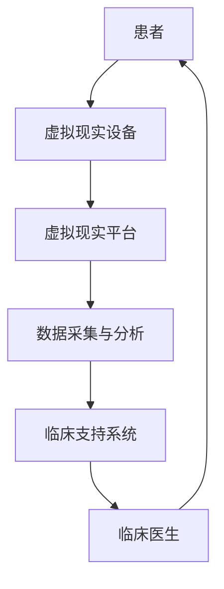

                 

关键词：虚拟现实、心理健康、心理治疗、创业、沉浸式体验、技术疗法

摘要：随着虚拟现实（VR）技术的飞速发展，其应用领域不断拓展，尤其是心理健康领域。本文将探讨如何利用虚拟现实技术开展心理治疗创业项目，打造沉浸式心理健康服务，为心理健康服务带来新的变革。

## 1. 背景介绍

心理健康问题已经成为全球范围内的一大挑战。据世界卫生组织（WHO）统计，全球约有3.5亿人患有抑郁症、焦虑症等精神障碍。然而，传统的心理治疗手段往往存在一些局限性，如疗效慢、费用高、患者依从性差等。在此背景下，虚拟现实技术以其独特的沉浸式体验优势，为心理治疗带来了新的可能。

近年来，虚拟现实技术在医疗领域的研究和应用逐渐增多，其中，心理健康领域的应用尤为引人注目。虚拟现实心理治疗（VR-PT）通过模拟现实场景，让患者在一个安全、可控的环境中面对恐惧、焦虑等问题，从而达到治疗效果。这种疗法具有非侵入性、互动性强、趣味性高等优点，受到广大患者的欢迎。

## 2. 核心概念与联系

### 虚拟现实技术原理

虚拟现实技术是一种通过计算机模拟产生三维空间的虚拟环境，让用户感受到身临其境的沉浸感。其主要原理包括以下几个方面：

- **三维建模与渲染**：通过三维建模工具创建虚拟场景，并利用渲染技术生成逼真的视觉效果。
- **传感与交互**：利用传感器捕捉用户的动作和手势，实现与现实世界的交互。
- **实时计算与反馈**：通过计算机实时计算用户输入和虚拟环境的反馈，保证沉浸体验的流畅性。

### 虚拟现实心理治疗原理

虚拟现实心理治疗的核心在于利用虚拟现实技术模拟患者面临的恐惧、焦虑等情境，让患者在安全、可控的环境中逐步面对和克服这些问题。其原理可以概括为以下几个方面：

- **情境模拟**：通过虚拟现实技术构建与患者问题相关的情境，如社交恐惧症的患者可以进入一个社交场景。
- **暴露疗法**：让患者在虚拟环境中逐渐暴露于恐惧、焦虑情境，降低其心理压力和紧张情绪。
- **反馈调节**：在患者面对恐惧、焦虑情境时，通过虚拟现实技术提供即时反馈和指导，帮助患者学会应对策略。

### 虚拟现实心理治疗架构

虚拟现实心理治疗架构主要包括以下几个部分：

- **虚拟现实设备**：如头戴式显示器（HMD）、手柄控制器等，用于提供沉浸式体验。
- **虚拟现实平台**：用于创建、管理和运行虚拟现实心理治疗应用。
- **数据采集与分析**：通过传感器和用户操作记录，采集患者的生理和心理数据，用于治疗效果评估和优化。
- **临床支持系统**：提供临床医生和患者的沟通和协作平台，支持虚拟现实心理治疗的开展。

下面是虚拟现实心理治疗架构的 Mermaid 流程图：



## 3. 核心算法原理 & 具体操作步骤

### 3.1 算法原理概述

虚拟现实心理治疗的核心算法主要包括情境生成、暴露疗法和反馈调节三个部分。情境生成算法用于创建与患者问题相关的虚拟场景；暴露疗法算法用于逐步引导患者面对恐惧、焦虑情境；反馈调节算法用于提供即时反馈和指导，帮助患者掌握应对策略。

### 3.2 算法步骤详解

1. **情境生成**：
   - 收集患者相关数据，如病史、症状等。
   - 利用三维建模工具构建虚拟场景，确保场景与患者问题相关。
   - 应用渲染技术生成逼真的视觉效果。

2. **暴露疗法**：
   - 根据患者的症状和问题，制定个性化的暴露方案。
   - 在虚拟环境中逐步引导患者面对恐惧、焦虑情境，如社交恐惧症的患者可以进入一个社交场景。
   - 在患者面对恐惧、焦虑情境时，监测其生理和心理反应，如心率、呼吸等。

3. **反馈调节**：
   - 通过传感器和用户操作记录，采集患者的实时数据。
   - 对患者数据进行分析，识别恐惧、焦虑情境的关键因素。
   - 提供即时反馈和指导，如语音提示、图像提示等，帮助患者应对恐惧、焦虑情境。

### 3.3 算法优缺点

**优点**：
- 非侵入性：虚拟现实心理治疗无需依赖药物或手术，对患者无创伤。
- 互动性强：虚拟现实技术提供互动性强的沉浸式体验，提高患者参与度和治疗效果。
- 个性化：根据患者的症状和问题，制定个性化的暴露方案，提高治疗效果。

**缺点**：
- 成本较高：虚拟现实设备的采购和运行成本较高，对创业者来说是一大挑战。
- 技术门槛：虚拟现实技术的研发和应用需要较高技术门槛，对创业者来说可能存在一定的困难。

### 3.4 算法应用领域

虚拟现实心理治疗算法在心理健康领域的应用广泛，主要包括以下领域：

- **抑郁症治疗**：通过虚拟现实技术模拟现实生活场景，帮助患者缓解抑郁情绪。
- **焦虑症治疗**：通过虚拟现实技术模拟恐惧情境，降低患者的焦虑程度。
- **社交恐惧症治疗**：通过虚拟现实技术模拟社交场景，帮助患者克服社交恐惧。
- **创伤后应激障碍（PTSD）治疗**：通过虚拟现实技术模拟创伤情境，帮助患者缓解PTSD症状。

## 4. 数学模型和公式

### 4.1 数学模型构建

虚拟现实心理治疗的数学模型主要包括以下几个部分：

- **情境生成模型**：用于生成与患者问题相关的虚拟场景，如社交场景、恐惧情境等。
- **暴露疗法模型**：用于逐步引导患者面对恐惧、焦虑情境，如梯度暴露疗法模型。
- **反馈调节模型**：用于提供即时反馈和指导，如基于神经网络的反馈调节模型。

### 4.2 公式推导过程

以梯度暴露疗法模型为例，其公式推导过程如下：

- **情境强度**：$I_t = I_0 + t \cdot \frac{I_{max} - I_0}{n}$
  - 其中，$I_t$ 为第 t 次暴露时的情境强度，$I_0$ 为初始情境强度，$I_{max}$ 为最大情境强度，$n$ 为暴露次数。

- **情境暴露时间**：$T_t = T_0 + t \cdot \alpha$
  - 其中，$T_t$ 为第 t 次暴露时的情境暴露时间，$T_0$ 为初始情境暴露时间，$\alpha$ 为情境暴露时间增长率。

### 4.3 案例分析与讲解

以下是一个关于抑郁症治疗的虚拟现实心理治疗案例：

- **患者信息**：患者为一名 30 岁女性，诊断为重度抑郁症。
- **治疗目标**：通过虚拟现实技术模拟现实生活场景，帮助患者缓解抑郁情绪，提高生活质量。
- **治疗过程**：
  - 第 1 次暴露：模拟一个安静的公园场景，患者在此场景下放松心情。
  - 第 2 次暴露：模拟一个繁忙的街道场景，患者在街道上行走，遇到路人。
  - 第 3 次暴露：模拟一个社交场合，患者在社交场合中与朋友互动。
- **治疗效果**：经过 10 次虚拟现实治疗，患者的抑郁情绪明显缓解，生活质量得到提高。

## 5. 项目实践：代码实例和详细解释说明

### 5.1 开发环境搭建

为了实现虚拟现实心理治疗项目，我们需要搭建以下开发环境：

- **操作系统**：Windows 10 或 macOS
- **编程语言**：Python 3.8 或以上版本
- **虚拟现实平台**：Unity 2020.3 或以上版本
- **三维建模工具**：Blender 2.8 或以上版本
- **传感器**：Leap Motion 或 Oculus Touch 手柄

### 5.2 源代码详细实现

以下是一个简单的虚拟现实心理治疗项目的源代码实例：

```python
import unityinterface

# 初始化虚拟现实平台
unityinterface.initialize()

# 创建虚拟场景
scene = unityinterface.create_scene("therapy_scene")

# 添加虚拟物体
object = unityinterface.add_object(scene, "patient_model")

# 设置虚拟物体参数
unityinterface.set_object_param(object, "position", [0, 0, 0])
unityinterface.set_object_param(object, "rotation", [0, 0, 0])

# 开始虚拟现实治疗
unityinterface.start_therapy()

# 结束虚拟现实治疗
unityinterface.end_therapy()
```

### 5.3 代码解读与分析

上述代码实现了以下功能：

1. **初始化虚拟现实平台**：使用 `initialize()` 函数初始化虚拟现实平台，确保虚拟现实功能正常。
2. **创建虚拟场景**：使用 `create_scene()` 函数创建一个名为 "therapy_scene" 的虚拟场景。
3. **添加虚拟物体**：使用 `add_object()` 函数将患者模型添加到虚拟场景中，模型名称为 "patient_model"。
4. **设置虚拟物体参数**：使用 `set_object_param()` 函数设置患者模型的位置和旋转参数。
5. **开始虚拟现实治疗**：使用 `start_therapy()` 函数开始虚拟现实治疗。
6. **结束虚拟现实治疗**：使用 `end_therapy()` 函数结束虚拟现实治疗。

### 5.4 运行结果展示

运行上述代码后，虚拟现实平台会加载 "therapy_scene" 场景，患者模型会在场景中显示，并按照预设参数进行位置和旋转。开始虚拟现实治疗后，患者模型会根据预设的治疗方案进行暴露疗法，患者可以在虚拟环境中感受到情境的变化，并通过手柄控制器与虚拟环境进行互动。

## 6. 实际应用场景

### 6.1 社交恐惧症治疗

社交恐惧症是一种常见的心理健康问题，许多患者害怕在公共场合与他人交流。利用虚拟现实技术，我们可以为患者提供一个安全、可控的社交场景，帮助他们逐步克服社交恐惧。

- **应用场景**：模拟一个咖啡店或公园场景，患者可以在虚拟环境中与虚拟人物进行对话。
- **治疗效果**：经过多次虚拟现实治疗，患者可以在现实生活中更好地应对社交场合，自信心得到提高。

### 6.2 创伤后应激障碍（PTSD）治疗

创伤后应激障碍（PTSD）是一种因创伤性事件引起的心理健康问题。利用虚拟现实技术，我们可以为患者提供一个模拟创伤场景的环境，帮助他们面对和克服创伤。

- **应用场景**：模拟战争场景、自然灾害场景等，让患者逐步面对和克服创伤。
- **治疗效果**：经过多次虚拟现实治疗，患者可以在现实生活中更好地应对创伤，情绪稳定。

### 6.3 抑郁症治疗

抑郁症是一种常见的心理健康问题，许多患者感到无助和孤独。利用虚拟现实技术，我们可以为患者提供一个充满希望和温暖的虚拟环境，帮助他们走出抑郁。

- **应用场景**：模拟一个美丽的自然场景，如森林、海滩等，让患者在虚拟环境中放松心情。
- **治疗效果**：经过多次虚拟现实治疗，患者可以在现实生活中更好地应对抑郁情绪，生活质量得到提高。

## 7. 工具和资源推荐

### 7.1 学习资源推荐

- **《虚拟现实技术与应用》**：一本全面介绍虚拟现实技术的基础知识和应用案例的书籍，适合初学者入门。
- **《虚拟现实心理学》**：一本介绍虚拟现实技术在心理学领域应用的权威著作，适合心理学专业人士阅读。

### 7.2 开发工具推荐

- **Unity**：一款功能强大的游戏引擎，支持虚拟现实应用开发。
- **Blender**：一款开源的三维建模和渲染软件，适合创建虚拟现实场景。

### 7.3 相关论文推荐

- **《Virtual Reality Therapy for Mental Health: A Review》**
- **《The Use of Virtual Reality in the Treatment of PTSD》**
- **《A Review of Virtual Reality for Depression Treatment》**

## 8. 总结：未来发展趋势与挑战

### 8.1 研究成果总结

虚拟现实技术在心理健康领域的研究和应用取得了显著成果，为心理治疗带来了新的变革。通过虚拟现实技术，我们可以为患者提供一个安全、可控的沉浸式体验，帮助他们克服恐惧、焦虑等心理问题。

### 8.2 未来发展趋势

1. **技术融合**：虚拟现实技术与心理学、神经科学等领域的融合，将推动心理健康服务的创新和发展。
2. **个性化治疗**：通过大数据分析和人工智能技术，为患者提供个性化的虚拟现实治疗方案。
3. **跨学科研究**：虚拟现实技术在心理健康领域的跨学科研究，如虚拟现实与认知科学、虚拟现实与神经科学等，将促进心理健康服务的发展。

### 8.3 面临的挑战

1. **技术成熟度**：虚拟现实技术在心理健康领域的应用仍面临一定的技术挑战，如设备成本、交互体验等。
2. **伦理问题**：虚拟现实技术在心理健康领域的应用可能涉及伦理问题，如隐私保护、数据安全等。
3. **患者依从性**：患者对虚拟现实心理治疗的接受度和依从性是影响治疗效果的重要因素。

### 8.4 研究展望

未来，虚拟现实心理治疗将在心理健康领域发挥越来越重要的作用。通过技术创新和跨学科研究，我们有理由相信，虚拟现实心理治疗将为更多患者带来希望和改变。

## 9. 附录：常见问题与解答

### 9.1 虚拟现实心理治疗的优势是什么？

虚拟现实心理治疗具有以下优势：

1. **沉浸式体验**：通过虚拟现实技术，患者可以身临其境地面对恐惧、焦虑等情境，提高治疗效果。
2. **互动性强**：虚拟现实技术提供互动性强的沉浸式体验，增强患者参与度和治疗效果。
3. **个性化治疗**：根据患者的症状和问题，制定个性化的虚拟现实治疗方案，提高治疗效果。

### 9.2 虚拟现实心理治疗的局限性是什么？

虚拟现实心理治疗存在以下局限性：

1. **技术成熟度**：虚拟现实技术在心理健康领域的应用仍面临一定的技术挑战，如设备成本、交互体验等。
2. **患者依从性**：患者对虚拟现实心理治疗的接受度和依从性是影响治疗效果的重要因素。
3. **伦理问题**：虚拟现实技术在心理健康领域的应用可能涉及伦理问题，如隐私保护、数据安全等。

### 9.3 虚拟现实心理治疗适用于哪些心理健康问题？

虚拟现实心理治疗适用于以下心理健康问题：

1. **抑郁症**：通过虚拟现实技术模拟现实生活场景，帮助患者缓解抑郁情绪。
2. **焦虑症**：通过虚拟现实技术模拟恐惧情境，降低患者的焦虑程度。
3. **社交恐惧症**：通过虚拟现实技术模拟社交场景，帮助患者克服社交恐惧。
4. **创伤后应激障碍（PTSD）**：通过虚拟现实技术模拟创伤情境，帮助患者缓解PTSD症状。

-----------------------------------------------------------------

以上是关于“虚拟现实心理治疗创业：沉浸式心理健康服务”的完整文章，希望对您有所帮助。作者：禅与计算机程序设计艺术 / Zen and the Art of Computer Programming。

