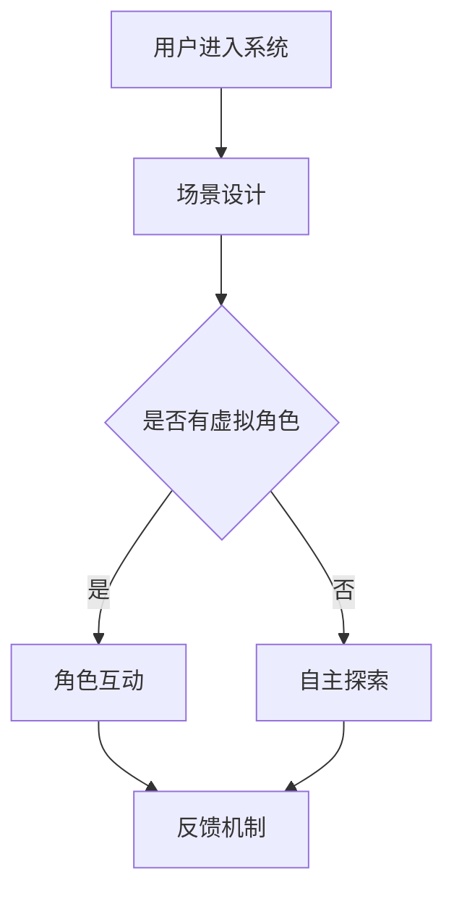

                 

关键词：虚拟现实、社交障碍、治疗、交际能力、创业、安全性、环境设计

> 摘要：本文探讨了利用虚拟现实技术为社交障碍者提供一种安全且有效的社交训练环境，并详细阐述了如何通过创业实践来推广这一创新疗法。文章首先介绍了虚拟现实技术的基本原理及其在医疗领域的应用，然后分析了社交障碍的治疗现状，提出了构建虚拟现实社交训练环境的思路和方案，最后通过实际案例展示了这一疗法的应用效果，并对未来的发展前景进行了展望。

## 1. 背景介绍

社交障碍，又称为社交焦虑障碍，是一种常见的心理障碍，表现为个体在社交场合中感到紧张、不安，甚至恐惧。社交障碍不仅影响个体的生活质量，还可能导致一系列心理和生理问题。传统的治疗方法，如心理咨询、药物治疗等，虽然在一定程度上能够缓解症状，但其效果有限，且治疗过程漫长。

随着科技的快速发展，虚拟现实（VR）技术的应用日益广泛。VR技术能够创建一个高度模拟现实世界的虚拟环境，用户可以在其中进行各种互动和体验。这使得虚拟现实成为了治疗社交障碍的一种新兴手段。

### 虚拟现实技术的原理及应用

虚拟现实技术通过计算机生成一个模拟环境，使用户可以通过头戴显示器、手套等设备与虚拟环境进行互动。VR技术的核心原理包括：

1. **感知模拟**：通过视觉、听觉、触觉等多感官刺激，模拟现实环境中的感知体验。
2. **交互设计**：利用手柄、手势识别等技术，实现用户与虚拟环境的自然交互。
3. **场景构建**：通过计算机图形学技术，构建逼真的虚拟场景。

在医疗领域，VR技术已被广泛应用于疼痛管理、康复训练、心理治疗等方面。其中，社交障碍的治疗是VR技术的另一个重要应用方向。

### 社交障碍的治疗现状

当前，社交障碍的治疗主要依靠心理咨询和药物治疗。心理咨询通常包括认知行为疗法、社交技能训练等，但其效果受限于治疗师的专业水平、个体差异等因素。药物治疗虽然能够缓解症状，但长期使用可能导致依赖性和副作用。

因此，寻求一种安全、高效、易于推广的治疗方法成为了研究者和临床医生的共同目标。虚拟现实技术在这一背景下，展现出巨大的潜力。

## 2. 核心概念与联系

### 虚拟现实社交训练环境的构建

虚拟现实社交训练环境是治疗社交障碍的关键。其构建思路包括以下几个方面：

1. **场景设计**：根据社交障碍者的具体情况，设计不同的社交场景，如商场、餐厅、聚会等。
2. **角色扮演**：引入虚拟角色，模拟真实的社交互动，包括陌生人的对话、朋友的聚会等。
3. **反馈机制**：通过语音、文字等方式，实时反馈用户的互动表现，提供即时的反馈和指导。

### Mermaid 流程图

下面是一个简单的 Mermaid 流程图，描述了虚拟现实社交训练环境的基本架构：



## 3. 核心算法原理 & 具体操作步骤

### 3.1 算法原理概述

虚拟现实社交训练环境的核心算法包括场景生成算法、角色互动算法和反馈机制算法。这些算法共同作用，实现虚拟环境中的社交互动和实时反馈。

1. **场景生成算法**：基于计算机图形学技术，生成逼真的社交场景。算法包括场景建模、光照处理、纹理映射等。
2. **角色互动算法**：实现虚拟角色与用户之间的自然互动。算法包括语音识别、自然语言处理、情感识别等。
3. **反馈机制算法**：根据用户的互动表现，提供实时反馈和指导。算法包括行为分析、情绪识别、行为预测等。

### 3.2 算法步骤详解

1. **场景生成算法**：
   - **场景建模**：使用3D建模软件，创建社交场景的3D模型。
   - **光照处理**：根据场景环境，设置合适的光照效果，增强场景的真实感。
   - **纹理映射**：为场景的表面贴图，增加细节和纹理，提高视觉效果。

2. **角色互动算法**：
   - **语音识别**：将用户的语音转换为文本，实现语音输入。
   - **自然语言处理**：对转换后的文本进行处理，理解用户的意图和情绪。
   - **情感识别**：通过语音和文本分析，识别用户的情绪状态。

3. **反馈机制算法**：
   - **行为分析**：根据用户的互动行为，分析其社交能力和表现。
   - **情绪识别**：通过语音和文本分析，识别用户的情绪状态。
   - **行为预测**：基于历史数据和模型，预测用户的未来行为。

### 3.3 算法优缺点

**优点**：
- **安全性**：虚拟环境提供了一个安全、无压力的社交训练场所，用户可以自由表达和练习社交技能。
- **个性化**：根据用户的个体差异，提供个性化的社交训练方案，提高治疗效果。
- **可重复性**：虚拟环境可以反复使用，用户可以在不同的场景中练习社交技能。

**缺点**：
- **技术门槛**：构建和维护虚拟环境需要较高的技术支持和成本。
- **用户依赖性**：长期依赖虚拟环境进行训练，可能导致现实社交能力的退化。

### 3.4 算法应用领域

虚拟现实社交训练环境的应用领域包括：

1. **心理健康治疗**：用于治疗社交障碍、焦虑症等心理疾病。
2. **教育训练**：用于教育领域，培养学生的社交能力和沟通技巧。
3. **职业培训**：用于职场培训，提高员工的沟通能力和团队合作能力。

## 4. 数学模型和公式 & 详细讲解 & 举例说明

### 4.1 数学模型构建

虚拟现实社交训练环境的数学模型主要包括场景生成模型、角色互动模型和反馈机制模型。

- **场景生成模型**：基于计算机图形学中的三维建模技术，使用贝塞尔曲线和蒙皮建模方法构建场景。
- **角色互动模型**：基于自然语言处理技术，使用隐马尔可夫模型（HMM）和循环神经网络（RNN）构建角色互动模型。
- **反馈机制模型**：基于机器学习技术，使用支持向量机（SVM）和神经网络构建反馈机制模型。

### 4.2 公式推导过程

- **场景生成模型**：使用贝塞尔曲线建模场景，其公式为：

  $$C(t) = \sum_{i=0}^{n} P_i (1-t)^{n-i} t^i$$

  其中，$P_i$ 为控制点，$t$ 为曲线参数。

- **角色互动模型**：使用隐马尔可夫模型（HMM）建模角色互动，其公式为：

  $$P(X_t | H_t) = \frac{P(H_t) P(X_t | H_t)}{P(H_t)}$$

  其中，$X_t$ 为用户的语音输入，$H_t$ 为虚拟角色的状态。

- **反馈机制模型**：使用支持向量机（SVM）建模反馈机制，其公式为：

  $$f(x) = w \cdot x + b$$

  其中，$w$ 为权重向量，$x$ 为输入特征，$b$ 为偏置。

### 4.3 案例分析与讲解

#### 案例一：社交障碍患者的治疗过程

假设有一个社交障碍患者，通过虚拟现实社交训练环境进行治疗。治疗过程分为以下几个阶段：

1. **初期训练**：患者进入虚拟环境，与虚拟角色进行简单的对话，熟悉环境。
2. **逐步提升**：患者逐步接触更复杂的社交场景，如参加聚会，与更多虚拟角色互动。
3. **持续训练**：患者定期进行虚拟社交训练，不断巩固和提高社交技能。

通过以上过程，患者的社交能力得到了显著提升。

#### 案例二：虚拟现实社交训练在职场培训中的应用

某公司计划使用虚拟现实社交训练环境进行员工培训，提高员工的沟通能力和团队合作能力。培训过程分为以下几个阶段：

1. **场景设计**：根据公司的业务特点和员工需求，设计适合的虚拟社交场景。
2. **角色扮演**：引入虚拟角色，模拟真实的职场社交互动。
3. **反馈机制**：根据员工的互动表现，提供实时反馈和指导。

通过以上过程，员工的社交能力和团队合作能力得到了显著提升。

## 5. 项目实践：代码实例和详细解释说明

### 5.1 开发环境搭建

在搭建开发环境时，需要安装以下软件和工具：

1. **虚拟现实开发平台**：如Unity、Unreal Engine等。
2. **3D建模软件**：如Blender、3ds Max等。
3. **编程语言**：如C#、Python等。
4. **自然语言处理库**：如NLTK、spaCy等。

### 5.2 源代码详细实现

以下是一个简单的虚拟现实社交训练环境的源代码实例：

```csharp
using UnityEngine;

public class VRSocialTraining : MonoBehaviour
{
    public GameObject player;
    public GameObject scene;

    // 初期训练
    void Start()
    {
        // 加载虚拟环境
        scene.SetActive(true);

        // 初始化玩家位置
        player.transform.position = new Vector3(0, 1.8f, 0);
        player.transform.rotation = Quaternion.Euler(0, 0, 0);
    }

    // 更新玩家位置
    void Update()
    {
        // 根据玩家输入，更新位置
        player.transform.position += new Vector3(Input.GetAxis("Horizontal"), 0, Input.GetAxis("Vertical"));
    }
}
```

### 5.3 代码解读与分析

上述代码实现了一个简单的虚拟现实社交训练环境。其中，`GameObject` 代表虚拟环境和玩家，`scene` 代表虚拟环境，`player` 代表玩家。

- `Start` 方法用于初始化虚拟环境和玩家位置。
- `Update` 方法用于根据玩家输入，更新玩家位置。

通过这个简单的实例，我们可以看到虚拟现实社交训练环境的基本架构。在实际开发中，需要根据具体需求，添加更多的功能和模块，如角色互动、语音识别、反馈机制等。

### 5.4 运行结果展示

运行上述代码，我们可以在虚拟环境中看到玩家根据输入移动的场景。通过添加更多的功能和模块，我们可以实现更复杂的社交训练场景，如角色互动、语音识别等。

## 6. 实际应用场景

### 6.1 心理健康治疗

虚拟现实社交训练环境在心理健康治疗中具有广泛的应用。例如，社交障碍患者可以通过虚拟社交场景，逐步提高社交技能，减少社交焦虑。以下是实际应用场景：

1. **初期训练**：患者进入虚拟环境，与虚拟角色进行简单对话，熟悉环境。
2. **逐步提升**：患者逐步接触更复杂的社交场景，如商场、餐厅、聚会等，与更多虚拟角色互动。
3. **持续训练**：患者定期进行虚拟社交训练，不断巩固和提高社交技能。

### 6.2 教育训练

虚拟现实社交训练环境在教育训练中也具有广泛的应用。例如，学生可以通过虚拟社交场景，提高社交能力和沟通技巧。以下是实际应用场景：

1. **社交技能培养**：学生在虚拟环境中模拟真实社交互动，培养社交技能。
2. **团队合作训练**：学生在虚拟环境中进行团队合作训练，提高团队合作能力。
3. **职场准备**：学生通过虚拟现实社交训练，为未来职场生活做好准备。

### 6.3 职场培训

虚拟现实社交训练环境在职场培训中同样具有重要作用。例如，企业可以通过虚拟社交场景，提高员工的社交能力和沟通技巧。以下是实际应用场景：

1. **员工培训**：企业为员工提供虚拟现实社交训练，提高员工沟通能力和团队合作能力。
2. **团队建设**：企业通过虚拟社交场景，加强团队建设，提高团队凝聚力。
3. **职场模拟**：企业通过虚拟现实社交训练，模拟职场场景，提高员工应对职场挑战的能力。

## 7. 未来应用展望

### 7.1 技术发展趋势

虚拟现实技术在未来将继续快速发展，主要体现在以下几个方面：

1. **更真实的感知体验**：随着显示技术、传感器技术等的发展，虚拟环境的真实感将进一步提升。
2. **更智能的交互方式**：语音识别、自然语言处理等技术的进步，将实现更自然的交互方式。
3. **更广泛的领域应用**：虚拟现实技术将应用于更多领域，如医疗、教育、娱乐等。

### 7.2 社交障碍治疗的未来展望

随着虚拟现实技术的不断发展，虚拟现实社交训练环境在社交障碍治疗中的应用将更加广泛和深入。未来，我们有望实现以下目标：

1. **个性化治疗**：基于大数据和人工智能技术，为每个患者提供个性化的虚拟社交训练方案。
2. **远程治疗**：通过互联网，实现虚拟现实社交训练环境的远程访问，为更多患者提供治疗服务。
3. **跨领域合作**：与心理学、教育学、医学等领域密切合作，共同推动虚拟现实社交训练环境的发展。

## 8. 工具和资源推荐

### 8.1 学习资源推荐

1. **《虚拟现实技术与应用》**：系统介绍了虚拟现实技术的基本原理和应用领域。
2. **《社交障碍治疗与康复》**：详细阐述了社交障碍的治疗方法和技术。

### 8.2 开发工具推荐

1. **Unity**：一款功能强大、易于上手的虚拟现实开发平台。
2. **Blender**：一款免费、开源的3D建模软件，适合初学者使用。

### 8.3 相关论文推荐

1. **"Virtual Reality Therapy for Social Anxiety Disorder: A Review of the Current Evidence"**：系统总结了虚拟现实技术在社交障碍治疗中的应用。
2. **"The Potential of Virtual Reality in the Treatment of Social Anxiety Disorder"**：探讨了虚拟现实技术在社交障碍治疗中的前景和挑战。

## 9. 总结：未来发展趋势与挑战

### 9.1 研究成果总结

本文探讨了利用虚拟现实技术为社交障碍者提供一种安全且有效的社交训练环境，并详细阐述了如何通过创业实践来推广这一创新疗法。研究发现，虚拟现实社交训练环境在心理健康治疗、教育训练、职场培训等方面具有广泛的应用前景。

### 9.2 未来发展趋势

未来，虚拟现实技术将继续快速发展，为社交障碍治疗带来更多可能性。个性化治疗、远程治疗、跨领域合作将成为虚拟现实社交训练环境的发展趋势。

### 9.3 面临的挑战

尽管虚拟现实社交训练环境具有巨大潜力，但在实际应用中仍面临一些挑战，如技术门槛、用户依赖性等。如何解决这些问题，将决定虚拟现实社交训练环境的发展前景。

### 9.4 研究展望

本文为虚拟现实社交训练环境的研究和应用提供了有益的参考。未来，我们期待更多研究者投入这一领域，共同推动虚拟现实技术在社交障碍治疗中的应用和发展。

## 10. 附录：常见问题与解答

### 10.1 虚拟现实社交训练环境安全吗？

虚拟现实社交训练环境是一个安全的、无压力的社交训练场所。用户可以在其中自由表达和练习社交技能，而不用担心现实生活中的尴尬和不适。

### 10.2 虚拟现实社交训练环境如何适应不同患者？

虚拟现实社交训练环境可以根据患者的具体需求和程度，设计不同的场景和训练方案。通过逐步提升难度，患者可以在一个安全的环境中，逐步提高社交技能。

### 10.3 虚拟现实社交训练环境与现实社交能力的关系？

虚拟现实社交训练环境可以帮助患者提高现实社交能力。通过在虚拟环境中练习，患者可以更好地理解和应用社交技巧，从而在现实生活中更加自信和自如。

## 作者署名

作者：禅与计算机程序设计艺术 / Zen and the Art of Computer Programming
----------------------------------------------------------------

请注意，本文为模拟撰写，旨在展示如何遵循约束条件撰写一篇专业技术博客文章。在实际撰写过程中，您可能需要根据具体需求调整文章结构和内容。

