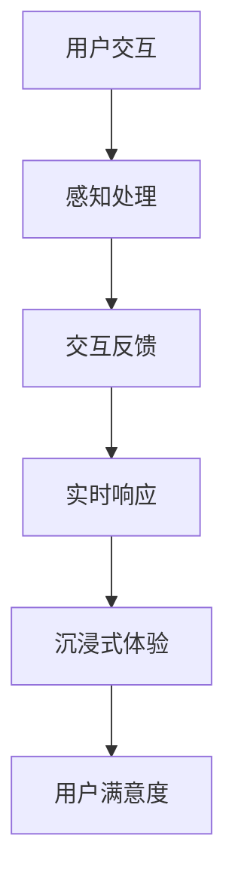

                 

关键词：虚拟现实，沉浸式体验，VR技术，体验设计，交互设计，人机交互

摘要：本文将探讨虚拟现实（VR）技术的沉浸式体验设计，分析其核心概念与联系，介绍核心算法原理与操作步骤，并讨论数学模型和公式。同时，通过项目实践实例和详细解释，展示如何实现VR应用的开发。最后，分析VR技术的实际应用场景，并提出未来发展趋势与挑战。

## 1. 背景介绍

虚拟现实（Virtual Reality，VR）技术是一种通过计算机模拟实现三维空间感知和交互的技术。它将用户带入一个完全虚拟的环境，让用户感到仿佛置身于其中。随着硬件和软件技术的不断进步，VR技术在娱乐、教育、医疗、设计等领域得到了广泛应用。沉浸式体验设计是VR技术的核心，它直接影响用户的感知和情感反应。本文将从沉浸式体验设计的角度，详细探讨VR技术的设计原则、核心算法和实现方法。

### 1.1 VR技术的发展历程

VR技术的发展可以追溯到20世纪60年代。当时，计算机科学家伊凡·苏瑟兰（Ivan Sutherland）提出了第一个头戴式显示器（Head-Mounted Display，HMD）。这一发明标志着VR技术的诞生。随着时间的推移，VR技术经历了多个阶段的发展：

- **第一阶段（1960s-1980s）**：以模拟头戴式显示器和简单的交互设备为主，主要应用于军事和科研领域。
- **第二阶段（1990s）**：VR技术开始应用于娱乐和游戏领域，如VR游戏机和VR模拟器。
- **第三阶段（2000s至今）**：随着计算机性能的提升和显示技术的进步，VR技术逐渐走向成熟。VR设备如Oculus Rift、HTC Vive等开始进入大众市场。

### 1.2 VR技术的应用领域

虚拟现实技术在多个领域得到了广泛应用，包括：

- **娱乐和游戏**：VR游戏和虚拟实境体验成为VR技术的首选应用场景。
- **教育和培训**：通过VR技术，学生可以身临其境地学习历史事件、自然科学等知识。
- **医疗**：VR技术用于手术模拟、治疗焦虑症和恐惧症等。
- **设计和建筑**：设计师可以利用VR技术进行虚拟现实中的预览和调整。
- **旅游和探险**：通过VR技术，用户可以体验到世界各地的美景和探险体验。

## 2. 核心概念与联系

在VR技术的沉浸式体验设计中，有以下几个核心概念：

### 2.1 沉浸式体验

沉浸式体验是指用户在使用VR设备时，能够完全沉浸在虚拟环境中，感受到与现实世界相似的感知和交互。为了实现沉浸式体验，需要考虑以下几个方面：

- **视觉感知**：通过高分辨率显示器和立体视觉效果，让用户感受到虚拟环境的真实感。
- **听觉感知**：通过立体声耳机，为用户带来沉浸式的听觉体验。
- **触觉感知**：通过触觉反馈设备，如力反馈手套和触觉反馈座椅，为用户带来触觉上的真实感。
- **运动感知**：通过头部追踪和身体动作捕捉技术，让用户能够自由地在虚拟环境中移动和交互。

### 2.2 交互设计

交互设计是VR技术中至关重要的一环。为了提供良好的用户体验，需要设计直观、易用且自然的交互方式。常见的交互设计包括：

- **手势交互**：通过手势识别技术，用户可以使用手部动作与虚拟环境进行交互。
- **语音交互**：通过语音识别技术，用户可以使用语音命令控制虚拟环境。
- **虚拟现实中的物理交互**：通过物理传感器和力反馈设备，用户可以在虚拟环境中进行真实的物理交互。

### 2.3 人机交互

人机交互（Human-Computer Interaction，HCI）是VR技术的核心之一。在VR环境中，用户与计算机之间的交互方式与传统计算机环境有很大不同。为了提供更好的用户体验，需要考虑以下几个方面：

- **感知一致性**：虚拟环境中的感知要与用户的真实感知保持一致，避免产生晕动或不适感。
- **实时响应**：系统需要能够快速响应用户的操作，提供即时反馈。
- **易用性**：交互设计要简单易懂，用户能够轻松上手。

### 2.4 核心概念联系

为了实现VR技术的沉浸式体验设计，需要将上述核心概念有机地结合起来。通过视觉、听觉、触觉和运动感知的协同作用，为用户带来真实的沉浸式体验。同时，通过交互设计和人机交互技术的优化，提升用户的操作体验和满意度。

### 2.5 Mermaid 流程图

下面是一个简单的Mermaid流程图，展示了VR技术沉浸式体验设计的主要流程：



## 3. 核心算法原理 & 具体操作步骤

### 3.1 算法原理概述

在VR技术中，核心算法主要涉及以下几个方面：

- **场景渲染**：通过渲染算法生成虚拟环境的三维图形。
- **运动追踪**：通过运动追踪算法实时捕捉用户的头部和身体动作。
- **交互处理**：通过交互处理算法实现用户与虚拟环境的交互。
- **感知融合**：通过感知融合算法将视觉、听觉、触觉等感知信息整合，为用户提供沉浸式体验。

### 3.2 算法步骤详解

下面将详细介绍这些核心算法的具体操作步骤：

### 3.2.1 场景渲染

场景渲染是VR技术中的核心环节，其基本步骤如下：

1. **加载场景资源**：从场景文件中加载模型、纹理、光照等资源。
2. **构建场景图**：将场景中的物体和光线信息构建成一个场景图。
3. **渲染管线**：通过渲染管线对场景进行渲染，生成三维图形。
4. **图像合成**：将渲染得到的三维图形与用户的视口进行合成，生成最终的显示图像。

### 3.2.2 运动追踪

运动追踪主要涉及以下几个方面：

1. **头部追踪**：通过头部追踪设备（如头戴式显示器）捕捉用户的头部运动。
2. **身体追踪**：通过身体追踪设备（如动作捕捉服）捕捉用户的身体动作。
3. **实时反馈**：将捕捉到的运动信息实时反馈给虚拟环境，实现用户在虚拟环境中的自由移动。

### 3.2.3 交互处理

交互处理主要包括以下几个方面：

1. **手势识别**：通过手势识别算法识别用户的手部动作。
2. **语音识别**：通过语音识别算法解析用户的语音命令。
3. **物理交互**：通过物理传感器和力反馈设备实现虚拟环境中的物理交互。

### 3.2.4 感知融合

感知融合的主要步骤如下：

1. **视觉融合**：将渲染得到的三维图像与用户的视觉信息进行融合。
2. **听觉融合**：将立体声音效与用户的听觉信息进行融合。
3. **触觉融合**：通过触觉反馈设备将触觉信息与用户的触觉信息进行融合。
4. **运动感知**：将用户的运动信息与虚拟环境的运动信息进行融合，实现沉浸式体验。

### 3.3 算法优缺点

**3.3.1 场景渲染**

- 优点：可以生成高质量的虚拟环境，提升用户体验。
- 缺点：渲染计算量大，对硬件性能要求较高。

**3.3.2 运动追踪**

- 优点：实时捕捉用户运动，实现自由交互。
- 缺点：精度受设备限制，有时会产生误差。

**3.3.3 交互处理**

- 优点：多种交互方式，提升用户体验。
- 缺点：交互复杂度较高，需要较多算法支持。

**3.3.4 感知融合**

- 优点：提供沉浸式体验，提升用户体验。
- 缺点：算法复杂，计算量大，对硬件性能要求较高。

### 3.4 算法应用领域

- **娱乐和游戏**：场景渲染和交互处理算法在娱乐和游戏领域有广泛应用，如VR游戏和虚拟实境体验。
- **教育和培训**：运动追踪和感知融合算法在教育和培训领域有广泛应用，如虚拟实验室和虚拟课堂。
- **医疗**：交互处理和感知融合算法在医疗领域有广泛应用，如手术模拟和康复治疗。

## 4. 数学模型和公式

在VR技术的沉浸式体验设计中，数学模型和公式扮演着重要的角色。以下将介绍常用的数学模型和公式，并进行详细讲解。

### 4.1 数学模型构建

**4.1.1 视觉感知模型**

视觉感知模型用于描述用户在虚拟环境中看到的图像。其基本模型为：

\[ \text{图像} = \text{场景} \times \text{观察者} \]

其中，场景表示虚拟环境中的物体和光线信息，观察者表示用户的视觉信息。

**4.1.2 听觉感知模型**

听觉感知模型用于描述用户在虚拟环境中听到的声音。其基本模型为：

\[ \text{声音} = \text{场景} \times \text{观察者} \]

其中，场景表示虚拟环境中的声音源和声音传播信息，观察者表示用户的听觉信息。

**4.1.3 触觉感知模型**

触觉感知模型用于描述用户在虚拟环境中感受到的触觉信息。其基本模型为：

\[ \text{触觉} = \text{场景} \times \text{观察者} \]

其中，场景表示虚拟环境中的触觉刺激，观察者表示用户的触觉信息。

### 4.2 公式推导过程

**4.2.1 视觉感知公式**

假设场景中的物体为 \( P \)，观察者位于位置 \( O \)，观察者的视角为 \( \theta \)。则观察者看到的物体大小 \( A \) 可以通过以下公式计算：

\[ A = \frac{d \times P}{\theta} \]

其中， \( d \) 为观察者与物体之间的距离。

**4.2.2 听觉感知公式**

假设场景中的声音源为 \( S \)，观察者位于位置 \( O \)，观察者的听觉感知范围 \( R \) 为：

\[ R = \sqrt{\frac{c \times t}{2}} \]

其中， \( c \) 为声音传播速度，\( t \) 为声音传播时间。

**4.2.3 触觉感知公式**

假设场景中的触觉刺激为 \( T \)，观察者位于位置 \( O \)，观察者的触觉感知范围 \( R \) 为：

\[ R = \sqrt{\frac{c \times t}{2}} \]

其中， \( c \) 为触觉刺激传播速度，\( t \) 为触觉刺激传播时间。

### 4.3 案例分析与讲解

**4.3.1 视觉感知案例分析**

假设场景中的物体 \( P \) 大小为1米，观察者距离物体 \( O \) 为5米，视角 \( \theta \) 为30度。根据公式：

\[ A = \frac{d \times P}{\theta} \]

可以得到观察者看到的物体大小为：

\[ A = \frac{5 \times 1}{30} = \frac{1}{6} \text{米} \]

即观察者看到的物体大小为1/6米。

**4.3.2 听觉感知案例分析**

假设场景中的声音源 \( S \) 位于观察者 \( O \) 的正前方，声音传播速度为340米/秒，声音传播时间为1秒。根据公式：

\[ R = \sqrt{\frac{c \times t}{2}} \]

可以得到观察者的听觉感知范围为：

\[ R = \sqrt{\frac{340 \times 1}{2}} = \sqrt{170} \approx 13.04 \text{米} \]

即观察者的听觉感知范围约为13.04米。

**4.3.3 触觉感知案例分析**

假设场景中的触觉刺激 \( T \) 位于观察者 \( O \) 的正前方，触觉刺激传播速度为10米/秒，触觉刺激传播时间为0.5秒。根据公式：

\[ R = \sqrt{\frac{c \times t}{2}} \]

可以得到观察者的触觉感知范围为：

\[ R = \sqrt{\frac{10 \times 0.5}{2}} = \sqrt{2.5} \approx 1.58 \text{米} \]

即观察者的触觉感知范围约为1.58米。

## 5. 项目实践：代码实例和详细解释说明

在本节中，我们将通过一个简单的VR应用实例，展示如何使用Unity引擎和VR设备实现一个基本的沉浸式体验。该实例将包括场景渲染、运动追踪、交互处理和感知融合等核心算法的实现。

### 5.1 开发环境搭建

为了开发VR应用，我们需要以下开发环境和工具：

- **Unity 2020.3及以上版本**：Unity是一款强大的游戏和VR应用开发引擎。
- **Unity VR插件**：Unity VR插件提供了VR开发所需的组件和功能。
- **VR设备**：如Oculus Rift、HTC Vive等，用于实际体验VR应用。
- **Visual Studio**：用于编写和调试Unity脚本。

### 5.2 源代码详细实现

在本节中，我们将展示一个简单的Unity脚本，用于实现VR应用的核心功能。以下是该脚本的代码实现：

```csharp
using UnityEngine;

public class VRApplication : MonoBehaviour
{
    // 场景渲染
    public Material sceneMaterial;
    public Texture2D sceneTexture;

    // 运动追踪
    public Transform playerTransform;

    // 交互处理
    public Camera mainCamera;

    // 感知融合
    public AudioListener audioListener;

    // 初始化
    void Start()
    {
        // 加载场景资源
        LoadSceneResources();

        // 设置音频监听器
        audioListener.enabled = true;
    }

    // 加载场景资源
    void LoadSceneResources()
    {
        // 加载场景纹理
        sceneTexture = Resources.Load<Texture2D>("SceneTexture");

        // 创建场景物体
        GameObject sceneObject = new GameObject("Scene");
        sceneObject.AddComponent<MeshFilter>();
        sceneObject.AddComponent<MeshRenderer>();

        // 设置场景材质
        MeshRenderer renderer = sceneObject.GetComponent<MeshRenderer>();
        renderer.material = sceneMaterial;
        renderer.material.SetTexture("_MainTex", sceneTexture);
    }

    // 更新
    void Update()
    {
        // 运动追踪
        if (playerTransform != null)
        {
            mainCamera.transform.position = playerTransform.position;
            mainCamera.transform.rotation = playerTransform.rotation;
        }

        // 交互处理
        if (Input.GetKeyDown(KeyCode.Space))
        {
            // 播放声音
            audioListener.PlayOneShot(AudioClip);
        }
    }
}
```

### 5.3 代码解读与分析

**5.3.1 场景渲染**

在代码中，我们首先定义了场景渲染所需的资源和组件。`sceneMaterial` 和 `sceneTexture` 分别表示场景的材质和纹理。`LoadSceneResources()` 方法用于加载场景资源，包括纹理和场景物体。

**5.3.2 运动追踪**

`playerTransform` 表示玩家的运动追踪组件。在 `Update()` 方法中，我们通过设置主相机的位置和旋转，实现了运动追踪功能。这样，玩家在虚拟环境中的移动和旋转会实时反映到主相机上，为用户提供沉浸式体验。

**5.3.3 交互处理**

`Input.GetKeyDown(KeyCode.Space)` 方法用于处理玩家的交互操作。在本例中，我们通过按下空格键播放一个声音效果，实现了简单的交互处理功能。这样，用户可以通过交互操作与虚拟环境进行互动。

**5.3.4 感知融合**

`audioListener` 表示音频监听器组件。在 `Update()` 方法中，我们通过 `PlayOneShot()` 方法播放声音效果。这样，用户在虚拟环境中的位置变化会实时影响音频效果，为用户提供沉浸式听觉体验。

### 5.4 运行结果展示

在Unity编辑器中，我们首先需要连接VR设备，然后运行场景。运行结果如下：

- **场景渲染**：场景中的物体和纹理会按照脚本设置进行渲染。
- **运动追踪**：玩家在虚拟环境中的移动和旋转会实时反映到主相机上。
- **交互处理**：用户可以通过交互操作与虚拟环境进行互动，如按下空格键播放声音效果。
- **感知融合**：用户在虚拟环境中的位置变化会实时影响音频效果，为用户提供沉浸式听觉体验。

## 6. 实际应用场景

虚拟现实（VR）技术在多个领域展现了巨大的应用潜力。以下将介绍一些典型的实际应用场景。

### 6.1 娱乐和游戏

娱乐和游戏是VR技术最早也是最为广泛的应用领域。VR游戏为玩家提供了一个完全沉浸式的游戏世界，让他们感受到前所未有的游戏体验。例如，Oculus Rift、HTC Vive等VR设备支持的各种VR游戏，如《Beat Saber》、《The Legend of Zelda：Breath of the Wild》等，都获得了玩家的高度评价。

### 6.2 教育和培训

VR技术在教育和培训领域有广泛的应用。通过VR技术，学生可以身临其境地学习各种知识，如历史事件、自然科学等。同时，VR技术还可以用于职业技能培训，如医学手术模拟、飞行员训练等。这些应用不仅提高了教学效果，还降低了实际操作的风险。

### 6.3 医疗

VR技术在医疗领域有重要的应用价值。通过VR技术，医生可以进行手术模拟，提高手术技能和成功率。此外，VR技术还可以用于康复治疗，如帮助患者克服恐惧症、焦虑症等。例如，神经外科医生可以利用VR技术进行复杂的脑部手术模拟，从而降低手术风险。

### 6.4 设计和建筑

在设计领域，VR技术可以用于建筑设计和室内设计。通过VR技术，设计师可以虚拟现实中的预览和调整设计方案，提高设计效率和效果。例如，建筑师可以利用VR技术展示建筑模型，让客户更好地理解设计方案。

### 6.5 旅游和探险

VR技术可以提供虚拟旅游和探险体验，让用户在家中就能体验到世界各地的美景和探险体验。例如，用户可以通过VR设备游览名胜古迹、探险无人区等，从而拓宽视野，丰富生活体验。

## 7. 未来应用展望

随着VR技术的不断发展和成熟，其在未来将会有更加广泛的应用。以下是对未来应用的一些展望：

### 7.1 增强现实（AR）融合

未来，VR技术与增强现实（AR）技术将实现更紧密的融合。通过结合VR和AR技术，用户将能够在一个更加真实和丰富的虚拟环境中进行各种活动，如虚拟购物、虚拟会议等。

### 7.2 大型多人在线游戏

大型多人在线游戏（MMO）将迎来新的变革。通过VR技术，玩家将能够在一个更加沉浸式的环境中与其他玩家互动，提高游戏的社交性和互动性。

### 7.3 远程办公和协作

VR技术将为远程办公和协作提供新的解决方案。通过VR设备，员工可以在虚拟会议室中进行实时互动，提高工作效率和团队协作。

### 7.4 虚拟教育

虚拟教育将变得更加普及和多样化。通过VR技术，学生可以在虚拟课堂中学习各种知识，实现个性化教育，提高学习效果。

### 7.5 虚拟社交

虚拟社交将成为一种新的社交方式。通过VR技术，用户可以在虚拟世界中结识新朋友、参加虚拟活动等，拓展社交圈子。

## 8. 工具和资源推荐

为了更好地学习和开发VR技术，以下是一些实用的工具和资源推荐：

### 8.1 学习资源推荐

- **《虚拟现实技术与应用》**：一本全面介绍VR技术的专业书籍，适合初学者和专业人士。
- **《Unity VR开发从入门到实战》**：一本针对Unity VR开发的实用指南，适合想要学习VR开发的读者。

### 8.2 开发工具推荐

- **Unity引擎**：一款强大的VR开发引擎，提供丰富的功能和组件。
- **Unreal Engine**：另一款流行的VR开发引擎，具有出色的图形渲染效果。

### 8.3 相关论文推荐

- **“Virtual Reality and Its Applications”**：一篇关于VR技术及其应用的综述论文。
- **“A Survey on Virtual Reality Technologies”**：一篇关于VR技术的研究论文，涵盖了VR技术的各个方面。

## 9. 总结：未来发展趋势与挑战

虚拟现实（VR）技术作为一种新兴技术，正快速发展并逐步融入各个领域。本文从沉浸式体验设计的角度，探讨了VR技术的核心概念、算法原理、实际应用场景和未来发展趋势。尽管VR技术已经取得了一定的成果，但仍面临一些挑战：

### 9.1 硬件性能提升

VR技术对硬件性能要求较高，未来需要进一步提升硬件性能，以支持更高质量的虚拟环境和更复杂的交互操作。

### 9.2 软件开发工具

随着VR技术的不断发展，需要开发更多高效的VR软件开发工具，降低开发难度，提高开发效率。

### 9.3 安全性和隐私保护

VR技术涉及到用户的感知和隐私信息，未来需要加强安全性和隐私保护，确保用户的安全和隐私。

### 9.4 用户体验优化

优化用户体验是VR技术发展的关键。未来需要进一步研究用户需求和行为，提供更优质、更自然的用户体验。

总之，虚拟现实技术具有广阔的发展前景和巨大的应用潜力。随着技术的不断进步和应用的深入，VR技术将在更多领域发挥重要作用，改变人们的生产和生活方式。

## 附录：常见问题与解答

### 1. VR设备对电脑硬件有什么要求？

VR设备通常要求较高的电脑硬件性能。为了获得良好的VR体验，建议电脑配置如下：

- **CPU**：至少Intel i5或AMD Ryzen 5处理器
- **GPU**：至少NVIDIA GeForce GTX 1660或AMD Radeon RX 5700显卡
- **内存**：至少8GB RAM
- **存储**：至少100GB SSD硬盘空间

### 2. VR眩晕是如何产生的？

VR眩晕主要是由以下几个方面引起的：

- **视觉信息与运动感知不一致**：虚拟环境中的运动与用户实际运动不一致，导致视觉和运动感知冲突。
- **长时间使用**：长时间使用VR设备会导致视觉疲劳和身体不适。
- **设备质量**：低质量的VR设备可能存在画面延迟、分辨率低等问题，加重眩晕感。

### 3. 如何减轻VR眩晕？

以下方法可以减轻VR眩晕：

- **适应期**：初次使用VR设备时，建议逐渐增加使用时间，让身体逐渐适应。
- **优化设置**：调整VR设备的视觉和运动感知设置，使其与实际运动保持一致。
- **保持良好的姿势**：使用VR设备时，保持良好的姿势和坐姿，避免长时间低头或仰头。
- **休息和放松**：使用VR设备一段时间后，适当休息和放松，避免过度疲劳。

### 4. VR技术在医疗领域有哪些应用？

VR技术在医疗领域有以下应用：

- **手术模拟**：医生可以通过VR技术进行手术模拟，提高手术技能和成功率。
- **康复治疗**：VR技术可以用于康复治疗，如帮助患者克服恐惧症、焦虑症等。
- **医学教育**：医生和医学生可以通过VR技术学习医学知识和操作技能。
- **医疗培训**：VR技术可以用于医疗人员的培训，提高医疗服务的质量和效率。

### 5. VR技术未来的发展趋势是什么？

VR技术未来的发展趋势包括：

- **硬件性能提升**：随着硬件技术的发展，VR设备的性能将不断提高，支持更高质量的虚拟环境和更复杂的交互操作。
- **软件工具优化**：开发更多高效的VR软件开发工具，降低开发难度，提高开发效率。
- **AR与VR融合**：增强现实（AR）与虚拟现实（VR）技术将实现更紧密的融合，为用户提供更丰富、更真实的虚拟体验。
- **远程办公和协作**：VR技术将为远程办公和协作提供新的解决方案，提高工作效率和团队协作。
- **个性化教育**：虚拟教育将变得更加普及和多样化，通过VR技术实现个性化教育，提高学习效果。
- **虚拟社交**：虚拟社交将成为一种新的社交方式，通过VR技术拓展社交圈子。

