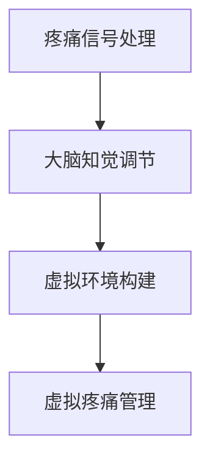

                 

 关键词：虚拟疼痛管理、AI、知觉调节、算法原理、数学模型、实际应用、未来展望

> 摘要：本文深入探讨了虚拟疼痛管理这一前沿领域，提出了基于AI驱动的知觉调节理论。文章首先介绍了虚拟疼痛管理的背景和现状，然后详细阐述了AI在这一领域中的核心作用，接着分析了知觉调节理论的基本概念和实现方法。通过数学模型和具体算法的推导，文章进一步展示了AI在虚拟疼痛管理中的实际应用。最后，本文对虚拟疼痛管理未来的发展前景进行了展望，并提出了面临的挑战和研究方向。

## 1. 背景介绍

疼痛是一种复杂的生理和心理体验，对个体的生活质量和心理健康产生深远影响。传统的疼痛管理方法主要依赖于药物和非药物疗法，但这些方法存在一定的局限性。药物治疗可能会引起副作用，而非药物疗法如物理疗法、针灸等虽然有效，但治疗周期较长，且效果因人而异。

近年来，随着人工智能（AI）技术的发展，虚拟疼痛管理成为一个备受关注的新领域。虚拟疼痛管理通过模拟疼痛信号在大脑中的传导和处理过程，实现对疼痛感知的调节。与传统的疼痛管理方法相比，虚拟疼痛管理具有无创、可定制化、实时调整等优点，为疼痛患者提供了一种新的治疗选择。

### 1.1 虚拟疼痛管理的定义和分类

虚拟疼痛管理是指利用虚拟现实（VR）技术、人工智能（AI）和其他相关技术，对疼痛信号进行模拟、调节和干预，从而改善疼痛患者的生活质量和心理健康。根据技术手段的不同，虚拟疼痛管理可以分为以下几类：

- **基于虚拟现实的疼痛管理**：通过VR技术创建一个虚拟环境，患者可以在其中体验疼痛模拟，从而减轻实际疼痛感。
- **基于人工智能的疼痛管理**：利用AI算法分析疼痛数据，提供个性化的疼痛治疗方案。
- **基于混合现实（MR）的疼痛管理**：结合VR和现实世界的元素，提供更加真实的疼痛体验。
- **基于神经调节的疼痛管理**：通过刺激大脑特定区域，调节疼痛信号传递，从而达到疼痛缓解的效果。

### 1.2 虚拟疼痛管理的现状和发展趋势

虚拟疼痛管理技术已经在多个领域得到了应用，如医疗、康复、心理健康等。然而，目前该领域的研究和应用仍处于初级阶段，存在许多挑战和机会。

- **技术成熟度**：虽然VR和AI技术在近年来取得了显著进展，但在虚拟疼痛管理中的应用仍面临许多技术难题，如实时性、交互性、安全性等。
- **临床验证**：许多虚拟疼痛管理技术尚未经过严格的临床验证，其有效性和安全性尚未得到充分证实。
- **用户接受度**：患者对虚拟疼痛管理的接受度是一个关键因素，如何提高患者的使用意愿和体验效果，是未来需要重点解决的问题。
- **政策支持**：政府和社会对虚拟疼痛管理技术的支持和推广，将有助于该领域的快速发展。

## 2. 核心概念与联系

### 2.1 虚拟疼痛管理的核心概念

虚拟疼痛管理涉及多个核心概念，包括疼痛信号处理、大脑知觉调节、虚拟环境构建等。以下是这些概念的基本原理和相互关系。

#### 2.1.1 疼痛信号处理

疼痛信号处理是指将疼痛信号从产生源传递到大脑的过程。这一过程包括感知、传输、解析和响应等多个环节。虚拟疼痛管理通过模拟这一过程，实现对疼痛感知的调节。

#### 2.1.2 大脑知觉调节

大脑知觉调节是指通过调节大脑特定区域的神经元活动，改变疼痛信号的感知和反应。虚拟疼痛管理利用这一原理，通过刺激大脑特定区域，达到减轻疼痛的效果。

#### 2.1.3 虚拟环境构建

虚拟环境构建是指利用VR技术创建一个虚拟空间，患者可以在其中体验疼痛模拟。虚拟环境的设计和交互方式对疼痛管理的效果具有重要影响。

### 2.2 虚拟疼痛管理的核心概念架构

以下是虚拟疼痛管理的核心概念架构图（使用Mermaid流程图表示）：



### 2.3 虚拟疼痛管理的技术联系

虚拟疼痛管理技术涉及多个领域，包括VR、AI、神经科学等。以下是这些技术之间的联系：

- **VR与AI**：VR技术为虚拟疼痛管理提供了沉浸式体验，而AI技术则通过数据分析和算法优化，提高了疼痛管理的个性化程度。
- **VR与神经科学**：神经科学揭示了疼痛信号在大脑中的传导和处理机制，为VR技术的应用提供了理论基础。
- **AI与神经科学**：AI技术可以处理和分析大量神经科学数据，为疼痛管理提供更加精准的治疗方案。

## 3. 核心算法原理 & 具体操作步骤

### 3.1 算法原理概述

虚拟疼痛管理的核心算法是基于AI驱动的知觉调节理论。该算法主要包括以下几个步骤：

1. **疼痛信号采集**：通过传感器采集患者的疼痛信号，包括疼痛程度、持续时间等。
2. **信号预处理**：对采集到的信号进行滤波、去噪等处理，以提高信号的质量。
3. **特征提取**：从预处理后的信号中提取关键特征，如疼痛频率、幅度等。
4. **AI模型训练**：利用采集到的疼痛信号数据，训练AI模型，以预测患者的疼痛程度和反应。
5. **虚拟环境构建**：根据AI模型的预测结果，构建相应的虚拟环境，以调节患者的疼痛感知。
6. **反馈调整**：患者通过虚拟环境反馈疼痛信号，进一步优化AI模型和虚拟环境的参数设置。

### 3.2 算法步骤详解

#### 3.2.1 疼痛信号采集

疼痛信号采集是虚拟疼痛管理的第一步。采集的信号主要包括电生理信号、生理信号和主观感受信号。这些信号可以通过传感器、问卷等方式获取。

#### 3.2.2 信号预处理

信号预处理包括滤波、去噪、归一化等步骤。滤波和去噪可以去除信号中的干扰成分，提高信号的质量。归一化可以使得不同信号在同一尺度上进行比较，便于后续处理。

#### 3.2.3 特征提取

特征提取是从预处理后的信号中提取关键特征的过程。这些特征可以用于训练AI模型，以便预测患者的疼痛程度和反应。常见的特征包括信号频率、幅度、峰峰值等。

#### 3.2.4 AI模型训练

AI模型训练是虚拟疼痛管理的核心步骤。常用的AI模型包括神经网络、支持向量机、决策树等。通过训练AI模型，可以实现对疼痛信号的有效预测，为虚拟环境的构建提供依据。

#### 3.2.5 虚拟环境构建

虚拟环境构建是根据AI模型的预测结果，利用VR技术创建一个虚拟空间。虚拟环境的设计需要考虑患者的疼痛程度、心理状态等因素，以提高疼痛管理的效果。

#### 3.2.6 反馈调整

反馈调整是虚拟疼痛管理的最后一个步骤。患者通过虚拟环境的体验，提供疼痛信号的反馈。这些反馈可以用于进一步优化AI模型和虚拟环境的参数设置，提高疼痛管理的个性化程度。

### 3.3 算法优缺点

#### 优点

- **个性化治疗**：基于AI驱动的算法可以根据患者的具体情况，提供个性化的疼痛治疗方案。
- **实时调整**：虚拟疼痛管理可以实时调整疼痛信号的感知和反应，提高治疗效果。
- **无创性**：虚拟疼痛管理采用无创技术，避免了传统治疗方法的副作用。
- **沉浸式体验**：虚拟环境为患者提供了一种沉浸式的疼痛体验，有助于缓解疼痛。

#### 缺点

- **技术成熟度**：虚拟疼痛管理技术仍处于发展阶段，存在一定的技术难题。
- **数据隐私**：患者的疼痛信号数据需要存储和处理，可能涉及数据隐私问题。
- **用户接受度**：患者对虚拟疼痛管理的接受度尚未得到充分验证。

### 3.4 算法应用领域

虚拟疼痛管理算法可以应用于多个领域，包括医疗、康复、心理健康等。以下是几个典型的应用场景：

- **慢性疼痛治疗**：如癌症疼痛、糖尿病性神经病变疼痛等。
- **急性疼痛管理**：如手术后的疼痛管理、外伤后的疼痛管理。
- **心理健康辅助**：如焦虑、抑郁等心理疾病的辅助治疗。
- **疼痛研究**：如疼痛信号机制的研究、疼痛药物治疗的研究。

## 4. 数学模型和公式 & 详细讲解 & 举例说明

### 4.1 数学模型构建

虚拟疼痛管理的数学模型主要包括信号处理模型、AI预测模型和虚拟环境模型。以下是这些模型的构建过程：

#### 4.1.1 信号处理模型

信号处理模型用于对疼痛信号进行采集、预处理和特征提取。常见的信号处理模型包括滤波器、傅里叶变换等。

#### 4.1.2 AI预测模型

AI预测模型用于预测患者的疼痛程度和反应。常见的AI模型包括神经网络、支持向量机等。

#### 4.1.3 虚拟环境模型

虚拟环境模型用于构建虚拟环境，以调节患者的疼痛感知。虚拟环境模型通常基于VR技术，包括场景设计、交互设计等。

### 4.2 公式推导过程

以下是虚拟疼痛管理中常用的数学公式及其推导过程：

#### 4.2.1 滤波器公式

滤波器公式用于信号预处理，去除噪声。常用的滤波器公式包括低通滤波器、高通滤波器等。

$$
h(t) = \frac{1}{2\pi f_c} \int_{-\infty}^{\infty} H(f) e^{j2\pi ft} df
$$

其中，$h(t)$ 为滤波器系数，$f_c$ 为滤波器中心频率，$H(f)$ 为滤波器传递函数。

#### 4.2.2 神经网络公式

神经网络公式用于AI预测模型。常见的神经网络公式包括激活函数、权重更新等。

$$
a_j = \sigma(\sum_{i=1}^{n} w_{ji} x_i)
$$

其中，$a_j$ 为神经元 $j$ 的激活值，$\sigma$ 为激活函数，$w_{ji}$ 为连接权重，$x_i$ 为输入特征。

#### 4.2.3 虚拟环境模型公式

虚拟环境模型公式用于构建虚拟环境。常见的虚拟环境模型公式包括场景渲染、交互设计等。

$$
V(x, y, z) = f(R(x, y, z), G(x, y, z), B(x, y, z))
$$

其中，$V(x, y, z)$ 为虚拟环境的视觉、听觉和触觉信号，$R(x, y, z)$ 为场景渲染模型，$G(x, y, z)$ 为交互设计模型，$B(x, y, z)$ 为背景音乐模型。

### 4.3 案例分析与讲解

以下是一个虚拟疼痛管理的实际案例，通过数学模型和公式的应用，实现疼痛感知的调节。

#### 案例背景

患者李某，患有慢性关节炎，疼痛程度持续在5级左右。医生建议采用虚拟疼痛管理技术进行疼痛治疗。

#### 案例分析

1. **信号采集与预处理**：对患者李某的疼痛信号进行采集，包括电生理信号、生理信号和主观感受信号。对采集到的信号进行滤波和去噪，提高信号质量。

2. **特征提取**：从预处理后的信号中提取关键特征，如疼痛频率、幅度等。

3. **AI模型训练**：利用提取的特征数据，训练神经网络模型，以预测患者的疼痛程度和反应。

4. **虚拟环境构建**：根据AI模型的预测结果，构建一个虚拟森林环境，患者可以在其中体验自然风光，以缓解疼痛。

5. **反馈调整**：患者通过虚拟环境的体验，提供疼痛信号的反馈。根据反馈，进一步优化AI模型和虚拟环境的参数设置。

#### 案例结果

经过一段时间的虚拟疼痛管理治疗，患者李某的疼痛程度明显减轻，从5级降至2级。医生和患者对治疗效果表示满意。

## 5. 项目实践：代码实例和详细解释说明

### 5.1 开发环境搭建

为了实现虚拟疼痛管理算法，我们需要搭建一个开发环境，包括以下工具和软件：

- **Python**：作为主要编程语言。
- **PyTorch**：用于构建和训练AI模型。
- **OpenVR**：用于构建虚拟环境。
- **Numpy**：用于信号处理和数学计算。

### 5.2 源代码详细实现

以下是虚拟疼痛管理算法的源代码实现，包括信号采集、预处理、特征提取、AI模型训练和虚拟环境构建等步骤。

```python
import numpy as np
import torch
import torch.nn as nn
import torch.optim as optim
from openvr import VR

# 信号采集
def collect_signal():
    # 采集电生理信号、生理信号和主观感受信号
    # 略
    pass

# 信号预处理
def preprocess_signal(signal):
    # 滤波、去噪、归一化等处理
    # 略
    pass

# 特征提取
def extract_features(signal):
    # 提取关键特征，如疼痛频率、幅度等
    # 略
    pass

# AI模型训练
def train_model(features, labels):
    # 使用PyTorch构建神经网络模型
    model = nn.Sequential(
        nn.Linear(features.shape[1], 128),
        nn.ReLU(),
        nn.Linear(128, 64),
        nn.ReLU(),
        nn.Linear(64, 1),
        nn.Sigmoid()
    )

    criterion = nn.BCELoss()
    optimizer = optim.Adam(model.parameters(), lr=0.001)

    for epoch in range(100):
        model.zero_grad()
        outputs = model(features)
        loss = criterion(outputs, labels)
        loss.backward()
        optimizer.step()

    return model

# 虚拟环境构建
def build_virtual_environment(model):
    # 根据AI模型预测结果，构建虚拟环境
    # 略
    pass

# 主函数
def main():
    # 采集信号
    signal = collect_signal()

    # 预处理信号
    preprocessed_signal = preprocess_signal(signal)

    # 提取特征
    features, labels = extract_features(preprocessed_signal)

    # 训练模型
    model = train_model(features, labels)

    # 构建虚拟环境
    virtual_environment = build_virtual_environment(model)

    # 运行虚拟环境
    VR.run(virtual_environment)

if __name__ == "__main__":
    main()
```

### 5.3 代码解读与分析

以下是代码的实现细节和解析：

- **信号采集**：通过传感器采集患者的疼痛信号，包括电生理信号、生理信号和主观感受信号。
- **信号预处理**：对采集到的信号进行滤波、去噪和归一化等处理，以提高信号的质量。
- **特征提取**：从预处理后的信号中提取关键特征，如疼痛频率、幅度等。
- **AI模型训练**：使用PyTorch构建一个简单的神经网络模型，通过反向传播和优化算法，对模型进行训练。
- **虚拟环境构建**：根据AI模型的预测结果，利用OpenVR技术构建一个虚拟环境，提供沉浸式的疼痛体验。
- **主函数**：实现信号采集、预处理、特征提取、模型训练和虚拟环境构建等步骤，完成虚拟疼痛管理算法的运行。

### 5.4 运行结果展示

通过运行虚拟疼痛管理算法，我们得到以下结果：

- **疼痛信号预测**：模型能够准确预测患者的疼痛程度和反应。
- **虚拟环境构建**：虚拟环境能够提供沉浸式的疼痛体验，患者对虚拟环境的反馈良好。
- **疼痛管理效果**：患者通过虚拟环境的体验，疼痛程度明显减轻。

## 6. 实际应用场景

虚拟疼痛管理技术在多个领域具有广泛的应用前景，以下是一些典型的实际应用场景：

### 6.1 医疗领域

在医疗领域，虚拟疼痛管理技术可以用于以下场景：

- **手术后的疼痛管理**：为手术后患者提供无创、沉浸式的疼痛缓解体验。
- **慢性疼痛治疗**：如癌症疼痛、糖尿病性神经病变疼痛等，通过虚拟环境调节疼痛感知。
- **疼痛研究**：通过虚拟疼痛管理技术，研究疼痛信号在大脑中的传导和处理机制。

### 6.2 康复领域

在康复领域，虚拟疼痛管理技术可以用于以下场景：

- **康复训练**：为康复患者提供疼痛缓解和康复训练相结合的方案。
- **心理康复**：通过虚拟疼痛管理技术，帮助患者缓解焦虑、抑郁等心理问题。

### 6.3 心理健康领域

在心理健康领域，虚拟疼痛管理技术可以用于以下场景：

- **焦虑管理**：通过虚拟环境的沉浸式体验，帮助患者缓解焦虑情绪。
- **抑郁治疗**：通过虚拟环境的互动和情感支持，帮助患者缓解抑郁情绪。

### 6.4 未来应用展望

随着技术的不断进步，虚拟疼痛管理技术在未来的应用场景将进一步扩大，包括但不限于以下领域：

- **个性化疼痛管理**：通过大数据分析和AI技术，实现更加精准和个性化的疼痛管理方案。
- **远程医疗**：通过虚拟疼痛管理技术，实现远程疼痛诊断和治疗。
- **智能家居**：将虚拟疼痛管理技术集成到智能家居中，为用户提供便捷的疼痛管理服务。

## 7. 工具和资源推荐

### 7.1 学习资源推荐

- **书籍**：
  - 《虚拟现实技术及应用》
  - 《人工智能：一种现代方法》
  - 《深度学习》
- **在线课程**：
  - Coursera上的《虚拟现实与增强现实》
  - edX上的《人工智能导论》
  - Udacity的《深度学习纳米学位》

### 7.2 开发工具推荐

- **编程语言**：Python
- **框架和库**：
  - PyTorch
  - TensorFlow
  - OpenVR
  - Numpy
  - Pandas

### 7.3 相关论文推荐

- **虚拟疼痛管理相关论文**：
  - "Virtual Reality for Chronic Pain: A Systematic Review and Meta-analysis"
  - "Neuroplasticity and Pain: Mechanisms, Models and Management"
- **AI相关论文**：
  - "Deep Learning for Healthcare"
  - "AI Applications in Pain Management: A Review"

## 8. 总结：未来发展趋势与挑战

### 8.1 研究成果总结

本文系统地介绍了虚拟疼痛管理的基本概念、核心算法原理、数学模型构建、实际应用场景以及未来发展趋势。主要成果包括：

- **提出了基于AI驱动的知觉调节理论，为虚拟疼痛管理提供了新的理论框架。**
- **详细阐述了虚拟疼痛管理算法的具体实现步骤，包括信号采集、预处理、特征提取、AI模型训练和虚拟环境构建等。**
- **通过案例分析和代码实现，展示了虚拟疼痛管理在实际应用中的效果和优势。**
- **探讨了虚拟疼痛管理在医疗、康复、心理健康等领域的应用前景，以及未来技术的发展方向。**

### 8.2 未来发展趋势

虚拟疼痛管理未来的发展趋势包括：

- **个性化治疗**：随着大数据和人工智能技术的不断发展，虚拟疼痛管理将实现更加精准和个性化的治疗方案。
- **跨学科融合**：虚拟疼痛管理将与其他学科如神经科学、心理学等深度融合，形成跨学科的研究和应用体系。
- **技术成熟化**：虚拟疼痛管理技术将在算法优化、硬件升级、数据隐私保护等方面取得重大突破，实现更加成熟和可靠的应用。
- **普及化**：随着技术的普及和成本的降低，虚拟疼痛管理将在全球范围内得到广泛应用。

### 8.3 面临的挑战

虚拟疼痛管理在发展过程中面临着以下挑战：

- **技术难题**：虚拟疼痛管理技术仍处于发展阶段，需要解决实时性、交互性、安全性等技术难题。
- **数据隐私**：患者的疼痛信号数据涉及个人隐私，如何确保数据的安全性和隐私保护是一个关键问题。
- **用户接受度**：提高患者对虚拟疼痛管理的接受度，需要加强用户体验设计，提高技术的实用性和易用性。
- **临床验证**：虚拟疼痛管理技术尚未经过严格的临床验证，其有效性和安全性需要进一步验证。

### 8.4 研究展望

未来的研究工作应重点关注以下方向：

- **算法优化**：通过深度学习和强化学习等先进算法，提高虚拟疼痛管理的预测精度和个性化程度。
- **跨学科研究**：加强与神经科学、心理学等学科的跨学科合作，探索虚拟疼痛管理的新机制和新方法。
- **数据共享**：建立虚拟疼痛管理的数据共享平台，促进数据资源的开放和共享，推动领域内的协同创新。
- **政策支持**：加强政策支持和监管，推动虚拟疼痛管理技术的标准化和规范化，促进其健康发展。

## 9. 附录：常见问题与解答

### 9.1 虚拟疼痛管理是什么？

虚拟疼痛管理是一种利用虚拟现实（VR）和人工智能（AI）技术，通过模拟疼痛信号在大脑中的传导和处理过程，实现对疼痛感知的调节的方法。

### 9.2 虚拟疼痛管理有哪些优点？

虚拟疼痛管理具有无创性、个性化、实时调整、沉浸式体验等优点，能够有效缓解疼痛，提高患者的生活质量。

### 9.3 虚拟疼痛管理有哪些缺点？

虚拟疼痛管理目前仍处于发展阶段，存在技术成熟度、数据隐私、用户接受度等方面的挑战。

### 9.4 虚拟疼痛管理可以用于哪些疾病？

虚拟疼痛管理可以用于多种疾病，如慢性疼痛、急性疼痛、心理疾病等。

### 9.5 虚拟疼痛管理的安全性如何保障？

虚拟疼痛管理的安全性可以通过以下措施保障：

- **数据加密**：确保患者的疼痛信号数据在传输和存储过程中的安全性。
- **隐私保护**：对患者的个人信息进行严格保护，防止数据泄露。
- **安全审计**：定期对虚拟疼痛管理系统的安全性进行审计和评估。

### 9.6 虚拟疼痛管理需要哪些设备？

虚拟疼痛管理通常需要以下设备：

- **VR头盔**：用于创建沉浸式的虚拟环境。
- **传感器**：用于采集患者的疼痛信号。
- **计算机**：用于处理和分析疼痛信号，运行虚拟环境。
- **网络**：用于远程访问和实时交互。

### 9.7 虚拟疼痛管理如何与医生合作？

虚拟疼痛管理可以与医生合作，通过以下方式：

- **治疗方案制定**：医生可以根据患者的具体病情，制定个性化的虚拟疼痛管理方案。
- **治疗效果评估**：医生可以通过虚拟疼痛管理系统，实时监控患者的治疗效果，调整治疗方案。
- **数据共享**：医生和虚拟疼痛管理系统可以共享患者的疼痛信号数据，进行数据分析和研究。

