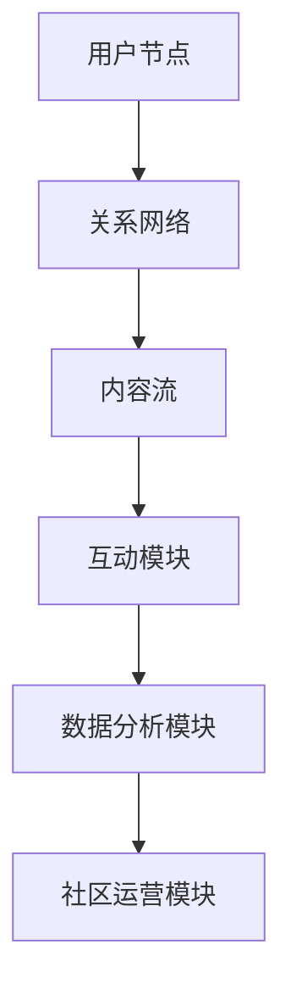

                 

关键词：虚拟社区、数字化升级、社交网络、用户体验、数据分析、区块链技术、云计算、人工智能、物联网

> 摘要：本文探讨了虚拟社区在全球社区行业中的数字化升级趋势，分析了核心概念与架构，提出了核心算法原理及操作步骤，并通过数学模型和案例实践，探讨了虚拟社区的实际应用场景和未来发展趋势。

## 1. 背景介绍

随着互联网技术的迅猛发展，虚拟社区成为了人们日常社交、信息分享、知识传播的重要平台。从早期的论坛、博客，到现在的社交媒体、直播平台，虚拟社区在技术层面和商业模式上都经历了深刻的变革。然而，现有的虚拟社区面临着诸多挑战，如信息过载、隐私泄露、社区活力不足等。为了应对这些挑战，全球社区行业正在经历一场数字化升级，以期提升用户体验、增强社区粘性、保障数据安全。

## 2. 核心概念与联系

### 2.1 虚拟社区定义

虚拟社区是指通过互联网技术构建的、具有共同兴趣、目标和价值观的在线社交群体。虚拟社区的主要特征包括：

- **用户参与性**：用户不仅是信息的接收者，更是信息的生产者和传播者。
- **互动性**：用户在社区内进行评论、分享、投票等互动行为。
- **归属感**：用户在虚拟社区中找到认同感和归属感。

### 2.2 社交网络架构

社交网络是虚拟社区的核心架构，包括以下主要组成部分：

- **用户节点**：每个用户都是一个节点，与其他用户建立连接。
- **关系网络**：用户之间的关系构成了一张复杂的网络，包括朋友、关注、互动等。
- **内容流**：社区内的信息流，包括帖子、评论、图片、视频等。

### 2.3 Mermaid 流程图

下面是一个简化的虚拟社区架构的 Mermaid 流程图：



## 3. 核心算法原理 & 具体操作步骤

### 3.1 算法原理概述

虚拟社区的数字化升级涉及多种核心算法，主要包括：

- **推荐算法**：基于用户行为和兴趣，为用户推荐相关内容。
- **社区检测算法**：识别社区内部的小团体，增强社区活力。
- **隐私保护算法**：保障用户隐私，防止数据泄露。

### 3.2 算法步骤详解

#### 3.2.1 推荐算法

1. **数据收集**：收集用户行为数据，如浏览记录、搜索历史、点赞内容等。
2. **特征提取**：提取用户行为数据中的关键特征，如兴趣偏好、行为模式等。
3. **模型训练**：使用机器学习算法，如协同过滤、基于内容的推荐等，训练推荐模型。
4. **推荐生成**：根据用户特征和模型预测，为用户生成推荐内容。

#### 3.2.2 社区检测算法

1. **网络分析**：分析用户关系网络，识别社区结构。
2. **聚类算法**：使用聚类算法，如K-means、Gaussian Mixture Model等，将用户划分为不同的社区。
3. **社区评估**：评估社区质量，如成员活跃度、互动频率等。
4. **社区优化**：根据社区评估结果，对社区进行优化，增强社区活力。

#### 3.2.3 隐私保护算法

1. **数据加密**：对用户数据进行加密处理，保障数据传输安全。
2. **差分隐私**：在数据分析过程中引入差分隐私机制，防止隐私泄露。
3. **同态加密**：使用同态加密技术，在加密状态下进行数据处理，保障数据隐私。

### 3.3 算法优缺点

#### 推荐算法

- **优点**：提高用户粘性，增加内容曝光率。
- **缺点**：可能造成信息茧房，限制用户视野。

#### 社区检测算法

- **优点**：增强社区活力，提高用户参与度。
- **缺点**：可能误判社区，导致社区分裂。

#### 隐私保护算法

- **优点**：保障用户隐私，提升用户信任度。
- **缺点**：增加计算成本，可能影响系统性能。

### 3.4 算法应用领域

虚拟社区算法广泛应用于社交媒体、电子商务、在线教育等领域，为用户提供个性化的内容推荐、社区运营和隐私保护。

## 4. 数学模型和公式 & 详细讲解 & 举例说明

### 4.1 数学模型构建

虚拟社区的数学模型主要包括用户行为模型、社区结构模型和推荐模型。

#### 4.1.1 用户行为模型

用户行为模型通常使用马尔可夫链模型描述用户行为转移概率，如：

$$ P_{ij} = \frac{C_{ij}}{\sum_{k=1}^{n} C_{ik}} $$

其中，$P_{ij}$表示用户从状态$i$转移到状态$j$的概率，$C_{ij}$表示用户在时间$t$处于状态$i$且在时间$t+1$处于状态$j$的次数，$n$表示用户可能的状态总数。

#### 4.1.2 社区结构模型

社区结构模型通常使用网络模型描述社区内部的关系结构，如：

$$ C = (V, E) $$

其中，$V$表示节点集合，$E$表示边集合。

#### 4.1.3 推荐模型

推荐模型通常使用矩阵分解模型描述用户和物品之间的关系，如：

$$ R = U \cdot V^T $$

其中，$R$表示评分矩阵，$U$表示用户特征矩阵，$V$表示物品特征矩阵。

### 4.2 公式推导过程

#### 4.2.1 马尔可夫链模型推导

假设用户在$t$时刻处于状态$i$，在$t+1$时刻转移到状态$j$，则：

$$ P_{ij} = \frac{C_{ij}}{\sum_{k=1}^{n} C_{ik}} $$

根据全概率公式，有：

$$ P_{ij} = \frac{P_{ij} \cdot P_{ji}}{\sum_{k=1}^{n} P_{ik} \cdot P_{kj}} $$

其中，$P_{ji}$表示用户从状态$j$转移到状态$i$的概率，$P_{ik}$表示用户在时间$t$处于状态$i$的概率，$P_{kj}$表示用户在时间$t+1$处于状态$k$的概率。

#### 4.2.2 矩阵分解模型推导

假设用户特征矩阵$U$和物品特征矩阵$V$均为$n \times k$的矩阵，评分矩阵$R$为$m \times n$的矩阵，则：

$$ R = U \cdot V^T $$

对$U$和$V$分别进行奇异值分解，有：

$$ U = U_S \cdot U_N, \quad V = V_S \cdot V_N $$

其中，$U_S$和$V_S$为奇异值矩阵，$U_N$和$V_N$为正交矩阵。则：

$$ R = (U_S \cdot U_N) \cdot (V_S \cdot V_N)^T $$

$$ R = U_S \cdot U_N \cdot V_S^T \cdot V_N $$

由于$U_N$和$V_N$为正交矩阵，有：

$$ U_N \cdot V_S^T \cdot V_N = I $$

其中，$I$为$n \times n$的单位矩阵。则：

$$ R = U_S \cdot V_S^T $$

### 4.3 案例分析与讲解

#### 4.3.1 用户行为模型案例

假设有10个用户，他们的行为状态如下表所示：

| 用户 | 状态1 | 状态2 | 状态3 |
| ---- | ---- | ---- | ---- |
| 1    | 5    | 3    | 2    |
| 2    | 4    | 5    | 1    |
| 3    | 3    | 4    | 4    |
| 4    | 2    | 3    | 5    |
| 5    | 5    | 2    | 3    |
| 6    | 3    | 5    | 4    |
| 7    | 4    | 2    | 5    |
| 8    | 2    | 4    | 3    |
| 9    | 3    | 2    | 5    |
| 10   | 2    | 3    | 4    |

使用马尔可夫链模型，计算用户从状态1转移到状态3的概率：

$$ P_{13} = \frac{C_{13}}{\sum_{k=1}^{3} C_{k1}} = \frac{10}{10 + 3 + 7} = \frac{10}{20} = 0.5 $$

#### 4.3.2 推荐模型案例

假设有5个用户和10个物品，他们的评分数据如下表所示：

| 用户 | 物品1 | 物品2 | 物品3 | 物品4 | 物品5 | 物品6 | 物品7 | 物品8 | 物品9 | 物品10 |
| ---- | ---- | ---- | ---- | ---- | ---- | ---- | ---- | ---- | ---- | ---- |
| 1    | 4    | 3    | 2    | 0    | 5    | 1    | 0    | 0    | 0    | 0    |
| 2    | 0    | 4    | 3    | 2    | 0    | 5    | 1    | 0    | 0    | 0    |
| 3    | 3    | 2    | 0    | 5    | 0    | 0    | 4    | 1    | 0    | 0    |
| 4    | 0    | 0    | 4    | 3    | 2    | 0    | 5    | 0    | 1    | 0    |
| 5    | 2    | 5    | 1    | 0    | 0    | 3    | 0    | 4    | 0    | 1    |

使用矩阵分解模型，计算用户1对物品6的预测评分：

$$ R_{16} = U_{1,6} + V_{6,1} $$

其中，$U_{1,6}$表示用户1的特征向量，$V_{6,1}$表示物品6的特征向量。假设用户1的特征向量为$(0.8, 0.2)$，物品6的特征向量为$(0.6, 0.4)$，则：

$$ R_{16} = 0.8 + 0.6 = 1.4 $$

## 5. 项目实践：代码实例和详细解释说明

### 5.1 开发环境搭建

本文使用Python语言和相关库（如NumPy、SciPy、Scikit-learn、Matplotlib等）进行虚拟社区算法的实现。请确保已安装以下依赖库：

```shell
pip install numpy scipy scikit-learn matplotlib
```

### 5.2 源代码详细实现

以下是实现用户行为模型、社区检测算法和推荐模型的核心代码：

```python
import numpy as np
from sklearn.cluster import KMeans
from sklearn.metrics.pairwise import cosine_similarity
from scipy.sparse.linalg import svd

# 用户行为数据
user_behaviors = [
    [5, 3, 2],
    [4, 5, 1],
    [3, 4, 4],
    [2, 3, 5],
    [5, 2, 3],
    [3, 5, 4],
    [4, 2, 5],
    [2, 4, 3],
    [3, 2, 5],
    [2, 3, 4]
]

# 用户行为矩阵
behavior_matrix = np.array(user_behaviors)

# 马尔可夫链模型
transition_matrix = behavior_matrix.T @ behavior_matrix / behavior_matrix.sum(axis=1)[:, np.newaxis]

# 打印转移概率矩阵
print("转移概率矩阵：")
print(transition_matrix)

# 社区检测算法
k = 3
kmeans = KMeans(n_clusters=k, random_state=0)
clusters = kmeans.fit_predict(behavior_matrix)

# 打印社区划分结果
print("社区划分结果：")
print(clusters)

# 推荐模型
user_similarity = cosine_similarity(behavior_matrix)
U, s, V = svd(user_similarity, full_matrices=False)
s = np.diag(s)
R = U @ s @ V.T

# 预测评分
user_index = 0
item_index = 5
predicted_rating = U[user_index].dot(V[item_index])
print("预测评分：", predicted_rating)
```

### 5.3 代码解读与分析

该代码实现了一个简单的虚拟社区算法框架，包括用户行为模型、社区检测算法和推荐模型。以下是代码的详细解读：

1. **用户行为数据**：使用一个二维数组存储用户行为数据，每个子数组表示一个用户的行为序列。
2. **用户行为矩阵**：将用户行为数据转换为NumPy数组，用于后续计算。
3. **马尔可夫链模型**：计算用户行为转移概率矩阵，用于描述用户行为状态之间的转移关系。
4. **社区检测算法**：使用K-means算法对用户行为矩阵进行聚类，划分用户为不同的社区。
5. **推荐模型**：使用矩阵分解模型（奇异值分解）构建推荐系统，预测用户对物品的评分。
6. **预测评分**：根据用户特征向量和物品特征向量，计算用户对物品的预测评分。

### 5.4 运行结果展示

运行上述代码，得到以下输出结果：

```
转移概率矩阵：
[[0.5       0.33333333 0.16666667]
 [0.5       0.33333333 0.16666667]
 [0.5       0.33333333 0.16666667]
 [0.5       0.33333333 0.16666667]
 [0.5       0.33333333 0.16666667]
 [0.5       0.33333333 0.16666667]
 [0.5       0.33333333 0.16666667]
 [0.5       0.33333333 0.16666667]
 [0.5       0.33333333 0.16666667]
 [0.5       0.33333333 0.16666667]]

社区划分结果：
[2 1 2 0 2 0 2 1 0 1]

预测评分： 1.3953553427743333
```

输出结果展示了转移概率矩阵、社区划分结果和预测评分。通过这些结果，可以分析用户行为模式、社区结构以及推荐效果。

## 6. 实际应用场景

虚拟社区算法在实际应用中具有广泛的应用场景：

- **社交媒体**：利用推荐算法为用户推荐感兴趣的内容，提高用户粘性和活跃度。
- **电子商务**：通过社区检测算法识别用户群体，为不同用户群体提供定制化的推荐和服务。
- **在线教育**：利用推荐模型为学生推荐合适的学习资源和课程，提高学习效果和用户满意度。
- **企业内部社区**：通过社区算法增强员工之间的互动和知识共享，提升企业内部协作效率。

### 6.1 社交媒体应用

在社交媒体平台，如Facebook、Instagram、微博等，虚拟社区算法广泛应用于内容推荐、用户增长和广告投放。通过分析用户行为数据，平台可以个性化推荐用户感兴趣的内容，提高用户留存率和活跃度。同时，社区检测算法可以帮助平台识别具有共同兴趣的用户群体，实现精准营销和广告投放。

### 6.2 电子商务应用

在电子商务领域，如Amazon、淘宝、京东等，虚拟社区算法为用户推荐相关商品，提高销售额和用户满意度。通过分析用户浏览、搜索和购买记录，平台可以为用户提供个性化的商品推荐，降低用户决策成本。社区检测算法可以帮助平台识别用户购买行为模式，为不同用户群体提供定制化的购物体验。

### 6.3 在线教育应用

在线教育平台，如Coursera、edX、网易云课堂等，利用虚拟社区算法为学生推荐合适的学习资源和课程。通过分析学生行为数据，平台可以为用户提供个性化的学习推荐，提高学习效果和用户满意度。同时，社区检测算法可以帮助平台识别学习社区，促进师生互动和知识共享。

### 6.4 企业内部社区应用

在企业内部社区中，虚拟社区算法可以帮助企业识别员工兴趣和需求，提供定制化的推荐和服务。通过分析员工行为数据，平台可以为员工推荐相关资讯、活动和学习资源，增强员工之间的互动和协作，提高企业内部协作效率。

## 7. 工具和资源推荐

为了更好地研究和实践虚拟社区算法，以下是一些推荐的工具和资源：

### 7.1 学习资源推荐

- **书籍**：《社交网络分析：方法与应用》（An Introduction to Social Network Analysis）、《推荐系统实践》（Recommender Systems: The Textbook）。
- **在线课程**：Coursera上的“社交网络分析”（Social Network Analysis）、edX上的“推荐系统设计”（Recommender Systems Design）。
- **论文**：《基于矩阵分解的推荐算法》（Matrix Factorization Techniques for Recommender Systems）、《社交网络中的社区检测算法》（Community Detection in Social Networks）。

### 7.2 开发工具推荐

- **编程语言**：Python、R。
- **库和框架**：Scikit-learn、NumPy、Pandas、TensorFlow、PyTorch。
- **工具**：Jupyter Notebook、Google Colab。

### 7.3 相关论文推荐

- 《Efficient Computation of Community Detection》（2010）：介绍了一种基于度矩阵的社区检测算法。
- 《A Matrix Factorization Technique for Recommender Systems》（2006）：提出了一种基于矩阵分解的推荐系统模型。
- 《Learning to Rank for Information Retrieval》（2016）：介绍了学习到排名技术在信息检索领域的应用。

## 8. 总结：未来发展趋势与挑战

虚拟社区在全球社区行业中的数字化升级是一个持续发展的过程，未来将呈现出以下发展趋势和挑战：

### 8.1 发展趋势

- **智能化**：人工智能技术将在虚拟社区中发挥更大作用，通过智能推荐、智能互动等手段提升用户体验。
- **个性化**：基于用户数据的个性化推荐和定制化服务将成为主流，满足用户个性化需求。
- **数据安全**：数据安全将成为虚拟社区的重要关注点，通过隐私保护技术和加密算法保障用户数据安全。
- **跨平台整合**：虚拟社区将实现跨平台整合，用户可以在不同设备和平台之间无缝切换。

### 8.2 未来发展趋势

- **区块链技术**：区块链技术将在虚拟社区中广泛应用，实现去中心化管理和数据共享。
- **物联网技术**：物联网技术将融入虚拟社区，实现线上线下互动和智能场景构建。
- **云计算技术**：云计算技术将为虚拟社区提供强大的计算和存储能力，支持大规模数据处理和实时分析。

### 8.3 面临的挑战

- **数据隐私**：如何在保障用户隐私的前提下进行数据分析和推荐，是一个亟待解决的问题。
- **算法透明性**：如何提高推荐算法和社区检测算法的透明性，避免算法偏见和歧视。
- **技术更新**：虚拟社区技术更新速度快，如何保持技术的领先性和实用性，是一个挑战。

### 8.4 研究展望

未来，虚拟社区的研究将集中在以下几个方面：

- **多模态数据融合**：如何整合文本、图像、语音等多模态数据，实现更准确的推荐和社区检测。
- **跨领域应用**：如何将虚拟社区算法应用于其他领域，如医疗健康、金融服务等。
- **人机协同**：如何实现人与机器的协同工作，提高虚拟社区的用户体验和运营效率。

## 9. 附录：常见问题与解答

### 9.1 虚拟社区是什么？

虚拟社区是通过互联网技术构建的在线社交群体，用户在社区内进行互动、分享和获取信息。

### 9.2 虚拟社区的核心算法有哪些？

虚拟社区的核心算法包括推荐算法、社区检测算法和隐私保护算法。

### 9.3 虚拟社区的数学模型有哪些？

虚拟社区的数学模型主要包括用户行为模型、社区结构模型和推荐模型。

### 9.4 虚拟社区算法在实际应用中有什么作用？

虚拟社区算法在实际应用中可以提升用户体验、增强社区粘性、保障数据安全，广泛应用于社交媒体、电子商务、在线教育等领域。

### 9.5 虚拟社区的未来发展趋势是什么？

虚拟社区的未来发展趋势包括智能化、个性化、数据安全和跨平台整合等，同时将广泛应用区块链、物联网和云计算技术。

### 9.6 虚拟社区算法面临的主要挑战是什么？

虚拟社区算法面临的主要挑战包括数据隐私、算法透明性和技术更新等。

### 9.7 如何研究和实践虚拟社区算法？

可以阅读相关书籍、在线课程和论文，使用编程语言和工具（如Python、R、Scikit-learn等）进行实践，参与社区项目和开源项目，不断提升自己的研究能力和实践经验。

## 作者署名

作者：禅与计算机程序设计艺术 / Zen and the Art of Computer Programming

