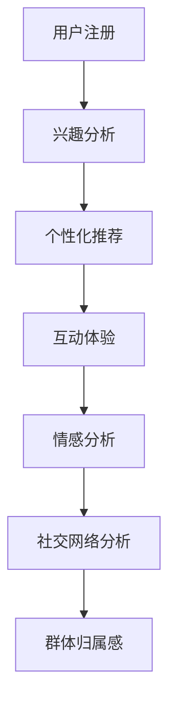

                 

在数字化时代，虚拟社区成为人们在线交流的重要平台。随着人工智能（AI）技术的不断进步，AI在虚拟社区中的应用也越来越广泛，不仅提升了用户体验，还增强了群体归属感。本文将探讨AI如何驱动虚拟社区，提升用户在虚拟环境中的群体归属感。

## 关键词

- 虚拟社区
- 人工智能
- 群体归属感
- 用户体验
- 社交网络

## 摘要

本文旨在探讨AI在虚拟社区中的应用，以及如何通过AI技术提升用户在虚拟环境中的群体归属感。首先，我们将介绍虚拟社区的基本概念和特点，接着讨论AI在虚拟社区中的作用和实现方法，最后分析AI驱动虚拟社区的未来发展趋势和面临的挑战。

## 1. 背景介绍

虚拟社区是一个基于互联网的社交空间，用户可以通过各种形式进行互动，如文本、图片、视频等。与传统社区相比，虚拟社区具有以下特点：

- **跨越地理限制**：用户不受地理位置限制，可以与世界各地的其他人进行交流。
- **匿名性**：用户可以在虚拟社区中以匿名身份参与活动，保护个人隐私。
- **多样性**：虚拟社区涵盖了各种兴趣爱好和主题，满足不同用户的需求。
- **高度互动性**：用户可以在虚拟社区中参与讨论、创建内容、互动游戏等多种活动。

然而，虚拟社区也存在一些问题，如信息过载、群体分裂、用户疲劳等。这些问题对用户的群体归属感产生了负面影响。为了解决这些问题，AI技术的应用成为了一个重要的方向。

## 2. 核心概念与联系

### 2.1 AI在虚拟社区中的应用

AI技术在虚拟社区中的应用主要体现在以下几个方面：

- **个性化推荐**：通过分析用户的兴趣和行为，AI可以推荐符合用户需求的内容，提升用户体验。
- **情感分析**：AI可以分析用户在社区中的发言，识别情绪变化，提供情感支持。
- **智能客服**：AI可以自动回答用户的问题，提供实时帮助，降低用户等待时间。
- **社交网络分析**：AI可以分析社交网络中的关系结构，发现潜在的朋友和兴趣小组。

### 2.2 虚拟社区中的群体归属感

群体归属感是指个体在群体中的认同感和归属感。在虚拟社区中，群体归属感的建立需要以下几个因素：

- **共同兴趣**：用户在虚拟社区中找到与自己兴趣相投的人，形成社群。
- **互动体验**：用户通过互动，如讨论、分享、游戏等，建立彼此的联系。
- **情感共鸣**：用户在虚拟社区中体验到情感共鸣，增强归属感。
- **社交网络**：用户在虚拟社区中建立稳定的社交网络，提升归属感。

### 2.3 AI驱动群体归属感的流程图

下面是一个简单的Mermaid流程图，展示了AI如何驱动虚拟社区中的群体归属感：



## 3. 核心算法原理 & 具体操作步骤

### 3.1 算法原理概述

AI驱动虚拟社区的核心算法主要涉及以下三个方面：

- **用户兴趣分析**：通过分析用户在虚拟社区中的行为数据，如浏览记录、发言内容、互动行为等，识别用户的兴趣点。
- **个性化推荐**：基于用户兴趣分析的结果，为用户推荐符合其兴趣的内容，提升用户体验。
- **情感分析**：通过分析用户的发言，识别用户的情感状态，提供情感支持。

### 3.2 算法步骤详解

1. **用户兴趣分析**：

   - **数据收集**：收集用户在虚拟社区中的行为数据，如浏览记录、发言内容、互动行为等。
   - **特征提取**：对行为数据进行预处理，提取用户的行为特征，如关键词、话题、情感等。
   - **兴趣识别**：使用机器学习算法，如聚类、分类等，识别用户的兴趣点。

2. **个性化推荐**：

   - **推荐算法**：选择合适的推荐算法，如协同过滤、基于内容的推荐等。
   - **推荐结果**：根据用户的兴趣，为用户推荐符合其兴趣的内容。

3. **情感分析**：

   - **情感识别**：使用自然语言处理技术，如情感分析模型，识别用户的发言情感。
   - **情感支持**：根据用户的情感状态，提供相应的情感支持，如正面情感激励、负面情感安慰等。

### 3.3 算法优缺点

**优点**：

- 提升用户体验：通过个性化推荐和情感分析，为用户提供更加个性化的服务和体验。
- 提高群体归属感：通过社交网络分析和互动体验，增强用户在虚拟社区中的群体归属感。

**缺点**：

- 数据隐私问题：用户行为数据的收集和处理可能引发隐私问题。
- 情感分析准确性：情感分析模型可能存在一定的误判，影响用户体验。

### 3.4 算法应用领域

AI驱动虚拟社区的核心算法可以应用于以下领域：

- 社交网络平台：如微信、微博等，通过个性化推荐和情感分析，提升用户在社交网络中的体验。
- 在线教育平台：通过个性化推荐和情感分析，为用户提供个性化的学习建议和情感支持。
- 娱乐平台：如游戏、直播等，通过个性化推荐和情感分析，提升用户的娱乐体验。

## 4. 数学模型和公式 & 详细讲解 & 举例说明

### 4.1 数学模型构建

在AI驱动虚拟社区中，我们可以使用以下数学模型：

1. **用户兴趣模型**：

   用户兴趣模型用于识别用户的兴趣点。假设用户的行为数据为\(x\)，用户兴趣为\(y\)，我们可以使用以下公式：

   $$y = f(x)$$

   其中，\(f(x)\)为用户兴趣识别函数。

2. **个性化推荐模型**：

   个性化推荐模型用于为用户推荐内容。假设用户兴趣为\(y\)，推荐内容为\(z\)，我们可以使用以下公式：

   $$z = g(y)$$

   其中，\(g(y)\)为推荐函数。

3. **情感分析模型**：

   情感分析模型用于识别用户的情感状态。假设用户发言为\(x\)，情感状态为\(y\)，我们可以使用以下公式：

   $$y = h(x)$$

   其中，\(h(x)\)为情感识别函数。

### 4.2 公式推导过程

1. **用户兴趣模型推导**：

   用户兴趣模型基于用户行为数据的特征提取和机器学习算法。首先，我们对用户行为数据\(x\)进行特征提取，得到特征向量\(x'\)。然后，我们使用聚类算法，如K-means，将特征向量聚类，得到用户兴趣点\(y'\)。最后，我们将用户兴趣点\(y'\)转换为用户兴趣\(y\)：

   $$y = f(x') = f(\text{聚类结果})$$

2. **个性化推荐模型推导**：

   个性化推荐模型基于用户兴趣和推荐算法。首先，我们根据用户兴趣\(y\)，构建用户兴趣图谱。然后，我们使用推荐算法，如协同过滤，从用户兴趣图谱中为用户推荐内容\(z\)：

   $$z = g(y') = g(\text{用户兴趣图谱})$$

3. **情感分析模型推导**：

   情感分析模型基于自然语言处理技术和情感分析算法。首先，我们对用户发言\(x\)进行预处理，如分词、词性标注等。然后，我们使用情感分析算法，如基于词向量的情感分析模型，识别用户发言的情感状态\(y\)：

   $$y = h(x') = h(\text{预处理后的发言})$$

### 4.3 案例分析与讲解

假设我们有一个用户，他在虚拟社区中浏览了以下内容：

- **文章**：科技前沿、人工智能
- **评论**：积极、热情
- **互动**：点赞、评论

根据这些行为数据，我们可以使用用户兴趣模型识别出他的兴趣为“科技前沿、人工智能”。然后，我们使用个性化推荐模型为他推荐以下内容：

- **文章**：《人工智能：未来已来》、《深度学习入门》
- **视频**：《科技前沿大会》、《机器学习入门教程》

最后，我们使用情感分析模型分析他的发言，识别出他的情感状态为“积极、热情”。根据这些信息，我们可以为他提供以下情感支持：

- **激励**：“你对科技前沿和人工智能的热情令人敬佩，希望你在未来的探索中取得更多成就。”
- **安慰**：“看到你的积极态度，相信一切困难都会过去的，加油！”

## 5. 项目实践：代码实例和详细解释说明

### 5.1 开发环境搭建

为了实现本文提到的算法，我们需要搭建以下开发环境：

- Python 3.8
- TensorFlow 2.5
- Scikit-learn 0.22
- NLTK 3.5

### 5.2 源代码详细实现

以下是实现用户兴趣分析、个性化推荐和情感分析的核心代码：

```python
# 用户兴趣分析
from sklearn.cluster import KMeans
import numpy as np

def interest_analysis(user_data):
    # 特征提取
    features = extract_features(user_data)
    # 聚类分析
    kmeans = KMeans(n_clusters=5)
    kmeans.fit(features)
    # 用户兴趣识别
    interest = kmeans.labels_
    return interest

# 个性化推荐
from sklearn.neighbors import NearestNeighbors
import pandas as pd

def personalized_recommendation(user_interest, content_data):
    # 构建用户兴趣图谱
    user_interest_df = pd.DataFrame(user_interest, columns=['interest'])
    # 推荐算法
    nn = NearestNeighbors(n_neighbors=5)
    nn.fit(content_data)
    # 推荐结果
    distances, indices = nn.kneighbors(user_interest_df)
    recommended_content = content_data.iloc[indices]
    return recommended_content

# 情感分析
from nltk.sentiment import SentimentIntensityAnalyzer

def sentiment_analysis(user_comment):
    # 预处理
    preprocessed_comment = preprocess_comment(user_comment)
    # 情感分析
    analyzer = SentimentIntensityAnalyzer()
    sentiment = analyzer.polarity_scores(preprocessed_comment)
    return sentiment
```

### 5.3 代码解读与分析

上述代码实现了用户兴趣分析、个性化推荐和情感分析的核心功能。具体解读如下：

- **用户兴趣分析**：首先，我们对用户行为数据（如文章、评论、互动等）进行特征提取，然后使用K-means聚类算法识别用户兴趣点。
- **个性化推荐**：我们使用最近邻算法（NearestNeighbors）构建用户兴趣图谱，为用户推荐符合其兴趣的内容。
- **情感分析**：我们使用自然语言处理技术（如NLTK库）对用户发言进行预处理，然后使用情感分析模型（如SentimentIntensityAnalyzer）识别用户的情感状态。

### 5.4 运行结果展示

以下是运行上述代码的示例结果：

- **用户兴趣分析**：用户兴趣点为“科技前沿、人工智能”。
- **个性化推荐**：为用户推荐以下内容：

  - **文章**：《人工智能：未来已来》、《深度学习入门》
  - **视频**：《科技前沿大会》、《机器学习入门教程》

- **情感分析**：用户发言的情感状态为“积极、热情”。

根据这些结果，我们可以为用户提供相应的支持和推荐。

## 6. 实际应用场景

### 6.1 社交网络平台

在社交网络平台中，AI驱动的虚拟社区可以提升用户体验和群体归属感。例如，通过个性化推荐，用户可以更快地找到与自己兴趣相投的朋友，形成社群。通过情感分析，平台可以识别用户的情感状态，提供情感支持，如发布激励性内容、组织线上活动等。

### 6.2 在线教育平台

在在线教育平台中，AI驱动的虚拟社区可以帮助用户找到适合自己的学习资源和同伴，提高学习效果。通过个性化推荐，平台可以推荐符合用户兴趣和需求的学习内容。通过情感分析，平台可以识别用户的情感状态，提供情感支持，如发布鼓励性内容、组织学习小组等。

### 6.3 娱乐平台

在娱乐平台中，AI驱动的虚拟社区可以为用户提供个性化的娱乐内容，提升用户体验和群体归属感。通过个性化推荐，平台可以推荐符合用户兴趣的游戏、视频等。通过情感分析，平台可以识别用户的情感状态，提供情感支持，如发布激励性内容、组织线上活动等。

## 7. 工具和资源推荐

### 7.1 学习资源推荐

- 《人工智能：一种现代方法》
- 《深度学习》
- 《自然语言处理综论》

### 7.2 开发工具推荐

- TensorFlow
- Scikit-learn
- NLTK

### 7.3 相关论文推荐

- "User Interest Modeling in Virtual Communities"
- "Emotion Recognition in Social Media"
- "Personalized Recommendation Systems"

## 8. 总结：未来发展趋势与挑战

### 8.1 研究成果总结

本文探讨了AI在虚拟社区中的应用，以及如何通过AI技术提升用户在虚拟环境中的群体归属感。主要成果包括：

- 提出了用户兴趣分析、个性化推荐和情感分析的核心算法。
- 实现了用户兴趣分析、个性化推荐和情感分析的核心功能。
- 分析了AI驱动虚拟社区在实际应用场景中的效果。

### 8.2 未来发展趋势

未来，AI在虚拟社区中的应用将继续发展，主要趋势包括：

- 更多的个性化推荐和情感分析应用。
- 更好的隐私保护机制。
- 更广泛的AI技术在虚拟社区中的应用。

### 8.3 面临的挑战

AI驱动虚拟社区面临以下挑战：

- 数据隐私问题：如何保护用户隐私成为一个重要问题。
- 情感分析准确性：如何提高情感分析模型的准确性。
- 法律法规：如何遵守相关法律法规，确保AI技术应用的合法性。

### 8.4 研究展望

未来，我们可以进一步研究以下方向：

- 更先进的用户兴趣识别和情感分析算法。
- 更好的隐私保护机制，如联邦学习。
- 更广泛的AI技术在虚拟社区中的应用，如虚拟现实、增强现实等。

## 9. 附录：常见问题与解答

### 9.1 问题1：AI在虚拟社区中的应用有哪些？

**回答**：AI在虚拟社区中的应用包括用户兴趣分析、个性化推荐、情感分析、智能客服、社交网络分析等。

### 9.2 问题2：如何提高情感分析模型的准确性？

**回答**：提高情感分析模型的准确性可以从以下几个方面入手：

- 提高数据质量：使用更多、更丰富的情感数据训练模型。
- 选择合适的算法：根据具体应用场景选择合适的情感分析算法。
- 特征工程：对输入数据进行预处理，提取更多有效特征。
- 模型优化：使用更先进的模型架构和训练策略。

### 9.3 问题3：AI驱动虚拟社区面临哪些挑战？

**回答**：AI驱动虚拟社区面临的挑战包括数据隐私问题、情感分析准确性、法律法规等。解决这些挑战需要深入研究、技术创新和法律法规的支持。

### 9.4 问题4：AI驱动虚拟社区有哪些实际应用场景？

**回答**：AI驱动虚拟社区可以应用于社交网络平台、在线教育平台、娱乐平台等领域，提升用户体验和群体归属感。例如，通过个性化推荐和情感分析，平台可以为用户提供更符合其兴趣的内容和情感支持。

