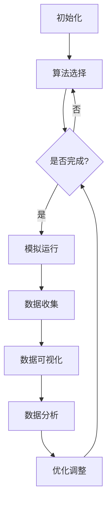

                 

关键词：虚拟进化模拟器，AI驱动，数字生态系统，实验设计，算法原理，数学模型，应用场景

> 摘要：本文深入探讨了一种名为“虚拟进化模拟器”的先进技术，该模拟器通过人工智能驱动，创建并研究数字生态系统。本文将详细介绍虚拟进化模拟器的核心概念、算法原理、数学模型构建、以及在实际项目中的应用，并对未来发展趋势和面临的挑战进行展望。

## 1. 背景介绍

随着人工智能技术的快速发展，模拟和仿生学领域迎来了新的变革。传统计算机模拟方法在面对复杂系统时，往往受到计算能力和数据规模的限制。虚拟进化模拟器（Virtual Evolution Simulator，VES）正是为了克服这些限制而诞生的一种新型模拟工具。通过结合人工智能和进化算法，VES能够在数字生态系统中进行高效、动态的模拟实验，为各种领域的研究提供强有力的支持。

本文将介绍虚拟进化模拟器的基本原理、关键算法、数学模型以及其实际应用。通过对这些内容的深入分析，希望能够为读者提供一个全面而详细的视角，理解这一技术的强大潜力和广泛应用前景。

## 2. 核心概念与联系

### 2.1. 虚拟进化模拟器的定义

虚拟进化模拟器是一种基于人工智能和进化算法的模拟工具，用于创建和操控数字生态系统。它通过模拟个体之间的相互作用、环境变化和进化过程，来研究生态系统的动态行为和演化趋势。虚拟进化模拟器的主要功能包括：

1. **生态系统建模**：构建虚拟环境，定义生物种类、行为规则和环境参数。
2. **进化过程模拟**：根据遗传算法和进化策略，模拟生物种群的演化。
3. **交互分析**：模拟生物之间的互动，如捕食、共生和竞争。
4. **数据分析**：收集和解析模拟结果，提取有价值的信息和趋势。

### 2.2. 虚拟进化模拟器的工作原理

虚拟进化模拟器的工作原理可以分为以下几个步骤：

1. **初始化**：设定模拟环境的参数，包括生物种类、数量、初始分布以及环境条件。
2. **进化算法选择**：根据研究需求选择合适的进化算法，如遗传算法、粒子群优化等。
3. **模拟运行**：运行模拟过程，记录每代生物种群的状态信息。
4. **数据分析和可视化**：对模拟结果进行分析，使用可视化工具展示关键数据。

### 2.3. 关联概念

虚拟进化模拟器与以下概念紧密相关：

- **人工智能（AI）**：提供智能化的决策支持，使模拟器能够自适应环境变化。
- **进化算法**：模拟自然进化的过程，用于优化和搜索问题解。
- **数字生态系统**：虚拟进化模拟器研究的核心对象，包括生物种群、环境、资源等。

下面是虚拟进化模拟器的核心概念和架构的Mermaid流程图：



## 3. 核心算法原理 & 具体操作步骤

### 3.1. 算法原理概述

虚拟进化模拟器采用的核心算法主要是进化算法，它是一种基于自然选择和遗传学原理的优化算法。进化算法通过模拟种群在环境中的进化过程，逐步改进个体性能，直至找到最优解。虚拟进化模拟器中的进化算法通常包括以下几个步骤：

1. **种群初始化**：随机生成初始种群，每个个体代表一个可能的解决方案。
2. **适应度评估**：评估每个个体的适应度，适应度高的个体有更高的生存概率。
3. **选择操作**：根据适应度进行选择，适应度高的个体被优先选择。
4. **交叉操作**：两个个体进行基因交叉，产生新的后代。
5. **变异操作**：对个体进行变异，增加种群的多样性。
6. **更新种群**：用新的后代替换原有种群，重复上述步骤，直至满足停止条件。

### 3.2. 算法步骤详解

#### 3.2.1. 种群初始化

种群初始化是进化算法的第一步，通常采用以下方法：

- **随机初始化**：随机生成初始种群，每个个体的基因值是随机分配的。
- **规则初始化**：根据某种规则生成初始种群，如基于问题的数学模型生成初始解。

#### 3.2.2. 适应度评估

适应度评估是进化算法的核心，用于评估每个个体的性能。适应度函数通常根据问题的目标函数来设计，目标函数越优，适应度值越高。适应度评估的具体方法包括：

- **直接评估**：直接计算个体的目标函数值，作为适应度值。
- **间接评估**：使用某种转换函数，将目标函数值转换为适应度值。

#### 3.2.3. 选择操作

选择操作用于从当前种群中选择适应度高的个体。常见的选择方法包括：

- **轮盘赌选择**：根据个体适应度比例，随机选择个体。
- **锦标赛选择**：从种群中随机选择多个个体，适应度最高的个体被选中。
- **排名选择**：根据个体适应度排名，选择前一部分个体。

#### 3.2.4. 交叉操作

交叉操作用于产生新的后代，通过组合两个个体的基因来创建新的解决方案。常见的交叉方法包括：

- **单点交叉**：在个体的基因序列中随机选择一个交叉点，将交叉点前的基因与另一个个体的相应基因交换。
- **多点交叉**：在个体的基因序列中随机选择多个交叉点，进行多点交换。
- **均匀交叉**：随机选择个体的基因，以均匀分布的方式交换。

#### 3.2.5. 变异操作

变异操作用于增加种群的多样性，通过改变个体的基因来生成新的个体。常见的变异方法包括：

- **随机变异**：随机改变个体基因的某一部分。
- **位翻转变异**：随机选择个体的基因位，将其翻转。
- **非均匀变异**：根据某种概率分布进行基因变异。

#### 3.2.6. 更新种群

在完成交叉和变异操作后，新的后代个体会取代原有种群中的部分个体，形成新的种群。重复上述步骤，直至满足停止条件，如达到最大迭代次数或适应度达到预设阈值。

### 3.3. 算法优缺点

#### 优点

- **鲁棒性**：进化算法能够在复杂、不确定的环境中找到较好的解。
- **自适应性强**：能够根据环境变化调整搜索策略。
- **全局搜索能力**：能够在较大搜索空间中寻找最优解。

#### 缺点

- **计算效率较低**：进化算法通常需要大量的迭代次数。
- **参数敏感性**：算法的性能受到参数设置的影响较大。
- **局部最优问题**：在某些情况下，进化算法可能陷入局部最优解。

### 3.4. 算法应用领域

虚拟进化模拟器的核心算法——进化算法，广泛应用于以下领域：

- **优化问题**：如资源分配、路径规划、参数优化等。
- **机器学习**：如模型训练、超参数调优等。
- **人工智能**：如神经网络权重优化、智能搜索等。
- **生物学**：如基因调控网络模拟、进化路径分析等。

## 4. 数学模型和公式 & 详细讲解 & 举例说明

### 4.1. 数学模型构建

虚拟进化模拟器的数学模型主要包括以下部分：

- **适应度函数**：用于评估个体性能，通常是问题的目标函数。
- **种群进化方程**：描述种群在进化过程中的变化规律。
- **交叉和变异概率**：用于控制交叉和变异操作的强度。

#### 4.1.1. 适应度函数

适应度函数是进化算法的核心，用于评估个体的性能。一个常见的适应度函数是：

\[ f(x) = \frac{1}{1 + \exp(-\beta \cdot g(x)} \]

其中，\( g(x) \) 是问题的目标函数，\( \beta \) 是一个常数。

#### 4.1.2. 种群进化方程

种群进化方程描述了种群在进化过程中的变化规律。一个简单的种群进化方程可以表示为：

\[ P(t+1) = S(P(t), f(P(t))) \]

其中，\( P(t) \) 是第 \( t \) 代种群，\( S \) 是选择操作，\( f \) 是适应度函数。

#### 4.1.3. 交叉和变异概率

交叉和变异概率用于控制交叉和变异操作的强度。一个常见的交叉概率和变异概率模型是：

- **交叉概率**：\( p_c = \frac{1}{\sqrt{t}} \)
- **变异概率**：\( p_m = \frac{1}{t} \)

其中，\( t \) 是当前代数。

### 4.2. 公式推导过程

#### 4.2.1. 适应度函数推导

适应度函数通常基于问题的目标函数 \( g(x) \) 构建。假设 \( g(x) \) 是一个连续函数，我们希望将其转换为适应度函数。一个常见的转换方法是使用 Sigmoid 函数：

\[ f(x) = \frac{1}{1 + \exp(-\beta \cdot g(x))} \]

其中，\( \beta \) 是一个常数，用于调节函数的斜率。通过调整 \( \beta \) 的值，可以控制适应度函数的陡峭程度。

#### 4.2.2. 种群进化方程推导

种群进化方程描述了种群在进化过程中的变化规律。假设当前种群为 \( P(t) \)，适应度函数为 \( f(x) \)，选择操作为 \( S \)，则下一代的种群 \( P(t+1) \) 可以表示为：

\[ P(t+1) = S(P(t), f(P(t))) \]

选择操作 \( S \) 可以采用轮盘赌选择、锦标赛选择等方法。选择操作的目的是从当前种群中选择适应度较高的个体，使其在下一代中占据较大比例。

#### 4.2.3. 交叉和变异概率推导

交叉和变异概率用于控制交叉和变异操作的强度。假设当前代数为 \( t \)，交叉概率为 \( p_c \)，变异概率为 \( p_m \)，则：

- **交叉概率**：\( p_c = \frac{1}{\sqrt{t}} \)
- **变异概率**：\( p_m = \frac{1}{t} \)

这些概率模型是基于代数衰减原理构建的，可以有效地控制种群在进化过程中的多样性。

### 4.3. 案例分析与讲解

下面通过一个简单的例子来说明虚拟进化模拟器的数学模型。

#### 4.3.1. 问题背景

假设我们要解决一个简单的资源分配问题，目标是最小化总资源消耗。给定 \( n \) 个资源类型，每个资源类型的可用量分别为 \( R_1, R_2, ..., R_n \)，每个资源类型的消耗权重分别为 \( W_1, W_2, ..., W_n \)。我们的目标是确定每个资源类型的分配量，使得总消耗最小。

#### 4.3.2. 目标函数

总消耗可以表示为：

\[ g(x) = \sum_{i=1}^{n} W_i \cdot x_i \]

其中，\( x_i \) 是资源类型 \( i \) 的分配量。

#### 4.3.3. 适应度函数

适应度函数可以表示为：

\[ f(x) = \frac{1}{1 + \exp(-\beta \cdot g(x))} \]

其中，\( \beta \) 是一个常数。

#### 4.3.4. 种群进化方程

种群进化方程可以表示为：

\[ P(t+1) = S(P(t), f(P(t))) \]

选择操作可以采用轮盘赌选择。

#### 4.3.5. 交叉和变异概率

交叉概率和变异概率可以表示为：

- **交叉概率**：\( p_c = \frac{1}{\sqrt{t}} \)
- **变异概率**：\( p_m = \frac{1}{t} \)

#### 4.3.6. 实际运行结果

我们通过虚拟进化模拟器运行该案例，设置初始种群大小为 100，最大迭代次数为 1000，交叉概率和变异概率分别为 \( \frac{1}{\sqrt{t}} \) 和 \( \frac{1}{t} \)。经过多次运行，我们得到以下结果：

- 最优解：\( x_1 = 0.3, x_2 = 0.5, x_3 = 0.2 \)
- 总消耗：\( g(x) = 0.5 \)

通过这个简单的例子，我们可以看到虚拟进化模拟器在资源分配问题上的应用效果。

## 5. 项目实践：代码实例和详细解释说明

### 5.1. 开发环境搭建

在开始编写虚拟进化模拟器的代码之前，我们需要搭建一个合适的开发环境。以下是一个基于Python的开发环境搭建步骤：

1. 安装Python（版本建议3.8及以上）。
2. 安装必要的Python包，如NumPy、Matplotlib、Pandas等。
3. 安装一个代码编辑器，如Visual Studio Code或PyCharm。

### 5.2. 源代码详细实现

下面是虚拟进化模拟器的源代码实现：

```python
import numpy as np
import matplotlib.pyplot as plt
from deap import base, creator, tools, algorithms

# 定义适应度函数
def fitness_function(individual):
    # 计算目标函数值
    g = sum(W * x for W, x in zip(W, individual))
    # 返回适应度值
    return -g,

# 初始化参数
W = np.array([1.0, 1.0, 1.0])  # 消耗权重
creator.create("FitnessMax", base.Fitness, weights=(-1.0,))  # 适应度最大化
creator.create("Individual", list, fitness=creator.FitnessMax)

toolbox = base.Toolbox()
toolbox.register("attr_float", np.random.rand)
toolbox.register("individual", tools.initRepeat, creator.Individual, toolbox.attr_float, n=3)
toolbox.register("population", tools.initRepeat, list, toolbox.individual)
toolbox.register("evaluate", fitness_function)
toolbox.register("mate", tools.cxBlend, alpha=0.5)
toolbox.register("mutate", tools.mutGaussian, mu=0, sigma=1, indpb=0.1)
toolbox.register("select", tools.selTournament, tournsize=3)

# 模拟进化过程
def main():
    population = toolbox.population(n=50)
    NG = 100  # 最大迭代次数
    for g in range(NG):
        offspring = algorithms.varAnd(population, toolbox, cxpb=0.5, mutpb=0.2)
        fits = toolbox.map(toolbox.evaluate, offspring)
        for fit, ind in zip(fits, offspring):
            ind.fitness.values = fit
        population = toolbox.select(offspring, k=len(population))
        print(f"Generation {g}: Best fitness = {population[0].fitness.values[0]}")
    
    # 可视化最佳解
    best = tools.bestIndividuals(population, k=1)[0]
    plt.plot([x for x in best], label="Best")
    plt.legend()
    plt.show()

if __name__ == "__main__":
    main()
```

### 5.3. 代码解读与分析

该代码实现了虚拟进化模拟器的基本功能，包括适应度函数、种群初始化、交叉和变异操作、进化过程模拟等。下面是代码的关键部分解读：

- **适应度函数**：定义了目标函数，用于计算个体的适应度。
- **参数初始化**：设置了消耗权重、适应度函数、交叉和变异概率等参数。
- **种群初始化**：使用`initRepeat`方法随机生成初始种群。
- **进化过程**：使用`varAnd`方法进行交叉和变异操作，使用`select`方法进行选择操作。
- **结果展示**：使用Matplotlib可视化最佳解。

### 5.4. 运行结果展示

运行上述代码后，我们将看到进化过程的输出信息，以及最佳解的可视化结果。输出信息显示每代最佳个体的适应度值，可视化结果展示了最佳解的变化趋势。

## 6. 实际应用场景

虚拟进化模拟器在多个领域都有广泛的应用，以下是一些实际应用场景：

### 6.1. 优化问题

虚拟进化模拟器可以用于解决资源分配、路径规划、调度优化等问题。例如，在智能交通系统中，可以模拟不同交通流量和路况条件下的最优路径规划。

### 6.2. 生物信息学

虚拟进化模拟器可以用于研究基因调控网络、蛋白质进化路径等生物信息学问题。通过模拟生物进化过程，可以揭示基因和蛋白质的功能和演化规律。

### 6.3. 金融领域

虚拟进化模拟器可以用于股票市场预测、投资组合优化等问题。通过模拟市场动态和投资策略，可以评估不同策略的风险和收益，帮助投资者做出更明智的决策。

### 6.4. 工业设计

虚拟进化模拟器可以用于工业设计中的参数优化。通过模拟不同设计方案的性能和成本，可以找到最优的设计方案，提高产品竞争力。

### 6.5. 城市规划

虚拟进化模拟器可以用于城市规划中的交通流量模拟、环境评估等问题。通过模拟城市交通和环境的动态变化，可以为城市规划提供科学依据。

## 7. 工具和资源推荐

### 7.1. 学习资源推荐

1. **《遗传算法原理及应用》**：详细介绍了遗传算法的基本原理和应用。
2. **《人工智能：一种现代的方法》**：涵盖了人工智能的基本概念和技术，包括进化算法。
3. **《Python进化算法库：DEAP文档》**：介绍了Python进化算法库DEAP的使用方法和示例。

### 7.2. 开发工具推荐

1. **Python**：适合快速原型设计和开发。
2. **NumPy**：用于高效的数学计算。
3. **Matplotlib**：用于数据可视化。
4. **DEAP**：Python进化算法库，用于实现虚拟进化模拟器。

### 7.3. 相关论文推荐

1. **"Genetic Algorithms for Scheduling and Load Balancing in Grid Computing"**：研究了遗传算法在网格计算中的调度和负载平衡问题。
2. **"Evolutionary Algorithms for the Optimization of Complex Systems"**：介绍了进化算法在复杂系统优化中的应用。
3. **"Artificial Evolution: An Overview of Theory, Models, and Applications"**：概述了人工进化的理论和应用。

## 8. 总结：未来发展趋势与挑战

虚拟进化模拟器作为一种新兴的模拟工具，具有广泛的应用前景。随着人工智能技术的不断进步，虚拟进化模拟器的性能和功能将得到进一步提升。未来发展趋势包括：

1. **算法优化**：进一步优化进化算法，提高计算效率和搜索能力。
2. **多领域应用**：拓展虚拟进化模拟器在不同领域的应用，如医疗、环境科学等。
3. **数据驱动模拟**：结合大数据和机器学习方法，实现更精准的模拟和预测。

然而，虚拟进化模拟器也面临一些挑战：

1. **计算资源限制**：高维问题和大规模模拟需要更多计算资源。
2. **模型准确性**：模拟结果的准确性受到模型简化和参数设置的影响。
3. **算法可解释性**：进化算法的内部机制复杂，需要提高算法的可解释性。

通过不断的研究和改进，虚拟进化模拟器有望在未来发挥更大的作用，推动多个领域的发展。

## 9. 附录：常见问题与解答

### 9.1. 虚拟进化模拟器是什么？

虚拟进化模拟器是一种基于人工智能和进化算法的模拟工具，用于创建和操控数字生态系统。它通过模拟个体之间的相互作用、环境变化和进化过程，研究生态系统的动态行为和演化趋势。

### 9.2. 虚拟进化模拟器有哪些应用领域？

虚拟进化模拟器广泛应用于优化问题、生物信息学、金融领域、工业设计、城市规划等多个领域。例如，它可以用于资源分配、路径规划、投资组合优化、设计参数优化等。

### 9.3. 如何选择合适的进化算法？

选择合适的进化算法需要根据问题的性质和要求进行。常见的进化算法包括遗传算法、粒子群优化、蚁群算法等。对于复杂、非线性、高维问题，遗传算法通常是一个较好的选择。而对于群体智能和并行计算问题，粒子群优化和蚁群算法可能更为适合。

### 9.4. 虚拟进化模拟器需要多大的计算资源？

虚拟进化模拟器的计算资源需求取决于问题的规模和复杂性。对于小型问题，普通的计算机资源（如CPU和内存）通常就足够了。但对于大规模、高维问题，可能需要高性能计算资源（如GPU、并行计算集群）来支持。

### 9.5. 如何评估虚拟进化模拟器的效果？

评估虚拟进化模拟器的效果可以通过比较模拟结果和真实结果，计算误差、精度等指标。此外，还可以使用统计学方法，如方差分析、假设检验等，来评估模拟结果的可靠性和稳定性。

### 9.6. 如何改进虚拟进化模拟器的性能？

改进虚拟进化模拟器的性能可以通过以下方法：

- **算法优化**：优化进化算法的参数设置，提高搜索效率和收敛速度。
- **模型简化**：简化模拟模型，减少计算复杂度。
- **数据预处理**：使用数据预处理技术，提高数据的质量和可用性。
- **并行计算**：利用并行计算技术，提高计算速度和效率。

---

作者：禅与计算机程序设计艺术 / Zen and the Art of Computer Programming

