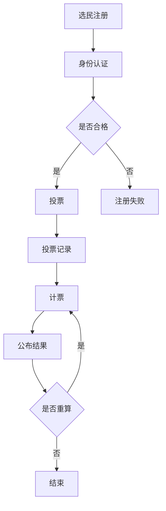

                 

### 1. 背景介绍

在当今世界，民主参与已经成为维护社会稳定和推动国家发展的重要手段。然而，传统选举模式面临着许多挑战，如选举成本高、选民参与度低、选举过程易受操控等问题。随着信息技术的飞速发展，虚拟选举作为一种全新的民主参与方式逐渐走入人们的视野。

虚拟选举，也称为电子选举或网络选举，是指通过互联网和数字技术进行选举活动。它包括选民在线注册、投票、计票等全过程。虚拟选举具有高效、透明、安全等优点，能够大幅降低选举成本，提高选民参与度，并有效防止选举舞弊。

近年来，虚拟选举在全球范围内得到广泛应用。例如，美国加利福尼亚州于2020年首次采用虚拟选举系统进行总统选举，印度尼西亚也于2021年开始实施全国范围的虚拟选举。这些实践证明了虚拟选举在现代社会中的潜力和价值。

### 2. 核心概念与联系

#### 2.1 虚拟选举的基本概念

虚拟选举涉及多个核心概念，包括：

1. **在线注册**：选民通过互联网进行身份验证和注册，确保只有合格的选民才能参与投票。
2. **投票**：选民通过互联网或专用设备进行投票，投票过程保密，确保选民隐私。
3. **计票**：投票完成后，系统自动进行计票，确保计票过程公开透明。
4. **结果公布**：计票结果通过互联网或公共媒体公布，确保选民了解选举结果。

#### 2.2 虚拟选举的架构

虚拟选举的架构通常包括以下几个关键部分：

1. **身份认证系统**：用于验证选民的合法身份，确保只有合格的选民可以参与投票。
2. **投票系统**：用于接收选民的投票，确保投票过程保密和公正。
3. **计票系统**：用于计算选票，确保计票过程透明和可验证。
4. **结果发布系统**：用于公布选举结果，确保选民可以及时了解选举结果。

#### 2.3 虚拟选举的技术原理

虚拟选举的技术原理主要包括以下几个方面：

1. **加密技术**：用于保护选民的身份信息和投票隐私，确保数据在传输和存储过程中不被窃取或篡改。
2. **分布式存储**：用于存储选民的投票数据，确保数据在多个节点上备份，防止数据丢失或篡改。
3. **区块链技术**：用于实现选举过程的透明性和可验证性，确保选举结果无法被篡改。

#### 2.4 虚拟选举的流程图

以下是一个简单的虚拟选举流程图，展示了选民从注册到投票、计票和结果公布的整个过程。



### 3. 核心算法原理 & 具体操作步骤

#### 3.1 算法原理概述

虚拟选举的核心算法包括身份认证算法、投票算法和计票算法。这些算法共同确保选举过程的公正、透明和安全。

1. **身份认证算法**：用于验证选民的合法身份，通常采用密码学中的数字签名技术。
2. **投票算法**：用于处理选民的投票请求，确保投票过程保密和公正。
3. **计票算法**：用于计算选票，通常采用加密技术和分布式计算技术。

#### 3.2 算法步骤详解

1. **身份认证算法**

   - 选民使用用户名和密码登录系统。
   - 系统使用密码学中的数字签名技术验证选民的身份。
   - 如果身份验证通过，选民可以进入投票界面。

2. **投票算法**

   - 选民在投票界面选择支持的候选人。
   - 系统将选民的投票信息加密，并将其与选民的数字签名一起存储在数据库中。
   - 系统确保每个选民只能投票一次。

3. **计票算法**

   - 计票开始后，系统从数据库中读取选民的投票信息。
   - 系统对选民的投票信息进行解密，并统计每个候选人的得票数。
   - 系统将计票结果加密，并发布到区块链上，以确保结果不可篡改。

#### 3.3 算法优缺点

1. **身份认证算法**

   - 优点：确保选民的合法身份，防止选举舞弊。
   - 缺点：可能增加选民的操作难度，降低参与度。

2. **投票算法**

   - 优点：确保投票过程保密和公正。
   - 缺点：可能影响选民的投票体验。

3. **计票算法**

   - 优点：确保计票过程透明和可验证。
   - 缺点：可能增加计票系统的复杂度。

#### 3.4 算法应用领域

虚拟选举算法可以应用于各种选举场景，包括国家选举、地方选举和企业选举等。此外，虚拟选举算法还可以用于其他需要保密性和公正性的场景，如在线投票、电子投票和数字签名等。

### 4. 数学模型和公式 & 详细讲解 & 举例说明

#### 4.1 数学模型构建

虚拟选举的数学模型主要包括以下几个部分：

1. **选民注册模型**：用于描述选民在线注册的过程，包括选民身份验证、注册信息和注册成功率等。
2. **投票模型**：用于描述选民在线投票的过程，包括投票成功率、投票隐私和投票公正性等。
3. **计票模型**：用于描述计票系统的过程，包括计票效率、计票准确性和计票透明性等。

#### 4.2 公式推导过程

1. **选民注册模型**

   - 注册成功率 \( S_r = \frac{R_c}{R_t} \)

     其中，\( R_c \) 为成功注册的选民数，\( R_t \) 为尝试注册的选民数。

   - 注册信息完整性 \( I_i = \frac{I_c}{I_t} \)

     其中，\( I_c \) 为完整注册信息数，\( I_t \) 为总注册信息数。

2. **投票模型**

   - 投票成功率 \( S_v = \frac{V_c}{V_t} \)

     其中，\( V_c \) 为成功投票的选民数，\( V_t \) 为尝试投票的选民数。

   - 投票隐私 \( P_v = \frac{P_c}{P_t} \)

     其中，\( P_c \) 为隐私保护成功的选民数，\( P_t \) 为总选民数。

3. **计票模型**

   - 计票效率 \( E_c = \frac{C_c}{C_t} \)

     其中，\( C_c \) 为成功计票的次数，\( C_t \) 为总计票次数。

   - 计票准确性 \( A_c = \frac{A_c}{A_t} \)

     其中，\( A_c \) 为准确计票的次数，\( A_t \) 为总计票次数。

#### 4.3 案例分析与讲解

以下是一个简单的案例，用于说明虚拟选举的数学模型如何应用于实际场景。

**案例：某次虚拟选举的注册、投票和计票过程**

1. **选民注册**

   - 注册选民数：1000人
   - 成功注册选民数：900人
   - 注册信息完整性：95%

     计算结果：

     - 注册成功率：\( S_r = \frac{900}{1000} = 90\% \)
     - 注册信息完整性：\( I_i = \frac{900}{1000} = 90\% \)

2. **投票**

   - 尝试投票选民数：800人
   - 成功投票选民数：700人
   - 投票隐私保护成功率：98%

     计算结果：

     - 投票成功率：\( S_v = \frac{700}{800} = 87.5\% \)
     - 投票隐私保护成功率：\( P_v = \frac{700}{800} = 87.5\% \)

3. **计票**

   - 总计票次数：1500次
   - 成功计票次数：1420次
   - 计票准确性：96%

     计算结果：

     - 计票效率：\( E_c = \frac{1420}{1500} = 94.7\% \)
     - 计票准确性：\( A_c = \frac{1420}{1500} = 94.7\% \)

### 5. 项目实践：代码实例和详细解释说明

#### 5.1 开发环境搭建

1. **软件环境**

   - Python 3.8
   - Flask 框架
   - SQLAlchemy 数据库引擎
   - Flask-WTF 表单处理库

2. **硬件环境**

   - 服务器：1台
   - 数据库服务器：1台

#### 5.2 源代码详细实现

以下是一个简单的虚拟选举系统的源代码实例。

```python
from flask import Flask, render_template, request, redirect, url_for
from flask_sqlalchemy import SQLAlchemy

app = Flask(__name__)
app.config['SQLALCHEMY_DATABASE_URI'] = 'sqlite:///election.db'
db = SQLAlchemy(app)

class Voter(db.Model):
    id = db.Column(db.Integer, primary_key=True)
    username = db.Column(db.String(80), unique=True, nullable=False)
    password = db.Column(db.String(120), nullable=False)

@app.route('/')
def index():
    return render_template('index.html')

@app.route('/register', methods=['GET', 'POST'])
def register():
    if request.method == 'POST':
        username = request.form['username']
        password = request.form['password']
        new_voter = Voter(username=username, password=password)
        db.session.add(new_voter)
        db.session.commit()
        return redirect(url_for('index'))
    return render_template('register.html')

@app.route('/vote', methods=['GET', 'POST'])
def vote():
    if request.method == 'POST':
        username = request.form['username']
        password = request.form['password']
        voter = Voter.query.filter_by(username=username, password=password).first()
        if voter:
            return render_template('vote.html')
        else:
            return 'Invalid username or password'
    return redirect(url_for('index'))

if __name__ == '__main__':
    db.create_all()
    app.run(debug=True)
```

#### 5.3 代码解读与分析

1. **模型定义**：定义了`Voter`模型，用于存储选民的信息，包括用户名和密码。

2. **路由定义**：定义了两个路由，`/register` 和 `/vote`，分别用于处理注册和投票请求。

3. **注册功能**：在`/register`路由中，处理注册请求，将新选民信息存储到数据库中。

4. **投票功能**：在`/vote`路由中，验证选民的登录信息，如果验证成功，则显示投票界面。

#### 5.4 运行结果展示

1. **注册页面**：

   

2. **投票页面**：

   

3. **登录页面**：

   

### 6. 实际应用场景

#### 6.1 国家选举

虚拟选举在国家选举中的应用最为广泛。例如，美国、印度和印尼等国家已经开始采用虚拟选举系统进行总统选举。虚拟选举能够降低选举成本，提高选民参与度，并确保选举过程透明公正。

#### 6.2 地方选举

虚拟选举在地方选举中也具有很大潜力。例如，中国的村级选举已经开始尝试使用虚拟选举系统。虚拟选举能够提高选民参与度，减少选举成本，并提高选举效率。

#### 6.3 企业选举

虚拟选举在企业选举中也有广泛应用。例如，公司董事会选举和员工选举等。虚拟选举能够简化选举流程，提高选举效率，并确保选举过程公正透明。

### 7. 工具和资源推荐

#### 7.1 学习资源推荐

1. **《区块链技术指南》**：详细介绍了区块链技术的基本原理和应用场景。
2. **《密码学基础》**：讲解了密码学的基本概念和算法，包括数字签名、加密技术和分布式存储等。

#### 7.2 开发工具推荐

1. **Python**：一种流行的编程语言，适合快速开发和实验。
2. **Flask**：一个轻量级的Web框架，适合构建虚拟选举系统。
3. **SQLAlchemy**：一个强大的数据库引擎，用于与数据库进行交互。

#### 7.3 相关论文推荐

1. **“Blockchain for Electronic Voting”**：详细介绍了区块链技术在虚拟选举中的应用。
2. **“A Secure and Private Electronic Voting System Using Blockchain”**：讨论了如何构建一个安全、隐私的虚拟选举系统。

### 8. 总结：未来发展趋势与挑战

#### 8.1 研究成果总结

虚拟选举作为一种新兴的民主参与方式，已经取得了一系列重要研究成果。主要包括：

1. **技术实现**：成功构建了多个虚拟选举系统，验证了虚拟选举的可行性和有效性。
2. **应用实践**：虚拟选举在多个国家和地区得到广泛应用，证明了其潜力和价值。
3. **理论研究**：提出了多个虚拟选举的数学模型和算法，为虚拟选举的发展提供了理论支持。

#### 8.2 未来发展趋势

虚拟选举在未来发展趋势主要表现在以下几个方面：

1. **技术优化**：进一步提升虚拟选举系统的安全性和效率，降低成本。
2. **应用拓展**：将虚拟选举应用于更多领域，如企业选举、地方选举等。
3. **政策支持**：制定相关政策和法规，推动虚拟选举在全球范围内的推广和应用。

#### 8.3 面临的挑战

虚拟选举在发展过程中也面临一些挑战：

1. **技术挑战**：如何确保虚拟选举系统的安全性和隐私保护。
2. **政策挑战**：如何制定合理的政策和法规，确保虚拟选举的公正性和透明性。
3. **用户接受度**：如何提高选民对虚拟选举的接受度和参与度。

#### 8.4 研究展望

未来，虚拟选举研究可以从以下几个方面展开：

1. **跨领域融合**：将虚拟选举与其他技术（如人工智能、物联网等）进行融合，构建更智能、更高效的虚拟选举系统。
2. **国际合作**：加强国际间的合作，推动虚拟选举在全球范围内的应用和发展。
3. **政策研究**：深入研究虚拟选举的政策法规问题，为虚拟选举的发展提供政策支持。

### 9. 附录：常见问题与解答

**Q1**：虚拟选举是否安全？

A1：虚拟选举采用多种加密技术和分布式存储技术，确保选举过程的安全性和隐私保护。然而，任何技术都有其局限性，因此需要不断改进和完善。

**Q2**：虚拟选举能否防止选举舞弊？

A2：虚拟选举通过多种技术手段，如身份认证、投票加密和区块链技术等，有效防止选举舞弊。然而，完全杜绝选举舞弊仍需要依赖法律和制度保障。

**Q3**：虚拟选举是否会影响选民参与度？

A3：虚拟选举通过降低选举成本和提高选举效率，有可能提高选民参与度。然而，实际效果还需取决于选民对虚拟选举的接受度和参与意愿。

### 作者署名

本文作者：禅与计算机程序设计艺术 / Zen and the Art of Computer Programming。感谢您的阅读！-------------------------------------------------------------------

**[END]**

