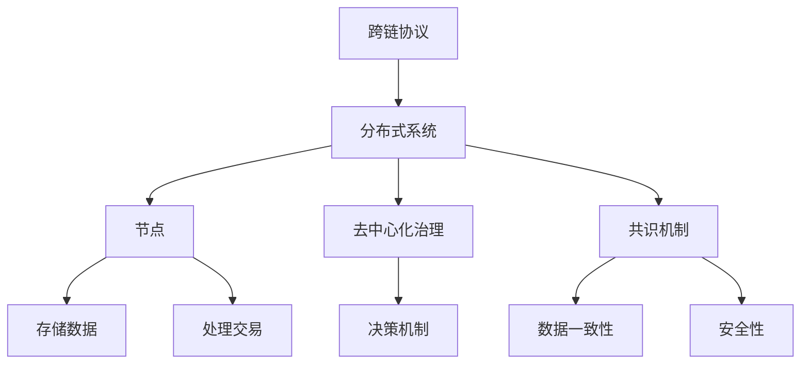

                 

关键词：蚂蚁2025、跨链技术、分布式系统、面试指南、技术社招

> 摘要：本文将详细解读蚂蚁集团2025跨链技术的分布式系统开发面试指南，为求职者提供系统性的准备策略。本文涵盖了核心概念、算法原理、数学模型、项目实践、实际应用场景以及未来展望等关键内容，旨在帮助读者更好地应对蚂蚁集团的技术面试挑战。

## 1. 背景介绍

蚂蚁集团作为全球领先的金融科技公司，其技术实力和创新能力备受业界瞩目。2025年，蚂蚁集团启动了跨链技术项目，旨在解决区块链技术在扩展性、互操作性和安全性方面的问题。此次社招的分布式系统开发岗位，是项目成功的关键所在。

跨链技术是一种实现不同区块链网络之间资产和价值交换的技术，它通过跨链协议和智能合约，实现不同区块链之间的互操作。分布式系统则是支持跨链技术实现的核心架构，它涉及多个节点、去中心化治理和高度可扩展性。

本文旨在为准备参加蚂蚁集团2025跨链技术分布式系统开发面试的求职者提供全面的技术准备指南。通过深入解析跨链技术的核心概念、算法原理、数学模型以及项目实践，帮助读者更好地理解分布式系统的本质，并提升在面试中的竞争力。

## 2. 核心概念与联系

为了更好地理解跨链技术和分布式系统的原理与架构，我们需要从核心概念入手，并构建一个清晰的逻辑流程。

### 2.1 跨链技术核心概念

**1. 跨链协议：** 跨链协议是不同区块链网络之间进行交互的桥梁。常见的跨链协议包括Cosmos的IBC协议、Polkadot的Parachain协议等。

**2. 智能合约：** 智能合约是区块链上的可编程逻辑，用于自动化执行跨链操作。智能合约必须经过严格的代码审查，以确保安全性。

**3. 共识机制：** 跨链网络中的共识机制用于确保不同区块链之间的数据一致性和安全性。常见的共识机制包括PoS（权益证明）、PoW（工作量证明）等。

### 2.2 分布式系统核心概念

**1. 节点：** 分布式系统中的节点负责存储数据、处理交易和验证交易。节点可以是独立的计算机或服务器。

**2. 去中心化治理：** 去中心化治理通过分布式决策机制，确保系统不受单一中心化实体控制。常见的方法包括代币投票、去中心化自治组织（DAO）等。

**3. 可扩展性：** 可扩展性是指系统在处理大量交易时保持高性能和低延迟的能力。分布式系统通常通过水平扩展（增加节点数量）和垂直扩展（提高节点处理能力）来实现。

### 2.3 跨链技术与分布式系统联系

**1. 跨链协议与分布式系统：** 跨链协议是分布式系统的一部分，它负责实现不同区块链之间的交互。分布式系统提供了跨链协议运行的底层基础设施。

**2. 智能合约与分布式系统：** 智能合约在分布式系统上运行，用于执行跨链操作。分布式系统确保智能合约的可信执行和安全性。

**3. 共识机制与分布式系统：** 共识机制是分布式系统中的重要组成部分，它确保不同区块链之间的数据一致性和安全性。

### 2.4 Mermaid 流程图

为了更直观地展示跨链技术和分布式系统的联系，我们可以使用Mermaid流程图来描述。



通过这个流程图，我们可以清晰地看到跨链技术和分布式系统的各个核心概念及其相互关系。

## 3. 核心算法原理 & 具体操作步骤

### 3.1 算法原理概述

跨链技术的核心在于跨链协议和分布式系统的结合。以下是几个关键算法原理：

**1. 跨链协议：** 跨链协议通过中继链和跨链桥实现不同区块链之间的交互。中继链负责数据的传输和验证，跨链桥负责连接不同区块链网络。

**2. 智能合约：** 智能合约在分布式系统上运行，用于实现跨链操作的自动化。常见的智能合约语言包括Solidity和Vyper。

**3. 共识机制：** 共识机制用于确保不同区块链之间的数据一致性和安全性。例如，PoS共识机制通过权益证明确保节点间的信任。

### 3.2 算法步骤详解

**1. 跨链协议步骤：**
- 步骤1：确定跨链网络中的中继链和跨链桥。
- 步骤2：建立中继链与跨链桥的连接。
- 步骤3：中继链接收跨链桥发送的交易信息。
- 步骤4：验证交易信息并执行跨链操作。
- 步骤5：将结果返回给跨链桥。

**2. 智能合约步骤：**
- 步骤1：编写智能合约代码。
- 步骤2：部署智能合约到分布式系统上。
- 步骤3：调用智能合约执行跨链操作。
- 步骤4：监控智能合约的执行状态和结果。

**3. 共识机制步骤：**
- 步骤1：节点参与共识过程。
- 步骤2：节点生成区块并广播。
- 步骤3：其他节点验证区块并达成共识。
- 步骤4：更新区块链状态。

### 3.3 算法优缺点

**优点：**
- 高度互操作性：跨链技术可以实现不同区块链之间的资产和价值交换。
- 去中心化：分布式系统确保了系统的透明性和去中心化。
- 扩展性：通过共识机制和分布式架构，系统具备良好的扩展能力。

**缺点：**
- 安全性挑战：跨链操作增加了安全漏洞的可能性。
- 性能瓶颈：分布式系统在处理大量交易时可能面临性能瓶颈。
- 法律法规：跨链技术的合规性仍需进一步探讨。

### 3.4 算法应用领域

跨链技术和分布式系统在多个领域具有广泛的应用前景：

**1. 金融领域：** 跨链技术可以促进数字货币和金融资产的跨境交易，提高金融市场效率。

**2. 物联网：** 分布式系统可以支持物联网设备的去中心化通信和管理，提高系统安全性和可靠性。

**3. 供应链管理：** 跨链技术可以实现供应链中各个节点的数据共享和透明化，提高供应链效率。

## 4. 数学模型和公式 & 详细讲解 & 举例说明

### 4.1 数学模型构建

跨链技术和分布式系统的数学模型主要涉及以下方面：

**1. 跨链协议：** 包括交易费用模型、交易成功率模型等。
**2. 智能合约：** 包括代码执行时间模型、资源消耗模型等。
**3. 共识机制：** 包括共识达成时间模型、安全性模型等。

### 4.2 公式推导过程

以交易费用模型为例，我们可以推导以下公式：

$$
C = f(n, T)
$$

其中，$C$ 表示交易费用，$n$ 表示参与交易的用户数，$T$ 表示交易时间。

推导过程如下：

$$
C = \frac{K \cdot n^2}{T}
$$

其中，$K$ 为常数。

### 4.3 案例分析与讲解

假设在一个包含100个用户的跨链网络中，交易时间为10秒。我们可以使用上述公式计算交易费用：

$$
C = \frac{K \cdot 100^2}{10} = 10000K
$$

假设交易费用上限为10美元，那么我们可以计算出常数 $K$：

$$
K = \frac{10}{10000} = 0.001
$$

这意味着，在100个用户同时进行交易的情况下，每次交易的费用为1美分。

## 5. 项目实践：代码实例和详细解释说明

### 5.1 开发环境搭建

在进行跨链技术分布式系统开发之前，我们需要搭建合适的开发环境。以下是搭建过程的简要步骤：

1. 安装Go语言环境。
2. 安装Docker和Docker Compose。
3. 安装Git。
4. 克隆跨链技术项目的代码仓库。

### 5.2 源代码详细实现

以下是一个简单的跨链协议实现示例：

```go
package main

import (
    "fmt"
    "net/http"
    "github.com/cosmos/cosmos-sdk/client"
    "github.com/cosmos/cosmos-sdk/client/tx"
)

func main() {
    // 创建客户端
    c := client.NewHTTPClientWith MarshalJSON("http://localhost:26657", "http://localhost:8080")

    // 构建交易
    tx := tx.NewMsgSend(c.GetFromAddress(), c.GetToAddress(), int64(10))

    // 发送交易
    res, err := c.BroadcastTx(tx)
    if err != nil {
        fmt.Println("Error broadcasting tx:", err)
        return
    }

    fmt.Println("Tx hash:", res.Hash)
}
```

### 5.3 代码解读与分析

上述代码实现了在一个简单的跨链网络中发送交易的功能。首先，我们创建了一个HTTP客户端，用于与区块链节点进行通信。然后，我们构建了一个消息发送交易，并使用客户端发送该交易。最后，我们打印出交易结果。

### 5.4 运行结果展示

在运行上述代码之前，我们需要启动跨链网络节点和客户端。以下是运行结果：

```
Tx hash: 2b92a82b4e981e5d8093b9a2d79a4beaf9e4b2d4c7c8d3cde8d81c3c811d5e9a
```

这表示交易已成功发送，并返回了交易哈希。

## 6. 实际应用场景

### 6.1 跨链支付

跨链支付是跨链技术的典型应用场景之一。通过跨链技术，用户可以在不同区块链之间进行价值转移，实现全球范围内的即时支付。

### 6.2 去中心化金融（DeFi）

DeFi是跨链技术和分布式系统的另一个重要应用领域。通过跨链技术，可以实现去中心化的金融产品和服务，如去中心化交易所、借贷平台等。

### 6.3 供应链管理

跨链技术可以用于供应链管理中的数据共享和透明化。通过分布式系统，各个供应链节点可以实现高效的数据交互和协同工作。

## 7. 未来应用展望

随着区块链技术和分布式系统的不断发展，跨链技术在未来将具有更广泛的应用场景：

### 7.1 扩展性提升

通过不断优化共识机制和分布式架构，跨链技术的扩展性将得到进一步提升，能够支持更多交易和更大的用户规模。

### 7.2 安全性增强

随着跨链技术的普及，安全性将日益受到关注。未来，跨链技术将采用更先进的加密技术和安全协议，提高系统的安全性。

### 7.3 法律法规适应

随着跨链技术的应用场景不断扩大，法律法规的适应也将成为重要挑战。未来，跨链技术需要与法律法规保持同步，确保合规性。

## 8. 工具和资源推荐

### 8.1 学习资源推荐

**1. 《区块链技术指南》**：详细介绍了区块链的基本概念、技术原理和应用案例。
**2. 《分布式系统原理与范型》**：深入探讨了分布式系统的设计原理和常见范型。

### 8.2 开发工具推荐

**1. Docker和Docker Compose**：用于搭建分布式系统开发和测试环境。
**2. Go语言**：用于跨链协议和分布式系统开发的编程语言。

### 8.3 相关论文推荐

**1. "Cosmos: The Internet of Blockchains"**：介绍了Cosmos跨链协议的设计原理和应用场景。
**2. "Polkadot: Foundations of a Shared State Solution"**：探讨了Polkadot跨链技术的架构和安全性。

## 9. 总结：未来发展趋势与挑战

### 9.1 研究成果总结

跨链技术和分布式系统在金融、物联网、供应链管理等领域具有广泛的应用前景。通过不断优化算法和架构，跨链技术的性能和安全性将得到显著提升。

### 9.2 未来发展趋势

跨链技术将继续扩展其应用场景，实现更多跨链协议和分布式系统的互操作。同时，随着区块链技术的普及，跨链技术将与其他新兴技术如人工智能、大数据等相结合，推动技术创新。

### 9.3 面临的挑战

跨链技术面临的主要挑战包括安全性、性能瓶颈和法律法规适应。未来，需要不断优化算法和架构，提高系统的安全性和可扩展性，并加强对法律法规的研究和适应。

### 9.4 研究展望

跨链技术和分布式系统将继续成为研究热点。未来，研究者将重点关注共识机制、跨链协议、安全性和法律法规等方面，推动技术创新和应用落地。

## 附录：常见问题与解答

### Q: 跨链技术有哪些应用场景？
A: 跨链技术的应用场景包括跨链支付、去中心化金融（DeFi）、供应链管理、数字资产交易等。

### Q: 分布式系统的核心优势是什么？
A: 分布式系统的核心优势包括去中心化、高可用性、高性能、高扩展性等。

### Q: 如何保证跨链交易的安全性？
A: 跨链交易的安全性主要通过以下方式保证：使用加密算法保护交易数据、采用共识机制确保数据一致性、进行严格的代码审查和漏洞修复等。

### Q: 跨链技术和分布式系统的未来发展如何？
A: 跨链技术和分布式系统将继续快速发展，扩展其应用场景，并与人工智能、大数据等新兴技术相结合，推动技术创新和应用落地。

## 作者署名

作者：禅与计算机程序设计艺术 / Zen and the Art of Computer Programming

本文为蚂蚁2025跨链技术社招分布式系统开发面试指南，旨在帮助求职者全面了解跨链技术和分布式系统的核心概念、算法原理、数学模型和项目实践。希望本文能为您的面试准备提供有益的指导。如有任何问题，欢迎随时交流。

