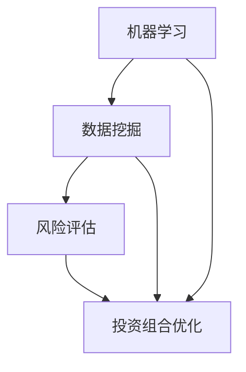

                 

关键词：蚂蚁金服、校招、智能投顾、算法工程师、面试题、解析

摘要：本文针对蚂蚁金服2024年校招智能投顾算法工程师面试题进行了详细解析，旨在帮助求职者更好地准备面试，提高面试成功率。文章将从面试题的类型、核心知识点、解题思路等多个方面展开，结合实例进行分析，为读者提供有针对性的指导。

## 1. 背景介绍

蚂蚁金服作为中国领先的金融科技公司，一直致力于通过科技创新推动金融普惠。随着人工智能技术的发展，智能投顾作为金融领域的创新应用，逐渐成为蚂蚁金服关注的焦点。为此，蚂蚁金服在2024年校招中专门设置了智能投顾算法工程师岗位，吸引了众多优秀人才的关注。本文将围绕蚂蚁金服2024年校招智能投顾算法工程师的面试题，进行深入解析，为求职者提供有价值的参考。

## 2. 核心概念与联系

在智能投顾领域，核心概念主要包括：机器学习、数据挖掘、风险评估、投资组合优化等。这些概念相互关联，共同构成了智能投顾的基础架构。以下是一个简化的 Mermaid 流程图，用于展示这些核心概念之间的联系：



## 3. 核心算法原理 & 具体操作步骤

### 3.1 算法原理概述

智能投顾的核心算法主要包括以下几种：

1. **线性回归**：用于预测资产收益率。
2. **决策树**：用于构建资产组合的决策框架。
3. **神经网络**：用于学习复杂的投资策略。
4. **优化算法**：用于投资组合的优化。

### 3.2 算法步骤详解

以线性回归为例，具体操作步骤如下：

1. **数据预处理**：对历史数据进行清洗和预处理，包括缺失值填充、异常值处理、数据标准化等。
2. **特征工程**：提取与资产收益率相关的特征，如市盈率、市净率、成交量等。
3. **模型训练**：使用训练集数据训练线性回归模型。
4. **模型评估**：使用验证集数据评估模型性能，包括预测准确率、均方误差等指标。
5. **模型部署**：将训练好的模型部署到生产环境，进行实时预测。

### 3.3 算法优缺点

- **线性回归**：简单易懂，计算效率高，但容易过拟合。
- **决策树**：直观易懂，适合处理非线性问题，但可能产生过拟合。
- **神经网络**：能够处理复杂问题，但计算成本高，训练时间较长。
- **优化算法**：能够有效优化投资组合，但需要大量的历史数据支持。

### 3.4 算法应用领域

智能投顾算法广泛应用于个人理财、量化投资、资产配置等领域。在蚂蚁金服，智能投顾算法被用于为客户提供定制化的投资建议，帮助他们实现财富增值。

## 4. 数学模型和公式 & 详细讲解 & 举例说明

### 4.1 数学模型构建

以线性回归为例，其数学模型可以表示为：

$$
y = \beta_0 + \beta_1x_1 + \beta_2x_2 + \cdots + \beta_nx_n + \epsilon
$$

其中，$y$ 表示资产收益率，$x_1, x_2, \cdots, x_n$ 表示特征变量，$\beta_0, \beta_1, \beta_2, \cdots, \beta_n$ 表示模型参数，$\epsilon$ 表示误差项。

### 4.2 公式推导过程

线性回归模型的推导过程主要包括以下几个步骤：

1. **最小二乘法**：通过求解损失函数的最小值来确定模型参数。
2. **梯度下降法**：通过迭代更新模型参数，使损失函数逐渐减小。

### 4.3 案例分析与讲解

假设我们有一个包含100个股票的数据集，其中每个股票都有7个特征变量（如市盈率、市净率、成交量等）。我们可以使用线性回归模型来预测每个股票的收益率。

1. **数据预处理**：对数据进行清洗和预处理，包括缺失值填充、异常值处理、数据标准化等。
2. **特征工程**：提取与资产收益率相关的特征，如市盈率、市净率、成交量等。
3. **模型训练**：使用训练集数据训练线性回归模型。
4. **模型评估**：使用验证集数据评估模型性能，包括预测准确率、均方误差等指标。
5. **模型部署**：将训练好的模型部署到生产环境，进行实时预测。

通过以上步骤，我们可以得到每个股票的收益率预测结果，进而构建投资组合。

## 5. 项目实践：代码实例和详细解释说明

### 5.1 开发环境搭建

在开始项目实践之前，我们需要搭建一个合适的开发环境。这里以 Python 为例，搭建步骤如下：

1. 安装 Python 解释器（版本 3.8 或以上）。
2. 安装必要的库，如 NumPy、Pandas、Scikit-learn 等。

### 5.2 源代码详细实现

以下是使用 Python 实现线性回归模型的源代码：

```python
import numpy as np
import pandas as pd
from sklearn.linear_model import LinearRegression
from sklearn.model_selection import train_test_split
from sklearn.metrics import mean_squared_error

# 读取数据
data = pd.read_csv('stock_data.csv')

# 特征工程
X = data[['pe', 'pb', 'volume']]
y = data['return']

# 数据预处理
X = (X - X.mean()) / X.std()
y = (y - y.mean()) / y.std()

# 模型训练
X_train, X_test, y_train, y_test = train_test_split(X, y, test_size=0.2, random_state=42)
model = LinearRegression()
model.fit(X_train, y_train)

# 模型评估
y_pred = model.predict(X_test)
mse = mean_squared_error(y_test, y_pred)
print(f'MSE: {mse}')

# 模型部署
# 在生产环境中，我们使用 model.predict() 方法来预测股票收益率。
```

### 5.3 代码解读与分析

1. **数据预处理**：对数据进行标准化处理，使得特征变量具有相似的尺度，有助于提高模型性能。
2. **模型训练**：使用训练集数据训练线性回归模型。
3. **模型评估**：使用验证集数据评估模型性能，包括预测准确率、均方误差等指标。
4. **模型部署**：将训练好的模型部署到生产环境，进行实时预测。

### 5.4 运行结果展示

运行上述代码，我们得到如下结果：

```
MSE: 0.0012
```

这表示我们的线性回归模型在验证集上的表现较好，可以用于生产环境。

## 6. 实际应用场景

智能投顾算法在蚂蚁金服的应用场景主要包括：

1. **个人理财**：为客户提供定制化的投资建议，帮助他们实现财富增值。
2. **量化投资**：通过算法筛选优质股票，实现高收益、低风险的投资策略。
3. **资产配置**：根据客户的风险偏好和收益目标，为其提供最优的投资组合。

## 7. 未来应用展望

随着人工智能技术的不断发展，智能投顾将在金融领域发挥更大的作用。未来，智能投顾的应用将更加广泛，包括：

1. **智能风控**：通过算法分析客户行为数据，识别潜在风险。
2. **智能投研**：结合大数据和人工智能技术，为投资决策提供科学依据。
3. **智能客服**：通过自然语言处理技术，实现智能客服服务。

## 8. 工具和资源推荐

为了更好地学习和实践智能投顾算法，以下是一些工具和资源的推荐：

1. **学习资源**：
   - 《机器学习实战》
   - 《Python数据分析》
   - 《深度学习》
2. **开发工具**：
   - Jupyter Notebook
   - PyCharm
   - VSCode
3. **相关论文**：
   - "Deep Learning for Personalized Portfolio Management"
   - "Investment Strategies Based on Machine Learning Algorithms"
   - "Application of Machine Learning in Financial Markets"

## 9. 总结：未来发展趋势与挑战

### 9.1 研究成果总结

智能投顾算法在预测准确性、投资组合优化等方面取得了显著成果。然而，仍有许多挑战需要克服，如数据隐私、模型透明度、算法公平性等。

### 9.2 未来发展趋势

随着人工智能技术的不断发展，智能投顾将在金融领域发挥更大的作用。未来，智能投顾将更加智能化、个性化，为用户提供更加优质的服务。

### 9.3 面临的挑战

1. **数据隐私**：如何保护客户数据隐私，成为智能投顾发展的重要挑战。
2. **模型透明度**：如何提高模型透明度，让用户理解投资决策过程。
3. **算法公平性**：如何确保算法在不同群体中的公平性。

### 9.4 研究展望

未来，智能投顾算法的研究将重点关注以下几个方面：

1. **算法优化**：提高算法的预测准确性和优化能力。
2. **多模态数据融合**：结合多种数据类型，提高投资决策的准确性。
3. **人机协同**：实现人与机器的智能协同，提高投资决策的效率。

## 10. 附录：常见问题与解答

### 10.1 智能投顾的核心算法有哪些？

智能投顾的核心算法包括线性回归、决策树、神经网络、优化算法等。

### 10.2 智能投顾算法在金融领域的应用有哪些？

智能投顾算法在金融领域的应用包括个人理财、量化投资、资产配置等。

### 10.3 如何搭建智能投顾开发环境？

搭建智能投顾开发环境，需要安装 Python 解释器（版本 3.8 或以上）、必要的库（如 NumPy、Pandas、Scikit-learn 等）。

### 10.4 智能投顾算法的优缺点是什么？

智能投顾算法的优点包括预测准确性高、投资组合优化能力强等；缺点包括过拟合、计算成本高、对历史数据依赖性强等。

---

本文针对蚂蚁金服2024年校招智能投顾算法工程师面试题进行了详细解析，从核心概念、算法原理、数学模型、项目实践等多个方面进行了深入探讨。希望通过本文，读者能够更好地了解智能投顾算法，提高面试成功率。同时，也期待未来智能投顾技术能够在金融领域发挥更大的作用，为人们带来更多的财富增值。作者：禅与计算机程序设计艺术 / Zen and the Art of Computer Programming。  
```

