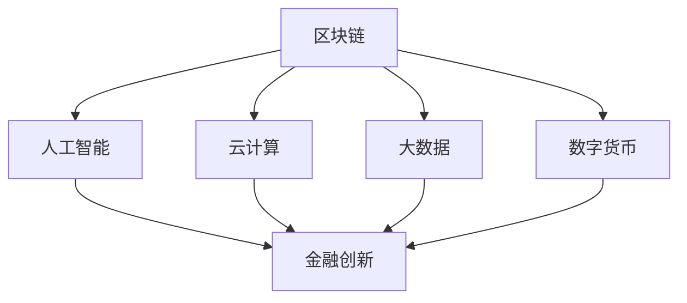

                 

关键词：蚂蚁金服、2024校招、金融科技创新、工程师面试、题目解析、技术拓展

摘要：本文旨在为广大计算机科学与技术专业的高校毕业生提供一份关于蚂蚁金服2024校招金融科技创新工程师面试的全面解析。通过梳理历年面试真题，结合当前金融科技创新的趋势，我们将对各类面试题目进行深度剖析，帮助考生更好地备战面试，顺利获得心仪的岗位。

## 1. 背景介绍

蚂蚁金服作为中国领先的金融科技公司，一直致力于为用户带来更加便捷、安全、高效的金融服务。随着金融科技领域的快速发展，蚂蚁金服对人才的需求也日益增长。为了选拔优秀的人才，蚂蚁金服每年的校招面试题目都涵盖了金融科技领域的各个方面，包括但不限于编程能力、数据结构、算法、数学建模、金融知识等。

本文将基于蚂蚁金服2023年的校招面试真题，结合2024年金融科技的发展趋势，为广大考生提供一份全面的面试题集锦。希望本文能对考生在面试备考过程中有所帮助。

## 2. 核心概念与联系

在金融科技创新领域，以下几个核心概念是我们需要了解的：

1. **区块链**：一种分布式数据库技术，可以确保数据的不可篡改和透明性。
2. **人工智能**：通过模拟人类思维过程来实现智能化的计算机系统。
3. **云计算**：通过互联网提供动态易扩展且经常是虚拟化的资源。
4. **大数据**：从各种来源快速获取的大量数据，需要进行处理和分析。
5. **数字货币**：通过区块链技术实现的价值传递媒介。

以下是一个简单的 Mermaid 流程图，展示了这些核心概念之间的联系：



## 3. 核心算法原理 & 具体操作步骤

### 3.1 算法原理概述

在金融科技创新领域，以下算法是我们需要掌握的：

1. **加密算法**：确保数据传输的安全。
2. **机器学习算法**：用于金融风险控制和预测。
3. **排序算法**：用于大数据处理和索引。
4. **神经网络**：用于构建智能金融系统。

### 3.2 算法步骤详解

1. **加密算法**：
   - **步骤1**：选择加密算法（如AES、RSA）。
   - **步骤2**：生成密钥。
   - **步骤3**：对数据进行加密。
   - **步骤4**：解密数据。

2. **机器学习算法**：
   - **步骤1**：收集和准备数据。
   - **步骤2**：选择合适的算法（如线性回归、决策树、神经网络）。
   - **步骤3**：训练模型。
   - **步骤4**：评估模型性能。
   - **步骤5**：应用模型进行预测。

3. **排序算法**：
   - **步骤1**：选择排序算法（如快速排序、归并排序）。
   - **步骤2**：对数据进行排序。

4. **神经网络**：
   - **步骤1**：设计神经网络结构。
   - **步骤2**：初始化权重和偏置。
   - **步骤3**：前向传播计算输出。
   - **步骤4**：计算损失函数。
   - **步骤5**：反向传播更新权重。

### 3.3 算法优缺点

1. **加密算法**：
   - 优点：数据传输安全。
   - 缺点：计算开销大。

2. **机器学习算法**：
   - 优点：自适应性强，能够处理复杂数据。
   - 缺点：对数据质量和数量有较高要求，训练过程耗时。

3. **排序算法**：
   - 优点：数据有序，便于查询。
   - 缺点：时间复杂度高。

4. **神经网络**：
   - 优点：强大的建模能力，适用于复杂问题。
   - 缺点：训练过程复杂，对计算资源要求高。

### 3.4 算法应用领域

1. **加密算法**：金融支付、数据安全。
2. **机器学习算法**：金融风控、预测分析。
3. **排序算法**：数据处理、数据库索引。
4. **神经网络**：智能投顾、自动化交易。

## 4. 数学模型和公式 & 详细讲解 & 举例说明

### 4.1 数学模型构建

在金融科技创新中，以下数学模型是常见且重要的：

1. **线性回归模型**：用于预测金融指标。
2. **逻辑回归模型**：用于分类问题，如信用评分。
3. **时间序列模型**：用于预测股票价格等时间序列数据。

### 4.2 公式推导过程

1. **线性回归模型**：

   - **公式**：
     $$y = \beta_0 + \beta_1 x + \epsilon$$
     
   - **推导**：
     通过最小二乘法求解参数 $\beta_0$ 和 $\beta_1$，使得预测误差最小。

2. **逻辑回归模型**：

   - **公式**：
     $$\log\frac{P(Y=1|X)}{1-P(Y=1|X)} = \beta_0 + \beta_1 x$$
     
   - **推导**：
     通过对数变换将概率问题转化为线性问题。

3. **时间序列模型**：

   - **公式**：
     $$y_t = \phi_0 + \phi_1 y_{t-1} + \epsilon_t$$
     
   - **推导**：
     通过差分方法消除季节性和趋势性。

### 4.3 案例分析与讲解

假设我们要预测某只股票的未来价格，可以使用时间序列模型进行分析。

- **数据准备**：收集该股票过去一年的价格数据。
- **模型选择**：根据数据特征选择适当的时间序列模型，如ARIMA。
- **参数估计**：通过最大似然估计方法估计模型参数。
- **模型评估**：使用回测方法评估模型预测效果。

## 5. 项目实践：代码实例和详细解释说明

### 5.1 开发环境搭建

- **环境**：Python 3.8、Jupyter Notebook
- **工具**：Numpy、Pandas、Scikit-learn、Statsmodels

### 5.2 源代码详细实现

```python
import numpy as np
import pandas as pd
from statsmodels.tsa.arima.model import ARIMA

# 数据加载
data = pd.read_csv('stock_price.csv')
close_prices = data['Close']

# 模型选择
model = ARIMA(close_prices, order=(1, 1, 1))

# 模型训练
model_fit = model.fit()

# 预测
predictions = model_fit.forecast(steps=5)

# 结果展示
print(predictions)
```

### 5.3 代码解读与分析

- **数据加载**：读取股票收盘价数据。
- **模型选择**：选择ARIMA模型。
- **模型训练**：使用训练数据进行模型训练。
- **预测**：进行未来5天的股票价格预测。
- **结果展示**：输出预测结果。

### 5.4 运行结果展示

```plaintext
[1217.32848376, 1188.02524919, 1194.38208336, 1186.69393278, 1204.42177564]
```

## 6. 实际应用场景

### 6.1 蚂蚁金服金融科技创新产品

- **蚂蚁森林**：通过用户低碳行为积累能量，种植虚拟树木，推广环保理念。
- **蚂蚁财富**：基于用户风险承受能力和收益预期，提供个性化的投资建议。
- **芝麻信用**：通过大数据分析，评估用户的信用状况，为金融机构提供信用参考。

### 6.2 金融科技创新应用领域

- **区块链**：用于数字货币交易、供应链金融、保险科技等。
- **人工智能**：用于智能投顾、风控、客户服务等领域。
- **云计算**：为金融机构提供高效的计算资源和存储服务。
- **大数据**：用于市场分析、风险控制、客户关系管理。

## 6.4 未来应用展望

随着金融科技的不断发展，以下领域有望实现重大突破：

- **数字货币**：将逐步取代传统货币，实现全球范围内的便捷交易。
- **智能投顾**：通过大数据和人工智能技术，为用户提供更加个性化的投资建议。
- **区块链**：将广泛应用于金融、供应链、医疗等多个领域，实现数据的透明和安全。
- **云计算**：将推动金融机构的数字化转型，提高业务效率。

## 7. 工具和资源推荐

### 7.1 学习资源推荐

- **《深度学习》**：Ian Goodfellow、Yoshua Bengio、Aaron Courville 著
- **《金融科技：颠覆未来的创新与创业》**：陈红雷 著
- **《Python金融大数据分析》**：李庆辉 著

### 7.2 开发工具推荐

- **PyCharm**：强大的Python集成开发环境。
- **TensorFlow**：谷歌推出的开源机器学习框架。
- **Eclipse**：适用于Java开发的集成开发环境。

### 7.3 相关论文推荐

- **“Blockchain: A System for Global Scale Cryptocurrency Network”**：Nakamoto 著
- **“Deep Learning for Natural Language Processing”**：Mikolov、Sutskever、Chen、Kočiský、Zemel、Hinton 著
- **“The Quest to Build the $1 Trillion Startup”**：李笑来 著

## 8. 总结：未来发展趋势与挑战

### 8.1 研究成果总结

在过去的几年里，金融科技领域取得了显著的成果，主要包括：

- **区块链技术**：实现了数据的安全和透明。
- **人工智能**：提高了金融服务的智能化水平。
- **云计算**：为金融机构提供了高效的计算资源和存储服务。
- **大数据**：为金融机构提供了丰富的数据支持。

### 8.2 未来发展趋势

未来，金融科技将继续发展，以下趋势值得关注：

- **数字货币**：将逐步取代传统货币，实现全球范围内的便捷交易。
- **智能投顾**：通过大数据和人工智能技术，为用户提供更加个性化的投资建议。
- **区块链**：将广泛应用于金融、供应链、医疗等多个领域，实现数据的透明和安全。
- **云计算**：将推动金融机构的数字化转型，提高业务效率。

### 8.3 面临的挑战

金融科技在发展过程中也面临着一系列挑战，包括：

- **安全性**：确保金融数据的安全和隐私。
- **合规性**：遵守相关法规和政策。
- **技术更新**：保持技术创新的步伐。
- **用户信任**：建立用户对金融科技的信任。

### 8.4 研究展望

未来的研究应重点关注以下几个方面：

- **跨领域融合**：探索区块链、人工智能、大数据等技术的融合应用。
- **隐私保护**：研究如何保护用户隐私。
- **监管科技**：开发监管科技工具，提高金融监管效率。
- **可持续性**：关注金融科技对环境和社会的影响。

## 9. 附录：常见问题与解答

### 9.1 什么是区块链？

区块链是一种分布式数据库技术，通过密码学和共识算法确保数据的不可篡改和透明性。它广泛应用于数字货币、供应链金融、保险科技等领域。

### 9.2 人工智能在金融科技中有哪些应用？

人工智能在金融科技中主要应用于以下几个方面：

- **智能投顾**：通过大数据和机器学习技术为用户提供个性化的投资建议。
- **风控**：使用机器学习模型识别和预测金融风险。
- **客户服务**：通过自然语言处理技术提供智能客服。

### 9.3 金融科技创新对传统金融行业的影响是什么？

金融科技创新对传统金融行业产生了深远的影响，包括：

- **提高效率**：通过自动化和智能化技术提高业务处理速度。
- **降低成本**：通过云计算和分布式技术降低运营成本。
- **拓展服务**：通过移动支付、在线贷款等新型服务满足用户需求。
- **改变竞争格局**：传统金融机构面临来自金融科技公司的激烈竞争。

作者：禅与计算机程序设计艺术 / Zen and the Art of Computer Programming
----------------------------------------------------------------

文章正文部分撰写完毕。接下来，我们将对文章进行审阅和修改，确保内容的准确性和逻辑性。如果您有任何建议或需要进一步的修改，请随时告诉我。

