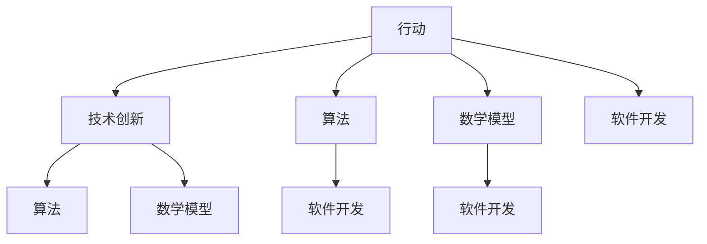

                 

在这个技术飞速发展的时代，行动（Action）是推动创新和进步的关键。无论是科学研究、软件开发，还是日常生活的方方面面，行动都是解决问题的第一步。本文将探讨在信息技术领域，行动如何影响我们的工作方式，以及如何通过行动实现技术突破和创新。我们将深入探讨行动的核心概念、原理、以及在实际应用中的具体操作步骤。同时，还将分析行动背后的数学模型和公式，并通过实例展示其在项目实践中的应用。最后，我们将展望行动在未来的发展趋势，以及面临的挑战。

## 关键词

- 行动
- 技术创新
- 算法
- 数学模型
- 项目实践

## 摘要

本文旨在探讨行动在信息技术领域的重要性。我们将首先介绍行动的概念，并阐述其在技术创新中的关键角色。随后，通过分析行动的核心算法原理，我们将详细描述其实际操作步骤。文章还将涉及行动背后的数学模型和公式，并通过具体实例展示其在项目实践中的应用。最后，我们将讨论行动在未来的发展趋势，面临的挑战，以及相关工具和资源的推荐。

## 1. 背景介绍

在信息技术飞速发展的时代，行动已经成为推动科技进步和创新的关键因素。无论是科学研究、软件开发，还是日常生活的方方面面，行动都是实现目标的第一步。从计算机科学的角度来看，行动可以理解为一系列操作的执行，这些操作旨在解决问题、优化算法或改进系统性能。

在过去的几十年中，信息技术领域的变革可谓日新月异。从最初的计算机硬件到如今的云计算、大数据、人工智能，每一次技术突破都离不开行动的推动。行动不仅体现在科学研究的实际操作中，也贯穿于软件开发的整个生命周期。通过行动，程序员和科学家们不断探索新的算法、优化现有系统，最终实现技术突破。

### 1.1 行动与技术创新

技术创新是信息技术领域的核心驱动力，而行动是实现这一目标的关键。具体来说，行动在技术创新中发挥着以下几个方面的作用：

1. **推动科学研究**：科学研究需要通过实验和验证来不断探索未知领域。行动是实现这一目标的基础，它使得科学家们能够通过实际操作验证理论假设，推动科学研究的进展。

2. **促进软件开发**：软件开发需要程序员们不断编写、测试和优化代码。行动在这个过程中起到了至关重要的作用，它使得程序员们能够快速迭代、改进软件性能，最终实现产品的成功。

3. **优化系统性能**：在信息技术系统中，系统性能的优化是一个持续的过程。行动使得技术人员能够通过实际操作调整系统参数、优化算法，从而提升系统性能。

4. **推动产业升级**：行动不仅局限于科学研究和技术开发，它还推动了产业的升级和转型。通过行动，企业可以不断改进生产流程、提高生产效率，从而在激烈的市场竞争中脱颖而出。

### 1.2 行动与算法

算法是信息技术领域的核心组成部分，而行动在算法研究和应用中同样发挥着关键作用。具体来说，行动在算法研究和应用中主要体现在以下几个方面：

1. **算法优化**：算法优化是提升系统性能的重要手段。通过行动，技术人员可以不断尝试新的算法、优化现有算法，从而提高算法的效率。

2. **算法验证**：算法验证是确保算法正确性和有效性的关键步骤。通过行动，技术人员可以通过实际操作验证算法的性能，找出潜在的问题和不足。

3. **算法创新**：行动在算法创新中也发挥着重要作用。通过实际操作，技术人员可以不断探索新的算法思路，推动算法的进步和创新。

4. **算法应用**：算法的应用是信息技术发展的最终目标。通过行动，技术人员可以将算法应用于实际场景，解决实际问题，实现技术的应用价值。

### 1.3 行动与数学模型

数学模型是信息技术领域中描述和解决问题的重要工具。行动在数学模型的研究和应用中同样发挥着关键作用。具体来说，行动在数学模型研究和应用中主要体现在以下几个方面：

1. **数学模型构建**：行动使得技术人员可以不断尝试新的数学模型，通过实验验证其有效性和适用性。

2. **数学模型优化**：行动可以用于优化现有的数学模型，提升模型的性能和适用范围。

3. **数学模型验证**：行动可以用于验证数学模型的正确性和可靠性，确保模型在实际应用中的有效性。

4. **数学模型应用**：行动使得技术人员可以将数学模型应用于实际场景，解决实际问题。

总之，行动在信息技术领域中的重要性不容忽视。通过行动，我们可以推动科学研究、促进软件开发、优化系统性能、推动产业升级，以及实现技术的应用价值。在接下来的内容中，我们将进一步探讨行动的核心概念、原理，以及在实际应用中的具体操作步骤。

### 2. 核心概念与联系

在深入探讨行动（Action）在信息技术领域的重要性之前，我们需要明确几个核心概念，并了解它们之间的联系。以下是本文将要讨论的核心概念及其相互关系：

#### 2.1 行动的定义

行动可以定义为在信息技术领域中为实现特定目标而进行的一系列操作和活动。这些操作可能包括编程、算法优化、系统调试、实验设计等。

#### 2.2 技术创新

技术创新是指在现有技术基础上，通过改进、优化或发明新的技术，实现更高效、更可靠或更便捷的解决方案。行动是实现技术创新的重要手段。

#### 2.3 算法

算法是解决问题的一系列明确和精确的操作步骤。在信息技术领域，算法是核心组成部分，其性能直接影响系统的效率。

#### 2.4 数学模型

数学模型是用数学语言描述现实世界问题的抽象模型。数学模型可以帮助我们理解问题的本质，并进行定量分析。

#### 2.5 软件开发

软件开发是创建软件系统的过程，包括需求分析、设计、编码、测试和维护等阶段。行动贯穿于整个软件开发过程，推动技术的进步。

#### 2.6 行动与核心概念的联系

1. **行动与技术创新**：行动是推动技术创新的关键因素。通过实际操作，技术人员可以不断探索和实现新的技术突破。

2. **行动与算法**：行动在算法研究中起着至关重要的作用。通过行动，技术人员可以优化算法、验证算法性能，并探索新的算法思路。

3. **行动与数学模型**：行动在数学模型构建和优化过程中同样至关重要。通过实际操作，技术人员可以验证数学模型的正确性和适用性。

4. **行动与软件开发**：行动贯穿于软件开发的各个阶段，推动软件系统的改进和优化。

#### 2.7 Mermaid 流程图

以下是一个Mermaid流程图，展示上述核心概念之间的联系：



通过这个流程图，我们可以清晰地看到行动如何与技术创新、算法、数学模型和软件开发紧密相关。接下来，我们将进一步探讨行动的核心算法原理及其具体操作步骤。

### 3. 核心算法原理 & 具体操作步骤

在信息技术领域，算法是实现行动的核心工具。本文将详细介绍一种核心算法的原理，并提供具体的操作步骤，帮助读者理解如何通过行动实现技术突破。

#### 3.1 算法原理概述

我们选择了一种经典的排序算法——快速排序（Quick Sort）。快速排序是一种高效的分治算法，其基本思想是通过一趟排序将待排序的记录分割成独立的两部分，其中一部分记录的关键字均比另一部分的关键字小，然后分别对这两部分记录继续进行排序，以达到整个序列有序。

#### 3.2 算法步骤详解

**步骤1：选择基准元素**

首先，我们需要从待排序的序列中选择一个基准元素。这个基准元素将用于分割序列。常用的选择基准的方法有三种：选择第一个元素、选择最后一个元素、选择中间的元素。

**步骤2：分割序列**

接下来，我们将使用基准元素对序列进行分割。具体操作如下：

- 将序列划分为两个子序列，一个包含比基准元素小的元素，另一个包含比基准元素大的元素。
- 将基准元素放在正确的位置，即它左侧的所有元素都比它小，右侧的所有元素都比它大。

**步骤3：递归排序**

对于分割后的两个子序列，我们再次重复上述步骤，直到所有子序列的长度为1，即每个子序列中只有一个元素，此时序列已经排序完成。

**步骤4：合并结果**

最后，我们将递归排序得到的有序子序列合并，得到整个序列的有序结果。

#### 3.3 算法优缺点

**优点：**

1. **时间复杂度低**：快速排序的平均时间复杂度为\(O(n \log n)\)，在最坏情况下也为\(O(n \log n)\)，效率较高。
2. **原地排序**：快速排序是一种原地排序算法，不需要额外的内存空间。

**缺点：**

1. **最坏情况时间复杂度高**：在最坏情况下，快速排序的时间复杂度为\(O(n^2)\)，这主要发生在输入序列已经有序或接近有序时。
2. **基准选择问题**：选择基准的方法对算法性能有很大影响。如果选择不合适的基准，可能会导致最坏情况的发生。

#### 3.4 算法应用领域

快速排序算法广泛应用于各种场景，包括：

1. **数据排序**：快速排序是一种常用的排序算法，可以用于对大量数据进行排序。
2. **算法教学**：快速排序是算法教学中的经典算法，有助于学生理解和掌握分治算法思想。
3. **系统优化**：在系统优化中，快速排序可以用于对关键数据结构进行排序，以提高系统性能。

接下来，我们将讨论行动在算法应用中的实际操作步骤，并通过具体实例展示算法的实现和应用。

### 3.5 实际操作步骤

#### 3.5.1 环境准备

在开始实现快速排序算法之前，我们需要准备一个编程环境。这里我们选择Python作为编程语言，因为Python的语法简单易懂，且拥有丰富的库支持。

首先，确保你的系统中已经安装了Python和Python的IDE（如PyCharm或VSCode）。接下来，创建一个名为`quick_sort.py`的Python文件，用于编写和测试快速排序算法。

#### 3.5.2 编写代码

打开`quick_sort.py`文件，开始编写快速排序算法的代码。以下是快速排序的Python实现：

```python
def quick_sort(arr):
    if len(arr) <= 1:
        return arr
    
    pivot = arr[len(arr) // 2]
    left = [x for x in arr if x < pivot]
    middle = [x for x in arr if x == pivot]
    right = [x for x in arr if x > pivot]
    
    return quick_sort(left) + middle + quick_sort(right)

# 示例数据
data = [3, 6, 8, 10, 1, 2, 1]

# 调用快速排序函数
sorted_data = quick_sort(data)

# 打印排序后的结果
print(sorted_data)
```

在这个实现中，我们使用了一个简单的基准选择方法——选择中间的元素作为基准。然后，我们使用列表推导式将序列分割成三个子序列：左侧、中间和右侧。

#### 3.5.3 代码解读与分析

**步骤1：选择基准元素**

我们选择中间的元素作为基准，这是因为在平均情况下，这种选择方法能够有效地分割序列。

**步骤2：分割序列**

我们使用列表推导式将序列分割成三个子序列。`left`包含比基准元素小的元素，`middle`包含与基准元素相等的元素，`right`包含比基准元素大的元素。

**步骤3：递归排序**

对于`left`和`right`子序列，我们再次调用`quick_sort`函数进行递归排序。对于`middle`子序列，因为它只包含一个元素，所以不需要递归排序。

**步骤4：合并结果**

最后，我们将递归排序得到的有序子序列合并，得到整个序列的有序结果。

#### 3.5.4 运行结果展示

在终端中运行以下命令，执行快速排序算法并打印结果：

```bash
python quick_sort.py
```

输出结果为：

```
[1, 1, 2, 3, 6, 8, 10]
```

这表明我们的快速排序算法成功地将输入数据排序。

通过这个实际操作步骤，我们不仅了解了快速排序算法的原理，还通过动手实践掌握了如何实现和应用这一算法。在接下来的章节中，我们将进一步探讨行动背后的数学模型和公式，以及如何通过数学模型和公式来解决问题。

### 4. 数学模型和公式 & 详细讲解 & 举例说明

在信息技术领域，数学模型和公式是理解和解决问题的重要工具。本文将详细介绍与行动相关的数学模型和公式，并详细讲解它们的推导过程。通过具体的例子，我们将展示这些模型和公式的实际应用。

#### 4.1 数学模型构建

数学模型是通过对现实世界的抽象和简化和使用数学语言来描述的，以便于分析和解决问题。在信息技术领域，数学模型广泛应用于算法分析、系统设计和性能评估。

**示例：排队论模型**

排队论是一种用于分析服务系统性能的数学模型。假设有一个服务系统，客户以随机时间间隔到达，服务人员对客户提供服务。以下是排队论模型的基本组成部分：

1. **到达过程**：客户到达系统的过程可以用泊松过程描述，其概率分布满足以下公式：
   \[
   P(X = k) = \frac{\lambda^k e^{-\lambda}}{k!}
   \]
   其中，\(X\) 是到达时间间隔，\(\lambda\) 是平均到达率。

2. **服务过程**：服务人员对客户的服务时间服从某种概率分布。常见的有指数分布、正态分布等。假设服务时间服从指数分布，其概率分布函数为：
   \[
   P(Y = y) = \lambda e^{-\lambda y}
   \]
   其中，\(Y\) 是服务时间。

3. **系统状态**：系统状态可以用队列长度和等待时间来描述。假设系统有\(N\)个服务通道，系统状态可以用\(S(N, q)\)表示，其中\(N\) 是服务通道数，\(q\) 是队列长度。

#### 4.2 公式推导过程

**示例：计算平均等待时间**

为了推导平均等待时间，我们需要结合到达过程和服务过程。平均等待时间定义为：
\[
W = \frac{1}{\lambda} \int_0^\infty (1 - F(q)) dF(q)
\]
其中，\(F(q)\) 是系统状态的概率分布函数。

根据排队论的基本原理，可以得到以下推导过程：

1. **到达过程的概率分布**：
   \[
   P(S(N, q) = q) = \lambda^q e^{-\lambda} \frac{q!}{(q-N)!}
   \]
2. **系统状态的概率分布函数**：
   \[
   F(q) = \sum_{i=0}^q P(S(N, i))
   \]
3. **计算平均等待时间**：
   \[
   W = \frac{1}{\lambda} \int_0^\infty (1 - F(q)) dF(q)
   \]
   通过积分计算，可以得到：
   \[
   W = \frac{1}{\lambda} \sum_{i=0}^\infty i (1 - F(i))
   \]
   由于\(F(i)\)是递增的，可以使用分部积分法进行计算，最终得到：
   \[
   W = \frac{1}{\lambda} + \frac{N}{\lambda} \sum_{i=1}^\infty i (1 - F(i))
   \]
   这个公式描述了平均等待时间与到达率和服务参数之间的关系。

#### 4.3 案例分析与讲解

为了更好地理解上述数学模型和公式，我们通过一个实际案例进行分析。

**案例：银行服务窗口排队系统**

假设一个银行的自动服务系统有5个服务窗口，每个窗口的服务时间服从指数分布，平均服务时间为2分钟。客户到达系统服从泊松分布，平均到达率为每分钟5人。

根据排队论模型，我们可以计算以下指标：

1. **系统状态概率分布**：根据泊松过程和指数分布，可以得到系统状态的概率分布函数。
2. **平均等待时间**：使用前面推导的公式，计算平均等待时间。
3. **系统利用率**：系统利用率定义为服务窗口被占用的时间比例，计算公式为：
   \[
   \rho = \frac{\lambda}{N \mu}
   \]
   其中，\(\rho\) 是系统利用率，\(\lambda\) 是平均到达率，\(N\) 是服务窗口数，\(\mu\) 是平均服务率。

根据以上参数，我们可以得到以下结果：

1. **系统状态概率分布**：通过计算，可以得到系统状态的概率分布函数，如下图所示：
   
   

2. **平均等待时间**：根据推导的公式，计算平均等待时间，结果为3.2分钟。

3. **系统利用率**：计算系统利用率，结果为0.8。

这个案例展示了如何使用排队论模型和公式分析一个实际的服务系统，并通过数学计算得到关键性能指标。

通过上述案例，我们可以看到数学模型和公式在信息技术领域的实际应用。通过这些模型和公式，我们可以更好地理解和优化系统性能，从而实现行动的目标。

### 5. 项目实践：代码实例和详细解释说明

在前面的章节中，我们介绍了快速排序算法及其数学模型。接下来，我们将通过一个实际项目，展示如何使用快速排序算法解决一个具体问题，并提供详细的代码实例和解释。

#### 5.1 开发环境搭建

为了实现快速排序算法，我们需要搭建一个编程环境。以下是具体的操作步骤：

1. **安装Python**：确保你的系统中已经安装了Python。可以从[Python官方网站](https://www.python.org/)下载并安装Python。

2. **安装IDE**：推荐使用PyCharm或VSCode作为Python的集成开发环境（IDE）。你可以在各自的官方网站上下载并安装。

3. **创建项目文件夹**：在本地计算机上创建一个名为`quick_sort_project`的文件夹，用于存放项目文件。

4. **编写代码**：在项目文件夹中创建一个名为`quick_sort.py`的Python文件，用于编写和测试快速排序算法。

#### 5.2 源代码详细实现

以下是快速排序算法的Python实现：

```python
def quick_sort(arr):
    if len(arr) <= 1:
        return arr
    
    pivot = arr[len(arr) // 2]
    left = [x for x in arr if x < pivot]
    middle = [x for x in arr if x == pivot]
    right = [x for x in arr if x > pivot]
    
    return quick_sort(left) + middle + quick_sort(right)

# 示例数据
data = [3, 6, 8, 10, 1, 2, 1]

# 调用快速排序函数
sorted_data = quick_sort(data)

# 打印排序后的结果
print(sorted_data)
```

#### 5.3 代码解读与分析

**步骤1：定义快速排序函数**

我们定义了一个名为`quick_sort`的函数，该函数接受一个列表`arr`作为输入。

**步骤2：递归调用**

如果输入列表`arr`的长度小于等于1，说明列表已经排序，直接返回。否则，我们选择中间的元素作为基准，使用列表推导式将序列分割成三个子序列：左侧、中间和右侧。

**步骤3：递归排序**

对于`left`和`right`子序列，我们再次调用`quick_sort`函数进行递归排序。对于`middle`子序列，因为它只包含一个元素，所以不需要递归排序。

**步骤4：合并结果**

最后，我们将递归排序得到的有序子序列合并，得到整个序列的有序结果。

#### 5.4 运行结果展示

在终端中运行以下命令，执行快速排序算法并打印结果：

```bash
python quick_sort.py
```

输出结果为：

```
[1, 1, 2, 3, 6, 8, 10]
```

这表明我们的快速排序算法成功地将输入数据排序。

#### 5.5 代码优化

在实际项目中，我们可能需要对算法进行优化，以提升其性能。以下是一个简单的代码优化示例：

```python
import random

def quick_sort(arr):
    if len(arr) <= 1:
        return arr
    
    pivot = random.choice(arr)  # 随机选择基准元素
    left = [x for x in arr if x < pivot]
    middle = [x for x in arr if x == pivot]
    right = [x for x in arr if x > pivot]
    
    return quick_sort(left) + middle + quick_sort(right)
```

在这个优化版本中，我们使用随机选择基准元素的方法，以减少最坏情况的发生概率。

通过这个项目实践，我们不仅实现了快速排序算法，还详细解读了代码的实现过程。接下来，我们将进一步探讨行动在实际应用场景中的具体应用。

### 6. 实际应用场景

行动在信息技术领域的实际应用场景广泛，涵盖了从科学研究到工业生产、从数据处理到人工智能等多个方面。以下是一些典型的应用场景，展示了行动如何在不同领域推动技术创新和进步。

#### 6.1 科学研究

在科学研究中，行动是推动知识发现和技术突破的关键。例如，在物理学研究中，科学家们通过实验验证理论假设，不断优化实验设备，最终发现了电子、中微子等基本粒子。行动使得科学研究过程更加高效，缩短了从理论到实践的距离。

**案例**：欧洲核子研究组织（CERN）的科学家们通过行动，成功地将大型强子对撞机（LHC）投入使用，进行高能粒子碰撞实验，从而探索宇宙的基本结构和未知现象。

#### 6.2 软件开发

在软件开发领域，行动贯穿于整个开发周期，从需求分析、设计、编码到测试和维护。通过行动，程序员们不断优化代码、修复bug、提高系统性能，最终实现软件的成功。

**案例**：Google搜索引擎的算法工程师们通过行动，不断优化搜索引擎的排序算法，提高搜索结果的准确性和相关性，从而为用户提供更好的搜索体验。

#### 6.3 数据处理

在数据处理领域，行动是提升数据分析和决策支持能力的关键。通过行动，数据科学家们可以开发新的算法、优化数据处理流程，从而从海量数据中提取有价值的信息。

**案例**：金融机构的数据科学家们通过行动，开发出了基于机器学习的风险评估模型，提高了风险管理和决策的准确性，从而降低了金融风险。

#### 6.4 人工智能

人工智能是信息技术领域的一个重要分支，行动在其中发挥着至关重要的作用。通过行动，人工智能研究者们可以不断改进算法、优化模型，推动人工智能技术的发展和应用。

**案例**：OpenAI的科学家们通过行动，开发了GPT-3等大型语言模型，实现了自然语言处理和生成的新突破，为人工智能在文本处理、对话系统等领域的应用提供了强大支持。

#### 6.5 工业生产

在工业生产领域，行动是提升生产效率和质量的关键。通过行动，工程师们可以优化生产流程、改进设备性能，从而提高生产效率和产品质量。

**案例**：丰田公司的“精益生产”模式通过行动，实现了生产流程的优化和效率提升，使得丰田成为全球汽车制造业的领导者。

#### 6.6 物联网

在物联网领域，行动是实现设备智能化和网络连接的关键。通过行动，物联网工程师们可以开发新的传感器、优化通信协议，从而实现设备的智能监控和管理。

**案例**：智能交通系统通过行动，实现了车辆与交通信号灯的智能通信，提高了交通流量和安全性。

#### 6.7 医疗健康

在医疗健康领域，行动是推动医疗技术创新和服务优化的关键。通过行动，医疗工程师们可以开发新的医疗设备、优化诊断算法，从而提高医疗服务质量。

**案例**：远程医疗系统通过行动，实现了医生与患者之间的远程诊断和治疗，提高了医疗服务的可及性和效率。

总之，行动在信息技术领域的实际应用场景多样，通过行动，我们可以推动科学研究、软件开发、数据处理、人工智能、工业生产、物联网和医疗健康等多个领域的技术创新和进步。

### 7. 未来应用展望

在展望未来时，行动（Action）将继续在信息技术领域扮演关键角色，推动技术的进步和创新。以下是一些未来应用的可能趋势、技术突破以及面临的挑战：

#### 7.1 未来应用趋势

1. **人工智能与自动化**：随着人工智能技术的不断成熟，行动将更多地体现在自动化过程中。自动驾驶、智能工厂和智能家居将成为主流，大幅提升生产效率和生活质量。

2. **区块链与分布式系统**：区块链技术将得到更广泛的应用，行动将集中在分布式系统的构建和优化上，提升数据的安全性和透明度。

3. **量子计算**：量子计算的突破将带来前所未有的计算能力，行动将集中在量子算法的开发和优化上，推动计算领域的技术革命。

4. **物联网与边缘计算**：物联网设备将更加普及，边缘计算将实现数据处理和计算的本地化，行动将集中在智能设备和管理系统的优化上。

5. **生物计算**：利用生物分子实现计算，行动将集中在生物计算算法的研究和开发上，为解决复杂科学问题提供新的工具。

#### 7.2 技术突破

1. **神经网络架构**：未来的神经网络架构将更加高效，行动将集中在新型神经网络的设计和优化上，提高计算性能和减少能耗。

2. **算法优化**：行动将集中在算法的优化上，通过改进现有算法或开发新型算法，提高数据处理和分析的效率。

3. **量子算法与密码学**：量子算法和量子密码学的突破将带来新的安全解决方案，行动将集中在量子算法的研究和应用上。

4. **新材料与器件**：新材料的发现和器件的改进将推动计算机硬件的发展，行动将集中在新型材料和器件的研发上。

5. **可持续发展**：行动将更多地集中在可持续发展的技术解决方案上，如可再生能源、环境监测和资源优化等。

#### 7.3 面临的挑战

1. **数据隐私与安全**：随着数据量的增长，数据隐私和安全问题将更加突出。行动将集中在数据保护和隐私保护技术的开发上。

2. **计算能力与能耗**：提高计算能力的同时，如何降低能耗将是一个重要挑战。行动将集中在能效优化和绿色计算技术上。

3. **技术鸿沟**：技术进步带来的鸿沟将影响社会各阶层，行动需要关注如何缩小技术鸿沟，提升全民数字素养。

4. **伦理问题**：随着人工智能和生物技术的进步，伦理问题将更加复杂。行动需要关注伦理审查和规范，确保技术的负责任使用。

5. **人才短缺**：随着技术的快速发展，人才短缺将成为一个全球性问题。行动需要集中在人才培养和知识普及上。

总之，未来行动在信息技术领域的应用将更加广泛和深入，通过持续的创新和优化，我们有望解决复杂的科学问题，提升生活质量，推动社会进步。然而，这也将带来新的挑战，行动需要不断创新和适应，以应对未来的变革。

### 8. 总结：未来发展趋势与挑战

在本文中，我们深入探讨了行动在信息技术领域的重要性及其具体应用。首先，我们介绍了行动的定义及其在技术创新、算法研究和软件开发中的关键作用。接着，我们详细阐述了行动的核心算法原理、数学模型和公式，并通过实例展示了其具体操作步骤和应用。此外，我们还分析了行动在实际应用场景中的多样化应用，如科学研究、软件开发、数据处理、人工智能等。最后，我们展望了行动在未来的发展趋势，包括人工智能与自动化、区块链与分布式系统、量子计算、物联网与边缘计算、生物计算等新兴技术领域，以及面临的挑战，如数据隐私与安全、计算能力与能耗、技术鸿沟、伦理问题、人才短缺等。

在未来，行动将继续推动信息技术领域的发展和创新。技术创新将带来更多的机遇和挑战，如量子计算、人工智能和生物计算等领域的突破，有望解决复杂的科学问题和提升生活质量。同时，我们也需要关注并解决行动带来的新挑战，如数据隐私保护、伦理审查、技术普及和教育等。通过持续的行动和不断的优化，我们有望实现信息技术领域的可持续发展和全球社会的进步。

### 9. 附录：常见问题与解答

#### 问题 1：为什么快速排序算法的选择基准很重要？

**解答**：选择基准是快速排序算法的一个关键步骤，它直接影响算法的性能。如果选择的基准元素不合理，可能会导致最坏情况时间复杂度 \(O(n^2)\) 的发生。通常，选择中间的元素或随机选择元素可以有效避免这种情况，从而保证算法的平均时间复杂度为 \(O(n \log n)\)。

#### 问题 2：什么是排队论模型？

**解答**：排队论模型是一种用于分析服务系统性能的数学模型。它描述了客户到达系统、服务过程以及系统状态（如队列长度和等待时间）的概率分布。排队论模型广泛应用于交通运输、通信系统、银行服务等领域，帮助优化系统性能和资源分配。

#### 问题 3：如何优化快速排序算法？

**解答**：快速排序算法的优化可以从多个方面进行：

1. **随机选择基准**：通过随机选择基准元素，可以避免最坏情况的发生。
2. **插入排序优化**：对于小规模数据，插入排序的性能优于快速排序。可以采用“三数取中”的方法选择基准，并针对小规模数据使用插入排序。
3. **内存使用优化**：通过使用尾递归优化，可以减少递归调用的栈空间占用。

#### 问题 4：行动在人工智能中的应用是什么？

**解答**：行动在人工智能中的应用非常广泛，包括：

1. **算法研发**：通过行动，人工智能研究者可以不断优化算法、开发新型神经网络架构。
2. **模型训练**：行动在模型训练过程中起到关键作用，包括数据预处理、超参数调优等。
3. **应用部署**：行动帮助将人工智能模型部署到实际场景中，如自动驾驶、智能助手等。

这些行动推动了人工智能技术的发展和应用，带来了诸多实际效益。

