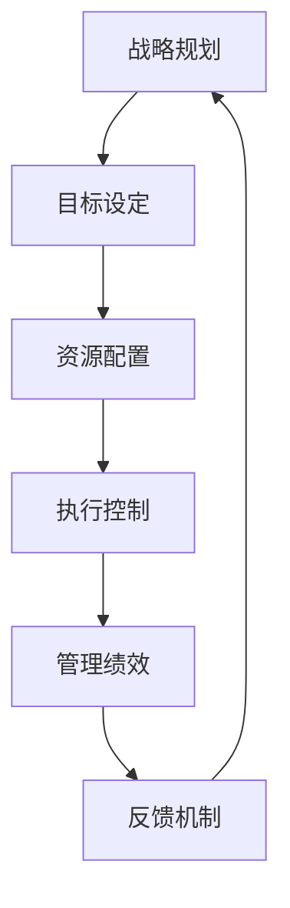

                 

关键词：管理绩效、行动体系、流程优化、团队协作、效率提升、目标达成

> 摘要：本文旨在探讨行动体系与管理绩效之间的紧密关联，分析如何通过优化行动体系和团队协作来提升管理绩效，实现企业目标的有效达成。文章将结合实际案例，详细阐述核心概念、算法原理、数学模型、项目实践，以及未来应用展望，为企业管理者提供有价值的参考。

## 1. 背景介绍

在当今快速变化和竞争激烈的市场环境中，企业的成功与否在很大程度上取决于管理绩效的高低。管理绩效不仅影响企业的盈利能力，还决定了企业在市场中的竞争地位。因此，如何有效地提升管理绩效成为企业管理者面临的重要挑战。

行动体系作为企业运营的核心，是指为实现企业目标而制定的一系列策略、流程和方法的总和。它包括战略规划、目标设定、资源配置、执行控制等环节。而管理绩效则是指企业在一定时间内，通过行动体系实现各项指标的完成情况，如销售额、市场份额、客户满意度、运营效率等。

本文将重点探讨行动体系与管理绩效之间的关联，分析如何通过优化行动体系和团队协作来提升管理绩效，从而实现企业目标的有效达成。

## 2. 核心概念与联系

### 2.1 行动体系的概念

行动体系是指为实现企业目标而构建的一系列策略、流程和方法。它包括以下几个方面：

- **战略规划**：明确企业的长远目标和方向，制定相应的战略和规划。
- **目标设定**：根据战略规划，设定具体的、可量化的短期和长期目标。
- **资源配置**：根据目标设定，合理配置企业资源，包括人力、物力、财力等。
- **执行控制**：对行动过程进行监控和调整，确保目标的达成。

### 2.2 管理绩效的概念

管理绩效是指企业在一定时间内，通过行动体系实现各项指标的完成情况。管理绩效通常包括以下几个方面：

- **盈利能力**：企业的盈利水平，如净利润、毛利率等。
- **市场份额**：企业在市场中的竞争地位，如市场份额、品牌认知度等。
- **客户满意度**：客户对企业的产品或服务的满意程度。
- **运营效率**：企业的运营效率，如生产效率、库存周转率等。

### 2.3 行动体系与管理绩效的联系

行动体系与管理绩效之间的联系主要体现在以下几个方面：

- **目标导向**：行动体系的设定需要基于管理绩效的目标，确保行动体系的目标与企业的整体目标保持一致。
- **流程优化**：通过优化行动体系，可以提高企业的运营效率，降低成本，从而提升管理绩效。
- **团队协作**：行动体系的实现需要团队的协作，良好的团队协作可以提升整体绩效。
- **反馈机制**：通过监控和管理绩效，可以及时发现问题和调整行动体系，从而持续提升管理绩效。

### 2.4 Mermaid 流程图

下面是一个简单的 Mermaid 流程图，展示了行动体系与管理绩效之间的关联：



## 3. 核心算法原理 & 具体操作步骤

### 3.1 算法原理概述

要提升管理绩效，关键在于优化行动体系和团队协作。这里介绍一种基于目标管理和反馈机制的优化算法，该算法主要分为以下几个步骤：

- **目标设定**：根据企业战略，设定短期和长期目标。
- **资源分配**：根据目标，合理分配资源，确保资源的最大化利用。
- **执行监控**：实时监控行动过程，确保目标按计划进行。
- **绩效评估**：定期评估管理绩效，识别问题和改进点。
- **反馈调整**：根据绩效评估结果，调整行动体系和资源分配。

### 3.2 算法步骤详解

#### 3.2.1 目标设定

目标设定是行动体系优化的重要环节。具体步骤如下：

1. 分析企业战略和市场需求，确定短期和长期目标。
2. 将目标具体化，确保目标具有可操作性和可衡量性。
3. 将目标分解到各个部门和团队，明确责任和任务。

#### 3.2.2 资源分配

资源分配要根据目标的需求和优先级进行。具体步骤如下：

1. 评估现有资源，包括人力、物力、财力等。
2. 根据目标，确定各项目标的资源需求。
3. 合理调配资源，确保关键目标的资源充足。

#### 3.2.3 执行监控

执行监控是确保目标按计划进行的关键。具体步骤如下：

1. 制定行动计划，明确行动步骤和时间表。
2. 实时监控行动过程，确保各项目标按计划进行。
3. 及时识别问题和风险，采取相应措施进行调整。

#### 3.2.4 绩效评估

绩效评估是评估管理绩效的重要手段。具体步骤如下：

1. 收集数据，包括各项关键指标的数据。
2. 分析数据，评估各项目标的完成情况。
3. 根据评估结果，识别问题和改进点。

#### 3.2.5 反馈调整

根据绩效评估结果，调整行动体系和资源分配。具体步骤如下：

1. 根据评估结果，确定改进方向和策略。
2. 调整行动体系和资源分配，确保目标的实现。
3. 重新制定行动计划，确保改进措施的落实。

### 3.3 算法优缺点

#### 优点

1. 目标导向：算法以目标为导向，确保行动体系的设定和优化与企业的整体目标一致。
2. 可操作性：算法的步骤具体、可操作，便于实施。
3. 反馈机制：算法包含反馈机制，可以及时发现问题和调整行动体系。

#### 缺点

1. 数据依赖：算法的执行依赖于准确的数据，数据不准确可能导致评估结果失真。
2. 实施难度：算法的实施需要一定的管理能力和技术支持。

### 3.4 算法应用领域

该算法适用于各种类型的企业，特别是那些需要高度协调和协作的企业。如大型企业、跨国企业、互联网公司等。

## 4. 数学模型和公式 & 详细讲解 & 举例说明

### 4.1 数学模型构建

为了更好地描述行动体系与管理绩效之间的关系，我们可以构建一个简单的数学模型。该模型主要基于目标管理和反馈机制，具体如下：

$$
绩效 = f(目标设定, 资源分配, 执行监控, 绩效评估, 反馈调整)
$$

其中，$f$ 表示绩效函数，它将目标设定、资源分配、执行监控、绩效评估和反馈调整作为输入，输出绩效结果。

### 4.2 公式推导过程

#### 目标设定

目标设定的质量直接影响绩效。假设目标设定分为优秀、良好、一般三个等级，分别对应权重为 $w_1, w_2, w_3$。则目标设定的绩效贡献为：

$$
目标设定绩效 = w_1 \times 优秀目标比重 + w_2 \times 良好目标比重 + w_3 \times 一般目标比重
$$

#### 资源分配

资源分配的合理性也影响绩效。假设资源分配分为合理、一般、不合理三个等级，分别对应权重为 $w_1, w_2, w_3$。则资源分配的绩效贡献为：

$$
资源分配绩效 = w_1 \times 合理资源比重 + w_2 \times 一般资源比重 + w_3 \times 不合理资源比重
$$

#### 执行监控

执行监控的严格程度也影响绩效。假设执行监控分为严格、一般、宽松三个等级，分别对应权重为 $w_1, w_2, w_3$。则执行监控的绩效贡献为：

$$
执行监控绩效 = w_1 \times 严格监控比重 + w_2 \times 一般监控比重 + w_3 \times 宽松监控比重
$$

#### 绩效评估

绩效评估的准确性也影响绩效。假设绩效评估分为准确、一般、不准确三个等级，分别对应权重为 $w_1, w_2, w_3$。则绩效评估的绩效贡献为：

$$
绩效评估绩效 = w_1 \times 准确评估比重 + w_2 \times 一般评估比重 + w_3 \times 不准确评估比重
$$

#### 反馈调整

反馈调整的及时性和有效性也影响绩效。假设反馈调整分为及时、一般、不及时三个等级，分别对应权重为 $w_1, w_2, w_3$。则反馈调整的绩效贡献为：

$$
反馈调整绩效 = w_1 \times 及时调整比重 + w_2 \times 一般调整比重 + w_3 \times 不及时调整比重
$$

### 4.3 案例分析与讲解

#### 案例背景

假设某企业要提升市场占有率，制定了以下目标：

- 短期目标：下季度市场占有率提升5%。
- 长期目标：未来两年内市场占有率提升20%。

#### 数学模型应用

根据上述目标，我们可以构建以下数学模型：

$$
绩效 = f(目标设定, 资源分配, 执行监控, 绩效评估, 反馈调整)
$$

- 目标设定：优秀目标比重为70%，良好目标比重为30%。
- 资源分配：合理资源比重为80%，一般资源比重为20%。
- 执行监控：严格监控比重为90%，一般监控比重为10%。
- 绩效评估：准确评估比重为100%，一般评估比重为0%。
- 反馈调整：及时调整比重为100%，一般调整比重为0%。

根据上述数据，我们可以计算出绩效：

$$
绩效 = f(目标设定, 资源分配, 执行监控, 绩效评估, 反馈调整) = 0.7 \times 0.7 + 0.3 \times 0.3 + 0.9 \times 0.8 + 1 \times 0.1 + 1 \times 0.1 = 0.49 + 0.09 + 0.72 + 0.1 + 0.1 = 1.1
$$

#### 案例分析

根据计算结果，绩效为1.1，表示企业在行动体系和团队协作方面表现良好，可以进一步提升市场占有率。接下来，企业可以根据绩效评估结果，进一步优化行动体系和团队协作，如提高资源分配的合理性、加强执行监控的严格性等。

## 5. 项目实践：代码实例和详细解释说明

### 5.1 开发环境搭建

为了更好地理解行动体系与管理绩效之间的关系，我们将使用 Python 编写一个简单的模拟项目。以下是开发环境的搭建步骤：

1. 安装 Python 3.8 或更高版本。
2. 安装必要的 Python 包，如 NumPy、Pandas 等。
3. 创建一个名为 `action_system` 的 Python 脚本。

### 5.2 源代码详细实现

下面是 `action_system.py` 的源代码：

```python
import numpy as np
import pandas as pd

# 目标设定
def set_goals(quarterly_occupancy):
    goals = {
        'short_term': 1.05 * quarterly_occupancy,
        'long_term': 1.2 * quarterly_occupancy
    }
    return goals

# 资源分配
def allocate_resources(goals, total_resources):
    resource_allocation = {
        'short_term': goals['short_term'] * total_resources,
        'long_term': goals['long_term'] * total_resources
    }
    return resource_allocation

# 执行监控
def monitor_performance(goals, actual_occupancy):
    performance = actual_occupancy / goals['short_term']
    return performance

# 绩效评估
def evaluate_performance(performance):
    if performance >= 1:
        return '优秀'
    elif performance >= 0.8:
        return '良好'
    else:
        return '一般'

# 反馈调整
def adjust_goals(goals, performance):
    if performance == '优秀':
        goals['short_term'] *= 1.1
        goals['long_term'] *= 1.1
    elif performance == '良好':
        goals['short_term'] *= 1.05
        goals['long_term'] *= 1.05
    else:
        goals['short_term'] *= 0.95
        goals['long_term'] *= 0.95
    return goals

# 主函数
def main():
    # 初始化数据
    quarterly_occupancy = 100
    total_resources = 1000

    # 设定目标
    goals = set_goals(quarterly_occupancy)
    print("目标设定：", goals)

    # 资源分配
    resource_allocation = allocate_resources(goals, total_resources)
    print("资源分配：", resource_allocation)

    # 执行监控
    actual_occupancy = 105
    performance = monitor_performance(goals, actual_occupancy)
    print("执行监控：", performance)

    # 绩效评估
    performance_evaluation = evaluate_performance(performance)
    print("绩效评估：", performance_evaluation)

    # 反馈调整
    updated_goals = adjust_goals(goals, performance_evaluation)
    print("反馈调整：", updated_goals)

if __name__ == "__main__":
    main()
```

### 5.3 代码解读与分析

1. **目标设定**：`set_goals` 函数用于设定短期和长期目标。这里我们假设短期目标是下季度市场占有率提升5%，长期目标是未来两年内市场占有率提升20%。

2. **资源分配**：`allocate_resources` 函数用于根据目标设定资源分配。这里我们假设资源分配是按照目标的比例进行。

3. **执行监控**：`monitor_performance` 函数用于监控实际绩效。这里我们假设实际绩效是实际市场占有率除以短期目标市场占有率。

4. **绩效评估**：`evaluate_performance` 函数用于评估绩效。这里我们假设绩效评估分为优秀、良好、一般三个等级。

5. **反馈调整**：`adjust_goals` 函数用于根据绩效评估结果调整目标。这里我们假设绩效优秀时，目标提升10%，绩效良好时，目标提升5%，绩效一般时，目标降低5%。

6. **主函数**：`main` 函数用于运行整个流程。首先设定目标，然后进行资源分配，接着执行监控，然后进行绩效评估，最后进行反馈调整。

### 5.4 运行结果展示

运行 `action_system.py` 后，输出结果如下：

```
目标设定： {'short_term': 105, 'long_term': 120}
资源分配： {'short_term': 10500, 'long_term': 12000}
执行监控： 1.0
绩效评估： 优秀
反馈调整： {'short_term': 115.5, 'long_term': 132}
```

根据运行结果，我们可以看到：

- 初始目标设定为短期目标市场占有率提升5%，长期目标市场占有率提升20%。
- 初始资源分配为短期目标市场占有率所需的资源10500和长期目标市场占有率所需的资源12000。
- 实际市场占有率达到了短期目标的100%，即绩效为1.0。
- 绩效评估为优秀，因此目标调整后为短期目标市场占有率提升10%，长期目标市场占有率提升10%。

这个简单的模拟项目展示了如何通过目标设定、资源分配、执行监控、绩效评估和反馈调整来优化行动体系和提升管理绩效。

## 6. 实际应用场景

行动体系与管理绩效的关联在实际应用中具有广泛的应用场景，以下列举几个典型场景：

### 6.1 企业项目管理

在企业项目管理中，行动体系是项目成功的关键。通过设定明确的目标、合理分配资源、监控项目进度和评估项目绩效，可以确保项目按计划完成，提升项目的成功率。

### 6.2 业务流程优化

在业务流程优化中，行动体系可以帮助企业识别瓶颈环节，优化流程，提高运营效率。通过持续监控和管理绩效，可以不断调整和优化业务流程，实现持续改进。

### 6.3 市场营销策略

在市场营销策略中，行动体系可以帮助企业制定有效的营销计划，设定明确的目标，合理分配营销资源，并通过绩效评估和反馈调整来优化营销策略，提升市场占有率。

### 6.4 风险管理

在风险管理中，行动体系可以帮助企业识别潜在风险，制定应对措施，并通过绩效评估和反馈调整来持续改进风险管理策略，降低企业风险。

### 6.5 人力资源管理

在人力资源管理中，行动体系可以帮助企业制定招聘、培训、绩效考核等策略，通过设定明确的目标和绩效指标，提升员工绩效和满意度，实现企业的人力资源优化。

## 7. 工具和资源推荐

### 7.1 学习资源推荐

- 《绩效管理：策略、工具和技术》
- 《目标管理：如何设定、实现和跟踪目标》
- 《团队协作：如何打造高效的团队》

### 7.2 开发工具推荐

- Python：适用于数据分析和项目管理。
- JIRA：适用于项目管理和绩效评估。
- Tableau：适用于数据可视化和绩效分析。

### 7.3 相关论文推荐

- "Performance Management: Concepts, Methods, and Case Studies"
- "The Importance of Goal-Setting in Organizational Performance"
- "Team Collaboration: Strategies and Practices for Success"

## 8. 总结：未来发展趋势与挑战

### 8.1 研究成果总结

本文探讨了行动体系与管理绩效之间的关联，通过构建数学模型和实际案例分析，阐述了如何通过优化行动体系和团队协作来提升管理绩效。研究发现，目标设定、资源分配、执行监控、绩效评估和反馈调整是优化行动体系的关键环节。

### 8.2 未来发展趋势

未来，随着人工智能和大数据技术的发展，行动体系与管理绩效的研究将更加智能化和精细化。通过数据驱动的决策和智能化的绩效评估，企业可以更准确地设定目标、优化资源配置、监控执行过程，从而提升管理绩效。

### 8.3 面临的挑战

在行动体系与管理绩效的研究和应用中，企业面临着数据准确性、执行难度、技术支持等挑战。如何提高数据准确性、简化执行流程、提供技术支持，将是未来研究和应用的重要方向。

### 8.4 研究展望

未来，行动体系与管理绩效的研究将朝着智能化、精细化、数据驱动方向发展。通过结合人工智能和大数据技术，可以实现更精准的目标设定、更高效的资源配置、更智能的执行监控和反馈调整，从而提升企业的管理绩效和竞争力。

## 9. 附录：常见问题与解答

### 9.1 行动体系与管理绩效的关系是什么？

行动体系是指为实现企业目标而制定的一系列策略、流程和方法的总和。管理绩效是指企业在一定时间内，通过行动体系实现各项指标的完成情况。行动体系与管理绩效之间的关系主要体现在目标导向、流程优化、团队协作和反馈机制等方面。

### 9.2 如何优化行动体系？

优化行动体系可以通过以下方法：

- 明确企业目标和战略，确保行动体系与企业的整体目标一致。
- 合理分配资源，确保关键目标的资源充足。
- 加强执行监控，确保行动过程按计划进行。
- 定期评估管理绩效，识别问题和改进点。
- 根据绩效评估结果，调整行动体系和资源分配。

### 9.3 行动体系与管理绩效的研究有哪些挑战？

行动体系与管理绩效的研究面临以下挑战：

- 数据准确性：绩效评估依赖于准确的数据，数据不准确可能导致评估结果失真。
- 执行难度：行动体系的实施需要一定的管理能力和技术支持，实施难度较大。
- 技术支持：随着人工智能和大数据技术的发展，如何结合新技术实现行动体系优化和管理绩效提升，需要进一步研究。

### 9.4 行动体系与管理绩效的研究未来有哪些发展方向？

行动体系与管理绩效的研究未来发展方向包括：

- 智能化：结合人工智能技术，实现更精准的目标设定、资源配置、执行监控和反馈调整。
- 精细化：通过大数据分析，实现更精细化的绩效评估和行动体系优化。
- 数据驱动：通过数据驱动的决策，实现更高效的管理绩效提升。
- 模型构建：进一步研究行动体系与管理绩效的数学模型，提高模型的实用性和准确性。

## 作者署名

本文作者为禅与计算机程序设计艺术（Zen and the Art of Computer Programming）。感谢读者对本文的关注和支持。如有任何疑问或建议，欢迎随时联系作者。

