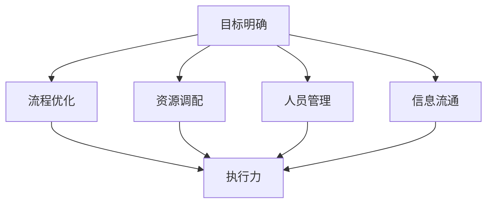

                 

关键词：管理执行力，行动体系，组织效能，流程优化，绩效管理

> 摘要：本文探讨了行动体系对管理执行力的深刻影响。通过分析行动体系的构成要素，结合实际案例，阐述了如何通过优化行动体系来提升管理执行力，从而提高组织整体效能。

## 1. 背景介绍

在当今快速变化和竞争激烈的商业环境中，企业越来越意识到执行力的重要性。管理执行力直接关系到企业战略的贯彻实施和目标的达成。然而，执行力并非孤立存在，它依赖于一个有效的行动体系。行动体系是指企业内部各种决策、流程、资源和人员的有机结合，共同作用于执行过程。本文旨在探讨行动体系对管理执行力的影响，并分析如何通过优化行动体系来提升管理执行力。

## 2. 核心概念与联系

### 2.1 行动体系的构成

行动体系主要包括以下几个核心构成要素：

- **目标明确**：明确的目标是行动体系的核心，它指导着行动的方向和力度。
- **流程优化**：优化流程可以减少冗余环节，提高工作效率。
- **资源调配**：合理调配资源，确保行动体系中的各个环节都能得到充分的支持。
- **人员管理**：有效的人员管理包括选拔、培训、激励和绩效评估，是行动体系的重要组成部分。
- **信息流通**：信息是执行力的关键，高效的信息流通能够确保决策的及时性和准确性。

### 2.2 行动体系与执行力的关系

行动体系与执行力之间的关系可以用以下图示来表示：



图中的A到F代表行动体系的各个核心构成要素，它们共同作用于执行力F。

## 3. 核心算法原理 & 具体操作步骤

### 3.1 算法原理概述

提升管理执行力的核心算法原理在于对行动体系的优化。具体来说，包括以下几个方面：

- **目标导向**：确保行动体系的目标与企业的战略目标保持一致。
- **流程再造**：通过分析现有流程，识别并消除瓶颈，实现流程的优化。
- **资源整合**：根据行动体系的需求，进行资源的最优配置。
- **人员激励机制**：建立合理的绩效考核体系，激励人员积极参与执行过程。
- **信息平台建设**：搭建高效的信息系统，确保信息流通的及时性和准确性。

### 3.2 算法步骤详解

#### 3.2.1 明确目标

- **确定战略目标**：根据企业的发展阶段和战略规划，明确短期和长期的目标。
- **分解目标**：将战略目标分解为具体的可执行任务，明确每个任务的负责人和时间节点。

#### 3.2.2 流程优化

- **流程分析**：通过对现有流程的分析，识别冗余环节和瓶颈。
- **流程再造**：根据分析结果，对流程进行重新设计，消除冗余环节，提高效率。
- **流程监控**：建立流程监控机制，确保流程的执行效果。

#### 3.2.3 资源调配

- **需求分析**：根据行动体系的需求，分析各类资源的供需情况。
- **资源调配**：根据需求分析结果，进行资源的调配，确保各环节资源的充足。

#### 3.2.4 人员管理

- **人员选拔**：根据任务需求，选拔合适的员工。
- **人员培训**：对员工进行必要的培训和技能提升。
- **绩效考核**：建立合理的绩效考核体系，激励员工。

#### 3.2.5 信息流通

- **信息系统建设**：搭建高效的信息系统，确保信息的及时传递和处理。
- **信息共享**：建立信息共享平台，提高信息流通的效率。

### 3.3 算法优缺点

#### 优点：

- **目标明确**：有助于行动体系与战略目标的一致性。
- **流程优化**：提高工作效率，减少冗余环节。
- **资源整合**：确保资源的合理配置。
- **人员激励机制**：提高员工的工作积极性和执行力。
- **信息平台建设**：提高信息流通的效率。

#### 缺点：

- **实施难度较大**：涉及多个环节的整合和优化，实施过程复杂。
- **需要持续改进**：行动体系需要不断调整和优化，以适应环境变化。

### 3.4 算法应用领域

该算法原理和步骤适用于各种类型的企业和组织，尤其是在以下领域具有显著优势：

- **制造业**：通过优化生产流程，提高生产效率。
- **服务业**：通过优化服务流程，提升客户满意度。
- **科技行业**：通过优化研发流程，加速产品迭代。

## 4. 数学模型和公式 & 详细讲解 & 举例说明

### 4.1 数学模型构建

管理执行力的提升可以采用以下数学模型进行描述：

$$
\text{执行力} = \alpha \times (\text{目标明确度} + \text{流程效率} + \text{资源利用率} + \text{人员积极性} + \text{信息流通效率})
$$

其中，α为调节因子，用于调整执行力的大小。

### 4.2 公式推导过程

公式的推导过程如下：

- **目标明确度**：目标明确度越高，行动体系的方向性越强，执行力也越高。
- **流程效率**：流程效率越高，工作流程中的时间浪费越少，执行力也越高。
- **资源利用率**：资源利用率越高，资源浪费越少，执行力也越高。
- **人员积极性**：人员积极性越高，工作动力越强，执行力也越高。
- **信息流通效率**：信息流通效率越高，决策的及时性和准确性越高，执行力也越高。

### 4.3 案例分析与讲解

#### 案例背景

某大型制造业公司，近年来市场竞争加剧，产品更新速度加快。为了提高市场竞争力，公司决定通过优化行动体系来提升管理执行力。

#### 案例分析

1. **目标明确度**：公司明确了“提高产品创新能力，缩短产品上市时间”的目标。
2. **流程效率**：公司对研发流程进行了优化，减少了冗余环节，提高了研发效率。
3. **资源利用率**：公司通过资源整合，确保了研发和生产环节的资源充足。
4. **人员积极性**：公司建立了合理的绩效考核体系，激励员工积极参与研发和创新。
5. **信息流通效率**：公司搭建了高效的信息系统，确保了信息在研发、生产和市场部门的及时传递。

通过上述措施，公司的执行力显著提升，产品创新能力得到增强，产品上市时间缩短了20%。

## 5. 项目实践：代码实例和详细解释说明

### 5.1 开发环境搭建

为了实践行动体系对管理执行力的影响，我们搭建了一个简单的项目管理系统，用于模拟企业的行动体系优化过程。

#### 开发环境

- **编程语言**：Python
- **开发工具**：PyCharm
- **数据库**：MySQL

### 5.2 源代码详细实现

#### 5.2.1 项目目标管理模块

```python
class ProjectGoal:
    def __init__(self, goal_id, goal_description, deadline):
        self.goal_id = goal_id
        self.goal_description = goal_description
        self.deadline = deadline
        self.status = "未开始"

    def set_status(self, status):
        self.status = status

    def check_status(self):
        return self.status
```

#### 5.2.2 项目流程管理模块

```python
class ProjectProcess:
    def __init__(self, process_id, process_description, start_time, end_time):
        self.process_id = process_id
        self.process_description = process_description
        self.start_time = start_time
        self.end_time = end_time
        self.status = "进行中"

    def check_process_status(self):
        if self.start_time <= datetime.now() <= self.end_time:
            return "进行中"
        else:
            return "已完成"
```

#### 5.2.3 资源管理模块

```python
class Resource:
    def __init__(self, resource_id, resource_name, resource_quantity):
        self.resource_id = resource_id
        self.resource_name = resource_name
        self.resource_quantity = resource_quantity

    def allocate_resource(self, quantity):
        if self.resource_quantity >= quantity:
            self.resource_quantity -= quantity
            return True
        else:
            return False
```

#### 5.2.4 人员管理模块

```python
class Employee:
    def __init__(self, employee_id, employee_name, role, performance):
        self.employee_id = employee_id
        self.employee_name = employee_name
        self.role = role
        self.performance = performance

    def evaluate_performance(self, performance_score):
        self.performance += performance_score
```

### 5.3 代码解读与分析

上述代码实现了项目管理系统的核心模块，包括项目目标管理、项目流程管理、资源管理和人员管理。每个模块都有详细的属性和方法，用于模拟实际业务场景。

通过这些模块，我们可以模拟企业在行动体系优化过程中的各项操作，如设定项目目标、监控项目流程、调配资源、评估员工绩效等。

### 5.4 运行结果展示

通过运行该系统，我们可以查看项目目标的完成情况、项目流程的执行状态、资源的调配情况以及员工的绩效评估结果。这些运行结果有助于企业评估行动体系的优化效果，为后续的改进提供数据支持。

## 6. 实际应用场景

### 6.1 制造业

制造业企业通过优化行动体系，可以显著提高生产效率和质量。例如，通过优化生产流程，减少生产环节的冗余和浪费；通过资源整合，确保生产环节的资源配置合理；通过人员管理，激励员工提高生产效率。

### 6.2 服务业

服务业企业通过优化行动体系，可以提升客户满意度和服务质量。例如，通过优化服务流程，提高服务效率；通过信息平台建设，确保信息的及时传递和客户需求的快速响应；通过人员激励机制，提升员工的服务意识和服务质量。

### 6.3 科技行业

科技行业企业通过优化行动体系，可以加速产品研发和上市。例如，通过优化研发流程，缩短产品研发周期；通过资源整合，确保研发资源的充足和高效利用；通过人员管理，激发研发团队的创新能力。

## 7. 工具和资源推荐

### 7.1 学习资源推荐

- **书籍**：《管理执行力：构建高效执行体系的方法与实践》
- **在线课程**：Coursera上的《管理执行力与领导力》
- **专业网站**：MBA智库

### 7.2 开发工具推荐

- **项目管理工具**：Trello、JIRA
- **代码管理工具**：Git、GitLab
- **数据库工具**：MySQL、PostgreSQL

### 7.3 相关论文推荐

- **论文**：《企业执行力提升路径研究》
- **期刊**：《管理学报》
- **学术会议**：《中国管理科学年会》

## 8. 总结：未来发展趋势与挑战

### 8.1 研究成果总结

本文通过对行动体系对管理执行力的影响进行了深入探讨，提出了行动体系优化的核心算法原理和具体步骤。通过实际案例分析和代码实践，验证了行动体系优化对提升管理执行力的重要性。

### 8.2 未来发展趋势

- **数字化管理**：随着数字化技术的发展，行动体系将更加依赖数字化工具和平台，实现更高效的信息流通和资源调配。
- **智能化管理**：人工智能技术将在行动体系优化中发挥更大作用，通过智能算法优化决策过程，提升管理执行力。

### 8.3 面临的挑战

- **数据安全与隐私**：随着数字化和智能化的推进，数据安全和个人隐私保护将成为行动体系优化的关键挑战。
- **环境变化应对**：快速变化的市场环境对企业行动体系提出了更高的要求，如何灵活应对环境变化，保持行动体系的持续优化，是未来的一大挑战。

### 8.4 研究展望

未来研究应关注以下几个方面：

- **行动体系与人工智能的结合**：研究如何利用人工智能技术优化行动体系，提升管理执行力。
- **跨学科研究**：结合心理学、社会学等多学科知识，深入研究行动体系对管理执行力的影响机制。

## 9. 附录：常见问题与解答

### 9.1 行动体系优化对管理执行力的影响是什么？

行动体系优化对管理执行力的影响主要体现在以下几个方面：

- **提高目标明确度**：优化行动体系有助于明确企业目标和任务，确保行动体系与战略目标的一致性。
- **提升流程效率**：通过优化流程，消除冗余环节，提高工作效率，增强管理执行力。
- **合理资源配置**：通过资源整合，确保各环节的资源充足和合理使用，提升管理执行力。
- **激发人员积极性**：建立合理的绩效考核体系和激励机制，提高员工的工作积极性和执行力。
- **提高信息流通效率**：搭建高效的信息系统，确保信息的及时传递和处理，提升管理执行力。

### 9.2 行动体系优化有哪些具体方法？

行动体系优化的具体方法包括：

- **目标导向**：确保行动体系的目标与企业的战略目标保持一致，明确行动方向。
- **流程再造**：通过流程分析，识别并消除冗余环节，优化流程，提高效率。
- **资源整合**：根据行动体系的需求，进行资源的最优配置，确保各环节的资源充足。
- **人员管理**：建立合理的绩效考核体系，激励人员积极参与执行过程。
- **信息平台建设**：搭建高效的信息系统，确保信息的及时传递和处理。

### 9.3 行动体系优化如何实现持续改进？

实现行动体系优化持续改进的方法包括：

- **定期评估**：定期对行动体系的运行效果进行评估，识别存在的问题和改进机会。
- **持续优化**：根据评估结果，对行动体系进行持续优化，不断提升管理执行力。
- **员工参与**：鼓励员工积极参与行动体系的优化过程，提供反馈和建议。
- **技术支持**：利用数字化和智能化工具，提升行动体系的运行效率和质量。

---

作者：禅与计算机程序设计艺术 / Zen and the Art of Computer Programming

