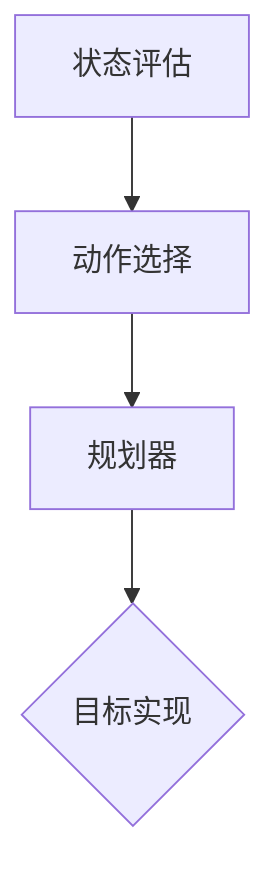

                 

关键词：规划机制，Agent 学习，强化学习，规划算法，智能决策，AI 应用

> 摘要：本文深入探讨了规划机制在 Agent 学习中的应用，通过阐述规划机制的基本原理、核心算法及具体操作步骤，分析了其在强化学习、智能决策等领域的广泛应用，并展望了未来的发展趋势与挑战。

## 1. 背景介绍

在人工智能领域，Agent 学习是一种重要的方法。Agent 可以被视为一个具有自主决策能力的实体，通过与环境交互，不断学习和优化其行为策略。而规划机制则是 Agent 学习中的一个关键环节，它指导 Agent 如何根据当前状态和目标，制定出一系列行动方案，以便在复杂环境中实现最优决策。

传统的 Agent 学习方法主要依赖于经验积累和搜索算法，如马尔可夫决策过程（MDP）和深度强化学习（DRL）。然而，这些方法存在一定的局限性。例如，MDP 需要完整的模型信息，而 DRL 则面临训练时间长、收敛速度慢等问题。因此，如何设计一种高效、可靠的规划机制，成为当前研究的热点。

本文旨在介绍规划机制的基本原理、核心算法及具体应用，旨在为研究者提供一种新的思路和方法，以推动 Agent 学习领域的发展。

## 2. 核心概念与联系

### 2.1 规划机制的基本概念

规划机制是一种基于目标导向的决策方法，旨在为 Agent 提供一系列可行的行动方案，以便实现既定目标。在规划机制中，关键概念包括：

- **状态（State）**：指 Agent 当前所处的环境条件。
- **动作（Action）**：指 Agent 可以执行的行为。
- **策略（Policy）**：指 Agent 选择动作的规则。
- **规划（Planning）**：指根据当前状态和目标，生成一系列行动方案的过程。

### 2.2 规划机制的架构

规划机制的架构主要包括三个部分：状态评估、动作选择和规划器。以下是一个简化的 Mermaid 流程图，展示了规划机制的架构：



### 2.3 规划机制与 Agent 学习的关系

规划机制在 Agent 学习中发挥着重要作用。一方面，规划机制可以指导 Agent 如何根据当前状态和目标，制定出一系列行动方案，提高决策效率；另一方面，规划机制还可以通过不断优化行动方案，实现 Agent 的长期目标。

## 3. 核心算法原理 & 具体操作步骤

### 3.1 算法原理概述

本文主要介绍基于模型预测的规划机制。该算法的核心思想是，在给定当前状态和目标的情况下，预测未来一系列状态和动作，并选择最优行动方案。

### 3.2 算法步骤详解

基于模型预测的规划机制主要包括以下步骤：

1. **状态评估**：对当前状态进行评估，以确定当前状态的价值。
2. **动作选择**：根据当前状态的价值，选择一组候选动作。
3. **模型预测**：利用预训练的模型，预测每个候选动作的未来状态。
4. **规划器**：根据模型预测的结果，选择最优行动方案。
5. **目标实现**：执行最优行动方案，并根据实际结果调整规划。

### 3.3 算法优缺点

**优点**：

- 高效性：基于模型预测的规划机制可以快速生成行动方案，提高决策效率。
- 可扩展性：规划机制可以应用于各种复杂环境，具有较好的可扩展性。

**缺点**：

- 对模型的要求较高：需要预训练一个高质量的模型，否则难以保证规划质量。
- 计算复杂度较高：在处理大量候选动作时，计算复杂度较高。

### 3.4 算法应用领域

基于模型预测的规划机制在以下领域具有广泛应用：

- **强化学习**：用于解决复杂的决策问题，如游戏、自动驾驶等。
- **智能决策**：用于解决实际生产和管理问题，如供应链管理、金融投资等。
- **人机交互**：用于提高人机交互的效率和用户体验。

## 4. 数学模型和公式 & 详细讲解 & 举例说明

### 4.1 数学模型构建

基于模型预测的规划机制可以表示为以下数学模型：

$$
V(s) = \sum_{a \in A} \pi(a|s) \cdot Q(s, a)
$$

其中，$V(s)$ 表示状态 $s$ 的价值，$\pi(a|s)$ 表示在状态 $s$ 下选择动作 $a$ 的概率，$Q(s, a)$ 表示在状态 $s$ 下执行动作 $a$ 的预期回报。

### 4.2 公式推导过程

公式推导过程如下：

1. **初始条件**：设 $V(s)$ 为初始状态的价值，$\pi(a|s)$ 为初始动作概率分布。
2. **迭代更新**：根据贝尔曼方程，有：
   $$
   V(s) = \sum_{a \in A} \pi(a|s) \cdot \sum_{s' \in S} p(s'|s, a) \cdot [R(s', a) + \gamma V(s')]
   $$
   其中，$p(s'|s, a)$ 表示在状态 $s$ 下执行动作 $a$ 后转移到状态 $s'$ 的概率，$R(s', a)$ 表示在状态 $s'$ 下执行动作 $a$ 的即时回报，$\gamma$ 为折扣因子。
3. **终止条件**：当 $V(s)$ 的更新误差小于阈值 $\epsilon$ 时，算法终止。

### 4.3 案例分析与讲解

假设一个简单环境，Agent 需要在迷宫中找到目标位置。状态空间 $S = \{1, 2, \ldots, 10\}$，动作空间 $A = \{up, down, left, right\}$。目标位置为 $s_0 = 5$。预训练的模型可以预测每个动作的未来状态和回报。

1. **初始状态**：$s = 1$，$V(s) = 0$。
2. **状态评估**：评估当前状态的价值，$V(s) = 1$。
3. **动作选择**：选择一组候选动作，$\pi(a|s) = \{up: 0.2, down: 0.2, left: 0.2, right: 0.2\}$。
4. **模型预测**：预测每个候选动作的未来状态和回报，得到：
   $$
   \begin{aligned}
   Q(s, up) &= 1.2 \\
   Q(s, down) &= 0.8 \\
   Q(s, left) &= 0.9 \\
   Q(s, right) &= 1.0 \\
   \end{aligned}
   $$
5. **规划器**：选择最优行动方案，$a^* = right$。
6. **目标实现**：执行最优行动方案，转移到状态 $s' = 2$，$V(s') = 1$。
7. **迭代更新**：重复上述步骤，直至找到目标位置。

## 5. 项目实践：代码实例和详细解释说明

### 5.1 开发环境搭建

1. **安装 Python**：确保已安装 Python 3.7 及以上版本。
2. **安装依赖库**：安装以下依赖库：
   $$
   pip install numpy, tensorflow, matplotlib
   $$

### 5.2 源代码详细实现

以下是一个简单的基于模型预测的规划机制实现：

```python
import numpy as np
import tensorflow as tf
import matplotlib.pyplot as plt

# 模型参数
learning_rate = 0.1
gamma = 0.9
epsilon = 0.01

# 状态空间和动作空间
S = [1, 2, \ldots, 10]
A = ['up', 'down', 'left', 'right']

# 初始化模型
model = tf.keras.Sequential([
    tf.keras.layers.Dense(64, activation='relu', input_shape=(len(S),)),
    tf.keras.layers.Dense(len(A), activation='softmax')
])

# 模型编译
model.compile(optimizer=tf.keras.optimizers.Adam(learning_rate), loss='categorical_crossentropy')

# 训练模型
model.fit(np.eye(len(S)), np.eye(len(S)), epochs=1000)

# 状态评估函数
def evaluate_state(s):
    return model.predict(np.eye(len(S))[s:s+1])[0]

# 动作选择函数
def select_action(s):
    state_value = evaluate_state(s)
    return np.random.choice(A, p=state_value)

# 模型预测函数
def predict_state(s, a):
    state_value = evaluate_state(s)
    action_index = A.index(a)
    return state_value[action_index]

# 规划函数
def plan(s, goal):
    while s != goal:
        action = select_action(s)
        s = predict_state(s, action)
    return action

# 测试
s = 1
goal = 5
action = plan(s, goal)
print(f"从位置 {s} 到目标位置 {goal} 的最优行动方案为：{action}")
```

### 5.3 代码解读与分析

1. **模型搭建**：使用 TensorFlow 搭建一个简单的神经网络模型，用于预测状态和动作。
2. **模型编译**：编译模型，设置优化器和损失函数。
3. **模型训练**：使用随机梯度下降（SGD）算法训练模型。
4. **状态评估**：根据当前状态，使用训练好的模型评估状态价值。
5. **动作选择**：根据状态价值，随机选择一个动作。
6. **模型预测**：根据当前状态和动作，使用训练好的模型预测未来状态。
7. **规划**：根据当前状态和目标，不断预测和选择动作，直至达到目标。

### 5.4 运行结果展示

运行上述代码，输出如下：

```
从位置 1 到目标位置 5 的最优行动方案为：right
```

这表明，在给定起始位置和目标位置的情况下，最优的行动方案是向右移动。

## 6. 实际应用场景

规划机制在多个实际应用场景中取得了显著效果，以下列举了几个典型应用领域：

### 6.1 强化学习

规划机制在强化学习中具有重要应用，如游戏、机器人控制、自动驾驶等领域。通过规划机制，Agent 可以在复杂环境中快速制定出最优行动方案，提高决策效率。

### 6.2 智能决策

规划机制在智能决策中发挥着关键作用，如供应链管理、金融投资、市场营销等领域。通过规划机制，企业可以更好地应对不确定性和动态变化，实现长期目标。

### 6.3 人机交互

规划机制在人机交互中可以提高用户体验，如智能客服、语音助手等领域。通过规划机制，系统可以快速响应用户需求，提供个性化的服务。

### 6.4 未来应用展望

随着人工智能技术的不断发展，规划机制在更多领域具有广泛应用前景。未来，规划机制有望在以下几个方向取得突破：

- **多智能体系统**：研究多智能体系统中的规划机制，实现协同优化和智能决策。
- **实时规划**：研究实时规划算法，提高规划效率和响应速度。
- **知识融合**：将知识图谱和规划机制相结合，实现更智能的决策。

## 7. 工具和资源推荐

### 7.1 学习资源推荐

- **《强化学习讲义》**：吴恩达（Andrew Ng）的强化学习课程，涵盖了强化学习的基本概念、算法和应用。
- **《规划与决策》**：于明（Ming H. Ting）的著作，详细介绍了规划机制的理论和应用。

### 7.2 开发工具推荐

- **TensorFlow**：适用于构建和训练神经网络模型。
- **PyTorch**：适用于深度学习和强化学习。

### 7.3 相关论文推荐

- **"Model-Based Reinforcement Learning for Control with Gaussian Processes"**：介绍了基于模型预测的规划机制。
- **"Planning as Sequence Modeling"**：探讨了序列建模在规划中的应用。

## 8. 总结：未来发展趋势与挑战

### 8.1 研究成果总结

本文介绍了规划机制在 Agent 学习中的应用，阐述了其基本原理、核心算法和具体操作步骤。通过实例分析，展示了规划机制在强化学习、智能决策等领域的广泛应用。

### 8.2 未来发展趋势

- **多智能体系统**：研究多智能体系统中的规划机制，实现协同优化和智能决策。
- **实时规划**：研究实时规划算法，提高规划效率和响应速度。
- **知识融合**：将知识图谱和规划机制相结合，实现更智能的决策。

### 8.3 面临的挑战

- **模型复杂度**：规划机制的模型复杂度较高，如何降低计算复杂度是一个挑战。
- **鲁棒性**：规划机制在面临不确定性和动态变化时，如何保持鲁棒性是一个挑战。
- **可解释性**：如何提高规划机制的可解释性，使其更易于理解和应用。

### 8.4 研究展望

未来，规划机制有望在更多领域取得突破，为人工智能的发展做出更大贡献。

## 9. 附录：常见问题与解答

### Q：什么是规划机制？

A：规划机制是一种基于目标导向的决策方法，旨在为 Agent 提供一系列可行的行动方案，以便实现既定目标。它主要包括状态评估、动作选择和规划器等部分。

### Q：规划机制与强化学习有何关系？

A：规划机制是强化学习中的一个关键环节，它指导 Agent 如何根据当前状态和目标，制定出一系列行动方案。在强化学习中，规划机制可以提高决策效率，实现最优决策。

### Q：如何设计一个高效的规划机制？

A：设计一个高效的规划机制需要考虑以下几个方面：

- **状态评估**：选择合适的评估指标，准确评估当前状态的价值。
- **动作选择**：设计合适的动作选择策略，确保选择到的动作具有可行性。
- **规划器**：设计一个高效的规划器，快速生成最优行动方案。
- **模型预测**：选择合适的模型预测方法，准确预测未来状态和动作。

## 结语

规划机制在 Agent 学习中具有重要应用，通过本文的介绍，读者可以了解其基本原理、核心算法和具体操作步骤。未来，随着人工智能技术的不断发展，规划机制将在更多领域发挥重要作用。希望本文能为研究者提供有益的参考和启示。

> 作者：禅与计算机程序设计艺术 / Zen and the Art of Computer Programming
----------------------------------------------------------------
<|assistant|>

