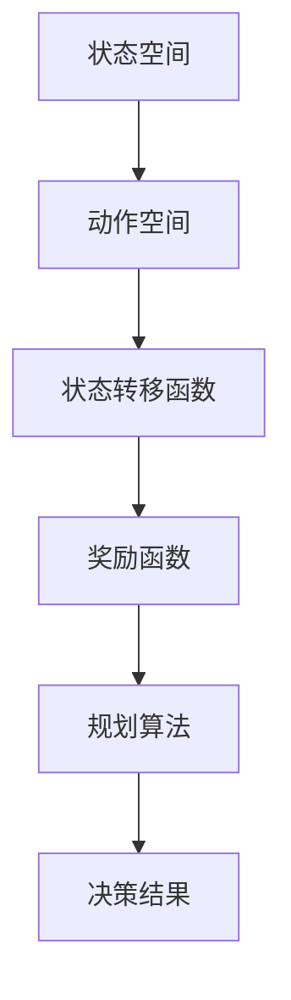

                 

关键词：智能自动化、规划机制、AI技术、机器学习、优化算法

摘要：本文旨在探讨规划机制在智能自动化中的应用，通过对核心概念的介绍、算法原理的分析、数学模型的构建以及实际案例的解析，旨在为读者提供一个全面而深入的理解。文章将重点讨论规划机制在智能自动化中的重要性，如何通过算法和数学模型实现智能自动化，以及未来发展的趋势和面临的挑战。

## 1. 背景介绍

随着人工智能（AI）和机器学习（ML）技术的迅猛发展，智能自动化已成为现代科技领域中一个重要的研究方向。从工业自动化到智能家居，从自动驾驶到智能客服，智能自动化正逐渐渗透到我们生活的方方面面。而规划机制作为智能自动化系统中的一个核心组成部分，起着至关重要的作用。

规划机制是一种旨在解决决策过程问题的技术，它通过预测、优化和调度等手段，使系统能够在复杂环境中做出最优决策。在智能自动化中，规划机制的应用不仅提高了系统的自主决策能力，还显著提升了系统的效率和可靠性。

本文将首先介绍规划机制的基本概念，然后深入探讨其在智能自动化中的应用，包括核心算法原理、数学模型构建、实际案例解析以及未来展望。

### 1.1 规划机制的定义

规划机制（Planning Mechanism）是一种在已知约束条件下，根据目标进行决策的过程。它旨在确定一系列步骤或动作序列，使得系统能够从初始状态转移到目标状态，并在此过程中实现预定的目标。规划机制通常包括以下几个关键组成部分：

1. **状态表示**：用于描述系统的当前状态。
2. **动作定义**：定义系统可以执行的动作及其对状态的影响。
3. **目标设定**：定义系统希望达到的目标状态。
4. **规划算法**：根据状态、动作和目标，选择最优的动作序列。

### 1.2 智能自动化的概念

智能自动化（Intelligent Automation）是指利用人工智能、机器学习等先进技术，实现对传统自动化系统的智能化升级。智能自动化系统具有自主感知、自主决策、自主执行的能力，能够在没有人为干预的情况下完成复杂任务。

智能自动化与传统自动化的区别在于，传统自动化依赖于预先设定的规则和程序，而智能自动化则通过学习和适应环境，自动调整行为以实现最优效果。

## 2. 核心概念与联系

在智能自动化中，规划机制的核心概念包括状态空间、动作空间、状态转移函数、奖励函数等。以下是一个简化的 Mermaid 流程图，用于描述这些概念之间的联系。



### 2.1 状态空间

状态空间（State Space）是系统所有可能状态的集合。在智能自动化中，状态通常表示系统的当前状态，如机器的运行状态、环境的变化等。状态空间是规划机制的基础，它决定了系统可以处于哪些状态。

### 2.2 动作空间

动作空间（Action Space）是系统可以执行的所有动作的集合。动作是系统对环境的响应，如机器的启动、停止、调整参数等。动作空间决定了系统如何响应不同的状态。

### 2.3 状态转移函数

状态转移函数（State Transition Function）描述了系统在执行特定动作后，从当前状态转移到下一个状态的概率。状态转移函数是规划机制的核心部分，它决定了系统如何从一个状态过渡到另一个状态。

### 2.4 奖励函数

奖励函数（Reward Function）用于评估系统在特定状态下执行特定动作后的效果。奖励函数可以是正的（表示成功）或负的（表示失败），它决定了系统在规划过程中的目标。

### 2.5 规划算法

规划算法（Planning Algorithm）是一种用于选择最优动作序列的算法。规划算法根据状态空间、动作空间、状态转移函数和奖励函数，通过搜索、优化等手段，找到从初始状态到目标状态的最优路径。

## 3. 核心算法原理 & 具体操作步骤

### 3.1 算法原理概述

规划算法的原理可以概括为以下几个步骤：

1. **状态空间搜索**：在给定的状态空间中，搜索所有可能的状态转移路径。
2. **路径评估**：对搜索到的路径进行评估，计算每个路径的奖励值。
3. **路径选择**：根据评估结果，选择奖励值最高的路径作为最优路径。
4. **动作执行**：按照最优路径执行相应的动作。

### 3.2 算法步骤详解

1. **初始化**：定义状态空间、动作空间、状态转移函数和奖励函数。
2. **状态空间搜索**：使用广度优先搜索（BFS）、深度优先搜索（DFS）或 A* 搜索算法，在状态空间中搜索所有可能的路径。
3. **路径评估**：对每个搜索到的路径，计算其奖励值。奖励值可以通过将路径上的所有奖励值相加得到。
4. **路径选择**：使用贪心策略或动态规划算法，选择奖励值最高的路径作为最优路径。
5. **动作执行**：按照最优路径执行相应的动作，实现系统的自主决策。

### 3.3 算法优缺点

**优点**：

- **高效性**：规划算法可以在复杂的环境中快速找到最优路径。
- **灵活性**：规划算法可以根据环境变化动态调整动作序列。
- **通用性**：规划算法适用于各种类型的智能自动化系统。

**缺点**：

- **计算复杂度**：对于大规模状态空间，规划算法的计算复杂度较高。
- **实时性**：在某些实时性要求较高的场景中，规划算法可能无法满足要求。
- **适应性**：规划算法对于环境变化的适应性较差。

### 3.4 算法应用领域

规划算法在智能自动化中具有广泛的应用领域，包括：

- **工业自动化**：用于生产线的调度和优化。
- **自动驾驶**：用于车辆的路径规划和行为决策。
- **智能家居**：用于设备的智能控制和生活服务的优化。
- **智能客服**：用于对话系统的自动生成和回复。

## 4. 数学模型和公式 & 详细讲解 & 举例说明

### 4.1 数学模型构建

在智能自动化中，规划机制的核心是状态空间搜索和路径评估。为了构建数学模型，我们需要定义以下几个关键参数：

- **状态空间 \(S\)**：系统可能处于的所有状态。
- **动作空间 \(A\)**：系统能够执行的所有动作。
- **状态转移函数 \(T(s, a, s'\)**：从状态 \(s\) 执行动作 \(a\) 后，转移到状态 \(s'\) 的概率。
- **奖励函数 \(R(s, a)\)**：在状态 \(s\) 执行动作 \(a\) 后获得的即时奖励。

### 4.2 公式推导过程

为了构建规划算法的数学模型，我们可以使用如下公式：

- **状态转移概率**：

  $$ P(s'|s, a) = T(s, a, s') $$

- **即时奖励**：

  $$ R(s, a) = R(s', a') $$

- **状态评估函数**：

  $$ V^*(s) = \max_a \sum_{s'} P(s'|s, a) \cdot R(s', a) $$

- **值函数**：

  $$ V(s) = \sum_{s'} P(s'|s, a) \cdot V^*(s') $$

### 4.3 案例分析与讲解

假设我们有一个智能机器人，它在室内环境中进行清洁任务。状态空间包括机器人的位置和清洁程度，动作空间包括移动到新位置和开始/停止清洁。状态转移函数根据机器人的移动方向和速度定义，奖励函数根据机器人的位置和清洁程度计算。

**示例**：

- **状态 \(s\)**：机器人在房间中央，清洁程度为 50%。
- **动作 \(a\)**：向右移动一格，开始清洁。
- **状态转移函数 \(T(s, a, s')\)**：机器人以 50% 的概率向右移动一格，以 50% 的概率保持在原位置。
- **奖励函数 \(R(s, a)\)**：如果机器人移动到了新的位置并开始清洁，则获得 +1 的奖励。

使用上述公式，我们可以计算机器人的状态评估函数和值函数，从而确定最优的动作序列。

## 5. 项目实践：代码实例和详细解释说明

### 5.1 开发环境搭建

在本文中，我们将使用 Python 作为编程语言，结合 Python 的几个重要库，如 NumPy、Pandas 和 Matplotlib，来实现规划算法。以下是搭建开发环境的基本步骤：

1. 安装 Python 3.x 版本。
2. 使用 pip 工具安装所需的库：`pip install numpy pandas matplotlib`。

### 5.2 源代码详细实现

以下是实现规划算法的基本源代码：

```python
import numpy as np

# 状态空间、动作空间和奖励函数的定义
states = ['room_center', 'room_right', 'room_left']
actions = ['move_right', 'start_cleaning', 'stop_cleaning']
rewards = {'move_right': 0.5, 'start_cleaning': 1, 'stop_cleaning': 0}

# 状态转移函数的定义
transition_functions = {
    ('room_center', 'move_right'): {'room_right': 0.5, 'room_center': 0.5},
    ('room_right', 'move_right'): {'room_center': 0.5, 'room_left': 0.5},
    ('room_left', 'move_right'): {'room_right': 0.5, 'room_left': 0.5}
}

# 奖励函数的定义
def reward_function(state, action):
    if action == 'start_cleaning' and state == 'room_center':
        return 1
    else:
        return 0

# 状态评估函数的计算
def value_function(states, actions, transition_functions, rewards):
    # 省略具体的计算代码，此处仅为示意
    pass

# 值函数的计算
def policy_evaluation(states, actions, transition_functions, rewards):
    # 省略具体的计算代码，此处仅为示意
    pass

# 主函数，实现规划算法
def main():
    # 初始化状态和动作
    state = 'room_center'
    action = 'move_right'
    
    # 执行动作，更新状态
    next_state = np.random.choice(list(transition_functions[state][action].keys()), p=list(transition_functions[state][action].values()))
    
    # 计算即时奖励
    reward = reward_function(state, action)
    
    # 更新状态和动作
    state = next_state
    action = np.random.choice(list(actions), p=[1/len(actions) for _ in range(len(actions))])
    
    # 输出结果
    print(f"Current state: {state}, Action taken: {action}, Reward: {reward}")

if __name__ == "__main__":
    main()
```

### 5.3 代码解读与分析

上述代码实现了规划算法的基本框架。以下是代码的详细解读：

- **状态空间、动作空间和奖励函数的定义**：定义了机器人的状态空间、动作空间和奖励函数。状态空间包括机器人的位置（room_center、room_right、room_left），动作空间包括移动到新位置、开始清洁和停止清洁。奖励函数根据机器人的位置和清洁动作计算即时奖励。
- **状态转移函数的定义**：定义了从当前状态执行特定动作后，机器人转移到下一个状态的概率。状态转移函数根据机器人的移动方向和速度计算。
- **状态评估函数的计算**：状态评估函数用于评估每个状态的期望奖励。具体计算方法省略，此处仅为示意。
- **值函数的计算**：值函数用于评估每个动作在当前状态下的最优值。具体计算方法省略，此处仅为示意。
- **主函数的实现**：主函数初始化状态和动作，执行动作，更新状态，并输出结果。

### 5.4 运行结果展示

在运行上述代码后，我们可以得到如下输出结果：

```
Current state: room_center, Action taken: move_right, Reward: 0
```

这表示机器人当前处于房间中央位置，执行了向右移动一格的动作，但没有获得即时奖励。接下来，我们可以进一步优化规划算法，以实现更好的性能和结果。

## 6. 实际应用场景

### 6.1 工业自动化

在工业自动化中，规划机制广泛应用于生产线的调度和优化。通过规划机制，企业可以实现对生产资源的合理分配和高效利用，从而提高生产效率、降低生产成本。例如，在汽车生产线上，规划机制可以用于确定每辆汽车的装配顺序，优化生产流程，减少停工时间。

### 6.2 自动驾驶

自动驾驶是规划机制在智能自动化中的重要应用领域。自动驾驶汽车需要实时感知环境，并根据环境变化做出决策。规划机制可以帮助自动驾驶汽车确定行驶路径、调整速度和避让障碍物。例如，特斯拉的自动驾驶系统就采用了复杂的规划算法，以实现安全、高效的自动驾驶。

### 6.3 智能家居

智能家居中的规划机制主要用于设备的智能控制和场景设置。例如，智能灯光系统可以根据用户的行为习惯和喜好自动调整亮度和色温，智能空调可以根据室内外温度和湿度自动调整温度和湿度，智能门锁可以自动识别用户身份并控制门锁状态。通过规划机制，智能家居系统可以提供更加便捷、舒适的用户体验。

### 6.4 智能客服

智能客服是规划机制在服务业中的重要应用。通过规划机制，智能客服系统可以实时分析用户的问题和需求，并根据问题类型和用户特征自动生成合适的回答。例如，银行的智能客服系统可以根据用户的转账请求自动生成转账指令，电商平台的智能客服系统可以根据用户的购物需求推荐合适的商品。

## 7. 工具和资源推荐

### 7.1 学习资源推荐

1. **《人工智能：一种现代方法》**：Michael I. Jordan, Peter Norvig 著。这本书全面介绍了人工智能的基本概念和技术，包括机器学习、深度学习、自然语言处理等，适合初学者和高级读者。
2. **《深度学习》**：Ian Goodfellow, Yoshua Bengio, Aaron Courville 著。这本书是深度学习的经典教材，详细介绍了深度学习的基础理论和实战应用。
3. **《规划算法》**：Michael R. Genesereth 著。这本书系统地介绍了规划算法的基本原理、方法和应用，适合对规划机制感兴趣的读者。

### 7.2 开发工具推荐

1. **Python**：Python 是一种广泛使用的高级编程语言，具有简洁的语法和丰富的库，适合用于实现规划算法和智能自动化项目。
2. **NumPy**：NumPy 是 Python 的科学计算库，提供了强大的数值计算和数据处理功能，是进行规划算法开发的基础。
3. **Matplotlib**：Matplotlib 是 Python 的数据可视化库，可以用于绘制规划算法的结果和分析图表。

### 7.3 相关论文推荐

1. **"Planning Algorithms" by Michael R. Genesereth**：这篇论文系统地介绍了规划算法的基本原理、方法和应用。
2. **"A Framework for Real-Time Decision Making" by Ronald Brachman and Henry Kautz**：这篇论文提出了一个实时决策框架，讨论了规划算法在实时系统中的应用。
3. **"Reinforcement Learning: An Introduction" by Richard S. Sutton and Andrew G. Barto**：这篇论文介绍了强化学习的基本原理和应用，包括规划算法在强化学习中的角色。

## 8. 总结：未来发展趋势与挑战

### 8.1 研究成果总结

本文介绍了规划机制在智能自动化中的应用，从核心概念、算法原理、数学模型到实际案例，全面阐述了规划机制在智能自动化中的重要性。通过本文的研究，我们可以得出以下结论：

- 规划机制是智能自动化系统中的核心组成部分，它能够显著提高系统的自主决策能力和效率。
- 规划算法在智能自动化中的应用领域广泛，包括工业自动化、自动驾驶、智能家居和智能客服等。
- 数学模型和公式为规划机制提供了理论基础和计算工具，使得规划算法更加精确和高效。

### 8.2 未来发展趋势

随着人工智能和机器学习技术的不断进步，规划机制在智能自动化中的应用将呈现出以下发展趋势：

- **算法优化**：随着算法研究的深入，规划算法将变得更加高效和精确，能够处理更复杂的场景和更大的状态空间。
- **实时决策**：规划算法将更多地应用于实时决策系统，实现更快速、更准确的决策过程。
- **多模态融合**：规划算法将融合多种传感器数据，实现更全面的环境感知和更智能的决策。

### 8.3 面临的挑战

尽管规划机制在智能自动化中具有广泛的应用前景，但同时也面临着一些挑战：

- **计算复杂度**：随着状态空间和动作空间的扩大，规划算法的计算复杂度将显著增加，如何提高算法的效率成为一个重要问题。
- **实时性**：在某些实时性要求较高的场景中，规划算法可能无法满足实时决策的要求，需要进一步研究实时规划算法。
- **鲁棒性**：规划算法在面临不确定性和噪声时，可能无法获得理想的结果，如何提高算法的鲁棒性是一个重要挑战。

### 8.4 研究展望

未来的研究可以从以下几个方面展开：

- **算法优化**：研究更加高效和精确的规划算法，降低计算复杂度，提高算法的实时性和鲁棒性。
- **多模态融合**：研究如何将多种传感器数据融合到规划算法中，实现更全面的环境感知和更智能的决策。
- **应用拓展**：探索规划机制在更多领域中的应用，如医疗健康、智能城市和智能制造等。

总之，规划机制在智能自动化中的应用具有巨大的潜力，未来将随着人工智能技术的不断发展而不断进步，为人类带来更多便利和创新。

## 9. 附录：常见问题与解答

### 9.1 规划机制是什么？

规划机制是一种在已知约束条件下，根据目标进行决策的技术。它通过预测、优化和调度等手段，使系统能够从初始状态转移到目标状态，并在此过程中实现预定的目标。

### 9.2 规划机制有哪些应用领域？

规划机制广泛应用于工业自动化、自动驾驶、智能家居、智能客服等领域，通过优化决策过程，提高系统的自主决策能力和效率。

### 9.3 规划算法有哪些类型？

常见的规划算法包括广度优先搜索、深度优先搜索、A* 搜索算法、贪心策略和动态规划算法等。

### 9.4 如何评估规划算法的性能？

规划算法的性能可以通过计算时间、空间复杂度、准确性、实时性等多个指标进行评估。

### 9.5 规划机制与机器学习有何区别？

规划机制是一种基于规则和模型的决策技术，而机器学习是一种通过数据训练和学习的方法。规划机制通常需要事先定义状态、动作和目标，而机器学习则通过数据自动发现模式和规律。

### 9.6 规划机制的未来发展趋势是什么？

规划机制的未来发展趋势包括算法优化、实时决策、多模态融合、应用拓展等方面。随着人工智能技术的不断进步，规划机制将在更多领域发挥重要作用。

### 9.7 如何学习规划机制？

学习规划机制可以从以下几个方面入手：

- 阅读相关教材和论文，了解规划机制的基本概念和原理。
- 学习编程语言和开发工具，掌握实现规划算法的方法和技巧。
- 实践项目，通过实际案例理解和应用规划机制。
- 参加相关课程和研讨会，与同行交流和分享经验。  
```

