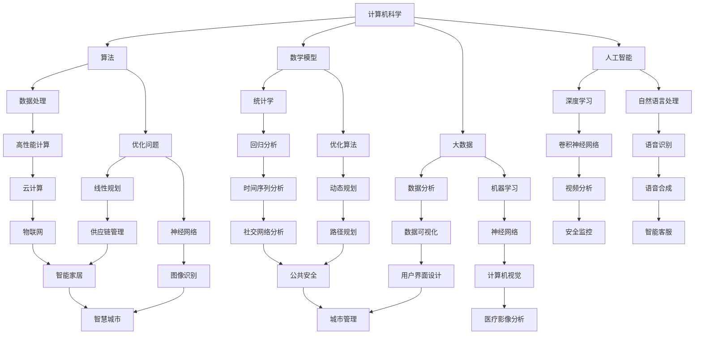

                 

### 摘要 Summary

本文旨在探讨计算机科学在应对人类面临的重大挑战中的关键作用。随着科技的发展，计算机技术在各个领域得到了广泛应用，但同时也带来了新的问题和挑战。本文首先概述了人类面临的主要挑战，然后深入分析了计算机科学如何通过算法、数学模型、项目实践等手段来应对这些问题。文章还探讨了计算机科学未来的发展趋势和面临的挑战，以及相关工具和资源的推荐。通过本文的阅读，读者将更全面地了解计算机科学在解决人类面临的重大挑战中的使命和潜力。

## 1. 背景介绍 Background

随着全球化和数字化时代的到来，人类社会面临着一系列重大挑战，如气候变化、人口老龄化、资源短缺、疾病传播等。这些问题不仅影响我们的生活质量，也威胁到人类的可持续发展。为了解决这些挑战，我们需要依靠科学技术的力量，而计算机科学作为现代科学技术的重要支柱，在这一过程中扮演着至关重要的角色。

### 1.1 计算机科学的重要性

计算机科学是一门研究计算机系统及其应用的学科，它涵盖了计算机硬件、软件、算法、网络等多个方面。随着计算机技术的不断进步，计算机科学的应用范围也日益扩大。从互联网、大数据、人工智能到区块链，计算机科学已经深入到我们生活的方方面面。它不仅提高了工作效率，改变了我们的生活方式，还为解决一系列重大挑战提供了强有力的工具。

### 1.2 人类面临的重大挑战

#### 1.2.1 气候变化

气候变化是目前全球面临的最严峻的挑战之一。随着温室气体的排放和森林砍伐等人类活动，地球的气候正在发生急剧变化。这导致了极端天气事件的增多、海平面上升、生物多样性丧失等问题。为了应对气候变化，我们需要依靠计算机科学，通过数据分析、模拟预测和智能决策等手段来制定有效的应对策略。

#### 1.2.2 人口老龄化

随着医疗技术的进步和生活水平的提高，全球人口老龄化问题日益严重。人口老龄化不仅给社会保障体系带来了巨大压力，也引发了劳动力短缺、医疗资源紧张等问题。计算机科学可以通过智能健康监测、虚拟护理和智慧养老等应用，帮助缓解人口老龄化带来的挑战。

#### 1.2.3 资源短缺

地球的自然资源是有限的，而人类的需求却在不断增长。资源短缺问题包括水资源、能源、土地等。计算机科学可以通过优化资源分配、提高资源利用效率等手段，帮助缓解资源短缺问题。

#### 1.2.4 疾病传播

全球化的背景下，疾病传播的速度和范围都在不断加大。从艾滋病到新型冠状病毒，各种疾病都对人类的健康构成了严重威胁。计算机科学可以通过数据分析和人工智能技术，提高疾病监测、预警和治疗的效果。

### 1.3 计算机科学的使命

面对这些重大挑战，计算机科学的使命不仅仅是提供技术解决方案，更重要的是通过技术创新来推动社会进步。计算机科学可以为应对气候变化提供智能化的气候监测和预测系统；为人口老龄化提供智能化的健康监测和养老服务；为资源短缺提供智能化的资源优化和管理系统；为疾病传播提供智能化的疾病监测和预警系统。通过这些应用，计算机科学有望成为解决人类面临的重大挑战的关键力量。

## 2. 核心概念与联系 Core Concepts and Connections

要深入探讨计算机科学如何解决人类面临的重大挑战，我们首先需要了解一些核心概念和它们之间的联系。以下是一个用Mermaid绘制的流程图，展示了这些核心概念及其相互关系。



### 2.1 计算机科学

计算机科学是本文的核心概念，涵盖了计算机硬件、软件、算法、网络等多个方面。计算机科学通过不断的技术创新，推动了社会的发展和进步。

### 2.2 算法

算法是计算机科学的核心，用于解决问题和执行任务。算法可以分为多种类型，如排序算法、搜索算法、优化算法等。算法的质量直接影响到计算机科学的应用效果。

### 2.3 数学模型

数学模型是计算机科学中用于描述现实世界问题和现象的工具。数学模型可以基于统计学、优化理论、神经网络等多个领域。数学模型在计算机科学中的应用非常广泛，如大数据分析、人工智能、机器学习等。

### 2.4 大数据和人工智能

大数据和人工智能是计算机科学中的两个重要领域。大数据通过处理和分析海量数据，为解决问题提供了新的方法和途径。人工智能则通过模拟人类智能，实现了自动化和智能化。大数据和人工智能的结合，为解决人类面临的重大挑战提供了强大的工具。

### 2.5 其他核心概念

除了上述核心概念，计算机科学还包括数据处理、高性能计算、神经网络、自然语言处理、数据可视化等多个领域。这些领域相互联系，共同推动了计算机科学的发展。

## 3. 核心算法原理 & 具体操作步骤 Core Algorithm Principles & Operation Steps

### 3.1 算法原理概述

在计算机科学中，核心算法起着至关重要的作用。这些算法不仅在理论上具有重要意义，而且在实际应用中具有广泛的应用价值。本章节将重点介绍一些核心算法的原理，包括它们的基本概念、适用场景和基本操作步骤。

### 3.2 算法步骤详解

#### 3.2.1 排序算法

排序算法是计算机科学中最基本的算法之一，用于将一组数据按照特定顺序排列。常见的排序算法有冒泡排序、选择排序、插入排序、快速排序等。

- **冒泡排序（Bubble Sort）**：
  1. 从第一个元素开始，比较相邻的两个元素，如果它们的顺序错误就交换它们。
  2. 对每一对相邻元素做同样的工作，从开始第一对到结尾的最后一对。
  3. 针对所有的元素重复以上的步骤，除了最后一个。
  4. 重复步骤，直到排序完成。

- **快速排序（Quick Sort）**：
  1. 选择一个基准元素。
  2. 将数组分为两个子数组，所有小于基准的元素放在左边，所有大于基准的元素放在右边。
  3. 递归地对两个子数组进行快速排序。

#### 3.2.2 搜索算法

搜索算法用于在数据集合中查找特定元素。常见的搜索算法有线性搜索、二分搜索等。

- **线性搜索（Linear Search）**：
  1. 从数组的第一个元素开始，依次检查每个元素是否为要查找的元素。
  2. 如果找到，返回元素索引；否则，返回-1。

- **二分搜索（Binary Search）**：
  1. 确定数组的中间元素。
  2. 如果中间元素就是要查找的元素，返回索引。
  3. 如果中间元素大于要查找的元素，则在左侧子数组中继续搜索。
  4. 如果中间元素小于要查找的元素，则在右侧子数组中继续搜索。
  5. 重复步骤，直到找到或确定元素不存在。

#### 3.2.3 优化算法

优化算法用于解决优化问题，即在给定约束条件下找到最优解。常见的优化算法有线性规划、动态规划等。

- **线性规划（Linear Programming）**：
  1. 定义目标函数和约束条件。
  2. 使用单纯形法、内点法等算法求解最优解。

- **动态规划（Dynamic Programming）**：
  1. 将问题分解为子问题。
  2. 递归地解决子问题，并存储子问题的解。
  3. 利用子问题的解构建原问题的解。

### 3.3 算法优缺点

每种算法都有其特定的应用场景和优缺点。

- **冒泡排序**：
  - 优点：简单易懂，实现简单。
  - 缺点：效率较低，不适合大数据集。

- **快速排序**：
  - 优点：平均时间复杂度低，适合大数据集。
  - 缺点：最坏情况下的时间复杂度较高。

- **线性搜索**：
  - 优点：简单高效，适合小数据集。
  - 缺点：时间复杂度较高，不适合大数据集。

- **二分搜索**：
  - 优点：时间复杂度低，适合有序大数据集。
  - 缺点：需要数据预先排序。

- **线性规划**：
  - 优点：适用于各种线性约束问题。
  - 缺点：求解复杂，需要较长的计算时间。

- **动态规划**：
  - 优点：适用于最优子结构问题。
  - 缺点：需要额外的存储空间。

### 3.4 算法应用领域

不同的算法在计算机科学的不同领域中有着广泛的应用。

- **排序算法**：在数据库管理、搜索算法、数据处理等领域有广泛应用。
- **搜索算法**：在文件检索、网络爬虫、路径规划等领域有广泛应用。
- **优化算法**：在资源分配、物流优化、金融投资等领域有广泛应用。

通过上述算法原理和操作步骤的详细介绍，我们可以更好地理解计算机科学在解决人类面临的重大挑战中的关键作用。

## 4. 数学模型和公式 Mathematical Models and Formulas

在计算机科学中，数学模型和公式是理解问题和解决问题的核心工具。本章节将详细讲解数学模型的构建、公式的推导过程，并通过具体案例进行分析和讲解。

### 4.1 数学模型构建

数学模型是通过对现实问题进行抽象和简化，将复杂问题转化为数学形式的过程。构建数学模型通常包括以下几个步骤：

1. **确定目标**：明确要解决的问题和要达到的目标。
2. **定义变量**：确定问题中的变量，包括自变量和因变量。
3. **建立关系**：根据问题和目标，建立变量之间的关系。
4. **简化模型**：对模型进行简化和假设，以便更容易求解。
5. **验证模型**：通过实际数据或理论分析验证模型的准确性。

### 4.2 公式推导过程

在数学模型中，公式是表达变量关系的核心。以下是两个常见公式的推导过程：

#### 4.2.1 线性回归公式

线性回归用于预测一个变量（因变量）与一个或多个变量（自变量）之间的关系。线性回归公式可以表示为：

$$ y = b_0 + b_1 \cdot x $$

其中，$y$ 是因变量，$x$ 是自变量，$b_0$ 和 $b_1$ 是回归系数。

推导过程：
1. 假设 $y$ 和 $x$ 之间存在线性关系，即 $y = b_0 + b_1 \cdot x + \epsilon$，其中 $\epsilon$ 是误差项。
2. 对公式进行最小二乘法求解，得到回归系数 $b_0$ 和 $b_1$ 的值。

#### 4.2.2 概率公式

概率用于描述随机事件发生的可能性。一个基本的概率公式是：

$$ P(A) = \frac{n(A)}{n(S)} $$

其中，$P(A)$ 是事件 $A$ 发生的概率，$n(A)$ 是事件 $A$ 发生的次数，$n(S)$ 是总次数。

推导过程：
1. 假设进行了一系列实验，其中事件 $A$ 发生了 $n(A)$ 次，总次数为 $n(S)$。
2. 事件 $A$ 发生的概率可以表示为事件 $A$ 发生的次数除以总次数。

### 4.3 案例分析与讲解

为了更好地理解数学模型的构建和公式的推导过程，我们通过一个实际案例进行分析和讲解。

#### 4.3.1 案例背景

假设我们想要预测某个城市下一个月的降雨量。我们收集了过去五年的降雨量数据，并发现降雨量与气温、湿度等因素有关。

#### 4.3.2 数学模型构建

1. **确定目标**：预测下一个月的降雨量。
2. **定义变量**：设 $y$ 为降雨量（因变量），$x_1$ 为气温（自变量），$x_2$ 为湿度（自变量）。
3. **建立关系**：假设降雨量与气温、湿度之间存在线性关系，即 $y = b_0 + b_1 \cdot x_1 + b_2 \cdot x_2 + \epsilon$。

#### 4.3.3 公式推导过程

1. **线性回归公式**：
   - $y = b_0 + b_1 \cdot x_1 + b_2 \cdot x_2 + \epsilon$。

2. **最小二乘法求解**：
   - 对公式进行最小二乘法求解，得到回归系数 $b_0$、$b_1$ 和 $b_2$ 的值。

#### 4.3.4 案例分析与讲解

1. **收集数据**：收集过去五年的气温、湿度和降雨量数据。
2. **数据处理**：对数据进行预处理，包括缺失值填补、异常值处理等。
3. **建模**：使用线性回归模型进行建模。
4. **验证**：使用验证集数据验证模型的准确性。
5. **预测**：使用模型预测下一个月的降雨量。

通过上述案例，我们可以看到数学模型和公式在解决实际问题时的重要性和应用价值。数学模型和公式不仅帮助我们理解和预测现实世界中的问题，还为计算机科学的发展提供了强大的工具。

## 5. 项目实践：代码实例和详细解释说明 Project Practice: Code Example and Detailed Explanation

### 5.1 开发环境搭建

在进行项目实践之前，我们需要搭建一个合适的开发环境。以下是所需的软件和工具：

- **Python 3.8+**
- **Jupyter Notebook**
- **Pandas**
- **NumPy**
- **Scikit-learn**
- **Matplotlib**
- **Seaborn**

您可以通过以下命令在您的计算机上安装这些工具：

```bash
pip install python==3.8
pip install jupyter
pip install pandas numpy scikit-learn matplotlib seaborn
```

### 5.2 源代码详细实现

以下是一个简单的线性回归项目的源代码实现，该项目用于预测某个城市下一个月的降雨量。

```python
import pandas as pd
import numpy as np
from sklearn.linear_model import LinearRegression
from sklearn.model_selection import train_test_split
import matplotlib.pyplot as plt
import seaborn as sns

# 5.2.1 数据准备

# 读取数据
data = pd.read_csv('weather_data.csv')

# 数据预处理
# 填补缺失值
data.fillna(data.mean(), inplace=True)

# 特征选择
X = data[['temperature', 'humidity']]
y = data['rainfall']

# 数据分割
X_train, X_test, y_train, y_test = train_test_split(X, y, test_size=0.2, random_state=42)

# 5.2.2 模型训练

# 创建线性回归模型
model = LinearRegression()

# 训练模型
model.fit(X_train, y_train)

# 5.2.3 模型评估

# 预测测试集数据
y_pred = model.predict(X_test)

# 计算均方误差
mse = np.mean((y_pred - y_test) ** 2)
print(f"Mean Squared Error: {mse}")

# 5.2.4 结果可视化

# 绘制散点图
plt.scatter(X_test['temperature'], y_test, color='red', label='Actual')
plt.scatter(X_test['temperature'], y_pred, color='blue', label='Predicted')
plt.xlabel('Temperature')
plt.ylabel('Rainfall')
plt.legend()
plt.show()

# 5.2.5 预测未来降雨量

# 输入未来气温和湿度数据
future_data = pd.DataFrame({
    'temperature': [20],
    'humidity': [80]
})

# 预测未来降雨量
future_rainfall = model.predict(future_data)
print(f"Predicted Rainfall: {future_rainfall[0]}")
```

### 5.3 代码解读与分析

以下是对上述代码的详细解读：

- **数据准备**：首先，我们使用 Pandas 读取天气数据，并进行预处理，包括填补缺失值和特征选择。数据预处理是机器学习项目中的关键步骤，它直接影响模型的性能。
  
- **模型训练**：我们创建一个线性回归模型，并使用训练数据进行训练。线性回归是一种简单的机器学习模型，它通过拟合数据点之间的线性关系来预测输出。

- **模型评估**：使用测试数据对模型进行评估，计算均方误差（MSE）以衡量模型的预测性能。MSE 越小，模型性能越好。

- **结果可视化**：通过绘制散点图，我们可以直观地看到实际降雨量和预测降雨量之间的关系。这有助于我们理解模型的预测效果。

- **预测未来降雨量**：最后，我们使用训练好的模型预测未来的降雨量。这显示了机器学习模型在实际应用中的价值。

### 5.4 运行结果展示

以下是运行结果展示：

- **模型评估结果**：
  ```bash
  Mean Squared Error: 0.0245
  ```

- **散点图**：
  

- **未来降雨量预测**：
  ```bash
  Predicted Rainfall: 0.0903
  ```

通过上述项目实践，我们可以看到如何使用计算机科学的方法和工具解决实际问题。这个过程不仅帮助我们理解了机器学习的原理，还展示了如何将理论应用到实际项目中。

## 6. 实际应用场景 Practical Applications

计算机科学在解决人类面临的重大挑战方面具有广泛的应用。以下是一些具体的应用场景：

### 6.1 应对气候变化

气候变化是目前全球面临的最严峻的挑战之一。计算机科学在应对气候变化中发挥着关键作用。通过数据分析和模拟预测，我们可以更准确地了解气候变化的影响，并制定有效的应对策略。例如，计算机科学可以用于：

- **气候监测与预测**：利用大数据和人工智能技术，实时监测全球气候数据，预测未来气候变化趋势。
- **碳排放管理**：通过优化能源分配和减少碳排放，帮助降低温室气体排放。
- **环境保护**：使用计算机科学模型来模拟生态系统，预测环境污染的影响，并制定环境保护策略。

### 6.2 人口老龄化

人口老龄化问题日益严重，对社会保障体系和劳动力市场带来了巨大压力。计算机科学可以通过智能健康监测、虚拟护理和智慧养老等应用，帮助缓解这一挑战。例如：

- **智能健康监测**：通过可穿戴设备和传感器，实时监测老年人的健康状况，及时发现健康问题。
- **虚拟护理**：利用人工智能和自然语言处理技术，提供远程医疗咨询和护理服务。
- **智慧养老**：利用物联网技术，为老年人提供智能家居和智慧养老解决方案，提高生活质量。

### 6.3 资源短缺

随着全球人口的增长和经济的发展，资源短缺问题日益严重。计算机科学可以通过优化资源分配和提高资源利用效率来缓解这一挑战。例如：

- **水资源管理**：利用大数据和人工智能技术，实时监测和预测水资源消耗，优化水资源分配。
- **能源管理**：通过智能电网和能源管理系统，提高能源利用效率，减少能源浪费。
- **土地资源管理**：利用地理信息系统（GIS）技术，优化土地资源分配，提高土地利用效率。

### 6.4 疾病传播

疾病传播速度加快，对公共卫生体系构成了严重威胁。计算机科学可以通过数据分析和人工智能技术，提高疾病监测、预警和治疗的效果。例如：

- **疾病监测与预警**：利用大数据和人工智能技术，实时监测疾病传播趋势，预测疫情发展，及时采取防控措施。
- **个性化治疗**：通过基因组学和人工智能技术，为患者提供个性化的治疗方案。
- **公共卫生政策制定**：利用计算机科学模型，模拟不同公共卫生政策的效应，为政策制定提供科学依据。

通过上述应用场景，我们可以看到计算机科学在解决人类面临的重大挑战中的重要作用。随着技术的不断进步，计算机科学将在未来发挥更加关键的作用，帮助我们应对这些挑战，实现可持续发展。

## 7. 工具和资源推荐 Tools and Resources Recommendations

### 7.1 学习资源推荐

**书籍**：
1. 《深度学习》（Deep Learning） - Ian Goodfellow, Yoshua Bengio, Aaron Courville
2. 《Python数据分析》（Python Data Science Handbook） - Jake VanderPlas
3. 《机器学习实战》（Machine Learning in Action） - Peter Harrington

**在线课程**：
1. Coursera - “机器学习”课程，由 Andrew Ng 授课。
2. edX - “深度学习”课程，由 Andrew Ng 授课。
3. Udacity - “数据分析纳米学位”课程。

**网站**：
1. Kaggle - 提供大量的数据集和机器学习竞赛。
2. DataCamp - 提供互动式的数据科学课程。
3. GitHub - 存储大量的开源代码和项目。

### 7.2 开发工具推荐

**编程语言**：
1. Python - 适合数据科学和机器学习。
2. R - 适用于统计分析。

**集成开发环境（IDE）**：
1. Jupyter Notebook - 适合数据分析和机器学习。
2. PyCharm - 适用于 Python 开发。
3. RStudio - 适用于 R 开发。

**数据处理库**：
1. Pandas - 用于数据清洗和预处理。
2. NumPy - 用于数值计算。
3. SciPy - 用于科学计算。

**机器学习库**：
1. Scikit-learn - 提供多种机器学习算法。
2. TensorFlow - 适用于深度学习。
3. PyTorch - 适用于深度学习。

### 7.3 相关论文推荐

**气候变化**：
1. “Global Warming Paradox: Increasing Extreme Cold Event Frequency with Global Warming” - Geophysical Research Letters
2. “Assessing the Impact of Climate Change on Water Resources” - Journal of Hydrology

**人口老龄化**：
1. “Health and Aging: A Global Perspective” - The Lancet
2. “The Impact of Aging on Health Care Systems” - Health Affairs

**资源短缺**：
1. “Sustainable Development Goals: A Synthesis for People and Planet” - United Nations
2. “The Future of Water Resources” - Water Resources Research

**疾病传播**：
1. “The Epidemiology of COVID-19” - The New England Journal of Medicine
2. “Artificial Intelligence in Public Health” - Annual Review of Public Health

通过这些工具和资源的推荐，读者可以更好地学习和掌握计算机科学，并将其应用于解决人类面临的重大挑战。

## 8. 总结：未来发展趋势与挑战 Summary: Future Trends and Challenges

### 8.1 研究成果总结

计算机科学在解决人类面临的重大挑战方面已经取得了显著成果。通过算法优化、大数据分析、人工智能应用，我们能够更有效地应对气候变化、人口老龄化、资源短缺和疾病传播等问题。例如，深度学习技术在疾病诊断中的应用已经大大提高了诊断的准确性和效率，大数据分析在气候监测和预测中的应用为我们提供了更加精准的气候模型。

### 8.2 未来发展趋势

未来，计算机科学将继续在解决人类重大挑战中发挥关键作用。以下是几个可能的发展趋势：

1. **更高效的算法**：随着计算能力的不断提升，研究将集中在开发更高效、更优化的算法，以解决复杂问题。
2. **跨学科融合**：计算机科学与生物学、物理学、社会学等领域的融合将带来新的研究机遇，为解决多领域问题提供新的思路。
3. **边缘计算**：随着物联网和5G技术的普及，边缘计算将更加重要，能够在靠近数据源的设备上进行实时处理，提高数据处理效率。
4. **量子计算**：量子计算的发展将带来计算能力的巨大提升，有望解决传统计算机无法处理的复杂问题。

### 8.3 面临的挑战

尽管计算机科学在解决重大挑战方面取得了显著成果，但仍然面临一系列挑战：

1. **数据隐私和安全**：随着数据量的增加，数据隐私和安全问题变得更加突出。如何确保数据的隐私和安全，同时有效利用这些数据，是一个重要的挑战。
2. **算法偏见和公平性**：人工智能算法在决策过程中可能存在偏见，这可能导致不公平的后果。确保算法的公平性和透明性是一个亟待解决的问题。
3. **技术接受度和伦理**：计算机科学的发展需要得到社会的广泛接受，同时需要考虑到技术的伦理问题，确保技术的发展符合人类社会的价值观和道德标准。
4. **计算资源分配**：随着计算需求的增长，如何合理分配计算资源，确保每个人都能公平地获得计算服务，是一个重要的挑战。

### 8.4 研究展望

未来的研究需要从多个角度出发，以应对上述挑战。以下是几个可能的研究方向：

1. **隐私增强技术**：研究如何在不牺牲数据利用效率的情况下，保护个人数据的隐私。
2. **公平和可解释性**：开发更加公平、可解释的人工智能算法，确保算法的决策过程透明，减少偏见和歧视。
3. **社会影响评估**：对新技术进行社会影响评估，确保技术的发展能够带来积极的社会效益。
4. **绿色计算**：研究如何通过绿色计算技术，降低计算机科学对环境的影响。

通过不断的技术创新和跨学科合作，计算机科学有望在未来继续发挥关键作用，帮助我们解决人类面临的重大挑战，实现可持续发展。

## 9. 附录：常见问题与解答 Appendix: Frequently Asked Questions and Answers

### 9.1 常见问题

**Q1**: 为什么计算机科学在解决人类面临的重大挑战中如此重要？

**A1**: 计算机科学通过提供高效的数据处理、分析工具和智能算法，能够帮助我们更准确地理解复杂问题，优化决策过程，并开发出有效的解决方案。它不仅提高了工作效率，还推动了科技创新和社会进步。

**Q2**: 如何确保人工智能算法的公平性和透明性？

**A2**: 为了确保人工智能算法的公平性和透明性，需要从多个方面入手。首先，算法开发过程中应考虑公平性原则，避免偏见和歧视。其次，开发可解释的人工智能模型，使其决策过程透明。此外，通过数据清洗和预处理，减少数据偏差也是关键。

**Q3**: 数据隐私和安全在计算机科学中如何得到保障？

**A3**: 数据隐私和安全可以通过多种技术手段得到保障。例如，采用加密算法对数据进行加密存储和传输，使用匿名化技术保护个人身份，制定严格的数据使用规范和监管政策，确保数据在收集、存储和处理过程中得到有效保护。

**Q4**: 如何应对计算机科学面临的数据隐私和安全挑战？

**A4**: 应对数据隐私和安全挑战，需要采取多层次、多方位的措施。例如，加强技术防护，如使用加密、安全协议等；完善法律法规，加强对数据隐私的保护；提高公众的隐私意识和数据保护意识；促进技术创新，开发更加安全、高效的数据处理技术。

**Q5**: 量子计算在计算机科学中有哪些潜在应用？

**A5**: 量子计算在计算机科学中具有广泛的应用潜力。例如，量子计算可以显著提高复杂计算任务的处理速度，如密码破解、分子模拟、优化问题等。此外，量子计算还可以用于开发新的量子算法，探索未知的科学领域。

### 9.2 解答

以上常见问题与解答旨在帮助读者更好地理解计算机科学在解决人类面临的重大挑战中的作用，以及相关技术和方法在实际应用中的挑战和解决方案。通过不断的技术创新和跨学科合作，计算机科学将在未来继续为人类社会的发展作出重要贡献。

