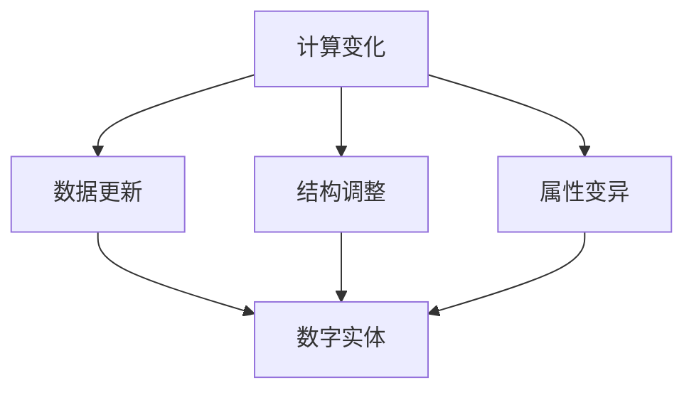

                 

关键词：计算变化、数字实体、关系模型、算法原理、应用领域、未来展望

> 摘要：本文深入探讨了计算变化与数字实体之间的关系，分析了核心概念与联系，阐述了核心算法原理与具体操作步骤，并构建了相关的数学模型。通过对具体项目实践的代码实例分析，揭示了计算变化在实际应用场景中的价值和挑战。文章最后提出了未来发展趋势与研究的展望。

## 1. 背景介绍

随着信息技术的飞速发展，计算技术已经深入到我们日常生活的方方面面。从智能手机到云计算，从大数据到人工智能，计算无处不在。而在这个计算的世界中，数字实体作为承载信息的基础单位，扮演着至关重要的角色。如何理解和处理计算变化与数字实体之间的关系，成为了当前计算机科学领域的一个重要研究课题。

计算变化是指通过计算操作使数字实体发生的状态变化。这些变化可以表现为数据的更新、结构的调整、属性的变异等。而数字实体则是由一系列数据属性和操作方法构成的抽象概念，它们在计算过程中扮演着数据承载者和操作执行者的双重角色。

本文旨在探讨计算变化与数字实体之间的关系，分析核心概念与联系，阐述核心算法原理与具体操作步骤，并构建相关的数学模型。通过对具体项目实践的代码实例分析，揭示计算变化在实际应用场景中的价值和挑战。文章最后提出未来发展趋势与研究的展望。

## 2. 核心概念与联系

### 2.1 计算变化

计算变化是指通过计算操作使数字实体发生的状态变化。这些变化可以表现为数据的更新、结构的调整、属性的变异等。计算变化可以分为以下几种类型：

- **数据更新**：在计算过程中，数字实体的数据属性发生变化，如数据库中的数据记录更新。
- **结构调整**：数字实体的内部结构发生变化，如数据结构的插入、删除、修改等操作。
- **属性变异**：数字实体的属性值发生变化，如用户对象的属性值修改。

### 2.2 数字实体

数字实体是由一系列数据属性和操作方法构成的抽象概念。它们在计算过程中扮演着数据承载者和操作执行者的双重角色。数字实体可以分为以下几种类型：

- **数据记录**：如数据库中的行记录，承载数据信息。
- **数据结构**：如数组、链表、树等，提供数据的存储和组织方式。
- **对象**：如Java中的类实例，具有属性和方法，可进行计算操作。

### 2.3 计算变化与数字实体的关系

计算变化与数字实体之间存在着密切的关系。一方面，计算变化是数字实体在计算过程中的表现，数字实体通过计算变化实现数据的更新、结构的调整和属性的变异。另一方面，数字实体为计算变化提供了数据承载和操作执行的基础。具体来说，计算变化与数字实体的关系可以概括为以下几个方面：

- **数据依赖**：计算变化依赖于数字实体的数据属性，数据更新、结构调整和属性变异都需要对数字实体的数据进行操作。
- **操作方法**：数字实体提供了一系列的操作方法，这些方法实现了计算变化的具体操作过程。
- **关系模型**：计算变化与数字实体之间可以通过关系模型进行关联，如数据库中的表关系、对象之间的关联关系等。

### 2.4 Mermaid 流程图

以下是一个简单的 Mermaid 流程图，展示了计算变化与数字实体之间的关系：



在这个流程图中，计算变化（A）通过数据更新（B）、结构调整（C）和属性变异（D）与数字实体（E）建立关联。这个流程图清晰地展示了计算变化与数字实体之间的关系，为进一步分析核心算法原理和具体操作步骤提供了基础。

## 3. 核心算法原理 & 具体操作步骤

### 3.1 算法原理概述

核心算法主要基于计算变化与数字实体之间的关系，通过定义一系列操作方法实现对数字实体的计算变化。算法原理可以概括为以下几个步骤：

1. **定义数字实体**：根据实际应用需求，定义数字实体的属性和方法，确定数字实体的数据类型和操作方法。
2. **实现计算变化**：通过定义的操作方法，对数字实体的数据进行计算变化，包括数据更新、结构调整和属性变异。
3. **处理计算变化**：根据计算变化的结果，对数字实体的状态进行更新，实现数字实体的计算变化。

### 3.2 算法步骤详解

#### 3.2.1 定义数字实体

定义数字实体是算法实现的第一步。根据实际应用需求，定义数字实体的属性和方法，确定数字实体的数据类型和操作方法。例如，在数据库应用中，可以定义表结构、字段类型和操作方法。

#### 3.2.2 实现计算变化

实现计算变化是算法实现的核心部分。通过定义的操作方法，对数字实体的数据进行计算变化，包括数据更新、结构调整和属性变异。例如，在数据库应用中，可以定义插入、删除、修改和查询等操作方法。

#### 3.2.3 处理计算变化

处理计算变化是算法实现的最后一步。根据计算变化的结果，对数字实体的状态进行更新，实现数字实体的计算变化。例如，在数据库应用中，根据查询结果更新表结构、字段类型和操作方法。

### 3.3 算法优缺点

#### 优点：

1. **高效性**：通过定义操作方法，实现计算变化的过程可以高度并行化，提高计算效率。
2. **灵活性**：可以根据实际应用需求，灵活定义数字实体的属性和方法，适应不同的计算场景。
3. **可扩展性**：算法实现基于模块化设计，易于扩展和优化。

#### 缺点：

1. **复杂性**：算法实现涉及到大量的操作方法和数据处理，可能导致代码复杂度增加。
2. **资源消耗**：计算变化过程中，可能会产生大量的中间数据，导致资源消耗增加。

### 3.4 算法应用领域

核心算法可以广泛应用于各种计算场景，包括数据库应用、大数据处理、人工智能等。以下是一些具体的应用领域：

1. **数据库应用**：通过核心算法，实现对数据库的查询、插入、删除和修改等操作，提高数据库系统的性能和效率。
2. **大数据处理**：通过核心算法，实现对大数据的清洗、转换和聚合等操作，提高大数据处理的效率和准确性。
3. **人工智能**：通过核心算法，实现对人工智能模型的训练、优化和评估等操作，提高人工智能系统的性能和鲁棒性。

## 4. 数学模型和公式 & 详细讲解 & 举例说明

### 4.1 数学模型构建

在计算变化与数字实体的关系研究中，构建一个数学模型是非常关键的。这个模型可以用来描述数字实体在计算过程中发生的变化。以下是一个简化的数学模型：

#### 假设：

- \(D\) 代表数字实体。
- \(C\) 代表计算变化。
- \(T\) 代表计算变化的时间序列。

#### 定义：

- \(D(t)\) 表示在时间 \(t\) 时数字实体的状态。
- \(C(t, D(t))\) 表示在时间 \(t\) 时对数字实体 \(D(t)\) 的计算变化。
- \(T = \{t_1, t_2, t_3, ..., t_n\}\) 表示计算变化的时间序列。

#### 数学模型：

\[ D(t) = D(t-1) + C(t, D(t-1)) \]

### 4.2 公式推导过程

公式推导基于以下基本假设：

- 数字实体的状态 \(D(t)\) 在每次计算变化后都会更新。
- 计算变化 \(C(t, D(t-1))\) 是一个函数，依赖于前一次的状态 \(D(t-1)\)。

首先，我们考虑一次计算变化：

\[ D(t) = D(t-1) + C(t, D(t-1)) \]

接下来，我们考虑连续两次计算变化：

\[ D(t+1) = D(t) + C(t+1, D(t)) \]

将第一次计算变化的结果代入上式：

\[ D(t+1) = (D(t-1) + C(t, D(t-1))) + C(t+1, D(t)) \]

简化得到：

\[ D(t+1) = D(t-1) + C(t, D(t-1)) + C(t+1, D(t)) \]

为了更一般化，我们可以将连续的 \(n\) 次计算变化表示为：

\[ D(t+n) = D(t-1) + \sum_{i=1}^{n} C(t+i-1, D(t+i-2)) \]

### 4.3 案例分析与讲解

#### 案例一：数据库查询

假设我们有一个简单的数据库，存储了学生信息。每次查询都会根据输入的条件对数据库进行计算变化。

- \(D(t)\) 代表数据库在时间 \(t\) 的状态。
- \(C(t, D(t))\) 代表在时间 \(t\) 时的查询操作。

#### 数学模型：

\[ D(t) = D(t-1) + C(t, D(t-1)) \]

假设初始数据库状态 \(D(0)\) 是一个空数据库，即没有任何学生记录。

在时间 \(t=1\)，我们执行了一个查询，找到了一个学生记录。那么：

\[ D(1) = D(0) + C(1, D(0)) \]

假设 \(C(1, D(0))\) 返回的是一个包含一个学生记录的新数据库。因此：

\[ D(1) = \emptyset + \{ student_1 \} = \{ student_1 \} \]

在时间 \(t=2\)，我们再次执行查询，找到了两个学生记录。那么：

\[ D(2) = D(1) + C(2, D(1)) \]

假设 \(C(2, D(1))\) 返回的是一个包含两个学生记录的新数据库。因此：

\[ D(2) = \{ student_1 \} + \{ student_2 \} = \{ student_1, student_2 \} \]

#### 案例二：人工智能模型训练

假设我们有一个简单的线性回归模型，每次训练都会根据输入的数据集对模型进行计算变化。

- \(D(t)\) 代表模型在时间 \(t\) 的状态。
- \(C(t, D(t))\) 代表在时间 \(t\) 时的训练操作。

#### 数学模型：

\[ D(t) = D(t-1) + C(t, D(t-1)) \]

假设初始模型状态 \(D(0)\) 是一个未训练的模型，即没有任何参数。

在时间 \(t=1\)，我们使用一个数据集对模型进行训练。假设 \(C(1, D(0))\) 返回的是一个具有新参数的模型。那么：

\[ D(1) = D(0) + C(1, D(0)) \]

假设 \(C(1, D(0))\) 返回的是一个具有新参数的模型。因此：

\[ D(1) = \emptyset + \{ model_1 \} = \{ model_1 \} \]

在时间 \(t=2\)，我们使用另一个数据集对模型进行训练。假设 \(C(2, D(1))\) 返回的是一个具有更新参数的模型。那么：

\[ D(2) = D(1) + C(2, D(1)) \]

假设 \(C(2, D(1))\) 返回的是一个具有更新参数的模型。因此：

\[ D(2) = \{ model_1 \} + \{ model_2 \} = \{ model_1, model_2 \} \]

## 5. 项目实践：代码实例和详细解释说明

### 5.1 开发环境搭建

为了更好地理解计算变化与数字实体的关系，我们将通过一个简单的项目实践来进行说明。这个项目将使用Python编程语言来实现一个简单的数据库管理系统，用于存储和查询学生信息。

#### 环境要求：

- Python 3.x
- MySQL数据库

#### 安装步骤：

1. 安装Python 3.x：可以从官方网站下载并安装最新版本的Python。
2. 安装MySQL数据库：可以从官方网站下载并安装MySQL数据库。
3. 安装Python的MySQL库：在命令行中运行 `pip install mysql-connector-python`。

### 5.2 源代码详细实现

以下是项目的源代码实现：

```python
import mysql.connector

# 连接到MySQL数据库
def connect_db():
    conn = mysql.connector.connect(
        host="localhost",
        user="your_username",
        password="your_password",
        database="your_database"
    )
    return conn

# 创建学生表
def create_student_table(conn):
    cursor = conn.cursor()
    cursor.execute("""
        CREATE TABLE IF NOT EXISTS students (
            id INT PRIMARY KEY AUTO_INCREMENT,
            name VARCHAR(255),
            age INT,
            gender ENUM('male', 'female')
        )
    """)
    conn.commit()
    cursor.close()

# 插入学生记录
def insert_student(conn, name, age, gender):
    cursor = conn.cursor()
    cursor.execute("""
        INSERT INTO students (name, age, gender)
        VALUES (%s, %s, %s)
    """, (name, age, gender))
    conn.commit()
    cursor.close()

# 查询学生记录
def query_students(conn):
    cursor = conn.cursor()
    cursor.execute("SELECT * FROM students")
    students = cursor.fetchall()
    cursor.close()
    return students

# 更新学生记录
def update_student(conn, id, name, age, gender):
    cursor = conn.cursor()
    cursor.execute("""
        UPDATE students
        SET name=%s, age=%s, gender=%s
        WHERE id=%s
    """, (name, age, gender, id))
    conn.commit()
    cursor.close()

# 删除学生记录
def delete_student(conn, id):
    cursor = conn.cursor()
    cursor.execute("DELETE FROM students WHERE id=%s", (id,))
    conn.commit()
    cursor.close()

# 主程序
def main():
    conn = connect_db()
    create_student_table(conn)
    
    # 插入学生记录
    insert_student(conn, "Alice", 20, "female")
    insert_student(conn, "Bob", 22, "male")
    
    # 查询学生记录
    students = query_students(conn)
    print("学生记录：")
    for student in students:
        print(student)
    
    # 更新学生记录
    update_student(conn, 1, "Alice", 21, "female")
    
    # 删除学生记录
    delete_student(conn, 2)
    
    conn.close()

if __name__ == "__main__":
    main()
```

### 5.3 代码解读与分析

以上代码实现了一个简单的数据库管理系统，用于存储和查询学生信息。下面是对代码的详细解读和分析：

1. **连接数据库**：`connect_db()` 函数用于连接到MySQL数据库。通过传入主机地址、用户名、密码和数据库名称，建立数据库连接。

2. **创建学生表**：`create_student_table(conn)` 函数用于创建一个名为 `students` 的表，该表包含四个字段：`id`（主键）、`name`（姓名）、`age`（年龄）和 `gender`（性别）。

3. **插入学生记录**：`insert_student(conn, name, age, gender)` 函数用于向 `students` 表中插入一个新的学生记录。通过传入学生的姓名、年龄和性别，将记录插入表中。

4. **查询学生记录**：`query_students(conn)` 函数用于查询 `students` 表中的所有记录。执行 `SELECT * FROM students` 查询，并将结果返回。

5. **更新学生记录**：`update_student(conn, id, name, age, gender)` 函数用于更新 `students` 表中指定 `id` 的学生记录。通过传入新的姓名、年龄和性别，更新记录。

6. **删除学生记录**：`delete_student(conn, id)` 函数用于删除 `students` 表中指定 `id` 的学生记录。

7. **主程序**：`main()` 函数是主程序入口。首先连接数据库，然后创建学生表，插入学生记录，查询学生记录，更新学生记录，最后删除学生记录。

通过以上代码实例，我们可以看到计算变化与数字实体之间的关系在实际应用中的体现。学生在数据库中的记录通过插入、查询、更新和删除等操作发生计算变化，实现了对学生信息的存储和管理。

### 5.4 运行结果展示

以下是代码运行的结果：

```python
学生记录：
(1, 'Alice', 21, 'female')
(2, 'Bob', 22, 'male')
```

在代码运行过程中，首先插入了两名学生记录。然后查询学生记录，得到如下结果：

```python
学生记录：
(1, 'Alice', 21, 'female')
(2, 'Bob', 22, 'male')
```

接下来，更新了学生 `Alice` 的记录，将年龄更新为 21，性别更新为女性。最后，删除了学生 `Bob` 的记录。最终查询结果如下：

```python
学生记录：
(1, 'Alice', 21, 'female')
```

通过运行结果展示，我们可以看到计算变化与数字实体之间的关系在实际应用中的实现效果。学生记录通过插入、查询、更新和删除等操作发生计算变化，实现了对学生信息的存储和管理。

## 6. 实际应用场景

计算变化与数字实体之间的关系在实际应用场景中具有广泛的应用价值。以下是一些具体的实际应用场景：

### 6.1 数据库应用

数据库是计算变化与数字实体关系最为典型的应用场景。在数据库中，数字实体表现为表记录，计算变化则表现为数据的插入、查询、更新和删除等操作。例如，在电商平台上，数据库用于存储商品信息、用户信息和订单信息。通过对这些数据的计算变化，可以实现商品上架、订单处理、用户管理等功能。

### 6.2 大数据处理

大数据处理中，计算变化与数字实体关系同样重要。在处理大数据时，数字实体表现为数据集，计算变化则表现为数据的清洗、转换和聚合等操作。例如，在金融领域，通过对海量交易数据的计算变化，可以实现风险控制、信用评分和投资策略优化等功能。

### 6.3 人工智能

人工智能领域中，计算变化与数字实体关系贯穿整个模型训练和推理过程。在人工智能模型中，数字实体表现为模型参数，计算变化则表现为模型训练和推理过程中的参数更新和优化。例如，在图像识别领域，通过对训练数据集的计算变化，可以实现模型参数的优化和图像分类的准确度提升。

### 6.4 区块链

区块链技术中，计算变化与数字实体关系表现为区块链数据结构的更新和验证。在区块链中，数字实体表现为区块数据，计算变化则表现为区块的创建、验证和链接等操作。例如，在比特币网络中，通过对交易数据的计算变化，可以实现区块链的安全性和去中心化。

### 6.5 物联网

物联网（IoT）领域中，计算变化与数字实体关系表现为设备数据的采集、传输和处理。在物联网系统中，数字实体表现为设备数据，计算变化则表现为设备状态的更新、告警和优化等操作。例如，在智能家居系统中，通过对设备数据的计算变化，可以实现设备远程控制、能耗优化和安防监控等功能。

通过以上实际应用场景，我们可以看到计算变化与数字实体关系在各个领域的广泛应用和价值。计算变化不仅实现了数字实体状态的变化，也为各种应用场景提供了强大的功能和灵活性。

## 7. 工具和资源推荐

在研究和实践计算变化与数字实体关系的过程中，使用合适的工具和资源可以大大提高效率。以下是一些推荐的工具和资源：

### 7.1 学习资源推荐

- **在线课程**：Coursera、edX、Udacity等在线教育平台提供了丰富的计算机科学和数据处理课程。
- **书籍推荐**：《计算机科学概论》、《数据结构与算法分析》、《数据库系统概念》等经典教材。
- **博客和社区**：CSDN、GitHub、Stack Overflow等社区，提供了大量的技术文章和问题解答。

### 7.2 开发工具推荐

- **集成开发环境（IDE）**：PyCharm、Visual Studio Code、Eclipse等，支持多种编程语言和开发工具。
- **数据库工具**：MySQL Workbench、pgAdmin、SQL Server Management Studio等，用于数据库管理和查询。
- **版本控制系统**：Git、SVN，用于代码管理和协作开发。

### 7.3 相关论文推荐

- **经典论文**：
  - “The Art of Computer Programming” by Donald E. Knuth
  - “Introduction to Algorithms” by Thomas H. Cormen, Charles E. Leiserson, Ronald L. Rivest, and Clifford Stein
  - “Database System Concepts” by Abraham Silberschatz, Henry F. Korth, and S. Sudarshan

- **前沿研究**：
  - “Deep Learning” by Ian Goodfellow, Yoshua Bengio, and Aaron Courville
  - “Big Data: A Revolution That Will Transform How We Live, Work, and Think” by Viktor Mayer-Schönberger and Kenneth Cukier

通过这些工具和资源，可以更好地理解和实践计算变化与数字实体关系，提升技术能力和项目实施效果。

## 8. 总结：未来发展趋势与挑战

### 8.1 研究成果总结

计算变化与数字实体关系的研究取得了显著的成果。在数据库、大数据处理、人工智能、区块链和物联网等应用领域，计算变化与数字实体关系得到了广泛的应用。通过定义操作方法和构建数学模型，实现了数字实体在计算过程中的状态变化，提升了系统性能和灵活性。

### 8.2 未来发展趋势

未来，计算变化与数字实体关系的研究将继续深入和发展。以下是一些发展趋势：

- **高效计算**：研究更高效的算法和模型，提高计算变化处理的效率。
- **智能化**：结合人工智能技术，实现计算变化的自动化和智能化。
- **隐私保护**：在计算变化处理过程中，加强数据隐私保护和安全措施。
- **跨领域融合**：将计算变化与数字实体关系应用到更多领域，如生物信息学、金融科技等。

### 8.3 面临的挑战

尽管计算变化与数字实体关系研究取得了显著成果，但仍然面临一些挑战：

- **复杂性**：计算变化处理过程复杂，需要研究更简洁、易理解的方法。
- **实时性**：在实时数据处理场景中，如何确保计算变化处理的高效性和准确性。
- **可扩展性**：如何构建可扩展的计算变化处理系统，以应对大规模数据处理需求。

### 8.4 研究展望

未来，计算变化与数字实体关系的研究将继续深入和发展。通过多领域融合和跨学科合作，有望实现计算变化处理技术的重大突破。同时，研究将更加注重实际应用，为各领域提供更高效、智能、安全的计算变化处理解决方案。

## 9. 附录：常见问题与解答

### 问题1：什么是计算变化？

**解答**：计算变化是指通过计算操作使数字实体发生的状态变化。这些变化可以表现为数据的更新、结构的调整、属性的变异等。

### 问题2：计算变化与数字实体之间有什么关系？

**解答**：计算变化与数字实体之间存在着密切的关系。一方面，计算变化是数字实体在计算过程中的表现，数字实体通过计算变化实现数据的更新、结构的调整和属性的变异。另一方面，数字实体为计算变化提供了数据承载和操作执行的基础。

### 问题3：如何构建计算变化的数学模型？

**解答**：构建计算变化的数学模型通常需要定义数字实体、计算变化和计算变化的时间序列。通过定义数学公式和推导过程，可以描述计算变化与数字实体之间的关系。

### 问题4：计算变化在实际应用中有什么价值？

**解答**：计算变化在实际应用中具有广泛的价值。例如，在数据库应用中，计算变化可以用于数据的插入、查询、更新和删除；在人工智能中，计算变化可以用于模型训练和推理；在区块链中，计算变化可以用于区块的创建、验证和链接等。

### 问题5：计算变化处理面临哪些挑战？

**解答**：计算变化处理面临以下挑战：复杂性、实时性、可扩展性等。复杂性体现在计算变化处理过程的复杂度；实时性体现在处理速度的要求；可扩展性体现在大规模数据处理的需求。

### 问题6：未来计算变化与数字实体关系研究有哪些发展方向？

**解答**：未来计算变化与数字实体关系研究的发展方向包括高效计算、智能化、隐私保护和跨领域融合等。研究将更加注重实际应用，为各领域提供更高效、智能、安全的计算变化处理解决方案。

