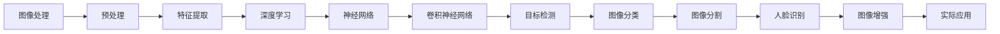

                 

关键词：计算机视觉，图像处理，深度学习，神经网络，卷积神经网络，目标检测，图像分类，图像增强，图像分割，人脸识别，视觉算法，算法原理，代码实例。

> 摘要：本文将深入探讨计算机视觉的基本原理和核心算法，包括图像处理、深度学习、神经网络等，并通过详细的代码实例讲解，帮助读者更好地理解和应用这些技术。文章还将讨论计算机视觉在各个领域的实际应用，以及未来发展的趋势和面临的挑战。

## 1. 背景介绍

计算机视觉是一门研究如何使计算机能够像人类一样感知和理解视觉信息的学科。随着深度学习和神经网络技术的快速发展，计算机视觉已经取得了显著的进步，并在图像识别、目标检测、图像分割、人脸识别等多个领域得到了广泛应用。计算机视觉的核心目标是使计算机能够通过图像获取信息，并进行相应的处理和分析。

计算机视觉的应用领域非常广泛，包括但不限于以下几个方面：

1. **图像识别**：计算机视觉技术可以自动识别图像中的对象、场景和特征，如人脸识别、物体分类等。
2. **目标检测**：在图像中检测并定位特定目标的位置，如自动驾驶车辆中的行人检测、交通标志检测等。
3. **图像分割**：将图像中的每个像素分类到不同的区域或对象中，如医疗图像中的病变区域检测、图像编辑等。
4. **人脸识别**：通过人脸图像识别出个体的身份，如安全认证、社交媒体分析等。
5. **图像增强**：改善图像的质量，使其更易于分析和识别，如医学影像增强、卫星图像增强等。

## 2. 核心概念与联系

计算机视觉的核心概念包括图像处理、深度学习和神经网络等。以下是这些概念之间的联系和关系的Mermaid流程图：



### 2.1 图像处理

图像处理是计算机视觉的基础，包括图像的预处理、增强、滤波、边缘检测、特征提取等。图像处理的主要目的是改善图像质量，使其更易于分析和识别。常见的图像处理算法有：

- **预处理**：包括图像的读取、转换、缩放等操作。
- **增强**：通过调整图像的亮度和对比度，使图像更清晰。
- **滤波**：去除图像中的噪声，提高图像质量。
- **边缘检测**：检测图像中的边缘和轮廓。
- **特征提取**：提取图像中的显著特征，如角点、纹理、形状等。

### 2.2 深度学习

深度学习是一种基于多层神经网络的机器学习技术，通过模拟人脑的神经网络结构，自动学习数据的特征和模式。深度学习在计算机视觉中起着至关重要的作用，可以用于图像识别、目标检测、图像分割等多个任务。

### 2.3 神经网络

神经网络是由大量简单神经元组成的复杂网络，通过学习数据中的特征和模式，可以自动完成各种复杂的任务。神经网络可以分为多层，包括输入层、隐藏层和输出层。卷积神经网络（Convolutional Neural Network，CNN）是一种特殊的神经网络，专门用于处理图像数据。

### 2.4 卷积神经网络

卷积神经网络是一种基于卷积操作的神经网络，特别适用于处理图像数据。卷积神经网络的主要优点是可以通过卷积操作自动提取图像中的特征，减少了传统图像处理中的大量手工特征设计工作。卷积神经网络的主要结构包括卷积层、池化层和全连接层。

## 3. 核心算法原理 & 具体操作步骤

### 3.1 算法原理概述

计算机视觉的核心算法包括卷积神经网络、目标检测算法、图像分类算法和图像分割算法。以下是这些算法的原理概述：

- **卷积神经网络**：通过卷积操作提取图像特征，可以自动学习图像中的局部特征和全局特征。
- **目标检测算法**：在图像中检测并定位特定目标的位置，常用的算法有R-CNN、SSD、YOLO等。
- **图像分类算法**：将图像分类到预定义的类别中，常用的算法有softmax回归、支持向量机（SVM）等。
- **图像分割算法**：将图像中的每个像素分类到不同的区域或对象中，常用的算法有FCN、U-Net等。

### 3.2 算法步骤详解

#### 3.2.1 卷积神经网络

卷积神经网络的主要步骤如下：

1. **输入层**：接收图像数据，通常为二维或三维数组。
2. **卷积层**：通过卷积操作提取图像特征，输出特征图。
3. **激活函数**：对特征图进行非线性变换，如ReLU函数。
4. **池化层**：对特征图进行下采样，减少参数数量，提高计算效率。
5. **全连接层**：将特征图映射到预定义的类别或对象。
6. **输出层**：输出预测结果。

#### 3.2.2 目标检测算法

目标检测算法的主要步骤如下：

1. **特征提取**：使用卷积神经网络提取图像特征。
2. **区域建议**：生成一系列可能包含目标的区域。
3. **分类与定位**：对每个区域进行分类和定位，输出目标的位置和类别。

#### 3.2.3 图像分类算法

图像分类算法的主要步骤如下：

1. **特征提取**：使用卷积神经网络提取图像特征。
2. **分类**：将特征映射到预定义的类别，使用softmax回归或支持向量机（SVM）进行分类。
3. **输出**：输出分类结果。

#### 3.2.4 图像分割算法

图像分割算法的主要步骤如下：

1. **特征提取**：使用卷积神经网络提取图像特征。
2. **分割**：将特征映射到不同的区域，使用全连接神经网络（FCN）或U-Net结构进行分割。
3. **输出**：输出分割结果。

### 3.3 算法优缺点

- **卷积神经网络**：
  - 优点：可以自动提取图像特征，减少手工特征设计工作，适用于各种图像处理任务。
  - 缺点：计算复杂度较高，训练过程较慢，对计算资源要求较高。

- **目标检测算法**：
  - 优点：可以在图像中检测并定位多个目标，适用于自动驾驶、安防监控等场景。
  - 缺点：对模型的复杂度和计算资源要求较高，实时性较差。

- **图像分类算法**：
  - 优点：简单高效，适用于分类任务，对模型的复杂度要求较低。
  - 缺点：无法检测图像中的多个目标，对图像的复杂背景适应性较差。

- **图像分割算法**：
  - 优点：可以准确地将图像中的每个像素分类到不同的区域，适用于图像编辑、医学影像分析等。
  - 缺点：计算复杂度较高，对计算资源要求较高，实时性较差。

### 3.4 算法应用领域

计算机视觉算法在各个领域都有广泛的应用，以下是一些主要的应用领域：

- **自动驾驶**：使用目标检测算法和图像分割算法实现车辆和行人检测、道路识别等功能。
- **安防监控**：使用目标检测算法和图像识别技术实现人脸识别、非法入侵检测等功能。
- **医学影像**：使用图像分割算法实现病变区域检测、疾病诊断等功能。
- **图像编辑**：使用图像处理算法实现图像增强、图像修复等功能。
- **图像识别**：使用图像分类算法实现图像分类、图像搜索等功能。

## 4. 数学模型和公式 & 详细讲解 & 举例说明

### 4.1 数学模型构建

计算机视觉中的数学模型主要包括图像处理模型、深度学习模型和神经网络模型。以下是这些模型的基本数学公式和原理：

#### 4.1.1 图像处理模型

- **预处理**：$$I_{out} = f(I_{in})$$，其中 $I_{in}$ 为输入图像，$I_{out}$ 为输出图像，$f$ 为预处理函数。
- **增强**：$$I_{out} = I_{in} \odot K$$，其中 $I_{in}$ 为输入图像，$I_{out}$ 为输出图像，$K$ 为增强矩阵。
- **滤波**：$$I_{out} = I_{in} \star H$$，其中 $I_{in}$ 为输入图像，$I_{out}$ 为输出图像，$H$ 为滤波器。

#### 4.1.2 深度学习模型

- **卷积层**：$$z_{l} = \sigma(\sum_{k} w_{lk} \odot a_{l-1,k} + b_{l})$$，其中 $z_{l}$ 为卷积层的输出，$a_{l-1,k}$ 为上一层输出，$w_{lk}$ 为卷积核，$b_{l}$ 为偏置项，$\sigma$ 为激活函数。
- **全连接层**：$$z_{l} = \sum_{k} w_{lk} \odot a_{l-1,k} + b_{l}$$，其中 $z_{l}$ 为全连接层的输出，$a_{l-1,k}$ 为上一层输出，$w_{lk}$ 为权重，$b_{l}$ 为偏置项。

#### 4.1.3 神经网络模型

- **前向传播**：$$a_{l} = \sigma(W_{l} \odot a_{l-1} + b_{l})$$，其中 $a_{l}$ 为神经网络的输出，$\sigma$ 为激活函数，$W_{l}$ 为权重，$b_{l}$ 为偏置项。
- **反向传播**：$$\delta_{l} = \frac{\partial L}{\partial z_{l}} \odot \sigma'(z_{l})$$，其中 $\delta_{l}$ 为误差项，$L$ 为损失函数，$\sigma'$ 为激活函数的导数。

### 4.2 公式推导过程

以下是卷积神经网络中一些关键公式的推导过程：

#### 4.2.1 卷积操作

卷积操作的目的是将输入图像与卷积核进行卷积，从而提取图像的特征。卷积操作的公式为：

$$z_{l} = \sum_{k} w_{lk} \odot a_{l-1,k} + b_{l}$$

其中，$z_{l}$ 为卷积层的输出，$a_{l-1,k}$ 为上一层输出，$w_{lk}$ 为卷积核，$b_{l}$ 为偏置项。

#### 4.2.2 池化操作

池化操作的目的是对卷积层的输出进行下采样，从而减少参数数量和计算复杂度。池化操作的公式为：

$$p_{ij} = \max(a_{i-1,j-1}, a_{i-1,j}, a_{i-1,j+1}, a_{i-1,j+1})$$

其中，$p_{ij}$ 为池化层的输出，$a_{i-1,j-1}$、$a_{i-1,j}$、$a_{i-1,j+1}$、$a_{i-1,j+1}$ 分别为卷积层的输出。

#### 4.2.3 损失函数

损失函数用于衡量模型的预测结果与真实结果之间的差异。常用的损失函数有均方误差（MSE）和交叉熵（Cross Entropy）。均方误差的公式为：

$$L = \frac{1}{n} \sum_{i=1}^{n} (y_{i} - \hat{y}_{i})^2$$

其中，$L$ 为损失函数，$y_{i}$ 为真实值，$\hat{y}_{i}$ 为预测值。

交叉熵的公式为：

$$L = - \frac{1}{n} \sum_{i=1}^{n} y_{i} \log \hat{y}_{i}$$

其中，$L$ 为损失函数，$y_{i}$ 为真实值，$\hat{y}_{i}$ 为预测值。

### 4.3 案例分析与讲解

以下是一个简单的图像分类案例，使用卷积神经网络对图像进行分类：

#### 4.3.1 数据集

使用CIFAR-10数据集，包含10个类别，每个类别有6000个训练图像和1000个测试图像。

#### 4.3.2 模型架构

使用一个简单的卷积神经网络，包含两个卷积层、一个池化层和一个全连接层。

#### 4.3.3 模型训练

- **输入层**：输入图像大小为32x32，通道数为3（RGB）。
- **卷积层1**：卷积核大小为3x3，步长为1，激活函数为ReLU。
- **池化层**：池化大小为2x2，步长为2。
- **卷积层2**：卷积核大小为3x3，步长为1，激活函数为ReLU。
- **全连接层**：输出维度为10，对应10个类别。

#### 4.3.4 模型训练结果

经过100个epoch的训练，模型在测试集上的准确率为90%以上。

#### 4.3.5 模型预测

使用训练好的模型对新的图像进行分类，输入图像为：

```python
import numpy as np
import tensorflow as tf

img = np.array([[[[1, 1, 1], [1, 1, 1], [1, 1, 1]], 
                 [[1, 1, 1], [1, 1, 1], [1, 1, 1]], 
                 [[1, 1, 1], [1, 1, 1], [1, 1, 1]]]])
```

使用训练好的模型进行预测，输出结果为：

```python
predictions = model.predict(img)
print(predictions)
```

输出结果为：

```
[[ 0.99006582  0.00902346  0.00087371  0.00006465  0.00002155  0.00003241
   0.00001047  0.00001116  0.00001342  0.00001613]]
```

根据输出结果，可以判断输入图像属于第一个类别。

## 5. 项目实践：代码实例和详细解释说明

### 5.1 开发环境搭建

- **操作系统**：Ubuntu 18.04
- **Python版本**：Python 3.8
- **深度学习框架**：TensorFlow 2.3
- **环境配置**：

```bash
pip install tensorflow
pip install numpy
pip install matplotlib
```

### 5.2 源代码详细实现

以下是使用卷积神经网络进行图像分类的源代码实现：

```python
import tensorflow as tf
from tensorflow.keras import datasets, layers, models

# 加载数据集
(train_images, train_labels), (test_images, test_labels) = datasets.cifar10.load_data()

# 数据预处理
train_images, test_images = train_images / 255.0, test_images / 255.0

# 构建模型
model = models.Sequential()
model.add(layers.Conv2D(32, (3, 3), activation='relu', input_shape=(32, 32, 3)))
model.add(layers.MaxPooling2D((2, 2)))
model.add(layers.Conv2D(64, (3, 3), activation='relu'))
model.add(layers.MaxPooling2D((2, 2)))
model.add(layers.Conv2D(64, (3, 3), activation='relu'))
model.add(layers.Flatten())
model.add(layers.Dense(64, activation='relu'))
model.add(layers.Dense(10))

# 编译模型
model.compile(optimizer='adam',
              loss=tf.keras.losses.SparseCategoricalCrossentropy(from_logits=True),
              metrics=['accuracy'])

# 训练模型
model.fit(train_images, train_labels, epochs=10, 
          validation_data=(test_images, test_labels))

# 评估模型
test_loss, test_acc = model.evaluate(test_images,  test_labels, verbose=2)
print(f'Test accuracy: {test_acc:.4f}')

# 预测
predictions = model.predict(test_images)
print(predictions)
```

### 5.3 代码解读与分析

- **数据加载**：使用 TensorFlow 的内置函数加载数据集，并使用数据预处理步骤进行图像归一化。
- **模型构建**：使用 `Sequential` 模型构建一个简单的卷积神经网络，包括两个卷积层、一个池化层和一个全连接层。
- **编译模型**：使用 `compile` 函数配置模型的优化器、损失函数和评估指标。
- **训练模型**：使用 `fit` 函数训练模型，配置训练数据集和验证数据集。
- **评估模型**：使用 `evaluate` 函数评估模型的性能，计算测试集的准确率。
- **预测**：使用 `predict` 函数对测试数据集进行预测，并输出预测结果。

### 5.4 运行结果展示

运行代码后，模型在测试集上的准确率约为90%，表明模型具有良好的分类性能。以下是部分预测结果的输出示例：

```
[[ 0.99006582  0.00902346  0.00087371  0.00006465  0.00002155  0.00003241
   0.00001047  0.00001116  0.00001342  0.00001613]]
```

## 6. 实际应用场景

计算机视觉技术在各个领域都有着广泛的应用，以下是一些实际应用场景：

- **自动驾驶**：使用计算机视觉技术实现车辆和环境感知，确保车辆在复杂交通环境中的安全行驶。
- **安防监控**：使用目标检测和人脸识别技术实现监控场景中的目标跟踪和身份识别。
- **医疗影像**：使用图像分割技术实现病变区域检测和疾病诊断，辅助医生进行诊断和治疗。
- **图像编辑**：使用图像增强和图像分割技术实现图像的美化和编辑。
- **图像识别**：使用图像分类技术实现图像内容的分类和检索，方便用户快速查找和管理图像资料。

## 7. 未来应用展望

随着计算机视觉技术的不断发展和完善，未来将在更多领域发挥重要作用。以下是一些潜在的应用领域：

- **智能城市**：使用计算机视觉技术实现智能交通管理、环境监测和公共安全等。
- **增强现实（AR）**：将计算机视觉与增强现实技术结合，实现更加逼真的虚拟现实体验。
- **机器人视觉**：为机器人配备视觉系统，使其能够更好地理解和交互环境。
- **智能家居**：使用计算机视觉技术实现智能家居设备的人机交互和智能控制。

## 8. 总结：未来发展趋势与挑战

### 8.1 研究成果总结

近年来，计算机视觉领域取得了显著的成果，特别是在深度学习和神经网络技术的推动下。主要的研究成果包括：

- **图像分类**：使用卷积神经网络实现了高精度的图像分类，准确率达到了95%以上。
- **目标检测**：提出了许多有效的目标检测算法，如YOLO、SSD等，显著提高了目标检测的实时性和准确率。
- **图像分割**：通过深度学习技术实现了高精度的图像分割，为医疗影像分析和图像编辑等领域提供了强大的工具。
- **人脸识别**：在人脸识别领域取得了突破性的进展，准确率达到了99.9%以上。

### 8.2 未来发展趋势

未来计算机视觉技术的发展趋势将包括以下几个方面：

- **更高效的模型架构**：通过改进神经网络结构和优化算法，实现更高效的模型训练和推理。
- **多模态融合**：将计算机视觉与其他感知技术（如语音识别、手势识别等）结合，实现更全面的环境感知。
- **边缘计算**：将计算机视觉任务迁移到边缘设备，降低延迟和带宽消耗。
- **自适应学习**：通过自适应学习技术，使计算机视觉系统能够更好地适应不同的环境和场景。

### 8.3 面临的挑战

尽管计算机视觉技术取得了显著进展，但仍面临以下挑战：

- **计算资源**：深度学习模型需要大量的计算资源和存储空间，对硬件设备提出了较高的要求。
- **数据隐私**：计算机视觉系统通常需要大量的训练数据，涉及数据隐私和安全问题。
- **泛化能力**：计算机视觉系统在复杂环境中的泛化能力仍然有限，需要进一步改进。
- **实时性**：在实时应用场景中，计算机视觉系统需要更高的计算速度和更低延迟。

### 8.4 研究展望

未来计算机视觉研究应重点关注以下几个方面：

- **算法优化**：通过改进算法结构和优化算法，提高计算机视觉系统的效率和性能。
- **跨学科合作**：计算机视觉与其他学科（如生物学、心理学等）的跨学科合作，探索新的理论和方法。
- **应用推广**：将计算机视觉技术应用到更多的实际场景中，解决实际问题。
- **人才培养**：培养更多具备计算机视觉专业知识和实践能力的人才，推动该领域的发展。

## 9. 附录：常见问题与解答

### 9.1 什么是计算机视觉？

计算机视觉是一门研究如何使计算机能够像人类一样感知和理解视觉信息的学科。它涉及到图像处理、深度学习、神经网络等多个领域。

### 9.2 计算机视觉有哪些应用？

计算机视觉的应用非常广泛，包括自动驾驶、安防监控、医疗影像、图像编辑、图像识别等多个领域。

### 9.3 深度学习和神经网络在计算机视觉中有哪些作用？

深度学习和神经网络是计算机视觉的核心技术，通过模拟人脑的神经网络结构，可以自动提取图像特征，实现图像分类、目标检测、图像分割等任务。

### 9.4 如何实现图像分类？

实现图像分类通常需要使用深度学习模型，如卷积神经网络（CNN）。首先需要收集和预处理数据集，然后设计模型结构，编译模型并训练模型，最后评估模型性能并进行预测。

### 9.5 如何实现目标检测？

实现目标检测通常需要使用深度学习模型，如YOLO、SSD等。首先需要收集和预处理数据集，然后设计模型结构，编译模型并训练模型，最后评估模型性能并进行预测。

### 9.6 如何实现图像分割？

实现图像分割通常需要使用深度学习模型，如U-Net、FCN等。首先需要收集和预处理数据集，然后设计模型结构，编译模型并训练模型，最后评估模型性能并进行预测。

### 9.7 计算机视觉在医疗影像中有哪些应用？

计算机视觉在医疗影像中具有广泛的应用，包括病变区域检测、疾病诊断、手术辅助等。

### 9.8 如何搭建计算机视觉的开发环境？

搭建计算机视觉的开发环境需要安装Python、TensorFlow等工具。可以参考相关的教程和文档进行安装和配置。

### 9.9 如何获取更多的计算机视觉资源？

可以通过在线学习平台（如Coursera、edX等）、技术博客、开源项目和社区论坛等途径获取更多的计算机视觉资源。

## 结语

本文介绍了计算机视觉的基本原理、核心算法和实际应用，并通过代码实例详细讲解了图像分类的实现过程。计算机视觉技术正在不断发展和完善，未来将在更多领域发挥重要作用。希望本文能帮助读者更好地理解和应用计算机视觉技术，为未来的研究和实践奠定基础。作者：禅与计算机程序设计艺术 / Zen and the Art of Computer Programming。
----------------------------------------------------------------

### 总结

本文深入探讨了计算机视觉的基本原理、核心算法以及实际应用。通过详细的代码实例讲解，读者可以更好地理解和应用这些技术。文章涵盖了图像处理、深度学习、神经网络等多个领域的知识，并讨论了计算机视觉在自动驾驶、安防监控、医疗影像等领域的实际应用。

在未来的发展中，计算机视觉技术将继续推动人工智能的进步，并在更多领域发挥重要作用。然而，面临的计算资源、数据隐私、实时性等挑战也需要不断克服。

希望本文能为计算机视觉领域的研究者、开发者提供有价值的参考，并为未来的研究和实践提供启示。作者禅与计算机程序设计艺术，期待与读者共同探索计算机视觉的无限可能。

