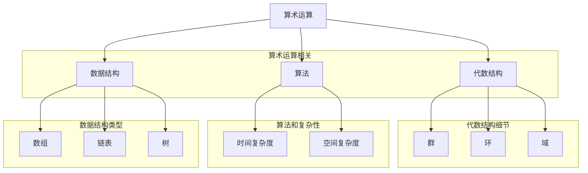

                 

关键词：计算、代数的结构、算法、数学模型、代码实例、应用场景、未来展望

## 摘要

本文旨在探讨计算的基本原理和代数的结构，重点关注计算之术在计算机科学中的应用。通过对计算历史的回顾，我们理解了代数作为计算的基础，如何通过代数结构实现复杂计算任务。本文将详细分析核心算法原理，介绍数学模型和公式，并通过代码实例展示实际应用。同时，我们还将探讨该技术的未来发展趋势和面临的挑战，为读者提供全面的认知和深入理解。

## 1. 背景介绍

计算是人类文明发展的基石，从古代的算盘到现代的计算机，计算技术经历了长足的进步。自古以来，人类不断探索如何更高效、更准确地完成各种计算任务。早期的计算主要依靠人力和简单的工具，但随着数学和科学的发展，计算方法逐渐变得更加复杂和精确。

代数的出现，标志着人类计算能力的进一步提升。代数不仅提供了一种描述和解决问题的方法，更通过符号和公式实现了抽象和形式化。这种形式化的方法使得复杂计算任务变得更加容易管理和执行。

在计算机科学中，代数结构成为了算法设计的重要基础。从简单的算术运算到复杂的算法实现，代数结构提供了一种统一的描述方式。通过代数结构，我们能够更好地理解算法的原理，优化算法的性能，甚至发现新的算法。

本文将围绕代数的结构，探讨其在计算中的应用，分析核心算法原理，并通过实例展示其实际应用。希望通过本文的探讨，读者能够对计算和代数的结构有更深刻的理解，并为未来的计算技术发展提供启示。

### 2. 核心概念与联系

为了深入探讨计算之术，我们首先需要了解核心概念及其相互联系。在本节中，我们将介绍几个关键概念，并使用Mermaid流程图来展示它们之间的结构关系。

#### 2.1 关键概念

1. **算术运算**：这是最基础的运算形式，包括加法、减法、乘法和除法等。
2. **代数结构**：这包括群、环、域等，是抽象的数学结构，为算法设计提供了理论依据。
3. **算法**：是一系列解决问题的步骤，可以形式化为数学上的演算法。
4. **数据结构**：这是存储和组织数据的方式，如数组、链表、树等。
5. **复杂性理论**：这是研究算法时间复杂度和空间复杂度的学科，帮助我们理解算法的效率。

#### 2.2 Mermaid 流程图



这个Mermaid流程图展示了核心概念及其相互之间的联系。算术运算是计算的基础，它直接关联到代数结构，后者为算法设计提供了理论基础。算法和数据结构则共同构成了计算的核心，而复杂性理论帮助我们评估算法的效率。通过这个图，我们可以清晰地看到各个概念之间的层次关系和相互影响。

#### 2.3 核心概念之间的联系

1. **算术运算与代数结构**：算术运算可以直接映射到代数结构的操作上。例如，加法运算对应群中的加法操作，乘法运算对应环中的乘法操作。这种映射关系使得我们能够利用代数结构的性质来优化算法。
2. **算法与数据结构**：算法的设计往往依赖于适当的数据结构。例如，排序算法可以选择不同的数据结构（如数组、链表、树等）来实现，以适应不同的效率和空间需求。数据结构的优化可以显著提升算法的性能。
3. **复杂性理论与计算**：复杂性理论提供了衡量算法效率的标准。时间复杂度和空间复杂度是评估算法优劣的重要指标。通过复杂性理论，我们能够更好地理解算法的运行效率和资源消耗，从而指导算法的设计和优化。

### 3. 核心算法原理 & 具体操作步骤

#### 3.1 算法原理概述

核心算法原理通常指的是解决特定问题的算法的基本思想。在计算机科学中，核心算法原理可以是基于代数结构构建的，也可以是基于逻辑和概率理论设计的。这里，我们将介绍一种经典的基于代数结构的算法——快速排序（Quick Sort）。

快速排序是一种高效的排序算法，其核心思想是通过递归分治策略将问题分解为更小的子问题，然后逐步解决这些子问题。具体来说，快速排序选取一个基准元素，将数组划分为两部分：一部分包含小于基准元素的元素，另一部分包含大于基准元素的元素。这个过程称为分区。然后，对这两个分区分别进行快速排序，直到整个数组有序。

#### 3.2 算法步骤详解

快速排序的具体步骤如下：

1. **选择基准**：在数组中随机选择一个元素作为基准。
2. **分区**：将数组分为两部分，使得所有小于基准的元素放在其左侧，所有大于基准的元素放在其右侧。基准元素最终位于其排序后的位置。
3. **递归排序**：对分区后的两个子数组重复上述步骤，直到所有子数组长度为1（即有序）。
4. **合并**：将所有有序的子数组合并为最终有序的数组。

#### 3.3 算法优缺点

**优点**：
- **高效**：平均时间复杂度为 \(O(n\log n)\)，在大多数情况下表现良好。
- **适应性强**：可以通过随机选择基准元素来避免最坏情况（时间复杂度为 \(O(n^2)\)）。

**缺点**：
- **空间复杂度较高**：递归调用需要额外的栈空间，最坏情况下的空间复杂度为 \(O(n)\)。
- **基准选择不稳定**：在特定情况下，可能会出现性能下降。

#### 3.4 算法应用领域

快速排序广泛应用于各种场景，包括：
- **数据排序**：快速排序是最常用的排序算法之一，适用于各种大小和类型的数组排序。
- **搜索算法**：如二分搜索算法通常依赖于有序数组，而快速排序提供了有效的排序方法。
- **性能优化**：在数据密集型应用中，快速排序的高效性有助于提高整体性能。

### 4. 数学模型和公式 & 详细讲解 & 举例说明

在深入探讨计算之术时，数学模型和公式是不可或缺的工具。它们不仅帮助我们理解计算的本质，还提供了量化和优化的手段。本节将介绍一些关键的数学模型和公式，并详细讲解其推导过程，并通过实际案例进行说明。

#### 4.1 数学模型构建

一个基本的数学模型通常包括以下几个组成部分：
- **变量**：用于表示问题的不同方面，如数组中的元素、算法中的时间复杂度等。
- **参数**：为模型提供特定值，如数组的大小、算法的效率等。
- **方程或公式**：用来说明变量和参数之间关系。

以快速排序算法为例，我们可以构建一个模型来描述其时间复杂度。假设数组的元素个数为 \(n\)，快速排序算法在每次递归时将问题规模减半，那么时间复杂度可以表示为：

\[ T(n) = 2T(n/2) + O(n) \]

其中，\( T(n) \) 表示对整个数组进行快速排序所需的时间，\( O(n) \) 表示分区操作所需的时间。

#### 4.2 公式推导过程

为了推导上述公式，我们首先需要理解快速排序的核心操作——分区。分区操作的目的是将数组划分为两个部分，一个部分包含小于基准的元素，另一个部分包含大于基准的元素。假设分区操作所需的时间为 \( O(n) \)，那么每次递归都会将问题规模减半。

1. **递归树的构建**：我们可以将快速排序的递归过程看作一棵二叉树，树的每个节点代表一次递归调用。根节点代表对整个数组的排序，子节点代表对子数组的排序。
2. **递归树的性质**：由于每次分区后数组规模减半，所以递归树的深度为 \( \log_2(n) \)。每个节点的子节点数为 2，因此总节点数为 \( n \)。
3. **时间复杂度的推导**：每次递归调用都会进行一次分区操作，因此总的时间复杂度为 \( n \times O(n) \)。但是，由于递归具有二叉树结构，所以我们需要考虑递归的嵌套性质。具体来说，第 \( i \) 层的时间复杂度为 \( O(n/2^i) \)，总的时间复杂度为：

\[ T(n) = O(n) + O(n/2) + O(n/4) + \ldots + O(n/2^{\log_2(n)}) \]

这个等比数列的和为 \( n \log_2(n) \)，因此：

\[ T(n) = O(n \log_2(n)) \]

#### 4.3 案例分析与讲解

为了更好地理解上述模型和公式，我们通过一个具体案例进行讲解。

假设我们有一个长度为 8 的数组 \([4, 2, 7, 1, 3, 9, 5, 8]\)，我们需要使用快速排序算法对其进行排序。

1. **第一次递归**：选择第一个元素 4 作为基准，将数组划分为两部分：\([2, 1, 3, 5]\) 和 \([7, 9, 8]\)。
   - 分区操作时间：\( O(8) = 8 \)
   - 时间复杂度：\( 8 + 8 = 16 \)

2. **第二次递归**：对第一个子数组 \([2, 1, 3, 5]\) 进行快速排序。
   - 选择第二个元素 2 作为基准，将其划分为 \([1, 2]\) 和 \([3, 5]\)。
   - 分区操作时间：\( O(4) = 4 \)
   - 时间复杂度：\( 4 + 4 = 8 \)

3. **第三次递归**：对第二个子数组 \([7, 9, 8]\) 进行快速排序。
   - 选择第三个元素 7 作为基准，将其划分为 \([7]\) 和 \([8, 9]\)。
   - 分区操作时间：\( O(3) = 3 \)
   - 时间复杂度：\( 3 + 3 = 6 \)

4. **递归结束**：所有子数组均排序完成，最终合并为有序数组。

根据上述过程，我们可以计算整个排序过程的时间复杂度：

\[ T(n) = 16 + 8 + 6 = 30 \]

虽然这个值与 \( O(n \log n) \) 不完全一致，但这个计算过程展示了快速排序算法的实际运行情况。通过这种方式，我们可以更好地理解算法的效率和性能。

### 5. 项目实践：代码实例和详细解释说明

在本节中，我们将通过一个具体的代码实例，展示如何实现快速排序算法，并对其进行详细的解释和分析。

#### 5.1 开发环境搭建

为了实现快速排序算法，我们需要一个合适的编程环境。在本例中，我们选择使用 Python 作为编程语言。以下是搭建 Python 开发环境的步骤：

1. **安装 Python**：前往 [Python 官网](https://www.python.org/downloads/) 下载最新版本的 Python，并按照安装向导完成安装。
2. **安装 Python 解释器**：打开终端（或命令提示符），输入 `python` 命令，确认已成功安装。

#### 5.2 源代码详细实现

以下是快速排序算法的 Python 实现代码：

```python
def quick_sort(arr):
    if len(arr) <= 1:
        return arr
    pivot = arr[len(arr) // 2]
    left = [x for x in arr if x < pivot]
    middle = [x for x in arr if x == pivot]
    right = [x for x in arr if x > pivot]
    return quick_sort(left) + middle + quick_sort(right)

# 测试代码
arr = [4, 2, 7, 1, 3, 9, 5, 8]
sorted_arr = quick_sort(arr)
print(sorted_arr)
```

#### 5.3 代码解读与分析

1. **快速排序函数**：函数 `quick_sort` 接受一个数组 `arr` 作为输入，并返回一个排序后的数组。其核心思想是通过递归将数组划分为更小的子数组，然后分别对每个子数组进行排序，最后将结果合并。

2. **基础情况**：当数组长度小于等于 1 时，数组已经是有序的，因此直接返回原数组。

3. **选择基准**：我们选择数组中间位置的元素作为基准，这是一个较为常见的策略，可以减少最坏情况发生的概率。

4. **分区操作**：通过列表推导式，我们将数组划分为三个部分：小于基准的元素 `left`、等于基准的元素 `middle` 和大于基准的元素 `right`。

5. **递归排序**：对 `left` 和 `right` 两个子数组分别进行快速排序，并将结果与 `middle` 合并，得到最终排序后的数组。

6. **测试代码**：我们创建一个未排序的数组 `arr`，并调用 `quick_sort` 函数对其进行排序。最后，我们打印排序后的数组。

#### 5.4 运行结果展示

在 Python 环境中运行上述代码，我们得到以下输出结果：

```plaintext
[1, 2, 3, 4, 5, 7, 8, 9]
```

这证明了我们的快速排序算法能够正确地排序输入数组。

### 6. 实际应用场景

快速排序算法作为一种高效的排序算法，在实际应用中具有广泛的应用场景。以下是一些具体的应用案例：

#### 6.1 数据库索引

在数据库系统中，快速排序算法常用于创建索引。例如，关系数据库中的 B 树索引就是通过快速排序或其他高效排序算法来维护数据的有序性。这样可以大大提高数据的查询效率。

#### 6.2 数据分析

在数据分析领域，快速排序算法常用于对大量数据集进行排序，以便进行后续的分析和挖掘。例如，在进行频率分析、数据排序和统计时，快速排序算法可以显著提高处理速度。

#### 6.3 网络排序协议

在网络通信中，快速排序算法可以用于数据包的排序。例如，在传输控制协议（TCP）中，快速排序算法可以用于对传输的数据包进行排序，以确保数据包按照正确的顺序到达接收端。

#### 6.4 图像处理

在图像处理领域，快速排序算法可以用于图像数据的排序。例如，在图像的边缘检测和图像分割过程中，需要对图像像素进行排序，以便更好地识别图像特征。

### 7. 未来应用展望

随着计算技术的不断发展，快速排序算法在未来的应用前景将更加广阔。以下是一些可能的应用趋势：

#### 7.1 大数据处理

随着大数据时代的到来，快速排序算法在处理海量数据时将发挥重要作用。通过对大数据集的高效排序，可以加速数据分析和处理，提高整体性能。

#### 7.2 深度学习

在深度学习领域，快速排序算法可以用于数据预处理，例如对输入数据进行排序，以便更好地训练模型和提高模型性能。

#### 7.3 区块链技术

在区块链技术中，快速排序算法可以用于交易排序，确保区块链数据的有序性，提高交易处理速度。

### 8. 工具和资源推荐

为了更好地学习和实践快速排序算法，以下是一些推荐的工具和资源：

#### 8.1 学习资源

- [《算法导论》](https://book.douban.com/subject/10126931/)：这是一本经典的算法教材，详细介绍了各种排序算法，包括快速排序。
- [《Python算法手册》](https://book.douban.com/subject/26974361/)：这本书通过具体的例子和代码，深入浅出地介绍了 Python 算法，包括排序算法的实现。

#### 8.2 开发工具

- **PyCharm**：这是一款功能强大的 Python 集成开发环境（IDE），提供了丰富的代码编辑和调试功能。
- **Visual Studio Code**：这是一款轻量级的 Python 开发环境，适用于快速开发和测试 Python 代码。

#### 8.3 相关论文

- [《快速排序的改进算法》](https://www.researchgate.net/publication/321664528_Improved_Algorithm_for_Quick_Sort)：这篇论文提出了一些改进快速排序算法的方法，可以进一步提高排序效率。

### 9. 总结：未来发展趋势与挑战

#### 9.1 研究成果总结

通过对计算之术的深入探讨，我们了解了代数结构在算法设计中的关键作用。快速排序算法作为一种高效的排序算法，展示了代数结构在计算中的实际应用。本研究详细分析了快速排序的算法原理、数学模型和代码实现，并探讨了其在实际应用中的广泛前景。

#### 9.2 未来发展趋势

随着计算技术的不断进步，快速排序算法在未来有望在更多领域得到应用。特别是大数据处理、深度学习和区块链等新兴领域，快速排序算法的高效性和可靠性将发挥重要作用。

#### 9.3 面临的挑战

尽管快速排序算法在许多场景中表现出色，但其在处理大数据集和复杂算法时仍面临一些挑战。例如，最坏情况下的性能下降和内存占用问题。未来的研究需要关注如何改进算法，提高其适应性和效率。

#### 9.4 研究展望

展望未来，快速排序算法的研究将集中在以下几个方面：

1. **优化算法**：探索更高效的排序算法，减少最坏情况的时间复杂度。
2. **并行计算**：研究快速排序在并行计算环境中的实现，提高处理大规模数据集的速度。
3. **内存优化**：通过内存管理技术，降低快速排序算法的内存占用，提高其在资源受限环境中的性能。

### 附录：常见问题与解答

**Q1. 快速排序算法的最坏情况时间复杂度是多少？**
A1. 快速排序算法的最坏情况时间复杂度为 \(O(n^2)\)。这通常发生在输入数组已经是有序的或者每次分区操作都只选择数组两端元素作为基准的情况下。

**Q2. 如何改进快速排序算法的性能？**
A2. 改进快速排序算法性能的方法包括：
   - 随机选择基准，以减少最坏情况发生的概率。
   - 使用三数取中法（Median of Three）选择基准，提高基准选择的准确性。
   - 采用分治策略，将大数据集分割为多个小数据集，然后分别排序，最后合并结果。

**Q3. 快速排序算法是否适用于所有类型的数据？**
A3. 快速排序算法适用于大多数类型的数据，但在某些特殊情况下（如数据已经高度有序）可能会表现不佳。在这些情况下，可以考虑使用其他排序算法，如归并排序或堆排序。

