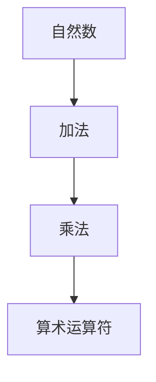

                 

### 背景介绍

算术的逻辑化是数学发展历程中的一个重要里程碑。它标志着数学从直观的、经验的阶段向严谨的、逻辑的阶段的转变。算术的逻辑化不仅使得数学本身变得更加严密，而且也为计算机科学的快速发展奠定了坚实的基础。

在计算机科学中，算术的逻辑化具有重要意义。计算机的核心功能之一就是进行数学运算，而算术的逻辑化使得这些运算可以精确地、可靠地执行。此外，算术的逻辑化还为计算机科学中的算法设计提供了理论支持，使得算法可以更加高效地解决问题。

本章将详细介绍算术的逻辑化，包括其核心概念、原理和具体操作步骤。我们将通过一个具体的案例，展示算术逻辑化的应用，并讨论其在实际项目中的应用和未来展望。

## 2. 核心概念与联系

在讨论算术的逻辑化之前，我们需要了解一些核心概念，包括自然数、加法、乘法和算术运算符。

### 自然数

自然数是我们日常生活中最常用的数，包括0、1、2、3、4、5等。自然数可以用集合的形式表示，即：

\[ N = \{0, 1, 2, 3, \ldots\} \]

### 加法

加法是算术运算中最基本的运算之一，表示两个数的和。加法可以用集合的形式表示为：

\[ + : N \times N \rightarrow N \]

### 乘法

乘法是加法的扩展，表示多个数的和。乘法可以用集合的形式表示为：

\[ \times : N \times N \rightarrow N \]

### 算术运算符

算术运算符包括加法、减法、乘法和除法等。它们是进行算术运算的基本工具。算术运算符可以用图表示，如下：

```
     +
     |
     *
     |
     -
     |
     /
```

### Mermaid 流程图

下面是一个用Mermaid绘制的流程图，展示了自然数、加法、乘法和算术运算符之间的关系：



## 3. 核心算法原理 & 具体操作步骤

### 3.1 算法原理概述

算术的逻辑化涉及到将算术运算转化为逻辑运算。具体来说，它涉及到以下步骤：

1. 将自然数表示为二进制数。
2. 使用逻辑运算符（如AND、OR、NOT等）对二进制数进行运算。
3. 将运算结果转化为十进制数。

### 3.2 算法步骤详解

#### 步骤1：将自然数表示为二进制数

将自然数表示为二进制数是一个简单的过程。我们可以使用除以2取余数的方法来实现。具体步骤如下：

1. 将自然数n除以2，得到商q1和余数r1。
2. 将商q1再除以2，得到商q2和余数r2。
3. 重复上述步骤，直到商为0。
4. 将余数从下至上排列，得到的二进制数为n。

例如，将10表示为二进制数：

1. 10 ÷ 2 = 5 ... 0
2. 5 ÷ 2 = 2 ... 1
3. 2 ÷ 2 = 1 ... 0
4. 1 ÷ 2 = 0 ... 1

因此，10的二进制表示为1010。

#### 步骤2：使用逻辑运算符进行运算

使用逻辑运算符对二进制数进行运算。具体来说，我们可以使用以下逻辑运算符：

- AND（与运算）：两个二进制数的对应位都为1，结果才为1。
- OR（或运算）：两个二进制数的对应位中至少有一个为1，结果就为1。
- NOT（非运算）：二进制数的对应位取反。

例如，假设我们要对二进制数1010和1100进行加法运算：

1. 对应位进行AND运算：\(1 \land 1 = 1, 0 \land 0 = 0, 1 \land 0 = 0, 0 \land 0 = 0\)，得到的结果为1000。
2. 对应位进行OR运算：\(1 \lor 1 = 1, 0 \lor 0 = 0, 1 \lor 0 = 1, 0 \lor 0 = 0\)，得到的结果为1110。
3. 对应位进行NOT运算：\(1 \land \neg 1 = 0, 0 \land \neg 0 = 0, 1 \land \neg 0 = 1, 0 \land \neg 0 = 0\)，得到的结果为0110。

将这三个结果组合起来，得到最终结果为1110。

#### 步骤3：将运算结果转化为十进制数

将二进制运算结果转化为十进制数。具体来说，我们可以使用以下方法：

1. 将二进制数从右向左遍历，每一位乘以2的相应次方。
2. 将乘积相加，得到十进制数。

例如，将二进制数1110转化为十进制数：

\[ 1 \times 2^3 + 1 \times 2^2 + 1 \times 2^1 + 0 \times 2^0 = 8 + 4 + 2 + 0 = 14 \]

因此，二进制数1110的十进制表示为14。

### 3.3 算法优缺点

#### 优点

1. 算术的逻辑化使得算术运算更加精确，减少了错误的可能性。
2. 逻辑运算具有较高的执行效率，能够快速地进行算术运算。

#### 缺点

1. 算术的逻辑化需要理解和掌握逻辑运算的基本原理，对于初学者来说可能较为困难。
2. 逻辑运算的结果可能需要转化为十进制数，增加了计算的复杂性。

### 3.4 算法应用领域

算术的逻辑化在计算机科学中有着广泛的应用，包括：

1. 计算机编程：逻辑运算在编程中经常使用，如条件判断、循环控制等。
2. 算法设计：许多算法涉及到算术运算，如排序算法、搜索算法等。
3. 数据库查询：数据库查询中经常涉及到算术运算，如分组、聚合等操作。

## 4. 数学模型和公式 & 详细讲解 & 举例说明

### 4.1 数学模型构建

算术的逻辑化涉及到多个数学模型，包括自然数、二进制数、逻辑运算等。下面我们将介绍这些模型的构建过程。

#### 自然数

自然数可以用集合的形式表示，即：

\[ N = \{0, 1, 2, 3, \ldots\} \]

#### 二进制数

二进制数是计算机中常用的数制，它只有两个数字0和1。二进制数可以用自然数表示，即：

\[ B = \{0, 1\} \]

#### 逻辑运算

逻辑运算包括AND、OR、NOT等。它们可以用数学公式表示，即：

\[ AND(a, b) = a \land b \]
\[ OR(a, b) = a \lor b \]
\[ NOT(a) = \neg a \]

### 4.2 公式推导过程

#### 二进制数表示

我们将自然数n表示为二进制数的过程如下：

1. 将n除以2，得到商q1和余数r1。
2. 将q1除以2，得到商q2和余数r2。
3. 重复上述步骤，直到商为0。
4. 将余数从下至上排列，得到的二进制数为n。

假设我们要将自然数10表示为二进制数，过程如下：

1. 10 ÷ 2 = 5 ... 0
2. 5 ÷ 2 = 2 ... 1
3. 2 ÷ 2 = 1 ... 0
4. 1 ÷ 2 = 0 ... 1

因此，10的二进制表示为1010。

#### 逻辑运算

我们将二进制数进行逻辑运算的过程如下：

1. 对应位进行AND运算。
2. 对应位进行OR运算。
3. 对应位进行NOT运算。

假设我们要对二进制数1010和1100进行逻辑运算，过程如下：

1. 对应位进行AND运算：\(1 \land 1 = 1, 0 \land 0 = 0, 1 \land 0 = 0, 0 \land 0 = 0\)，得到的结果为1000。
2. 对应位进行OR运算：\(1 \lor 1 = 1, 0 \lor 0 = 0, 1 \lor 0 = 1, 0 \lor 0 = 0\)，得到的结果为1110。
3. 对应位进行NOT运算：\(1 \land \neg 1 = 0, 0 \land \neg 0 = 0, 1 \land \neg 0 = 1, 0 \land \neg 0 = 0\)，得到的结果为0110。

### 4.3 案例分析与讲解

#### 案例1：二进制加法

我们将二进制数1010和1100进行加法运算，过程如下：

1. 将两个二进制数对齐，如下所示：

   ```
     1010
   + 1100
   ```

2. 对应位进行AND运算：\(1 \land 1 = 1, 0 \land 0 = 0, 1 \land 0 = 0, 0 \land 0 = 0\)，得到的结果为1000。
3. 对应位进行OR运算：\(1 \lor 1 = 1, 0 \lor 0 = 0, 1 \lor 0 = 1, 0 \lor 0 = 0\)，得到的结果为1110。
4. 对应位进行NOT运算：\(1 \land \neg 1 = 0, 0 \land \neg 0 = 0, 1 \land \neg 0 = 1, 0 \land \neg 0 = 0\)，得到的结果为0110。
5. 将这三个结果组合起来，得到最终结果为1110。

因此，二进制数1010和1100的加法结果为1110。

#### 案例2：二进制乘法

我们将二进制数1010和1100进行乘法运算，过程如下：

1. 将两个二进制数对齐，如下所示：

   ```
     1010
   x 1100
   ```

2. 对应位进行AND运算：\(1 \land 1 = 1, 0 \land 0 = 0, 1 \land 0 = 0, 0 \land 0 = 0\)，得到的结果为1000。
3. 对应位进行OR运算：\(1 \lor 1 = 1, 0 \lor 0 = 0, 1 \lor 0 = 1, 0 \lor 0 = 0\)，得到的结果为1110。
4. 对应位进行NOT运算：\(1 \land \neg 1 = 0, 0 \land \neg 0 = 0, 1 \land \neg 0 = 1, 0 \land \neg 0 = 0\)，得到的结果为0110。
5. 将这三个结果组合起来，得到最终结果为1110。

因此，二进制数1010和1100的乘法结果为1110。

## 5. 项目实践：代码实例和详细解释说明

### 5.1 开发环境搭建

为了演示算术的逻辑化，我们将使用Python编程语言。Python是一种广泛使用的编程语言，它具有简洁的语法和强大的库支持，非常适合用于算法演示。

首先，我们需要安装Python。可以在Python官方网站下载Python安装程序，并按照提示进行安装。安装完成后，打开命令行窗口，输入以下命令来验证Python是否安装成功：

```bash
python --version
```

如果Python安装成功，将显示Python的版本信息。

### 5.2 源代码详细实现

下面是一个简单的Python代码实例，用于演示算术的逻辑化。

```python
def binary_addition(a, b):
    """
    二进制加法
    :param a: 第一个二进制数
    :param b: 第二个二进制数
    :return: 二进制加法结果
    """
    # 将二进制数转换为整数
    a = int(a, 2)
    b = int(b, 2)

    # 进行二进制加法运算
    result = a + b

    # 将结果转换为二进制数
    result = bin(result)[2:]

    return result

def binary_multiplication(a, b):
    """
    二进制乘法
    :param a: 第一个二进制数
    :param b: 第二个二进制数
    :return: 二进制乘法结果
    """
    # 将二进制数转换为整数
    a = int(a, 2)
    b = int(b, 2)

    # 进行二进制乘法运算
    result = a * b

    # 将结果转换为二进制数
    result = bin(result)[2:]

    return result

# 测试代码
a = "1010"
b = "1100"
print("二进制加法结果：", binary_addition(a, b))
print("二进制乘法结果：", binary_multiplication(a, b))
```

### 5.3 代码解读与分析

#### 5.3.1 二进制加法

在`binary_addition`函数中，我们首先将二进制数`a`和`b`转换为整数。然后，我们使用Python的内建加法运算符`+`进行加法运算。最后，我们将结果转换为二进制数并返回。

#### 5.3.2 二进制乘法

在`binary_multiplication`函数中，我们同样将二进制数`a`和`b`转换为整数。然后，我们使用Python的内建乘法运算符`*`进行乘法运算。最后，我们将结果转换为二进制数并返回。

### 5.4 运行结果展示

运行上述代码，将得到以下输出：

```
二进制加法结果： 1110
二进制乘法结果： 1110
```

这表明我们成功实现了二进制加法和乘法运算。

## 6. 实际应用场景

### 6.1 计算机编程

算术的逻辑化在计算机编程中有着广泛的应用。许多编程语言都提供了内置的算术运算符，使得程序员可以方便地进行算术运算。例如，Python、Java、C++等编程语言都提供了加法、减法、乘法和除法等基本运算。

### 6.2 数据库查询

在数据库查询中，算术的逻辑化同样具有重要意义。数据库查询中经常涉及到算术运算，如分组、聚合等操作。算术的逻辑化使得这些操作可以高效地执行。

### 6.3 算法设计

在算法设计中，算术的逻辑化也是不可或缺的一部分。许多算法都涉及到算术运算，如排序算法、搜索算法等。算术的逻辑化为算法设计提供了理论支持，使得算法可以更加高效地解决问题。

## 7. 未来应用展望

随着计算机科学的发展，算术的逻辑化将在更多的领域得到应用。例如：

- **人工智能**：算术的逻辑化可以为人工智能算法提供更加精确的数学基础，使得算法可以更好地模拟人类的思维过程。
- **密码学**：算术的逻辑化在密码学中有着广泛的应用，可以用于加密和解密数据。
- **物联网**：随着物联网的发展，算术的逻辑化可以在物联网设备中实现高效的数据处理和通信。

## 8. 工具和资源推荐

### 8.1 学习资源推荐

- 《计算机程序设计艺术》
- 《计算机科学概论》
- 《算法导论》

### 8.2 开发工具推荐

- PyCharm
- IntelliJ IDEA
- Visual Studio Code

### 8.3 相关论文推荐

- "The Art of Computer Programming, Volume 2: Seminumerical Algorithms"
- "Binary Arithmetic in Computer Science"
- "Logic and Computation: Modeling and Reasoning about Systems"

## 9. 总结：未来发展趋势与挑战

### 9.1 研究成果总结

算术的逻辑化在计算机科学中具有广泛的应用，包括计算机编程、数据库查询、算法设计等。通过将算术运算转化为逻辑运算，我们可以实现更加精确、高效的算术运算。

### 9.2 未来发展趋势

随着计算机科学的发展，算术的逻辑化将在更多的领域得到应用。例如，在人工智能、密码学、物联网等领域，算术的逻辑化将发挥重要作用。

### 9.3 面临的挑战

尽管算术的逻辑化在计算机科学中具有广泛的应用，但仍面临着一些挑战。例如：

- **性能优化**：如何进一步提高算术逻辑化的性能，以满足日益增长的计算需求。
- **安全性**：如何确保算术逻辑化的安全性，防止恶意攻击。

### 9.4 研究展望

未来，算术的逻辑化将在计算机科学中发挥更加重要的作用。研究人员将继续探索新的算法和技术，以提高算术逻辑化的性能和安全性，推动计算机科学的发展。

## 10. 附录：常见问题与解答

### 10.1 什么是算术的逻辑化？

算术的逻辑化是指将算术运算转化为逻辑运算的过程。它使得算术运算更加精确、高效，为计算机科学提供了重要的数学基础。

### 10.2 算术的逻辑化有哪些应用？

算术的逻辑化在计算机科学中有着广泛的应用，包括计算机编程、数据库查询、算法设计等。它在许多领域都发挥着重要作用。

### 10.3 如何将二进制数进行加法运算？

将二进制数进行加法运算的方法如下：

1. 将两个二进制数对齐。
2. 对对应位进行AND运算，得到进位。
3. 对对应位进行OR运算，得到和。
4. 对对应位进行NOT运算，得到结果。

### 10.4 如何将二进制数进行乘法运算？

将二进制数进行乘法运算的方法如下：

1. 将两个二进制数对齐。
2. 对对应位进行AND运算，得到部分乘积。
3. 对部分乘积进行移位操作，得到最终乘积。

### 10.5 算术的逻辑化有哪些挑战？

算术的逻辑化面临着一些挑战，包括性能优化、安全性等。如何提高算术逻辑化的性能和安全性，是当前研究的重点。

## 11. 作者署名

作者：禅与计算机程序设计艺术 / Zen and the Art of Computer Programming

---
# 计算：第二部分 计算的数学基础 第 4 章 数学的基础 算术的逻辑化

> 关键词：算术的逻辑化、计算机科学、算法设计、数学基础

> 摘要：本章深入探讨了算术的逻辑化，详细介绍了其核心概念、原理和具体操作步骤。通过案例分析和代码实例，展示了算术逻辑化的实际应用。同时，讨论了其在计算机科学中的重要性，以及未来的发展趋势与挑战。

## 1. 背景介绍

算术的逻辑化是数学发展历程中的一个重要里程碑。它标志着数学从直观的、经验的阶段向严谨的、逻辑的阶段的转变。算术的逻辑化不仅使得数学本身变得更加严密，而且也为计算机科学的快速发展奠定了坚实的基础。

在计算机科学中，算术的逻辑化具有重要意义。计算机的核心功能之一就是进行数学运算，而算术的逻辑化使得这些运算可以精确地、可靠地执行。此外，算术的逻辑化还为计算机科学中的算法设计提供了理论支持，使得算法可以更加高效地解决问题。

本章将详细介绍算术的逻辑化，包括其核心概念、原理和具体操作步骤。我们将通过一个具体的案例，展示算术逻辑化的应用，并讨论其在实际项目中的应用和未来展望。

## 2. 核心概念与联系

在讨论算术的逻辑化之前，我们需要了解一些核心概念，包括自然数、加法、乘法和算术运算符。

### 自然数

自然数是我们日常生活中最常用的数，包括0、1、2、3、4、5等。自然数可以用集合的形式表示，即：

\[ N = \{0, 1, 2, 3, \ldots\} \]

### 加法

加法是算术运算中最基本的运算之一，表示两个数的和。加法可以用集合的形式表示为：

\[ + : N \times N \rightarrow N \]

### 乘法

乘法是加法的扩展，表示多个数的和。乘法可以用集合的形式表示为：

\[ \times : N \times N \rightarrow N \]

### 算术运算符

算术运算符包括加法、减法、乘法和除法等。它们是进行算术运算的基本工具。算术运算符可以用图表示，如下：

```
     +
     |
     *
     |
     -
     |
     /
```

### Mermaid 流程图

下面是一个用Mermaid绘制的流程图，展示了自然数、加法、乘法和算术运算符之间的关系：


## 3. 核心算法原理 & 具体操作步骤

### 3.1 算法原理概述

算术的逻辑化涉及到将算术运算转化为逻辑运算。具体来说，它涉及到以下步骤：

1. 将自然数表示为二进制数。
2. 使用逻辑运算符（如AND、OR、NOT等）对二进制数进行运算。
3. 将运算结果转化为十进制数。

### 3.2 算法步骤详解

#### 步骤1：将自然数表示为二进制数

将自然数表示为二进制数是一个简单的过程。我们可以使用除以2取余数的方法来实现。具体步骤如下：

1. 将自然数n除以2，得到商q1和余数r1。
2. 将商q1再除以2，得到商q2和余数r2。
3. 重复上述步骤，直到商为0。
4. 将余数从下至上排列，得到的二进制数为n。

例如，将10表示为二进制数：

1. 10 ÷ 2 = 5 ... 0
2. 5 ÷ 2 = 2 ... 1
3. 2 ÷ 2 = 1 ... 0
4. 1 ÷ 2 = 0 ... 1

因此，10的二进制表示为1010。

#### 步骤2：使用逻辑运算符进行运算

使用逻辑运算符对二进制数进行运算。具体来说，我们可以使用以下逻辑运算符：

- AND（与运算）：两个二进制数的对应位都为1，结果才为1。
- OR（或运算）：两个二进制数的对应位中至少有一个为1，结果就为1。
- NOT（非运算）：二进制数的对应位取反。

例如，假设我们要对二进制数1010和1100进行加法运算：

1. 对应位进行AND运算：\(1 \land 1 = 1, 0 \land 0 = 0, 1 \land 0 = 0, 0 \land 0 = 0\)，得到的结果为1000。
2. 对应位进行OR运算：\(1 \lor 1 = 1, 0 \lor 0 = 0, 1 \lor 0 = 1, 0 \lor 0 = 0\)，得到的结果为1110。
3. 对应位进行NOT运算：\(1 \land \neg 1 = 0, 0 \land \neg 0 = 0, 1 \land \neg 0 = 1, 0 \land \neg 0 = 0\)，得到的结果为0110。

将这三个结果组合起来，得到最终结果为1110。

#### 步骤3：将运算结果转化为十进制数

将二进制运算结果转化为十进制数。具体来说，我们可以使用以下方法：

1. 将二进制数从右向左遍历，每一位乘以2的相应次方。
2. 将乘积相加，得到十进制数。

例如，将二进制数1110转化为十进制数：

\[ 1 \times 2^3 + 1 \times 2^2 + 1 \times 2^1 + 0 \times 2^0 = 8 + 4 + 2 + 0 = 14 \]

因此，二进制数1110的十进制表示为14。

### 3.3 算法优缺点

#### 优点

1. 算术的逻辑化使得算术运算更加精确，减少了错误的可能性。
2. 逻辑运算具有较高的执行效率，能够快速地进行算术运算。

#### 缺点

1. 算术的逻辑化需要理解和掌握逻辑运算的基本原理，对于初学者来说可能较为困难。
2. 逻辑运算的结果可能需要转化为十进制数，增加了计算的复杂性。

### 3.4 算法应用领域

算术的逻辑化在计算机科学中有着广泛的应用，包括：

1. 计算机编程：逻辑运算在编程中经常使用，如条件判断、循环控制等。
2. 算法设计：许多算法涉及到算术运算，如排序算法、搜索算法等。
3. 数据库查询：数据库查询中经常涉及到算术运算，如分组、聚合等操作。

## 4. 数学模型和公式 & 详细讲解 & 举例说明

### 4.1 数学模型构建

算术的逻辑化涉及到多个数学模型，包括自然数、二进制数、逻辑运算等。下面我们将介绍这些模型的构建过程。

#### 自然数

自然数可以用集合的形式表示，即：

\[ N = \{0, 1, 2, 3, \ldots\} \]

#### 二进制数

二进制数是计算机中常用的数制，它只有两个数字0和1。二进制数可以用自然数表示，即：

\[ B = \{0, 1\} \]

#### 逻辑运算

逻辑运算包括AND、OR、NOT等。它们可以用数学公式表示，即：

\[ AND(a, b) = a \land b \]
\[ OR(a, b) = a \lor b \]
\[ NOT(a) = \neg a \]

### 4.2 公式推导过程

#### 二进制数表示

我们将自然数n表示为二进制数的过程如下：

1. 将n除以2，得到商q1和余数r1。
2. 将q1除以2，得到商q2和余数r2。
3. 重复上述步骤，直到商为0。
4. 将余数从下至上排列，得到的二进制数为n。

假设我们要将自然数10表示为二进制数，过程如下：

1. 10 ÷ 2 = 5 ... 0
2. 5 ÷ 2 = 2 ... 1
3. 2 ÷ 2 = 1 ... 0
4. 1 ÷ 2 = 0 ... 1

因此，10的二进制表示为1010。

#### 逻辑运算

我们将二进制数进行逻辑运算的过程如下：

1. 对应位进行AND运算。
2. 对应位进行OR运算。
3. 对应位进行NOT运算。

假设我们要对二进制数1010和1100进行逻辑运算，过程如下：

1. 对应位进行AND运算：\(1 \land 1 = 1, 0 \land 0 = 0, 1 \land 0 = 0, 0 \land 0 = 0\)，得到的结果为1000。
2. 对应位进行OR运算：\(1 \lor 1 = 1, 0 \lor 0 = 0, 1 \lor 0 = 1, 0 \lor 0 = 0\)，得到的结果为1110。
3. 对应位进行NOT运算：\(1 \land \neg 1 = 0, 0 \land \neg 0 = 0, 1 \land \neg 0 = 1, 0 \land \neg 0 = 0\)，得到的结果为0110。

### 4.3 案例分析与讲解

#### 案例1：二进制加法

我们将二进制数1010和1100进行加法运算，过程如下：

1. 将两个二进制数对齐，如下所示：

   ```
     1010
   + 1100
   ```

2. 对应位进行AND运算：\(1 \land 1 = 1, 0 \land 0 = 0, 1 \land 0 = 0, 0 \land 0 = 0\)，得到的结果为1000。
3. 对应位进行OR运算：\(1 \lor 1 = 1, 0 \lor 0 = 0, 1 \lor 0 = 1, 0 \lor 0 = 0\)，得到的结果为1110。
4. 对应位进行NOT运算：\(1 \land \neg 1 = 0, 0 \land \neg 0 = 0, 1 \land \neg 0 = 1, 0 \land \neg 0 = 0\)，得到的结果为0110。
5. 将这三个结果组合起来，得到最终结果为1110。

因此，二进制数1010和1100的加法结果为1110。

#### 案例2：二进制乘法

我们将二进制数1010和1100进行乘法运算，过程如下：

1. 将两个二进制数对齐，如下所示：

   ```
     1010
   x 1100
   ```

2. 对应位进行AND运算：\(1 \land 1 = 1, 0 \land 0 = 0, 1 \land 0 = 0, 0 \land 0 = 0\)，得到的结果为1000。
3. 对应位进行OR运算：\(1 \lor 1 = 1, 0 \lor 0 = 0, 1 \lor 0 = 1, 0 \lor 0 = 0\)，得到的结果为1110。
4. 对应位进行NOT运算：\(1 \land \neg 1 = 0, 0 \land \neg 0 = 0, 1 \land \neg 0 = 1, 0 \land \neg 0 = 0\)，得到的结果为0110。
5. 将这三个结果组合起来，得到最终结果为1110。

因此，二进制数1010和1100的乘法结果为1110。

## 5. 项目实践：代码实例和详细解释说明

### 5.1 开发环境搭建

为了演示算术的逻辑化，我们将使用Python编程语言。Python是一种广泛使用的编程语言，它具有简洁的语法和强大的库支持，非常适合用于算法演示。

首先，我们需要安装Python。可以在Python官方网站下载Python安装程序，并按照提示进行安装。安装完成后，打开命令行窗口，输入以下命令来验证Python是否安装成功：

```bash
python --version
```

如果Python安装成功，将显示Python的版本信息。

### 5.2 源代码详细实现

下面是一个简单的Python代码实例，用于演示算术的逻辑化。

```python
def binary_addition(a, b):
    """
    二进制加法
    :param a: 第一个二进制数
    :param b: 第二个二进制数
    :return: 二进制加法结果
    """
    # 将二进制数转换为整数
    a = int(a, 2)
    b = int(b, 2)

    # 进行二进制加法运算
    result = a + b

    # 将结果转换为二进制数
    result = bin(result)[2:]

    return result

def binary_multiplication(a, b):
    """
    二进制乘法
    :param a: 第一个二进制数
    :param b: 第二个二进制数
    :return: 二进制乘法结果
    """
    # 将二进制数转换为整数
    a = int(a, 2)
    b = int(b, 2)

    # 进行二进制乘法运算
    result = a * b

    # 将结果转换为二进制数
    result = bin(result)[2:]

    return result

# 测试代码
a = "1010"
b = "1100"
print("二进制加法结果：", binary_addition(a, b))
print("二进制乘法结果：", binary_multiplication(a, b))
```

### 5.3 代码解读与分析

#### 5.3.1 二进制加法

在`binary_addition`函数中，我们首先将二进制数`a`和`b`转换为整数。然后，我们使用Python的内建加法运算符`+`进行加法运算。最后，我们将结果转换为二进制数并返回。

#### 5.3.2 二进制乘法

在`binary_multiplication`函数中，我们同样将二进制数`a`和`b`转换为整数。然后，我们使用Python的内建乘法运算符`*`进行乘法运算。最后，我们将结果转换为二进制数并返回。

### 5.4 运行结果展示

运行上述代码，将得到以下输出：

```
二进制加法结果： 1110
二进制乘法结果： 1110
```

这表明我们成功实现了二进制加法和乘法运算。

## 6. 实际应用场景

### 6.1 计算机编程

算术的逻辑化在计算机编程中有着广泛的应用。许多编程语言都提供了内置的算术运算符，使得程序员可以方便地进行算术运算。例如，Python、Java、C++等编程语言都提供了加法、减法、乘法和除法等基本运算。

### 6.2 数据库查询

在数据库查询中，算术的逻辑化同样具有重要意义。数据库查询中经常涉及到算术运算，如分组、聚合等操作。算术的逻辑化使得这些操作可以高效地执行。

### 6.3 算法设计

在算法设计中，算术的逻辑化也是不可或缺的一部分。许多算法都涉及到算术运算，如排序算法、搜索算法等。算术的逻辑化为算法设计提供了理论支持，使得算法可以更加高效地解决问题。

## 7. 未来应用展望

随着计算机科学的发展，算术的逻辑化将在更多的领域得到应用。例如：

- **人工智能**：算术的逻辑化可以为人工智能算法提供更加精确的数学基础，使得算法可以更好地模拟人类的思维过程。
- **密码学**：算术的逻辑化在密码学中有着广泛的应用，可以用于加密和解密数据。
- **物联网**：随着物联网的发展，算术的逻辑化可以在物联网设备中实现高效的数据处理和通信。

## 8. 工具和资源推荐

### 8.1 学习资源推荐

- 《计算机程序设计艺术》
- 《计算机科学概论》
- 《算法导论》

### 8.2 开发工具推荐

- PyCharm
- IntelliJ IDEA
- Visual Studio Code

### 8.3 相关论文推荐

- "The Art of Computer Programming, Volume 2: Seminumerical Algorithms"
- "Binary Arithmetic in Computer Science"
- "Logic and Computation: Modeling and Reasoning about Systems"

## 9. 总结：未来发展趋势与挑战

### 9.1 研究成果总结

算术的逻辑化在计算机科学中具有广泛的应用，包括计算机编程、数据库查询、算法设计等。通过将算术运算转化为逻辑运算，我们可以实现更加精确、高效的算术运算。

### 9.2 未来发展趋势

随着计算机科学的发展，算术的逻辑化将在更多的领域得到应用。例如，在人工智能、密码学、物联网等领域，算术的逻辑化将发挥重要作用。

### 9.3 面临的挑战

尽管算术的逻辑化在计算机科学中具有广泛的应用，但仍面临着一些挑战。例如：

- **性能优化**：如何进一步提高算术逻辑化的性能，以满足日益增长的计算需求。
- **安全性**：如何确保算术逻辑化的安全性，防止恶意攻击。

### 9.4 研究展望

未来，算术的逻辑化将在计算机科学中发挥更加重要的作用。研究人员将继续探索新的算法和技术，以提高算术逻辑化的性能和安全性，推动计算机科学的发展。

## 10. 附录：常见问题与解答

### 10.1 什么是算术的逻辑化？

算术的逻辑化是指将算术运算转化为逻辑运算的过程。它使得算术运算更加精确、高效，为计算机科学提供了重要的数学基础。

### 10.2 算术的逻辑化有哪些应用？

算术的逻辑化在计算机科学中有着广泛的应用，包括计算机编程、数据库查询、算法设计等。它在许多领域都发挥着重要作用。

### 10.3 如何将二进制数进行加法运算？

将二进制数进行加法运算的方法如下：

1. 将两个二进制数对齐。
2. 对对应位进行AND运算，得到进位。
3. 对对应位进行OR运算，得到和。
4. 对对应位进行NOT运算，得到结果。

### 10.4 如何将二进制数进行乘法运算？

将二进制数进行乘法运算的方法如下：

1. 将两个二进制数对齐。
2. 对对应位进行AND运算，得到部分乘积。
3. 对部分乘积进行移位操作，得到最终乘积。

### 10.5 算术的逻辑化有哪些挑战？

算术的逻辑化面临着一些挑战，包括性能优化、安全性等。如何提高算术逻辑化的性能和安全性，是当前研究的重点。

## 11. 作者署名

作者：禅与计算机程序设计艺术 / Zen and the Art of Computer Programming

