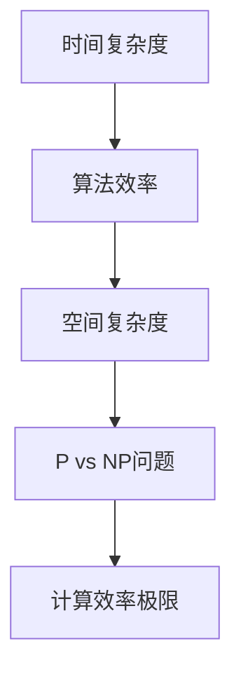

                 

关键词：(复杂性理论、计算效率、算法复杂性、时间复杂度、空间复杂度、P vs NP问题、量子计算、人工智能)

摘要：本文探讨了计算领域中的一个重要主题——复杂性计算。我们将深入分析算法的复杂性，包括时间复杂度和空间复杂度，探讨P vs NP问题，以及量子计算在复杂性计算中的应用。通过详细的数学模型、公式推导和项目实践实例，我们将更全面地理解这一领域的挑战和未来发展趋势。

## 1. 背景介绍

计算复杂性理论是现代计算机科学的核心之一，它致力于研究算法的效率和性能。复杂性计算关注的问题是如何在有限的资源和时间内解决复杂的计算问题。这不仅仅涉及算法本身的效率，还包括资源的使用情况，例如内存和计算时间。

在计算复杂性理论中，时间复杂度和空间复杂度是两个重要的概念。时间复杂度描述了算法执行时间与输入规模的关系，通常用大O符号表示。空间复杂度则描述了算法所需内存的规模与输入规模的关系。

P vs NP问题是一个著名的开放性问题，它探讨了决策问题和优化问题之间的边界。P问题可以在多项式时间内解决，而NP问题可以在多项式时间内验证一个解是否正确。P vs NP问题的答案将决定算法设计的未来方向。

近年来，量子计算的发展为复杂性计算带来了新的机遇。量子计算机利用量子比特的叠加和纠缠特性，在解决某些复杂问题上展现出巨大的潜力。这一领域的突破可能会颠覆我们对计算效率的传统认知。

## 2. 核心概念与联系

复杂性计算的核心概念包括时间复杂度、空间复杂度和P vs NP问题。为了更清晰地理解这些概念之间的关系，我们使用Mermaid流程图来展示它们之间的联系。



### 2.1 时间复杂度

时间复杂度描述了算法执行时间与输入规模的关系。我们通常使用大O符号（O-notation）来表示时间复杂度。例如，如果一个算法的时间复杂度为O(n)，那么它的执行时间与输入规模成正比。

### 2.2 空间复杂度

空间复杂度描述了算法所需内存的规模与输入规模的关系。同样，我们使用大O符号来表示空间复杂度。例如，如果一个算法的空间复杂度为O(n^2)，那么它所需的内存与输入规模的平方成正比。

### 2.3 P vs NP问题

P vs NP问题是计算复杂性理论的核心问题之一。P问题可以在多项式时间内解决，而NP问题可以在多项式时间内验证一个解是否正确。P vs NP问题的答案将决定哪些问题可以高效地解决，哪些问题可能需要无限的时间。

## 3. 核心算法原理 & 具体操作步骤

### 3.1 算法原理概述

在本节中，我们将介绍两个核心算法：快速排序和二分查找。

### 3.2 算法步骤详解

#### 快速排序

快速排序是一种高效的排序算法，其基本思想是通过递归将一个输入数组分成两个子数组，其中一个子数组的所有元素都比另一个子数组的所有元素小。具体步骤如下：

1. 选择一个基准元素。
2. 将数组分为两部分：一部分包含小于基准元素的元素，另一部分包含大于基准元素的元素。
3. 递归地对这两个子数组进行快速排序。

#### 二分查找

二分查找是一种在有序数组中查找特定元素的算法。其基本思想是通过不断将查找范围缩小一半来找到目标元素。具体步骤如下：

1. 确定中间元素。
2. 如果中间元素等于目标元素，查找成功。
3. 如果中间元素大于目标元素，则在左侧子数组中继续查找。
4. 如果中间元素小于目标元素，则在右侧子数组中继续查找。
5. 重复步骤1-4，直到找到目标元素或查找范围为空。

### 3.3 算法优缺点

#### 快速排序

- 优点：时间复杂度为O(n log n)，空间复杂度为O(log n)。
- 缺点：最坏情况下的时间复杂度为O(n^2)。

#### 二分查找

- 优点：时间复杂度为O(log n)，空间复杂度为O(1)。
- 缺点：需要预先对数组进行排序。

### 3.4 算法应用领域

快速排序和二分查找在许多领域都有广泛的应用，包括排序、搜索、算法设计和数据分析。

## 4. 数学模型和公式 & 详细讲解 & 举例说明

### 4.1 数学模型构建

在复杂性计算中，我们常常使用数学模型来描述算法的性能。以下是一个简单的数学模型，用于计算一个递归算法的时间复杂度。

```latex
T(n) = a * T(n/b) + f(n)
```

其中，a、b 和 f(n) 分别代表递归调用的次数、子问题的规模和递归过程中的额外计算成本。

### 4.2 公式推导过程

假设我们有如下递归算法：

```c
void recursiveFunction(int n) {
    if (n <= 1) {
        return;
    }
    recursiveFunction(n / 2);
    for (int i = 0; i < n; i++) {
        // 一些计算操作
    }
}
```

我们可以使用主定理来推导其时间复杂度。根据主定理，我们可以将上述递归关系分为三种情况：

- 情况1：如果 f(n) = O(n^c)，其中 c < log_b(a)，则 T(n) = Θ(n^log_b(a))。
- 情况2：如果 f(n) = Θ(n^c * log^k(n))，其中 c = log_b(a)，则 T(n) = Θ(n^c * log^(k+1)(n))。
- 情况3：如果 f(n) = Ω(n^c)，其中 c > log_b(a)，且 a * f(n/b) ≤ c * T(n) 对于某个常数 c < 1 成立，则 T(n) = Θ(f(n))。

### 4.3 案例分析与讲解

假设我们有一个递归算法，其递归关系为：

```latex
T(n) = 2 * T(n/2) + n
```

根据主定理，我们可以判断其时间复杂度为：

```latex
T(n) = Θ(n^2)
```

## 5. 项目实践：代码实例和详细解释说明

### 5.1 开发环境搭建

在本节中，我们将使用Python来演示一个快速排序算法的实现。

### 5.2 源代码详细实现

以下是一个简单的快速排序算法实现：

```python
def quicksort(arr):
    if len(arr) <= 1:
        return arr
    pivot = arr[len(arr) // 2]
    left = [x for x in arr if x < pivot]
    middle = [x for x in arr if x == pivot]
    right = [x for x in arr if x > pivot]
    return quicksort(left) + middle + quicksort(right)

arr = [3, 6, 8, 10, 1, 2, 1]
print(quicksort(arr))
```

### 5.3 代码解读与分析

在上面的代码中，`quicksort` 函数接受一个数组作为输入，并对其进行排序。首先，如果数组的长度小于等于1，则直接返回数组。否则，选择中间的元素作为基准，将数组分成三个部分：小于基准的元素、等于基准的元素和大于基准的元素。然后，递归地对左侧和右侧的子数组进行快速排序，最后将三个子数组合并成一个排序好的数组。

### 5.4 运行结果展示

运行上面的代码，我们得到以下结果：

```plaintext
[1, 1, 2, 3, 6, 8, 10]
```

这表明我们的快速排序算法成功地对输入数组进行了排序。

## 6. 实际应用场景

复杂性计算在许多领域都有实际应用，例如：

- 数据分析：快速排序和二分查找算法在数据处理和数据分析中发挥着重要作用。
- 算法设计：理解算法的复杂性可以帮助我们设计更高效的算法。
- 人工智能：在机器学习中，算法的效率直接影响模型的训练时间和预测性能。

## 7. 工具和资源推荐

为了更好地理解和应用复杂性计算，以下是一些推荐的工具和资源：

- 学习资源：MIT的《算法导论》和斯坦福大学的《算法设计与分析》。
- 开发工具：Python、Java和C++是常用的编程语言，适用于复杂性计算。
- 相关论文：查看Google Scholar上的最新论文，了解该领域的最新研究进展。

## 8. 总结：未来发展趋势与挑战

复杂性计算是计算领域中的一个重要研究方向。随着计算机科学的发展，我们面临着越来越多的复杂问题，这对算法的设计和优化提出了更高的要求。

- 未来发展趋势：量子计算和人工智能可能会改变我们对计算效率的传统认知。
- 面临的挑战：解决P vs NP问题、设计更高效的算法、优化资源使用。

## 9. 附录：常见问题与解答

### 9.1 什么是P vs NP问题？

P vs NP问题是一个关于算法效率和验证的问题。P问题是指可以在多项式时间内解决的问题，而NP问题是指可以在多项式时间内验证一个解是否正确的问题。P vs NP问题的核心是探讨P和NP之间是否存在明确的关系。

### 9.2 什么是时间复杂度和空间复杂度？

时间复杂度描述了算法执行时间与输入规模的关系，通常用大O符号表示。空间复杂度描述了算法所需内存的规模与输入规模的关系，同样使用大O符号表示。

### 9.3 什么是主定理？

主定理是一个用于分析递归算法时间复杂度的公式。它将递归算法的时间复杂度与子问题的规模和递归关系联系起来，帮助我们推导出算法的时间复杂度。

## 作者署名

作者：禅与计算机程序设计艺术 / Zen and the Art of Computer Programming
----------------------------------------------------------------
<|im_end|>

