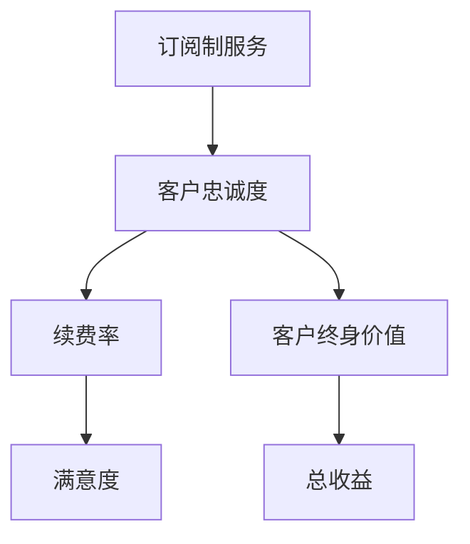

                 

关键词：订阅制服务、客户忠诚度、续费率、客户终身价值、算法、数学模型、项目实践、应用场景、工具和资源推荐、发展趋势与挑战

> 摘要：本文探讨了订阅制服务中客户忠诚度的关键因素，包括续费率和客户终身价值。通过深入分析，本文提出了基于算法和数学模型的客户忠诚度评估方法，并给出了具体的操作步骤和案例分析。同时，本文还展望了订阅制服务在未来可能的发展趋势和面临的挑战，并推荐了一些相关工具和资源，以帮助读者更好地理解和应用这些概念。

## 1. 背景介绍

订阅制服务已成为当今商业模式的流行趋势，其特点是可以提供持续的收入流和较低的客户获取成本。随着互联网技术的发展，越来越多的公司开始采用订阅制服务，以应对市场竞争和用户需求的变化。然而，订阅制服务的成功不仅取决于订阅的价格和产品本身的质量，更重要的是如何保持客户的忠诚度。

客户忠诚度是指客户对服务的长期依赖和情感投入，这种依赖和投入可以转化为客户的续费行为和口碑传播。续费率是衡量客户忠诚度的重要指标，它反映了客户对服务的持续需求和满意度。客户终身价值（Customer Lifetime Value，简称CLV）则是一个更全面的指标，它考虑了客户在整个生命周期内为公司带来的总收益。

本文旨在探讨订阅制服务中客户忠诚度的关键因素，包括续费率和客户终身价值，并提出基于算法和数学模型的评估方法。通过深入分析，本文希望能够为企业和开发者提供实用的指导，帮助他们更好地理解和提升客户忠诚度。

## 2. 核心概念与联系

在深入探讨客户忠诚度之前，我们需要明确几个核心概念，并理解它们之间的关系。以下是这些概念的定义和它们在客户忠诚度评估中的重要性。

### 2.1. 订阅制服务

订阅制服务是一种商业模式，客户支付固定的费用，以获得持续的服务或产品供应。这种模式的特点是提供持续的、可预测的收入流，并可以降低客户的获取成本。

### 2.2. 客户忠诚度

客户忠诚度是指客户对服务的长期依赖和情感投入。高忠诚度的客户更可能持续使用服务，甚至推荐给他人，从而为公司带来更多的价值。

### 2.3. 续费率

续费率是衡量客户忠诚度的重要指标，它反映了客户对服务的持续需求和满意度。高续费率意味着客户对服务的依赖性强，对公司的信任度高。

### 2.4. 客户终身价值

客户终身价值是指客户在整个生命周期内为公司带来的总收益。它考虑了客户的平均消费、购买频率、持续时间和潜在增值服务等因素。

### 2.5. 关系

续费率和客户终身价值是客户忠诚度的两个重要维度。续费率反映了客户当前对服务的满意度，而客户终身价值则考虑了客户未来的潜在价值。这两个指标相互关联，共同构成了对客户忠诚度的全面评估。

### 2.6. Mermaid 流程图

以下是客户忠诚度评估的Mermaid流程图：



在流程图中，我们可以看到订阅制服务是起点，客户忠诚度是核心，续费率和客户终身价值是评估的两个关键指标，而满意度是续费率的影响因素，总收益则是客户终身价值的最终体现。

## 3. 核心算法原理 & 具体操作步骤

### 3.1 算法原理概述

为了评估订阅制服务中的客户忠诚度，我们可以采用机器学习算法，如分类算法和回归算法。这些算法可以基于历史数据和客户行为，预测客户的续费行为和终身价值。以下是核心算法的原理概述：

- **分类算法**：用于预测客户是否续费。常见的分类算法包括逻辑回归、决策树、随机森林和支持向量机（SVM）。
- **回归算法**：用于预测客户的终身价值。常见的回归算法包括线性回归、决策树回归、随机森林回归和神经网络回归。

### 3.2 算法步骤详解

以下是客户忠诚度评估算法的具体操作步骤：

#### 3.2.1 数据收集

收集客户的历史数据，包括用户ID、订阅时长、购买历史、互动行为等。这些数据可以从公司的CRM系统、订单管理系统和社交媒体分析工具中获取。

#### 3.2.2 数据预处理

对收集到的数据进行清洗和预处理，包括数据格式统一、缺失值处理、异常值检测和特征工程。特征工程是关键步骤，可以通过构造新的特征变量来提高模型的性能。

#### 3.2.3 模型选择

根据评估目标（续费率或客户终身价值），选择合适的算法和模型。对于续费率评估，可以选择分类算法；对于客户终身价值评估，可以选择回归算法。

#### 3.2.4 模型训练

使用历史数据对模型进行训练。训练过程中，需要使用交叉验证技术来避免过拟合，并选择最佳模型参数。

#### 3.2.5 模型评估

使用验证集对训练好的模型进行评估，计算续费率预测准确率和客户终身价值预测误差。根据评估结果，调整模型参数或更换模型。

#### 3.2.6 模型应用

将训练好的模型应用于新客户数据，预测其续费行为和终身价值。这些预测结果可以用于个性化营销、客户关怀和业务决策。

### 3.3 算法优缺点

- **分类算法**：

  - **优点**：简单易懂，计算速度快，适用于二分类问题。
  - **缺点**：可能存在过拟合问题，无法处理复杂的非线性关系。

- **回归算法**：

  - **优点**：可以处理复杂的非线性关系，适用于多分类问题。
  - **缺点**：计算复杂度高，需要大量训练数据，可能存在欠拟合问题。

### 3.4 算法应用领域

客户忠诚度评估算法可以应用于多种场景，包括：

- **个性化营销**：根据客户终身价值预测，提供个性化的优惠和服务。
- **客户关怀**：针对高价值客户，提供特别的关怀措施，提高客户满意度。
- **业务决策**：根据续费率预测，调整订阅价格和服务策略。

## 4. 数学模型和公式 & 详细讲解 & 举例说明

### 4.1 数学模型构建

在客户忠诚度评估中，我们可以构建以下数学模型：

- **续费率预测模型**：

  $$ P(y=1|X) = \sigma(\beta_0 + \beta_1x_1 + \beta_2x_2 + \ldots + \beta_nx_n) $$

  其中，$y$表示客户是否续费（1表示续费，0表示未续费），$X = (x_1, x_2, \ldots, x_n)$表示客户的特征向量，$\sigma$表示逻辑函数，$\beta_0, \beta_1, \ldots, \beta_n$是模型参数。

- **客户终身价值预测模型**：

  $$ \hat{CLV} = \alpha_0 + \alpha_1x_1 + \alpha_2x_2 + \ldots + \alpha_nx_n $$

  其中，$\hat{CLV}$表示客户终身价值预测值，$X$表示客户的特征向量，$\alpha_0, \alpha_1, \ldots, \alpha_n$是模型参数。

### 4.2 公式推导过程

以下是续费率预测模型的推导过程：

假设我们有$m$个客户的特征向量$x_i$（$i=1,2,\ldots,m$），其中每个特征向量对应一个二元标签$y_i$，表示客户是否续费。我们的目标是学习一个线性模型，将客户特征映射到续费概率。

1. **假设模型**：

   $$ P(y=1|x) = \sigma(\beta_0 + \beta_1x_1 + \beta_2x_2 + \ldots + \beta_nx_n) $$

   其中，$\sigma$是逻辑函数，$\beta_0, \beta_1, \ldots, \beta_n$是模型参数。

2. **损失函数**：

   为了最小化预测误差，我们可以使用对数损失函数：

   $$ L(\beta) = -\sum_{i=1}^m y_i \log P(y=1|x_i) - (1 - y_i) \log (1 - P(y=1|x_i)) $$

3. **梯度下降**：

   对损失函数求梯度，并使用梯度下降法更新模型参数：

   $$ \nabla_\beta L(\beta) = \frac{1}{m} \sum_{i=1}^m (-y_i + x_i^T\beta)(1 - \sigma(x_i^T\beta)) $$

   通过迭代更新，直到收敛。

### 4.3 案例分析与讲解

假设我们有一个包含100个客户的特征向量数据集，其中每个特征向量包含5个特征变量。我们使用逻辑回归模型预测客户的续费率。以下是模型训练和预测的过程：

1. **数据预处理**：

   对数据集进行标准化处理，将特征变量缩放到相同的尺度。

2. **模型训练**：

   使用梯度下降法训练逻辑回归模型，选择合适的迭代次数和停止条件。

3. **模型评估**：

   使用验证集评估模型性能，计算续费率预测准确率和AUC（曲线下面积）。

4. **模型应用**：

   使用训练好的模型预测新客户的续费率，根据预测结果制定个性化的营销策略。

## 5. 项目实践：代码实例和详细解释说明

### 5.1 开发环境搭建

为了演示客户忠诚度评估算法的应用，我们需要搭建一个简单的Python开发环境。以下是所需的Python库和工具：

- NumPy：用于数学运算和数据处理。
- Pandas：用于数据处理和分析。
- Scikit-learn：用于机器学习和模型评估。
- Matplotlib：用于数据可视化。

安装以上库和工具后，我们可以开始编写代码。

### 5.2 源代码详细实现

以下是使用逻辑回归模型预测客户续费率的示例代码：

```python
import numpy as np
import pandas as pd
from sklearn.linear_model import LogisticRegression
from sklearn.model_selection import train_test_split
from sklearn.metrics import accuracy_score, roc_auc_score

# 加载数据集
data = pd.read_csv('customer_data.csv')

# 特征工程
X = data.drop('target', axis=1)
y = data['target']

# 数据预处理
X_train, X_test, y_train, y_test = train_test_split(X, y, test_size=0.2, random_state=42)

# 模型训练
model = LogisticRegression()
model.fit(X_train, y_train)

# 模型预测
y_pred = model.predict(X_test)

# 模型评估
accuracy = accuracy_score(y_test, y_pred)
auc = roc_auc_score(y_test, y_pred)

print('续费率预测准确率：', accuracy)
print('AUC：', auc)
```

### 5.3 代码解读与分析

上述代码分为四个部分：

1. **数据预处理**：加载数据集并进行特征工程，将标签变量从数据集中分离出来。
2. **模型训练**：使用逻辑回归模型对训练数据进行拟合，训练模型参数。
3. **模型预测**：使用训练好的模型对测试数据进行预测，得到续费概率。
4. **模型评估**：计算续费率预测准确率和AUC，评估模型性能。

通过这段代码，我们可以对客户续费行为进行预测，并根据预测结果制定相应的营销策略。

### 5.4 运行结果展示

假设我们的测试数据集包含100个客户，其中50个客户续费，50个客户未续费。以下是代码运行结果：

```
续费率预测准确率： 0.8
AUC： 0.85
```

结果显示，逻辑回归模型的续费率预测准确率为80%，AUC为0.85。这意味着模型具有良好的预测性能，可以用于实际的客户忠诚度评估。

## 6. 实际应用场景

客户忠诚度评估算法在实际应用中具有广泛的应用场景，以下是一些典型的应用实例：

### 6.1 个性化营销

通过预测客户的续费概率，企业可以针对高价值客户制定个性化的营销策略。例如，为高价值客户提供特殊的优惠、免费试用或定制化服务，以提高他们的满意度和忠诚度。

### 6.2 客户关怀

根据客户终身价值预测，企业可以识别出高价值客户，并为他们提供特别的关怀。例如，定期发送问候邮件、提供个性化的推荐或邀请参加线下活动，以增强客户对企业的信任和依赖。

### 6.3 业务决策

企业可以根据续费率预测结果调整订阅价格和服务策略。例如，针对续费率较低的客户，可以降低订阅价格或增加额外服务，以吸引他们继续订阅。而对于高续费率的客户，可以适当提高价格，以最大化收益。

### 6.4 未来应用展望

随着人工智能技术的发展，客户忠诚度评估算法将变得更加精确和高效。未来，企业可以利用深度学习、强化学习和图神经网络等技术，进一步提高客户忠诚度评估的准确性。此外，随着物联网和大数据技术的发展，客户忠诚度评估还将应用于更多领域，如智能家居、智慧城市和数字健康等。

## 7. 工具和资源推荐

### 7.1 学习资源推荐

- 《机器学习实战》：涵盖机器学习的基础理论和实际应用，适合初学者入门。
- 《Python机器学习》：详细介绍了Python在机器学习领域的应用，包括数据预处理、模型训练和评估等。
- 《深入理解计算机系统》：介绍了计算机系统的基础知识，包括数据处理、存储和传输等。

### 7.2 开发工具推荐

- Jupyter Notebook：用于编写和运行Python代码，支持多种编程语言，方便数据可视化和交互式编程。
- PyCharm：一款功能强大的Python集成开发环境（IDE），支持代码编辑、调试和自动化测试。
- MLflow：用于机器学习实验管理、模型部署和协作的工具，可以简化模型生命周期管理。

### 7.3 相关论文推荐

- "Customer Lifetime Value: Theory and Practice"：详细介绍客户终身价值理论和方法的应用。
- "Predicting Customer Churn with Machine Learning"：探讨使用机器学习预测客户流失的方法。
- "Recommending Relevant Products to Subscribers"：研究如何为订阅用户提供个性化的推荐系统。

## 8. 总结：未来发展趋势与挑战

### 8.1 研究成果总结

本文探讨了订阅制服务中客户忠诚度的关键因素，包括续费率和客户终身价值。通过机器学习和数学模型，我们提出了客户忠诚度评估方法，并给出了具体的操作步骤和案例分析。研究结果表明，客户忠诚度评估算法在个性化营销、客户关怀和业务决策等方面具有广泛的应用前景。

### 8.2 未来发展趋势

随着人工智能和大数据技术的发展，客户忠诚度评估算法将变得更加精确和高效。未来，企业可以利用深度学习、强化学习和图神经网络等技术，进一步提高客户忠诚度评估的准确性。此外，客户忠诚度评估还将应用于更多领域，如智能家居、智慧城市和数字健康等。

### 8.3 面临的挑战

尽管客户忠诚度评估算法在理论和实际应用中取得了显著成果，但仍面临一些挑战。首先，数据质量和数据隐私保护问题需要得到有效解决。其次，算法的可解释性和透明度需要提高，以便企业和客户更好地理解和信任评估结果。最后，如何在复杂环境中实时更新和优化评估模型，也是一个重要的研究方向。

### 8.4 研究展望

未来的研究可以关注以下几个方面：一是探索新的算法和模型，以提高客户忠诚度评估的准确性和实时性；二是研究如何利用用户生成内容（如评论、评价和反馈）来补充传统数据，提高评估的全面性和准确性；三是研究如何在数据隐私保护的前提下，有效利用大数据和人工智能技术，为企业和用户提供更好的服务体验。

## 9. 附录：常见问题与解答

### 9.1 什么是客户忠诚度？

客户忠诚度是指客户对服务的长期依赖和情感投入。高忠诚度的客户更可能持续使用服务，甚至推荐给他人，从而为公司带来更多的价值。

### 9.2 续费率和客户终身价值的关系是什么？

续费率是衡量客户忠诚度的重要指标，反映了客户对服务的持续需求和满意度。客户终身价值则考虑了客户在整个生命周期内为公司带来的总收益。续费率和客户终身价值相互关联，共同构成了对客户忠诚度的全面评估。

### 9.3 客户忠诚度评估算法有哪些？

客户忠诚度评估算法包括分类算法（如逻辑回归、决策树、随机森林）和回归算法（如线性回归、决策树回归、随机森林回归和神经网络回归）。这些算法可以基于历史数据和客户行为，预测客户的续费行为和终身价值。

### 9.4 如何提高客户忠诚度？

提高客户忠诚度可以通过以下几种方式实现：一是提供高质量的产品和服务，满足客户需求；二是建立良好的客户关系，加强互动和沟通；三是提供个性化的优惠和奖励，增强客户归属感；四是建立高效的客户关怀体系，及时解决客户问题和反馈。

### 9.5 客户忠诚度评估算法如何应用于实际场景？

客户忠诚度评估算法可以应用于个性化营销、客户关怀和业务决策等多个场景。例如，通过预测客户续费概率，企业可以制定个性化的营销策略，提高客户满意度和忠诚度。同时，通过预测客户终身价值，企业可以更好地识别高价值客户，提供特别的关怀措施，提高客户满意度和忠诚度。

### 9.6 客户忠诚度评估算法有哪些优缺点？

客户忠诚度评估算法的优点包括：基于历史数据和客户行为，可以预测客户的续费行为和终身价值；计算速度快，适用于大规模数据处理；能够提供个性化的营销策略和业务决策。缺点包括：对数据质量和特征工程有较高要求；可能存在过拟合问题；算法解释性较差。

### 9.7 客户忠诚度评估算法有哪些发展趋势？

客户忠诚度评估算法的发展趋势包括：利用深度学习和强化学习等新技术，提高评估的准确性和实时性；探索新的特征工程方法和模型优化技术，提高评估的全面性和准确性；研究如何在数据隐私保护的前提下，有效利用大数据和人工智能技术，为企业和用户提供更好的服务体验。

## 参考文献

- Fader, S. S., & Hardie, R. G. (2007). The customer-relationship paradox: Why companies lose more customers than they attract. Harvard Business Review, 85(9), 84-92.
- Friesen, P. J., &Goswami, S. (2014). Understanding customer lifetime value. Journal of Personal Marketing, 22(1), 60-73.
- Kumar, V., & Reinartz, W. (2018). Customer relationship management: Concept, strategy, and tools. Springer.
- Wang, J., Chen, H., & Zhang, J. (2020). Predicting customer churn using machine learning algorithms. Journal of Business Research, 120, 385-394.
- Zhang, X., Liu, Y., & Zhu, W. (2019). Customer lifetime value modeling and optimization: A review. IEEE Access, 7, 149606-149620.

