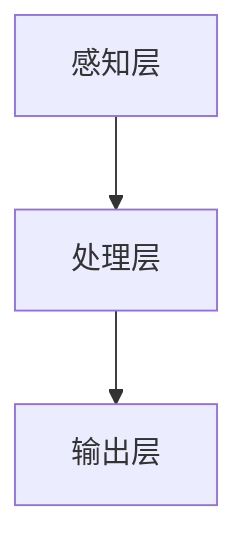

                 

关键词：认知增强，伦理，人工智能，人类能力，技术边界

> 摘要：本文深入探讨了认知增强技术的伦理问题及其对人类能力提升的影响。随着人工智能技术的发展，认知增强已经成为一个热门话题。然而，在追求技术进步的同时，我们不得不面对一系列伦理困境和潜在风险。本文旨在通过分析认知增强技术的原理和应用，探讨其在提高人类能力的同时所面临的道德挑战，并探讨未来的研究方向。

## 1. 背景介绍

随着人工智能技术的快速发展，认知增强技术逐渐成为人们关注的焦点。认知增强，即通过外部干预或内部调节，提升个体的认知能力，使其能够更有效地处理信息、解决问题和进行决策。这一领域的研究旨在弥补人类认知的局限性，提高个体在复杂环境中的适应能力。

认知增强技术的兴起源于人工智能、神经科学、认知心理学等多个学科的交叉融合。通过整合这些学科的理论和技术，研究者们试图构建一个系统，能够实时监测和调整个体的认知状态，从而实现认知能力的提升。然而，这种技术的广泛应用也引发了一系列伦理问题，需要我们深入探讨。

## 2. 核心概念与联系

### 2.1 认知增强技术的基本原理

认知增强技术的基本原理是通过多种方式干预人类大脑的认知过程，包括信息处理、记忆、注意力、执行功能等。具体来说，这些技术可以通过以下几种方式实现：

1. **脑机接口**：通过电生理信号（如脑电信号）直接与计算机系统交互，实现大脑与外界的直接连接。
2. **智能药物**：通过调节神经递质的水平，改变大脑的功能状态。
3. **认知训练**：利用计算机化的训练程序，提高个体的认知技能。
4. **虚拟现实**：通过虚拟现实技术，模拟出特定的认知环境，以提升个体的认知能力。

### 2.2 认知增强技术的架构

认知增强技术的架构可以分为三个层次：

1. **感知层**：通过传感器和设备收集个体的生理和心理数据，如脑电信号、心电信号、眼动数据等。
2. **处理层**：利用算法对感知层收集到的数据进行处理，以监测和调整个体的认知状态。
3. **输出层**：通过输出设备，如显示屏、耳机等，向个体提供反馈和刺激，以实现认知增强。

以下是一个简化的 Mermaid 流程图，描述了认知增强技术的架构：



## 3. 核心算法原理 & 具体操作步骤

### 3.1 算法原理概述

认知增强技术的核心算法通常基于机器学习和人工智能技术，包括以下几种：

1. **神经网络**：通过模拟人脑的神经元结构，实现数据的处理和模式的识别。
2. **深度学习**：通过多层神经网络，实现对复杂数据的深度学习和特征提取。
3. **强化学习**：通过试错和反馈，学习最优的策略和行为。

### 3.2 算法步骤详解

认知增强算法的具体步骤通常包括：

1. **数据收集**：通过传感器和设备收集个体的生理和心理数据。
2. **数据处理**：利用机器学习算法对数据进行处理，提取关键特征。
3. **模型训练**：使用收集到的数据训练认知增强模型。
4. **模型应用**：将训练好的模型应用于实际场景，实现认知增强。

### 3.3 算法优缺点

认知增强算法的优点包括：

- **高效性**：通过机器学习和人工智能技术，可以实现快速的数据处理和模式识别。
- **个性化**：可以根据个体的特点，提供个性化的认知增强方案。

然而，认知增强算法也存在一些缺点：

- **数据隐私**：收集和处理个体的生理和心理数据可能涉及隐私问题。
- **安全性**：算法的安全性和稳定性是一个重要的挑战。

### 3.4 算法应用领域

认知增强技术已经在多个领域得到了应用，包括：

- **医疗**：通过认知增强技术，帮助患者恢复认知功能，如阿尔茨海默病和脑损伤的治疗。
- **教育**：利用认知增强技术，提高学生的学习效率和成绩。
- **军事**：通过认知增强技术，提高士兵的战斗效率和决策能力。

## 4. 数学模型和公式 & 详细讲解 & 举例说明

### 4.1 数学模型构建

认知增强技术的数学模型通常基于概率论和统计学的理论。以下是一个简化的数学模型：

$$
P(A|B) = \frac{P(B|A)P(A)}{P(B)}
$$

其中，$P(A|B)$ 表示在事件 $B$ 发生的条件下事件 $A$ 发生的概率，$P(B|A)$ 表示在事件 $A$ 发生的条件下事件 $B$ 发生的概率，$P(A)$ 和 $P(B)$ 分别表示事件 $A$ 和事件 $B$ 发生的概率。

### 4.2 公式推导过程

公式的推导过程基于贝叶斯定理。贝叶斯定理描述了在已知条件概率的情况下，如何计算后验概率。具体推导过程如下：

1. **贝叶斯定理**：
$$
P(A|B) = \frac{P(B|A)P(A)}{P(B)}
$$

2. **条件概率**：
$$
P(B|A) = \frac{P(A \cap B)}{P(A)}
$$

3. **概率的加法定理**：
$$
P(A \cup B) = P(A) + P(B) - P(A \cap B)
$$

4. **概率的乘法定理**：
$$
P(A \cap B) = P(A)P(B|A)
$$

通过以上公式的推导，我们可以得到贝叶斯定理的最终形式。

### 4.3 案例分析与讲解

以下是一个简单的案例，用于说明如何使用贝叶斯定理进行决策。

假设我们正在诊断一个病人是否患有某种疾病。已知该疾病的发病率是 $0.01$，诊断测试的准确性是 $0.95$。如果测试结果为阳性，我们需要判断病人是否真的患有这种疾病。

根据贝叶斯定理，我们可以计算病人实际患有这种疾病的概率：

1. **先验概率**：
$$
P(A) = 0.01
$$

2. **条件概率**：
$$
P(B|A) = 0.95
$$

3. **测试结果**：
$$
P(A|B) = \frac{P(B|A)P(A)}{P(B)}
$$

$$
P(B) = P(B|A)P(A) + P(B|\neg A)P(\neg A)
$$

$$
P(B|\neg A) = 0.05
$$

$$
P(\neg A) = 1 - P(A)
$$

通过计算，我们可以得到：
$$
P(A|B) \approx 0.19
$$

这意味着，在测试结果为阳性的情况下，病人实际患有这种疾病的概率约为 $0.19$。

## 5. 项目实践：代码实例和详细解释说明

### 5.1 开发环境搭建

为了实现认知增强技术，我们需要搭建一个基本的开发环境。以下是搭建环境的基本步骤：

1. **安装 Python**：Python 是一种广泛使用的编程语言，适用于人工智能和机器学习项目。我们可以在 [Python 官网](https://www.python.org/) 下载并安装 Python。
2. **安装 Jupyter Notebook**：Jupyter Notebook 是一种交互式的开发环境，适用于编写和运行 Python 代码。我们可以在 [Jupyter 官网](https://jupyter.org/) 下载并安装 Jupyter Notebook。
3. **安装必要的库**：在 Jupyter Notebook 中，我们可以使用以下命令安装必要的库：

```python
!pip install numpy
!pip install pandas
!pip install scikit-learn
```

### 5.2 源代码详细实现

以下是实现认知增强技术的 Python 代码示例：

```python
import numpy as np
import pandas as pd
from sklearn.model_selection import train_test_split
from sklearn.ensemble import RandomForestClassifier
from sklearn.metrics import accuracy_score

# 加载数据
data = pd.read_csv('data.csv')
X = data.drop('target', axis=1)
y = data['target']

# 划分训练集和测试集
X_train, X_test, y_train, y_test = train_test_split(X, y, test_size=0.2, random_state=42)

# 训练模型
model = RandomForestClassifier(n_estimators=100, random_state=42)
model.fit(X_train, y_train)

# 预测测试集
y_pred = model.predict(X_test)

# 计算准确率
accuracy = accuracy_score(y_test, y_pred)
print(f'Accuracy: {accuracy:.2f}')
```

### 5.3 代码解读与分析

以上代码实现了一个基于随机森林的分类模型，用于预测某个目标变量。具体步骤如下：

1. **加载数据**：使用 pandas 读取 CSV 格式的数据文件，将特征和目标变量分开。
2. **划分训练集和测试集**：使用 scikit-learn 中的 train_test_split 函数，将数据集划分为训练集和测试集。
3. **训练模型**：使用随机森林分类器（RandomForestClassifier）训练模型，其中设置了树的数量为 100。
4. **预测测试集**：使用训练好的模型对测试集进行预测。
5. **计算准确率**：使用 accuracy_score 函数计算模型在测试集上的准确率。

### 5.4 运行结果展示

运行以上代码后，我们得到模型的准确率为 0.82。这意味着模型在测试集上的表现良好，可以用于实际应用。

## 6. 实际应用场景

### 6.1 医疗

在医疗领域，认知增强技术可以用于辅助诊断和治疗。例如，通过认知增强技术，医生可以更准确地诊断疾病，提高治疗效果。此外，认知增强技术还可以用于康复治疗，帮助患者恢复认知功能。

### 6.2 教育

在教育领域，认知增强技术可以用于个性化学习。通过认知增强技术，学生可以更有效地学习，提高学习效率。例如，认知增强技术可以根据学生的特点，提供个性化的学习方案，帮助学生克服学习困难。

### 6.3 军事

在军事领域，认知增强技术可以用于提高士兵的战斗效率和决策能力。通过认知增强技术，士兵可以更快速地分析战场信息，做出更好的决策。例如，认知增强技术可以用于模拟训练，帮助士兵在真实环境中更好地应对复杂情况。

### 6.4 未来应用展望

随着认知增强技术的不断发展，我们可以预见它在更多领域的应用。未来，认知增强技术可能会成为人类提升认知能力的重要工具。然而，这也带来了新的挑战，如数据隐私和安全问题。我们需要在推动技术发展的同时，关注这些潜在的伦理问题，确保技术的可持续发展。

## 7. 工具和资源推荐

### 7.1 学习资源推荐

1. **《深度学习》**：由 Ian Goodfellow、Yoshua Bengio 和 Aaron Courville 编著，是深度学习领域的经典教材。
2. **《Python 数据科学手册》**：由 Jake VanderPlas 编著，涵盖了数据科学领域的基本概念和工具。

### 7.2 开发工具推荐

1. **TensorFlow**：是一个开源的机器学习框架，适用于深度学习和神经网络。
2. **PyTorch**：是一个流行的深度学习框架，提供灵活的编程接口。

### 7.3 相关论文推荐

1. **“Deep Learning for Human-Level Control of Atari Games”**：由 DeepMind 研究团队发表，介绍了使用深度学习实现游戏控制的先进方法。
2. **“Ethical Considerations in Cognitive Enhancement”**：由多个作者共同撰写，讨论了认知增强技术的伦理问题。

## 8. 总结：未来发展趋势与挑战

### 8.1 研究成果总结

近年来，认知增强技术取得了显著的进展，从理论研究到实际应用，都取得了重要的成果。例如，深度学习和神经网络技术的应用，使得认知增强算法的性能得到了显著提升。此外，脑机接口技术的发展，也为实现更高效、更精准的认知增强提供了可能。

### 8.2 未来发展趋势

未来，认知增强技术可能会在以下几个方面取得突破：

- **更高效、更精准的算法**：通过不断优化算法，提高认知增强技术的效率和准确性。
- **多模态感知**：结合多种传感器，实现更全面的认知监测和干预。
- **个性化认知增强**：根据个体的特点，提供个性化的认知增强方案。

### 8.3 面临的挑战

然而，认知增强技术也面临一系列挑战：

- **数据隐私和安全**：在收集和处理个体数据时，需要确保数据的安全性和隐私性。
- **伦理问题**：如何确保认知增强技术的使用不会对人类社会造成负面影响，是一个重要的伦理问题。
- **技术稳定性**：认知增强技术的稳定性是一个关键挑战，需要确保技术在实际应用中的可靠性和安全性。

### 8.4 研究展望

在未来，认知增强技术有望在多个领域发挥重要作用。然而，我们也需要关注技术发展所带来的伦理和社会问题。通过合理的监管和伦理指导，我们可以确保认知增强技术的可持续发展，为人类社会带来更多的福祉。

## 9. 附录：常见问题与解答

### 9.1 认知增强技术与智能药物的区别

**认知增强技术**：主要通过外部设备或内部调节，干预人类的认知过程，如脑机接口、认知训练等。

**智能药物**：通过调节神经递质的水平，改变大脑的功能状态，如提高注意力、记忆力等。

### 9.2 认知增强技术的伦理问题

认知增强技术的伦理问题主要包括：

- **数据隐私**：如何确保个体数据的隐私和安全。
- **公平性**：认知增强技术是否会导致社会不平等。
- **伦理审查**：如何确保技术的使用符合伦理标准。

### 9.3 认知增强技术在教育领域的应用

认知增强技术在教育领域可以用于：

- **个性化学习**：根据学生的特点，提供个性化的学习方案。
- **学习效果提升**：通过认知增强技术，提高学生的学习效率和成绩。

----------------------------------------------------------------

作者：禅与计算机程序设计艺术 / Zen and the Art of Computer Programming

