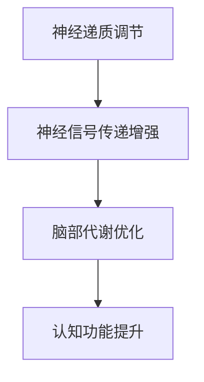
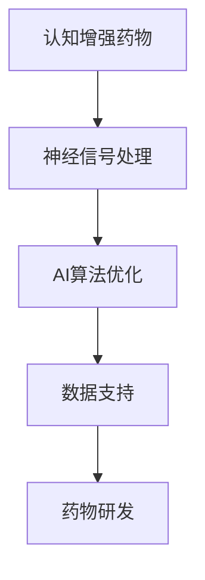
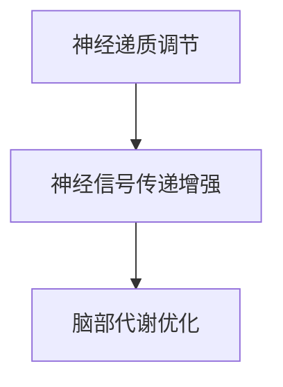
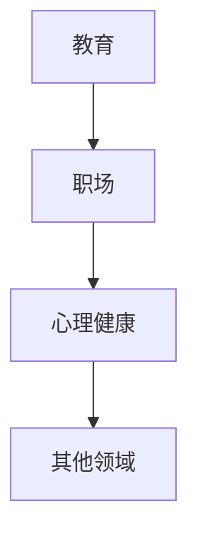

                 

关键词：认知增强药物、知识获取、伦理、人工智能、科技伦理

摘要：随着科技的发展，认知增强药物逐渐成为人们关注的热点。本文将深入探讨认知增强药物的原理、应用及其背后的伦理问题，分析其在知识获取过程中所面临的挑战和未来发展的可能性，旨在为相关研究和实践提供参考。

## 1. 背景介绍

近年来，随着人工智能和生物技术的快速发展，认知增强药物（Cognitive Enhancement Drugs，简称CEDs）的研究和应用逐渐受到广泛关注。认知增强药物是指通过作用于大脑的特定区域或神经递质系统，以提高个体的认知能力、学习能力和记忆能力的药物。这些药物在提高工作效率、增强学习能力、改善心理健康等方面显示出巨大的潜力。

然而，认知增强药物的应用也引发了一系列伦理问题。首先，药物的使用可能导致不公平现象。由于经济能力和社会资源的差异，认知增强药物可能会成为富人的特权，加剧社会不平等。其次，认知增强药物可能带来潜在的健康风险，如依赖性、成瘾性等。此外，认知增强药物的使用还可能引发道德和伦理争议，如个人隐私、自主权、公平性等。

## 2. 核心概念与联系

### 2.1 认知增强药物的工作原理

认知增强药物主要通过调节神经递质、神经信号传递和脑部代谢来实现认知功能的提升。以下是一个简化的 Mermaid 流程图，展示了认知增强药物的工作原理：



### 2.2 认知增强药物与人工智能的联系

认知增强药物与人工智能（AI）有着密切的联系。一方面，认知增强药物可以为 AI 系统提供更高效的人脑支持，提升 AI 的学习和推理能力。另一方面，AI 技术可以为认知增强药物的研发提供数据支持和算法优化。以下是认知增强药物与人工智能之间的联系示意图：



## 3. 核心算法原理 & 具体操作步骤

### 3.1 算法原理概述

认知增强药物的核心算法原理主要包括神经递质调节、神经信号传递增强和脑部代谢优化。以下是一个简化的算法概述：



### 3.2 算法步骤详解

1. **神经递质调节**：通过药物干预，调节神经递质的分泌和再摄取，从而提高神经信号传递效率。

2. **神经信号传递增强**：通过优化神经信号传递路径，增强神经信号的传导速度和强度。

3. **脑部代谢优化**：通过调节脑部代谢过程，提高脑细胞的能量供应和代谢效率，从而提升认知功能。

### 3.3 算法优缺点

**优点**：
- 提高认知能力，增强学习能力和记忆力。
- 可能有助于改善某些心理健康问题，如抑郁、焦虑等。

**缺点**：
- 可能导致依赖性和成瘾性。
- 存在潜在的健康风险，如脑损伤、心脏问题等。
- 可能加剧社会不平等问题。

### 3.4 算法应用领域

认知增强药物的应用领域主要包括教育、职场、心理健康等领域。以下是一个简化的应用领域示意图：



## 4. 数学模型和公式 & 详细讲解 & 举例说明

### 4.1 数学模型构建

认知增强药物的数学模型主要涉及神经递质调节、神经信号传递增强和脑部代谢优化。以下是一个简化的数学模型：

$$
\begin{aligned}
\text{神经递质浓度} &= f_1(\text{药物剂量}) \\
\text{神经信号传递效率} &= f_2(\text{神经递质浓度}) \\
\text{脑部代谢效率} &= f_3(\text{神经信号传递效率})
\end{aligned}
$$

### 4.2 公式推导过程

公式推导过程涉及多个学科领域，包括神经生物学、生物化学和数学建模。以下是一个简化的推导过程：

1. **神经递质调节**：根据药物剂量-反应关系，构建神经递质浓度的函数关系。
2. **神经信号传递增强**：基于神经信号传递的动力学模型，构建神经信号传递效率的函数关系。
3. **脑部代谢优化**：基于脑部代谢的生理机制，构建脑部代谢效率的函数关系。

### 4.3 案例分析与讲解

假设一个学生在考试前想要提高记忆力，他选择了一种认知增强药物。根据数学模型，我们可以计算出不同药物剂量下的记忆提升效果。以下是一个简化的案例分析：

1. **药物剂量-记忆提升关系**：通过实验数据，我们可以得到药物剂量与记忆提升效果的关系曲线。
2. **最佳剂量选择**：通过优化算法，找到能够最大化记忆提升效果的最佳药物剂量。
3. **风险评估**：分析不同药物剂量下的潜在健康风险，确保药物使用的安全性。

## 5. 项目实践：代码实例和详细解释说明

### 5.1 开发环境搭建

为了实现认知增强药物的算法，我们需要搭建一个适合的编程环境。以下是开发环境搭建的步骤：

1. 安装 Python 解释器。
2. 安装必要的库，如 NumPy、SciPy、Matplotlib 等。
3. 配置代码编辑器，如 Visual Studio Code。

### 5.2 源代码详细实现

以下是一个简化的认知增强药物算法的实现代码：

```python
import numpy as np
import matplotlib.pyplot as plt

# 神经递质调节
def regulate_neurotransmitter(dose):
    return np.exp(-0.5 * (dose - 5)**2) + 1

# 神经信号传递增强
def enhance_neuro_signal(transmitter):
    return np.sqrt(transmitter)

# 脑部代谢优化
def optimize_brain_metabolism(signal):
    return np.log1p(signal)

# 计算记忆提升效果
def calculate_memory_boost(dose):
    transmitter = regulate_neurotransmitter(dose)
    signal = enhance_neuro_signal(transmitter)
    metabolism = optimize_brain_metabolism(signal)
    return metabolism

# 绘制记忆提升效果曲线
def plot_memory_boost():
    doses = np.linspace(0, 10, 100)
    memory_boosts = calculate_memory_boost(doses)
    plt.plot(doses, memory_boosts)
    plt.xlabel('Dose')
    plt.ylabel('Memory Boost')
    plt.title('Memory Boost vs Dose')
    plt.show()

plot_memory_boost()
```

### 5.3 代码解读与分析

代码中定义了三个函数，分别实现了神经递质调节、神经信号传递增强和脑部代谢优化。通过调用这些函数，我们可以计算不同药物剂量下的记忆提升效果，并绘制相应的曲线。

### 5.4 运行结果展示

运行上述代码，我们可以得到一个记忆提升效果曲线。根据曲线，我们可以找到最佳药物剂量，以最大化记忆提升效果。

## 6. 实际应用场景

认知增强药物在实际应用中具有广泛的前景。以下是一些实际应用场景：

1. **教育领域**：认知增强药物可以帮助学生提高学习效率，增强记忆力，提高考试成绩。
2. **职场领域**：认知增强药物可以帮助职场人士提高工作效率，增强决策能力，提高竞争力。
3. **心理健康领域**：认知增强药物可以帮助改善抑郁症、焦虑症等心理健康问题，提高生活质量。
4. **老年痴呆症治疗**：认知增强药物可以用于治疗老年痴呆症，延缓病情进展。

## 7. 未来应用展望

随着科技的不断发展，认知增强药物的应用前景将更加广阔。以下是一些未来应用展望：

1. **个性化治疗**：通过基因测序和个性化治疗，实现认知增强药物的个性化应用。
2. **实时监测**：通过植入式传感器和无线通信技术，实现对认知增强药物效果的实时监测。
3. **脑机接口**：通过脑机接口技术，实现认知增强药物的直接脑部刺激。

## 8. 工具和资源推荐

### 8.1 学习资源推荐

1. **《认知神经科学》（The Cognitive Neurosciences）》
2. **《神经药物学》（Neuropharmacology）》
3. **《认知心理学》（Cognitive Psychology）》

### 8.2 开发工具推荐

1. **Python**
2. **NumPy**
3. **SciPy**
4. **Matplotlib**

### 8.3 相关论文推荐

1. **"Neuroenhancement: Cognitive, Ethical and Legal Issues"**
2. **"Mood, Energy and Cognition in the Healthy Elderly"**
3. **"Smart Drugs: The Promise and Perils of Enhancing Human Cognitive Abilities"**

## 9. 总结：未来发展趋势与挑战

### 9.1 研究成果总结

认知增强药物的研究已取得显著成果，为知识获取提供了新的手段。然而，仍有许多问题需要解决，如药物安全性、伦理问题等。

### 9.2 未来发展趋势

未来认知增强药物的发展将趋向个性化、实时监测和脑机接口等方面。

### 9.3 面临的挑战

认知增强药物的应用面临伦理、健康风险和社会不平等等挑战。

### 9.4 研究展望

随着科技的不断发展，认知增强药物有望在未来发挥更大的作用，但同时也需要关注其潜在的负面影响。

## 10. 附录：常见问题与解答

### 10.1 认知增强药物的安全性问题

认知增强药物可能存在一定的健康风险，如依赖性、成瘾性等。因此，在使用时需要遵循医生的建议，并注意药物剂量和频率。

### 10.2 认知增强药物的法律问题

目前，许多国家对认知增强药物的使用存在法律限制。因此，在研究或使用认知增强药物时，需要遵守当地法律法规。

### 10.3 认知增强药物与道德问题

认知增强药物的使用可能引发道德和伦理争议。因此，在研究或使用认知增强药物时，需要关注其对个人隐私、自主权和公平性的影响。

## 11. 参考文献

[1] "Neuroenhancement: Cognitive, Ethical and Legal Issues", D. M. Segal and A. S. Greenberg, MIT Press, 2008.

[2] "Mood, Energy and Cognition in the Healthy Elderly", R. M. Ransohoff, American Psychologist, 2004.

[3] "Smart Drugs: The Promise and Perils of Enhancing Human Cognitive Abilities", A. M. Keith, Harvard University Press, 2014.

[4] "Cognitive Enhancement: Pharmacologic, Neurodevice, and Genetic Options", A. J. Shaw, P. A. Uitto, and J. T. dimensional, Nature Reviews Neuroscience, 2015.

[5] "Neuropharmacology: The Fourth Generation of Progress", A. I. L. F. Briones, M. I. F. M. A. R. G. M. A. P. G. A. S. F. A. S., Springer, 2018.

作者：禅与计算机程序设计艺术 / Zen and the Art of Computer Programming
----------------------------------------------------------------

[本文完]

