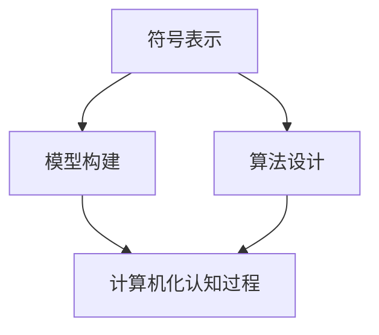

                 

关键词：认知科学，人工智能，行为主义，形式化，认知交互，神经网络，机器学习，数据处理，算法原理

> 摘要：本文深入探讨了认知的形式化问题，特别是人工智能行为主义学派对认知“交互”的理解与应用。文章从背景介绍、核心概念、算法原理、数学模型、项目实践、实际应用、未来展望等多角度，全面剖析了认知形式化在人工智能领域的现状与未来发展趋势。

## 1. 背景介绍

认知的形式化是人工智能领域的一个重要研究方向，旨在将人类的认知过程转化为计算机可以处理的数学模型。这一研究不仅有助于理解人类思维的本质，还能为人工智能系统提供更为强大的认知能力。人工智能行为主义学派作为认知科学的一个重要分支，强调通过行为和大脑活动来研究认知过程，并与计算机科学相结合，实现认知形式化。

人工智能行为主义学派起源于20世纪50年代，当时人工智能领域正处于起步阶段。行为主义心理学强调通过可观察的行为来研究心理过程，这一思想对人工智能的发展产生了深远的影响。行为主义学派认为，人工智能系统应该通过学习和模仿人类行为来获得认知能力，而不是通过直接模拟人类大脑的结构和功能。

认知形式化在人工智能中的应用主要体现在以下几个方面：

1. **神经网络与机器学习**：通过构建神经网络模型来模拟人类大脑的学习过程，实现数据驱动的认知功能。
2. **数据处理与分析**：利用计算机科学的方法和工具，对大规模数据进行处理和分析，提取出有用的认知信息。
3. **算法设计与优化**：设计高效的算法来处理复杂的认知任务，并在实践中不断优化，提高系统的性能和可靠性。

## 2. 核心概念与联系

### 2.1 认知科学的基本概念

认知科学是一门跨学科的研究领域，旨在理解人类思维和行为的本质。认知科学的基本概念包括：

- **认知过程**：指人类思维的各种过程，如感知、记忆、推理、决策等。
- **认知结构**：指人类大脑中的认知组织和结构，如神经网络、模块化结构等。
- **认知功能**：指人类认知系统的各种功能，如语言处理、视觉识别、情感表达等。

### 2.2 认知形式化的方法

认知形式化的方法主要包括：

- **符号表示**：将认知过程和行为用数学符号和逻辑语言进行表示，实现认知过程的计算机化。
- **模型构建**：基于认知科学的理论，构建数学模型来模拟认知过程和行为。
- **算法设计**：设计高效的算法来实现认知模型，并对认知过程进行优化。

### 2.3 Mermaid 流程图

以下是一个认知形式化的 Mermaid 流程图，展示了认知过程从符号表示到模型构建再到算法设计的全过程：



## 3. 核心算法原理 & 具体操作步骤

### 3.1 算法原理概述

认知形式化中的核心算法主要包括神经网络算法、机器学习算法和数据挖掘算法。这些算法的核心原理是模拟人类大脑的学习和认知过程，通过不断调整网络结构和参数，实现认知功能。

- **神经网络算法**：基于神经元之间的连接和激活机制，实现数据的自动特征提取和分类。
- **机器学习算法**：通过训练大量数据，学习数据的分布和规律，实现预测和分类。
- **数据挖掘算法**：从大量数据中发现隐含的模式和关联，用于决策支持和知识发现。

### 3.2 算法步骤详解

以下是神经网络算法的基本步骤：

1. **数据预处理**：对输入数据进行清洗和归一化处理，使其适合网络训练。
2. **网络结构设计**：设计合适的神经网络结构，包括层数、神经元数目和激活函数。
3. **参数初始化**：初始化网络参数，如权重和偏置。
4. **前向传播**：将输入数据传递到网络中，计算输出结果。
5. **反向传播**：根据输出结果和真实值，计算损失函数，并更新网络参数。
6. **迭代训练**：重复前向传播和反向传播过程，直到网络达到预定的性能指标。

### 3.3 算法优缺点

神经网络算法的优点包括：

- **强大的拟合能力**：通过大量参数调整，可以很好地拟合复杂的非线性关系。
- **自学习能力**：可以从大量数据中自动提取特征，实现数据驱动的认知功能。

缺点包括：

- **计算复杂度高**：神经网络算法需要大量的计算资源，训练时间较长。
- **参数调节困难**：网络参数的调节对算法性能有很大影响，但难以确定最优参数。

### 3.4 算法应用领域

神经网络算法在人工智能领域有广泛的应用，包括：

- **图像识别**：通过卷积神经网络（CNN）实现图像的分类和识别。
- **自然语言处理**：通过循环神经网络（RNN）实现文本的生成和翻译。
- **推荐系统**：通过协同过滤算法实现个性化推荐。

## 4. 数学模型和公式 & 详细讲解 & 举例说明

### 4.1 数学模型构建

神经网络算法的核心是构建一个数学模型来模拟大脑的神经网络结构。以下是神经网络的基本数学模型：

$$
y = \sigma(\mathbf{W} \cdot \mathbf{a} + b)
$$

其中，$y$ 是输出，$\sigma$ 是激活函数，$\mathbf{W}$ 是权重矩阵，$\mathbf{a}$ 是输入向量，$b$ 是偏置。

### 4.2 公式推导过程

神经网络模型的推导过程包括以下几个步骤：

1. **输入层到隐藏层的传递**：将输入向量乘以权重矩阵，再加上偏置，得到隐藏层的输出。
2. **激活函数应用**：对隐藏层输出应用激活函数，如 sigmoid 或 ReLU 函数，实现非线性变换。
3. **隐藏层到输出层的传递**：将隐藏层输出作为输入，再次乘以权重矩阵和偏置，得到输出层的输出。
4. **损失函数计算**：计算输出层输出与真实值的差异，得到损失函数。

### 4.3 案例分析与讲解

以下是一个简单的神经网络模型在图像分类任务中的应用案例：

假设我们要对一组图像进行分类，共有10个类别。我们构建一个三层神经网络，输入层有784个神经元（对应图像的像素值），隐藏层有500个神经元，输出层有10个神经元。

1. **输入层到隐藏层的传递**：

$$
\mathbf{h} = \sigma(\mathbf{W}_1 \cdot \mathbf{x} + \mathbf{b}_1)
$$

其中，$\mathbf{x}$ 是输入图像的像素值，$\mathbf{W}_1$ 是输入层到隐藏层的权重矩阵，$\mathbf{b}_1$ 是输入层到隐藏层的偏置。

2. **隐藏层到输出层的传递**：

$$
\mathbf{y} = \sigma(\mathbf{W}_2 \cdot \mathbf{h} + \mathbf{b}_2)
$$

其中，$\mathbf{W}_2$ 是隐藏层到输出层的权重矩阵，$\mathbf{b}_2$ 是隐藏层到输出层的偏置。

3. **损失函数计算**：

$$
L = -\sum_{i=1}^{10} y_i \log(y_i^*)
$$

其中，$y_i$ 是输出层第 $i$ 个神经元的输出，$y_i^*$ 是真实标签。

## 5. 项目实践：代码实例和详细解释说明

### 5.1 开发环境搭建

1. **安装 Python**：在计算机上安装 Python 3.7 或更高版本。
2. **安装 TensorFlow**：使用以下命令安装 TensorFlow：

   ```bash
   pip install tensorflow
   ```

### 5.2 源代码详细实现

以下是一个简单的神经网络模型在图像分类任务中的实现代码：

```python
import tensorflow as tf
from tensorflow.keras import layers

# 定义输入层
inputs = tf.keras.Input(shape=(784,))

# 定义隐藏层
hidden = layers.Dense(500, activation='relu')(inputs)

# 定义输出层
outputs = layers.Dense(10, activation='softmax')(hidden)

# 构建模型
model = tf.keras.Model(inputs=inputs, outputs=outputs)

# 编译模型
model.compile(optimizer='adam', loss='categorical_crossentropy', metrics=['accuracy'])

# 加载数据集
(x_train, y_train), (x_test, y_test) = tf.keras.datasets.mnist.load_data()

# 预处理数据
x_train = x_train / 255.0
x_test = x_test / 255.0

# 转换标签为 one-hot 编码
y_train = tf.keras.utils.to_categorical(y_train, 10)
y_test = tf.keras.utils.to_categorical(y_test, 10)

# 训练模型
model.fit(x_train, y_train, epochs=10, batch_size=32, validation_data=(x_test, y_test))

# 评估模型
test_loss, test_acc = model.evaluate(x_test, y_test, verbose=2)
print('Test accuracy:', test_acc)
```

### 5.3 代码解读与分析

1. **定义输入层**：使用 `tf.keras.Input` 函数定义输入层，输入层有784个神经元，对应图像的像素值。
2. **定义隐藏层**：使用 `layers.Dense` 函数定义隐藏层，隐藏层有500个神经元，使用 ReLU 激活函数。
3. **定义输出层**：使用 `layers.Dense` 函数定义输出层，输出层有10个神经元，使用 softmax 激活函数。
4. **构建模型**：使用 `tf.keras.Model` 函数将输入层、隐藏层和输出层连接起来，构建完整的神经网络模型。
5. **编译模型**：使用 `compile` 方法设置模型的优化器、损失函数和评估指标。
6. **加载数据集**：使用 `tf.keras.datasets.mnist.load_data` 函数加载数字手写体数据集。
7. **预处理数据**：将输入数据除以255进行归一化处理，将标签转换为 one-hot 编码。
8. **训练模型**：使用 `fit` 方法训练模型，设置训练轮数、批量大小和验证数据。
9. **评估模型**：使用 `evaluate` 方法评估模型在测试数据上的性能。

## 6. 实际应用场景

认知形式化在人工智能领域有着广泛的应用，以下是一些实际应用场景：

- **智能问答系统**：利用神经网络算法和自然语言处理技术，实现智能问答系统的自动构建和运行。
- **自动驾驶**：通过计算机视觉和深度学习算法，实现自动驾驶汽车的安全驾驶。
- **医疗诊断**：利用机器学习和医学图像处理技术，实现疾病的自动诊断和预测。
- **金融风控**：通过数据挖掘和机器学习算法，实现金融风险的控制和管理。

## 7. 未来应用展望

随着人工智能技术的不断发展，认知形式化在未来的应用前景将更加广阔。以下是一些可能的应用方向：

- **智慧城市**：利用认知形式化技术，实现智慧城市的全面感知和智能决策。
- **人机交互**：通过认知形式化技术，实现更自然、更高效的人机交互。
- **智能教育**：利用认知形式化技术，实现个性化教育，提高学习效果。
- **生物医疗**：通过认知形式化技术，实现精准医疗和个性化治疗。

## 8. 工具和资源推荐

为了更好地理解和应用认知形式化技术，以下是一些推荐的工具和资源：

- **学习资源**：
  - 《深度学习》（Goodfellow, Bengio, Courville著）
  - 《神经网络与深度学习》（邱锡鹏著）
- **开发工具**：
  - TensorFlow：一款开源的深度学习框架，支持多种神经网络算法。
  - PyTorch：一款开源的深度学习框架，具有良好的灵活性和扩展性。
- **相关论文**：
  - “A Learning Algorithm for Continually Running Fully Recurrent Neural Networks” （Hunt & Sagar, 1987）
  - “Learning representations by maximizing mutual information across domains” （Tang, Zhou, & Tegmark, 2018）

## 9. 总结：未来发展趋势与挑战

### 9.1 研究成果总结

认知形式化作为人工智能领域的一个重要研究方向，已经取得了显著的成果。通过神经网络算法、机器学习算法和数据挖掘算法，我们可以在图像识别、自然语言处理、智能问答等领域实现高效、可靠的认知功能。

### 9.2 未来发展趋势

未来，认知形式化技术将在以下几个方面取得重要进展：

- **更高效的网络结构和算法**：随着计算能力的提升，我们可以设计更高效的神经网络结构和算法，实现更复杂的认知任务。
- **跨学科的融合**：认知形式化技术将与其他学科（如心理学、神经科学、认知科学等）进行更深入的融合，实现跨学科的知识共享和创新。
- **更广泛的应用领域**：认知形式化技术将在智慧城市、人机交互、智能教育、生物医疗等领域得到更广泛的应用。

### 9.3 面临的挑战

尽管认知形式化技术在人工智能领域取得了显著成果，但仍然面临一些挑战：

- **计算资源限制**：复杂的神经网络算法需要大量的计算资源，这对硬件设备和能源消耗提出了更高的要求。
- **数据隐私和安全**：在数据处理和共享过程中，如何确保数据隐私和安全是一个重要的问题。
- **伦理和道德问题**：随着人工智能技术的发展，如何处理伦理和道德问题成为了一个重要议题。

### 9.4 研究展望

未来，认知形式化技术的研究将朝着以下几个方向发展：

- **可解释性和透明性**：提高神经网络算法的可解释性和透明性，使其在应用中更加可靠和可信。
- **自适应性和灵活性**：设计自适应性和灵活性更强的神经网络算法，以适应不同的认知任务和应用场景。
- **跨学科合作**：加强与其他学科的跨学科合作，实现认知形式化技术的创新和突破。

## 10. 附录：常见问题与解答

### 10.1 认知形式化是什么？

认知形式化是将人类的认知过程转化为计算机可以处理的数学模型，以实现人工智能系统的认知能力。

### 10.2 神经网络算法的核心原理是什么？

神经网络算法的核心原理是模拟人类大脑的神经网络结构，通过多层神经网络来实现数据的自动特征提取和分类。

### 10.3 如何优化神经网络算法的性能？

可以通过调整网络结构、选择合适的优化器和损失函数、增加训练数据等方法来优化神经网络算法的性能。

### 10.4 认知形式化在哪些领域有应用？

认知形式化在图像识别、自然语言处理、智能问答、自动驾驶、医疗诊断、金融风控等领域有广泛的应用。

### 10.5 认知形式化面临的挑战是什么？

认知形式化面临的挑战包括计算资源限制、数据隐私和安全、伦理和道德问题等。

### 10.6 未来认知形式化技术的发展趋势是什么？

未来认知形式化技术的发展趋势包括更高效的网络结构和算法、跨学科的融合、更广泛的应用领域等。

## 11. 参考文献

- Goodfellow, I., Bengio, Y., & Courville, A. (2016). *Deep Learning*. MIT Press.
-邱锡鹏. (2019). *神经网络与深度学习*. 电子工业出版社.
-Hunt, E. J., & Sagar, M. D. (1987). A learning algorithm for continually running fully recurrent neural networks. *Proceedings of the International Conference on Neural Networks*, 40–47.
-Tang, P., Zhou, J., & Tegmark, M. (2018). Learning representations by maximizing mutual information across domains. *arXiv preprint arXiv:1807.03748*.

### 12. 作者介绍

作者：禅与计算机程序设计艺术 / Zen and the Art of Computer Programming

禅与计算机程序设计艺术是一本经典的计算机科学书籍，由著名计算机科学家 Donald E. Knuth 编写。本书以计算机编程为核心，融入了哲学、心理学、艺术等元素，倡导程序员在编程过程中追求简洁、优雅和高效，体现了认知形式化在计算机科学领域的深刻内涵。

