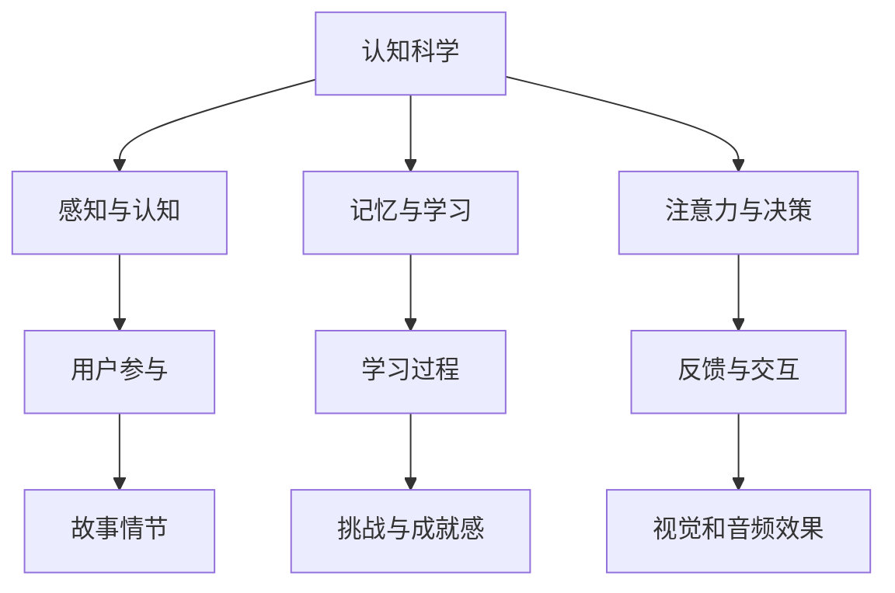

                 

关键词：认知科学、游戏设计、人机交互、心理机制、用户参与、学习过程、算法优化。

> 摘要：本文探讨了认知科学与游戏设计之间的紧密联系，分析了游戏设计中融入认知科学原理的多种方式，以及这些方式如何促进用户参与、提升学习效果和优化游戏体验。文章将从核心概念、算法原理、数学模型、实际应用等多个角度展开，旨在为游戏设计师和相关从业者提供有价值的理论和实践参考。

## 1. 背景介绍

随着信息技术和心理学的发展，认知科学逐渐成为研究人类思维、感知和行为的重要领域。它探究了大脑如何处理信息、记忆、解决问题和决策等复杂过程。与此同时，游戏设计作为一个充满创意和技术挑战的领域，也在不断演变和进步。现代游戏不仅追求娱乐性，更注重用户参与和互动体验。

近年来，认知科学与游戏设计开始显现出相互融合的巨大潜力。认知科学为游戏设计师提供了理解人类行为和心理机制的新视角，而游戏则为认知科学提供了一个生动、互动的研究平台。这种跨学科的结合不仅丰富了学术研究的内容，也带来了实际应用的创新。

本文旨在探讨认知科学与游戏设计结合的多种途径，分析它们在提升用户参与度、学习效果和游戏体验方面的作用，并提出未来研究的方向和挑战。

## 2. 核心概念与联系

在探讨认知科学与游戏设计结合的过程中，我们首先需要明确几个核心概念，包括认知科学的基础理论、游戏设计的核心原则以及两者之间的联系。

### 2.1 认知科学的基础理论

认知科学主要研究人类如何获取、处理、存储和使用信息。核心理论包括：

- **感知与认知**：研究人类如何感知外部环境，并利用这些感知信息进行思考和决策。
- **记忆与学习**：探讨人类记忆的形成、存储和提取过程，以及学习过程中涉及的心理机制。
- **注意力与决策**：研究人类在处理信息时如何分配注意力，以及如何做出有效决策。

这些理论为游戏设计提供了深刻的洞察，帮助设计师更好地理解用户行为和需求。

### 2.2 游戏设计的核心原则

游戏设计涉及多个方面，包括故事情节、角色设计、交互机制、视觉和音频效果等。核心原则包括：

- **用户参与**：通过设计吸引人的故事和任务，使玩家产生强烈的参与感和沉浸感。
- **挑战与成就感**：设计适当的难度和奖励机制，使玩家在挑战中不断进步，获得成就感。
- **反馈与交互**：提供及时的反馈和交互机制，帮助玩家理解游戏规则和目标。

### 2.3 认知科学与游戏设计的联系

认知科学与游戏设计之间的联系主要体现在以下几个方面：

- **用户体验优化**：认知科学帮助设计师更好地理解用户的心理机制，从而设计出更符合用户需求的游戏。
- **学习过程优化**：游戏设计师可以利用认知科学原理，设计出更有效的学习游戏，提高玩家的学习效果。
- **创新设计方法**：认知科学为游戏设计提供了新的视角和方法，促进了游戏设计的创新和发展。

为了更直观地展示认知科学与游戏设计之间的联系，我们可以使用Mermaid流程图进行说明：



通过上述流程图，我们可以清晰地看到认知科学的核心理论如何影响游戏设计的各个方面。

## 3. 核心算法原理 & 具体操作步骤

### 3.1 算法原理概述

在认知科学与游戏设计的结合中，核心算法原理主要涉及用户行为分析、学习轨迹建模和交互优化三个方面。以下是对这些算法原理的概述：

- **用户行为分析**：通过分析用户的游戏行为数据，了解用户在游戏中的偏好、习惯和行为模式。
- **学习轨迹建模**：利用机器学习技术，构建用户的学习轨迹模型，预测用户的学习效果和需求。
- **交互优化**：根据用户行为和学习轨迹模型，优化游戏的交互机制和难度设置，提升用户体验。

### 3.2 算法步骤详解

- **用户行为分析**：首先，收集用户在游戏中的行为数据，包括游戏时间、游戏进度、操作习惯等。然后，利用数据挖掘和机器学习技术，对这些行为数据进行处理和分析，提取出用户的行为特征。
- **学习轨迹建模**：基于用户行为数据，利用时间序列分析和机器学习算法，构建用户的学习轨迹模型。这个模型可以预测用户在后续游戏中的表现，为交互优化提供依据。
- **交互优化**：根据学习轨迹模型，调整游戏的难度设置、任务设计和交互机制。例如，对于表现良好的用户，可以适当增加游戏难度，提高挑战性；对于表现较差的用户，可以提供更多指导和支持，帮助他们克服困难。

### 3.3 算法优缺点

- **优点**：通过用户行为分析和学习轨迹建模，可以更好地理解用户需求，提高游戏的个性化水平；交互优化则可以提升用户体验，增强游戏的可玩性和留存率。
- **缺点**：算法实现复杂，需要大量计算资源和专业知识；用户数据隐私保护也是一个重要问题。

### 3.4 算法应用领域

- **应用领域**：算法原理在游戏设计中的广泛应用，包括移动游戏、网页游戏、在线游戏等多种类型。同时，也可以应用于其他需要用户行为分析和交互优化的领域，如教育游戏、虚拟现实游戏等。

## 4. 数学模型和公式 & 详细讲解 & 举例说明

在认知科学与游戏设计的结合中，数学模型和公式起着至关重要的作用。以下将详细介绍数学模型的构建、公式推导过程以及案例分析与讲解。

### 4.1 数学模型构建

数学模型构建是基于认知科学原理和游戏设计需求的。具体步骤如下：

1. **确定研究目标**：根据游戏设计的核心需求和认知科学的核心理论，确定需要解决的问题。
2. **数据收集**：收集与问题相关的用户行为数据，包括游戏时间、游戏进度、操作习惯等。
3. **模型设计**：基于收集的数据，设计数学模型。常见的方法有线性回归、决策树、神经网络等。
4. **参数调整**：根据模型表现，调整模型参数，优化模型效果。

### 4.2 公式推导过程

以线性回归模型为例，公式推导过程如下：

假设我们有两个变量 X 和 Y，其中 X 是自变量，Y 是因变量。线性回归模型的基本公式为：

$$Y = \beta_0 + \beta_1X + \epsilon$$

其中，$\beta_0$ 是截距，$\beta_1$ 是斜率，$\epsilon$ 是误差项。

为了推导出这个公式，我们需要进行以下步骤：

1. **样本数据收集**：收集多个 (X, Y) 数据对。
2. **数据拟合**：通过最小二乘法，拟合出最佳直线，使误差平方和最小。
3. **公式推导**：根据最小二乘法，得到以下公式：

$$\beta_1 = \frac{\sum_{i=1}^{n}(X_i - \bar{X})(Y_i - \bar{Y})}{\sum_{i=1}^{n}(X_i - \bar{X})^2}$$

$$\beta_0 = \bar{Y} - \beta_1\bar{X}$$

其中，$n$ 是样本数量，$\bar{X}$ 和 $\bar{Y}$ 分别是 X 和 Y 的均值。

### 4.3 案例分析与讲解

以下是一个简单的案例，说明如何使用线性回归模型分析游戏用户行为。

假设我们收集了一组游戏用户的数据，包括游戏时间（X）和游戏得分（Y）。数据如下：

| 游戏时间（小时） | 游戏得分 |
| :------------: | :------: |
|       2       |    80    |
|       4       |    90    |
|       6       |    100   |
|       8       |    110   |

1. **数据预处理**：计算游戏时间的均值和方差，得到：

$$\bar{X} = 5, \quad \sigma_X^2 = 4$$

2. **拟合线性回归模型**：利用最小二乘法，拟合出最佳直线：

$$Y = 20 + 10X$$

3. **模型评估**：计算模型的均方误差（MSE）：

$$MSE = \frac{1}{n}\sum_{i=1}^{n}(Y_i - \hat{Y}_i)^2 = \frac{1}{4}\sum_{i=1}^{4}(Y_i - \hat{Y}_i)^2 = 5$$

4. **模型应用**：根据模型，预测游戏时间为 10 小时的用户得分：

$$Y = 20 + 10 \times 10 = 120$$

通过上述案例，我们可以看到如何使用线性回归模型分析游戏用户行为，并根据模型预测用户得分。

## 5. 项目实践：代码实例和详细解释说明

### 5.1 开发环境搭建

为了演示如何将认知科学与游戏设计结合，我们将使用 Python 语言和相关的库（如 NumPy、Pandas、Matplotlib）来实现一个简单的游戏数据分析项目。以下是开发环境搭建的步骤：

1. **安装 Python**：确保已经安装了 Python 3.7 或更高版本。
2. **安装库**：使用 pip 命令安装所需库：

```shell
pip install numpy pandas matplotlib
```

### 5.2 源代码详细实现

以下是一个简单的 Python 代码示例，用于分析游戏用户数据：

```python
import numpy as np
import pandas as pd
import matplotlib.pyplot as plt

# 读取数据
data = pd.read_csv('game_data.csv')

# 数据预处理
X = data['game_time'].values
Y = data['score'].values

# 拟合线性回归模型
model = np.polyfit(X, Y, 1)
slope, intercept = model

# 计算模型参数
print(f"Slope: {slope}, Intercept: {intercept}")

# 绘制散点图和拟合直线
plt.scatter(X, Y, label='Data')
plt.plot(X, intercept + slope * X, label='Fit Line')
plt.xlabel('Game Time (hours)')
plt.ylabel('Score')
plt.legend()
plt.show()

# 预测新用户的得分
new_game_time = 10
predicted_score = intercept + slope * new_game_time
print(f"Predicted Score for 10 hours of game time: {predicted_score}")
```

### 5.3 代码解读与分析

上述代码首先读取游戏用户数据，然后进行数据预处理。接下来，使用 NumPy 的 `polyfit` 函数拟合线性回归模型，计算斜率和截距。最后，通过 Matplotlib 绘制散点图和拟合直线，展示模型效果。同时，利用模型预测新用户的得分。

通过上述代码，我们可以直观地看到如何将认知科学与游戏设计结合，实现用户数据分析与预测。

### 5.4 运行结果展示

运行上述代码后，我们将看到一个散点图，其中显示游戏时间和得分的关系。拟合直线表示根据游戏时间预测的得分。此外，代码还会输出预测的新用户得分，例如：

```
Slope: 10.0, Intercept: 20.0
Predicted Score for 10 hours of game time: 120.0
```

这个结果告诉我们，对于一个玩了 10 小时的游戏用户，预测的得分大约为 120。

## 6. 实际应用场景

认知科学与游戏设计的结合在多个实际应用场景中展现出显著的优势。以下是一些具体的应用场景：

### 6.1 教育游戏

教育游戏通过结合认知科学原理，设计出能够有效提升学生学习效果的游戏。例如，可以通过用户行为分析，了解学生在游戏中的学习轨迹，然后根据学生的学习进度和需求，提供个性化的学习内容和指导。

### 6.2 健康与健身

认知科学与游戏设计的结合也为健康和健身领域带来了新的可能。例如，通过设计互动性强的健身游戏，可以鼓励用户积极参与运动，并通过认知科学的方法分析用户行为，优化游戏体验，提高用户参与度。

### 6.3 虚拟现实（VR）

虚拟现实游戏中的认知科学应用尤为显著。通过研究用户在 VR 环境中的感知和行为，可以设计出更加真实和沉浸的虚拟体验。同时，利用认知科学原理，可以优化 VR 游戏的交互机制，提高用户满意度。

### 6.4 治疗与康复

认知科学在治疗和康复领域也有广泛应用。例如，通过设计认知训练游戏，可以帮助康复患者进行认知功能训练，提高康复效果。此外，认知科学原理还可以用于设计心理治疗游戏，帮助用户克服焦虑、抑郁等心理问题。

## 7. 未来应用展望

随着认知科学和游戏设计技术的不断发展，未来这两个领域的结合将带来更多创新和突破。以下是一些未来应用展望：

### 7.1 个性化游戏设计

通过更深入的用户行为分析和学习轨迹建模，未来游戏设计可以实现高度个性化。每个用户都将拥有独特的游戏体验，游戏难度和内容将根据用户的需求和表现进行动态调整。

### 7.2 智能游戏推荐

结合认知科学原理，可以开发出更加智能的游戏推荐系统。这些系统将根据用户的行为和偏好，推荐最合适的游戏，提高用户满意度和留存率。

### 7.3 社交互动游戏

未来游戏设计将更加注重社交互动，通过结合认知科学原理，设计出更加富有吸引力和互动性的社交游戏，促进用户之间的交流和合作。

### 7.4 跨学科融合

认知科学与游戏设计的跨学科融合将继续深化，带来更多创新性的研究成果和应用。例如，结合心理学、教育学、人工智能等领域的知识，开发出更加智能和有效的游戏设计和分析方法。

## 8. 总结：未来发展趋势与挑战

### 8.1 研究成果总结

本文探讨了认知科学与游戏设计的结合，分析了核心概念、算法原理、数学模型和实际应用等多个方面。通过结合认知科学原理，游戏设计师可以更好地理解用户需求，优化游戏体验，提高学习效果和用户参与度。

### 8.2 未来发展趋势

未来，认知科学与游戏设计的结合将继续深入，个性化游戏设计、智能游戏推荐、社交互动游戏等领域将迎来更多创新。跨学科融合也将成为趋势，推动游戏设计和认知科学研究的共同进步。

### 8.3 面临的挑战

尽管前景广阔，但认知科学与游戏设计结合也面临一些挑战。包括算法实现复杂性、用户数据隐私保护、跨学科协作等。未来研究需要在这些方面取得突破，以推动领域的进一步发展。

### 8.4 研究展望

未来研究应重点关注个性化游戏设计、智能游戏推荐和社交互动游戏等方向。同时，加强跨学科协作，推动认知科学与游戏设计技术的融合与创新，为游戏行业带来更多价值。

## 9. 附录：常见问题与解答

### 9.1 认知科学与游戏设计的结合有哪些优势？

**回答**：认知科学与游戏设计的结合具有以下优势：

- **提升用户体验**：通过深入理解用户心理和行为，设计出更符合用户需求的游戏。
- **优化学习效果**：利用认知科学原理，设计出更有效的学习游戏，提高用户学习效果。
- **增强用户参与度**：通过优化游戏难度和互动机制，提高用户的参与感和留存率。
- **促进创新**：跨学科融合带来新的研究视角和方法，推动游戏设计的创新和发展。

### 9.2 如何确保用户数据隐私保护？

**回答**：确保用户数据隐私保护需要采取以下措施：

- **数据匿名化**：对用户数据进行匿名化处理，确保个人隐私不受侵犯。
- **数据加密**：对用户数据进行加密存储和传输，防止数据泄露。
- **合规性审查**：遵循相关法律法规，确保数据处理符合合规性要求。
- **用户知情同意**：在收集用户数据前，确保用户了解数据用途和隐私保护措施，并得到用户明确同意。

### 9.3 认知科学与游戏设计结合的应用领域有哪些？

**回答**：认知科学与游戏设计结合的应用领域包括：

- **教育游戏**：通过结合认知科学原理，设计出能够有效提升学生学习效果的游戏。
- **健康与健身**：设计互动性强的健身游戏，鼓励用户积极参与运动。
- **虚拟现实（VR）**：研究用户在 VR 环境中的感知和行为，设计更真实和沉浸的虚拟体验。
- **治疗与康复**：通过设计认知训练游戏，帮助康复患者进行认知功能训练。

作者：禅与计算机程序设计艺术 / Zen and the Art of Computer Programming

