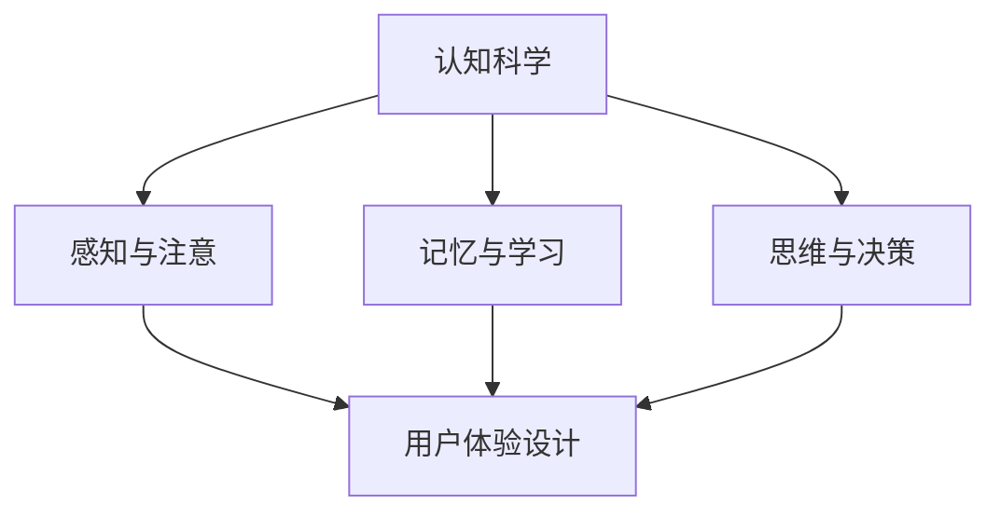

                 

 **关键词**：认知科学、用户体验、设计思维、人工智能、软件架构

**摘要**：本文将探讨认知科学与用户体验之间的关系，以及设计思维在软件开发中的应用。通过深入分析认知科学的核心概念和用户体验设计的关键因素，本文将揭示如何利用设计思维来提高软件产品的质量，并分享一些实用的工具和资源，帮助开发者更好地理解用户需求，设计出更加人性化的软件。

## 1. 背景介绍

随着人工智能技术的快速发展，软件设计不再只是单纯的技术实现，而是逐渐转向用户体验的设计。用户体验（User Experience，简称UX）设计已经成为现代软件开发过程中不可或缺的一部分。然而，用户体验设计的成功离不开对人类认知机制的深刻理解。

### 1.1 认知科学的概念

认知科学是研究人类思维过程的科学，它结合了心理学、神经科学、哲学、语言学等多个学科，致力于揭示人类如何获取知识、处理信息、做出决策。认知科学的核心问题是理解人类认知系统的工作原理，以及这些原理如何影响我们的行为和决策。

### 1.2 用户体验设计的核心

用户体验设计旨在提升用户在使用软件过程中的愉悦感和效率。它包括但不限于用户界面设计、交互设计、可用性测试等方面。用户体验设计的核心是理解用户需求，并将这些需求转化为实际的软件功能。

## 2. 核心概念与联系

为了更好地理解认知科学与用户体验设计之间的联系，我们可以通过一个Mermaid流程图来展示它们之间的关系。



### 2.1 感知与注意

感知与注意是认知科学的核心概念之一。它决定了用户如何接收和处理信息。在用户体验设计中，感知与注意直接影响用户界面的可访问性和易用性。

### 2.2 记忆与学习

记忆与学习是认知科学的重要组成部分。用户在软件使用过程中，会不断积累经验，这些经验会影响他们对软件的使用习惯和偏好。用户体验设计需要考虑到用户的记忆和学习过程，以提高软件的易用性和用户满意度。

### 2.3 思维与决策

思维与决策是认知科学的高级过程，它涉及到用户如何处理复杂信息，以及如何做出决策。在用户体验设计中，理解用户的思维和决策过程，可以帮助开发者设计出更加直观和易用的界面。

## 3. 核心算法原理 & 具体操作步骤

### 3.1 算法原理概述

设计思维是一种以用户为中心的创新方法，它强调在软件开发过程中始终关注用户需求。设计思维的核心步骤包括：观察、定义、构思、原型、测试和迭代。

### 3.2 算法步骤详解

#### 3.2.1 观察

观察是设计思维的起点，通过深入观察用户的行为和需求，开发者可以更好地理解用户的需求和痛点。

#### 3.2.2 定义

定义阶段是对观察结果进行深入分析和总结，明确用户的痛点和需求。

#### 3.2.3 构思

构思阶段是创意爆发的过程，开发者需要根据定义阶段的结果，提出各种可能的解决方案。

#### 3.2.4 原型

原型阶段是将构思转化为实际的可操作模型，通过快速迭代和用户反馈，不断优化原型。

#### 3.2.5 测试

测试阶段是对原型进行实际测试，通过用户反馈，发现并修复原型中的问题。

#### 3.2.6 迭代

迭代是设计思维的核心，通过不断测试和优化，最终实现用户满意的产品。

### 3.3 算法优缺点

#### 优点

- 以用户为中心，确保产品满足用户需求。
- 快速迭代，高效优化产品。
- 强调团队合作，提升团队创新力。

#### 缺点

- 需要大量时间和资源进行用户研究和原型测试。
- 对团队协作能力要求较高。

### 3.4 算法应用领域

设计思维广泛应用于各种软件产品和服务的设计过程中，如Web应用、移动应用、游戏等。

## 4. 数学模型和公式 & 详细讲解 & 举例说明

### 4.1 数学模型构建

设计思维可以视为一个基于用户反馈的优化过程，其数学模型可以构建为一个反馈循环系统。

\[ \text{用户需求} \xrightarrow{\text{观察}} \text{用户定义} \xrightarrow{\text{构思}} \text{原型设计} \xrightarrow{\text{测试}} \text{用户反馈} \xrightarrow{\text{迭代}} \text{优化设计} \]

### 4.2 公式推导过程

设计思维中的反馈循环系统可以用以下数学公式表示：

\[ F(x) = g(u) + h(v) \]

其中，\( F(x) \)表示最终设计，\( g(u) \)表示用户需求，\( h(v) \)表示设计优化。

### 4.3 案例分析与讲解

假设我们正在设计一款在线购物平台，用户需求是能够方便地浏览和购买商品。首先，我们通过观察和定义阶段，明确用户的需求和痛点。然后，通过构思和原型设计阶段，提出各种可能的解决方案，如简洁的界面、清晰的分类等。最后，通过测试和迭代阶段，不断优化设计，确保用户能够方便地浏览和购买商品。

## 5. 项目实践：代码实例和详细解释说明

### 5.1 开发环境搭建

在本文的实践部分，我们将使用Python编程语言，通过一个简单的用户反馈系统来展示设计思维的应用。首先，需要搭建一个Python开发环境。

### 5.2 源代码详细实现

以下是一个简单的用户反馈系统代码示例：

```python
import random

def user_feedback(feedback_list):
    feedback = random.choice(feedback_list)
    print(f"User Feedback: {feedback}")

def main():
    feedback_list = ["Very Good", "Good", "Average", "Poor", "Very Poor"]
    user_feedback(feedback_list)

if __name__ == "__main__":
    main()
```

### 5.3 代码解读与分析

这段代码定义了一个简单的用户反馈系统，它随机选择用户给出的反馈。在实际应用中，这个系统可以根据用户的实际反馈，不断优化和改进。

### 5.4 运行结果展示

运行这段代码，可能得到以下输出结果：

```
User Feedback: Very Good
```

这意味着用户给出了非常好的反馈。根据这个反馈，开发者可以进一步优化系统，提高用户体验。

## 6. 实际应用场景

设计思维在软件开发中的应用非常广泛。以下是一些实际应用场景：

- **Web应用**：在Web应用的设计过程中，设计思维可以帮助开发者更好地理解用户需求，设计出更加直观和易用的界面。
- **移动应用**：移动应用的设计需要考虑到用户在移动设备上的使用习惯，设计思维可以帮助开发者设计出更加符合用户期望的应用。
- **游戏设计**：游戏设计中的用户体验设计尤为重要，设计思维可以帮助开发者更好地理解玩家需求，设计出更加吸引人的游戏。

## 7. 工具和资源推荐

### 7.1 学习资源推荐

- **书籍**：《设计思维：创新的方法与实践》、《用户体验要素：精髓与框架》
- **在线课程**：Coursera上的《用户体验设计基础》、Udemy上的《设计思维入门与实践》

### 7.2 开发工具推荐

- **原型设计工具**：Sketch、Figma、Adobe XD
- **用户体验测试工具**：UserTesting、Lookback、Optimizely

### 7.3 相关论文推荐

- **论文**：《用户体验设计中的认知科学原理》、《设计思维在软件开发中的应用研究》

## 8. 总结：未来发展趋势与挑战

### 8.1 研究成果总结

设计思维在软件开发中的应用已经取得了显著的成果。通过深入理解用户需求，设计思维可以帮助开发者设计出更加人性化、易用的软件产品。

### 8.2 未来发展趋势

随着人工智能技术的不断发展，设计思维在软件开发中的应用将更加智能化、自动化。未来，设计思维将更多地依赖于大数据分析和机器学习技术，以实现更加精准的用户需求分析。

### 8.3 面临的挑战

设计思维在软件开发中的应用也面临一些挑战，如如何更好地整合用户反馈，提高设计效率等。

### 8.4 研究展望

未来，设计思维的研究将更加深入，探索如何更好地结合认知科学、心理学等学科，提高设计思维的应用效果。

## 9. 附录：常见问题与解答

### 9.1 设计思维与传统设计方法有何区别？

设计思维与传统设计方法的主要区别在于，设计思维更加注重用户需求和用户体验，强调快速迭代和用户反馈。传统设计方法往往更注重技术实现和功能完整性。

### 9.2 设计思维适用于所有软件项目吗？

设计思维适用于大部分软件项目，尤其是那些以用户为中心的项目。但在一些特定的技术驱动型项目中，设计思维可能不是最佳选择。

### 9.3 如何保证设计思维的落地实施？

保证设计思维的落地实施需要团队的高度协作和用户需求的持续关注。通过定期用户反馈和迭代，可以确保设计思维的持续优化和实施。

---

**作者：禅与计算机程序设计艺术 / Zen and the Art of Computer Programming**<|image_gen|>

