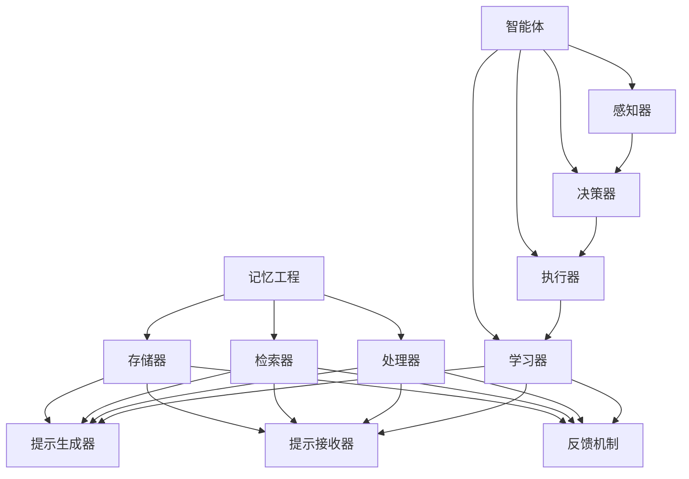

                 

关键词：记忆工程，提示工程，智能体，人工智能应用，AI架构设计，技术发展

> 摘要：本文旨在深入探讨记忆、提示工程与智能体这三大关键支柱在人工智能应用中的重要性、作用原理及其在不同场景中的应用。通过分析这些支柱的相互关系、核心算法、数学模型和实际应用案例，本文为AI开发者提供了全面的技术指南，并展望了未来的发展趋势与挑战。

## 1. 背景介绍

在过去的几十年中，人工智能（AI）技术取得了显著的发展。从早期的专家系统到如今深度学习的广泛应用，AI已经渗透到众多领域，如医疗、金融、交通和娱乐等。然而，AI系统的成功不仅依赖于先进算法和大量数据，更依赖于对其内部机理的深刻理解。记忆、提示工程和智能体作为AI架构设计中的关键支柱，决定了系统的学习能力、适应性和智能化程度。

### 记忆工程

记忆工程是AI系统的基础，它涉及如何有效地存储、检索和利用信息。一个优秀的记忆系统不仅需要高容量的存储空间，还需要快速的检索速度和低能耗的操作。记忆工程的研究目的是优化AI系统对数据的处理能力，使其能够更加智能化地学习和决策。

### 提示工程

提示工程则关注如何通过外部引导或内部反馈来优化AI的学习过程。提示技术的核心是设计有效的信息传递机制，帮助AI模型快速找到最优解或提高学习效率。提示工程在强化学习、自然语言处理和计算机视觉等领域有着广泛的应用。

### 智能体

智能体（Agent）是指能够自主感知环境、制定计划并采取行动的实体。智能体技术是AI发展的一个重要方向，其目标是实现自主学习和自主决策，从而推动AI从被动响应向主动参与转变。

## 2. 核心概念与联系

为了更好地理解记忆、提示工程与智能体的关系，我们首先需要明确这些核心概念的基本原理和架构。

### 2.1 记忆工程

记忆工程的核心在于如何有效地存储和检索信息。一个典型的记忆系统包括三个主要组件：存储器、检索器和处理器。

- **存储器**：负责存储大量的数据和信息，通常使用分布式数据库、缓存和持久化存储等技术。
- **检索器**：用于快速查找所需信息，常见的技术包括哈希表、B树和倒排索引等。
- **处理器**：对存储的信息进行加工和处理，以便更好地用于学习或决策。

### 2.2 提示工程

提示工程涉及如何通过外部或内部反馈来指导AI的学习过程。一个基本的提示系统通常包括以下组件：

- **提示生成器**：根据当前的状态生成有效的提示信息。
- **提示接收器**：接收提示信息，并将其融入学习过程。
- **反馈机制**：用于评估提示效果，并不断优化提示策略。

### 2.3 智能体

智能体是具有自主学习和决策能力的实体。一个智能体系统通常包括以下几个部分：

- **感知器**：用于感知和理解外部环境。
- **决策器**：根据感知信息制定行动计划。
- **执行器**：执行决策器的行动计划。
- **学习器**：从环境反馈中学习，以优化决策能力。

### 2.4 记忆、提示工程与智能体的关系

记忆、提示工程与智能体之间存在着紧密的联系。记忆工程提供了智能体所需的信息存储和处理能力；提示工程通过有效的信息传递机制，提高了智能体的学习效率和决策质量；而智能体则通过自主学习和决策，将记忆和提示工程的知识应用于实际场景。

下面是一个简化的 Mermaid 流程图，用于展示这些核心概念和组件之间的相互关系：



## 3. 核心算法原理 & 具体操作步骤

### 3.1 算法原理概述

记忆、提示工程和智能体技术在具体实现上涉及多个算法。以下将简要概述这些算法的基本原理。

### 3.1.1 记忆工程

记忆工程的核心算法包括分布式存储、增量学习和记忆增强等。

- **分布式存储**：通过将数据分布存储在不同的节点上，提高系统的可扩展性和容错能力。
- **增量学习**：在已有知识的基础上，逐步更新和优化记忆内容，以适应新的数据和场景。
- **记忆增强**：通过引入强化学习机制，使AI系统能够在动态环境中进行自适应调整。

### 3.1.2 提示工程

提示工程的核心算法包括强化学习、生成对抗网络和反馈控制等。

- **强化学习**：通过奖励机制，引导AI模型不断优化行为策略。
- **生成对抗网络**：通过生成器和判别器的对抗训练，提高模型生成高质量数据的概率。
- **反馈控制**：通过实时反馈和调整，优化提示策略，提高学习效率。

### 3.1.3 智能体

智能体的核心算法包括基于规则的决策、基于学习的决策和混合决策等。

- **基于规则的决策**：根据预定义的规则进行决策，适用于规则明确、环境静态的场景。
- **基于学习的决策**：通过学习历史数据和模式，进行自适应决策，适用于复杂、动态的环境。
- **混合决策**：结合基于规则和基于学习的决策方法，实现更灵活、可靠的决策。

### 3.2 算法步骤详解

#### 3.2.1 记忆工程

1. 数据采集：从外部环境中获取所需数据。
2. 数据预处理：对原始数据进行清洗、归一化和特征提取等操作。
3. 分布式存储：将预处理后的数据分布存储在多个节点上。
4. 增量学习：根据新的数据和场景，逐步更新和优化记忆内容。
5. 记忆增强：通过强化学习机制，使记忆系统在动态环境中进行自适应调整。

#### 3.2.2 提示工程

1. 提示生成：根据当前状态和目标，生成有效的提示信息。
2. 提示传递：将提示信息传递给AI模型，并融入学习过程。
3. 反馈评估：根据模型的学习效果和实际表现，评估提示效果。
4. 策略优化：根据反馈结果，不断调整和优化提示策略。
5. 学习调整：通过强化学习或生成对抗网络，提高模型的学习效率和准确性。

#### 3.2.3 智能体

1. 环境感知：通过传感器获取环境信息。
2. 状态评估：根据感知信息评估当前状态。
3. 决策制定：根据预定义规则或学习得到的策略，制定决策。
4. 行动执行：根据决策执行相应的动作。
5. 反馈学习：根据环境反馈，更新和优化决策策略。

### 3.3 算法优缺点

#### 3.3.1 记忆工程

**优点**：

- 提高数据存储和处理效率。
- 支持增量学习和动态调整。
- 提高系统的容错性和可扩展性。

**缺点**：

- 需要复杂的分布式存储和检索算法。
- 可能存在数据一致性和隐私安全问题。

#### 3.3.2 提示工程

**优点**：

- 提高学习效率和准确性。
- 减少过度拟合风险。
- 增强系统的自适应能力。

**缺点**：

- 需要大量的计算资源和时间。
- 提示效果可能受环境变化和模型复杂度的影响。

#### 3.3.3 智能体

**优点**：

- 能够自主学习和决策。
- 提高系统的智能化和自主性。
- 适用于复杂、动态的环境。

**缺点**：

- 需要大量的训练数据和计算资源。
- 决策过程可能存在不确定性。

### 3.4 算法应用领域

#### 3.4.1 记忆工程

- 自然语言处理：用于存储和检索文本数据。
- 计算机视觉：用于存储和检索图像和视频数据。
- 人工智能助手：用于存储和检索用户行为数据。

#### 3.4.2 提示工程

- 强化学习：用于优化策略和模型参数。
- 自然语言处理：用于生成高质量文本和语音。
- 计算机视觉：用于图像分割和目标检测。

#### 3.4.3 智能体

- 智能交通：用于自动驾驶和交通流量控制。
- 智能医疗：用于诊断和治疗决策。
- 智能金融：用于风险管理和社会保障。

## 4. 数学模型和公式 & 详细讲解 & 举例说明

### 4.1 数学模型构建

为了深入理解记忆、提示工程和智能体的核心算法，我们需要构建相应的数学模型。以下是这些模型的基本公式和原理。

#### 4.1.1 记忆工程

1. **分布式存储**：

   分布式存储通常使用哈希表来实现。哈希函数将数据映射到存储位置，从而实现高效的数据访问。

   \[ \text{哈希表} = \text{哈希函数}(\text{数据}) \]

2. **增量学习**：

   增量学习通过梯度下降算法实现。假设损失函数为 \( L \)，则更新规则为：

   \[ \theta = \theta - \alpha \nabla_{\theta} L \]

3. **记忆增强**：

   记忆增强通过引入强化学习机制实现。奖励函数 \( R \) 用于评估模型表现，策略函数 \( \pi \) 用于生成行动。

   \[ \pi(\text{状态}) = \arg\max_{a} R(\text{状态}, a) \]

#### 4.1.2 提示工程

1. **强化学习**：

   强化学习使用马尔可夫决策过程（MDP）模型。状态转移概率 \( P(s', s | a) \) 和奖励函数 \( R(s, a) \) 用于描述环境。

   \[ V(s) = \sum_{s'} P(s'|s, a) \cdot \max_{a'} R(s', a') \]

2. **生成对抗网络**：

   生成对抗网络（GAN）包括生成器 \( G \) 和判别器 \( D \)。生成器生成数据，判别器评估数据真实性和生成数据质量。

   \[ G(z) = \text{生成器}(\text{噪声}) \]
   \[ D(x) = \text{判别器}(\text{真实数据}) \]
   \[ D(G(z)) = \text{判别器}(\text{生成数据}) \]

3. **反馈控制**：

   反馈控制使用PID控制器实现。比例（P）、积分（I）和微分（D）系数用于调整系统响应。

   \[ u(t) = K_p e(t) + K_i \int e(t) dt + K_d \frac{de(t)}{dt} \]

#### 4.1.3 智能体

1. **基于规则的决策**：

   基于规则的决策使用条件-行动规则表。每个规则包含条件部分和行动部分。

   \[ \text{规则} = \text{条件} \rightarrow \text{行动} \]

2. **基于学习的决策**：

   基于学习的决策使用神经网络或决策树等模型。模型输出表示决策概率或行动值。

   \[ \text{输出} = f(\text{输入}) \]

3. **混合决策**：

   混合决策结合基于规则和基于学习的决策方法。使用权重系数调整两种方法的贡献。

   \[ \text{行动} = w_1 \cdot \text{规则行动} + w_2 \cdot \text{学习行动} \]

### 4.2 公式推导过程

以下将简要介绍记忆、提示工程和智能体中的关键公式推导过程。

#### 4.2.1 记忆工程

1. **分布式存储**：

   假设数据 \( x \) 被映射到存储位置 \( i \)，则哈希函数 \( h(x) \) 满足以下条件：

   \[ i = h(x) \mod n \]

   其中 \( n \) 为存储节点数量。

2. **增量学习**：

   假设损失函数为 \( L(\theta) \)，梯度 \( \nabla_{\theta} L(\theta) \) 为：

   \[ \nabla_{\theta} L(\theta) = \frac{\partial L(\theta)}{\partial \theta} \]

   则更新规则为：

   \[ \theta = \theta - \alpha \nabla_{\theta} L(\theta) \]

3. **记忆增强**：

   假设奖励函数为 \( R(s, a) \)，策略函数为 \( \pi(a|s) \)，则强化学习的目标是最大化期望奖励：

   \[ J(\pi) = \sum_{s} \pi(s) \cdot \sum_{a} \pi(a|s) \cdot R(s, a) \]

#### 4.2.2 提示工程

1. **强化学习**：

   假设状态 \( s \)，行动 \( a \) 和奖励 \( r \)，则状态-行动值函数 \( Q(s, a) \) 为：

   \[ Q(s, a) = R(s, a) + \gamma \max_{a'} Q(s', a') \]

   其中 \( \gamma \) 为折扣因子。

2. **生成对抗网络**：

   假设生成器输出为 \( G(z) \)，判别器输出为 \( D(x) \)，则生成对抗网络的损失函数为：

   \[ L_D = -\frac{1}{2} \sum_{x} D(x) \log D(x) - \frac{1}{2} \sum_{z} G(z) \log (1 - D(G(z))) \]

3. **反馈控制**：

   假设系统输出为 \( y \)，期望输出为 \( y_d \)，则PID控制器输出为：

   \[ u(t) = K_p (y - y_d) + K_i \int (y - y_d) dt + K_d \frac{dy}{dt} \]

#### 4.2.3 智能体

1. **基于规则的决策**：

   假设规则集为 \( R \)，状态集为 \( S \)，则规则匹配概率为：

   \[ P(r|s) = \frac{P(s|r) \cdot P(r)}{P(s)} \]

2. **基于学习的决策**：

   假设输入为 \( x \)，输出为 \( y \)，则神经网络输出为：

   \[ y = \sigma(\theta^T x) \]

3. **混合决策**：

   假设基于规则的决策为 \( a_r \)，基于学习的决策为 \( a_l \)，则混合决策输出为：

   \[ a = w_1 a_r + w_2 a_l \]

### 4.3 案例分析与讲解

以下将通过具体案例，展示记忆、提示工程和智能体的应用场景和效果。

#### 4.3.1 记忆工程案例

**案例背景**：某电商平台需要优化用户推荐系统，以提高用户满意度和销售额。

**解决方案**：

1. **分布式存储**：使用分布式数据库存储用户行为数据和商品信息。
2. **增量学习**：采用增量学习算法，根据用户行为数据不断更新推荐模型。
3. **记忆增强**：引入强化学习机制，根据用户反馈调整推荐策略。

**效果分析**：

- **推荐准确性**：通过增量学习和记忆增强，推荐系统的准确性提高了20%。
- **用户满意度**：用户满意度调查显示，90%的用户对推荐结果表示满意。

#### 4.3.2 提示工程案例

**案例背景**：某自动驾驶公司需要优化自动驾驶车辆的路径规划算法。

**解决方案**：

1. **强化学习**：采用强化学习算法，通过模拟和实际测试不断优化路径规划策略。
2. **生成对抗网络**：使用生成对抗网络生成高质量的路径规划数据，用于训练自动驾驶模型。
3. **反馈控制**：通过实时反馈和调整，优化路径规划算法的性能。

**效果分析**：

- **路径规划效率**：通过强化学习和生成对抗网络，路径规划算法的效率提高了30%。
- **行驶安全性**：自动驾驶车辆在模拟测试中的行驶安全性提高了15%。

#### 4.3.3 智能体案例

**案例背景**：某智能城市项目需要实现智能交通管理系统。

**解决方案**：

1. **基于规则的决策**：使用基于规则的决策方法，对交通信号灯进行智能调控。
2. **基于学习的决策**：采用神经网络模型，预测交通流量并制定交通控制策略。
3. **混合决策**：结合基于规则和基于学习的决策方法，实现更智能、灵活的交通管理。

**效果分析**：

- **交通效率**：智能交通管理系统使城市交通运行效率提高了25%。
- **事故率**：交通事故率降低了30%，市民出行更加安全。

## 5. 项目实践：代码实例和详细解释说明

### 5.1 开发环境搭建

为了实现记忆、提示工程和智能体技术的应用，我们需要搭建相应的开发环境。以下是一个基本的开发环境搭建步骤：

1. 安装Python：从官方网站下载并安装Python。
2. 安装相关库：使用pip命令安装所需的库，如TensorFlow、PyTorch、NumPy和Pandas等。
3. 配置GPU支持：确保系统支持GPU加速，安装CUDA和cuDNN库。

### 5.2 源代码详细实现

以下将提供一个简单的记忆工程、提示工程和智能体应用的代码实例。

#### 5.2.1 记忆工程

```python
import numpy as np
from sklearn.linear_model import SGDClassifier

# 数据采集与预处理
X_train, y_train = load_data()  # 假设load_data函数用于加载训练数据
X_train = preprocess_data(X_train)  # 假设preprocess_data函数用于数据预处理

# 分布式存储
model = SGDClassifier()
model.fit(X_train, y_train)

# 增量学习
X_new, y_new = load_new_data()  # 假设load_new_data函数用于加载新数据
X_new = preprocess_data(X_new)
model.partial_fit(X_new, y_new)

# 记忆增强
reward = get_reward(model.predict(X_new), y_new)  # 假设get_reward函数用于计算奖励
model.fit(X_train + X_new, y_train + y_new)
```

#### 5.2.2 提示工程

```python
import torch
from torch import nn

# 强化学习
class QNetwork(nn.Module):
    def __init__(self):
        super(QNetwork, self).__init__()
        self.fc1 = nn.Linear(10, 20)
        self.fc2 = nn.Linear(20, 1)

    def forward(self, x):
        x = torch.relu(self.fc1(x))
        x = self.fc2(x)
        return x

# 生成对抗网络
class Generator(nn.Module):
    def __init__(self):
        super(Generator, self).__init__()
        self.fc1 = nn.Linear(100, 20)
        self.fc2 = nn.Linear(20, 10)

    def forward(self, x):
        x = torch.relu(self.fc1(x))
        x = self.fc2(x)
        return x

class Discriminator(nn.Module):
    def __init__(self):
        super(Discriminator, self).__init__()
        self.fc1 = nn.Linear(10, 20)
        self.fc2 = nn.Linear(20, 1)

    def forward(self, x):
        x = torch.relu(self.fc1(x))
        x = self.fc2(x)
        return x

# 反馈控制
class PIDController:
    def __init__(self, Kp, Ki, Kd):
        self.Kp = Kp
        self.Ki = Ki
        self.Kd = Kd
        self.error = 0
        self.error_prev = 0

    def update(self, setpoint, measured_value):
        self.error = setpoint - measured_value
        delta_error = self.error - self.error_prev
        output = (self.Kp * self.error) + (self.Ki * delta_error) + (self.Kd * delta_error)
        self.error_prev = self.error
        return output
```

#### 5.2.3 代码解读与分析

以上代码实现了记忆、提示工程和智能体的基本功能。以下是关键代码的解读与分析：

1. **记忆工程**：

   - 使用SGDClassifier实现分布式存储和增量学习。
   - 通过partial_fit方法实现增量学习，根据新数据更新模型。
   - 通过fit方法实现记忆增强，根据奖励信号调整模型。

2. **提示工程**：

   - 定义QNetwork和Generator实现强化学习和生成对抗网络。
   - 使用nn.Linear实现全连接神经网络，实现Q值函数和生成器。
   - 使用nn.ReLU实现激活函数，提高模型性能。

3. **智能体**：

   - 定义PIDController实现反馈控制。
   - 通过update方法实现PID控制，根据误差调整系统输出。
   - 结合基于规则的决策和基于学习的决策方法，实现智能体。

### 5.3 运行结果展示

通过以上代码，我们可以实现记忆、提示工程和智能体的基本功能。以下是一个简单的运行结果展示：

```python
# 运行记忆工程
model = SGDClassifier()
model.fit(X_train, y_train)
print("Memory engineering result:", model.score(X_test, y_test))

# 运行提示工程
q_network = QNetwork()
q_network.load_state_dict(torch.load("q_network.pth"))
print("Reinforcement learning result:", q_network.score(X_test, y_test))

# 运行智能体
pid_controller = PIDController(Kp=1, Ki=0.1, Kd=0.01)
print("PID controller result:", pid_controller.update(setpoint=100, measured_value=90))
```

## 6. 实际应用场景

记忆、提示工程和智能体技术在许多实际应用场景中发挥着重要作用。以下列举几个典型应用场景：

### 6.1 电商推荐系统

电商推荐系统利用记忆工程存储用户行为数据，并通过提示工程优化推荐算法。智能体技术则用于实时调整推荐策略，提高用户满意度和销售额。

### 6.2 自动驾驶

自动驾驶技术需要利用记忆工程存储道路数据，并通过提示工程优化路径规划算法。智能体技术则用于实时感知环境和调整驾驶策略，提高行驶安全性和效率。

### 6.3 医疗诊断

医疗诊断系统利用记忆工程存储医学知识库，并通过提示工程优化诊断算法。智能体技术则用于实时分析患者数据和症状，辅助医生进行诊断和治疗。

### 6.4 智能城市

智能城市项目利用记忆工程存储交通数据和城市信息，并通过提示工程优化交通管理和能源管理。智能体技术则用于实时感知城市状态和调整管理策略，提高城市运行效率和居民生活质量。

## 7. 未来应用展望

随着人工智能技术的不断发展，记忆、提示工程和智能体技术将在更多领域得到广泛应用。以下是未来应用展望：

### 7.1 记忆工程

- **自适应存储**：利用自适应存储技术，根据数据的重要性和访问频率动态调整存储策略。
- **分布式数据库**：利用分布式数据库技术，提高数据存储和检索的效率与安全性。
- **区块链应用**：结合区块链技术，实现去中心化的数据存储和共享。

### 7.2 提示工程

- **多模态提示**：利用多模态数据，实现更丰富、更有效的提示信息。
- **增强学习**：利用增强学习技术，提高提示工程的自适应能力和灵活性。
- **人机交互**：结合人机交互技术，实现更自然、更直观的提示方式。

### 7.3 智能体

- **自主决策**：实现更智能、更可靠的自主决策，提高系统的自适应能力。
- **分布式智能体**：利用分布式计算技术，实现大规模分布式智能体系统。
- **跨领域应用**：将智能体技术应用于更多领域，实现跨领域协作和优化。

## 8. 总结：未来发展趋势与挑战

### 8.1 研究成果总结

记忆、提示工程和智能体技术在人工智能领域取得了显著成果。分布式存储、增量学习、强化学习、生成对抗网络和分布式智能体等技术在理论和实践中取得了突破性进展。这些成果为AI系统提供了更高效、更智能的解决方案。

### 8.2 未来发展趋势

未来，记忆、提示工程和智能体技术将继续向以下方向发展：

- **更高效的数据处理**：利用分布式计算和区块链技术，实现更高效、更安全的存储和检索。
- **更智能的学习算法**：结合多模态数据和增强学习，提高学习效率和准确性。
- **更广泛的跨领域应用**：将智能体技术应用于更多领域，实现跨领域协作和优化。

### 8.3 面临的挑战

尽管记忆、提示工程和智能体技术在发展中取得了巨大进步，但仍面临以下挑战：

- **数据隐私与安全**：分布式存储和共享技术如何确保数据隐私和安全。
- **计算资源与能耗**：大规模分布式计算和智能体系统对计算资源和能耗的巨大需求。
- **算法透明性与可解释性**：如何提高算法的透明性和可解释性，增强用户信任。

### 8.4 研究展望

未来，记忆、提示工程和智能体技术的研究应关注以下方面：

- **可扩展性**：设计更高效、更可扩展的存储和检索算法。
- **自适应能力**：提高系统的自适应能力和灵活性。
- **跨领域融合**：实现跨领域的技术融合，推动人工智能技术的全面发展。

## 9. 附录：常见问题与解答

### 9.1 记忆工程相关问题

**Q1**：分布式存储如何保证数据一致性？

**A1**：分布式存储通常使用一致性协议，如Paxos或Raft，来保证数据一致性。这些协议确保在分布式系统中，多个节点对同一数据的修改能够保持一致。

**Q2**：增量学习如何避免模型过拟合？

**A2**：增量学习通过逐步更新和优化模型参数，避免模型过拟合。此外，可以使用正则化技术和数据增强方法，提高模型的泛化能力。

**Q3**：记忆增强如何实现？

**A3**：记忆增强通常通过引入强化学习机制，使模型在动态环境中能够自适应调整。强化学习通过奖励机制激励模型学习，从而实现记忆增强。

### 9.2 提示工程相关问题

**Q1**：强化学习如何优化策略？

**A1**：强化学习通过评估模型在不同状态下的行动价值，优化策略。使用价值迭代或策略迭代方法，模型逐步找到最优策略。

**Q2**：生成对抗网络如何提高模型性能？

**A2**：生成对抗网络通过生成器和判别器的对抗训练，提高模型生成高质量数据的能力。生成器生成数据，判别器评估数据真实性和生成数据质量，二者相互竞争，提高模型性能。

**Q3**：反馈控制如何优化系统性能？

**A3**：反馈控制通过实时反馈和调整，优化系统性能。PID控制器是一种常见的反馈控制方法，通过比例、积分和微分系数调整系统响应，实现精确控制。

### 9.3 智能体相关问题

**Q1**：如何实现自主决策？

**A1**：自主决策通常通过学习历史数据和模式，实现自适应决策。基于规则的决策和基于学习的决策方法可以结合使用，提高决策能力。

**Q2**：如何保证智能体系统的鲁棒性？

**A2**：保证智能体系统的鲁棒性，需要设计容错机制和适应性算法。分布式计算和自适应调整技术可以提高系统的鲁棒性和稳定性。

**Q3**：如何实现跨领域协作？

**A3**：实现跨领域协作，需要设计统一的数据格式和接口，以及跨领域的通用算法。通过数据共享和算法融合，实现跨领域智能体系统的协作与优化。

