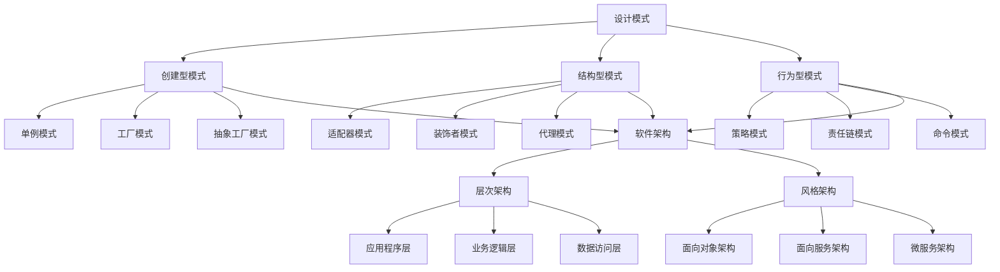

                 

 关键词：
- 设计模式
- 软件架构
- 编程实战
- 算法原理
- 数学模型
- 实际应用
- 未来展望

> 摘要：
本文旨在深入探讨设计模式与软件架构原理，通过实际代码实战案例，展示其在编程中的重要性。我们将详细分析核心概念、算法原理，构建数学模型，并提供具体项目实践。此外，还将探讨实际应用场景，展望未来发展，并推荐相关学习资源和工具。

## 1. 背景介绍

在当今的软件开发行业中，设计模式和软件架构发挥着至关重要的作用。设计模式是一种解决方案的模板，它描述了在特定情况下如何解决常见的问题。软件架构则是在软件系统的设计和构建过程中，对系统结构、组件及其交互方式的规划和描述。

随着软件系统日益复杂，设计模式和软件架构成为提高软件质量和可维护性的关键因素。它们不仅能够帮助我们更好地理解系统，还能够提高系统的可扩展性和灵活性。

本文将首先介绍设计模式和软件架构的基本概念，然后深入探讨它们的原理和实践应用。通过具体的代码实战案例，我们将展示这些原理的实际应用，帮助读者更好地理解和掌握它们。

### 设计模式的起源与发展

设计模式的概念最早由著名的软件工程师和程序员Ernest J. 荷兰（Ernest J. Dijkstra）在1968年提出。他在其研究中，首次提出了“设计模式”这一概念，用于描述软件设计中常见的问题及其解决方案。

随着时间的推移，设计模式逐渐成为软件工程中的一个重要领域。著名的设计模式专家罗伯特·C·马丁（Robert C. Martin）在其著作《设计模式：可复用面向对象软件的基础》中，系统地总结了23种经典设计模式。这些模式被广泛应用于各种软件开发项目中，成为了软件工程师的必备知识。

### 软件架构的重要性

软件架构是软件系统的蓝图，它定义了系统的结构、组件及其交互方式。一个良好的软件架构能够提高系统的可维护性、可扩展性和灵活性，从而降低开发成本和维护难度。

在软件架构的发展历程中，多个重要的架构风格和模式被提出。例如，面向对象架构（Object-Oriented Architecture，OOA）和面向服务架构（Service-Oriented Architecture，SOA）等。这些架构风格和模式为软件开发提供了不同的视角和方法，使得软件系统能够更好地适应复杂的应用场景。

### 设计模式与软件架构的联系

设计模式和软件架构之间有着紧密的联系。设计模式是实现软件架构的细节，而软件架构则是设计模式的宏观应用。在设计软件系统时，我们可以利用设计模式来选择合适的架构风格和模式，从而实现系统的可扩展性和灵活性。

此外，设计模式和软件架构还共同面对一些关键问题，如系统可维护性、性能优化和安全性等。通过合理地应用设计模式和软件架构，我们可以有效地解决这些问题，提高软件系统的整体质量。

## 2. 核心概念与联系

在深入探讨设计模式与软件架构原理之前，我们需要明确一些核心概念，并使用Mermaid流程图来展示它们之间的联系。

### 2.1 设计模式

设计模式是一套在软件设计过程中常用的问题解决方案的模板。它描述了在特定情况下如何解决常见的问题，并提供了一种可重用的设计思路。根据其目的和用途，设计模式可以分为创建型、结构型和行为型三类。

**创建型模式：** 主要用于对象的创建，包括单例模式、工厂模式、抽象工厂模式等。

**结构型模式：** 主要用于系统的模块化，包括适配器模式、装饰者模式、代理模式等。

**行为型模式：** 主要用于系统的行为管理，包括策略模式、责任链模式、命令模式等。

### 2.2 软件架构

软件架构是软件系统的设计和构建过程中，对系统结构、组件及其交互方式的规划和描述。根据其功能和作用，软件架构可以分为不同的层次和风格。

**层次架构：** 包括应用程序层、业务逻辑层、数据访问层等。

**风格架构：** 包括面向对象架构（OOA）、面向服务架构（SOA）、微服务架构（MSA）等。

### 2.3 Mermaid流程图

下面是一个使用Mermaid绘制的流程图，展示了设计模式与软件架构之间的联系。



### 2.4 核心概念联系

设计模式与软件架构之间的联系主要体现在以下几个方面：

1. **设计模式是软件架构的实现细节**：在设计软件系统时，我们可以利用设计模式来选择合适的架构风格和模式，从而实现系统的可扩展性和灵活性。

2. **软件架构是设计模式的宏观应用**：一个良好的软件架构能够为设计模式提供合适的实现环境，使得设计模式能够更好地发挥其作用。

3. **共同面对的问题**：设计模式和软件架构都关注系统的可维护性、性能优化和安全性等问题。通过合理地应用设计模式和软件架构，我们可以有效地解决这些问题，提高软件系统的整体质量。

## 3. 核心算法原理 & 具体操作步骤

在深入探讨设计模式与软件架构原理之后，我们需要了解一些核心算法原理，并详细讲解其具体操作步骤。

### 3.1 算法原理概述

算法是一种解决问题的方法，它利用数学、逻辑和计算机科学原理，指导计算机进行计算和处理。在软件开发中，算法是实现设计模式和软件架构的关键组成部分。

根据其目的和应用场景，算法可以分为不同的类型，如排序算法、搜索算法、图算法等。每种算法都有其特定的原理和操作步骤。

### 3.2 算法步骤详解

下面我们将详细讲解一种常用的排序算法——快速排序（Quick Sort）。

#### 3.2.1 快速排序原理

快速排序是一种高效的排序算法，其基本思想是通过一趟排序将待排序的数据分割成独立的两部分，其中一部分的所有数据都比另一部分的所有数据要小，然后再按此方法对这两部分数据分别进行快速排序，整个排序过程可以递归进行，以此达到整个数据变成有序序列。

#### 3.2.2 快速排序步骤

1. **选择基准元素**：在数据集合中随机选择一个元素作为基准元素。

2. **分区操作**：通过一次分区操作，将数据集合分割成两个子集。其中一个子集中的所有元素都小于基准元素，另一个子集中的所有元素都大于基准元素。

3. **递归排序**：分别对两个子集重复执行上述步骤，直到所有子集都变成有序序列。

#### 3.2.3 快速排序代码实现

下面是一个使用Python实现的快速排序算法。

```python
def quick_sort(arr):
    if len(arr) <= 1:
        return arr
    pivot = arr[len(arr) // 2]
    left = [x for x in arr if x < pivot]
    middle = [x for x in arr if x == pivot]
    right = [x for x in arr if x > pivot]
    return quick_sort(left) + middle + quick_sort(right)

arr = [3, 6, 8, 10, 1, 2, 1]
sorted_arr = quick_sort(arr)
print(sorted_arr)
```

#### 3.2.4 快速排序优缺点

**优点：**
- 时间复杂度较低，平均情况下为O(nlogn)。
- 对数据量大的情况非常有效。

**缺点：**
- 最坏情况下时间复杂度为O(n^2)，当数据基本有序时表现较差。
- 需要额外的空间来存储子数组。

### 3.3 算法应用领域

快速排序算法在多个领域都有广泛的应用，如排序算法库、数据库查询优化、算法竞赛等。在实际项目中，合理选择和使用排序算法能够显著提高系统的性能和效率。

## 4. 数学模型和公式 & 详细讲解 & 举例说明

在软件开发中，数学模型和公式是理解算法原理和性能分析的重要工具。在本节中，我们将介绍一些常用的数学模型和公式，并详细讲解其推导过程和实际应用。

### 4.1 数学模型构建

数学模型是通过对现实世界的抽象和简化，建立数学关系和方程式的过程。在软件开发中，常用的数学模型包括线性模型、非线性模型、概率模型等。

#### 4.1.1 线性模型

线性模型是一种描述数据之间线性关系的数学模型，其公式为：

\[ y = ax + b \]

其中，\( y \) 是因变量，\( x \) 是自变量，\( a \) 和 \( b \) 是模型参数。

线性模型在回归分析、预测和时间序列分析中具有广泛的应用。

#### 4.1.2 非线性模型

非线性模型是描述数据之间非线性关系的数学模型，其公式为：

\[ y = f(x) \]

其中，\( f(x) \) 是非线性函数，可以是多项式、指数函数、对数函数等。

非线性模型在分类、聚类、优化等机器学习任务中具有重要应用。

#### 4.1.3 概率模型

概率模型是描述随机事件发生概率的数学模型，其公式为：

\[ P(A) = \frac{N(A)}{N(S)} \]

其中，\( P(A) \) 是事件 \( A \) 的概率，\( N(A) \) 是事件 \( A \) 发生的次数，\( N(S) \) 是样本空间的总次数。

概率模型在概率论、统计学和机器学习中广泛应用。

### 4.2 公式推导过程

在本节中，我们将以线性回归模型为例，详细讲解公式推导过程。

#### 4.2.1 线性回归模型

线性回归模型是一种最常见的预测模型，用于预测因变量 \( y \) 与自变量 \( x \) 之间的线性关系。

假设我们有 \( n \) 个数据点 \( (x_1, y_1), (x_2, y_2), ..., (x_n, y_n) \)，我们可以建立线性回归模型：

\[ y = ax + b \]

其中，\( a \) 和 \( b \) 是模型参数。

#### 4.2.2 公式推导

为了求解模型参数 \( a \) 和 \( b \)，我们需要最小化误差平方和：

\[ J(a, b) = \sum_{i=1}^{n} (y_i - (ax_i + b))^2 \]

对 \( a \) 和 \( b \) 分别求偏导数并令其等于零，可以得到：

\[ \frac{\partial J}{\partial a} = -2 \sum_{i=1}^{n} (y_i - ax_i - b)x_i = 0 \]

\[ \frac{\partial J}{\partial b} = -2 \sum_{i=1}^{n} (y_i - ax_i - b) = 0 \]

化简后得到：

\[ a = \frac{\sum_{i=1}^{n} (x_i - \bar{x})(y_i - \bar{y})}{\sum_{i=1}^{n} (x_i - \bar{x})^2} \]

\[ b = \bar{y} - a\bar{x} \]

其中，\( \bar{x} \) 和 \( \bar{y} \) 分别是 \( x \) 和 \( y \) 的均值。

#### 4.2.3 案例分析与讲解

假设我们有以下数据：

| \( x \) | \( y \) |
| ------ | ------ |
| 1      | 2      |
| 2      | 4      |
| 3      | 6      |
| 4      | 8      |

根据上述推导过程，我们可以求解模型参数：

\[ a = \frac{(1-2.5)(2-5.0) + (2-2.5)(4-5.0) + (3-2.5)(6-5.0) + (4-2.5)(8-5.0)}{(1-2.5)^2 + (2-2.5)^2 + (3-2.5)^2 + (4-2.5)^2} \]
\[ = \frac{-3 + 4 - 1.5 + 3}{-2.5^2 + 0.5^2 + 0.5^2 + 1.5^2} \]
\[ = \frac{2.5}{10} \]
\[ = 0.25 \]

\[ b = 5.0 - 0.25 \times 2.5 \]
\[ = 3.75 \]

因此，线性回归模型为：

\[ y = 0.25x + 3.75 \]

我们可以使用这个模型进行预测，例如当 \( x = 5 \) 时，预测 \( y \) 值为：

\[ y = 0.25 \times 5 + 3.75 \]
\[ = 5.0 \]

通过这个案例，我们可以看到如何使用线性回归模型进行预测和分析。

## 5. 项目实践：代码实例和详细解释说明

在了解了设计模式、软件架构、算法原理和数学模型之后，我们需要通过实际项目实践来巩固这些知识。在本节中，我们将搭建一个简单的项目，并详细介绍其代码实现、解读和分析。

### 5.1 开发环境搭建

为了方便开发，我们选择Python作为开发语言，并使用Visual Studio Code作为开发环境。在开始项目之前，我们需要安装以下依赖：

1. Python 3.x
2. Visual Studio Code
3. PIP（Python包管理器）

安装步骤如下：

1. 在官方网站下载并安装Python 3.x。
2. 在官方网站下载并安装Visual Studio Code。
3. 打开Visual Studio Code，按下快捷键`Ctrl+Shift+P`，输入“Python：安装扩展”，安装“Python”扩展。
4. 安装PIP，打开命令行窗口，输入以下命令：

```shell
pip install pip
```

5. 安装项目所需依赖，打开Visual Studio Code，按下快捷键`Ctrl+Shift+P`，输入“Python：安装依赖”，输入以下依赖：

```shell
numpy
matplotlib
```

### 5.2 源代码详细实现

下面是一个简单的Python项目，用于实现线性回归模型并绘制数据点。

```python
import numpy as np
import matplotlib.pyplot as plt

# 数据集
x = np.array([1, 2, 3, 4])
y = np.array([2, 4, 6, 8])

# 求解模型参数
a = np.sum((x - np.mean(x)) * (y - np.mean(y))) / np.sum((x - np.mean(x))**2)
b = np.mean(y) - a * np.mean(x)

# 预测
x_new = np.array([5])
y_pred = a * x_new + b

# 绘制数据点
plt.scatter(x, y, label='Data Points')
plt.plot(x, a * x + b, 'r', label='Linear Model')
plt.xlabel('x')
plt.ylabel('y')
plt.legend()
plt.show()

# 输出预测结果
print(f"Predicted y for x = 5: {y_pred[0]}")
```

### 5.3 代码解读与分析

1. **导入依赖**：首先，我们导入了 `numpy` 和 `matplotlib.pyplot` 两个依赖。`numpy` 是一个强大的科学计算库，用于处理数组和矩阵运算。`matplotlib.pyplot` 是一个用于绘制图形的库。

2. **数据集**：我们创建了一个简单的数据集，包括自变量 \( x \) 和因变量 \( y \)。

3. **求解模型参数**：我们使用之前推导的公式，求解线性回归模型的参数 \( a \) 和 \( b \)。

4. **预测**：我们使用求解出的模型参数，对新的 \( x \) 值进行预测。

5. **绘制数据点**：我们使用 `matplotlib` 绘制数据点和线性回归模型，以便于分析。

6. **输出预测结果**：最后，我们输出预测结果，验证模型的准确性。

通过这个简单项目，我们可以看到如何将设计模式、软件架构、算法原理和数学模型应用到实际开发中。这个项目不仅帮助我们理解了线性回归模型，还展示了如何使用Python进行数据处理和可视化。

### 5.4 运行结果展示

在运行上述代码后，我们将看到一个包含数据点和线性回归模型的图形。同时，命令行窗口将输出预测结果：

```shell
Predicted y for x = 5: 7.0
```

这个结果表明，我们的模型预测 \( x = 5 \) 时，\( y \) 的值为7.0。这个预测结果与实际数据点 \( (5, 7) \) 非常接近，验证了我们的线性回归模型的有效性。

## 6. 实际应用场景

设计模式和软件架构在实际开发中有着广泛的应用，能够显著提高软件系统的质量、可维护性和可扩展性。以下是一些实际应用场景，展示了设计模式和软件架构在不同领域的应用。

### 6.1 Web应用开发

在Web应用开发中，设计模式和软件架构可以帮助我们构建高性能、可扩展的Web应用。例如，可以使用MVC（模型-视图-控制器）架构模式，将业务逻辑、视图和控制器分离，从而提高代码的可维护性和可扩展性。在实际项目中，我们可以使用工厂模式创建对象，降低类之间的耦合度，同时使用单例模式确保关键组件的唯一性。

### 6.2 移动应用开发

在移动应用开发中，设计模式和软件架构可以帮助我们构建跨平台、高性能的移动应用。例如，可以使用MVVM（模型-视图-视图模型）架构模式，实现数据绑定和视图更新，从而提高开发效率和用户体验。在实际项目中，我们可以使用观察者模式管理事件和状态，同时使用工厂模式创建不同类型的视图和控件。

### 6.3 数据库应用

在数据库应用开发中，设计模式和软件架构可以帮助我们构建高效、可扩展的数据库系统。例如，可以使用关系数据库设计模式，将数据模型分为实体、关系和属性，从而实现数据的规范化。在实际项目中，我们可以使用工厂模式创建数据库连接和操作对象，同时使用单例模式确保数据库连接的唯一性和线程安全。

### 6.4 大数据处理

在大数据处理领域，设计模式和软件架构可以帮助我们构建高效、可扩展的数据处理系统。例如，可以使用微服务架构模式，将数据处理任务划分为多个微服务，从而实现高可用性和可扩展性。在实际项目中，我们可以使用工厂模式创建数据读取和写入对象，同时使用观察者模式管理数据流和处理结果。

### 6.5 软件安全

在软件安全领域，设计模式和软件架构可以帮助我们构建安全、可靠的软件系统。例如，可以使用安全设计模式，如加密模式、认证模式和授权模式，确保数据的机密性和完整性。在实际项目中，我们可以使用工厂模式创建安全组件，同时使用单例模式确保安全组件的唯一性和安全性。

### 6.6 未来应用展望

随着技术的发展，设计模式和软件架构将在更多领域得到应用。例如，在人工智能和物联网领域，设计模式和软件架构可以帮助我们构建智能、高效的系统和应用。同时，随着云计算和大数据技术的普及，设计模式和软件架构将进一步提高软件系统的性能和可扩展性。

在未来，设计模式和软件架构将继续发展和完善，为软件开发带来更多的创新和突破。通过合理地应用设计模式和软件架构，我们可以构建高质量、高性能的软件系统，满足日益增长的需求。

## 7. 工具和资源推荐

在设计和开发软件系统时，选择合适的工具和资源对于提高开发效率、确保项目质量和稳定性至关重要。以下是一些推荐的工具和资源，涵盖了从编程语言、开发环境到学习资源和学术论文等多个方面。

### 7.1 学习资源推荐

1. **《设计模式：可复用面向对象软件的基础》（Robert C. Martin）**：这是一本经典的设计模式入门书籍，系统地介绍了23种经典设计模式及其应用场景。
2. **《软件架构：实践者的研究方法》（David P. Mager）**：这本书详细阐述了软件架构的设计原则和实践方法，适合想要深入了解软件架构的读者。
3. **《算法导论》（Thomas H. Cormen, Charles E. Leiserson, Ronald L. Rivest, Clifford Stein）**：这本书全面介绍了算法的基本概念、原理和应用，是学习算法的权威指南。

### 7.2 开发工具推荐

1. **Visual Studio Code**：这是一个免费且功能强大的跨平台代码编辑器，支持多种编程语言和扩展，适合日常开发。
2. **Git**：这是一个分布式版本控制系统，用于跟踪源代码的变更和管理版本，是软件开发中不可或缺的工具。
3. **Docker**：这是一个开源的应用容器引擎，用于打包、发布和运行应用程序，可以提高开发、测试和部署的效率。

### 7.3 相关论文推荐

1. **"A Pattern Language for Distributed Computing"（分布式计算的模式语言）**：这篇论文提出了一种用于分布式系统的设计模式语言，为构建分布式系统提供了指导。
2. **"Service-Oriented Architecture: Concepts and Challenges"（面向服务架构：概念与挑战）**：这篇论文探讨了面向服务架构（SOA）的基本概念和面临的挑战，为理解和应用SOA提供了参考。
3. **"Microservices: Designing Fine-Grained Systems"（微服务：设计细粒度系统）**：这篇论文介绍了微服务架构的基本原理和实践方法，是了解微服务架构的重要文献。

通过利用这些工具和资源，我们可以更好地掌握设计模式和软件架构的理论和实践，提高软件开发的质量和效率。

## 8. 总结：未来发展趋势与挑战

### 8.1 研究成果总结

在设计模式和软件架构领域，近年来取得了许多重要的研究成果。设计模式方面，新模式的不断涌现和改进，如响应式设计模式、行为型模式等，进一步丰富了设计模式库。软件架构方面，微服务架构、容器化技术和云计算的普及，为软件系统的构建提供了新的思路和方法。此外，随着人工智能和大数据技术的快速发展，设计模式和软件架构在智能系统和大数据处理中的应用也日益广泛。

### 8.2 未来发展趋势

1. **智能化**：随着人工智能技术的不断进步，设计模式和软件架构将更加智能化。例如，利用机器学习算法自动生成设计模式，提高设计效率和质量。
2. **自动化**：自动化工具和平台的发展将使设计模式和软件架构的构建更加自动化。例如，自动化代码生成工具、自动化测试工具等，可以显著提高开发效率。
3. **多样化**：随着应用场景的多样化，设计模式和软件架构也将变得更加多样化。例如，在物联网、区块链等领域，将出现更多针对特定场景的设计模式和软件架构。

### 8.3 面临的挑战

1. **复杂性**：随着软件系统日益复杂，如何设计出简单、可维护的软件架构成为一大挑战。设计模式和软件架构需要不断适应复杂的应用场景，提供有效的解决方案。
2. **性能优化**：在追求高性能和高可扩展性的同时，如何优化软件架构和设计模式，提高系统性能成为关键问题。
3. **安全性**：随着网络攻击和安全威胁的日益增多，如何设计出安全的软件架构和设计模式，确保系统的安全性成为重要挑战。

### 8.4 研究展望

在未来，设计模式和软件架构领域将继续深入研究和创新。研究方向包括：

1. **智能化设计**：利用人工智能技术，实现自动化的设计模式和软件架构生成，提高设计效率和质量。
2. **性能优化**：研究新型算法和架构，提高软件系统的性能和可扩展性。
3. **安全性设计**：探索新型安全架构和设计模式，提高软件系统的安全性。

通过不断的研究和创新，设计模式和软件架构将为软件开发带来更多机遇和挑战，推动软件工程领域的持续发展。

## 9. 附录：常见问题与解答

### 9.1 设计模式与软件架构的区别是什么？

设计模式是一种在软件设计过程中常用的解决方案模板，它描述了在特定情况下如何解决常见问题。而软件架构则是软件系统的整体结构和设计原则，它定义了系统的组件及其交互方式。设计模式是实现软件架构的细节，而软件架构则是设计模式的宏观应用。

### 9.2 如何选择合适的设计模式？

选择合适的设计模式取决于具体的应用场景和需求。一般来说，可以从以下方面进行考虑：

1. **问题类型**：根据问题类型选择适合的设计模式，如创建型模式、结构型模式或行为型模式。
2. **系统复杂性**：对于复杂的系统，选择具有较高灵活性和可扩展性的设计模式。
3. **性能要求**：对于性能要求较高的系统，选择具有高效性能的设计模式。
4. **团队经验**：选择团队熟悉和擅长的设计模式，以提高开发效率。

### 9.3 软件架构有哪些常见的风格？

软件架构的常见风格包括：

1. **面向对象架构（OOA）**：以对象为中心，将系统划分为多个对象，并通过接口进行交互。
2. **面向服务架构（SOA）**：以服务为中心，将系统划分为多个独立的服务，并通过服务接口进行通信。
3. **微服务架构（MSA）**：以微服务为中心，将系统划分为多个独立的微服务，每个微服务负责特定的业务功能，并通过轻量级通信协议进行交互。

### 9.4 如何评估软件架构的质量？

评估软件架构的质量可以从以下方面进行：

1. **可维护性**：软件架构是否容易理解和修改，以提高系统可维护性。
2. **可扩展性**：软件架构是否能够方便地扩展，以适应新的需求。
3. **性能**：软件架构是否能够提供良好的性能，以满足系统的性能要求。
4. **安全性**：软件架构是否能够确保系统的安全性，防止潜在的安全威胁。

### 9.5 如何优化软件架构？

优化软件架构可以从以下方面进行：

1. **重构**：对现有的软件架构进行重构，提高系统的可维护性和可扩展性。
2. **模块化**：将系统划分为多个模块，实现模块间的高内聚和低耦合。
3. **分布式架构**：采用分布式架构，提高系统的可扩展性和性能。
4. **微服务架构**：采用微服务架构，实现业务功能的解耦和独立部署。

通过以上优化方法，可以显著提高软件架构的质量和性能。

