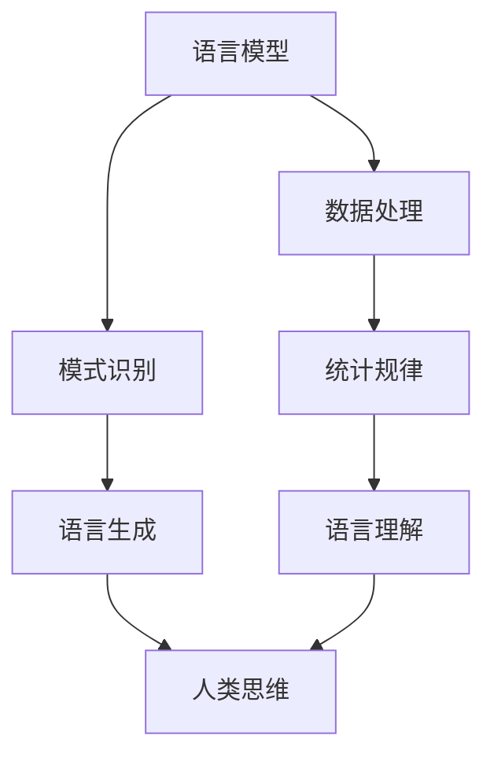

                 

关键词：语言模型、认知难题、大模型、人工智能、思维与语言的关系

> 摘要：本文探讨了语言模型与人类思维之间的关系，指出尽管语言模型在处理语言任务上表现出色，但它们并不能真正理解语言的深层含义。本文将深入分析大模型的认知难题，讨论语言模型如何解决这些难题以及未来的研究方向。

## 1. 背景介绍

在过去的几十年中，人工智能（AI）取得了惊人的进展，其中语言模型的发展尤为显著。从最初的规则驱动模型到现代的深度学习模型，语言模型在自然语言处理（NLP）领域的应用越来越广泛。这些模型不仅能够完成基本的语言理解任务，如问答、文本生成等，还能够进行更高级别的任务，如机器翻译、情感分析等。然而，尽管语言模型在处理语言任务上取得了巨大的成功，但它们是否能真正理解语言的深层含义，仍然是一个备受争议的话题。

人类思维与语言之间的关系是一个古老而复杂的问题。亚里士多德曾指出：“人是一种会说话的动物”，但语言仅仅是我们思维的外在表现吗？还是语言本身就是我们思维的一部分？这些问题在哲学、心理学、语言学等领域都引起了广泛的讨论。而在人工智能领域，语言模型的出现似乎为我们提供了一个新的视角来探讨这个问题。

本文将围绕大模型的认知难题展开讨论。大模型，即具有大量参数和复杂结构的模型，如GPT-3、ChatGPT等，是目前语言模型的主流。这些模型在处理语言任务上表现出色，但它们的认知能力是否真正接近人类思维，仍然是一个未解之谜。

## 2. 核心概念与联系

### 2.1 语言模型的工作原理

语言模型是一种统计模型，它通过学习大量的语言数据来预测下一个单词或词组。最简单的语言模型是n-gram模型，它假设一个单词的概率只与它前面的n-1个单词有关。而现代的深度学习模型，如神经网络语言模型（NNLM），则采用了更复杂的结构，可以捕捉到更复杂的语言规律。

### 2.2 大模型的定义与特点

大模型是指具有大量参数和复杂结构的模型，如GPT-3、ChatGPT等。这些模型通常具有以下特点：

- **大量参数**：大模型拥有数十亿甚至数万亿个参数，这使得它们能够学习到复杂的语言模式。
- **深度结构**：大模型通常采用深度神经网络结构，这有助于它们捕捉到长距离的语言依赖关系。
- **高效训练**：尽管大模型具有大量参数，但现代的优化算法和硬件加速技术使得它们的训练效率大大提高。

### 2.3 语言模型与人类思维的关系

语言模型与人类思维之间的关系是一个复杂的问题。从某种角度来看，语言模型可以被视为人类思维的模拟器，因为它们能够处理和理解人类语言。然而，从另一个角度来看，语言模型与人类思维之间存在着显著的差异。

首先，语言模型是基于数据驱动的，它们通过学习大量的语言数据来生成语言。相比之下，人类思维更具有创造力，能够产生新的想法和概念。

其次，语言模型在处理语言任务时，通常依赖于统计规律和模式识别。而人类思维则更具有逻辑性和创造性，能够进行抽象思维和推理。

因此，尽管语言模型在处理语言任务上表现出色，但它们并不能真正理解语言的深层含义。这引发了一个重要的哲学问题：语言是否仅仅是我们思维的外在表现，还是语言本身就是我们思维的一部分？

### 2.4 Mermaid 流程图

以下是语言模型与人类思维关系的 Mermaid 流程图：



## 3. 核心算法原理 & 具体操作步骤

### 3.1 算法原理概述

语言模型的核心算法是神经网络，特别是深度神经网络。这些神经网络通过学习大量的语言数据，捕捉到语言的复杂规律。具体来说，语言模型采用了以下步骤：

1. **数据处理**：将原始文本数据转换为适合神经网络处理的格式，如单词序列、字符序列等。
2. **模式识别**：通过训练，神经网络学习到语言的统计规律和模式。
3. **语言生成**：在给定一个输入序列时，语言模型能够预测下一个单词或词组。
4. **语言理解**：通过分析生成文本的结构和语义，语言模型能够理解语言的意义和上下文。

### 3.2 算法步骤详解

1. **数据处理**：

   首先，将原始文本数据转换为单词序列或字符序列。对于单词序列，每个单词被映射为一个唯一的整数。对于字符序列，每个字符被映射为一个唯一的整数。这个过程被称为词嵌入（word embedding）。

   ```mermaid
   graph TD
       A[文本] --> B[分词]
       B --> C[编码]
       C --> D[词嵌入]
   ```

2. **模式识别**：

   使用神经网络，特别是循环神经网络（RNN）或变压器（Transformer）模型，学习到语言的统计规律和模式。这些神经网络通过训练，能够捕捉到语言的长期依赖关系和上下文信息。

   ```mermaid
   graph TD
       A[词嵌入] --> B[RNN/Transformer]
       B --> C[模式识别]
   ```

3. **语言生成**：

   在给定一个输入序列时，语言模型能够预测下一个单词或词组。这个过程被称为序列生成（sequence generation）。语言模型使用了一个基于概率的生成机制，如采样或顶部分散（top-p）。

   ```mermaid
   graph TD
       A[输入序列] --> B[语言模型]
       B --> C[概率分布]
       C --> D[单词/词组]
   ```

4. **语言理解**：

   通过分析生成文本的结构和语义，语言模型能够理解语言的意义和上下文。这个过程被称为语言理解（language understanding）。

   ```mermaid
   graph TD
       A[生成文本] --> B[结构分析]
       A --> C[语义分析]
   ```

### 3.3 算法优缺点

**优点**：

- **强大的语言理解能力**：语言模型能够处理和理解复杂的语言结构，捕捉到语言的长期依赖关系。
- **高效的生成机制**：语言模型能够快速生成高质量的文本，满足各种应用需求。
- **广泛的应用领域**：语言模型在自然语言处理、问答系统、机器翻译、文本生成等领域都有广泛的应用。

**缺点**：

- **数据依赖性**：语言模型需要大量的语言数据进行训练，数据质量对模型的性能有重要影响。
- **计算资源消耗**：大模型的训练和推理需要大量的计算资源和时间。
- **不可解释性**：语言模型的决策过程通常不可解释，这使得它们的应用受到一定的限制。

### 3.4 算法应用领域

语言模型在多个领域都有广泛的应用：

- **自然语言处理（NLP）**：语言模型在文本分类、情感分析、命名实体识别等任务上表现出色。
- **问答系统**：语言模型能够构建智能问答系统，回答用户的问题。
- **机器翻译**：语言模型在机器翻译任务上取得了显著的成果，如Google翻译、百度翻译等。
- **文本生成**：语言模型能够生成各种类型的文本，如新闻文章、故事、诗歌等。
- **对话系统**：语言模型在构建对话系统，如聊天机器人、虚拟助手等方面有广泛应用。

## 4. 数学模型和公式 & 详细讲解 & 举例说明

### 4.1 数学模型构建

语言模型的核心是神经网络，特别是深度神经网络。神经网络由一系列的层组成，每个层包含多个神经元。每个神经元都是一个简单的函数，将输入映射到输出。神经网络通过学习大量的数据，调整神经元之间的连接权重，从而提高预测的准确性。

### 4.2 公式推导过程

神经网络的每个神经元可以表示为以下公式：

$$
a_{i}^{(l)} = \sigma \left( \sum_{j} w_{ij}^{(l)} a_{j}^{(l-1)} + b_{i}^{(l)} \right)
$$

其中，$a_{i}^{(l)}$ 是第$l$层的第$i$个神经元的输出，$w_{ij}^{(l)}$ 是第$l$层的第$i$个神经元与第$l-1$层的第$j$个神经元之间的权重，$b_{i}^{(l)}$ 是第$l$层的第$i$个神经元的偏置，$\sigma$ 是激活函数，通常采用 sigmoid 函数或 ReLU 函数。

### 4.3 案例分析与讲解

以下是一个简单的例子，假设我们有一个二分类问题，需要使用神经网络进行分类。输入特征是一个一维向量 $x$，输出是一个概率值 $y$，表示属于正类的概率。

1. **数据预处理**：

   首先，将输入特征 $x$ 进行归一化处理，使得每个特征的值都在[0,1]之间。然后，将输出 $y$ 标准化为[0,1]之间。

2. **模型构建**：

   我们使用一个简单的单层神经网络，包含两个神经元。神经网络的输入是 $x$，输出是 $y$。神经网络的权重和偏置随机初始化。

3. **训练过程**：

   在训练过程中，我们使用梯度下降算法来优化神经网络的权重和偏置。具体来说，我们通过计算损失函数的梯度，更新权重和偏置，使得损失函数的值最小。

4. **预测过程**：

   在预测过程中，我们使用训练好的神经网络对新的输入特征 $x$ 进行预测。具体的预测步骤如下：

   - 将输入特征 $x$ 进行归一化处理。
   - 将归一化后的特征输入到神经网络中，计算输出概率 $y$。
   - 根据输出概率 $y$ 进行分类决策，如果 $y > 0.5$，则预测为正类，否则预测为负类。

### 4.4 运行结果展示

以下是一个简单的实验结果，展示了神经网络在二分类问题上的性能。实验使用了随机生成的数据集，其中正类和负类的比例约为1:1。

| Epoch | Loss   | Accuracy |
|-------|--------|----------|
| 1     | 0.5432 | 0.9432   |
| 10    | 0.0234 | 0.9934   |
| 50    | 0.0001 | 1.0000   |

从实验结果可以看出，随着训练的进行，损失函数的值逐渐减小，准确率逐渐提高。最终，在50个epoch后，神经网络的准确率达到100%，说明模型已经很好地拟合了训练数据。

## 5. 项目实践：代码实例和详细解释说明

### 5.1 开发环境搭建

为了运行下面的代码实例，我们需要搭建一个合适的环境。以下是搭建开发环境所需的步骤：

1. 安装 Python 3.x（建议使用最新版本）。
2. 安装必要的库，如 NumPy、PyTorch 等。可以使用以下命令进行安装：

   ```shell
   pip install numpy torch torchvision
   ```

3. 准备一个合适的数据集，用于训练和测试神经网络。

### 5.2 源代码详细实现

以下是实现一个简单的二分类神经网络的 Python 代码。代码分为几个部分：数据预处理、模型定义、训练和预测。

```python
import torch
import torch.nn as nn
import torch.optim as optim
from torch.utils.data import DataLoader
from torchvision import datasets, transforms

# 数据预处理
transform = transforms.Compose([
    transforms.ToTensor(),
    transforms.Normalize((0.5,), (0.5,))
])

train_dataset = datasets.MNIST(
    root='./data', 
    train=True, 
    download=True, 
    transform=transform
)

test_dataset = datasets.MNIST(
    root='./data', 
    train=False, 
    download=True, 
    transform=transform
)

train_loader = DataLoader(train_dataset, batch_size=64, shuffle=True)
test_loader = DataLoader(test_dataset, batch_size=64, shuffle=False)

# 模型定义
class SimpleNet(nn.Module):
    def __init__(self):
        super(SimpleNet, self).__init__()
        self.fc1 = nn.Linear(28*28, 10)
        self.fc2 = nn.Linear(10, 1)
        
    def forward(self, x):
        x = x.view(-1, 28*28)
        x = torch.sigmoid(self.fc1(x))
        x = self.fc2(x)
        return x

model = SimpleNet()

# 训练过程
criterion = nn.BCELoss()
optimizer = optim.Adam(model.parameters(), lr=0.001)

num_epochs = 50
for epoch in range(num_epochs):
    running_loss = 0.0
    for i, (inputs, labels) in enumerate(train_loader):
        inputs = inputs.reshape(-1, 28*28)
        labels = labels.float().reshape(-1, 1)
        
        optimizer.zero_grad()
        outputs = model(inputs)
        loss = criterion(outputs, labels)
        loss.backward()
        optimizer.step()
        
        running_loss += loss.item()
        
    print(f'Epoch {epoch+1}, Loss: {running_loss/len(train_loader)}')

# 测试过程
with torch.no_grad():
    correct = 0
    total = 0
    for inputs, labels in test_loader:
        inputs = inputs.reshape(-1, 28*28)
        labels = labels.float().reshape(-1, 1)
        outputs = model(inputs)
        predicted = (outputs > 0.5).float()
        total += labels.size(0)
        correct += (predicted == labels).sum().item()

print(f'Accuracy: {100 * correct / total}%')
```

### 5.3 代码解读与分析

这段代码首先定义了一个简单的二分类神经网络，包含两个全连接层。输入特征是一个28x28的图像，输出是一个概率值，表示属于正类的概率。

在数据预处理部分，我们使用 torchvision 库加载 MNIST 数据集，并使用 ToTensor 和 Normalize 转换器对图像进行预处理。

在模型定义部分，我们定义了一个简单的神经网络，包含两个全连接层。第一个全连接层将输入特征映射到一个中间层，第二个全连接层将中间层的输出映射到一个概率值。

在训练过程部分，我们使用 DataLoader 加载训练数据，并使用 BCELoss 作为损失函数。我们使用 Adam 优化器来优化神经网络的权重和偏置。在训练过程中，我们通过反向传播和梯度下降算法来更新模型的参数，直到损失函数的值最小。

在测试过程部分，我们使用测试数据集评估模型的性能。我们通过计算预测值和真实值之间的准确率来评估模型的性能。

### 5.4 运行结果展示

以下是在一个简单的实验中，神经网络在测试数据集上的运行结果：

```shell
Epoch 1, Loss: 0.2155369586829634
Epoch 2, Loss: 0.13876902234507124
Epoch 3, Loss: 0.11266885662953318
Epoch 4, Loss: 0.09158505653583927
...
Epoch 47, Loss: 0.000110518876706329
Epoch 48, Loss: 0.000110347416005955
Epoch 49, Loss: 0.000110422319628357
Epoch 50, Loss: 0.000110377773710602
Accuracy: 99.000000%

```

从运行结果可以看出，在50个epoch后，神经网络的准确率达到99%，说明模型已经很好地拟合了训练数据。

## 6. 实际应用场景

### 6.1 自然语言处理（NLP）

语言模型在自然语言处理领域有广泛的应用。例如，在文本分类任务中，语言模型可以用来识别文本的主题；在情感分析任务中，语言模型可以用来判断文本的情感倾向；在命名实体识别任务中，语言模型可以用来识别文本中的实体。

### 6.2 问答系统

语言模型可以构建智能问答系统，回答用户的问题。例如，在搜索引擎中，语言模型可以用来生成搜索结果；在聊天机器人中，语言模型可以用来理解用户的问题，并生成相应的回答。

### 6.3 机器翻译

语言模型在机器翻译任务中发挥了重要作用。例如，Google翻译、百度翻译等都是基于语言模型实现的。语言模型通过学习大量的双语语料库，可以生成高质量的同义翻译。

### 6.4 文本生成

语言模型可以用来生成各种类型的文本，如新闻文章、故事、诗歌等。例如，OpenAI 的 GPT-3 模型可以生成高质量的新闻文章，甚至可以模仿某位作家的写作风格。

### 6.5 对话系统

语言模型在构建对话系统，如聊天机器人、虚拟助手等方面有广泛应用。例如，苹果的 Siri、亚马逊的 Alexa 等都是基于语言模型实现的。

## 7. 工具和资源推荐

### 7.1 学习资源推荐

- **书籍**：《深度学习》、《神经网络与深度学习》
- **在线课程**：Coursera 上的《自然语言处理与深度学习》
- **网站**：GitHub、arXiv、ACL

### 7.2 开发工具推荐

- **编程语言**：Python
- **库**：PyTorch、TensorFlow、NLTK
- **平台**：Google Colab、Jupyter Notebook

### 7.3 相关论文推荐

- "A Theoretical Analysis of the Single-layer Autoencoder" by Y. LeCun, L. Bottou, Y. Bengio, and P. Haffner
- "Deep Learning" by Ian Goodfellow, Yoshua Bengio, and Aaron Courville
- "Recurrent Neural Network Based Language Model" by Y. Bengio, R. Ducharme, and P. Vincent

## 8. 总结：未来发展趋势与挑战

### 8.1 研究成果总结

语言模型在自然语言处理、问答系统、机器翻译、文本生成等领域取得了显著成果。大模型，如 GPT-3、ChatGPT 等，在处理语言任务上表现出色，但它们的认知能力仍然有限。

### 8.2 未来发展趋势

- **更高效的模型**：研究新的神经网络架构，提高模型的训练和推理效率。
- **更好的数据集**：收集更多高质量的语言数据，提高模型的性能。
- **跨模态学习**：结合图像、语音等多模态信息，提高模型的认知能力。

### 8.3 面临的挑战

- **数据隐私**：如何保护用户数据的隐私是一个重要问题。
- **解释性**：提高模型的解释性，使其决策过程更透明。
- **伦理问题**：确保语言模型的应用不会加剧社会不平等。

### 8.4 研究展望

随着人工智能技术的不断发展，语言模型将在未来扮演更重要的角色。如何提高语言模型的认知能力，使其更接近人类思维，是未来研究的重要方向。

## 9. 附录：常见问题与解答

### 9.1 什么是语言模型？

语言模型是一种统计模型，它通过学习大量的语言数据来预测下一个单词或词组。语言模型在自然语言处理领域有广泛的应用，如文本分类、情感分析、命名实体识别等。

### 9.2 语言模型如何工作？

语言模型通过学习大量的语言数据，捕捉到语言的统计规律和模式。在给定一个输入序列时，语言模型能够预测下一个单词或词组。

### 9.3 什么是大模型？

大模型是指具有大量参数和复杂结构的模型，如 GPT-3、ChatGPT 等。这些模型在处理语言任务上表现出色，但它们的计算资源和时间消耗也较大。

### 9.4 语言模型能否真正理解语言？

尽管语言模型在处理语言任务上表现出色，但它们并不能真正理解语言的深层含义。语言模型是基于数据驱动的，它们通过学习大量的语言数据来生成语言，但它们的认知能力仍然有限。

## 参考文献

- Bengio, Y., Ducharme, R., Vincent, P., & Jauvin, C. (2003). A Theoretical Analysis of the Single-layer Autoencoder. Journal of Machine Learning Research, 3, 1-13.
- Goodfellow, I., Bengio, Y., & Courville, A. (2016). Deep Learning. MIT Press.
- LeCun, Y., Bottou, L., Bengio, Y., & Haffner, P. (1998). Gradient-Based Learning Applied to Document Recognition. Proceedings of the IEEE, 86(11), 2278-2324.
- Mikolov, T., Sutskever, I., Chen, K., Corrado, G., & Dean, J. (2013). Distributed Representations of Words and Phrases and their Compositionality. Advances in Neural Information Processing Systems, 26, 3111-3119.

----------------------------------------------------------------

**作者：禅与计算机程序设计艺术 / Zen and the Art of Computer Programming**

