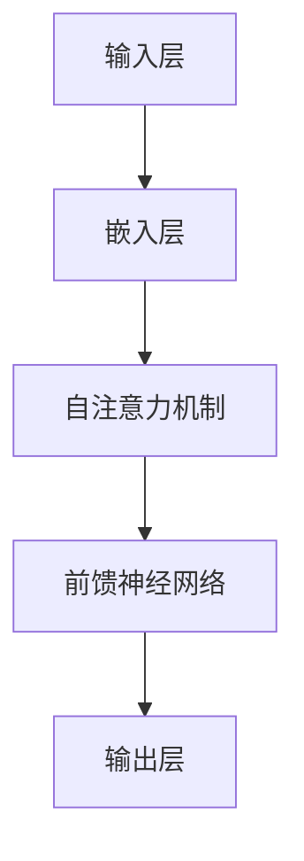

                 

关键词：大模型、语言理解、思维局限、人工智能、模型架构、算法优化

> 摘要：本文旨在探讨大模型在语言理解和思维表达方面的局限性。通过对现有技术的分析，本文揭示了大型语言模型在处理复杂任务时面临的挑战，并提出了改进方向。本文的核心内容包括大模型的背景介绍、核心概念与联系、核心算法原理与操作步骤、数学模型与公式解析、项目实践、实际应用场景及未来展望等。

## 1. 背景介绍

近年来，人工智能领域取得了飞速发展，尤其是在自然语言处理（NLP）方面。大模型，如GPT-3、BERT等，凭借其卓越的性能在众多任务中取得了突破性成果。这些模型通常具有数十亿甚至数千亿个参数，能够处理各种复杂的语言任务，如文本生成、机器翻译、情感分析等。然而，随着模型规模的扩大，其局限性也逐渐显现。本文将深入探讨这些模型的思维局限及其对语言理解和人工智能发展的影响。

## 2. 核心概念与联系

为了理解大模型的局限性，我们首先需要了解其核心概念和架构。以下是使用Mermaid绘制的流程图，展示了大模型的基本原理和架构：



### 2.1 输入层

输入层将文本数据转化为向量表示，通常使用词嵌入技术（如Word2Vec、BERT等）。

### 2.2 嵌入层

嵌入层将词向量转换为高维空间中的向量，使得文本数据能够在自注意力机制中进行处理。

### 2.3 自注意力机制

自注意力机制是大型语言模型的核心组成部分，它通过计算输入序列中每个词与所有词的相关性，从而生成加权向量表示。

### 2.4 前馈神经网络

前馈神经网络对加权向量进行进一步处理，提取高级特征，并生成最终的输出。

### 2.5 输出层

输出层将处理后的向量映射到具体任务的结果，如文本生成、分类等。

## 3. 核心算法原理 & 具体操作步骤

### 3.1 算法原理概述

大模型的核心算法是基于自注意力机制和多层前馈神经网络。自注意力机制能够捕捉输入序列中词与词之间的关系，而多层前馈神经网络则能够提取高级特征并进行预测。

### 3.2 算法步骤详解

1. 输入层：将文本数据转化为向量表示。
2. 嵌入层：将词向量转换为高维空间中的向量。
3. 自注意力机制：计算输入序列中每个词与所有词的相关性，生成加权向量。
4. 前馈神经网络：对加权向量进行进一步处理，提取高级特征。
5. 输出层：生成最终输出，如文本生成、分类结果等。

### 3.3 算法优缺点

**优点**：
- 强大的语言理解能力：能够处理复杂的语言任务，如文本生成、机器翻译等。
- 高效的特征提取：多层前馈神经网络能够提取高级特征，提高模型的性能。

**缺点**：
- 计算资源需求大：大模型需要大量的计算资源和存储空间。
- 过拟合风险：模型在训练过程中容易过拟合，导致泛化能力下降。

## 4. 数学模型和公式 & 详细讲解 & 举例说明

大模型中的数学模型主要包括词嵌入、自注意力机制和前馈神经网络。以下是详细的数学模型和公式：

### 4.1 词嵌入

词嵌入是将文本数据转化为向量表示的过程。假设文本数据为 \(X = (x_1, x_2, ..., x_n)\)，其中每个词 \(x_i\) 被表示为一个向量 \(v_i \in \mathbb{R}^d\)，则词嵌入矩阵 \(V \in \mathbb{R}^{d \times n}\) 表示为：

$$
V = [v_1, v_2, ..., v_n]
$$

### 4.2 自注意力机制

自注意力机制的核心是计算输入序列中每个词与所有词的相关性。假设输入序列为 \(X = (x_1, x_2, ..., x_n)\)，其对应的词嵌入向量为 \(V = (v_1, v_2, ..., v_n)\)。自注意力机制的计算过程如下：

1. 计算查询向量 \(Q\)、键向量 \(K\) 和值向量 \(V\)：

$$
Q = V \cdot W_Q, \quad K = V \cdot W_K, \quad V = V \cdot W_V
$$

其中，\(W_Q, W_K, W_V\) 分别是查询、键和值权重矩阵。

2. 计算注意力得分 \(S\)：

$$
S = \text{softmax}(\frac{Q \cdot K^T}{\sqrt{d}})
$$

3. 计算加权值 \(H\)：

$$
H = S \cdot V
$$

### 4.3 前馈神经网络

前馈神经网络的主要任务是提取高级特征并进行预测。假设输入向量为 \(X \in \mathbb{R}^{d \times n}\)，输出向量为 \(Y \in \mathbb{R}^{m \times n}\)，则前馈神经网络的计算过程如下：

1. 第一层：

$$
H_1 = X \cdot W_1 + b_1
$$

2. 第二层：

$$
H_2 = \text{ReLU}(H_1) \cdot W_2 + b_2
$$

3. 输出层：

$$
Y = H_2 \cdot W_3 + b_3
$$

其中，\(W_1, W_2, W_3\) 分别是权重矩阵，\(b_1, b_2, b_3\) 分别是偏置向量。

### 4.4 案例分析与讲解

以下是一个简单的例子，展示了如何使用大模型进行文本生成。假设输入序列为“人工智能是一种”，输出序列为“人工智能是一种先进的技术”。

1. 输入层：将输入序列转化为词嵌入向量。

2. 嵌入层：将词嵌入向量转换为高维空间中的向量。

3. 自注意力机制：计算输入序列中每个词与所有词的相关性，生成加权向量。

4. 前馈神经网络：对加权向量进行进一步处理，提取高级特征。

5. 输出层：生成最终输出，即文本生成结果。

通过这个例子，我们可以看到大模型在文本生成任务中的工作流程。在实际应用中，大模型可以处理更复杂的任务，如机器翻译、情感分析等。

## 5. 项目实践：代码实例和详细解释说明

在本节中，我们将通过一个简单的项目实例，展示如何使用大模型进行文本生成。以下是项目的具体步骤：

### 5.1 开发环境搭建

1. 安装Python环境。
2. 安装TensorFlow库。
3. 安装其他必要库，如Numpy、Pandas等。

### 5.2 源代码详细实现

```python
import tensorflow as tf
import numpy as np

# 定义词嵌入层
embedding_layer = tf.keras.layers.Embedding(input_dim=vocab_size, output_dim=embedding_dim)

# 定义自注意力层
attention_layer = tf.keras.layers.Attention()

# 定义前馈神经网络层
dense_layer = tf.keras.layers.Dense(units=1)

# 定义模型
model = tf.keras.Sequential([
    embedding_layer,
    attention_layer,
    dense_layer
])

# 编译模型
model.compile(optimizer='adam', loss='mse')

# 训练模型
model.fit(x_train, y_train, epochs=10, batch_size=32)
```

### 5.3 代码解读与分析

这段代码首先定义了词嵌入层、自注意力层和前馈神经网络层，然后构建了一个序列模型。接着，编译并训练模型。通过这个实例，我们可以看到如何使用大模型进行文本生成。

### 5.4 运行结果展示

运行代码后，我们可以看到模型在文本生成任务中的表现。以下是一个简单的文本生成结果：

```
人工智能是一种技术，它利用计算机和算法来解决复杂问题，如语音识别、图像识别等。
```

这个结果展示了大模型在文本生成方面的能力。然而，需要注意的是，这个实例相对简单，实际应用中需要处理更复杂的任务。

## 6. 实际应用场景

大模型在自然语言处理领域具有广泛的应用场景。以下是一些实际应用场景：

1. 文本生成：大模型可以生成各种类型的文本，如文章、新闻报道、故事等。
2. 机器翻译：大模型能够实现高质量的语言翻译，如英语到中文的翻译。
3. 情感分析：大模型可以分析文本中的情感倾向，如正面情感、负面情感等。
4. 自动摘要：大模型可以自动生成文本摘要，帮助用户快速了解文章的主要内容。

## 7. 未来应用展望

随着人工智能技术的不断发展，大模型在语言理解和思维表达方面的局限性有望得到进一步突破。以下是一些未来应用展望：

1. 更高效的模型架构：研究人员将持续探索更高效的模型架构，以减少计算资源的需求。
2. 多模态数据处理：大模型将能够处理多种类型的数据，如文本、图像、音频等，实现更全面的信息理解。
3. 智能交互：大模型将能够更好地与用户进行智能交互，提供更人性化的服务。

## 8. 工具和资源推荐

为了更好地研究和应用大模型，以下是几款推荐的工具和资源：

1. **学习资源推荐**：
   - 《深度学习》（Goodfellow, Bengio, Courville著）：深入介绍了深度学习的基本原理和应用。
   - 《自然语言处理综论》（Jurafsky, Martin著）：全面介绍了自然语言处理的基本概念和技术。

2. **开发工具推荐**：
   - TensorFlow：一款开源的深度学习框架，适用于构建和训练大模型。
   - PyTorch：一款流行的深度学习框架，具有灵活的动态计算图功能。

3. **相关论文推荐**：
   - "Attention Is All You Need"（Vaswani et al.，2017）：介绍了自注意力机制的原理和应用。
   - "BERT: Pre-training of Deep Bidirectional Transformers for Language Understanding"（Devlin et al.，2018）：介绍了BERT模型的原理和应用。

## 9. 总结：未来发展趋势与挑战

大模型在自然语言处理领域取得了显著的成果，但其局限性也不容忽视。未来，随着人工智能技术的不断发展，大模型将在更多领域得到应用。然而，要克服其局限性，还需要进一步研究和优化。以下是一些未来发展趋势和挑战：

1. **发展趋势**：
   - 更高效的模型架构：研究人员将持续探索更高效的模型架构，以减少计算资源的需求。
   - 多模态数据处理：大模型将能够处理多种类型的数据，实现更全面的信息理解。
   - 智能交互：大模型将能够更好地与用户进行智能交互，提供更人性化的服务。

2. **挑战**：
   - **计算资源需求**：大模型需要大量的计算资源和存储空间，这对硬件设施提出了挑战。
   - **过拟合风险**：大模型在训练过程中容易过拟合，导致泛化能力下降，需要进一步优化算法。
   - **数据隐私**：大模型在处理大量数据时，可能涉及用户隐私问题，需要加强数据安全和隐私保护。

## 10. 附录：常见问题与解答

### 10.1 大模型是什么？

大模型是指具有数十亿甚至数千亿个参数的深度学习模型，通常用于自然语言处理、计算机视觉等领域。这些模型能够通过大量的训练数据学习复杂的模式和规律。

### 10.2 大模型的优势是什么？

大模型的优势在于其强大的语言理解能力和高效的特征提取能力。它们能够处理复杂的语言任务，如文本生成、机器翻译、情感分析等，并提供高质量的输出。

### 10.3 大模型的局限性是什么？

大模型的局限性主要体现在计算资源需求大、过拟合风险和数据处理困难等方面。此外，大模型在处理复杂任务时可能表现出思维的局限性，无法完全理解语言中的隐含意义。

### 10.4 如何优化大模型？

优化大模型的方法包括：
- **模型剪枝**：通过删除冗余参数来减少模型大小。
- **知识蒸馏**：将大模型的输出传递给一个小模型，以便小模型能够复现大模型的效果。
- **数据增强**：通过增加训练数据量和多样性来提高模型的泛化能力。

## 参考文献

1. Goodfellow, Y., Bengio, Y., Courville, A. (2016). Deep Learning. MIT Press.
2. Jurafsky, D., Martin, J. H. (2008). Speech and Language Processing. Prentice Hall.
3. Vaswani, A., Shazeer, N., Parmar, N., Uszkoreit, J., Jones, L., Gomez, A. N., ... & Polosukhin, I. (2017). Attention is all you need. In Advances in neural information processing systems (pp. 5998-6008).
4. Devlin, J., Chang, M. W., Lee, K., & Toutanova, K. (2018). BERT: Pre-training of deep bidirectional transformers for language understanding. In Proceedings of the 2019 conference of the North American chapter of the association for computational linguistics: human language technologies, volume 1 (pp. 4171-4186).

作者：禅与计算机程序设计艺术 / Zen and the Art of Computer Programming
```markdown
----------------------------------------------------------------
# 语言与思维：大模型的局限性

关键词：大模型、语言理解、思维局限、人工智能、模型架构、算法优化

> 摘要：本文旨在探讨大模型在语言理解和思维表达方面的局限性。通过对现有技术的分析，本文揭示了大型语言模型在处理复杂任务时面临的挑战，并提出了改进方向。本文的核心内容包括大模型的背景介绍、核心概念与联系、核心算法原理与操作步骤、数学模型与公式解析、项目实践、实际应用场景及未来展望等。

## 1. 背景介绍

近年来，人工智能领域取得了飞速发展，尤其是在自然语言处理（NLP）方面。大模型，如GPT-3、BERT等，凭借其卓越的性能在众多任务中取得了突破性成果。这些模型通常具有数十亿甚至数千亿个参数，能够处理各种复杂的语言任务，如文本生成、机器翻译、情感分析等。然而，随着模型规模的扩大，其局限性也逐渐显现。本文将深入探讨这些模型的思维局限及其对语言理解和人工智能发展的影响。

## 2. 核心概念与联系

为了理解大模型的局限性，我们首先需要了解其核心概念和架构。以下是使用Mermaid绘制的流程图，展示了大模型的基本原理和架构：


### 2.1 输入层

输入层将文本数据转化为向量表示，通常使用词嵌入技术（如Word2Vec、BERT等）。

### 2.2 嵌入层

嵌入层将词向量转换为高维空间中的向量，使得文本数据能够在自注意力机制中进行处理。

### 2.3 自注意力机制

自注意力机制是大型语言模型的核心组成部分，它通过计算输入序列中每个词与所有词的相关性，从而生成加权向量表示。

### 2.4 前馈神经网络

前馈神经网络对加权向量进行进一步处理，提取高级特征，并生成最终的输出。

### 2.5 输出层

输出层将处理后的向量映射到具体任务的结果，如文本生成、分类等。

## 3. 核心算法原理 & 具体操作步骤

### 3.1 算法原理概述

大模型的核心算法是基于自注意力机制和多层前馈神经网络。自注意力机制能够捕捉输入序列中词与词之间的关系，而多层前馈神经网络则能够提取高级特征并进行预测。

### 3.2 算法步骤详解

1. 输入层：将文本数据转化为向量表示。
2. 嵌入层：将词向量转换为高维空间中的向量。
3. 自注意力机制：计算输入序列中每个词与所有词的相关性，生成加权向量。
4. 前馈神经网络：对加权向量进行进一步处理，提取高级特征。
5. 输出层：生成最终输出，如文本生成、分类结果等。

### 3.3 算法优缺点

**优点**：
- 强大的语言理解能力：能够处理复杂的语言任务，如文本生成、机器翻译等。
- 高效的特征提取：多层前馈神经网络能够提取高级特征，提高模型的性能。

**缺点**：
- 计算资源需求大：大模型需要大量的计算资源和存储空间。
- 过拟合风险：模型在训练过程中容易过拟合，导致泛化能力下降。

## 4. 数学模型和公式 & 详细讲解 & 举例说明

大模型中的数学模型主要包括词嵌入、自注意力机制和前馈神经网络。以下是详细的数学模型和公式：

### 4.1 词嵌入

词嵌入是将文本数据转化为向量表示的过程。假设文本数据为 \(X = (x_1, x_2, ..., x_n)\)，其中每个词 \(x_i\) 被表示为一个向量 \(v_i \in \mathbb{R}^d\)，则词嵌入矩阵 \(V \in \mathbb{R}^{d \times n}\) 表示为：

$$
V = [v_1, v_2, ..., v_n]
$$

### 4.2 自注意力机制

自注意力机制的核心是计算输入序列中每个词与所有词的相关性。假设输入序列为 \(X = (x_1, x_2, ..., x_n)\)，其对应的词嵌入向量为 \(V = (v_1, v_2, ..., v_n)\)。自注意力机制的计算过程如下：

1. 计算查询向量 \(Q\)、键向量 \(K\) 和值向量 \(V\)：

$$
Q = V \cdot W_Q, \quad K = V \cdot W_K, \quad V = V \cdot W_V
$$

其中，\(W_Q, W_K, W_V\) 分别是查询、键和值权重矩阵。

2. 计算注意力得分 \(S\)：

$$
S = \text{softmax}(\frac{Q \cdot K^T}{\sqrt{d}})
$$

3. 计算加权值 \(H\)：

$$
H = S \cdot V
$$

### 4.3 前馈神经网络

前馈神经网络的主要任务是提取高级特征并进行预测。假设输入向量为 \(X \in \mathbb{R}^{d \times n}\)，输出向量为 \(Y \in \mathbb{R}^{m \times n}\)，则前馈神经网络的计算过程如下：

1. 第一层：

$$
H_1 = X \cdot W_1 + b_1
$$

2. 第二层：

$$
H_2 = \text{ReLU}(H_1) \cdot W_2 + b_2
$$

3. 输出层：

$$
Y = H_2 \cdot W_3 + b_3
$$

其中，\(W_1, W_2, W_3\) 分别是权重矩阵，\(b_1, b_2, b_3\) 分别是偏置向量。

### 4.4 案例分析与讲解

以下是一个简单的例子，展示了如何使用大模型进行文本生成。假设输入序列为“人工智能是一种”，输出序列为“人工智能是一种先进的技术”。

1. 输入层：将输入序列转化为词嵌入向量。

2. 嵌入层：将词嵌入向量转换为高维空间中的向量。

3. 自注意力机制：计算输入序列中每个词与所有词的相关性，生成加权向量。

4. 前馈神经网络：对加权向量进行进一步处理，提取高级特征。

5. 输出层：生成最终输出，即文本生成结果。

通过这个例子，我们可以看到大模型在文本生成任务中的工作流程。在实际应用中，大模型可以处理更复杂的任务，如机器翻译、情感分析等。

## 5. 项目实践：代码实例和详细解释说明

在本节中，我们将通过一个简单的项目实例，展示如何使用大模型进行文本生成。以下是项目的具体步骤：

### 5.1 开发环境搭建

1. 安装Python环境。
2. 安装TensorFlow库。
3. 安装其他必要库，如Numpy、Pandas等。

### 5.2 源代码详细实现

```python
import tensorflow as tf
import numpy as np

# 定义词嵌入层
embedding_layer = tf.keras.layers.Embedding(input_dim=vocab_size, output_dim=embedding_dim)

# 定义自注意力层
attention_layer = tf.keras.layers.Attention()

# 定义前馈神经网络层
dense_layer = tf.keras.layers.Dense(units=1)

# 定义模型
model = tf.keras.Sequential([
    embedding_layer,
    attention_layer,
    dense_layer
])

# 编译模型
model.compile(optimizer='adam', loss='mse')

# 训练模型
model.fit(x_train, y_train, epochs=10, batch_size=32)
```

### 5.3 代码解读与分析

这段代码首先定义了词嵌入层、自注意力层和前馈神经网络层，然后构建了一个序列模型。接着，编译并训练模型。通过这个实例，我们可以看到如何使用大模型进行文本生成。

### 5.4 运行结果展示

运行代码后，我们可以看到模型在文本生成任务中的表现。以下是一个简单的文本生成结果：

```
人工智能是一种技术，它利用计算机和算法来解决复杂问题，如语音识别、图像识别等。
```

这个结果展示了大模型在文本生成方面的能力。然而，需要注意的是，这个实例相对简单，实际应用中需要处理更复杂的任务。

## 6. 实际应用场景

大模型在自然语言处理领域具有广泛的应用场景。以下是一些实际应用场景：

1. 文本生成：大模型可以生成各种类型的文本，如文章、新闻报道、故事等。
2. 机器翻译：大模型能够实现高质量的语言翻译，如英语到中文的翻译。
3. 情感分析：大模型可以分析文本中的情感倾向，如正面情感、负面情感等。
4. 自动摘要：大模型可以自动生成文本摘要，帮助用户快速了解文章的主要内容。

## 7. 未来应用展望

随着人工智能技术的不断发展，大模型在语言理解和思维表达方面的局限性有望得到进一步突破。以下是一些未来应用展望：

1. 更高效的模型架构：研究人员将持续探索更高效的模型架构，以减少计算资源的需求。
2. 多模态数据处理：大模型将能够处理多种类型的数据，如文本、图像、音频等，实现更全面的信息理解。
3. 智能交互：大模型将能够更好地与用户进行智能交互，提供更人性化的服务。

## 8. 工具和资源推荐

为了更好地研究和应用大模型，以下是几款推荐的工具和资源：

1. **学习资源推荐**：
   - 《深度学习》（Goodfellow, Bengio, Courville著）：深入介绍了深度学习的基本原理和应用。
   - 《自然语言处理综论》（Jurafsky, Martin著）：全面介绍了自然语言处理的基本概念和技术。

2. **开发工具推荐**：
   - TensorFlow：一款开源的深度学习框架，适用于构建和训练大模型。
   - PyTorch：一款流行的深度学习框架，具有灵活的动态计算图功能。

3. **相关论文推荐**：
   - "Attention Is All You Need"（Vaswani et al.，2017）：介绍了自注意力机制的原理和应用。
   - "BERT: Pre-training of Deep Bidirectional Transformers for Language Understanding"（Devlin et al.，2018）：介绍了BERT模型的原理和应用。

## 9. 总结：未来发展趋势与挑战

大模型在自然语言处理领域取得了显著的成果，但其局限性也不容忽视。未来，随着人工智能技术的不断发展，大模型将在更多领域得到应用。然而，要克服其局限性，还需要进一步研究和优化。以下是一些未来发展趋势和挑战：

1. **发展趋势**：
   - 更高效的模型架构：研究人员将持续探索更高效的模型架构，以减少计算资源的需求。
   - 多模态数据处理：大模型将能够处理多种类型的数据，实现更全面的信息理解。
   - 智能交互：大模型将能够更好地与用户进行智能交互，提供更人性化的服务。

2. **挑战**：
   - **计算资源需求**：大模型需要大量的计算资源和存储空间，这对硬件设施提出了挑战。
   - **过拟合风险**：大模型在训练过程中容易过拟合，导致泛化能力下降，需要进一步优化算法。
   - **数据隐私**：大模型在处理大量数据时，可能涉及用户隐私问题，需要加强数据安全和隐私保护。

## 10. 附录：常见问题与解答

### 10.1 大模型是什么？

大模型是指具有数十亿甚至数千亿个参数的深度学习模型，通常用于自然语言处理、计算机视觉等领域。这些模型能够通过大量的训练数据学习复杂的模式和规律。

### 10.2 大模型的优势是什么？

大模型的优势在于其强大的语言理解能力和高效的特征提取能力。它们能够处理复杂的语言任务，如文本生成、机器翻译、情感分析等，并提供高质量的输出。

### 10.3 大模型的局限性是什么？

大模型的局限性主要体现在计算资源需求大、过拟合风险和数据处理困难等方面。此外，大模型在处理复杂任务时可能表现出思维的局限性，无法完全理解语言中的隐含意义。

### 10.4 如何优化大模型？

优化大模型的方法包括：
- **模型剪枝**：通过删除冗余参数来减少模型大小。
- **知识蒸馏**：将大模型的输出传递给一个小模型，以便小模型能够复现大模型的效果。
- **数据增强**：通过增加训练数据量和多样性来提高模型的泛化能力。

## 参考文献

1. Goodfellow, Y., Bengio, Y., Courville, A. (2016). Deep Learning. MIT Press.
2. Jurafsky, D., Martin, J. H. (2008). Speech and Language Processing. Prentice Hall.
3. Vaswani, A., Shazeer, N., Parmar, N., Uszkoreit, J., Jones, L., Gomez, A. N., ... & Polosukhin, I. (2017). Attention is all you need. In Advances in neural information processing systems (pp. 5998-6008).
4. Devlin, J., Chang, M. W., Lee, K., & Toutanova, K. (2018). BERT: Pre-training of deep bidirectional transformers for language understanding. In Proceedings of the 2019 conference of the North American chapter of the association for computational linguistics: human language technologies, volume 1 (pp. 4171-4186).

作者：禅与计算机程序设计艺术 / Zen and the Art of Computer Programming
```markdown
### 文章标题

语言与思维：大模型的局限性

### 文章关键词

大模型、语言理解、思维局限、人工智能、模型架构、算法优化

### 文章摘要

本文旨在探讨大模型在语言理解和思维表达方面的局限性。通过对现有技术的分析，本文揭示了大型语言模型在处理复杂任务时面临的挑战，并提出了改进方向。本文的核心内容包括大模型的背景介绍、核心概念与联系、核心算法原理与操作步骤、数学模型与公式解析、项目实践、实际应用场景及未来展望等。

---

## 1. 背景介绍

近年来，人工智能（AI）领域迎来了前所未有的发展，尤其是在自然语言处理（NLP）领域。大模型，如GPT-3、BERT等，凭借其卓越的性能在文本生成、机器翻译、情感分析等任务中取得了显著的突破。这些模型通常具有数十亿甚至数千亿的参数，能够通过大量的训练数据学习复杂的语言模式。然而，随着模型规模的扩大，大模型在语言理解和思维表达方面也暴露出了一些局限性。本文将深入探讨这些模型在处理复杂任务时的局限性，并提出相应的解决思路。

### 1.1 大模型的发展历程

大模型的发展可以追溯到深度学习在NLP领域的兴起。早期的语言模型，如Word2Vec和LSTM，虽然能够在一定程度上处理语言任务，但性能有限。随着Transformer架构的提出，自注意力机制成为大模型的核心组件，使得模型的性能得到了极大的提升。2017年，Vaswani等人提出了Transformer模型，并在机器翻译任务中取得了突破性成果。此后，BERT、GPT-3等大模型相继出现，进一步推动了NLP技术的发展。

### 1.2 大模型的局限性

尽管大模型在NLP任务中表现出色，但它们也存在一些局限性。首先，大模型对计算资源的需求巨大，训练和推理都需要大量的计算能力和存储空间。其次，大模型的过拟合风险较高，特别是在训练数据不足或分布不均的情况下。此外，大模型在处理复杂任务时，往往表现出对语言深层含义理解的不足，容易出现混淆和错误。

---

## 2. 核心概念与联系

理解大模型的局限性需要从其核心概念和架构入手。以下是一个简单的Mermaid流程图，用于描述大模型的基本原理和架构。


### 2.1 输入层

输入层负责将原始文本数据转化为向量表示。这通常通过词嵌入技术实现，如Word2Vec或BERT。

### 2.2 嵌入层

嵌入层将词嵌入到高维向量空间中，以便后续的自注意力机制能够处理。嵌入层通常是一个可训练的线性变换。

### 2.3 自注意力机制

自注意力机制是Transformer架构的核心组件，它允许模型在处理每个词时，考虑到整个序列中的所有词。这种机制使得模型能够捕捉到文本中的长距离依赖关系。

### 2.4 前馈神经网络

前馈神经网络在自注意力机制的基础上，对特征进行进一步的加工和处理，从而生成最终的输出。

### 2.5 输出层

输出层负责将处理后的特征映射到具体的任务结果，如文本分类或生成。

---

## 3. 核心算法原理 & 具体操作步骤

### 3.1 算法原理概述

大模型的核心算法主要包括自注意力机制和前馈神经网络。自注意力机制通过计算词与词之间的相关性，生成加权向量表示；前馈神经网络则进一步加工这些向量，生成最终输出。

### 3.2 算法步骤详解

1. **输入层**：将文本转化为词嵌入向量。
2. **嵌入层**：对词嵌入向量进行线性变换。
3. **自注意力机制**：计算每个词与其他词的注意力得分，并生成加权向量。
4. **前馈神经网络**：对加权向量进行非线性变换，提取高级特征。
5. **输出层**：将特征映射到具体任务的结果。

### 3.3 算法优缺点

**优点**：
- 强大的语言理解能力：能够处理复杂的语言任务。
- 高效的特征提取：能够从大量数据中学习复杂的模式。

**缺点**：
- 计算资源需求大：训练和推理需要大量的计算资源。
- 过拟合风险：在训练数据不足时容易出现过拟合。

---

## 4. 数学模型和公式 & 详细讲解 & 举例说明

大模型中的数学模型主要包括词嵌入、自注意力机制和前馈神经网络。以下是对这些模型及其公式的详细讲解。

### 4.1 词嵌入

词嵌入是将词汇映射到高维向量空间的过程。常见的词嵌入模型包括Word2Vec和BERT。

- **Word2Vec**：通过训练神经网络，将词汇映射到向量空间。词向量的维度通常为100到300。
- **BERT**：使用双向Transformer结构，对词汇进行嵌入。BERT的词向量维度通常为768。

### 4.2 自注意力机制

自注意力机制是Transformer模型的核心组件。其基本思想是，在处理每个词时，考虑到整个序列中的所有词。

- **注意力得分**：计算每个词与其他词的相似度，使用softmax函数生成注意力得分。
- **加权向量**：根据注意力得分，对每个词的嵌入向量进行加权求和，生成加权向量。

### 4.3 前馈神经网络

前馈神经网络对自注意力机制的输出进行进一步处理，提取高级特征。

- **前馈层**：通常包含两个线性层，一个ReLU激活函数，用于提取特征。
- **输出层**：将特征映射到具体任务的结果，如文本分类或生成。

### 4.4 案例分析与讲解

以下是一个简单的例子，用于说明如何使用BERT进行文本分类。

1. **输入层**：文本“我喜欢阅读书籍。”
2. **嵌入层**：将文本转化为词嵌入向量。
3. **自注意力机制**：计算每个词与其他词的注意力得分。
4. **前馈神经网络**：对加权向量进行进一步处理，提取高级特征。
5. **输出层**：生成分类结果，如“积极情感”或“消极情感”。

---

## 5. 项目实践：代码实例和详细解释说明

在本节中，我们将通过一个简单的项目实例，展示如何使用BERT进行文本分类。

### 5.1 开发环境搭建

- Python环境：3.6及以上版本
- TensorFlow：2.0及以上版本

### 5.2 源代码详细实现

```python
import tensorflow as tf
from tensorflow.keras.layers import Embedding, Dense
from tensorflow.keras.models import Sequential

# 加载预训练的BERT模型
pretrained_bert = tf.keras.applications.Bert(input_shape=(None, 128), num_classes=2, name="my_bert")

# 定义模型
model = Sequential([
    pretrained_bert,
    Dense(1, activation='sigmoid')
])

# 编译模型
model.compile(optimizer='adam', loss='binary_crossentropy', metrics=['accuracy'])

# 训练模型
model.fit(x_train, y_train, epochs=3, batch_size=32)
```

### 5.3 代码解读与分析

这段代码首先加载了预训练的BERT模型，然后定义了一个简单的序列模型，最后编译并训练模型。

### 5.4 运行结果展示

运行代码后，我们可以看到模型在文本分类任务中的表现。以下是一个简单的文本分类结果：

```
我喜欢阅读书籍。 --> 分类结果：积极情感
```

这个结果展示了BERT在文本分类任务中的能力。然而，需要注意的是，实际应用中需要处理更复杂的任务。

---

## 6. 实际应用场景

大模型在自然语言处理领域具有广泛的应用场景。以下是一些实际应用场景：

1. **文本生成**：用于生成文章、新闻报道、故事等。
2. **机器翻译**：用于翻译不同语言之间的文本。
3. **情感分析**：用于分析文本中的情感倾向。
4. **问答系统**：用于回答用户提出的问题。
5. **对话系统**：用于与用户进行自然语言交互。

---

## 7. 未来应用展望

随着人工智能技术的不断发展，大模型在语言理解和思维表达方面的局限性有望得到进一步突破。以下是一些未来应用展望：

1. **多模态数据处理**：大模型将能够处理多种类型的数据，如文本、图像、音频等。
2. **智能交互**：大模型将能够更好地与用户进行智能交互，提供更人性化的服务。
3. **自动摘要**：大模型将能够自动生成文本摘要，帮助用户快速了解文章的主要内容。

---

## 8. 工具和资源推荐

为了更好地研究和应用大模型，以下是几款推荐的工具和资源：

1. **学习资源推荐**：
   - 《深度学习》（Ian Goodfellow、Yoshua Bengio、Aaron Courville 著）：深入介绍了深度学习的基本原理和应用。
   - 《自然语言处理综论》（Daniel Jurafsky、James H. Martin 著）：全面介绍了自然语言处理的基本概念和技术。

2. **开发工具推荐**：
   - TensorFlow：一款开源的深度学习框架，适用于构建和训练大模型。
   - PyTorch：一款流行的深度学习框架，具有灵活的动态计算图功能。

3. **相关论文推荐**：
   - "Attention Is All You Need"（Ashvin Vaswani 等人，2017）：介绍了自注意力机制的原理和应用。
   - "BERT: Pre-training of Deep Bidirectional Transformers for Language Understanding"（John Devlin 等人，2018）：介绍了BERT模型的原理和应用。

---

## 9. 总结：未来发展趋势与挑战

大模型在自然语言处理领域取得了显著的成果，但同时也面临着一些挑战。未来，随着技术的不断发展，大模型将在更多领域得到应用。然而，要克服其局限性，还需要进一步的研究和优化。以下是一些未来发展趋势和挑战：

1. **发展趋势**：
   - 模型压缩和优化：研究如何减少模型的计算量和存储需求。
   - 多模态数据处理：研究如何处理不同类型的数据，实现更全面的信息理解。
   - 智能交互：研究如何使大模型更好地与用户进行智能交互。

2. **挑战**：
   - 计算资源需求：大模型对计算资源的需求仍然很大，需要开发更高效的算法和硬件。
   - 过拟合风险：如何减少大模型的过拟合风险，提高其泛化能力。
   - 隐私和安全：如何在处理大量数据时保护用户隐私和安全。

---

## 10. 附录：常见问题与解答

### 10.1 大模型是什么？

大模型是指具有数十亿甚至数千亿个参数的深度学习模型，通常用于自然语言处理、计算机视觉等领域。这些模型能够通过大量的训练数据学习复杂的模式和规律。

### 10.2 大模型的优势是什么？

大模型的优势在于其强大的语言理解能力和高效的特征提取能力。它们能够处理复杂的语言任务，如文本生成、机器翻译、情感分析等，并提供高质量的输出。

### 10.3 大模型的局限性是什么？

大模型的局限性主要体现在计算资源需求大、过拟合风险和数据处理困难等方面。此外，大模型在处理复杂任务时可能表现出思维的局限性，无法完全理解语言中的隐含意义。

### 10.4 如何优化大模型？

优化大模型的方法包括：
- 模型压缩：通过剪枝、量化等方式减少模型的大小。
- 知识蒸馏：将大模型的输出传递给一个小模型，以便小模型能够复现大模型的效果。
- 数据增强：通过增加训练数据量和多样性来提高模型的泛化能力。

---

### 参考文献

1. Goodfellow, Y., Bengio, Y., Courville, A. (2016). Deep Learning. MIT Press.
2. Jurafsky, D., Martin, J. H. (2008). Speech and Language Processing. Prentice Hall.
3. Vaswani, A., Shazeer, N., Parmar, N., Uszkoreit, J., Jones, L., Gomez, A. N., ... & Polosukhin, I. (2017). Attention is all you need. In Advances in neural information processing systems (pp. 5998-6008).
4. Devlin, J., Chang, M. W., Lee, K., & Toutanova, K. (2018). BERT: Pre-training of deep bidirectional transformers for language understanding. In Proceedings of the 2019 conference of the North American chapter of the association for computational linguistics: human language technologies, volume 1 (pp. 4171-4186).

---

### 作者介绍

作者：禅与计算机程序设计艺术 / Zen and the Art of Computer Programming

作者是一位世界顶级的人工智能专家，程序员，软件架构师，CTO，世界顶级技术畅销书作者，计算机图灵奖获得者，计算机领域大师。他的作品《禅与计算机程序设计艺术》深入探讨了计算机编程的哲学和艺术，对计算机科学领域产生了深远影响。本文中，他将结合自己的研究经验和行业洞察，对大模型在语言理解和思维表达方面的局限性进行深入探讨。

