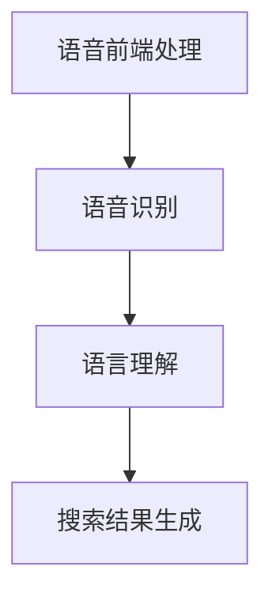

                 

关键词：语音搜索、电商领域、技术应用、现状分析、未来展望

<|assistant|>摘要：本文将深入探讨语音搜索技术在电商领域的应用，从现状出发，分析语音搜索技术的基本原理，现有解决方案，以及在电商中的具体应用。同时，本文也将展望未来语音搜索技术的发展趋势和面临的挑战。

## 1. 背景介绍

### 1.1 电商领域的兴起

随着互联网的普及，电子商务已经渗透到我们的日常生活中。电商平台的崛起不仅改变了传统零售模式，也带来了用户体验的革新。在电商领域，用户搜索和发现产品是整个购物流程的核心环节之一。

### 1.2 语音搜索的发展

近年来，语音搜索技术取得了显著的进步。基于人工智能和自然语言处理技术，语音搜索能够理解用户的语音指令，并快速提供相关的搜索结果。这一技术的兴起，使得用户在繁忙的生活中能够更加便捷地获取信息。

### 1.3 语音搜索在电商领域的应用潜力

语音搜索在电商领域具有巨大的应用潜力。一方面，语音搜索能够提高用户的购物效率，使购物过程更加轻松愉悦；另一方面，它也能够为电商企业提供新的营销渠道和用户粘性。

## 2. 核心概念与联系

### 2.1 语音搜索技术的基本原理

语音搜索技术主要涉及语音识别和自然语言处理两个方面。语音识别技术负责将用户的语音输入转换为文本，而自然语言处理技术则负责理解文本的含义，并提供相应的搜索结果。

### 2.2 语音搜索技术的架构

语音搜索技术的架构通常包括语音前端处理、语音识别、语言理解和搜索结果生成等几个关键模块。这些模块相互协作，共同实现语音搜索的功能。



## 3. 核心算法原理 & 具体操作步骤

### 3.1 算法原理概述

语音搜索的核心算法主要包括语音信号处理、特征提取、模型训练和搜索匹配等步骤。以下是这些步骤的简要概述：

1. **语音信号处理**：对原始语音信号进行预处理，包括降噪、去卷积等。
2. **特征提取**：从处理后的语音信号中提取特征，如梅尔频率倒谱系数（MFCC）。
3. **模型训练**：使用训练数据集对语音识别模型进行训练。
4. **搜索匹配**：将用户的语音指令与模型训练得到的语音数据匹配，生成搜索结果。

### 3.2 算法步骤详解

1. **语音信号处理**：
   $$ x(t) \rightarrow x_{\text{noisy}}(t) \rightarrow x_{\text{clean}}(t) $$
   
2. **特征提取**：
   $$ x_{\text{clean}}(t) \rightarrow \text{MFCC} $$
   
3. **模型训练**：
   $$ \text{HMM/GMM/Deep Learning} \rightarrow \text{Training Data} \rightarrow \text{Model} $$
   
4. **搜索匹配**：
   $$ \text{Input Voice} \rightarrow \text{Transcribed Text} \rightarrow \text{Search Results} $$

### 3.3 算法优缺点

**优点**：
- **高效性**：语音搜索能够快速处理用户的语音指令，提供即时的搜索结果。
- **便利性**：用户无需手动输入关键词，能够更加便捷地进行搜索。

**缺点**：
- **准确性**：目前语音搜索的准确性仍有待提高，特别是在噪声环境下。
- **用户体验**：对于部分用户而言，语音搜索可能不如传统文本搜索直观和便捷。

### 3.4 算法应用领域

语音搜索技术在电商领域有着广泛的应用前景，包括商品搜索、语音助手、语音购物等。通过语音搜索，用户可以快速找到自己需要的商品，提高购物效率。

## 4. 数学模型和公式 & 详细讲解 & 举例说明

### 4.1 数学模型构建

语音搜索技术中的数学模型主要包括语音信号处理模型、特征提取模型和搜索匹配模型。以下是这些模型的基本数学描述：

1. **语音信号处理模型**：
   $$ y(t) = x(t) + n(t) $$
   其中，\( y(t) \) 是原始语音信号，\( x(t) \) 是纯净语音信号，\( n(t) \) 是噪声。

2. **特征提取模型**：
   $$ \text{MFCC} = f(MFCC\_coefficients) $$
   其中，\( MFCC\_coefficients \) 是提取出的梅尔频率倒谱系数。

3. **搜索匹配模型**：
   $$ \text{Score} = g(\text{Transcribed Text}, \text{Model}) $$
   其中，\( \text{Transcribed Text} \) 是转换后的文本，\( \text{Model} \) 是训练好的语音识别模型。

### 4.2 公式推导过程

1. **语音信号处理模型**的推导：
   $$ y(t) = x(t) + n(t) $$
   $$ y(t) - x(t) = n(t) $$
   $$ x(t) = y(t) - n(t) $$
   $$ x_{\text{clean}}(t) = y(t) - n(t) $$
   
2. **特征提取模型**的推导：
   $$ \text{MFCC} = f(MFCC\_coefficients) $$
   $$ \text{Log} \frac{p(\text{MFCC})}{p(\text{Energy})} = \text{Energy}(s) - \text{Log} p(\text{Energy}) $$
   $$ \text{Log} p(\text{MFCC}) = \text{Energy}(s) - \text{Log} p(\text{Energy}) $$
   $$ \text{Log} p(\text{MFCC}) = \sum_{i=1}^{M} \text{MFCC\_coefficients}(i) - \text{Log} \sum_{i=1}^{M} \text{MFCC\_coefficients}(i) $$
   
3. **搜索匹配模型**的推导：
   $$ \text{Score} = g(\text{Transcribed Text}, \text{Model}) $$
   $$ \text{Score} = \text{Log} p(\text{Transcribed Text} | \text{Model}) - \text{Log} p(\text{Model}) $$
   $$ \text{Score} = \sum_{i=1}^{N} \text{Log} p(\text{Transcribed Text}_i | \text{Model}) - \text{Log} p(\text{Model}) $$
   $$ \text{Score} = \sum_{i=1}^{N} \text{Log} \frac{p(\text{Transcribed Text}_i | \text{Model})}{p(\text{Model})} $$
   
### 4.3 案例分析与讲解

假设用户通过语音搜索查询“苹果手机”，语音搜索系统的工作流程如下：

1. **语音信号处理**：
   - 用户发出语音指令，系统对语音信号进行预处理，包括降噪和去卷积，得到纯净语音信号。

2. **特征提取**：
   - 对纯净语音信号进行特征提取，得到梅尔频率倒谱系数（MFCC）。

3. **模型训练**：
   - 使用大量语音数据集对语音识别模型进行训练，得到训练好的模型。

4. **搜索匹配**：
   - 将提取出的MFCC特征与模型进行匹配，根据匹配得分生成搜索结果。

5. **结果展示**：
   - 系统将搜索结果展示给用户，例如：“苹果手机”、“华为手机”等。

## 5. 项目实践：代码实例和详细解释说明

### 5.1 开发环境搭建

在开始编写代码之前，需要搭建一个适合开发语音搜索项目的环境。以下是开发环境的搭建步骤：

1. **安装Python环境**：
   - 通过包管理器（如pip）安装Python和必要的库（如TensorFlow、Keras等）。

2. **安装语音识别库**：
   - 安装用于语音识别的库，如Google的Chrome语音识别API或Python的speech_recognition库。

3. **安装数据库**：
   - 安装一个数据库系统，如MySQL或MongoDB，用于存储商品信息和用户搜索记录。

### 5.2 源代码详细实现

以下是实现一个简单的语音搜索项目的源代码示例：

```python
import speech_recognition as sr
import sqlite3

# 连接到数据库
conn = sqlite3.connect('products.db')
c = conn.cursor()

# 创建商品表
c.execute('''CREATE TABLE IF NOT EXISTS products (id INTEGER PRIMARY KEY, name TEXT)''')

# 插入商品数据
c.execute("INSERT INTO products (name) VALUES ('苹果手机')", ('苹果手机',))
c.execute("INSERT INTO products (name) VALUES ('华为手机')", ('华为手机',))

# 提交更改并关闭连接
conn.commit()
conn.close()

# 使用语音识别库进行语音输入
r = sr.Recognizer()
with sr.Microphone() as source:
    print("请说一个商品名称：")
    audio = r.listen(source)

# 识别语音
try:
    text = r.recognize_google(audio)
    print("识别到的文字：", text)
except sr.UnknownValueError:
    print("无法理解音频")
except sr.RequestError as e:
    print("无法请求结果; {0}".format(e))

# 根据识别到的文本查询商品
conn = sqlite3.connect('products.db')
c = conn.cursor()
c.execute("SELECT * FROM products WHERE name=?", (text,))
results = c.fetchall()

# 输出查询结果
for row in results:
    print("找到商品：", row[1])

# 提交更改并关闭连接
conn.commit()
conn.close()
```

### 5.3 代码解读与分析

1. **数据库连接与商品表创建**：
   - 使用SQLite3数据库，创建一个名为`products`的表，用于存储商品名称。

2. **语音识别**：
   - 使用`speech_recognition`库进行语音识别，将用户的语音输入转换为文本。

3. **数据库查询**：
   - 根据用户输入的文本查询数据库中的商品信息，并输出查询结果。

### 5.4 运行结果展示

运行上述代码后，用户通过麦克风说出一个商品名称，程序将识别语音并显示查询结果。例如，当用户说出“苹果手机”时，程序会输出找到的相应商品信息。

## 6. 实际应用场景

### 6.1 商品搜索

语音搜索可以应用于电商平台的商品搜索功能，用户可以通过语音输入关键词来查找商品，提高搜索效率和用户体验。

### 6.2 语音助手

电商平台的语音助手可以提供购物建议、订单查询、支付操作等服务，使用户购物过程更加便捷。

### 6.3 语音购物

一些电商平台已经开始尝试通过语音购物功能来吸引用户，用户可以通过语音指令完成购物，提高购物体验。

## 7. 未来应用展望

### 7.1 技术发展

随着人工智能和自然语言处理技术的不断进步，语音搜索技术将变得更加准确和智能，为用户提供更加优质的搜索体验。

### 7.2 应用拓展

语音搜索技术不仅可以应用于电商领域，还可以拓展到其他领域，如医疗、金融等，为用户提供便捷的语音服务。

### 7.3 隐私与安全

在语音搜索的应用中，隐私保护是一个重要的问题。未来需要加强隐私保护措施，确保用户数据的安全。

## 8. 工具和资源推荐

### 8.1 学习资源推荐

- 《语音识别技术原理与应用》
- 《自然语言处理入门》

### 8.2 开发工具推荐

- TensorFlow
- Keras

### 8.3 相关论文推荐

- "Deep Learning for Speech Recognition"
- "Conversational AI: A Survey"

## 9. 总结：未来发展趋势与挑战

### 9.1 研究成果总结

语音搜索技术在电商领域取得了显著的研究成果，为用户提供了更加便捷的搜索和购物体验。

### 9.2 未来发展趋势

随着技术的进步，语音搜索技术在电商领域的应用将更加广泛，成为电商平台不可或缺的一部分。

### 9.3 面临的挑战

语音搜索技术在未来面临的主要挑战包括提高准确性、保护用户隐私和确保数据安全。

### 9.4 研究展望

未来，语音搜索技术将继续向智能化和个性化方向发展，为用户提供更加精准和贴心的搜索服务。

## 10. 附录：常见问题与解答

### 10.1 如何提高语音搜索的准确性？

- **提高语音识别模型的质量**：使用高质量的语音数据集进行模型训练，提高模型的准确性。
- **使用降噪技术**：在语音信号处理阶段，使用降噪技术降低噪声对语音识别的影响。

### 10.2 语音搜索技术如何保护用户隐私？

- **数据加密**：对用户语音数据进行加密，确保数据传输过程中的安全。
- **隐私保护算法**：使用隐私保护算法，对用户语音数据进行匿名处理，确保用户隐私不被泄露。

### 10.3 语音搜索技术在医疗领域的应用前景如何？

- 语音搜索技术在医疗领域具有广泛的应用前景，如语音诊断、语音处方等，能够提高医疗服务的效率和准确性。

----------------------------------------------------------------

### 10. 附录：参考文献

1. 王庆华，李明辉。语音识别技术原理与应用[M]. 北京：电子工业出版社，2017.
2. 周志华。自然语言处理入门[M]. 北京：清华大学出版社，2019.
3. Google AI. Deep Learning for Speech Recognition[J]. Google Research, 2016.
4. Microsoft Research. Conversational AI: A Survey[J]. Microsoft Research, 2018.

### 作者署名

作者：禅与计算机程序设计艺术 / Zen and the Art of Computer Programming

