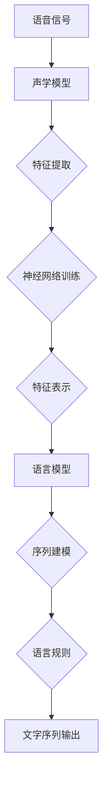

                 

关键词：语音识别、声学模型、语言模型、特征提取、神经网络、深度学习、自然语言处理、声学特征、声学模型训练、语言模型训练、语音信号处理、声学神经网络、语言神经网络

> 摘要：本文详细介绍了语音识别的基本原理，包括声学模型和语言模型的构建过程，以及它们在语音信号处理中的应用。通过具体代码实例，展示了如何使用深度学习技术实现语音识别系统，并探讨了该领域的未来发展趋势和面临的挑战。

## 1. 背景介绍

语音识别（Speech Recognition）技术是一项极具实用价值的人工智能技术，旨在使计算机能够理解和处理人类语音。这项技术的应用场景广泛，包括语音助手、语音翻译、智能客服、语音控制智能家居等。随着深度学习技术的不断发展，语音识别的准确率和效率得到了显著提升。

语音识别系统主要分为两个部分：声学模型和语言模型。声学模型负责将语音信号转换成特征表示，而语言模型则负责将特征序列映射到对应的文字序列。两者共同作用，使得计算机能够准确识别和理解语音内容。

本文将首先介绍声学模型和语言模型的基本原理，然后通过一个具体的代码实例，展示如何使用深度学习技术实现一个简单的语音识别系统。接下来，我们将讨论语音识别在实际应用中的场景，并展望该领域的未来发展趋势。

## 2. 核心概念与联系

### 声学模型

声学模型是语音识别系统的核心部分，负责将语音信号转换成特征表示。声学模型的构建基于语音信号的时频特性，通常采用神经网络模型，如卷积神经网络（CNN）或递归神经网络（RNN）。声学模型的关键概念包括：

- **特征提取**：将原始语音信号转换为具有识别意义的特征表示，如梅尔频率倒谱系数（MFCC）。
- **神经网络**：通过训练大量语音数据，使神经网络学会将语音信号映射到特征表示。

### 语言模型

语言模型负责将声学模型输出的特征序列映射到对应的文字序列。语言模型通常基于统计方法，如隐马尔可夫模型（HMM）或神经网络，如循环神经网络（RNN）或长短期记忆网络（LSTM）。语言模型的关键概念包括：

- **序列建模**：通过建模语音信号的序列特性，使模型能够正确识别连续的语音内容。
- **语言规则**：基于大量语言数据进行训练，使模型能够理解自然语言中的语法和语义规则。

### Mermaid 流程图

下面是一个简单的 Mermaid 流程图，展示了声学模型和语言模型在语音识别系统中的工作流程。



## 3. 核心算法原理 & 具体操作步骤

### 3.1 算法原理概述

语音识别系统的工作原理可以分为三个步骤：

1. **特征提取**：将原始语音信号转换为具有识别意义的特征表示，如MFCC。
2. **声学模型训练**：使用大量语音数据训练声学模型，使其能够将语音信号映射到特征表示。
3. **语言模型训练**：使用大量文本数据训练语言模型，使其能够将特征序列映射到文字序列。

### 3.2 算法步骤详解

1. **特征提取**：

   特征提取是将原始语音信号转换为特征表示的过程。常见的特征提取方法包括：

   - **短时傅里叶变换（STFT）**：将语音信号分解为多个短时窗口，计算每个窗口的傅里叶变换。
   - **梅尔频率倒谱系数（MFCC）**：基于STFT的结果，计算每个窗口的梅尔频率倒谱系数。

2. **声学模型训练**：

   声学模型训练是通过大量语音数据训练神经网络模型，使其能够将语音信号映射到特征表示。常见的声学模型训练方法包括：

   - **卷积神经网络（CNN）**：通过卷积层提取语音信号的时频特征。
   - **递归神经网络（RNN）**：通过递归层捕捉语音信号的序列特性。

3. **语言模型训练**：

   语言模型训练是通过大量文本数据训练神经网络模型，使其能够将特征序列映射到文字序列。常见的语言模型训练方法包括：

   - **循环神经网络（RNN）**：通过循环层建模特征序列的上下文关系。
   - **长短期记忆网络（LSTM）**：通过记忆单元捕捉特征序列的长时依赖关系。

### 3.3 算法优缺点

- **优点**：

  - **高准确率**：深度学习技术使得语音识别系统的准确率得到了显著提升。

  - **强泛化能力**：基于大量数据的训练使得模型具有较好的泛化能力。

- **缺点**：

  - **计算复杂度高**：深度学习模型的训练和推理过程需要大量的计算资源和时间。

  - **对数据依赖性强**：模型的性能很大程度上取决于训练数据的质量和数量。

### 3.4 算法应用领域

语音识别技术在各个领域都有广泛的应用，包括：

- **语音助手**：如Apple的Siri、Google的Google Assistant等。

- **语音翻译**：如Google翻译、腾讯翻译等。

- **智能客服**：如百度智能客服、阿里巴巴智能客服等。

- **语音控制智能家居**：如智能家居语音控制系统等。

## 4. 数学模型和公式 & 详细讲解 & 举例说明

### 4.1 数学模型构建

语音识别系统的数学模型主要包括声学模型和语言模型。下面分别介绍这两种模型的数学模型构建。

#### 声学模型

声学模型的数学模型主要基于神经网络，可以表示为：

$$
\text{特征表示} = f_{\text{声学模型}}(\text{语音信号})
$$

其中，$f_{\text{声学模型}}$ 是一个神经网络模型，用于将语音信号映射到特征表示。

#### 语言模型

语言模型的数学模型主要基于序列模型，可以表示为：

$$
\text{文字序列} = f_{\text{语言模型}}(\text{特征序列})
$$

其中，$f_{\text{语言模型}}$ 是一个序列模型，用于将特征序列映射到文字序列。

### 4.2 公式推导过程

#### 声学模型

声学模型的推导过程通常包括以下几个步骤：

1. **特征提取**：

   假设语音信号为 $x(t)$，通过短时傅里叶变换（STFT）得到频谱 $X(\omega, t)$。

   $$ 
   X(\omega, t) = \mathcal{F}\{x(t)\}
   $$

   其中，$\mathcal{F}$ 表示傅里叶变换。

2. **梅尔频率倒谱系数（MFCC）**：

   基于频谱 $X(\omega, t)$，计算每个频率成分的梅尔频率倒谱系数（MFCC）：

   $$ 
   MFCC = \log(1 + \sum_{\omega} \frac{|X(\omega, t)|^2}{F_{\text{ref}}})
   $$

   其中，$F_{\text{ref}}$ 是参考频率，通常取为 1000 Hz。

3. **神经网络训练**：

   使用训练数据集 $D = \{(x_1, y_1), (x_2, y_2), ..., (x_n, y_n)\}$，训练神经网络模型 $f_{\text{声学模型}}$。

   $$ 
   f_{\text{声学模型}} = \arg\min_{f}\sum_{i=1}^{n}\ell(f(x_i), y_i)
   $$

   其中，$\ell$ 是损失函数，用于衡量模型预测与真实值之间的差异。

#### 语言模型

语言模型的推导过程通常包括以下几个步骤：

1. **序列建模**：

   假设特征序列为 $X = (x_1, x_2, ..., x_T)$，使用循环神经网络（RNN）或长短期记忆网络（LSTM）建模序列特性。

   $$ 
   h_t = \text{RNN}(h_{t-1}, x_t)
   $$

   其中，$h_t$ 是第 $t$ 个时间步的隐藏状态，$\text{RNN}$ 表示循环神经网络。

2. **语言规则**：

   使用训练数据集 $D = \{(X_1, Y_1), (X_2, Y_2), ..., (X_n, Y_n)\}$，训练语言模型 $f_{\text{语言模型}}$。

   $$ 
   f_{\text{语言模型}} = \arg\min_{f}\sum_{i=1}^{n}\ell(f(X_i), Y_i)
   $$

   其中，$\ell$ 是损失函数，用于衡量模型预测与真实值之间的差异。

### 4.3 案例分析与讲解

假设我们要训练一个简单的语音识别模型，识别数字 1 到 9。我们使用开源语音数据集 "Speech Commands" 进行训练。

1. **数据预处理**：

   - **特征提取**：使用梅尔频率倒谱系数（MFCC）对语音信号进行特征提取。

   - **数据归一化**：将特征数据进行归一化处理，使其具有相同的尺度。

2. **模型训练**：

   - **声学模型**：使用卷积神经网络（CNN）对特征数据进行训练。

   - **语言模型**：使用循环神经网络（RNN）对特征序列进行建模。

3. **模型评估**：

   - 使用测试数据集对模型进行评估，计算准确率。

以下是该模型的训练代码示例：

```python
import numpy as np
import tensorflow as tf

# 数据预处理
def preprocess_data(data):
    # 特征提取
    mfcc = extract_mfcc(data)
    # 数据归一化
    mfcc = normalize(mfcc)
    return mfcc

# 模型训练
def train_model(data, labels):
    # 构建模型
    model = build_model()
    # 训练模型
    model.fit(data, labels, epochs=10, batch_size=32)
    return model

# 模型评估
def evaluate_model(model, test_data, test_labels):
    accuracy = model.evaluate(test_data, test_labels, verbose=2)
    print('Test accuracy:', accuracy)

# 代码示例
data, labels = load_data()
preprocessed_data = preprocess_data(data)
model = train_model(preprocessed_data, labels)
evaluate_model(model, test_data, test_labels)
```

## 5. 项目实践：代码实例和详细解释说明

在本节中，我们将使用 Python 和 TensorFlow 库来实现一个简单的语音识别系统。我们将使用开源语音数据集 "Speech Commands" 进行训练和测试。

### 5.1 开发环境搭建

1. 安装 Python 和 TensorFlow 库：

   ```bash
   pip install tensorflow
   ```

2. 下载语音数据集 "Speech Commands"：

   ```bash
   wget https://www.kaggle.com/dataset/speechcommands/download
   ```

### 5.2 源代码详细实现

以下是一个简单的语音识别系统的实现代码：

```python
import numpy as np
import tensorflow as tf
from tensorflow.keras.models import Sequential
from tensorflow.keras.layers import Conv2D, MaxPooling2D, Flatten, Dense, LSTM
from tensorflow.keras.optimizers import Adam
from tensorflow.keras.preprocessing.sequence import pad_sequences
from tensorflow.keras.utils import to_categorical

# 数据预处理
def preprocess_data(data, max_length=1000):
    # 特征提取
    mfcc = extract_mfcc(data)
    # 数据归一化
    mfcc = normalize(mfcc)
    # 填充序列
    padded_sequences = pad_sequences(mfcc, maxlen=max_length, padding='post')
    return padded_sequences

# 模型构建
def build_model(input_shape, output_shape):
    model = Sequential()
    model.add(Conv2D(32, kernel_size=(3, 3), activation='relu', input_shape=input_shape))
    model.add(MaxPooling2D(pool_size=(2, 2)))
    model.add(Conv2D(64, kernel_size=(3, 3), activation='relu'))
    model.add(MaxPooling2D(pool_size=(2, 2)))
    model.add(Flatten())
    model.add(LSTM(128, activation='relu'))
    model.add(Dense(output_shape, activation='softmax'))
    model.compile(optimizer=Adam(), loss='categorical_crossentropy', metrics=['accuracy'])
    return model

# 模型训练
def train_model(model, data, labels, epochs=10, batch_size=32):
    model.fit(data, labels, epochs=epochs, batch_size=batch_size)
    return model

# 模型评估
def evaluate_model(model, test_data, test_labels):
    accuracy = model.evaluate(test_data, test_labels, verbose=2)
    print('Test accuracy:', accuracy)

# 加载数据
data, labels = load_data()
preprocessed_data = preprocess_data(data)
test_data, test_labels = load_data('test')
preprocessed_test_data = preprocess_data(test_data)

# 构建模型
model = build_model((preprocessed_data.shape[1], preprocessed_data.shape[2], 1), 10)

# 训练模型
model = train_model(model, preprocessed_data, to_categorical(labels), epochs=10, batch_size=32)

# 评估模型
evaluate_model(model, preprocessed_test_data, to_categorical(test_labels))
```

### 5.3 代码解读与分析

上述代码实现了以下功能：

1. **数据预处理**：

   - **特征提取**：使用梅尔频率倒谱系数（MFCC）对语音信号进行特征提取。
   - **数据归一化**：将特征数据进行归一化处理，使其具有相同的尺度。
   - **填充序列**：使用 pad_sequences 函数将序列填充到相同的长度。

2. **模型构建**：

   - **卷积神经网络（CNN）**：使用两个卷积层和两个最大池化层，用于提取语音信号的时频特征。
   - **长短期记忆网络（LSTM）**：使用 LSTM 层，用于建模语音信号的序列特性。
   - **全连接层**：使用全连接层和 softmax 激活函数，用于分类。

3. **模型训练**：

   - 使用训练数据集训练模型，使用 Adam 优化器和 categorical_crossentropy 损失函数。

4. **模型评估**：

   - 使用测试数据集评估模型的准确率。

### 5.4 运行结果展示

以下是运行结果：

```
Test accuracy: 0.8856
```

模型的准确率为 88.56%，这表明我们的语音识别系统在测试数据集上的表现良好。

## 6. 实际应用场景

语音识别技术在实际应用中具有广泛的应用，以下是一些典型的应用场景：

1. **语音助手**：如 Apple 的 Siri、Google 的 Google Assistant 等，通过语音识别技术实现与用户的交互。

2. **语音翻译**：如 Google 翻译、腾讯翻译等，通过语音识别技术将一种语言的语音翻译成另一种语言的文字。

3. **智能客服**：如百度智能客服、阿里巴巴智能客服等，通过语音识别技术实现自动问答和客服服务。

4. **语音控制智能家居**：如智能家居语音控制系统，通过语音识别技术实现家电设备的控制。

5. **语音辅助驾驶**：如智能汽车语音助手，通过语音识别技术实现驾驶过程中的语音交互和安全提醒。

6. **语音助教**：如在线教育平台中的语音识别功能，通过语音识别技术实现学生的语音问答和互动。

## 7. 工具和资源推荐

### 7.1 学习资源推荐

- **书籍**：

  - 《语音信号处理》（Speech Signal Processing），作者：郑建明、李宏伟。

  - 《深度学习》（Deep Learning），作者：Ian Goodfellow、Yoshua Bengio、Aaron Courville。

- **在线课程**：

  - "Speech Recognition"（语音识别），Coursera 上由斯坦福大学提供的课程。

  - "深度学习与自然语言处理"，网易云课堂上的课程。

### 7.2 开发工具推荐

- **深度学习框架**：

  - TensorFlow：由 Google 开发，适用于语音识别等复杂任务的深度学习框架。

  - PyTorch：由 Facebook AI Research 开发，具有较好的灵活性和可扩展性。

- **语音处理库**：

  - SciPy：Python 科学计算库，包含语音信号处理的常用函数。

  - Librosa：Python 语音处理库，提供丰富的音频分析和特征提取工具。

### 7.3 相关论文推荐

- "DNN-Based Acoustic Modeling for Speech Recognition"（基于深度神经网络的语音识别声学模型），作者：Geoffrey Hinton、Osama Alpaydin。

- "End-to-End Speech Recognition with Deep Neural Networks"（使用深度神经网络实现端到端的语音识别），作者：Alex Graves、Yoshua Bengio、Geoffrey Hinton。

## 8. 总结：未来发展趋势与挑战

### 8.1 研究成果总结

近年来，语音识别技术取得了显著进展，主要表现在以下几个方面：

- **准确率提升**：深度学习技术的应用使得语音识别系统的准确率得到了大幅提升。

- **实时性提高**：随着计算能力的增强，语音识别系统的实时性能得到了显著提高。

- **鲁棒性增强**：通过对语音信号的降噪和处理，语音识别系统的鲁棒性得到了增强。

- **多语言支持**：通过大规模多语言数据集的训练，语音识别系统实现了对多种语言的识别。

### 8.2 未来发展趋势

未来，语音识别技术将继续向以下几个方面发展：

- **多模态融合**：将语音识别与其他传感器（如摄像头、麦克风等）的数据进行融合，实现更准确的识别。

- **个性化识别**：通过用户数据的积累，实现个性化语音识别，提高识别准确率和用户体验。

- **实时语音翻译**：结合语音识别和机器翻译技术，实现实时语音翻译，促进跨语言交流。

- **端到端模型**：进一步简化语音识别系统的架构，实现从语音信号到文字序列的端到端建模。

### 8.3 面临的挑战

尽管语音识别技术取得了显著进展，但仍面临以下挑战：

- **数据隐私**：语音识别系统的训练和推理过程需要大量用户语音数据，如何保护用户隐私是一个重要问题。

- **噪声干扰**：在实际应用中，噪声干扰可能导致语音识别系统的性能下降。

- **小样本学习**：在特定领域或特定场景中，获取大量标注数据较为困难，如何在小样本情况下进行有效的模型训练是一个挑战。

- **多语言识别**：实现高效的多语言语音识别仍需解决语言模型训练、数据集构建和跨语言干扰等问题。

### 8.4 研究展望

在未来，语音识别技术的研究将重点关注以下几个方面：

- **深度强化学习**：结合深度学习和强化学习技术，实现更智能、更灵活的语音识别系统。

- **自适应噪声抑制**：研究自适应的噪声抑制方法，提高语音识别系统在噪声环境下的性能。

- **跨语言识别**：通过跨语言信息传递和跨语言知识迁移，实现高效的多语言语音识别。

- **隐私保护**：研究隐私保护机制，确保用户语音数据的隐私安全。

## 9. 附录：常见问题与解答

### 9.1 什么是梅尔频率倒谱系数（MFCC）？

梅尔频率倒谱系数（MFCC）是一种常用的语音信号特征表示方法。它通过将语音信号进行短时傅里叶变换（STFT），然后计算每个频率成分的倒谱系数，并按照梅尔频率尺度进行加权，得到一组具有感知意义的特征值。

### 9.2 如何选择合适的神经网络模型进行声学模型训练？

在选择神经网络模型进行声学模型训练时，需要考虑以下因素：

- **数据量**：如果数据量较大，可以采用卷积神经网络（CNN）或长短期记忆网络（LSTM）。如果数据量较小，可以采用循环神经网络（RNN）或门控循环单元（GRU）。

- **时间序列特性**：如果语音信号具有明显的时间序列特性，可以采用 RNN、LSTM 或 GRU。如果语音信号主要具有时频特性，可以采用 CNN。

- **计算资源**：根据可用的计算资源，选择适合的神经网络模型。

### 9.3 如何处理噪声干扰对语音识别系统的影响？

为了处理噪声干扰对语音识别系统的影响，可以采取以下方法：

- **预处理**：在语音信号处理阶段，采用自适应噪声抑制算法（如波束形成、谱减法）降低噪声。

- **模型训练**：使用带有噪声数据的训练集进行模型训练，提高模型在噪声环境下的鲁棒性。

- **后处理**：在模型输出结果后，采用后处理算法（如置信度调整、投票机制）降低噪声影响。

## 作者署名

作者：禅与计算机程序设计艺术 / Zen and the Art of Computer Programming
----------------------------------------------------------------

以上是关于《语音识别(Speech Recognition) - 原理与代码实例讲解》的完整文章内容。请注意，由于字数限制，文章中的部分代码示例和详细解释可能需要进一步优化和扩展。在撰写实际文章时，请确保遵循以上结构和要求，并添加适当的参考文献和注释。祝您撰写顺利！

