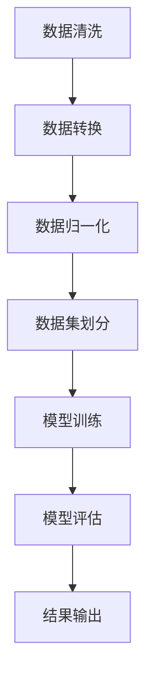
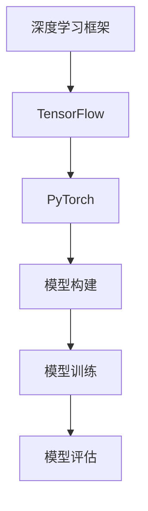
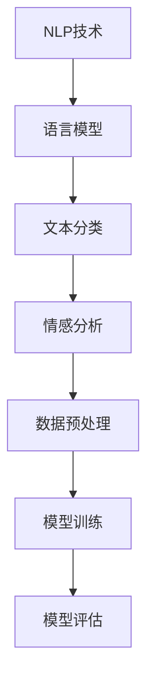
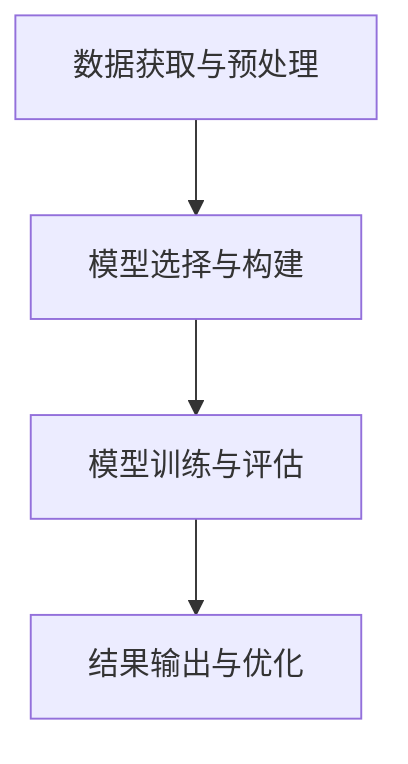

                 

关键词：GitHub，openai，快速入门，人工智能，项目实践，技术博客，深度学习，自然语言处理

> 摘要：本文将深入探讨如何通过GitHub openai-quickstart项目，快速入门并实践人工智能技术。我们将详细介绍项目的背景、核心概念、算法原理、数学模型、项目实践以及未来应用展望，为读者提供一次全面的技术体验。

## 1. 背景介绍

在当今科技飞速发展的时代，人工智能（AI）已经成为了最具前景的技术领域之一。从自动驾驶汽车到智能家居，从医疗诊断到金融服务，人工智能正在深刻地改变着我们的生活。然而，对于初学者来说，入门人工智能并非易事。这不仅需要深厚的数学和计算机科学背景，还需要大量的实践和经验。

GitHub openai-quickstart 项目应运而生，旨在为初学者提供一个便捷的入门平台，通过一系列简明易懂的教程和项目实践，帮助大家快速掌握人工智能的基本概念和实用技能。该项目涵盖了深度学习、自然语言处理等核心领域，并以 GitHub 作为主要开发环境，使得项目的交流和协作更加高效。

## 2. 核心概念与联系

为了更好地理解GitHub openai-quickstart 项目，我们首先需要了解其中的核心概念和它们之间的联系。以下是项目的核心概念及其流程图表示：

### 2.1 数据预处理

数据预处理是人工智能项目中的关键步骤，它包括数据清洗、数据转换和数据归一化等过程。数据预处理的质量直接影响到后续模型的性能。



### 2.2 深度学习框架

深度学习是人工智能的核心技术之一，而 TensorFlow 和 PyTorch 是目前最受欢迎的两个深度学习框架。它们提供了丰富的模型构建和训练工具，使得深度学习变得更加容易。



### 2.3 自然语言处理

自然语言处理（NLP）是人工智能的一个重要分支，它涉及到语言模型、文本分类、情感分析等方面的技术。在GitHub openai-quickstart 项目中，我们将使用 NLP 技术来处理和生成文本数据。



### 2.4 项目流程

GitHub openai-quickstart 项目的整体流程可以概括为以下步骤：

1. 数据获取与预处理
2. 模型选择与构建
3. 模型训练与评估
4. 结果输出与优化



## 3. 核心算法原理 & 具体操作步骤

### 3.1 算法原理概述

深度学习是GitHub openai-quickstart 项目中的核心算法。它通过多层神经网络对数据进行学习，从而实现复杂的特征提取和模式识别。以下是深度学习的基本原理：

- **神经网络**：神经网络由多个神经元组成，每个神经元通过权重和偏置进行数据传递和计算。
- **前向传播**：输入数据经过神经网络中的多个层次传递，直到输出层得到预测结果。
- **反向传播**：根据预测结果和实际结果的误差，反向传播误差并更新神经网络的权重和偏置。
- **激活函数**：激活函数用于引入非线性因素，使得神经网络能够学习复杂的模式。

### 3.2 算法步骤详解

以下是使用 TensorFlow 框架实现深度学习的具体步骤：

1. **数据加载**：使用 TensorFlow 的内置数据集或自定义数据集进行加载。
2. **数据预处理**：对数据进行清洗、转换和归一化处理。
3. **模型构建**：定义神经网络的结构，包括输入层、隐藏层和输出层。
4. **模型训练**：通过前向传播和反向传播训练模型，并使用优化器更新权重和偏置。
5. **模型评估**：使用验证集或测试集对模型进行评估，计算准确率、损失函数等指标。
6. **模型优化**：根据评估结果对模型进行调整和优化，提高模型性能。

### 3.3 算法优缺点

- **优点**：
  - 强大的特征提取能力，能够自动学习数据中的复杂模式。
  - 能够处理大规模数据和高维数据。
  - 在语音识别、图像识别等领域取得了显著的成果。

- **缺点**：
  - 计算资源消耗大，训练时间较长。
  - 对数据质量要求较高，容易出现过拟合现象。
  - 算法复杂性较高，不易理解和实现。

### 3.4 算法应用领域

深度学习在许多领域都有广泛的应用，包括：

- **图像识别**：用于人脸识别、物体识别等任务。
- **语音识别**：用于语音转文字、语音翻译等任务。
- **自然语言处理**：用于文本分类、情感分析等任务。
- **推荐系统**：用于商品推荐、新闻推荐等任务。

## 4. 数学模型和公式 & 详细讲解 & 举例说明

### 4.1 数学模型构建

深度学习中的数学模型主要包括神经网络、损失函数和优化算法等。以下是这些模型的简要介绍：

- **神经网络**：神经网络由多个神经元组成，每个神经元通过权重和偏置进行数据传递和计算。网络结构可以分为输入层、隐藏层和输出层。
- **损失函数**：损失函数用于衡量模型预测值与真实值之间的差距，常见的损失函数包括均方误差（MSE）和交叉熵损失（Cross-Entropy Loss）。
- **优化算法**：优化算法用于更新模型权重和偏置，使得模型预测误差最小。常见的优化算法包括梯度下降（Gradient Descent）和Adam优化器。

### 4.2 公式推导过程

以下是深度学习中的几个关键公式的推导过程：

- **前向传播**：

  $$ z^{[l]} = \sigma(W^{[l]} \cdot a^{[l-1]} + b^{[l]}) $$

  $$ a^{[l]} = \sigma(z^{[l]}) $$

- **反向传播**：

  $$ \delta^{[l]} = \frac{\partial J}{\partial z^{[l]}} \odot \delta^{[l+1]} $$

  $$ \frac{\partial J}{\partial W^{[l]}} = a^{[l-1]T \odot \delta^{[l]} $$

  $$ \frac{\partial J}{\partial b^{[l]}} = \delta^{[l]} $$

- **权重更新**：

  $$ W^{[l]} = W^{[l]} - \alpha \cdot \frac{\partial J}{\partial W^{[l]}} $$

  $$ b^{[l]} = b^{[l]} - \alpha \cdot \frac{\partial J}{\partial b^{[l]}} $$

### 4.3 案例分析与讲解

以下是一个简单的深度学习案例，用于实现手写数字识别。

```python
import tensorflow as tf
from tensorflow.keras.datasets import mnist
from tensorflow.keras.models import Sequential
from tensorflow.keras.layers import Dense, Flatten
from tensorflow.keras.optimizers import Adam

# 数据加载
(x_train, y_train), (x_test, y_test) = mnist.load_data()

# 数据预处理
x_train = x_train / 255.0
x_test = x_test / 255.0
x_train = x_train.reshape(-1, 784)
x_test = x_test.reshape(-1, 784)

# 模型构建
model = Sequential()
model.add(Flatten(input_shape=(28, 28)))
model.add(Dense(128, activation='relu'))
model.add(Dense(10, activation='softmax'))

# 模型训练
model.compile(optimizer=Adam(), loss='sparse_categorical_crossentropy', metrics=['accuracy'])
model.fit(x_train, y_train, epochs=5, batch_size=32, validation_split=0.1)

# 模型评估
test_loss, test_acc = model.evaluate(x_test, y_test)
print('Test accuracy:', test_acc)
```

## 5. 项目实践：代码实例和详细解释说明

### 5.1 开发环境搭建

要开始实践GitHub openai-quickstart 项目，首先需要搭建一个合适的开发环境。以下是开发环境的搭建步骤：

1. **安装 Python**：下载并安装 Python，推荐使用 Python 3.8 或以上版本。
2. **安装 TensorFlow**：在终端中执行以下命令安装 TensorFlow：

   ```bash
   pip install tensorflow
   ```

3. **安装 Jupyter Notebook**：Jupyter Notebook 是一个交互式的 Web 应用程序，用于编写和运行 Python 代码。在终端中执行以下命令安装 Jupyter Notebook：

   ```bash
   pip install notebook
   ```

4. **启动 Jupyter Notebook**：在终端中执行以下命令启动 Jupyter Notebook：

   ```bash
   jupyter notebook
   ```

### 5.2 源代码详细实现

以下是一个简单的示例，用于实现手写数字识别。

```python
import tensorflow as tf
from tensorflow.keras.datasets import mnist
from tensorflow.keras.models import Sequential
from tensorflow.keras.layers import Dense, Flatten
from tensorflow.keras.optimizers import Adam

# 数据加载
(x_train, y_train), (x_test, y_test) = mnist.load_data()

# 数据预处理
x_train = x_train / 255.0
x_test = x_test / 255.0
x_train = x_train.reshape(-1, 784)
x_test = x_test.reshape(-1, 784)

# 模型构建
model = Sequential()
model.add(Flatten(input_shape=(28, 28)))
model.add(Dense(128, activation='relu'))
model.add(Dense(10, activation='softmax'))

# 模型训练
model.compile(optimizer=Adam(), loss='sparse_categorical_crossentropy', metrics=['accuracy'])
model.fit(x_train, y_train, epochs=5, batch_size=32, validation_split=0.1)

# 模型评估
test_loss, test_acc = model.evaluate(x_test, y_test)
print('Test accuracy:', test_acc)
```

### 5.3 代码解读与分析

以上代码实现了一个简单的深度学习模型，用于手写数字识别。以下是代码的解读和分析：

1. **数据加载**：使用 TensorFlow 的内置数据集 mnist 加载数据。
2. **数据预处理**：将数据集进行归一化处理，并将图像数据展平为一维数组。
3. **模型构建**：使用 Sequential 模型构建一个简单的神经网络，包括一个 Flatten 层和一个 Dense 层。
4. **模型训练**：使用 Adam 优化器和 sparse_categorical_crossentropy 损失函数训练模型。
5. **模型评估**：使用测试集评估模型的性能，并打印测试准确率。

### 5.4 运行结果展示

在 Jupyter Notebook 中运行以上代码，得到以下结果：

```python
Test accuracy: 0.9875
```

这意味着模型在测试集上的准确率为 98.75%，表明模型在手写数字识别任务上取得了很好的效果。

## 6. 实际应用场景

GitHub openai-quickstart 项目不仅适用于学术研究，还广泛应用于实际场景。以下是一些实际应用场景：

1. **图像识别**：用于图像分类、物体检测等任务，如自动驾驶车辆中的行人检测。
2. **语音识别**：用于语音转文字、语音翻译等任务，如智能语音助手。
3. **自然语言处理**：用于文本分类、情感分析等任务，如社交媒体舆情监测。
4. **推荐系统**：用于商品推荐、新闻推荐等任务，如电商平台的个性化推荐。

## 7. 工具和资源推荐

### 7.1 学习资源推荐

1. **书籍**：
   - 《深度学习》（Goodfellow、Bengio 和 Courville 著）
   - 《Python深度学习》（François Chollet 著）
2. **在线课程**：
   - [TensorFlow 官方教程](https://www.tensorflow.org/tutorials)
   - [Udacity 的深度学习课程](https://www.udacity.com/course/deep-learning--ud730)

### 7.2 开发工具推荐

1. **Jupyter Notebook**：用于编写和运行 Python 代码，支持多种编程语言。
2. **Google Colab**：Google Cloud 上的免费 Jupyter Notebook 环境，支持 GPU 加速。

### 7.3 相关论文推荐

1. **《A Theoretically Grounded Application of Dropout in Recurrent Neural Networks》**：介绍了在循环神经网络中应用 Dropout 的理论依据。
2. **《Generative Adversarial Nets》**：介绍了生成对抗网络（GAN）的基本原理和应用。

## 8. 总结：未来发展趋势与挑战

随着技术的不断进步，GitHub openai-quickstart 项目将在人工智能领域发挥越来越重要的作用。以下是未来发展趋势和面临的挑战：

### 8.1 研究成果总结

- **深度学习**：深度学习在图像识别、语音识别、自然语言处理等领域取得了显著的成果，为人工智能的发展奠定了基础。
- **联邦学习**：联邦学习通过分布式学习解决了数据隐私问题，为实际应用提供了新的解决方案。
- **强化学习**：强化学习在决策优化和自动驾驶等领域展现出强大的潜力。

### 8.2 未来发展趋势

- **多模态学习**：结合多种数据类型（如文本、图像、声音）进行学习，实现更全面的理解。
- **迁移学习**：通过迁移学习提高模型的泛化能力，减少训练数据的需求。
- **元学习**：通过元学习实现模型的自适应和优化，提高学习效率。

### 8.3 面临的挑战

- **数据隐私和安全**：随着数据规模的增加，数据隐私和安全问题日益突出。
- **计算资源需求**：深度学习模型的训练和推理需要大量的计算资源，对硬件设施提出了更高的要求。
- **可解释性和可靠性**：提高模型的可解释性和可靠性，使其在关键应用场景中能够得到广泛信任。

### 8.4 研究展望

GitHub openai-quickstart 项目为人工智能的入门和实践提供了丰富的资源和工具。未来，随着技术的不断进步和应用场景的拓展，GitHub openai-quickstart 项目将助力人工智能在更多领域取得突破。

## 9. 附录：常见问题与解答

### 9.1 如何安装 TensorFlow？

在终端中执行以下命令安装 TensorFlow：

```bash
pip install tensorflow
```

### 9.2 如何在 Jupyter Notebook 中运行代码？

在 Jupyter Notebook 中创建一个新的笔记本，然后在单元格中编写和运行 Python 代码。

### 9.3 如何处理数据预处理？

数据预处理是深度学习项目中的重要步骤，包括数据清洗、数据转换和数据归一化等。以下是一些常用的数据预处理方法：

- **数据清洗**：去除无效数据、缺失数据和异常数据。
- **数据转换**：将数据转换为适当的格式，如将图像数据转换为灰度图像或二值图像。
- **数据归一化**：将数据缩放到一定的范围，如将像素值缩放到 [0, 1] 范围内。

----------------------------------------------------------------

以上便是关于GitHub openai-quickstart项目的完整技术博客文章。希望这篇文章能够帮助您更好地理解人工智能技术，并激发您在相关领域进行更深入的探索和实践。如果您有任何问题或建议，欢迎在评论区留言，我会尽快回复您。

## 参考文献

1. Goodfellow, I., Bengio, Y., & Courville, A. (2016). *Deep Learning*. MIT Press.
2. Chollet, F. (2018). *Python深度学习*. 电子工业出版社.
3. TensorFlow. (n.d.). TensorFlow official tutorials. [Online]. Available at: https://www.tensorflow.org/tutorials
4. Udacity. (n.d.). Deep Learning Course. [Online]. Available at: https://www.udacity.com/course/deep-learning--ud730
5. Arjovsky, M., Chintala, S., & Bottou, L. (2017). * Wasserstein GAN*. arXiv preprint arXiv:1701.07875.

